# 架构分析
---

### IM系统特点

1. 实时性：保证消息实时触达（利用轮训与长连接实现，消息提示推送与阅读消息对应操作是不同的）
2. 可靠性：保证消息不丢失和不重复（ACK机制，TCP只能保证消息数据链路层可靠，不能保证业务可靠）
3. 一致性：保证同一条消息在多人、多终端展现顺序的一致性（消息序号生成器）
4. 安全性：保证数据传输安全、数据存储安全、消息内容安全（WWS、HTTPS、TLS、AES等）

### 系统架构

即时通讯系统服务端采用了分层架构和分布式架构的组合设计方式。

#### 分布式架构

TeamTalk 是一个开源的即时通讯系统，用于实现实时消息传递和群组通信。通常作为一个独立的服务器应用程序部署，提供一系列功能和接口供客户端使用。

TeamTalk 的服务端采用了分布式架构来支持高并发和可扩展性。

虽然 TeamTalk 是一个分布式的即时通讯系统，但它并不是一个典型的微服务架构。在传统的 TeamTalk 架构中，它通常作为一个单体应用程序部署，所有的功能和服务都打包在同一个应用中。它使用内部的组件和模块来处理不同的功能，如用户管理、群组管理、消息处理等，但它们并不是独立的、自治的服务。虽然 TeamTalk 不是一个典型的微服务架构，但在某些情况下，可以将 TeamTalk 的某些功能和模块作为独立的微服务来实现，以便更好地满足特定的需求和场景。这样的拆分可能涉及到重新设计和重构现有的代码和架构，以适应微服务的原则和要求。

1. Android/IOS/PC各种客户端
2. LoginServer：主要负责负载均衡的作用，当收到客户端请求时，分配一个负载最小的MsgServer给客户端
3. MsgServer：主要服务端，负责维护各个客户端的连接，消息转发等功能
4. RouteServer：负责消息路由功能，当MsgServer发现某个用户不在本服务器内而又有消息需要发给他时，就会将消息发给routeServer，而给routeServer会将消息发给相应的MsgServer（routeServer也维护了一定的用户状态）
5. DBProxy：负责主要业务逻辑，主要与存储层打交道，提供mysql以及redis的访问服务，屏蔽其他服务器与mysql和redis的直接交互
6. FileServer：文件服务器，提供客户端之间的文件传输服务，支持在线以及离线文件传输
7. MsfsServer：图片存储服务器，提供头像、图片传输中的图片存储服务
8. PushServer：负责Android、IOS客户端提醒消息的推送，类似微信的锁屏提醒消息。
9. WebServer：简单的管理功能

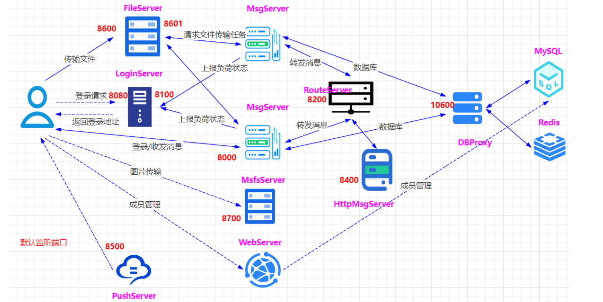

#### 系统分层架构

1. 连接层entry/gate：为客户端收发消息提供出入口，主要作用包括：

    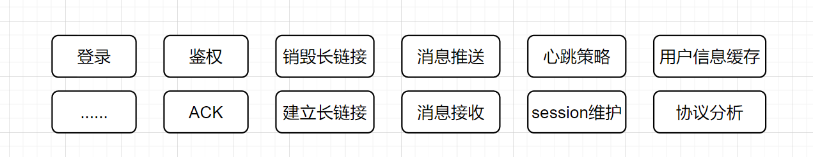

    - 保持海量用户连接，

    - 解析协议对传输内容进行编码，

    - 维护session

    - 推送消息

2. 核心业务层logic：负责IM系统各项功能的核心逻辑实现

    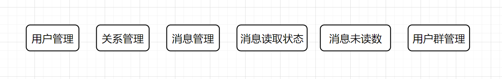

3. 路由层route：负责消息投递

    

4. 数据层data：负责IM系统相关数据的持久化存储，包括消息内容、账号信息等

    

5. 外部接口层：常用的第三方系统推送服务，苹果手机自带的APNs服务、安卓手机内置的谷歌公司GCM服务等

    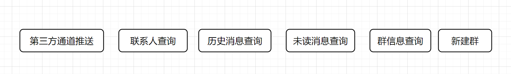

6. 基础组件：

    

##### 1.接入层

###### 连接整流与通信安全：

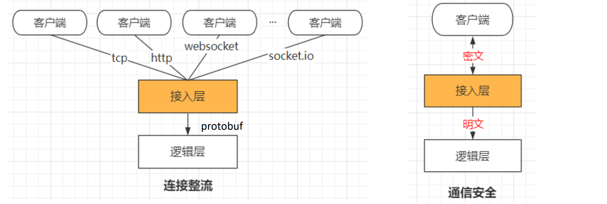

###### 报文解压缩与初步防攻击：

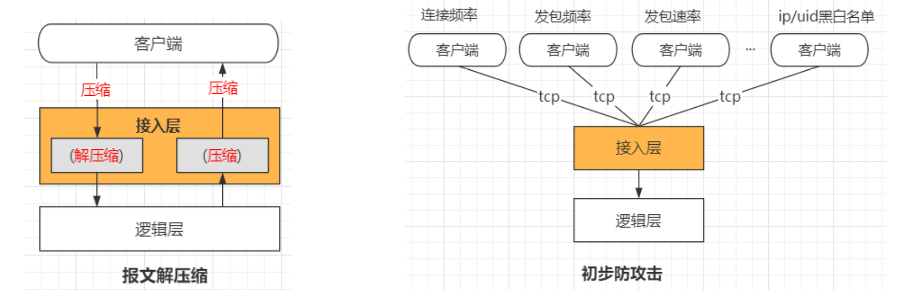

##### 2.逻辑层

1. 用户逻辑：用户登录、用户退出、用户信息查询、用户更新签名、用户分组创建
2. 好友逻辑：添加好友、删除好友、拉取好友列表、好友添加备注等
3. 群组逻辑：创建群、加入群、删除群、删除群成员等
4. 消息逻辑：单聊文字消息、单聊语音消息、群聊文字消息、群聊语音消息、拉取离线消息等
5. 其他：文件传输（需要对方点击接受）、图片传输（直接显示）

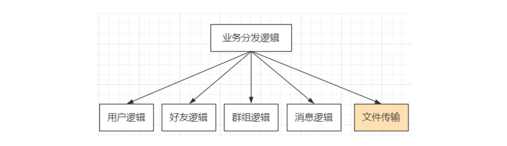

水平扩展各个逻辑模块、消息逻辑1、消息逻辑2、消息逻辑n，无缝添加新的逻辑服务如文件传输。

##### 3.数据代理层

###### 屏蔽存储引擎：

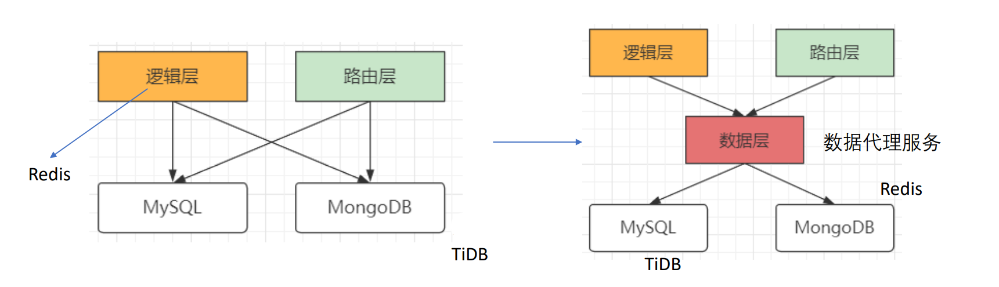

###### 屏蔽cache层：

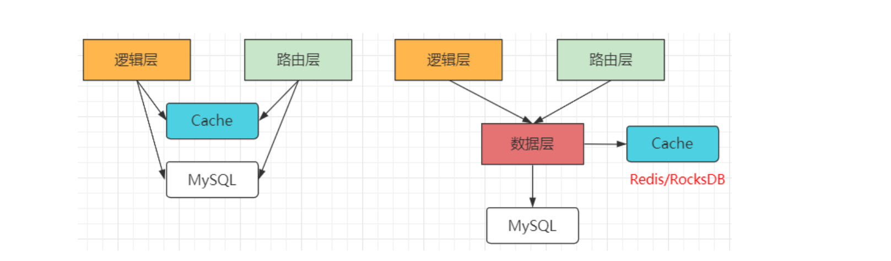

###### 提供友好接口：

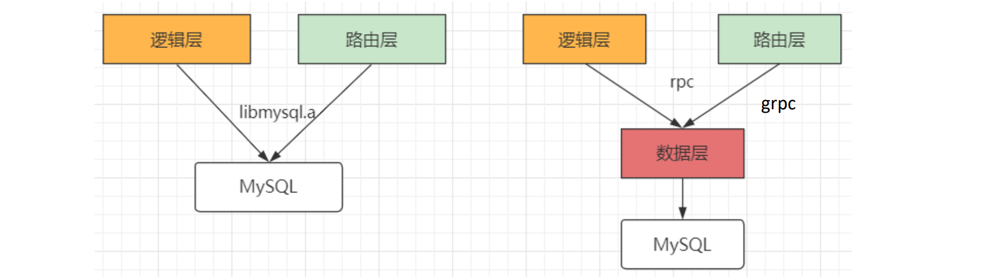

###### 提供一定扩展性：

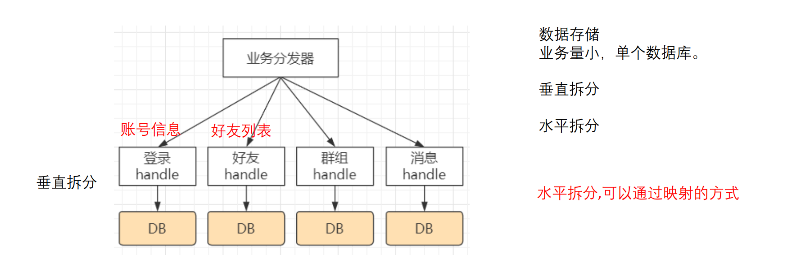

##### 4.路由层

消息投递，内存存储，用户临时数据比如用户状态信息（在线/离线等）

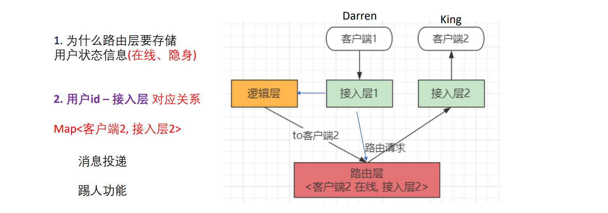

### 实际流程分析

#### 客户端登录验证

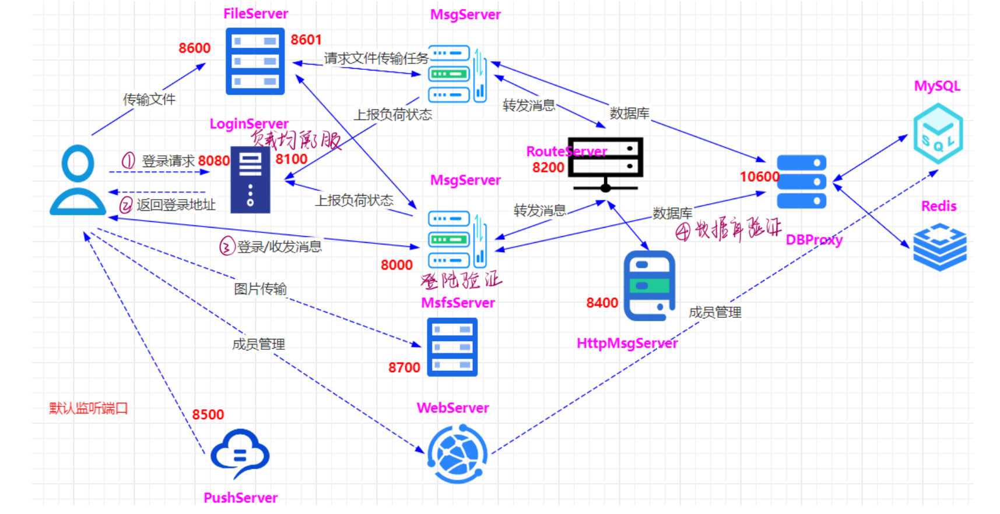

#### 即时消息发送

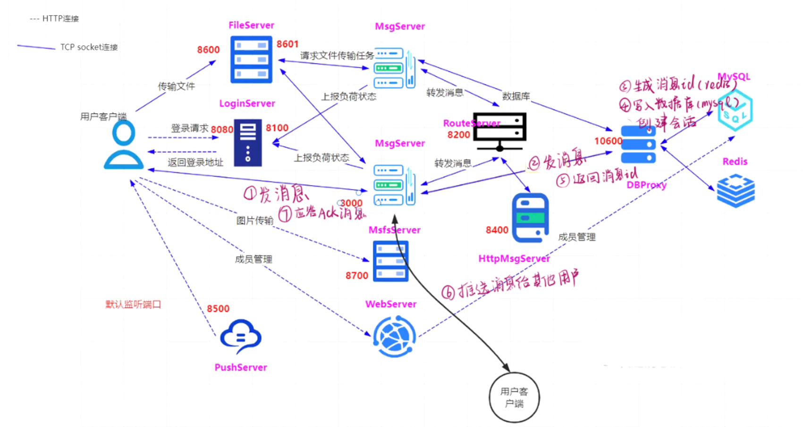

# 常见问题汇总

### 1.分布式架构与微服务的区别

#### 什么是微服务？

1. 是一种软件架构模式，
2. 将应用程序拆分为一组小型、独立的服务，每个服务都具有自己的业务逻辑和数据库专注于解决特定的业务问题，并可以独立部署、扩展和维护。
3. 服务通过轻量级的通信机制（如HTTP、消息队列等）进行通信，通过组合和协作提供复杂的应用功能。
4. 总结：微服务架构更加强调解耦和独立性，每个微服务都可以独立开发、测试、部署和扩展，使得系统更加灵活、可维护和可伸缩。

#### 什么是分布式架构？

分布式架构是指将一个大型系统或应用程序拆分成多个相互独立的组件（节点）并在不同的计算机或服务器上进行部署，这些组件通过网络进行通信和协作，共同完成系统的功能。分布式架构旨在解决单一计算机或服务器的性能限制和单点故障等问题，提高系统的可伸缩性、可用性和容错性。

在分布式架构中，不同的节点可以承担不同的角色和功能，例如服务提供者、服务消费者、数据存储节点等。这些节点通过网络互联，使用消息传递、远程过程调用（RPC）、RESTful API等方式进行通信和数据交换。

分布式架构的特点包括：

1. 可伸缩性：通过增加节点的数量来提高系统的处理能力和负载能力，可以根据需求动态扩展和收缩系统规模。
2. 高可用性：通过在不同的节点上部署相同的功能和数据，实现冗余和备份，以提供系统的高可用性和容错能力。当某个节点故障时，其他节点可以接管其工作，系统仍然可以继续运行。
3. 容错性：分布式架构可以通过在多个节点上存储和复制数据来提供容错性。即使某个节点发生故障或数据丢失，仍然可以从其他节点中恢复数据，保证系统的可靠性。
4. 灵活性和模块化：由于系统被拆分为多个独立的组件，每个组件可以独立开发、测试、部署和升级，具有更好的灵活性和可维护性。同时，不同的组件可以使用不同的技术栈和平台，使得系统更加模块化和可扩展。
5. 高性能：分布式架构可以将负载分摊到多个节点上，从而提高系统的整体性能和吞吐量。同时，分布式架构还可以利用就近计算和数据存储的优势，减少网络延迟和数据传输的开销。

分布式架构在现代的大型应用程序和系统中得到广泛应用，例如分布式数据库、分布式缓存、分布式文件系统、分布式计算等。

它提供了一种可扩展、可靠和高效的方式来构建和管理复杂的软件系统。

然而分布式架构也带来了一些挑战，如数据一致性、节点间通信、故障恢复等问题，需要通过合适的技术和方案进行解决。

#### teamtalk是分布式架构还是微服务？

1. TeamTalk 的服务端采用了分布式架构来支持高并发和可扩展性。
2. 虽然 TeamTalk 是一个分布式的即时通讯系统，但它并不是一个典型的微服务架构。在传统的 TeamTalk 架构中，它通常作为一个单体应用程序部署，所有的功能和服务都打包在同一个应用中。它使用内部的组件和模块来处理不同的功能，如用户管理、群组管理、消息处理等，但它们并不是独立的、自治的服务。虽然 TeamTalk 不是一个典型的微服务架构，但在某些情况下，可以将 TeamTalk 的某些功能和模块作为独立的微服务来实现，以便更好地满足特定的需求和场景。这样的拆分可能涉及到重新设计和重构现有的代码和架构，以适应微服务的原则和要求。

### 2.file_server与msfs_server的区别？

在TeamTalk中，file_server 和 msfs_server 是两个独立的服务器模块，分别用于 文件存储 和 文件传输。

#### file_server

- file_server是文件存储服务器，负责存储用户上传的文件，并提供文件的读取和下载功能。
- 主要用于存储用户在聊天过程中发送的文件，如图片、语音、视频等。
- file_server 将文件保存在磁盘上，并为每个文件分配一个唯一的文件ID。在聊天消息中，可以通过文件ID引用并下载对应的文件。

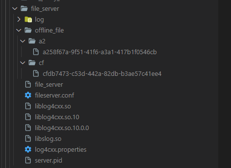

#### msfs_server

- msfs_server 是多媒体文件存储服务器，用于存储大文件和多媒体文件，支持上传和下载大文件，如音视频文件。
- 主要用于存储大文件和多媒体文件。
- 与 file_server 相比，msfs_server 具有更高的文件传输速度和并发性能。
- 它通过分片上传和断点续传的方式来支持大文件的传输，并提供了文件传输进度和速度的监控功能。

总体而言，

file_server 和 msfs_server 都是TeamTalk中用于处理文件的服务器模块，但它们的功能和应用场景略有不同。

file_server 主要用于存储聊天过程中产生的文件，而 msfs_server 则更适用于存储和传输大文件和多媒体文件。

### 3.etcd_login_server与cetcd的作用？

#### etcd_login_server

etcd_login_server是TeamTalk中的登录服务器组件，负责处理用户登录的逻辑。与etcd集群进行交互，通过etcd存储用户的登录信息和状态。

etcd_login_server使用etcd来保存用户的登录状态、用户权限、在线状态等信息。

当用户进行登录时，etcd_login_server会验证用户的身份信息，并更新用户的登录状态到etcd中。

#### cetcd

etcd是一个分布式键值存储系统，可以用于存储和检索各种类型的数据。

cetcd是一个C++的etcd客户端库，用于与etcd集群进行通信。它提供了一组API，用于连接etcd集群、执行数据的读写操作、监听etcd中的数据变化等功能。在TeamTalk中，cetcd被用于etcd_login_server与etcd集群之间的通信，实现用户登录信息的读写和状态的更新。

综上所述，etcd_login_server是TeamTalk的登录服务器组件，使用etcd来存储和管理用户的登录信息和状态。cetcd是TeamTalk中的etcd客户端库，用于etcd_login_server与etcd集群之间的通信。通过这两个组件的协作，TeamTalk能够实现用户的登录验证和状态管理功能。

每个CImUser对应⼀个登陆⽤户，CMsgConn对应⼀个端的登录，CImUser和CMsgConn是1:n的对应关系。

1. CMsgConn::HandlePdu （msg_server模块，处理客户端的请求的信息）
2. CMsgConn::_HandleClientMsgData（msg_server模块，处理客户端的消息发送，CID_MSG_DATA命令）,重新拼装pdu，主要是增加handle作为attach数据，然后发送给db_proxy_server
3. DB_PROXY::sendMessage （db_proxy_server模块），
    1. 获取消息FromId，ToId, MsgType等，并先验证消息类型MsgType是否有效 （这⾥主要先分析单聊的情况）
    2. nSessionId 服务器分配会话id：通过CSessionModel::getSessionId查询两个⼈直接的聊天是否已经建⽴最近会话记录(从IMRecentSession表)，如果没有记录则调⽤CSessionModel::addSession创建
    3. nPeerSessionId 服务器分配对端会话id：通过CSessionModel::getSessionId查询两个⼈直接的聊天是否已经建⽴最近会话记录(从IMRecentSession表)，如果没有记录则调⽤CSessionModel::addSession创建，需要注意的是nPeerSessionId和nSessionId的FromId和ToId是相反的。
    4. nRelateId：获取通话⼈之间的关系id，如果两者之前没有关系则调⽤CRelationModel::getRelationId进⾏添加（操作IMRelationShip表）
    5. nMsgId 服务器分配消息id，CMessageModel::getMsgId根据nRelateId映射进⾏获取，（FromId和ToId相互之间的nRelateId是唯⼀的，不分⽅向性，进⽽保证相互之间发送消息时消息的顺序性），msgId存储在redis中，通过key为"msg_id_" + int2string(nRelateId)进⾏获取，每次进⾏+1的递增操作
    6. CMessageModel::sendMessage 将消息插⼊到数据库（操作IMMessage_x表），发送消息和要读取消息之间存储的是同⼀条消息：nRelateId, nFromId, nToId, nMsgType, nCreateTime,nMsgId，msg_data。
    7. 然后封装响应pPduResp，最重要的是附带nMsgId和msg回发给msg_server，使⽤CID_MSG_DATA命令。⼀样是以AddResponsePdu插⼊队列，然后SendResponsePduList进⾏回发的套路。
4. CDBServConn::HandlePdu （msg_server模块，处理dbproxy回发的数据），根据CID_MSG_DATA找到对应的处理函数
5. CDBServConn::_HandleMsgData（msg_server模块）
    1. 根据attach_data的handle查找到对应的socket通路，使⽤CID_MSG_DATA_ACK告知客户端消息已经发送到服务器。
    2. get_route_serv_conn，将pdu发送给route_server， CRouteConn::HandlePdu进⾏响应，然后调⽤CRouteConn::_BroadcastMsg转发给其他msg_server。
    3. CImUser::BroadcastClientMsgData：⼴播给消息发起者，对于发起者不需要⼴播给⾃⼰的，只需要⼴播给其他端（⽐如多端登录时，PC端发送的数据，则⼴播给Android、IOS端，不⽤再⼴播给PC端），并将该消息插⼊到m_send_msg_list
    4. CImUser::BroadcastClientMsgData：⼴播给消息接收者，有⼏端登录同⼀个账号就⼴播给⼏个端，并将该消息插⼊到m_send_msg_list
    5. CID_OTHER_GET_DEVICE_TOKEN_REQ：消息推送请求，主要是针对Android和IOS，此时由从新发回给db_proxy_server， 在setDevicesToken进⾏响应，我们这⾥不继续关注它。
6. 接收的客户端写⼊消息的回应
7. 作为接收者的客户端读取消息后回应CMsgConn::_HandleClientMsgReadAck（msg_server模块），使⽤CID_MSG_READ_ACK命令。
    1. 使⽤CID_MSG_READ_NOTIFY通知其他多端登录的客户端，已经有客户端读取了该消息。
    2. 将该msg从m_send_msg_list移除。
    3. 如果客户端没有回应，则CMsgConn::OnTimer定时器定时check消息是否已经正常发送给客户端，没有收到响应则认为g_down_msg_miss_cnt++，该详细下⾏失败。

