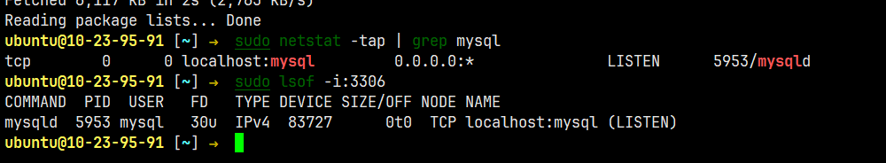
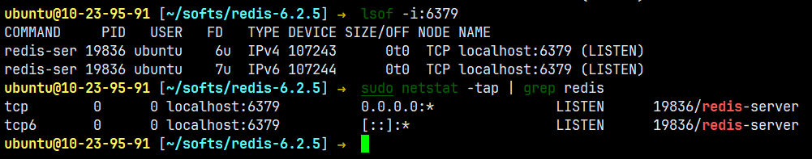
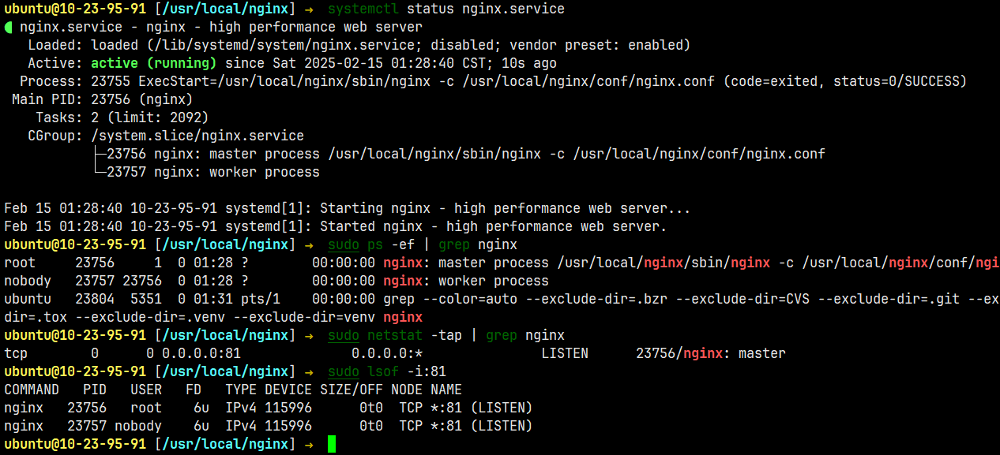

# 项目部署

---

文档地址：https://www.yuque.com/linuxer/xngi03/ol8e7u

# 1.项目编译打包

### 第三方依赖

teamtalk-server引用了很多第三方库，包括mysql、hiredis、nginx、protobuf、log4cxx等等，

服务端对pb、hiredis、mysql_client、log4cxx有依赖所以需要先安装这些依赖，可以自行安装或者执行auto目录下的自动安装脚本，

这些脚本执行完后会自动将头文件和库文件拷贝至指定的目录

- protobuf: sudo ./make_protobuf.sh

  所有的通讯协议文件都在pb目录下，其中涉及两个自动化脚本：

  - create.sh：使用protoc将协议文件转化成对应语言的源码
  - sync.sh：将生成的源码移动到目标server目录下

- log4cxx: sudo ./make_log4cxx.sh

- [已安装]hiredis: make_hiredis.sh

- [已安装]mariadb: make_mariadb.sh

### 服务器编译打包

在所有的依赖以及Pb文件都编译通过后，执行auto目录下的build.sh脚本进行服务端代码自动编译：

- sudo ./build_ubuntu.sh version 1.0
- ./build.sh version 1


整个TeamTalk工程编译完成，会在上级目录生成im_server_x.tar.gz包，该压缩包包含的内容有：

1. sync_lib_for_zip.sh: 将lib目录下的依赖库copy至各个服务器的目录下，启动服务前需要先执行一次该脚本
2. lib: 主要包含各个服务器依赖的第三方库
3. restart.sh: 启动脚本，启动方式为./restart.sh msg_server
4. login_server
5. msg_server
6. route_server
7. db_proxy_server
8. file_server
9. push_server
10. msfs

# 2.部署环境搭建

### mysql

1. 安装mysql服务器端与客户端

   ```shell
   sudo apt-get -y install mysql-server
   sudo apt-get -y install mysql-client
   ```

2. 安装mysql开发工具包

   ```shell
   sudo apt-get -y install libmysqlclient-dev
   ```

3. 验证是否安装成功

   ```shell
   sudo netstat -tap | grep mysql
   sudo lsof -i:3306 #查看数据库默认端口3306
   ```

   

4. 设置mysql账号密码：

   ```shell
   # 查看默认密码
   sudo cat /etc/mysql/debian.cnf
   # # ubuntu18.04则以无密码的方式登录
   mysql -u root -p !@#123qwe
   mysql>use mysql;
   #  更新 plugin 及 authentication_string 字段，比如密码123456
   mysql> UPDATE user SET plugin="mysql_native_password", authentication_string=PASSWORD("!@#123qwe") WHERE user="root";
   #　输出以下结果
   Query OK, 1 row affected, 1 warning (0.00 sec)
   Rows matched: 1  Changed: 1  Warnings: １
   # 保存更新结果
   mysql> FLUSH PRIVILEGES;
   # 退出并重启 mysql
   mysql> exit;
   sudo service mysql restart
   ```

5. 启动/停止/重启mysql服务

   ```shell
   service mysql start 	//启动mysql
   service mysql restart 	//重新启动mysql
   service mysql stop 		//关闭mysql
   ```

### redis/hiredis

以源码的方式进行安装，hiredis的安装在dbproxy工程中会被使用到，

1. 下载redis源码到合适的位置

   ```shell
   wget http://download.redis.io/releases/redis-6.2.5.tar.gz
   ```

2. 解压缩包并编译安装

   ```shell
   # 解压压缩包
   tar -zxvf redis-6.2.5.tar.gz
   # 编译源码
   cd redis-6.2.5
   make
   # 编译安装依赖文件
   cd deps
   make hiredis  linenoise lua jemalloc
   cd hiredis
   sudo make install
   cd ../lua
   sudo make install
   # 安装redis
   cd ../../src
   sudo make install
   ```

3. 启动Redis后台运行

   启动Redis后台运行，修改配置文件 redis.conf（在redis源码目录下）

   注意先不要设置redis授权信息auth，导致服务连不上redis

   ```shell
   # 修改配置文件
   修改 stop-writes-on-bgsave-error 设置为 no
   修改 daemonize 设置为 yes
   # 运行redis后台服务
   /home/ubuntu/softs/redis-6.2.5/src/redis-server /home/ubuntu/softs/redis-6.2.5/redis.conf
   ```

4. 验证是否安装成功

   ```shell
   sudo netstat -tap | grep redis
   sudo lsof -i:6379	# 查看6379端口监听情况
   ```

   

### nginx

1. 编译安装Nginx源码：

   ```shell
   # 安装必要的第三方依赖包
   sudo apt-get -y install libpcre3 libpcre3-dev
   sudo apt-get -y install zlib1g-dev
   sudo apt-get install openssl libssl-dev
   # 下载稳定的Nginx版本
   wget http://nginx.org/download/nginx-1.16.1.tar.gz
   # 解压编译安装
   # 安装后的执行文件路径：/usr/local/nginx/sbin/
   # 配置文件路径：/usr/local/nginx/conf/
   tar -zxvf nginx-1.16.1.tar.gz
   cd nginx-1.16.1
   ./configure --prefix=/usr/local/nginx
   make
   sudo make install
   # 创建配置文件子目录 并在nginx.conf文件中包含conf.d
   # 在末尾添加 include /usr/local/nginx/conf/conf.d/*.conf;
   # 目的是在部署即时通讯的web管理后台时将对应的.conf文件拷贝到 /usr/local/nginx/conf/conf.d 目录时就能够被 nginx.conf 包含
   sudo mkdir /usr/local/nginx/conf/conf.d
   sudo mkdir -p /usr/local/nginx/conf/conf.d/
   sudo vim /usr/local/nginx/conf/nginx.conf
   # 将默认的80端口修改为81 因为web管理后台需要占用80端口
   server {
   	listen 81;
   	server_name localhost;
   	wcharset koi8-r;
   }
   ```

2. 配置启动Nginx

   ```shell
   # 创建一个nginx.service
   # 在 /lib/systemd/system/目录下面新建一个nginx.service文件，并赋予可执行的权限
   sudo vim /lib/systemd/system/nginx.service
   # 编辑service内容
   [Unit]
   Description=nginx - high performance web server
   After=network.target remote-fs.target nss-lookup.target
   [Install]
   WantedBy=multi-user.target
   [Service]
   Type=forking
   ExecStart=/usr/local/nginx/sbin/nginx -c /usr/local/nginx/conf/nginx.conf
   ExecReload=/usr/local/nginx/sbin/nginx -s reload
   ExecStop=/usr/local/nginx/sbin/nginx -s stop
   # 启动服务
   # 在启动服务之前，需要先重载systemctl命令
   sudo systemctl daemon-reload
   sudo systemctl start nginx.service # 启动nginx
   ```

3. 启动/停止/重启Nginx服务

   ```shell
   sudo systemctl start nginx.service	# 启动
   sudo systemctl stop nginx.service	# 停止
   sudo systemctl reload nginx.service 	# 重新加载
   systemctl status nginx.service			# 显示nginx服务的状态
   sudo systemctl enable nginx.service		# 在开机时启用nginx服务
   sudo systemctl disable nginx.service	# 在开机时禁用nginx服务
   ```

4. 查看Nginx运行情况：

   ```shell
   sudo ps -ef | grep nginx
   sudo netstat -tap | grep nginx
   sudo lsof -i:81	# 查看81端口监听情况
   ```

   


# 3.项目部署

### 登录/负载均衡服务器

```ini
loginserver.conf
HttpPort: 对应提供HTTP服务的端口 默认为8080
MsgServerPort: msg服务器上报监听的端口 默认为8100
```

### 消息服务器

```ini
msgserver.conf
ListenPort：连接msg服务器需要的端口
LoginServerIP1：上报msg服务器负载的地址
LoginServerPort1：上报msg服务器负载的端口
RouteServerIP1：route服务器地址和端口
RouteServerPort1：
PushServerIP1：push推送服务器地址和端口
PushServerPort1：
FileServerIP1：文件传输服务器地址和端口
IpAddr1：对外提供的往外ip，需要上报给login 服务器
```

### 路由服务器

```ini
routeserver.conf
ListenIP=0.0.0.0 该服务监听ip
ListenMsgPort=8200 该服务监听端口
```

### 数据库代理服务器

```ini
dbproxyserver.conf
ListenPort：该服务监听的端口
ThreadNum：线程池线程数量
DBInstances=teamtalk_master,teamtalk_slave配置数据库实例

#teamtalk_master
teamtalk_master_host=127.0.0.1 数据库ip
teamtalk_master_port=3306 数据库端口
teamtalk_master_dbname=teamtalk 数据库名字
teamtalk_master_username=root 用户名
teamtalk_master_password=123456 密码
teamtalk_master_maxconncnt=16 连接池最大连接数量

#未读消息计数器的redis
unread_host=127.0.0.1 redis地址
unread_port=6379 redis端口
unread_db=1 db索引
unread_maxconncnt=16 连接池最大连接数量
```

### 文件服务器

```ini
fileserver.conf
ClientListenIP=0.0.0.0 该服务监听的地址
ClientListenPort=8600 该服务监听的端口,供msg server连接
```

### 请求服务器HTTP

```ini
httpmsgserver.conf
ListenPort=8400 该服务监听
ConcurrentDBConnCnt=4 db_proxy服务连接通道数量
DBServerIP1=127.0.0.1 db_proxy服务地址
DBServerPort1=10600
DBServerIP2=127.0.0.1
DBServerPort2=10600
RouteServerIP1=localhost route路由服务地址
RouteServerPort1=8200
```

### 多媒体服务器

```ini
msfs.conf
ListenIP=0.0.0.0 #可以监听多个IP,用;分割
ListenPort=8700 该服务端口
BaseDir=./tmp 存储地址
FileCnt=0 最大文件数量
FilesPerDir=30000 每个目录最大存储文件
GetThreadCount=32 下载线程
PostThreadCount=1 上传线程
```

### 推送服务器

```ini
pushserver.conf
ListenIP=127.0.0.1
ListenPort=8500 该服务监听端口
CertPath=apns-dev-cert.pem
KeyPath=apns-dev-key.pem
KeyPassword=tt@mogujie
#SandBox
#1: sandbox 0: production
SandBox=0
```


