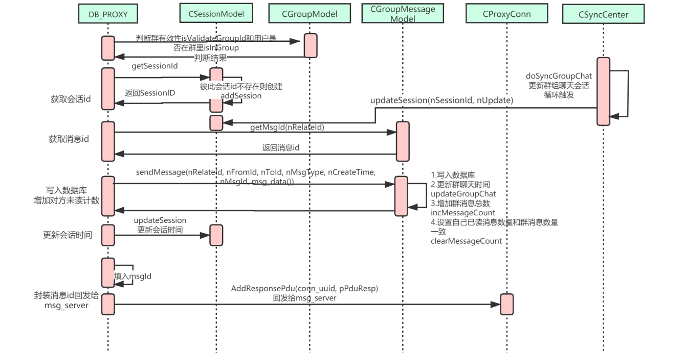

# 数据库代理服务器与消息服务器设计

---

### db_proxy_server.cpp

```cpp
/* db_proxy_server.cpp */

#include "CachePool.h"
#include "ConfigFileReader.h"
#include "DBPool.h"
#include "EncDec.h"

#include "HttpClient.h"
#include "ProxyConn.h"
#include "SyncCenter.h"
#include "ThreadPool.h"
#include "business/AudioModel.h"
#include "business/FileModel.h"
#include "business/GroupMessageModel.h"
#include "business/GroupModel.h"
#include "business/MessageModel.h"
#include "business/RelationModel.h"
#include "business/SessionModel.h"
#include "business/UserModel.h"
#include "netlib.h"
#include "version.h"

string strAudioEnc;
// this callback will be replaced by imconn_callback() in OnConnect()
void proxy_serv_callback(void* callback_data, uint8_t msg, uint32_t handle, void* pParam) {
  if (msg == NETLIB_MSG_CONNECT) {
    CProxyConn* pConn = new CProxyConn();
    pConn->OnConnect(handle);
  } else {
    log("!!!error msg: %d", msg);
  }
}

int main(int argc, char* argv[]) {
  if ((argc == 2) && (strcmp(argv[1], "-v") == 0)) {
    printf("Server Version: DBProxyServer/%s\n", VERSION);
    printf("Server Build: %s %s\n", __DATE__, __TIME__);
    return 0;
  }

  signal(SIGPIPE, SIG_IGN);
  srand(time(NULL));

  CacheManager* pCacheManager = CacheManager::getInstance();
  if (!pCacheManager) {
    log("CacheManager init failed");
    return -1;
  }

  CDBManager* pDBManager = CDBManager::getInstance();
  if (!pDBManager) {
    log("DBManager init failed");
    return -1;
  }
  puts("db init success");
  // 主线程初始化单例，不然在工作线程可能会出现多次初始化
  if (!CAudioModel::getInstance()) return -1;
  if (!CGroupMessageModel::getInstance()) return -1;
  if (!CGroupModel::getInstance()) return -1;
  if (!CMessageModel::getInstance()) return -1;
  if (!CSessionModel::getInstance()) return -1;
  if (!CRelationModel::getInstance()) return -1;
  if (!CUserModel::getInstance()) return -1;
  if (!CFileModel::getInstance()) return -1;

  CConfigFileReader config_file("dbproxyserver.conf");

  char* listen_ip = config_file.GetConfigName("ListenIP");
  char* str_listen_port = config_file.GetConfigName("ListenPort");
  char* str_thread_num = config_file.GetConfigName("ThreadNum");
  char* str_file_site = config_file.GetConfigName("MsfsSite");
  char* str_aes_key = config_file.GetConfigName("aesKey");

  if (!listen_ip || !str_listen_port || !str_thread_num || !str_file_site ||
      !str_aes_key) {
    log("missing ListenIP/ListenPort/ThreadNum/MsfsSite/aesKey, exit...");
    return -1;
  }

  if (strlen(str_aes_key) != 32) {
    log("aes key is invalied");
    return -2;
  }
  string strAesKey(str_aes_key, 32);
  CAes cAes = CAes(strAesKey);
  string strAudio = "[语音]";
  char* pAudioEnc;
  uint32_t nOutLen;
  if (cAes.Encrypt(strAudio.c_str(), strAudio.length(), &pAudioEnc, nOutLen) == 0) {
    strAudioEnc.clear();
    strAudioEnc.append(pAudioEnc, nOutLen);
    cAes.Free(pAudioEnc);
  }

  uint16_t listen_port = atoi(str_listen_port);
  uint32_t thread_num = atoi(str_thread_num);

  string strFileSite(str_file_site);
  CAudioModel::getInstance()->setUrl(strFileSite);

  int ret = netlib_init();

  if (ret == NETLIB_ERROR) return ret;

  /// yunfan add 2014.9.28
  // for 603 push
  curl_global_init(CURL_GLOBAL_ALL);
  /// yunfan add end

  init_proxy_conn(thread_num);
  CSyncCenter::getInstance()->init();
  CSyncCenter::getInstance()->startSync();

  CStrExplode listen_ip_list(listen_ip, ';');
  for (uint32_t i = 0; i < listen_ip_list.GetItemCnt(); i++) {
    ret = netlib_listen(listen_ip_list.GetItem(i), listen_port, proxy_serv_callback, NULL);
    if (ret == NETLIB_ERROR) return ret;
  }

  printf("server start listen on: %s:%d\n", listen_ip, listen_port);
  printf("now enter the event loop...\n");
  writePid();
  netlib_eventloop(10);

  return 0;
}
```

### 1.内存池CachePool


### 2.数据库连接池DBPool


### 3.连接池管理AutoPool


### 4.HandlerMap


### 5.ProxyConn


### 6.ProxyTask


### 7.SyncCenter


# redis缓存相关

### 3.reactor响应流程


```cpp
string strAudioEnc;
// this callback will be replaced by imconn_callback() in OnConnect()
void proxy_serv_callback(void* callback_data, uint8_t msg, uint32_t handle, void* pParam) {
  if (msg == NETLIB_MSG_CONNECT) {
    CProxyConn* pConn = new CProxyConn();
    pConn->OnConnect(handle);
  } else {
    log("!!!error msg: %d", msg);
  }
}
```

#### ProxyConn.cpp->CProxyConn::HandlePduBuf

```cpp
void CProxyConn::HandlePduBuf(uchar_t* pdu_buf, uint32_t pdu_len) {
  CImPdu* pPdu = NULL;
  pPdu = CImPdu::ReadPdu(pdu_buf, pdu_len);
  if (pPdu->GetCommandId() == IM::BaseDefine::CID_OTHER_HEARTBEAT) {
    return;
  }
  //查找对应的command id对应的处理函数
  pdu_handler_t handler = s_handler_map->GetHandler(pPdu->GetCommandId());

  if (handler) {
    CTask* pTask = new CProxyTask(m_uuid, handler, pPdu);
    g_thread_pool.AddTask(pTask);
  } else {
    log("no handler for packet type: %d", pPdu->GetCommandId());
  }
}
```

#### ProxyTask.cpp->CProxyTask::run

```cpp
void CProxyTask::run() {
  if (!m_pPdu) {
    // tell CProxyConn to close connection with m_conn_uuid
    CProxyConn::AddResponsePdu(m_conn_uuid, NULL);
  } else {
    if (m_pdu_handler) {
      m_pdu_handler(m_pPdu, m_conn_uuid);
    }
  }
}
```

#### ProxyConn.cpp->init_proxy_conn

```cpp
int init_proxy_conn(uint32_t thread_num) {
  s_handler_map = CHandlerMap::getInstance();
  g_thread_pool.Init(thread_num);

  netlib_add_loop(proxy_loop_callback, NULL);//会发数据包
  signal(SIGTERM, sig_handler);//信号设置 让db_proxy_server能够平滑退出
  return netlib_register_timer(proxy_timer_callback, NULL, 1000);
}
```


### 1.消息计数（单聊和群聊）

不论是单聊还是群聊，其都是共用一个消息id，消息id由服务器自动进行分配，

存储在unread连接池所在的数据库，

- 单聊：key设计： `msg_id_` + nRelateId

    函数：`uint32_t CMessageModel::getMsgId(uint32_t nRelateId)`

- 群聊：key设计：`group_msg_id_` + group_id

    函数：`uint32_t CGroupMessageModel::getMsgId(uint32_t nGroupId)`

#### 未读消息机制

如果在1000人的大群中，发送一条消息999个人产生未读消息计数，如果存入mysql压力将会非常的大（999个人需要实时更新消息对数据库进行读写操作），

需要存入redis缓存中而不是存入mysql，

#### 单聊unread

未读消息计数（信息存入redis数据中）：

key设计：unread_ + int2string(nUserId)

使用一个hash存储同一个user_id对应不同聊天的未读消息数量，


1. 读取`CMessageModel::getUnreadMsgCount` 

2. 写入`CMessageModel::incMsgCount ` 

    

3. 每个fileId对应一个联系人的未读消息计数

    


#### 群聊unread

群未读消息计数：

- 一个群group_id对应多个user_id
- 同一个group_id，不同的user_id对应的未读消息数量是不一样的
- 每次发消息时群消息数量+1，发消息的个人计数也+1
- 未读消息数量：群消息数量 - 个人已读消息数量


1. 读取：`CGroupMessageModel::getUnreadMsgCount` 群未读消息数量 = 群总消息数量 - 对应群成员已读消息数量
1. 写入：`CGroupMessageModel::incMessageCount` 增加群消息总共的消息数量
1. 清除未读消息
1. 作为消息的发送者，在发送群聊消息的时候，也需要把自己的消息计数设置成和群消息数量一样

#### 清除未读消息unreadClean

一对一聊天、群聊天都是调用该函数，

- `void CUserModel::clearUserCounter(uint32_t nUserId, uint32_t nPeerId, IM::BaseDefine::SessionType nSessionType)`
- 单聊：直接删除unread_ + userId的key
- 群聊：更新user_id + group_id + _im_user_group，对应的value和group_id + im_group_msg一致


### 2.群成员管理

群成员管理的redis缓存设计，以hash为存储结构。

- key使用group_member + group_id，
- hash里面的field使用user_id，value则对应创建时间


1. 加入成员：`insertNewMember` 插入mysql数据库的同时也插入redis缓存
2. 删除成员：`removeMember` 从mysql数据库删除的同时，也从redis缓存删除


### 3.聊天逻辑流程DBP

```cpp
//service id  0x0003
message IMMsgData{
	//cmd id:		0x0301
	required uint32 from_user_id = 1;				//消息发送方
	required uint32 to_session_id = 2;				//消息接受方
	required uint32 msg_id = 3;
	required uint32 create_time = 4; 
	required IM.BaseDefine.MsgType msg_type = 5;
	required bytes msg_data = 6;
	optional bytes attach_data = 20;
}
```

#### MessageContent.cpp->sendMessage

```cpp
void sendMessage(CImPdu* pPdu, uint32_t conn_uuid) {
  //pDu数据解析
  IM::Message::IMMsgData msg;
  if (msg.ParseFromArray(pPdu->GetBodyData(), pPdu->GetBodyLength())) {
    uint32_t nFromId = msg.from_user_id();
    uint32_t nToId = msg.to_session_id();
    uint32_t nCreateTime = msg.create_time();
    IM::BaseDefine::MsgType nMsgType = msg.msg_type();//消息类型
    uint32_t nMsgLen = msg.msg_data().length();

    uint32_t nNow = (uint32_t)time(NULL);

    //开始对消息进行处理
    if (IM::BaseDefine::MsgType_IsValid(nMsgType)) {
      if (nMsgLen != 0) {
        CImPdu* pPduResp = new CImPdu;

        uint32_t nMsgId = INVALID_VALUE;
        uint32_t nSessionId = INVALID_VALUE;
        uint32_t nPeerSessionId = INVALID_VALUE;

        CMessageModel* pMsgModel = CMessageModel::getInstance();
        CGroupMessageModel* pGroupMsgModel = CGroupMessageModel::getInstance();

        //1.群聊文本消息
        if (nMsgType == IM::BaseDefine::MSG_TYPE_GROUP_TEXT) {
          CGroupModel* pGroupModel = CGroupModel::getInstance();
          if (pGroupModel->isValidateGroupId(nToId) &&
              pGroupModel->isInGroup(nFromId, nToId)) {
            nSessionId = CSessionModel::getInstance()->getSessionId(
                nFromId, nToId, IM::BaseDefine::SESSION_TYPE_GROUP, false);
            if (INVALID_VALUE == nSessionId) {
              nSessionId = CSessionModel::getInstance()->addSession(
                  nFromId, nToId, IM::BaseDefine::SESSION_TYPE_GROUP);
            }
            if (nSessionId != INVALID_VALUE) {
              nMsgId = pGroupMsgModel->getMsgId(nToId);
              if (nMsgId != INVALID_VALUE) {
                pGroupMsgModel->sendMessage(nFromId, nToId, nMsgType,
                                            nCreateTime, nMsgId,
                                            (string&)msg.msg_data());
                CSessionModel::getInstance()->updateSession(nSessionId, nNow);
              }
            }
          } else {
            log("invalid groupId. fromId=%u, groupId=%u", nFromId, nToId);
            delete pPduResp;
            return;
          }
        } else if (nMsgType == IM::BaseDefine::MSG_TYPE_GROUP_AUDIO) {
          //2.群聊语音消息
          CGroupModel* pGroupModel = CGroupModel::getInstance();
          if (pGroupModel->isValidateGroupId(nToId) &&
              pGroupModel->isInGroup(nFromId, nToId)) {
            nSessionId = CSessionModel::getInstance()->getSessionId(
                nFromId, nToId, IM::BaseDefine::SESSION_TYPE_GROUP, false);
            if (INVALID_VALUE == nSessionId) {
              nSessionId = CSessionModel::getInstance()->addSession(
                  nFromId, nToId, IM::BaseDefine::SESSION_TYPE_GROUP);
            }
            if (nSessionId != INVALID_VALUE) {
              nMsgId = pGroupMsgModel->getMsgId(nToId);
              if (nMsgId != INVALID_VALUE) {
                pGroupMsgModel->sendAudioMessage(
                    nFromId, nToId, nMsgType, nCreateTime, nMsgId,
                    msg.msg_data().c_str(), nMsgLen);
                CSessionModel::getInstance()->updateSession(nSessionId, nNow);
              }
            }
          } else {
            log("invalid groupId. fromId=%u, groupId=%u", nFromId, nToId);
            delete pPduResp;
            return;
          }
        } else if (nMsgType == IM::BaseDefine::MSG_TYPE_SINGLE_TEXT) {
          //3.单聊文本消息
          if (nFromId != nToId) {
            nSessionId = CSessionModel::getInstance()->getSessionId(nFromId, nToId, IM::BaseDefine::SESSION_TYPE_SINGLE, false);//自己的sessionId
            if (INVALID_VALUE == nSessionId) nSessionId = CSessionModel::getInstance()->addSession(nFromId, nToId, IM::BaseDefine::SESSION_TYPE_SINGLE);
            
            nPeerSessionId = CSessionModel::getInstance()->getSessionId(nToId, nFromId, IM::BaseDefine::SESSION_TYPE_SINGLE, false);//对端的sessionId
            if (INVALID_VALUE == nPeerSessionId) nSessionId = CSessionModel::getInstance()->addSession(nToId, nFromId, IM::BaseDefine::SESSION_TYPE_SINGLE);

            uint32_t nRelateId = CRelationModel::getInstance()->getRelationId(nFromId, nToId, true);

            if (nSessionId != INVALID_VALUE && nRelateId != INVALID_VALUE) {
              nMsgId = pMsgModel->getMsgId(nRelateId);
              if (nMsgId != INVALID_VALUE) {
                pMsgModel->sendMessage(nRelateId, nFromId, nToId, nMsgType, nCreateTime, nMsgId, (string&)msg.msg_data());//将消息存入数据库中 并将消息计数+1
                CSessionModel::getInstance()->updateSession(nSessionId, nNow);//更新会话比较耗时 对于即时通信的系统性能 受数据库处理的影响较大
                CSessionModel::getInstance()->updateSession(nPeerSessionId, nNow);
              } else {
                log("msgId is invalid. fromId=%u, toId=%u, nRelateId=%u, nSessionId=%u, nMsgType=%u",
                    nFromId, nToId, nRelateId, nSessionId, nMsgType);
              }
            } else {
              log("sessionId or relateId is invalid. fromId=%u, toId=%u, nRelateId=%u, nSessionId=%u, nMsgType=%u",
                  nFromId, nToId, nRelateId, nSessionId, nMsgType);
            }
          } else {
            log("send msg to self. fromId=%u, toId=%u, msgType=%u", nFromId,
                nToId, nMsgType);
          }

        } else if (nMsgType == IM::BaseDefine::MSG_TYPE_SINGLE_AUDIO) {
          //4.单聊语音消息
          if (nFromId != nToId) {
            nSessionId = CSessionModel::getInstance()->getSessionId(nFromId, nToId, IM::BaseDefine::SESSION_TYPE_SINGLE, false);
            if (INVALID_VALUE == nSessionId) nSessionId = CSessionModel::getInstance()->addSession(nFromId, nToId, IM::BaseDefine::SESSION_TYPE_SINGLE);

            nPeerSessionId = CSessionModel::getInstance()->getSessionId(nToId, nFromId, IM::BaseDefine::SESSION_TYPE_SINGLE, false);
            if (INVALID_VALUE == nPeerSessionId) nSessionId = CSessionModel::getInstance()->addSession(nToId, nFromId, IM::BaseDefine::SESSION_TYPE_SINGLE);

            uint32_t nRelateId = CRelationModel::getInstance()->getRelationId(nFromId, nToId, true);

            if (nSessionId != INVALID_VALUE && nRelateId != INVALID_VALUE) {
              nMsgId = pMsgModel->getMsgId(nRelateId);
              if (nMsgId != INVALID_VALUE) {
                pMsgModel->sendAudioMessage(nRelateId, nFromId, nToId, nMsgType,
                                            nCreateTime, nMsgId,
                                            msg.msg_data().c_str(), nMsgLen);
                CSessionModel::getInstance()->updateSession(nSessionId, nNow);
                CSessionModel::getInstance()->updateSession(nPeerSessionId, nNow);
              } else {
                log("msgId is invalid. fromId=%u, toId=%u, nRelateId=%u, nSessionId=%u, nMsgType=%u",
                    nFromId, nToId, nRelateId, nSessionId, nMsgType);
              }
            } else {
              log("sessionId or relateId is invalid. fromId=%u, toId=%u, nRelateId=%u, nSessionId=%u, nMsgType=%u",
                  nFromId, nToId, nRelateId, nSessionId, nMsgType);
            }
          } else {
            log("send msg to self. fromId=%u, toId=%u, msgType=%u", nFromId, nToId, nMsgType);
          }
        }

        log("fromId=%u, toId=%u, type=%u, msgId=%u, sessionId=%u", nFromId, nToId, nMsgType, nMsgId, nSessionId);

        msg.set_msg_id(nMsgId);
        pPduResp->SetPBMsg(&msg);
        pPduResp->SetSeqNum(pPdu->GetSeqNum());
        pPduResp->SetServiceId(IM::BaseDefine::SID_MSG);
        pPduResp->SetCommandId(IM::BaseDefine::CID_MSG_DATA);
        CProxyConn::AddResponsePdu(conn_uuid, pPduResp);
      } else {
        log("msgLen error. fromId=%u, toId=%u, msgType=%u", nFromId, nToId, nMsgType);
      }
    } else {
      log("invalid msgType.fromId=%u, toId=%u, msgType=%u", nFromId, nToId, nMsgType);
    }
  } else {
    log("parse pb failed");
  }
}
```

#### 单聊MessageModel.cpp->CMessageModel::sendMessage

用户选择单聊


```cpp
/*
 * IMMessage 分表
 * AddFriendShip()
 * if nFromId or nToId is ShopEmployee
 * GetShopId
 * Insert into IMMessage_ShopId%8
 */
bool CMessageModel::sendMessage(uint32_t nRelateId, uint32_t nFromId,
                                uint32_t nToId,
                                IM::BaseDefine::MsgType nMsgType,
                                uint32_t nCreateTime, uint32_t nMsgId,
                                string& strMsgContent) {
  bool bRet = false;
  if (nFromId == 0 || nToId == 0) {
    log("invalied userId.%u->%u", nFromId, nToId);
    return bRet;
  }

  CDBManager* pDBManager = CDBManager::getInstance();
  CDBConn* pDBConn = pDBManager->GetDBConn("teamtalk_master");
  if (pDBConn) {
    //通过id映射到对应的数据库表
    string strTableName = "IMMes    sage_" + int2string(nRelateId % 8);
    string strSql =
        "insert into " + strTableName +
        " (`relateId`, `fromId`, `toId`, `msgId`, `content`, `status`, `type`, "
        "`created`, `updated`) values(?, ?, ?, ?, ?, ?, ?, ?, ?)";
    // 必须在释放连接前delete CPrepareStatement对象，否则有可能多个线程操作mysql对象，会crash
    CPrepareStatement* pStmt = new CPrepareStatement();
    // 1.数据库写入
    if (pStmt->Init(pDBConn->GetMysql(), strSql)) {
      uint32_t nStatus = 0;
      uint32_t nType = nMsgType;
      uint32_t index = 0;
      pStmt->SetParam(index++, nRelateId);
      pStmt->SetParam(index++, nFromId);
      pStmt->SetParam(index++, nToId);
      pStmt->SetParam(index++, nMsgId);
      pStmt->SetParam(index++, strMsgContent);
      pStmt->SetParam(index++, nStatus);
      pStmt->SetParam(index++, nType);
      pStmt->SetParam(index++, nCreateTime);
      pStmt->SetParam(index++, nCreateTime);
      bRet = pStmt->ExecuteUpdate();
    }
    delete pStmt;
    // 2.释放掉连接
    pDBManager->RelDBConn(pDBConn);
    if (bRet) {
      uint32_t nNow = (uint32_t)time(NULL);
      incMsgCount(nFromId, nToId);//消息未读计数器更新
    } else {
      log("insert message failed: %s", strSql.c_str());
    }
  } else {
    log("no db connection for teamtalk_master");
  }
  return bRet;
}
```


#### 群聊GroupMessageModel.cpp->CGroupMessageModel::sendMessage

用户选择群聊




```cpp
/**
 *  发送群消息接口
 *
 *  @param nRelateId     关系Id
 *  @param nFromId       发送者Id
 *  @param nGroupId      群组Id
 *  @param nMsgType      消息类型
 *  @param nCreateTime   消息创建时间
 *  @param nMsgId        消息Id
 *  @param strMsgContent 消息类容
 *
 *  @return 成功返回true 失败返回false
 */
bool CGroupMessageModel::sendMessage(uint32_t nFromId, uint32_t nGroupId,
                                     IM::BaseDefine::MsgType nMsgType,
                                     uint32_t nCreateTime, uint32_t nMsgId,
                                     const string& strMsgContent) {
  bool bRet = false;
  if (CGroupModel::getInstance()->isInGroup(nFromId, nGroupId)) {
    CDBManager* pDBManager = CDBManager::getInstance();
    //将消息写入mysql数据库中
    CDBConn* pDBConn = pDBManager->GetDBConn("teamtalk_master");
    if (pDBConn) {
      //同一个群中的消息是在同一张数据库的表中
      //通过hash的方式将数据存储到不同的数据库表中
      string strTableName = "IMGroupMessage_" + int2string(nGroupId % 8);
      string strSql = "insert into " + strTableName +
                      " (`groupId`, `userId`, `msgId`, `content`, `type`, "
                      "`status`, `updated`, `created`) "
                      "values(?, ?, ?, ?, ?, ?, ?, ?)";
      
      //1.对数据库的操作
      // 必须在释放连接前delete
      // CPrepareStatement对象，否则有可能多个线程操作mysql对象，会crash
      CPrepareStatement* pStmt = new CPrepareStatement();
      if (pStmt->Init(pDBConn->GetMysql(), strSql)) {
        uint32_t nStatus = 0;
        uint32_t nType = nMsgType;
        uint32_t index = 0;
        pStmt->SetParam(index++, nGroupId);
        pStmt->SetParam(index++, nFromId);
        pStmt->SetParam(index++, nMsgId);
        pStmt->SetParam(index++, strMsgContent);
        pStmt->SetParam(index++, nType);
        pStmt->SetParam(index++, nStatus);
        pStmt->SetParam(index++, nCreateTime);
        pStmt->SetParam(index++, nCreateTime);

        bool bRet = pStmt->ExecuteUpdate();
        if (bRet) {
          //更新updateGroupChat信息（set lastChated最后一条群消息时间）
          CGroupModel::getInstance()->updateGroupChat(nGroupId);
          incMessageCount(nFromId, nGroupId);//添加群消息总计数
          clearMessageCount(nFromId, nGroupId);//清除发送群消息的用户的未读消息计数
        } else {
          log("insert message failed: %s", strSql.c_str());
        }
      }
      delete pStmt;
      pDBManager->RelDBConn(pDBConn);
    } else {
      log("no db connection for teamtalk_master");
    }
  } else {
    log("not in the group.fromId=%u, groupId=%u", nFromId, nGroupId);
  }
  return bRet;
}
```

#### SyncCenter.cpp->CSyncCenter::doSyncGroupChat

```cpp
/**
 *  同步群组聊天信息
 *
 *  @param arg NULL
 *
 *  @return NULL
 */
void* CSyncCenter::doSyncGroupChat(void* arg) {
  m_bSyncGroupChatRuning = true;
  CDBManager* pDBManager = CDBManager::getInstance();
  map<uint32_t, uint32_t> mapChangedGroup;
  do {
    mapChangedGroup.clear();
    CDBConn* pDBConn = pDBManager->GetDBConn("teamtalk_slave");
    if (pDBConn) {
      //1.检查群消息是否有更新
      string strSql =
          "select id, lastChated from IMGroup where status=0 and lastChated >=" +
          int2string(m_pInstance->getLastUpdateGroup());
      CResultSet* pResult = pDBConn->ExecuteQuery(strSql.c_str());
      //2.获取群聊消息最后更新的时间
      if (pResult) {
        while (pResult->Next()) {
          uint32_t nGroupId = pResult->GetInt("id");
          uint32_t nLastChat = pResult->GetInt("lastChated");
          if (nLastChat != 0) {
            mapChangedGroup[nGroupId] = nLastChat;//获取最后更新的时间
          }
        }
        delete pResult;
      }
      pDBManager->RelDBConn(pDBConn);
    } else {
      log("no db connection for teamtalk_slave");
    }
    //3.设置最后一次同步的时间 用来做下一次的对比
    m_pInstance->updateLastUpdateGroup(time(NULL));
    for (auto it = mapChangedGroup.begin(); it != mapChangedGroup.end(); ++it) {
      /* 遍历所有的群 进行处理 */
      uint32_t nGroupId = it->first;
      list<uint32_t> lsUsers;
      uint32_t nUpdate = it->second;//获取该群对应的最后更新时间
      //4.从redis中获取群成员（将群存入redis中提升访问速度）
      CGroupModel::getInstance()->getGroupUser(nGroupId, lsUsers);
      for (auto it1 = lsUsers.begin(); it1 != lsUsers.end(); ++it1) {
        uint32_t nUserId = *it1;
        uint32_t nSessionId = INVALID_VALUE;
        nSessionId = CSessionModel::getInstance()->getSessionId(nUserId, nGroupId, IM::BaseDefine::SESSION_TYPE_GROUP, true);//获取sessionId
        if (nSessionId != INVALID_VALUE) {
          //将该群的最后更新时间 设置到sessionId对应的群聊中
          CSessionModel::getInstance()->updateSession(nSessionId, nUpdate);
        } else {
          CSessionModel::getInstance()->addSession(nUserId, nGroupId, IM::BaseDefine::SESSION_TYPE_GROUP);
        }
      }
    }
  } while (m_pInstance->m_bSyncGroupChatWaitting && !(m_pInstance->m_pCondGroupChat->waitTime(5 * 1000)));//更新时间设置为5s
  //    } while (!m_pInstance->m_pCondSync->waitTime(5*1000));
  //    } while(m_pInstance->m_bSyncGroupChatWaitting);
  m_bSyncGroupChatRuning = false;
  return NULL;
}
```

```cpp
/* SyncCenter.cpp */
/**
 *  停止同步，为了"优雅"的同步，使用了条件变量
 */
void CSyncCenter::stopSync() {
  m_bSyncGroupChatWaitting = false;
  m_pCondGroupChat->notify();
  while (m_bSyncGroupChatRuning) {
    usleep(500);
  }
}
```


### 4.群消息转发MS

1. CID_GROUP_INFO_REQUEST
2. void getGroupInfo(CImPdu *pPdu, unit32_t conn_uuid)
3. case CID_GROUP_INFO_RESPONSE
4. HandleGroupInfoResponse发送数据


#### DBServConn.cpp->CDBServConn::_HandleMsgData

```cpp

```


#### GroupChat.cpp->CGroupChat::HandleGroupMessage

```cpp

```


db_proxy：

1. 连接池：redis分不同的db、mysql可以分主从

2. db_proxy的连接响应逻辑（reactor如何进行响应操作）

3. 消息未读的机制，单聊与群聊的区别？

4. 聊天消息序号的生成，利用redis的原子性进行生成msg_id

5. 单聊与群聊的响应逻辑

6. 消息推送与拉取的区别：

    消息推送：服务端主动推送消息到客户端

    消息拉取：客户端主动申请向服务端拉取消息


