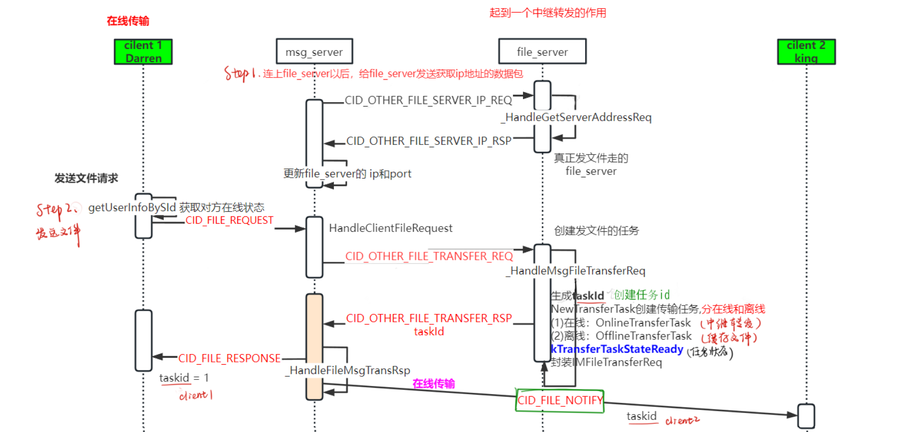
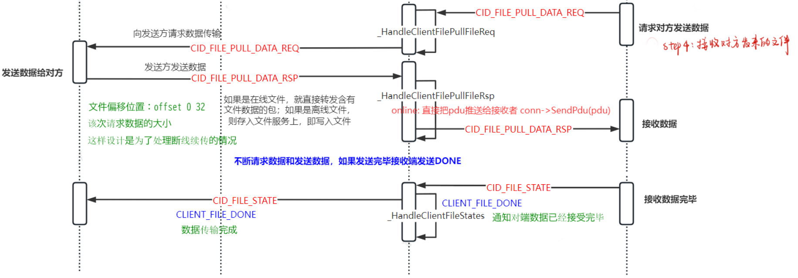
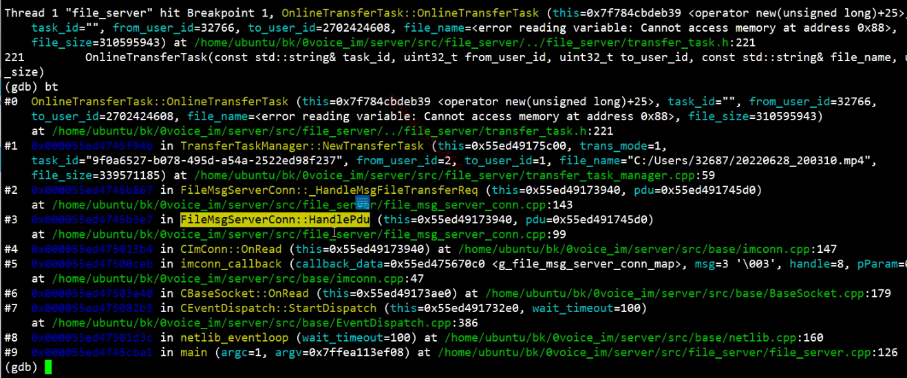
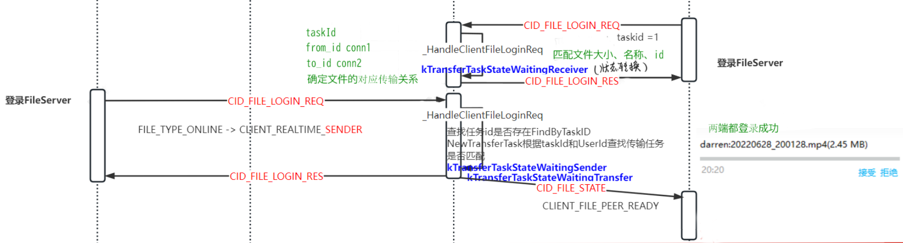

# 文件服务器与消息服务器设计

---

### 文件传输

#### 在线文件传输







#### 离线文件传输



##### 1.msg_server主动连接file_server服务器


在msg_server连接上file_server后，

- step1：msg_server中`FileServConn.cpp`的回调函数`onconfirm`会被调用进行应答，向file_server发送请求获取其ip地址与端口号（CID_OTHER_FILE_SERVER_IP_REQ），

##### CFileServConn::OnConfirm

```cpp
//msg_server成功连接上file_server后发送conform请求
void CFileServConn::OnConfirm() {
  //将连接上的file_server存入g_file_server_list中
  log("connect to file server success ");
  m_bOpen = true;
  m_connect_time = get_tick_count();
  g_file_server_list[m_serv_idx].reconnect_cnt = MIN_RECONNECT_CNT / 2;
  
  //向file_server发送请求获取其ip地址
  IM::Server::IMFileServerIPReq msg;
  CImPdu pdu;
  pdu.SetPBMsg(&msg);
  pdu.SetServiceId(SID_OTHER);
  pdu.SetCommandId(CID_OTHER_FILE_SERVER_IP_REQ);
  SendPdu(&pdu);
}
```

- step2：在file_server中的`FileMsgServerConn::_HandleGetServerAddressReq`函数，会对msg_server发来的信令进行处理，将file_server的ip地址发回（CID_OTHER_FILE_SERVER_IP_RSP）

##### FileMsgServerConn::_HandleGetServerAddressReq

```cpp
void FileMsgServerConn::_HandleGetServerAddressReq(CImPdu* pPdu) {
  IM::Server::IMFileServerIPRsp msg;
  const std::list<IM::BaseDefine::IpAddr>& addrs = ConfigUtil::GetInstance()->GetAddressList();
  
  for (std::list<IM::BaseDefine::IpAddr>::const_iterator it = addrs.begin(); it != addrs.end(); ++it) {
    IM::BaseDefine::IpAddr* addr = msg.add_ip_addr_list();
    *addr = *it;
    log("Upload file_client_conn addr info, ip=%s, port=%d", addr->ip().c_str(), addr->port());
  }
  SendMessageLite(this, SID_OTHER, CID_OTHER_FILE_SERVER_IP_RSP, pPdu->GetSeqNum(), &msg);
}
```

- step3：处理从file_server获取到的ip地址信息，将ip地址与端口信息返回到客户端中，更新file_server的ip地址与port端口号

##### CFileServConn::_HandleFileServerIPRsp

```cpp
//处理请求file_server的ip之后的响应信息
void CFileServConn::_HandleFileServerIPRsp(CImPdu* pPdu) {
  //将接收到的信息反序列化
  IM::Server::IMFileServerIPRsp msg;
  CHECK_PB_PARSE_MSG(msg.ParseFromArray(pPdu->GetBodyData(), pPdu->GetBodyLength()));
  uint32_t ip_addr_cnt = msg.ip_addr_list_size();

  //获取到file_server的ip地址 将信息会发到客户端
  for (uint32_t i = 0; i < ip_addr_cnt; i++) {
    IM::BaseDefine::IpAddr ip_addr = msg.ip_addr_list(i);
    log("_HandleFileServerIPRsp -> %s : %d ", ip_addr.ip().c_str(), ip_addr.port());
    m_ip_list.push_back(ip_addr);
  }
}
```


##### 2.客户端->msg_server->file_server文件传输的请求

在本次请求后，文件传输的双方都会拿到file_server的ip与端口，从而可以进行下一步的直接登录file_server进行文件传输。


- step1：客户端向msg_server发送文件传输请求（表现为客户端向好友发送了文件传输请求）CID_FILE_REQUEST，请求中的数据包括from_user_id、to_user_id、file_name、file_size、trans_mode对端在线状态（该功能在客户端中进行实现）。


```protobuf
message IMFileReq{
	//cmd id: 	0x0506
	required uint32 from_user_id = 1;
	required uint32 to_user_id = 2;
	required string file_name = 3;
	required uint32 file_size = 4;
	required IM.BaseDefine.TransferFileType trans_mode = 5;
}
```

- step2：当msg_server接受到客户单的请求时，会调用**CFileHandler::HandleClientFileRequest**方法进行处理，并向file_server发起文件传输请求IMFileTransferReq

##### CFileHandler::HandleClientFileRequest

```protobuf
message IMFileTransferReq{
	//cmd id:			0x0715
	required uint32 from_user_id = 1;
	required uint32 to_user_id = 2;
	required string file_name = 3;
	required uint32 file_size = 4;
	required IM.BaseDefine.TransferFileType trans_mode = 5;
	optional bytes attach_data = 20;
}
```

```cpp
void CFileHandler::HandleClientFileRequest(CMsgConn* pMsgConn, CImPdu* pPdu) {
  IM::File::IMFileReq msg;
  CHECK_PB_PARSE_MSG(msg.ParseFromArray(pPdu->GetBodyData(), pPdu->GetBodyLength()));

  uint32_t from_id = pMsgConn->GetUserId();
  uint32_t to_id = msg.to_user_id();
  string file_name = msg.file_name();
  uint32_t file_size = msg.file_size();
  uint32_t trans_mode = msg.trans_mode();
  log("HandleClientFileRequest, %u->%u, fileName: %s, trans_mode: %u.",
      from_id, to_id, file_name.c_str(), trans_mode);

  CDbAttachData attach(ATTACH_TYPE_HANDLE, pMsgConn->GetHandle());
  CFileServConn* pFileConn = get_random_file_serv_conn();
  if (pFileConn) {
    IM::Server::IMFileTransferReq msg2;
    msg2.set_from_user_id(from_id);
    msg2.set_to_user_id(to_id);
    msg2.set_file_name(file_name);
    msg2.set_file_size(file_size);
    msg2.set_trans_mode((IM::BaseDefine::TransferFileType)trans_mode);//传输模式 离线传输 or 在线传输
    msg2.set_attach_data(attach.GetBuffer(), attach.GetLength());
    CImPdu pdu;
    pdu.SetPBMsg(&msg2);
    pdu.SetServiceId(SID_OTHER);
    pdu.SetCommandId(CID_OTHER_FILE_TRANSFER_REQ);
    pdu.SetSeqNum(pPdu->GetSeqNum());

    if (IM::BaseDefine::FILE_TYPE_OFFLINE == trans_mode) {
      pFileConn->SendPdu(&pdu);
    } else {
      // IM::BaseDefine::FILE_TYPE_ONLINE
      CImUser* pUser = CImUserManager::GetInstance()->GetImUserById(to_id);
      if (pUser && pUser->GetPCLoginStatus()) {
        // 已有对应的账号pc登录状态
        pFileConn->SendPdu(&pdu);
      } else {
        // 无对应用户的pc登录状态,向route_server查询状态
        // no pc_client in this msg_server, check it from route_server
        CPduAttachData attach_data(ATTACH_TYPE_HANDLE_AND_PDU_FOR_FILE,
                                   pMsgConn->GetHandle(), pdu.GetBodyLength(),
                                   pdu.GetBodyData());
        IM::Buddy::IMUsersStatReq msg3;
        msg3.set_user_id(from_id);
        msg3.add_user_id_list(to_id);
        msg3.set_attach_data(attach_data.GetBuffer(), attach_data.GetLength());

        CImPdu pdu2;
        pdu2.SetPBMsg(&msg3);
        pdu2.SetServiceId(SID_BUDDY_LIST);
        pdu2.SetCommandId(CID_BUDDY_LIST_USERS_STATUS_REQUEST);
        pdu2.SetSeqNum(pPdu->GetSeqNum());
        CRouteServConn* route_conn = get_route_serv_conn();
        if (route_conn) {
          route_conn->SendPdu(&pdu2);
        }
      }
    }
  } else {
    log("HandleClientFileRequest, no file server.   ");
    IM::File::IMFileRsp msg2;
    msg2.set_result_code(1);
    msg2.set_from_user_id(from_id);
    msg2.set_to_user_id(to_id);
    msg2.set_file_name(file_name);
    msg2.set_task_id("");
    msg2.set_trans_mode((IM::BaseDefine::TransferFileType)trans_mode);
    CImPdu pdu;
    pdu.SetPBMsg(&msg2);
    pdu.SetServiceId(SID_FILE);
    pdu.SetCommandId(CID_FILE_RESPONSE);
    pdu.SetSeqNum(pPdu->GetSeqNum());
    pMsgConn->SendPdu(&pdu);
  }
}
```

- step3：当msg_server发送的请求到达file_server时，file_server会调用创建文件传输任务并生成taskId，分为在线传输与离线传输任务。

##### FileMsgServerConn::_HandleMsgFileTransferReq

```cpp
void FileMsgServerConn::_HandleMsgFileTransferReq(CImPdu* pdu) {
  IM::Server::IMFileTransferReq transfer_req;
  CHECK_PB_PARSE_MSG(transfer_req.ParseFromArray(pdu->GetBodyData(), pdu->GetBodyLength()));

  uint32_t from_id = transfer_req.from_user_id();
  uint32_t to_id = transfer_req.to_user_id();

  IM::Server::IMFileTransferRsp transfer_rsp;
  transfer_rsp.set_result_code(1);
  transfer_rsp.set_from_user_id(from_id);
  transfer_rsp.set_to_user_id(to_id);
  transfer_rsp.set_file_name(transfer_req.file_name());
  transfer_rsp.set_file_size(transfer_req.file_size());
  transfer_rsp.set_task_id("");
  transfer_rsp.set_trans_mode(transfer_req.trans_mode());
  transfer_rsp.set_attach_data(transfer_req.attach_data());

  bool rv = false;
  do {
    std::string task_id = GenerateUUID();
    if (task_id.empty()) {
      log("Create task id failed");
      break;
    }
    log("trams_mode=%d, task_id=%s, from_id=%d, to_id=%d, file_name=%s, file_size=%d",
        transfer_req.trans_mode(), task_id.c_str(), from_id, to_id, transfer_req.file_name().c_str(), transfer_req.file_size());

    BaseTransferTask* transfer_task = TransferTaskManager::GetInstance()->NewTransferTask(
            transfer_req.trans_mode(), task_id, from_id, to_id,
            transfer_req.file_name(), transfer_req.file_size());

    if (transfer_task == NULL) {
      // 创建未成功
      // close connection with msg svr
      // need_close = true;
      log("Create task failed");
      break;
    }

    transfer_rsp.set_result_code(0);
    transfer_rsp.set_task_id(task_id);
    rv = true;
    // need_seq_no = false;

    log("Create task succeed, task id %s, task type %d, from user %d, to user %d",
        task_id.c_str(), transfer_req.trans_mode(), from_id, to_id);
  } while (0);
  
  ::SendMessageLite(this, SID_OTHER, CID_OTHER_FILE_TRANSFER_RSP, pdu->GetSeqNum(), &transfer_rsp);
  if (!rv) Close();//未创建成功，关闭连接
}
```

- step4：msg_server接收到file_server处理后的响应，调用其`CFileServConn::_HandleFileMsgTransRsp`方法来处理结果，将消息进行分发至各个目标客户端。

##### CFileServConn::_HandleFileMsgTransRsp

```cpp

```


##### 3.文件传输双方登录file_server



1. 当接收端登录时，向file_server发起登录请求CID_FILE_LOGIN_REQ
2. 当file_server接收到来自接受端client的请求时，会调用`FileClientConn::_HandleClientFileLoginReq`方法进行处理，确定文件传输的接受方
3. 发送端登录file_server发送CID_FILE_LOGIN_REQ请求，同样调用`FileClientConn::_HandleClientFileLoginReq`方法进行处理，确定文件传输的发送方，根据taskId与userId查找传输任务是否匹配，双方有对应的conn。
4. 最后file_server同时向接受方（CID_FILE_STATE）与发送方（CID_FILE_LOGIN_RES）发送信息

##### FileClientConn::_HandleClientFileLoginReq 

```cpp
//Client客户端（包括接受方与发送方）发起向file_server登录请求
void FileClientConn::_HandleClientFileLoginReq(CImPdu* pdu) {
  IM::File::IMFileLoginReq login_req;
  CHECK_PB_PARSE_MSG(login_req.ParseFromArray(pdu->GetBodyData(), pdu->GetBodyLength()));

  uint32_t user_id = login_req.user_id();
  string task_id = login_req.task_id();
  IM::BaseDefine::ClientFileRole mode = login_req.file_role();

  log("Client login, user_id=%d, task_id=%s, file_role=%d", user_id, task_id.c_str(), mode);

  BaseTransferTask* transfer_task = NULL;

  bool rv = false;
  // 1.根据taskId查找对应的文件传输任务是否存在
  do {
    transfer_task = TransferTaskManager::GetInstance()->FindByTaskID(task_id);
    // 1-1 文件传输任务不存在（有可能是离线任务 or 异常）
    if (transfer_task == NULL) {
      if (mode == CLIENT_OFFLINE_DOWNLOAD) {
        //如果文件不存在，但是传输模式为离线文件传输
        //尝试从磁盘加载离线文件 有可能是文件服务器重启 
        transfer_task = TransferTaskManager::GetInstance()->NewTransferTask(task_id, user_id);
        if (transfer_task == NULL) {
          //需要再次判断是否加载成功
          log("Find task id failed, user_id=%u, taks_id=%s, mode=%d", user_id, task_id.c_str(), mode);
          break;
        }
      } else {
        //异常文件任务id
        log("Can't find task_id, user_id=%u, taks_id=%s, mode=%d", user_id, task_id.c_str(), mode);
        break;
      }
    }
    // 1-2 状态转换
    rv = transfer_task->ChangePullState(user_id, mode);//状态转换
    if (!rv) break;

    // 1-3 Ok
    auth_ = true;
    transfer_task_ = transfer_task;
    user_id_ = user_id;

    // 1-4 设置任务的往来对应的连接conn 保证文件传输的接收端与发送端对应关系
    transfer_task->SetConnByUserID(user_id, this);
    rv = true;
  } while (0);

  // 2.生成状态之后 进行文件的在线传输
  IM::File::IMFileLoginRsp login_rsp;
  login_rsp.set_result_code(rv ? 0 : 1);
  login_rsp.set_task_id(task_id);
  ::SendMessageLite(this, SID_FILE, CID_FILE_LOGIN_RES, pdu->GetSeqNum(), &login_rsp);
  if (rv) {
    if (transfer_task->GetTransMode() == FILE_TYPE_ONLINE) {
      // 2-1 进行文件的在线传输
      if (transfer_task->state() == kTransferTaskStateWaitingTransfer) {
        // 接收端已经准备好了同意接受文件 则开始文件传输
        CImConn* conn = transfer_task_->GetToConn();
        if (conn) _StatesNotify(CLIENT_FILE_PEER_READY, task_id, transfer_task_->from_user_id(), conn);
        else {
          log("to_conn is close, close me!!!");
          Close();
        }
        // _StatesNotify(CLIENT_FILE_PEER_READY, task_id, user_id, this);
        // transfer_task->StatesNotify(CLIENT_FILE_PEER_READY, task_id,
        // user_id_);
      }
    } else {
      // 2-2 进行文件的离线传输
      if (transfer_task->state() == kTransferTaskStateWaitingUpload) {
        OfflineTransferTask* offline = reinterpret_cast<OfflineTransferTask*>(transfer_task);
        IM::File::IMFilePullDataReq pull_data_req;
        pull_data_req.set_task_id(task_id);
        pull_data_req.set_user_id(user_id);
        pull_data_req.set_trans_mode(FILE_TYPE_OFFLINE);
        pull_data_req.set_offset(0);
        pull_data_req.set_data_size(offline->GetNextSegmentBlockSize());
        ::SendMessageLite(this, SID_FILE, CID_FILE_PULL_DATA_REQ, &pull_data_req);
        log("Pull Data Req");
      }
    }
  } else {
    Close();
  }
}
```


##### 4.正式开始文件传输请求与响应（脱离msg_server）


1. 如果文件传输的接受方选择了拒绝，则file_server会向发送方回应CID_FILE_STATE,附带CLIENT_FILE_REFUSE

    如果文件传输的接受方选择了接受，则file_server会向发送方发起CID_FILE_PULL_DATE_REQ请求，调用`FileClientConn::_HandleClientFilePullFileReq`进行处理，该方法中对文件传输模式进行了离线与在线的分类处理，

    - 如果是在线文件传输模式，在设置完消息序号后，直接将请求转发给文件传输发送方
    - 如果是离线文件传输模式，直接通过当前连接this发送响应消息，当传输任务完成时调用_StatesNotify函数通知文件传输状态变化

2. file_server向文件传输发送端client发送CID_FILE_PULL_DATA_REQ请求，

3. 发送方client收到请求后开始向服务端不断发送文件数据（CID_FILE_PULL_DATA_RSP）,file_server中的`FileClientConn::_HandleClientFilePullFileRsp`方法对文件发送方发送来的文件根据传输模式，进行了不同的处理，

    - 如果是在线文件传输模式，file_server就直接转发含有文件数据的包
    - 如果是离线文件传输模式，则将文件数据存入文件服务器上（写入文件）

4. 当文件数据传输完毕后，接受方向file_server发送CID_FILE_STATE

5. file_server调用_HandleClientFileStates函数处理，向数据发送方发送CLIENT_FILE_DONE响应通知发送方数据传输结束。

```protobuf
message IMFilePullDataReq{
	//cmd id:	0x0504
	required string task_id = 1;
	required uint32 user_id = 2;
	required IM.BaseDefine.TransferFileType trans_mode = 3;
	required uint32 offset = 4;
	required uint32 data_size = 5;
}
message IMFilePullDataRsp{
	//cmd id: 	0x0505
	required uint32 result_code = 1;
	required string task_id = 2;
	required uint32 user_id = 3;
	required uint32 offset = 4;
	required bytes file_data = 5;
}
```

```protobuf
message IMFileState{
	//cmd id: 	0x0503
	required IM.BaseDefine.ClientFileState state = 1;
	required string task_id = 2;
	required uint32 user_id = 3;
}
enum ClientFileState{
    CLIENT_FILE_PEER_READY  = 0x00;
    CLIENT_FILE_CANCEL      = 0x01;
    CLIENT_FILE_REFUSE      = 0x02;
    CLIENT_FILE_DONE       = 0x03;
}
```

##### FileClientConn::_HandleClientFilePullFileReq 

```cpp
/* 
  接受者发起文件接收请求 -> file_server -> 发送方
  接收端对文件接收请求的处理逻辑, 
  包括验证请求的有效性、根据不同的传输模式进行逻辑处理，
  并通过网络通信将请求转发给发送方或发送文件数据给接收方。
*/
void FileClientConn::_HandleClientFilePullFileReq(CImPdu* pdu) {
  // 1.检查是否已进行身份验证auth_ 和 是否存在该传输任务transfer_task_
  // 如果身份验证失败 或 没有该项传输任务 直接返回false
  if (!auth_ || !transfer_task_) {
    log("Recv a client_file_state, but auth is false");
    return;
  }
  
  //2.解析收到的request请求数据
  IM::File::IMFilePullDataReq pull_data_req;
  CHECK_PB_PARSE_MSG(pull_data_req.ParseFromArray(pdu->GetBodyData(), pdu->GetBodyLength()));
  uint32_t user_id = pull_data_req.user_id();//用户id
  string task_id = pull_data_req.task_id();//任务id
  uint32_t mode = pull_data_req.trans_mode();//传输模式
  uint32_t offset = pull_data_req.offset();//文件传输偏移量
  uint32_t datasize = pull_data_req.data_size();//文件数据

  log("Recv FilePullFileReq, user_id=%d, task_id=%s, file_role=%d, offset=%d, datasize=%d",
      user_id, task_id.c_str(), mode, offset, datasize);

  //3.组装response响应消息 接收端 -> file_server -> 发送端
  IM::File::IMFilePullDataRsp pull_data_rsp;
  pull_data_rsp.set_result_code(1);
  pull_data_rsp.set_task_id(task_id);
  pull_data_rsp.set_user_id(user_id);
  pull_data_rsp.set_offset(offset);
  pull_data_rsp.set_file_data("");

  // BaseTransferTask* transfer_task = NULL;
  int rv = -1;
  /*
    rv 用于表示操作的返回值 根据代码的逻辑其值可能不同
    在执行 DoPullFileRequest 函数时返回 -1 表示发生了错误 需要终止执行
    rv != 0 文件传输未完成 
    rv == 1 文件传输已完成 
    在离线传输模式下 如果 rv == 1 会调用_StatesNotify函数通知文件传输已经完成
    在在线传输模式下 不论 rv取值如何 都会通过对应的连接conn 将请求转发给发送方
  */

  do {
    //4.进行传输检查
    // 4-1 检查user_id用户是否匹配 文件传输请求的用户id 与 当前连接的用户id
    // user_id 是从IM::File::IMFilePullDataReq消息中解析出来的字段，表示文件传输请求的用户ID
    // user_id_ 是 FileClientConn 类的成员变量，表示当前连接的用户ID
    if (user_id != user_id_) {
      log("Received user_id valid, recv_user_id = %d, transfer_task.user_id = %d, user_id_ = %d",
          user_id, transfer_task_->from_user_id(), user_id_);
      break;
    }

    // 4-2 检查task_id任务是否匹配 文件传输请求中的taskId 与 当前连接的任务taskId
    // task_id 从收到的文件传输请求中解析出 是一个字符串，用于标识特定的文件传输任务
    // transfer_task_->task_id() 用于获取当前连接的传输任务的任务标识符 调用了当前连接所关联的传输任务对象
    if (transfer_task_->task_id() != task_id) {
      log("Received task_id valid, recv_task_id = %s, this_task_id = %s",
          task_id.c_str(), transfer_task_->task_id().c_str());
      break;
    }

    // 4-3 检查传输任务的目标用户id 是否与请求中的用户id匹配 如果不匹配则终止处理
    // user_id 从消息中解析出来的字段 表示文件传输请求的user_id
    // user_id 是否为 transfer_task.to_user_id
    if (!transfer_task_->CheckToUserID(user_id)) {
      log("user_id equal transfer_task.to_user_id, but user_id=%d, transfer_task.to_user_id=%d",
          user_id, transfer_task_->to_user_id());
      break;
    }

    // 5.调用传输任务的DoPullFileRequest函数处理文件拉取请求 根据传输模式的不同进行不同的逻辑处理
    // DoPullFileRequest函数 如果是在线模式则只是检测状态 如果是离线状态则该函数会将文件数据 存入pull_data_rsp中
    // 离线传输需要下载文件 在线传输从发送者拉数据
    rv = transfer_task_->DoPullFileRequest(user_id, offset, datasize, pull_data_rsp.mutable_file_data());
    if (rv == -1) break;

    pull_data_rsp.set_result_code(0);

    if (transfer_task_->GetTransMode() == FILE_TYPE_ONLINE) {
      // 4-5 在线传输模式
      // （1）设置消息序列号
      // 类型转换 将transfer_task_（BaseTransferTask* 类型）转换为（OnlineTransferTask* 类型）并赋值给 online变量
      // reinterpret_cast是 C++ 中的一种类型转换方式 它执行低级的类型转换，可以将一个指针或引用转换为不同类型的指针或引用 但是需要注意潜在的类型不匹配和未定义行为
      // 这里 transfer_task_ 是一个基类 BaseTransferTask 类型的指针, 而 OnlineTransferTask 是继承自 BaseTransferTask 的派生类。可以进行类型转换
      OnlineTransferTask* online = reinterpret_cast<OnlineTransferTask*>(transfer_task_);

      // 调用OnlineTransferTask类中的 SetSeqNum 成员函数
      // 将消息的序列号（SeqNum）设置给 OnlineTransferTask 对象，以便后续使用该序列号进行消息的处理和识别。
      online->SetSeqNum(pdu->GetSeqNum());

      // （2）文件在线传输 通过对应的连接conn 直接将请求转发给发送方
      CImConn* conn = transfer_task_->GetOpponentConn(user_id);
      if (conn) {
        conn->SendPdu(pdu);
        // SendMessageLite(conn, SID_FILE, CID_FILE_PULL_DATA_RSP,
        // pdu->GetSeqNum(), &pull_data_rsp);
      }
      // SendPdu(&pdu);
    } else {
      // 4-6 离线传输模式
      // （1）离线传输 直接通过当前连接this 发送响应消息
      SendMessageLite(this, SID_FILE, CID_FILE_PULL_DATA_RSP, pdu->GetSeqNum(), &pull_data_rsp);

      // （2）如果传输任务完成 rv == 1 则调用_StatesNotify函数通知状态变化
      if (rv == 1) _StatesNotify(CLIENT_FILE_DONE, task_id, transfer_task_->from_user_id(), this);
    }
  } while (0);

  // 5.如果传输过程中发生任何错误 则会关闭当前连接conn
  if (rv != 0) Close();
}
```

##### FileClientConn::_HandleClientFilePullFileRsp 

```cpp
// 发送者发起文件发送请求 -> file_server -> 接收方
void FileClientConn::_HandleClientFilePullFileRsp(CImPdu* pdu) {
  if (!auth_ || !transfer_task_) {
    log("auth is false");
    return;
  }

  //1.解析响应数据
  IM::File::IMFilePullDataRsp pull_data_rsp;
  CHECK_PB_PARSE_MSG(pull_data_rsp.ParseFromArray(pdu->GetBodyData(), pdu->GetBodyLength()));
  uint32_t user_id = pull_data_rsp.user_id();
  string task_id = pull_data_rsp.task_id();
  uint32_t offset = pull_data_rsp.offset();
  uint32_t data_size = static_cast<uint32_t>(pull_data_rsp.file_data().length());
  const char* data = pull_data_rsp.file_data().data();

  // log("Recv FilePullFileRsp, user_id=%d, task_id=%s, file_role=%d, offset=%d,
  // datasize=%d", user_id, task_id.c_str(), mode, offset, datasize);
  log("Recv FilePullFileRsp, task_id=%s, user_id=%u, offset=%u, data_size=%d",
      task_id.c_str(), user_id, offset, data_size);

  //2.根据传输模式对响应数据做不同的处理 发送端 -> file_server -> 接收端
  int rv = -1;
  do {
    // 2-1 检查user_id
    if (user_id != user_id_) {
      log("Received user_id valid, recv_user_id = %d, transfer_task.user_id = %d, user_id_ = %d",
          user_id, transfer_task_->from_user_id(), user_id_);
      break;
    }

    // 2-2 检查task_id
    if (transfer_task_->task_id() != task_id) {
      log("Received task_id valid, recv_task_id = %s, this_task_id = %s",
          task_id.c_str(), transfer_task_->task_id().c_str());
      // Close();
      break;
    }

    // 2-3 针对不同的传输模式 进行不同的逻辑处理方案
    //DoPullFileRequest函数 如果是在线模式则只是检测状态 如果是离线状态则该函数会将文件数据 存入pull_data_rsp中
    rv = transfer_task_->DoRecvData(user_id, offset, data, data_size);
    if (rv == -1) break;

    if (transfer_task_->GetTransMode() == FILE_TYPE_ONLINE) {
      // 2-3-1 对于在线，直接转发
      OnlineTransferTask* online = reinterpret_cast<OnlineTransferTask*>(transfer_task_);
      pdu->SetSeqNum(online->GetSeqNum());
      // online->SetSeqNum(pdu->GetSeqNum());
      CImConn* conn = transfer_task_->GetToConn();
      if (conn) conn->SendPdu(pdu);
    } else {
      // 2-3-2 对于离线文件 存入file_server
      // all packages recved
      if (rv == 1) {
        // 如果离线文件已经接受完毕 则通知接受者文件已经接受完
        _StatesNotify(CLIENT_FILE_DONE, task_id, user_id, this);
        // Close();
      } else {
        // 离线文件则file_server再次发送request请求 循环发送数据
        OfflineTransferTask* offline = reinterpret_cast<OfflineTransferTask*>(transfer_task_);
        IM::File::IMFilePullDataReq pull_data_req;
        pull_data_req.set_task_id(task_id);
        pull_data_req.set_user_id(user_id);
        pull_data_req.set_trans_mode(
            static_cast<IM::BaseDefine::TransferFileType>(
                offline->GetTransMode()));
        pull_data_req.set_offset(offline->GetNextOffset());
        pull_data_req.set_data_size(offline->GetNextSegmentBlockSize());
        ::SendMessageLite(this, SID_FILE, CID_FILE_PULL_DATA_REQ, &pull_data_req);
        // log("size not match");
      }
    }
  } while (0);

  if (rv != 0) {
    // -1，文件传输出错关闭
    //  1, 离线上传完成
    Close();
  }
}
```


#### 离线传输与在线传输的区别

1. 首先都需要msg_server主动去连接file_server，向file_server发送请求获取其ip地址与端口的数据包
2. 创建的离线任务与在线任务有区别：如果对端为离线状态需要将离线文件发送到file_server中进行离线文件存储
3. 相比与在线文件传输（只做了一个文件转发），离线传输不仅要将文件存储在file_server上，还要将存储的记录同时也交给db_proxy_server存入mysql数据库
4. 当离线用户上线时需要从db_proxy_server中读取是否有离线文件记录

```protobuf
message IpAddr{
	required string ip = 1;
	required uint32 port = 2;
}
```

```protobuf
message IMFileServerIPReq{
	//cmd id:			0x0717
	
}

message IMFileServerIPRsp{
	//cmd id:			0x0718
	repeated IM.BaseDefine.IpAddr ip_addr_list = 1;
}
```


### file_server.cpp

```cpp
/*
 * file_server.cpp
 *
 *  Created on: 2013-12-9
 *      Author: ziteng@mogujie.com
 */

// #include "FileConn.h"

#include "base/ConfigFileReader.h"
#include "base/netlib.h"
#include "base/pb/protocol/IM.BaseDefine.pb.h"
#include "base/version.h"
#include "file_server/config_util.h"
#include "file_server/file_client_conn.h"
#include "file_server/file_msg_server_conn.h"

/*
 Address=0.0.0.0         # address for client

 ClientListenIP=0.0.0.0
 ClientListenPort=8600   # Listening Port for client

 MsgServerListenIP=127.0.0.1
 MsgServerListenPort=8601

 TaskTimeout=60         # Task Timeout (seconds)
 */

int main(int argc, char* argv[]) {
#if 0
    pid_t pid = fork();
    if (pid < 0) {
        exit(-1);
    } else if (pid > 0) {
        exit(0);
    }
    setsid();
#endif
  if ((argc == 2) && (strcmp(argv[1], "-v") == 0)) {
    printf("Server Version: FileServer/%s\n", VERSION);
    printf("Server Build: %s %s\n", __DATE__, __TIME__);
    return 0;
  }

  signal(SIGPIPE, SIG_IGN);

  CConfigFileReader config_file("fileserver.conf");

  char* str_client_listen_ip = config_file.GetConfigName("ClientListenIP");
  char* str_client_listen_port = config_file.GetConfigName("ClientListenPort");
  char* str_msg_server_listen_ip = config_file.GetConfigName("MsgServerListenIP");
  char* str_msg_server_listen_port = config_file.GetConfigName("MsgServerListenPort");

  char* str_task_timeout = config_file.GetConfigName("TaskTimeout");

  if (!str_client_listen_ip || !str_client_listen_port ||
      !str_msg_server_listen_ip || !str_msg_server_listen_port) {
    log("config item missing, exit... ");
    return -1;
  }

  uint16_t client_listen_port = atoi(str_client_listen_port);

  CStrExplode client_listen_ip_list(str_client_listen_ip, ';');
  std::list<IM::BaseDefine::IpAddr> q;
  for (uint32_t i = 0; i < client_listen_ip_list.GetItemCnt(); i++) {
    ConfigUtil::GetInstance()->AddAddress(client_listen_ip_list.GetItem(i), client_listen_port);
  }

  uint16_t msg_server_listen_port = atoi(str_msg_server_listen_port);
  uint32_t task_timeout = atoi(str_task_timeout);

  ConfigUtil::GetInstance()->SetTaskTimeout(task_timeout);

  InitializeFileMsgServerConn();
  InitializeFileClientConn();

  int ret = netlib_init();

  if (ret == NETLIB_ERROR) return ret;

  for (uint32_t i = 0; i < client_listen_ip_list.GetItemCnt(); i++) {
    ret = netlib_listen("0.0.0.0", client_listen_port, FileClientConnCallback, NULL);
    if (ret == NETLIB_ERROR) {
      printf("listen %s:%d error!!\n", client_listen_ip_list.GetItem(i), client_listen_port);
      return ret;
    } else {
      printf("server start listen on %s:%d\n", client_listen_ip_list.GetItem(i), client_listen_port);
    }
  }

  ret = netlib_listen(str_msg_server_listen_ip, msg_server_listen_port, FileMsgServerConnCallback, NULL);
  if (ret == NETLIB_ERROR) {
    printf("listen %s:%d error!!\n", str_msg_server_listen_ip, msg_server_listen_port);
    return ret;
  } else {
    printf("server start listen on %s:%d\n", str_msg_server_listen_ip, msg_server_listen_port);
  }

  printf("now enter the event loop...\n");

  writePid();

  netlib_eventloop();

  printf("exiting.......\n");
  log("exit");

  return 0;
}
```


