# 架构分析
---

### IM系统特点

1. 实时性：保证消息实时触达（利用轮训与长连接实现，消息提示推送与阅读消息对应操作是不同的）
2. 可靠性：保证消息不丢失和不重复（ACK机制，TCP只能保证消息数据链路层可靠，不能保证业务可靠）
3. 一致性：保证同一条消息在多人、多终端展现顺序的一致性（消息序号生成器）
4. 安全性：保证数据传输安全、数据存储安全、消息内容安全（WWS、HTTPS、TLS、AES等）

### 系统架构

即时通讯系统服务端采用了分层架构和分布式架构的组合设计方式。

#### 分布式架构

TeamTalk 是一个开源的即时通讯系统，用于实现实时消息传递和群组通信。通常作为一个独立的服务器应用程序部署，提供一系列功能和接口供客户端使用。

TeamTalk 的服务端采用了分布式架构来支持高并发和可扩展性。

虽然 TeamTalk 是一个分布式的即时通讯系统，但它并不是一个典型的微服务架构。在传统的 TeamTalk 架构中，它通常作为一个单体应用程序部署，所有的功能和服务都打包在同一个应用中。它使用内部的组件和模块来处理不同的功能，如用户管理、群组管理、消息处理等，但它们并不是独立的、自治的服务。虽然 TeamTalk 不是一个典型的微服务架构，但在某些情况下，可以将 TeamTalk 的某些功能和模块作为独立的微服务来实现，以便更好地满足特定的需求和场景。这样的拆分可能涉及到重新设计和重构现有的代码和架构，以适应微服务的原则和要求。

1. Android/IOS/PC各种客户端
2. LoginServer：主要负责负载均衡的作用，当收到客户端请求时，分配一个负载最小的MsgServer给客户端
3. MsgServer：主要服务端，负责维护各个客户端的连接，消息转发等功能
4. RouteServer：负责消息路由功能，当MsgServer发现某个用户不在本服务器内而又有消息需要发给他时，就会将消息发给routeServer，而给routeServer会将消息发给相应的MsgServer（routeServer也维护了一定的用户状态）
5. DBProxy：负责主要业务逻辑，主要与存储层打交道，提供mysql以及redis的访问服务，屏蔽其他服务器与mysql和redis的直接交互
6. FileServer：文件服务器，提供客户端之间的文件传输服务，支持在线以及离线文件传输
7. MsfsServer：图片存储服务器，提供头像、图片传输中的图片存储服务
8. PushServer：负责Android、IOS客户端提醒消息的推送，类似微信的锁屏提醒消息。
9. WebServer：简单的管理功能

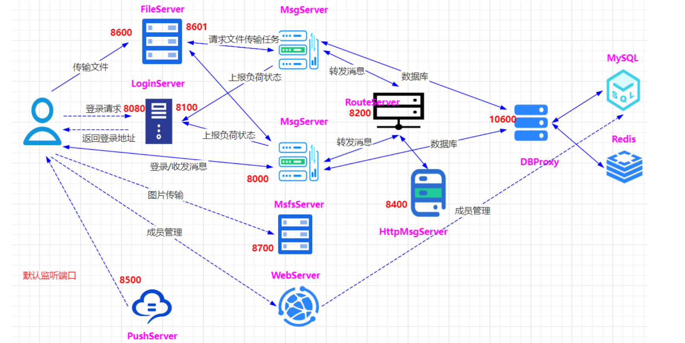

#### 分层式架构

##### 1.接入层

接入层主要功能包括：为客户端收发消息提供出入口

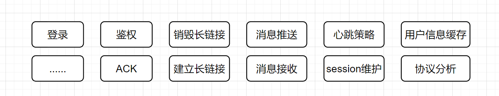

- 保持海量用户连接，

- 解析协议对传输内容进行编码，

- 维护session

- 推送消息

###### 连接整流与通信安全：

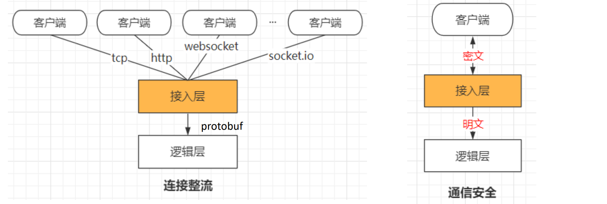

###### 报文解压缩与初步防攻击：

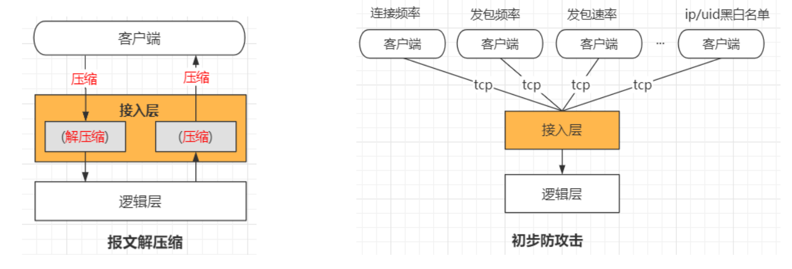

##### 2.逻辑层

核心业务层logic：负责IM系统各项功能的核心逻辑实现

1. 用户逻辑：用户登录、用户退出、用户信息查询、用户更新签名、用户分组创建
2. 好友逻辑：添加好友、删除好友、拉取好友列表、好友添加备注等
3. 群组逻辑：创建群、加入群、删除群、删除群成员等
4. 消息逻辑：单聊文字消息、单聊语音消息、群聊文字消息、群聊语音消息、拉取离线消息等
5. 其他：文件传输（需要对方点击接受）、图片传输（直接显示）
5. 关系管理逻辑：

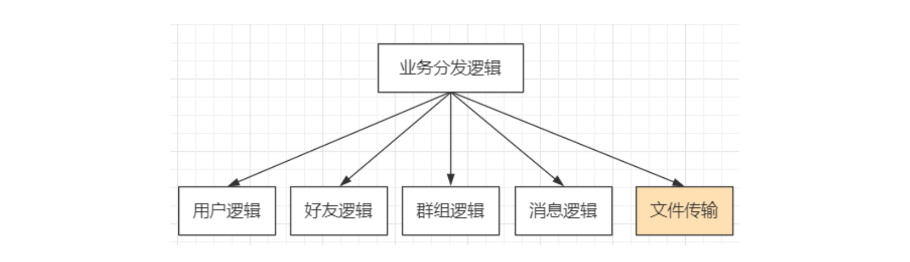

水平扩展各个逻辑模块、消息逻辑1、消息逻辑2、消息逻辑n，无缝添加新的逻辑服务，如文件传输等其他业务逻辑。

##### 3.数据代理层

数据层data：负责IM系统相关数据的持久化存储，包括消息内容、账号信息等

###### 屏蔽存储引擎：

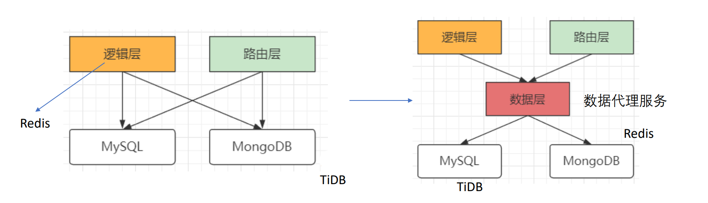

###### 屏蔽cache层：

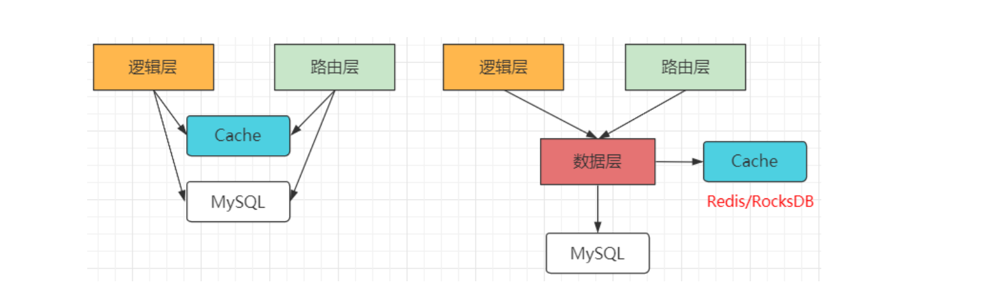

###### 提供友好接口：

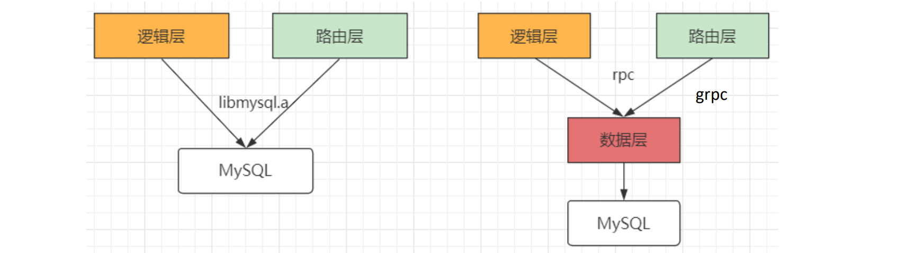

###### 提供一定扩展性：

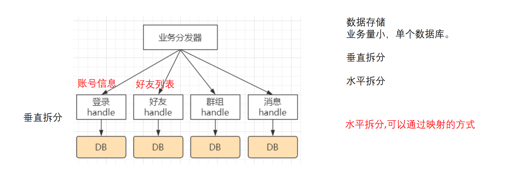

##### 4.路由层

路由层主要负责：消息投递，内存存储，用户临时数据比如用户状态信息（在线/离线等）

1. 为什么路由层需要存储用户状态信息？（在线\隐身状态）
2. 用户id与接入层的对应关系？

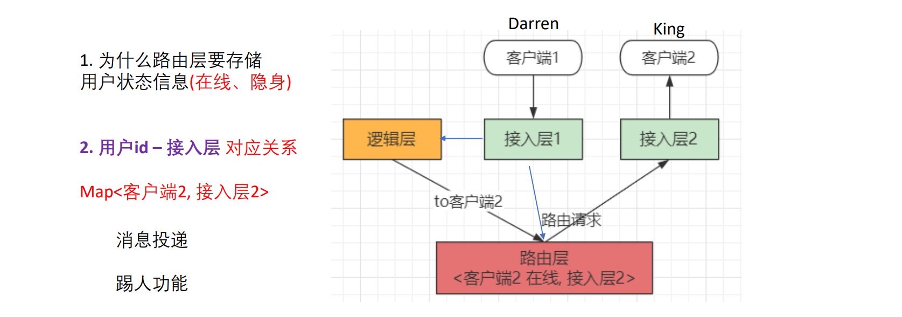

### 实际流程分析

#### 客户端登录验证

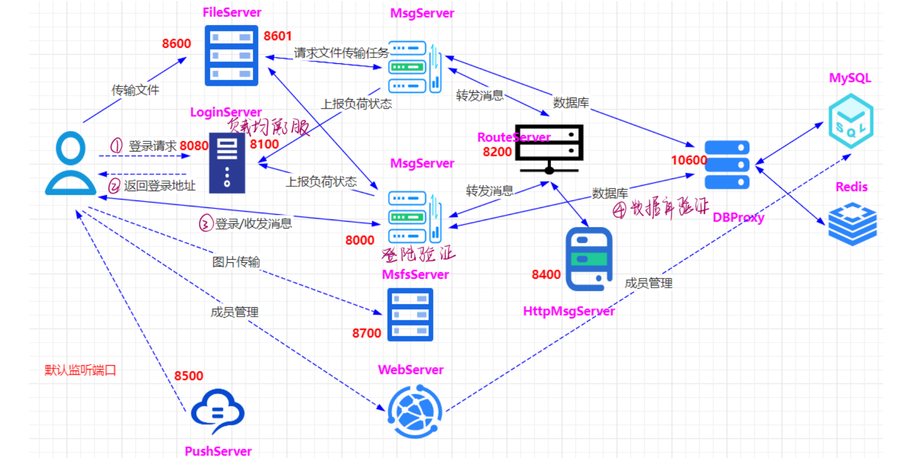

#### 即时消息发送

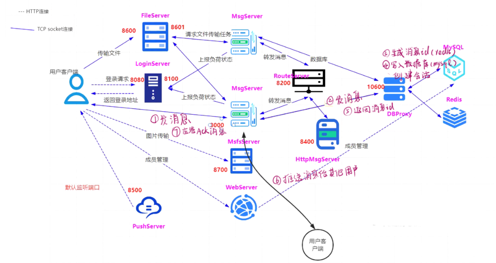

每个CImUser对应⼀个登陆⽤户，CMsgConn对应⼀个端的登录，CImUser和CMsgConn是1:n的对应关系。

1. CMsgConn::HandlePdu （msg_server模块，处理客户端的请求的信息）
2. CMsgConn::_HandleClientMsgData（msg_server模块，处理客户端的消息发送，CID_MSG_DATA命令）,重新拼装pdu，主要是增加handle作为attach数据，然后发送给db_proxy_server
3. DB_PROXY::sendMessage （db_proxy_server模块），
    1. 获取消息FromId，ToId, MsgType等，并先验证消息类型MsgType是否有效 （这⾥主要先分析单聊的情况）
    2. nSessionId 服务器分配会话id：通过CSessionModel::getSessionId查询两个⼈直接的聊天是否已经建⽴最近会话记录(从IMRecentSession表)，如果没有记录则调⽤CSessionModel::addSession创建
    3. nPeerSessionId 服务器分配对端会话id：通过CSessionModel::getSessionId查询两个⼈直接的聊天是否已经建⽴最近会话记录(从IMRecentSession表)，如果没有记录则调⽤CSessionModel::addSession创建，需要注意的是nPeerSessionId和nSessionId的FromId和ToId是相反的。
    4. nRelateId：获取通话⼈之间的关系id，如果两者之前没有关系则调⽤CRelationModel::getRelationId进⾏添加（操作IMRelationShip表）
    5. nMsgId 服务器分配消息id，CMessageModel::getMsgId根据nRelateId映射进⾏获取，（FromId和ToId相互之间的nRelateId是唯⼀的，不分⽅向性，进⽽保证相互之间发送消息时消息的顺序性），msgId存储在redis中，通过key为"msg_id_" + int2string(nRelateId)进⾏获取，每次进⾏+1的递增操作
    6. CMessageModel::sendMessage 将消息插⼊到数据库（操作IMMessage_x表），发送消息和要读取消息之间存储的是同⼀条消息：nRelateId, nFromId, nToId, nMsgType, nCreateTime,nMsgId，msg_data。
    7. 然后封装响应pPduResp，最重要的是附带nMsgId和msg回发给msg_server，使⽤CID_MSG_DATA命令。⼀样是以AddResponsePdu插⼊队列，然后SendResponsePduList进⾏回发的套路。
4. CDBServConn::HandlePdu （msg_server模块，处理dbproxy回发的数据），根据CID_MSG_DATA找到对应的处理函数
5. CDBServConn::_HandleMsgData（msg_server模块）
    1. 根据attach_data的handle查找到对应的socket通路，使⽤CID_MSG_DATA_ACK告知客户端消息已经发送到服务器。
    2. get_route_serv_conn，将pdu发送给route_server， CRouteConn::HandlePdu进⾏响应，然后调⽤CRouteConn::_BroadcastMsg转发给其他msg_server。
    3. CImUser::BroadcastClientMsgData：⼴播给消息发起者，对于发起者不需要⼴播给⾃⼰的，只需要⼴播给其他端（⽐如多端登录时，PC端发送的数据，则⼴播给Android、IOS端，不⽤再⼴播给PC端），并将该消息插⼊到m_send_msg_list
    4. CImUser::BroadcastClientMsgData：⼴播给消息接收者，有⼏端登录同⼀个账号就⼴播给⼏个端，并将该消息插⼊到m_send_msg_list
    5. CID_OTHER_GET_DEVICE_TOKEN_REQ：消息推送请求，主要是针对Android和IOS，此时由从新发回给db_proxy_server， 在setDevicesToken进⾏响应，我们这⾥不继续关注它。
6. 接收的客户端写⼊消息的回应
7. 作为接收者的客户端读取消息后回应CMsgConn::_HandleClientMsgReadAck（msg_server模块），使⽤CID_MSG_READ_ACK命令。
    1. 使⽤CID_MSG_READ_NOTIFY通知其他多端登录的客户端，已经有客户端读取了该消息。
    2. 将该msg从m_send_msg_list移除。
    3. 如果客户端没有回应，则CMsgConn::OnTimer定时器定时check消息是否已经正常发送给客户端，没有收到响应则认为g_down_msg_miss_cnt++，该详细下⾏失败。

# 相关问题

### 1.分布式架构与微服务的区别

#### 什么是微服务？

1. 是一种软件架构模式，
2. 将应用程序拆分为一组小型、独立的服务，每个服务都具有自己的业务逻辑和数据库专注于解决特定的业务问题，并可以独立部署、扩展和维护。
3. 服务通过轻量级的通信机制（如HTTP、消息队列等）进行通信，通过组合和协作提供复杂的应用功能。
4. 总结：微服务架构更加强调解耦和独立性，每个微服务都可以独立开发、测试、部署和扩展，使得系统更加灵活、可维护和可伸缩。

#### 什么是分布式架构？

分布式架构是指将一个大型系统或应用程序拆分成多个相互独立的组件（节点）并在不同的计算机或服务器上进行部署，这些组件通过网络进行通信和协作，共同完成系统的功能。分布式架构旨在解决单一计算机或服务器的性能限制和单点故障等问题，提高系统的可伸缩性、可用性和容错性。

在分布式架构中，不同的节点可以承担不同的角色和功能，例如服务提供者、服务消费者、数据存储节点等。这些节点通过网络互联，使用消息传递、远程过程调用（RPC）、RESTful API等方式进行通信和数据交换。

分布式架构的特点包括：

1. 可伸缩性：通过增加节点的数量来提高系统的处理能力和负载能力，可以根据需求动态扩展和收缩系统规模。
2. 高可用性：通过在不同的节点上部署相同的功能和数据，实现冗余和备份，以提供系统的高可用性和容错能力。当某个节点故障时，其他节点可以接管其工作，系统仍然可以继续运行。
3. 容错性：分布式架构可以通过在多个节点上存储和复制数据来提供容错性。即使某个节点发生故障或数据丢失，仍然可以从其他节点中恢复数据，保证系统的可靠性。
4. 灵活性和模块化：由于系统被拆分为多个独立的组件，每个组件可以独立开发、测试、部署和升级，具有更好的灵活性和可维护性。同时，不同的组件可以使用不同的技术栈和平台，使得系统更加模块化和可扩展。
5. 高性能：分布式架构可以将负载分摊到多个节点上，从而提高系统的整体性能和吞吐量。同时，分布式架构还可以利用就近计算和数据存储的优势，减少网络延迟和数据传输的开销。

分布式架构在现代的大型应用程序和系统中得到广泛应用，例如分布式数据库、分布式缓存、分布式文件系统、分布式计算等。

它提供了一种可扩展、可靠和高效的方式来构建和管理复杂的软件系统。

然而分布式架构也带来了一些挑战，如数据一致性、节点间通信、故障恢复等问题，需要通过合适的技术和方案进行解决。

#### teamtalk是分布式架构还是微服务？

1. TeamTalk 的服务端采用了分布式架构来支持高并发和可扩展性。
2. 虽然 TeamTalk 是一个分布式的即时通讯系统，但它并不是一个典型的微服务架构。在传统的 TeamTalk 架构中，它通常作为一个单体应用程序部署，所有的功能和服务都打包在同一个应用中。它使用内部的组件和模块来处理不同的功能，如用户管理、群组管理、消息处理等，但它们并不是独立的、自治的服务。虽然 TeamTalk 不是一个典型的微服务架构，但在某些情况下，可以将 TeamTalk 的某些功能和模块作为独立的微服务来实现，以便更好地满足特定的需求和场景。这样的拆分可能涉及到重新设计和重构现有的代码和架构，以适应微服务的原则和要求。

### 2.file_server与msfs_server的区别？

在TeamTalk中，file_server 和 msfs_server 是两个独立的服务器模块，分别用于 文件存储 和 文件传输。

#### file_server

- file_server是文件存储服务器，负责存储用户上传的文件，并提供文件的读取和下载功能。
- 主要用于存储用户在聊天过程中发送的文件，如图片、语音、视频等。
- file_server 将文件保存在磁盘上，并为每个文件分配一个唯一的文件ID。在聊天消息中，可以通过文件ID引用并下载对应的文件。

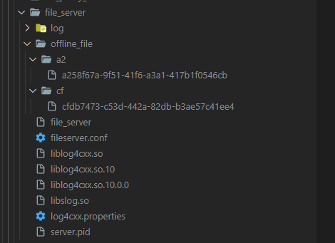

#### msfs_server

- msfs_server 是多媒体文件存储服务器，用于存储大文件和多媒体文件，支持上传和下载大文件，如音视频文件。
- 主要用于存储大文件和多媒体文件。
- 与 file_server 相比，msfs_server 具有更高的文件传输速度和并发性能。
- 它通过分片上传和断点续传的方式来支持大文件的传输，并提供了文件传输进度和速度的监控功能。

总体而言，

file_server 和 msfs_server 都是TeamTalk中用于处理文件的服务器模块，但它们的功能和应用场景略有不同。

file_server 主要用于存储聊天过程中产生的文件，而 msfs_server 则更适用于存储和传输大文件和多媒体文件。

### 3.msg_server与http_msg_server间的不同

#### MsgServer

- 作用：MsgServer是消息服务器，处理用户之间的即时通信消息。它负责消息的发送、接收和转发，以及消息的存储和离线消息的处理。MsgServer与客户端和其他服务器之间建立长连接，通过TCP/IP协议传输消息数据。
- 功能：
    - 处理用户登录和登出操作。
    - 实时接收和转发用户之间的聊天消息。
    - 存储和处理离线消息，保证用户在离线状态下也能接收到消息。
    - 维护用户的在线状态和好友列表。
- 特点：MsgServer是TeamTalk中最核心的服务器之一，它通过与客户端建立长连接，实时传输和处理用户之间的消息，保证了即时通信的效率和实时性。

#### HttpMsgServer

- 作用：HttpMsgServer是HTTP消息服务器，提供基于HTTP协议的消息服务接口。它充当了一个中转服务器，通过HTTP协议接收和处理消息，然后转发给MsgServer进行实际的消息处理。
- 功能：
    - 提供HTTP接口，接收客户端发送的消息请求。
    - 解析和验证HTTP请求，提取出消息内容和目标用户。
    - 将消息转发给MsgServer进行实际的消息处理。
    - 返回处理结果给客户端，以HTTP响应的形式。
- 特点：HttpMsgServer充当了一个消息中转站的角色，通过HTTP协议与客户端进行通信，将消息转发给MsgServer进行处理。它为客户端提供了一种便捷的接口方式，可以通过HTTP请求发送消息而无需建立长连接。

两者的主要区别在于通信协议和消息处理方式：

- MsgServer使用TCP/IP协议与客户端和其他服务器建立长连接，并通过自定义的协议传输和处理消息数据。
- HttpMsgServer使用HTTP协议与客户端进行通信，通过HTTP请求和响应进行消息的接收和转发。

需要注意的是，HttpMsgServer是基于HTTP协议的消息服务接口，它并不负责实际的消息处理和存储，而是将消息转发给MsgServer进行处理。

它提供了一种灵活和通用的方式，可以通过HTTP请求与TeamTalk进行集成和交互，比如通过网页或移动端应用发送消息、获取消息历史记录等。

### 4.etcd_login_server与cetcd的作用？

#### etcd_login_server

etcd_login_server是TeamTalk中的登录服务器组件，负责处理用户登录的逻辑。与etcd集群进行交互，通过etcd存储用户的登录信息和状态。

etcd_login_server使用etcd来保存用户的登录状态、用户权限、在线状态等信息。

当用户进行登录时，etcd_login_server会验证用户的身份信息，并更新用户的登录状态到etcd中。

#### cetcd

etcd是一个分布式键值存储系统，可以用于存储和检索各种类型的数据。

cetcd是一个C++的etcd客户端库，用于与etcd集群进行通信。它提供了一组API，用于连接etcd集群、执行数据的读写操作、监听etcd中的数据变化等功能。在TeamTalk中，cetcd被用于etcd_login_server与etcd集群之间的通信，实现用户登录信息的读写和状态的更新。

综上所述，etcd_login_server是TeamTalk的登录服务器组件，使用etcd来存储和管理用户的登录信息和状态。cetcd是TeamTalk中的etcd客户端库，用于etcd_login_server与etcd集群之间的通信。通过这两个组件的协作，TeamTalk能够实现用户的登录验证和状态管理功能。

### 5.已经有了log4cxx为什么还要slog？

从目录结构来看，`log4cxx`和`slog`都是与日志记录相关的组件。它们在项目中具有不同的作用和用途。

`log4cxx`是Apache Log4cxx日志记录框架的一部分，它提供了功能强大的日志记录和日志管理功能。Log4cxx是一个成熟的、稳定的开源项目，广泛用于C++应用程序的日志记录。通过使用`log4cxx`，开发人员可以配置和管理日志级别、日志输出位置、日志格式等。

`slog`目录下的文件则是另一个日志记录组件，可能是项目中自行开发的部分。根据目录结构来看，`slog`似乎是一个自定义的日志库或工具。它可能提供了特定项目的定制功能或者是对`log4cxx`的补充。具体而言，`slog`可能包含了一些项目特定的日志记录逻辑、定制的日志输出方式、额外的日志功能等。它可能与项目的需求、开发团队的偏好或者特定的技术要求相关。

综上所述，虽然项目中已经有了`log4cxx`作为日志记录框架，但是`log4cxx`可能无法完全满足项目的需求，因此开发团队可能选择使用`slog`来提供额外的定制化功能或满足特定的项目需求。

### 6.teamtalk中IMDiscovery模块是什么作用？

在TeamTalk中，IMDiscovery模块是用于展示"发现"页面的功能模块。

"发现"页面通常用于展示一些推荐内容、热门话题、活动等，以便用户可以发现和参与更多的社交互动。具体来说，IMDiscovery模块提供了以下功能和作用：

1. **展示推荐内容**：IMDiscovery模块可以展示推荐的内容，如热门帖子、精选文章、推荐用户等，以吸引用户的注意并提供有趣的内容。
2. **推广活动和话题**：该模块可以展示各种活动、话题或事件，如线下聚会、热门话题讨论等，以鼓励用户积极参与。
3. **发现新用户**：IMDiscovery模块可能提供推荐新用户的功能，以帮助用户发现和关注其他有趣的用户，扩大社交圈子。
4. **探索新功能**：该模块可以介绍和推广平台新增的功能和更新，帮助用户了解并尝试新的社交功能。

IMDiscovery模块在TeamTalk中起到了提供推荐内容、推广活动、发现新用户和引导用户探索新功能等作用，为用户提供更多的社交互动机会和丰富的使用体验。

### 7.http请求与tcp请求的区别？

HTTP请求和TCP请求是两种不同的概念，彼此存在一些关键区别。下面是它们之间的主要区别：

1. 层级关系：
    - HTTP（hyper text transfer protocal 超文本传输协议）是一种应用层协议，
    - TCP（Transmission Control Protocol 传输控制协议）是一种传输层协议。
    - HTTP依赖于TCP作为其传输层协议之一。
2. 功能：
    - TCP是一种面向连接的、可靠的、全双工的协议，提供端到端的数据传输。它负责将数据分割为合适的大小，并通过序列号、确认和重传机制来确保数据的可靠传输。
    - HTTP则是一种在Web上传输超文本的协议，它定义了客户端和服务器之间的通信规则。
3. 协议栈位置：
    - TCP位于传输层，它负责将应用层的数据分割成数据包，并在网络中进行可靠的传输。
    - HTTP位于应用层，它依赖于TCP来提供可靠的数据传输。
4. 连接性：
    - TCP是一种面向连接的协议，它在通信双方之间建立一个持久的连接，数据传输完成后释放连接。
    - HTTP在每次请求和响应之间是无状态的，即每个请求都是独立的，不保留与之前请求的连接状态。
5. 报文结构：
    - TCP是基于字节流的协议，它将数据分割为数据包，并通过序列号进行标识。
    - HTTP使用请求报文和响应报文的结构来传递请求和响应的头部信息和数据内容。

总结起来，HTTP是一种基于TCP的应用层协议，它定义了客户端和服务器之间的通信规则，而TCP是一种传输层协议，负责可靠地传输数据。HTTP依赖于TCP来提供底层的传输支持，以实现数据的可靠传输和连接管理。

### 8.常见的池化技术包括哪些？

池化技术是一种资源管理的方法，旨在提高资源的复用性和效率。在计算机科学领域，常见的池化技术包括以下几种：

1. 内存池（Memory Pool）：用于管理和分配内存资源，以减少动态内存分配和释放的开销。通过预先分配一块连续的内存空间，并将其划分为多个小块，然后根据需要从池中获取和释放内存块，避免频繁的内存分配和释放操作，提高内存管理效率。
2. 线程池（Thread Pool）：用于管理和复用线程资源，以降低线程创建和销毁的开销。线程池维护一定数量的线程，当需要执行任务时，可以从线程池中获取空闲线程来处理任务，执行完毕后将线程归还给线程池，避免频繁创建和销毁线程，提高线程利用率和系统性能。
3. 连接池（Connection Pool）：用于管理数据库连接资源，以减少数据库连接的建立和关闭开销。连接池预先创建一定数量的数据库连接，并将其存放在池中，当需要与数据库进行交互时，可以从连接池中获取连接来执行操作，执行完毕后将连接归还给连接池，避免频繁的连接创建和关闭操作，提高数据库访问效率和系统性能。
4. 对象池（Object Pool）：用于管理和复用对象资源，以减少对象创建和销毁的开销。对象池预先创建一定数量的对象，并将其存放在池中，当需要使用对象时，可以从池中获取空闲对象来执行任务，使用完毕后将对象放回池中，避免频繁的对象创建和销毁操作，提高对象的复用性和系统性能。

这些池化技术都旨在通过预先分配和复用资源，减少动态分配和释放的开销，从而提高系统性能、资源利用率和响应速度。

### 9.ringfifo是什么？项目中是如何使用的？

#### ringfifo概念

RingFifo 是一个通用的循环缓冲区数据结构，可以用于多线程环境下的数据交换和同步。并不是官方标准或库，因此没有官方文档。、

RingFifo 的实现可以是基于不同的编程语言和库，例如 C++、C、Python 等。由于它是一个常见的数据结构，你可以在相关编程语言的文档、论坛、博客和开发者社区中找到关于 RingFifo 的资料和使用示例。

RingFifo 是一个环形缓冲区（Circular FIFO Buffer）的实现，用于在多线程或多进程环境中进行数据的高效、线程安全的读写操作。

环形缓冲区是一种循环队列，它具有固定的大小，数据可以循环写入和读取。当写入的数据超过缓冲区大小时，新数据会覆盖旧数据。这种结构可以提供高效的数据存储和读取，特别适用于需要连续写入和读取数据的场景。

#### ringfifo在项目中的使用

在 TeamTalk 中，`RingFifo` 被用作音频数据的缓冲区。TeamTalk 是一个实时音视频通信软件，通过网络传输音频和视频数据。为了确保音频数据的实时性和流畅性，需要使用高效的数据缓冲区进行数据的存储和读取。

`RingFifo` 在 TeamTalk 中主要用于以下两个方面：

1. 音频数据缓冲：在音频采集和播放过程中，音频数据需要先写入缓冲区，然后从缓冲区读取进行处理或播放。`RingFifo` 提供了高效的数据存储和读取，确保音频数据的实时性和顺畅性。
2. 音频数据传输：在音频数据传输过程中，发送端将音频数据写入 `RingFifo` 缓冲区，接收端从缓冲区读取数据进行解码或播放。通过使用环形缓冲区，可以实现发送端和接收端的数据传输的同步和流畅性。

通过使用 `RingFifo`，TeamTalk 实现了高效、可靠的音频数据传输和处理，提供了良好的实时通信体验。

#### ringfifo在第三方库中的使用

对于 C++，有一些第三方库和实现提供了 RingFifo 的功能。以下是一些常见的 C++ 实现和库：

1. Boost.CircularBuffer: Boost 库是一个流行的 C++ 库，其中的 Boost.CircularBuffer 提供了一个循环缓冲区实现，类似于 RingFifo 的功能。你可以在 Boost 的官方文档中找到有关 Boost.CircularBuffer 的详细信息和用法示例。
2. concurrentqueue: concurrentqueue 是一个 C++11 实现的无锁并发队列库，其中包含了一个无锁循环缓冲区的实现。它是基于模板的，可以用于多线程环境下的数据交换和同步。
3. folly::ProducerConsumerQueue: folly 是 Facebook 开源的 C++ 库，其中的 folly::ProducerConsumerQueue 提供了一个基于循环缓冲区的生产者-消费者队列实现。你可以在 folly 的官方文档中找到有关 folly::ProducerConsumerQueue 的更多信息。

这些库提供了 RingFifo 的功能，并且具有不同的特性和使用方式。根据需求选择适合的库进行使用。它们并非官方标准或官方推荐库，但它们在 C++ 社区中得到了广泛应用和认可。

在使用这些库之前，建议查阅它们的官方文档以了解详细的使用方法、API 和示例。通过搜索相应库的名称和关键词来找到官方文档和相关资源。

### 10.若用webRTC实现音视频传输还需要ringfifo吗？

如果已使用了 WebRTC 进行实时音视频通信，那么通常情况下不需要额外使用 RingFifo。WebRTC 本身提供了音频和视频的缓冲和传输功能，包括音频数据的采集、编码、解码、播放以及网络传输等。

WebRTC 底层已经实现了自己的缓冲区管理和数据传输机制，它会处理音频数据的缓冲和传输，以保证实时性和流畅性。因此就不需要额外引入 RingFifo 来处理音频数据的缓冲和传输。

然而，根据具体的使用场景和需求，有时你可能需要使用额外的缓冲区或数据处理机制。例如，你可能需要在 WebRTC 处理的基础上添加自定义的音频处理逻辑，或者在数据传输过程中进行一些额外的控制和优化。这种情况下，你可以根据具体需求考虑是否使用 RingFifo 或其他自定义的缓冲区实现。

总之，使用 WebRTC 时，通常情况下可以依赖 WebRTC 自身的缓冲和传输机制，而无需额外引入 RingFifo。但如果你有特殊需求或需要自定义的数据处理逻辑，可以考虑使用额外的缓冲区实现。

### 11.muduo库中有使用到ringfifo吗？

Muduo 是一个基于 C++ 的多线程网络库，它提供了高性能的网络编程和并发处理功能。在 Muduo 库中，并没有直接使用名为 "RingFifo" 的组件或类。

然而，Muduo 库本身提供了一些与 RingFifo 类似的功能和数据结构，用于实现高效的并发通信和数据传输。

例如，Muduo 提供了基于事件驱动的消息队列、循环缓冲区和环形缓冲区等组件，用于在多线程环境下进行数据交换和同步。这些组件使用了类似 RingFifo 的原理，通过环形结构和读写指针的方式实现高效的数据处理。

在 Muduo 库中，你可以找到以下与 RingFifo 类似的组件和类：

1. muduo::CircularBuffer：Muduo 提供了一个 CircularBuffer 类，用于实现循环缓冲区的功能。它允许在多线程环境下高效地读写数据，并且支持多种数据类型。你可以在 Muduo 的文档和源代码中找到有关 CircularBuffer 的详细信息和使用示例。
2. muduo::BlockingQueue：Muduo 还提供了一个 BlockingQueue 类，它是一个基于事件驱动的阻塞队列，用于在生产者和消费者之间传递数据。它使用了循环缓冲区的概念，通过读写指针实现数据的高效传输和同步。

这些组件和类在 Muduo 库中广泛应用于并发编程和网络通信的场景中。虽然它们可能没有直接称为 "RingFifo"，但它们提供了类似的功能和性能优势。如果你使用 Muduo 库进行网络编程和并发处理，可以考虑使用这些组件来实现高效的数据传输和同步。

### 12.为什么服务端的代码需要考虑跨多平台？

为什么服务端代码需要考虑跨多平台？直接在Linux操作系统上运行不就好了吗？反正现在大部分服务端的程序都是部署在liunx系统上？

<mark>回答</mark>：

服务端的代码需要考虑跨多平台的原因是为了使其能够在不同的操作系统上运行和部署。团队通信软件通常需要在不同的操作系统上提供服务，以满足不同用户的需求。而不同的操作系统具有不同的网络编程接口和系统调用，因此需要编写跨平台的代码来适配不同的操作系统。

跨平台编程可以使代码具有更好的可移植性和可扩展性，同时减少开发和维护的工作量。通过采用跨平台的编程技术，开发人员可以将注意力集中在业务逻辑和功能实现上，而无需为每个目标平台编写完全不同的代码。

对于服务端而言，跨平台的设计和实现可以使其在不同的服务器操作系统上运行，例如Windows、Linux和MacOS等，以满足不同服务器环境的需求。这样可以更广泛地覆盖用户群体，并提供统一的团队通信解决方案。

为什么有些客户喜欢将服务端部署在非linux系统下？

<mark>回答</mark>：

1. 平台依赖性：某些客户可能已经在自己的基础设施中使用了特定的操作系统，例如Windows或macOS。他们可能更喜欢在已有的基础设施上部署服务端，以充分利用其现有的资源和管理工具。在这种情况下，将服务端部署在非Linux系统下是符合他们现有环境的选择。
2. 技术支持：不同的客户可能有不同的技术团队和支持资源。如果客户的技术团队更加熟悉非Linux系统，他们可能更倾向于在自己熟悉的平台上进行部署和管理。这样可以更快地解决问题，提供技术支持和维护服务端。
3. 安全和合规性要求：在某些行业或组织中，存在特定的安全和合规性要求。这些要求可能需要使用特定的操作系统和软件配置。如果客户的业务需要满足特定的安全标准或合规性要求，他们可能会选择在非Linux系统下部署服务端，以符合相关的安全和合规性要求。
4. 商业需求：有时，客户的决策可能基于商业需求或策略考虑。他们可能有与特定平台相关的合作伙伴关系、授权协议或其他业务约束。在这种情况下，客户可能需要将服务端部署在特定的非Linux系统上，以满足商业合作或合同要求。

总之，选择将服务端部署在非Linux系统下的原因可能因客户的特定需求和限制而异。这取决于客户的技术要求、平台偏好、安全合规性需求和商业考虑等因素。作为服务提供商，灵活地支持不同的操作系统和部署选择可以满足客户多样化的需求，并提供更广泛的服务范围。

