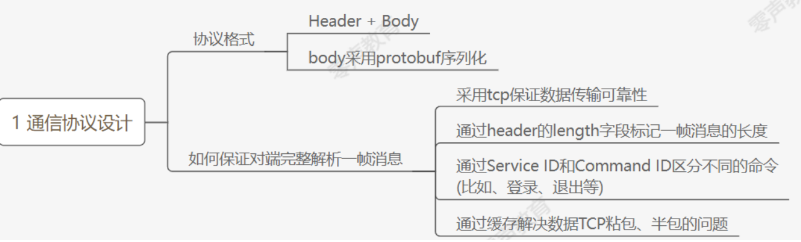
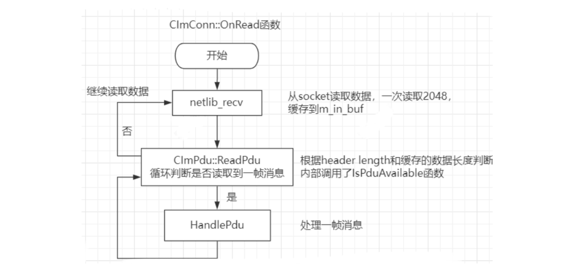

# 通讯协议设计
---

### 1.协议格式



协议格式：Header + body（body采用protobuf序列化）

如何保证对端完整解析——帧消息？

1. 采用tcp保证数据传输的可靠性
2. 通过header的<font color='#BAOC2F'>length字段</font>标记1帧消息的长度
3. 通过serviceId和commandId区分不同的命令（如登录、退出等）
4. 通过缓存解决数据TCP粘包、半包的问题

对于消息的处理有很对的消息应答包，从服务器读取消息后需要告诉服务器数据已经读取成功，发送ACK应答包，保证业务逻辑应答的完整性

单纯靠Tcp是无法保证业务逻辑的，需要应答机制保证业务逻辑完整性，

| 协议头字段                              | 类型           | 长度（字节） | 说明                                      |
| --------------------------------------- | -------------- | ------------ | ----------------------------------------- |
| <font color='#BAOC2F'>length</font>     | unsigned int   | 4            | 整个包的长度（协议头+body）               |
| version                                 | unsigned short | 2            | 通信协议的版本号                          |
| appid                                   | unsigned short | 2            | 对外SDK提供服务时，用来识别不同的客户     |
| <font color='#BAOC2F'>service_id</font> | unsigned short | 2            | 对应命令的分组，如login与msg是不同的分组  |
| <font color='#BAOC2F'>command_id</font> | unsigned short | 2            | 分组里面的子命令，如login与login response |
| <font color='#BAOC2F'>seq_num</font>    | unsigned short | 2            | 包序号（保证消息发送的有序性）            |
| reserve                                 | unsigned short | 2            | 预留字节                                  |

```cpp
typedef struct {
    uint32_t length; // the whole pdu length 代表这个包
    uint16_t version; // pdu version number
    uint16_t appid; // not used
    uint16_t service_id; //service_id
    uint16_t command_id; //command_id
    uint16_t seq_num; // 包序号
    uint16_t reversed; // 保留
} PduHeader_t;
```

Header + body

| body字段 | 类型            | 长度（字节） | 说明                              |
| -------- | --------------- | ------------ | --------------------------------- |
| body     | unsigned char[] | n            | 具体的协议数据（具体的proto内容） |


### 2.service_id

```protobuf
// service id
enum ServiceID{
    SID_LOGIN           = 0x0001;           // for login
    SID_BUDDY_LIST      = 0x0002;		    // for friend list
    SID_MSG             = 0x0003;           //
    SID_GROUP           = 0x0004;           // for group message
    SID_FILE            = 0x0005;
    SID_SWITCH_SERVICE  = 0x0006;
    SID_OTHER           = 0x0007;
    SID_INTERNAL        = 0x0008;		     
}
```

#### SID_LOGIN 登录相关

消息类型service_id&command_id：

```cpp
// command id for login
enum LoginCmdID{
    CID_LOGIN_REQ_MSGSERVER         = 0x0101; 	//
    CID_LOGIN_RES_MSGSERVER         = 0x0102;	//
    CID_LOGIN_REQ_USERLOGIN         = 0x0103;	//用户登录请求
    CID_LOGIN_RES_USERLOGIN         = 0x0104;	//用户登录响应
    CID_LOGIN_REQ_LOGINOUT          = 0x0105;	//
    CID_LOGIN_RES_LOGINOUT          = 0x0106; 	//
    CID_LOGIN_KICK_USER				= 0x0107; 	//
    CID_LOGIN_REQ_DEVICETOKEN       = 0x0108;  //
    CID_LOGIN_RES_DEVICETOKEN       = 0x0109;  //
    CID_LOGIN_REQ_KICKPCCLIENT      = 0x010a;
    CID_LOGIN_RES_KICKPCCLIENT      = 0x010b;
    CID_LOGIN_REQ_PUSH_SHIELD       = 0x010c;	//勿扰
    CID_LOGIN_RES_PUSH_SHIELD       = 0x010d; 	//
    CID_LOGIN_REQ_QUERY_PUSH_SHIELD = 0x010e; 	//
    CID_LOGIN_RES_QUERY_PUSH_SHIELD = 0x010f;
    CID_LOGIN_REQ_REGIST = 0x0110;     // 注册新用户
    CID_LOGIN_RES_REGIST = 0x0111;	
}
```

#### SID_BUDDY_LIST 好友相关

```cpp
// command id for buddy list
enum BuddyListCmdID{
    CID_BUDDY_LIST_RECENT_CONTACT_SESSION_REQUEST       = 0x0201;
    CID_BUDDY_LIST_RECENT_CONTACT_SESSION_RESPONSE      = 0x0202;
    CID_BUDDY_LIST_STATUS_NOTIFY                        = 0x0203; //
    CID_BUDDY_LIST_USER_INFO_REQUEST                    = 0x0204; //
    CID_BUDDY_LIST_USER_INFO_RESPONSE                   = 0x0205;
    CID_BUDDY_LIST_REMOVE_SESSION_REQ                   = 0x0206;
    CID_BUDDY_LIST_REMOVE_SESSION_RES                   = 0x0207;
    CID_BUDDY_LIST_ALL_USER_REQUEST                     = 0x0208;
    CID_BUDDY_LIST_ALL_USER_RESPONSE                    = 0x0209;
    CID_BUDDY_LIST_USERS_STATUS_REQUEST                 = 0x020a;
    CID_BUDDY_LIST_USERS_STATUS_RESPONSE                = 0x020b;
    CID_BUDDY_LIST_CHANGE_AVATAR_REQUEST                = 0x020c;
    CID_BUDDY_LIST_CHANGE_AVATAR_RESPONSE               = 0x020d;
    CID_BUDDY_LIST_PC_LOGIN_STATUS_NOTIFY               = 0x020e;
    CID_BUDDY_LIST_REMOVE_SESSION_NOTIFY                = 0x020f;
    CID_BUDDY_LIST_DEPARTMENT_REQUEST                   = 0x0210;
    CID_BUDDY_LIST_DEPARTMENT_RESPONSE                  = 0x0211;
    CID_BUDDY_LIST_AVATAR_CHANGED_NOTIFY                = 0x0212; //头像更改通知
    CID_BUDDY_LIST_CHANGE_SIGN_INFO_REQUEST             = 0x0213; //修改个性签名请求
    CID_BUDDY_LIST_CHANGE_SIGN_INFO_RESPONSE            = 0x0214; //
    CID_BUDDY_LIST_SIGN_INFO_CHANGED_NOTIFY             = 0x0215; //签名修改通知
}
```

#### SID_MSG 消息相关

```cpp
// command id for msg
enum MessageCmdID{
    CID_MSG_DATA					= 0x0301;	//  对方需要用 CID_MSG_READ_ACK
    CID_MSG_DATA_ACK				= 0x0302; 	//   CID_MSG_DATA_ACK 服务要应答发送端
    CID_MSG_READ_ACK				= 0x0303; 	//
    CID_MSG_READ_NOTIFY     		= 0x0304;    //  已读消息通知
    CID_MSG_TIME_REQUEST 			= 0x0305;	//
    CID_MSG_TIME_RESPONSE			= 0x0306; 	//
    CID_MSG_UNREAD_CNT_REQUEST		= 0x0307; 	//
    CID_MSG_UNREAD_CNT_RESPONSE		= 0x0308;	//
    CID_MSG_LIST_REQUEST            = 0x0309;    //获取指定队列消息
    CID_MSG_LIST_RESPONSE           = 0x030a;
    CID_MSG_GET_LATEST_MSG_ID_REQ   = 0x030b;
    CID_MSG_GET_LATEST_MSG_ID_RSP   = 0x030c;
    CID_MSG_GET_BY_MSG_ID_REQ       = 0x030d;
    CID_MSG_GET_BY_MSG_ID_RES       = 0x030e;
}
```

#### SID_GROUP 群组相关

```cpp
// command id for group message
enum GroupCmdID{
    CID_GROUP_NORMAL_LIST_REQUEST			= 0x0401;
    CID_GROUP_NORMAL_LIST_RESPONSE			= 0x0402;
    CID_GROUP_INFO_REQUEST          		= 0x0403;
    CID_GROUP_INFO_RESPONSE         		= 0x0404;
    CID_GROUP_CREATE_REQUEST                = 0x0405;
    CID_GROUP_CREATE_RESPONSE               = 0x0406;
    CID_GROUP_CHANGE_MEMBER_REQUEST 		= 0x0407;
    CID_GROUP_CHANGE_MEMBER_RESPONSE 		= 0x0408;
    CID_GROUP_SHIELD_GROUP_REQUEST  		= 0x0409;
    CID_GROUP_SHIELD_GROUP_RESPONSE 		= 0x040a;
    CID_GROUP_CHANGE_MEMBER_NOTIFY			= 0x040b;
}
```

#### SID_FILE 文件传输相关

```cpp
enum FileCmdID{
    CID_FILE_LOGIN_REQ              = 0x0501; // sender/receiver need to login to
    CID_FILE_LOGIN_RES              = 0x0502; // login success or failure
    CID_FILE_STATE                  = 0x0503;
    CID_FILE_PULL_DATA_REQ          = 0x0504;
    CID_FILE_PULL_DATA_RSP          = 0x0505;
    // To MsgServer
    CID_FILE_REQUEST                = 0x0506; // sender -> receiver
    CID_FILE_RESPONSE               = 0x0507; // receiver -> sender
    CID_FILE_NOTIFY                 = 0x0508;
    CID_FILE_HAS_OFFLINE_REQ        = 0x0509;
    CID_FILE_HAS_OFFLINE_RES        = 0x050a;
    CID_FILE_ADD_OFFLINE_REQ        = 0x050b;
    CID_FILE_DEL_OFFLINE_REQ        = 0x050c;
}
```

#### SID_SWITCH_SERVICE 转换服务

```cpp
// command id for switch service
enum SwitchServiceCmdID{
    CID_SWITCH_P2P_CMD	= 0x0601;	//
}
```

#### SID_OTHER 其他服务

```cpp
enum OtherCmdID{
    CID_OTHER_HEARTBEAT                     = 0x0701;
    CID_OTHER_STOP_RECV_PACKET              = 0x0702;
    CID_OTHER_VALIDATE_REQ                  = 0x0703;
    CID_OTHER_VALIDATE_RSP                  = 0x0704;
    CID_OTHER_GET_DEVICE_TOKEN_REQ          = 0x0705;
    CID_OTHER_GET_DEVICE_TOKEN_RSP          = 0x0706;
    CID_OTHER_ROLE_SET                      = 0x0707;
    CID_OTHER_ONLINE_USER_INFO              = 0x0708;
    CID_OTHER_MSG_SERV_INFO                 = 0x0709;
    CID_OTHER_USER_STATUS_UPDATE            = 0x070a;
    CID_OTHER_USER_CNT_UPDATE               = 0x070b;
    CID_OTHER_SERVER_KICK_USER              = 0x070d;
    CID_OTHER_LOGIN_STATUS_NOTIFY           = 0x070e;
    CID_OTHER_PUSH_TO_USER_REQ              = 0x070f;
    CID_OTHER_PUSH_TO_USER_RSP              = 0x0710;
    CID_OTHER_GET_SHIELD_REQ                = 0x0711;
    CID_OTHER_GET_SHIELD_RSP                = 0x0712;
    CID_OTHER_FILE_TRANSFER_REQ             = 0x0731;
    CID_OTHER_FILE_TRANSFER_RSP             = 0x0732;
    CID_OTHER_FILE_SERVER_IP_REQ            = 0x0733;
    CID_OTHER_FILE_SERVER_IP_RSP            = 0x0734;
}
```

#### ResultType返回类型

```cpp
enum ResultType{
	REFUSE_REASON_NONE				= 0;
	REFUSE_REASON_NO_MSG_SERVER		= 1;
	REFUSE_REASON_MSG_SERVER_FULL 	= 2;
	REFUSE_REASON_NO_DB_SERVER		= 3;
	REFUSE_REASON_NO_LOGIN_SERVER	= 4;
	REFUSE_REASON_NO_ROUTE_SERVER	= 5;
	REFUSE_REASON_DB_VALIDATE_FAILED = 6;
	REFUSE_REASON_VERSION_TOO_OLD	= 7;

}

enum KickReasonType{
	KICK_REASON_DUPLICATE_USER = 1;
    KICK_REASON_MOBILE_KICK    = 2;
}

enum OnlineListType{
	ONLINE_LIST_TYPE_FRIEND_LIST = 1;
}

enum UserStatType{
	USER_STATUS_ONLINE 	= 1;
	USER_STATUS_OFFLINE	= 2;
	USER_STATUS_LEAVE	= 3;
}

enum SessionType{
	SESSION_TYPE_SINGLE = 1;          	//单个用户会话
	SESSION_TYPE_GROUP = 2;          	//群会话
}

enum MsgType{
	MSG_TYPE_SINGLE_TEXT    = 0x01;
    MSG_TYPE_SINGLE_AUDIO   = 0x02;
    MSG_TYPE_GROUP_TEXT     = 0x11;
    MSG_TYPE_GROUP_AUDIO    = 0x12;
}

enum ClientType{
	CLIENT_TYPE_WINDOWS     = 0x01;
    CLIENT_TYPE_MAC         = 0x02;
    CLIENT_TYPE_IOS         = 0x11;
    CLIENT_TYPE_ANDROID     = 0x12;
}

enum GroupType{
	GROUP_TYPE_NORMAL		= 0x01;
	GROUP_TYPE_TMP			= 0x02;
}

enum GroupModifyType{
	GROUP_MODIFY_TYPE_ADD	= 0x01;
	GROUP_MODIFY_TYPE_DEL	= 0x02;
}

enum TransferFileType{
    FILE_TYPE_ONLINE        = 0x01;
    FILE_TYPE_OFFLINE       = 0x02;
}

enum ClientFileState{
    CLIENT_FILE_PEER_READY  = 0x00;
    CLIENT_FILE_CANCEL      = 0x01;
    CLIENT_FILE_REFUSE      = 0x02;
    CLIENT_FILE_DONE       = 0x03;
}

enum ClientFileRole{
    CLIENT_REALTIME_SENDER  = 0x01;
    CLIENT_REALTIME_RECVER  = 0x02;
    CLIENT_OFFLINE_UPLOAD   = 0x03;
    CLIENT_OFFLINE_DOWNLOAD = 0x04;
}

enum FileServerError{
    FILE_SERVER_ERRNO_OK                                = 0x00;
    FILE_SERVER_ERRNO_CREATE_TASK_ID_ERROR              = 0x01;
    FILE_SERVER_ERRNO_CREATE_TASK_ERROR                 = 0x02;
    FILE_SERVER_ERRNO_LOGIN_INVALID_TOKEN               = 0x03;
    FILE_SERVER_ERRNO_INVALID_USER_FOR_TASK             = 0x04;
    FILE_SERVER_ERRNO_PULL_DATA_WITH_INVALID_TASK_ID    = 0x05;
    FILE_SERVER_ERRNO_PULL_DATA_ILLIEAGE_USER           = 0x06;
    FILE_SERVER_ERRNO_PULL_DATA_MKDIR_ERROR             = 0x07;
    FILE_SERVER_ERRNO_PULL_DATA_OPEN_FILE_ERROR         = 0x08;
    FILE_SERVER_ERRNO_PULL_DATA_READ_FILE_HEADER_ERROR  = 0x09;
    FILE_SERVER_ERRNO_PULL_DATA_ALLOC_MEM_ERROR         = 0x0a;
    FILE_SERVER_ERRNO_PULL_DATA_SEEK_OFFSET_ERROR       = 0x0b;
    FILE_SERVER_ERRNO_PULL_DATA_FINISHED                = 0x0c;
}

enum SessionStatusType{
    SESSION_STATUS_OK           = 0x00;
    SESSION_STATUS_DELETE       = 0x01;
}

enum DepartmentStatusType{
    DEPT_STATUS_OK              = 0x00;
    DEPT_STATUS_DELETE          = 0x01;
}

message IpAddr{
	required string ip = 1;
	required uint32 port = 2;
}

message UserInfo{
	required uint32 user_id = 1;
	required uint32 user_gender = 2; 	//// 用户性别,男：1 女：2 人妖/外星人：0
	required string user_nick_name = 3;	//绰号
	required string avatar_url = 4;
	required uint32 department_id = 5;
	required string email = 6;
	required string user_real_name = 7;	//真名
	required string user_tel = 8;
	required string user_domain = 9;	//用户名拼音
    required uint32 status = 10;        //0:在职  1. 试用期 2. 正式 3. 离职 4.实习,  client端需要对“离职”进行不展示
    optional string sign_info = 11;
}

message ContactSessionInfo{
	required uint32 session_id = 1;
	required SessionType session_type = 2;
    required SessionStatusType session_status = 3;
	required uint32 updated_time = 4;
	required uint32 latest_msg_id = 5;
	required bytes latest_msg_data = 6;
    required MsgType latest_msg_type = 7;
    required uint32 latest_msg_from_user_id = 8;
}

message UserStat{
	required uint32 user_id = 1;
	required UserStatType status = 2;
}

message ServerUserStat{
	required uint32 user_id = 1;
	required UserStatType status = 2;
	required ClientType client_type = 3;
}

message UnreadInfo{
	required uint32 session_id = 1;
	required SessionType session_type = 2;
	required uint32 unread_cnt = 3;
	required uint32 latest_msg_id = 4;
	required bytes latest_msg_data = 5;
    required MsgType latest_msg_type = 6;
    required uint32 latest_msg_from_user_id = 7;        //发送得用户id
}

message MsgInfo{
	required uint32 msg_id = 1;
	required uint32 from_session_id = 2;   //发送的用户id
	required uint32 create_time = 3;
	required MsgType msg_type = 4;
	required bytes msg_data = 5;
}

message GroupVersionInfo{
	required uint32 group_id = 1;
	required uint32 version = 2;
	
}

message GroupInfo{
	required uint32 group_id = 1;
	required uint32 version = 2;
	required string group_name = 3;
	required string group_avatar = 4;
	required uint32 group_creator_id = 5;
	required GroupType group_type = 6;
	required uint32 shield_status = 7;		//1: shield  0: not shield 
	repeated uint32 group_member_list = 8;
}

message UserTokenInfo{
    required uint32 user_id = 1;
	required ClientType user_type = 2;
	required string token = 3;
	required uint32 push_count = 4;
	required uint32 push_type = 5;			//1: 正常推送  	2:无打扰式推送
}

message PushResult{
	required string user_token = 1;
	required uint32 result_code = 2;
}

message ShieldStatus{
	required uint32 user_id = 1;		
	required uint32 group_id = 2;	
	required uint32 shield_status = 3;		//1: shield  0: not shield 
}

message OfflineFileInfo{
    required uint32 from_user_id = 1;
    required string task_id = 2;
    required string file_name = 3;
    required uint32 file_size = 4;
}

message DepartInfo{
	required uint32 dept_id = 1;
	required uint32 priority = 2;
	required string dept_name = 3;
    required uint32 parent_dept_id = 4;
    required DepartmentStatusType dept_status = 5;
}

message PushShieldStatus{
    required uint32 user_id = 1;
    required uint32 shield_status = 2;		//1: shield  0: not shield
}
```


### 3.Pb文件说明

所有协议并非完全一致，有些协议不知道具体放在哪个文件合适，就挑选了一个相对合适的文件放入。

1. create.sh：将对应的proto文件生成对应的.cc与.h文件
2. IM.BaseDefine.proto：该文件定义了service_id,command_id以及一些基础数据结构，如用户，部门等
3. IM.Buddy.proto：该文件定义了与最近联系人，会话相关的协议。
4. IM.File.proto：该文件定义了文件传输相关的协议，但是暂未使用。
5. IM.Group.proto：该文件定义了与群组相关的协议。
6. IM.Login.proto：该文件定义了与登录相关的协议。
7. IM.Message.proto：该文件定义了与消息相关的协议
8. IM.Other.proto：该文件目前只有一个心跳协议。
9. IM.Server.proto：该文件定义了服务端之间专属的协议
10. IM.SwitchService.proto：该文件定义了用户之间的P2P消息，比如正在输入等，服务端不关心具体协议内容，只做转发，客户端互相之间知道协议的含义。

#### 1.基础数据结构定义

基础数据结构的定义在IM.BaseDefine.proto中。

1. ServiceID：服务号，对不同的协议进行归类，便于后面针对模块进行分类。
2. LoginCmdID：登陆相关的命令。
3. BuddyListCmdID：最近联系人，会话等相关命令。
4. MessageCmdID：消息相关命令。
5. GroupCmdID：群组相关命令。
6. FileCmdID：文件传输相关命令。
7. SwitchServiceCmdID：定义了P2P命令。
8. OtherCmdID：定义了一些其他的命令，目前只使用了心跳。
9. ResultType：这里定义了登陆返回错误码。
10. KickReasonType：这里定义了用户被踢的原因。 
11. OnlineListType：o(╯□╰)o
12. UserStatType：用户状态定义。
13. SessionType：会话类型，群组，还是单聊。
14. MsgType：消息类型，单聊文字，单聊语音，群聊文字，群聊语音。
15. ClientType：客户端类型，包含win，mac， Android， iOS
16. GroupType：群组类型，临时群，固定群。
17. GroupModifyType：群成员更改类型，增加成员，删除成员。
18. FileType：文件传输类型，在线传输，离线传输。
19. ClientFileState：文件传输状态定义。
20. ClientFileRole：文件传输角色定义。
21. FileServerError：文件传输错误码。
22. SessionStatusType：最近联系人(会话)状态定义，删除，正常。
23. DepartmentStatusType：部门状态定义。
24. IpAddr：一组服务的唯一标识：IP+port定义
25. UserInfo：用户信息数据结构。
26. ContactSessionInfo：最近联系人(会话)数据结构
27. UserStat：用户状态数据结构
28. ServerUserStat：服务端用户状态数据结构，比UserStat多了一个用户所在端。
29. UnreadInfo：未读消息数据结构，其中seession_id定义的有点歧义，在这里标识对方id(可以理解为peer_id)，如果是单聊，表示对方id，如果是群组，表示群id
30. MsgInfo：消息数据结构，session_id同上。
31. GroupVersionInfo：群组版本信息数据结构，为增量推送群组信息考虑。
32. GroupInfo：群组数据结构。
33. UserTokenInfo：推送用户token数据结构。
34. PushResult：推送结果定义。
35. ShieldStatus：群消息推送屏蔽状态
36. OfflineFileInfo：离线文件信息。
37. DepartInfo：部门信息数据结构。


#### 2.最近会话相关协议

该系列协议定义在IM.Buddy.proto中，主要定义了最近联系人(会话)相关的协议。

1. IMRecentContactSessionReq：最近联系人会话请求。
2. IMRecentContactSessionRsp：最近联系人会话应答。
3. IMUserStatNotify：用户状态通知。
4. IMUsersInfoReq：用户信息请求
5. IMUsersInfoRsp：用户信息应答。
6. IMRemoveSessionReq：删除最近会话请求
7. IMRemoveSessionRsp：删除最近会话应答
8. IMAllUserReq：所有用户请求，其中带了一个latest_update_time字段，请求应答会返回latest_update_time时间之后发生变化的用户回来。
9. IMAllUserRsp：所有用户应答，同事携带一个新的latest_update_time本次最新的用户变化时间，下次请求带上这个字段即可。
10. IMUsersStatReq：用户状态请求。
11. IMUsersStatRsp：用户状态应答。
12. IMChangeAvatarReq：更改头像请求(暂时未使用)
13. IMChangeAvatarRsp：更改头像应答(暂时未使用)
14. IMPCLoginStatusNotify：PC登陆后通知移动端。
15. IMRemoveSessionNotify：删除会话后的通知，用于多端同步。
16. IMDepartmentReq：部门信息请求。
17. IMDepartmentRsp：部门信息应答。

#### 3.文件传输协议

该系列协议定义在IM.File.proto中，因为暂时未使用，暂不做说明。

#### 4.群组相关协议

该系列协议定义在IM.Group.proto中，定义了与群组相关的协议。

1. IMNormalGroupListReq：用户所在固定群组请求。
2. IMNormalGroupListRsp：用户所在固定群组应答。
3. IMGroupInfoListReq：群组信息请求。
4. IMGroupInfoListRsp：群组信息应答。
5. IMGroupCreateReq：创建群组请求。
6. IMGroupCreateRsp：创建群组应答。
7. IMGroupChangeMemberReq：群组成员变更请求。
8. IMGroupChangeMemberRsp：群组成员变更应答。
9. IMGroupShieldReq：屏蔽群组请求。
10. IMGroupShieldRsp：屏蔽群组应答。
11. IMGroupChangeMemberNotify：群组成员变更通知。

#### 5.登陆相关协议

该系列协议定义在IM.Login.proto文件中，定义了一系列与登陆相关的协议。

1. IMMsgServReq：msg_server地址请求(已经废弃，改用http请求)
2. IMMsgServRsp：msg_server地址应答(已经废弃)
3. IMLoginReq：登陆请求
4. IMLoginRes：登陆应答。
5. IMLogoutReq：登出请求。
6. IMLogoutRsp：登出应答。
7. IMKickUser：踢用户。
8. IMDeviceTokenReq：设备token汇报请求(用于推送)
9. IMDeviceTokenRsp：设备token汇报应答
10. IMKickPCClientReq：移动端踢PC端请求
11. IMKickPCClientRsp：移动端踢PC端应答。

#### 6.消息相关协议

该系列协议定义在IM.Message.proto文件中，定义了一系列与消息相关的协议。

1. IMMsgData：发送消息协议。
2. IMMsgDataAck：消息收到回复。
3. IMMsgDataReadAck：消息已读回复。
4. IMMsgDataReadNotify：消息已读通知，用于多端同步。
5. IMClientTimeReq：服务器时间请求。
6. IMClientTimeRsp：服务器时间回复。
7. IMUnreadMsgCntReq：未读消息计数请求。
8. IMUnreadMsgCntRsp：未读消息计数回复
9. IMGetMsgListReq：获取消息请求。
10. IMGetMsgListRsp：获取消息回复。对于群而言，如果消息数目返回的数值小于请求的cnt,则表示群的消息能拉取的到头了，更早的消息没有权限拉取。如果msg_cnt 和 msg_id_begin计算得到的最早消息id与实际返回的最早消息id不一致，说明服务器消息有缺失，需客户端做一个缺失标记，避免下次再次拉取。
11. IMGetLatestMsgIdReq：获取某个会话最新msg_id请求
12. IMGetLatestMsgIdRsp：获取某个会话最新msg_id回复
13. IMGetMsgByIdReq：通过msg_id获取消息请求
14. IMGetMsgByIdRsp：通过msg_id获取消息回复

#### 7.其他协议

该系列协议定义在IM.Other.proto文件中，目前只定义了心跳协议。

1. IMHeartBeat：心跳协议

#### 8.服务器端之间专属协议

该系列协议定义在IM.Server.proto文件中，定义了服务端之间专属的相关协议。主要用于msg_server与db_proxy之间的通信。

1. IMStopReceivePacket：由db_proxy发给其他服务端，用于通知其他服务端本端停止接收包，主要在重启的过程中用到，目前做的比较ugly。
2. IMValidateReq：客户端登陆认证请求。
3. IMValidateRsp：客户端登陆认证回复。
4. IMGetDeviceTokenReq：获取某个用户的设备token请求，主要用于推送。
5. IMGetDeviceTokenRsp：获取某个用户设备token回复。
6. IMRoleSet：服务端主从角色变换，用于route_server。
7. IMOnlineUserInfo：在线用户信息。
8. IMMsgServInfo：msg_server信息，主要用于msg_server向login_server汇报用。
9. IMUserStatusUpdate：用户状态变更。
10. IMUserCntUpdate：用户数量变化。
11. IMServerKickUser：服务端踢人。
12. IMServerPCLoginStatusNotify：PC登陆通知。
13. IMPushToUserReq：发送push通知请求。
14. IMPushToUserRsp：发送push通知回复。
15. IMGroupGetShieldReq：获取用户屏蔽群设置请求。
16. IMGroupGetShieldRsp：获取用户屏蔽群设置回复。
17. IMFileTransferReq：文件传输请求
18. IMFileTransferRsp：文件传输回复。
19. IMFileServerIPReq：文件服务器信息请求
20. IMFileServerIPRsp：文件服务器信息回复。

#### 9.P2P协议

该系列协议定义在IM.SwitchService.proto中，主要定义了客户端之间的协议，服务端只做转发。

1. IMP2PCmdMsg：客户端之间的协议，服务端不认识，只做转发。例如“正在输入”这些。


### 4.包完整性判断

只要是TcpSocket长连接，都是这样的一套通信协议的设计，

- Socket Tcp（可靠性）
- 协议设计的边界处理 header +body，通过header的length字段（4字节）解决
- 通过service id和command id区分不同的命令
- 通过<font color='#BAOC2F'>缓存解决数据tcp粘包、半包的问题</font>（分析如下） 




1. 先从协议头中读取到length字段，判断读取消息长度
2. CIm::OnRead函数中调用了标准socket netlib_recv接口，进行数据读取，从网络socket中读取数据缓存到m_in_buf缓存区中
3. CIm::ReadPdu函数循环判定是否读取到完整的一帧数据，PDU（Protocol Data Unit）数据单元
4. HandlePdu用于进行反序列化处理操作，进行实际的逻辑操作

#### imconn.cpp->CIm::OnRead

```cpp
void CImConn::OnRead() {
  for (;;) {
    uint32_t free_buf_len = m_in_buf.GetAllocSize() - m_in_buf.GetWriteOffset();
    if (free_buf_len < READ_BUF_SIZE) m_in_buf.Extend(READ_BUF_SIZE);  // 如果缓冲消息长度不够 则需要进行扩展m_in_buf 将数据都读取到m_in_buf中
    log_debug("handle = %u, netlib_recv into, time = %u\n", m_handle, get_tick_count());

    int ret = netlib_recv(m_handle, m_in_buf.GetBuffer() + m_in_buf.GetWriteOffset(), READ_BUF_SIZE);
    if (ret <= 0) break;

    m_recv_bytes += ret;
    m_in_buf.IncWriteOffset(ret);

    m_last_recv_tick = get_tick_count();
  }
  CImPdu* pPdu = NULL;
  try {
    while ((pPdu = CImPdu::ReadPdu(m_in_buf.GetBuffer(), m_in_buf.GetWriteOffset()))) {
      uint32_t pdu_len = pPdu->GetLength();

      log_debug("handle = %u, pdu_len into = %u\n", m_handle, pdu_len);

      HandlePdu(pPdu);//需要具体的子类去实现该虚函数 从而实现业务的逻辑处理

      m_in_buf.Read(NULL, pdu_len);//跳过对应的长度
      delete pPdu;
      pPdu = NULL;
      //++g_recv_pkt_cnt;
    }
  } catch (CPduException& ex) {
    log_error(
        "!!!catch exception, sid=%u, cid=%u, err_code=%u, err_msg=%s, close "
        "the connection ",
        ex.GetServiceId(), ex.GetCommandId(), ex.GetErrorCode(),
        ex.GetErrorMsg());
    if (pPdu) {
      delete pPdu;
      pPdu = NULL;
    }
    OnClose();
  }
}
```


#### ImPduBase.cpp->CIm::ReadPdu

```cpp
CImPdu* CImPdu::ReadPdu(uchar_t* buf, uint32_t len) {
  uint32_t pdu_len = 0;
  if (!IsPduAvailable(buf, len, pdu_len)) return NULL;  // len缓存数据长度 pdu_len一帧数据的长度

  uint16_t service_id = CByteStream::ReadUint16(buf + 8);
  uint16_t command_id = CByteStream::ReadUint16(buf + 10);
  CImPdu* pPdu = NULL;

  pPdu = new CImPdu();
  // pPdu->_SetIncomingLen(pdu_len);
  // pPdu->_SetIncomingBuf(buf);
  pPdu->Write(buf, pdu_len);
  pPdu->ReadPduHeader(buf, IM_PDU_HEADER_LEN);

  return pPdu;
}

bool CImPdu::IsPduAvailable(uchar_t* buf, uint32_t len, uint32_t& pdu_len) {
  if (len < IM_PDU_HEADER_LEN) return false;

  pdu_len = CByteStream::ReadUint32(buf);
  if (pdu_len > len) {
    /* 没有到达完整1帧的数据大小 */
    // log("pdu_len=%d, len=%d\n", pdu_len, len);
    return false;
  }

  if (0 == pdu_len) throw CPduException(1, "pdu_len is 0");
  return true;
}
```


#### im_conn_util.cpp->CIm::HandlePdu

HandlePdu对获取到的数据进行反序列化，

每个业务逻辑都是在这个HandlePdu中处理包，HandlePdu是一个虚函数需要具体的子类去实现，从而才能完成具体的业务逻辑，

```
virtual void HandlePdu(CImPdu* pPdu) {}
```

```cpp

```

```cpp

```


# 常见问题汇总

### 1.protobuf在teamtalk中是如何应用的？

在TeamTalk中，Protocol Buffers（protobuf）被广泛应用于消息的序列化和反序列化。

protobuf是一种<font color='#BAOC2F'>轻量级的数据交换格式</font>，能够高效地<font color='#BAOC2F'>将结构化数据序列化为二进制格式</font>，以便于在网络传输和存储过程中使用。

1. 在TeamTalk的设计中，各种消息类型都通过protobuf进行定义和编解码。具体来说，protobuf用于定义消息的数据结构和字段，然后根据这些定义生成对应的编解码器。在客户端和服务器端之间的通信过程中，通过使用protobuf编解码器，将消息对象序列化为二进制数据进行传输，并在接收端将接收到的二进制数据反序列化为相应的消息对象。
2. 使用protobuf的好处是它可以<font color='#BAOC2F'>提供高效的序列化和反序列化性能</font>，同时生成的二进制数据较小，节省了网络带宽和存储空间。此外，protobuf还具有跨平台和跨语言的特性，可以方便地在不同编程语言之间进行消息的交换和解析。
3. 在TeamTalk中，protobuf的应用不仅限于消息的传输，还包括用户信息、群组信息、文件信息等各种结构化数据的序列化和反序列化。通过protobuf，TeamTalk实现了高效、可靠的消息传递和数据交换，提升了系统的性能和可扩展性。


