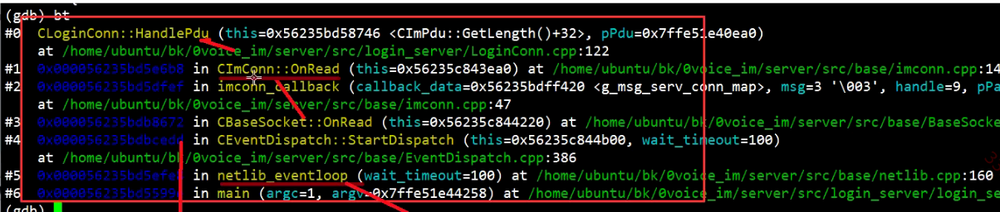
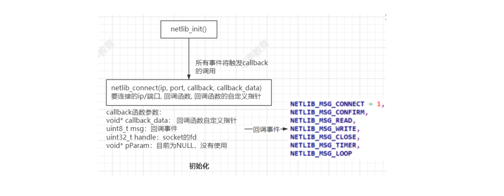
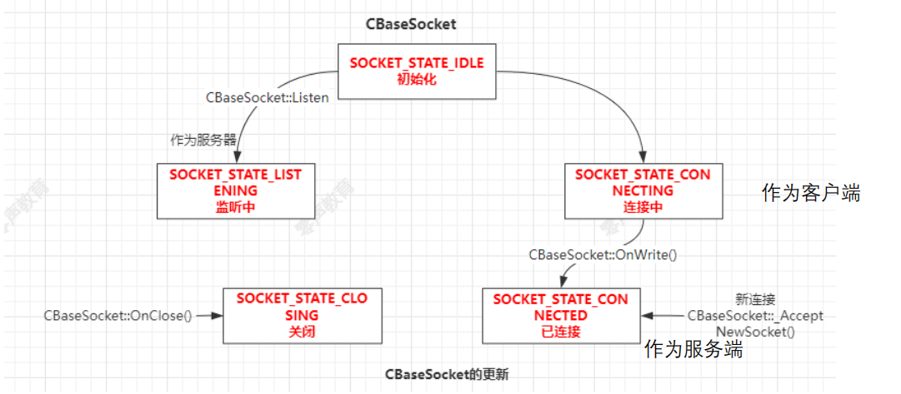
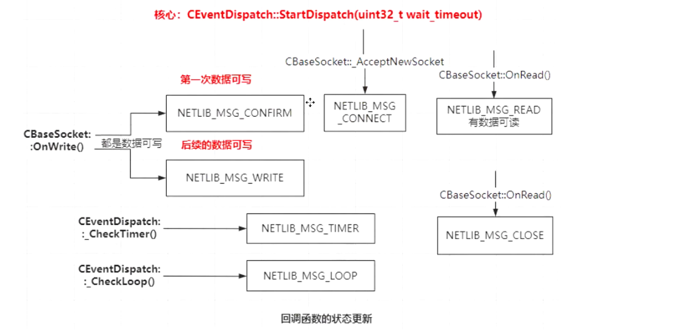
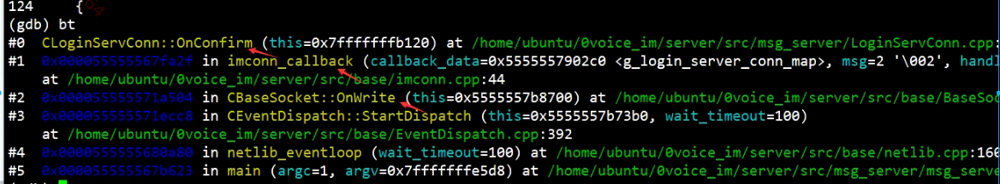
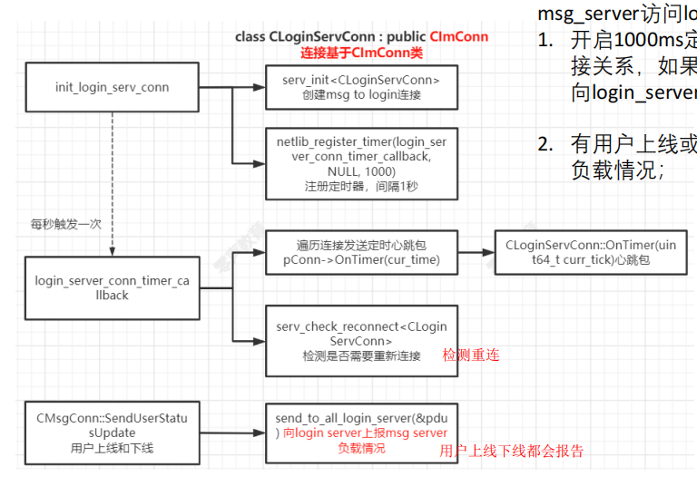
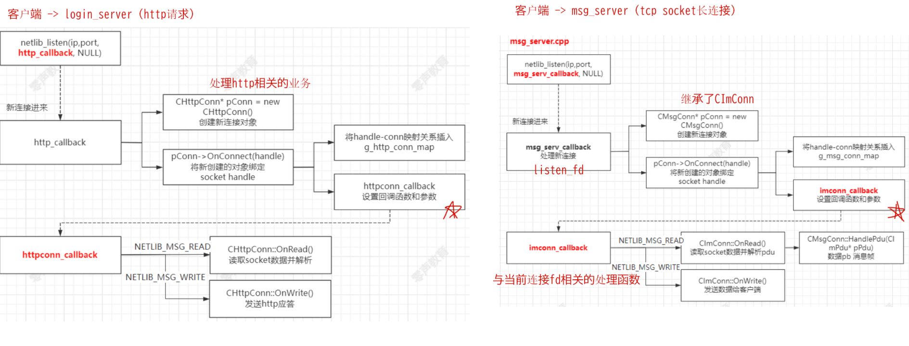

# Reactor模型

---

Reactor模式是处理并发IO比较常见的一种模式，用于同步IO，

其中心思想：

1. 将所有要处理的IO事件注册到一个中心IO多路复用器上，同时<font color='#BAOC2F'>主线程or进程阻塞在多路复用器上</font>，
2. 一旦有IO事件到来或是准备就绪（文件描述符或socket可读可写），则多路复用器返回并将事先注册的相应IO事件分发到对应的处理器中

Reactor模型有3个重要组件：

- 多路复用器：由操作系统提供，在linux上一般是selec、poll、epoll等系统调用。
- 事件分发器：将多路复用器中返回的就绪事件分到对应的处理函数中。
- 事件处理器：负责处理特定事件的处理函数

具体流程如下：

1. 注册读就绪事件和相应的事件处理器。
2. 事件分离器等待事件。
3. 事件到来激活分离器，分离器调用事件对应的处理器。
4. 事件处理器完成实际的读操作，处理读到的数据，注册新的事件，然后返还控制权。

### Reactor



- CBaseSocket：管理socket io，作为client或者server都需要实例化一个CBaseSocket（C++）
- CEventDispatch：是reactor的触发器，epoll相关的函数都在此调用（C++）。
- netlib：是对外提供了调用的api ，它封装了CEventDispatch（C）。net

不同的服务之间，除了http只要是tcp长连接，每一个socket连接都是会绑定一个CImConn，

在读取到一个完整的Pdu后，调用对应的业务方法CLoginConn会继承CImConn，然后去实现具体的HandlePdu业务处理方法，根据业务的处理逻辑

#### CBaseSocket

管理socket io，作为client或者server都需要实例化一个CBaseSocket，

`hash_map<net_handle_t, CBaseSocket*> SocketMap;`管理所有的连接，以fd为key，CBaseSocket对象为value，

1. 如果有数据新连接创建，accept得到一个fd，
2. 创建一个对象绑定fd，因为之后需要根据这个fd找到对应的业务封装（需要调用`AddBaseSocket`方法创建CBaseSocket对象），
3. 即net_handle_t对应了新连接fd，而CBaseSocket*对应了一个CBaseSocket对象

- void AddBaseSocket(CBaseSocket* pSocket) 增加
- void RemoveBaseSocket(CBaseSocket* pSocket) 删除
- CBaseSocket* FindBaseSocket(net_handle_t fd) 根据fd查找到对应的CBaseSocket对象，然后去处理对应的业务逻辑

##### BaseSocket.h

```cpp
#ifndef __SOCKET_H__
#define __SOCKET_H__

#include "ostype.h"
#include "util.h"

enum {
	SOCKET_STATE_IDLE,
	SOCKET_STATE_LISTENING,
	SOCKET_STATE_CONNECTING,
	SOCKET_STATE_CONNECTED,
	SOCKET_STATE_CLOSING
};

class CBaseSocket : public CRefObject {
public:
	CBaseSocket();
	
	virtual ~CBaseSocket();

	SOCKET GetSocket() { return m_socket; }
	void SetSocket(SOCKET fd) { m_socket = fd; }
	void SetState(uint8_t state) { m_state = state; }

	void SetCallback(callback_t callback) { m_callback = callback; }
	void SetCallbackData(void* data) { m_callback_data = data; }
	void SetRemoteIP(char* ip) { m_remote_ip = ip; }
	void SetRemotePort(uint16_t port) { m_remote_port = port; }
	void SetSendBufSize(uint32_t send_size);
	void SetRecvBufSize(uint32_t recv_size);

	const char*	GetRemoteIP() { return m_remote_ip.c_str(); }
	uint16_t	GetRemotePort() { return m_remote_port; }
	const char*	GetLocalIP() { return m_local_ip.c_str(); }
	uint16_t	GetLocalPort() { return m_local_port; }
public:
	int Listen(
		const char*		server_ip, 
		uint16_t		port,
		callback_t		callback,
		void*			callback_data);

	net_handle_t Connect(
		const char*		server_ip, 
		uint16_t		port,
		callback_t		callback,
		void*			callback_data);

	int Send(void* buf, int len);
	int Recv(void* buf, int len);
	int Close();

public:	
	void OnRead();
	void OnWrite();
	void OnClose();

private:	
	int _GetErrorCode();
	bool _IsBlock(int error_code);

	void _SetNonblock(SOCKET fd);
	void _SetReuseAddr(SOCKET fd);
	void _SetNoDelay(SOCKET fd);
	void _SetAddr(const char* ip, const uint16_t port, sockaddr_in* pAddr);

	void _AcceptNewSocket();

private:
	string			m_remote_ip;
	uint16_t		m_remote_port;
	string			m_local_ip;
	uint16_t		m_local_port;

	callback_t		m_callback;
	void*			m_callback_data;

	uint8_t			m_state;
	SOCKET			m_socket;
};

CBaseSocket* FindBaseSocket(net_handle_t fd);

#endif
```

socket自定义状态：

```cpp
enum {
	SOCKET_STATE_IDLE, //CBaseSocket()
	SOCKET_STATE_LISTENING, //Listen() 作为server的时候用
	SOCKET_STATE_CONNECTING, //Connect() 作为client的时候用
	SOCKET_STATE_CONNECTED, //OnWrite() 作为client的时候用
	SOCKET_STATE_CLOSING //OnClose()
};
```

##### BaseSocket.cpp

```cpp
void CBaseSocket::_AcceptNewSocket() {
  SOCKET fd = 0;
  sockaddr_in peer_addr;
  socklen_t addr_len = sizeof(sockaddr_in);
  char ip_str[64];
  while ((fd = accept(m_socket, (sockaddr*)&peer_addr, &addr_len)) !=
         INVALID_SOCKET) {
    CBaseSocket* pSocket = new CBaseSocket();
    uint32_t ip = ntohl(peer_addr.sin_addr.s_addr);
    uint16_t port = ntohs(peer_addr.sin_port);

    snprintf(ip_str, sizeof(ip_str), "%d.%d.%d.%d", ip >> 24, (ip >> 16) & 0xFF,
             (ip >> 8) & 0xFF, ip & 0xFF);

    log_debug("AcceptNewSocket, socket=%d from %s:%d\n", fd, ip_str, port);

    pSocket->SetSocket(fd);
    pSocket->SetCallback(m_callback);
    pSocket->SetCallbackData(m_callback_data);
    pSocket->SetState(SOCKET_STATE_CONNECTED);
    pSocket->SetRemoteIP(ip_str);
    pSocket->SetRemotePort(port);

    _SetNoDelay(fd);
    _SetNonblock(fd);
    AddBaseSocket(pSocket);
    CEventDispatch::Instance()->AddEvent(fd, SOCKET_READ | SOCKET_EXCEP);
    m_callback(m_callback_data, NETLIB_MSG_CONNECT, (net_handle_t)fd, NULL);
  }
}

int CBaseSocket::Close() {
  CEventDispatch::Instance()->RemoveEvent(m_socket, SOCKET_ALL);
  RemoveBaseSocket(this);
  closesocket(m_socket);
  ReleaseRef();
  return 0;
}
```


#### CEventDispatch

> reactor模型：
>
> 1. 网络数据收发，epoll_wait
> 2. 定时器管理，\_CheckTimer：精度依赖与由epoll_wait决定，如果epoll精度为100ms，则定时器检测\_CheckTimer也大概为100ms（检测重连状态）
> 3. _CheckLoop：设置回调函数，专门用于处理数据回发（IO线程负责数据的解析、收发，线程池来处理具体的业务）
>

CEventDispatch：是<font color='#BAOC2F'>reactor的触发器</font>，epoll相关的函数都在此调用，

- Timer相关：在连接断开，需要重连的情况下需要定时器的机制
    - AddTimer：加入定时事件
    - RemoveTimer：删除定时事件
    - \_CheckTimer：检测定时事件（\_私有函数）
- Loop相关：
    - AddLoop：加入循环事件
    - _CheckLoop：检测循环事件
- epoll相关：对epoll的相关操作
    - AddEvent： 添加fd事件
    - RemoveEvent：删除fd事件
    - StartDispatch：进入reactor主循环
    - StopDispatch：停止reactor主循环

##### EventDispatch.h

```cpp
/*
 * A socket event dispatcher, features include: 
 * 1. portable: worked both on Windows, MAC OS X,  LINUX platform
 * 2. a singleton pattern: only one instance of this class can exist
 */
#ifndef __EVENT_DISPATCH_H__
#define __EVENT_DISPATCH_H__

#include "Lock.h"
#include "ostype.h"
#include "util.h"

enum {
  SOCKET_READ = 0x1,
  SOCKET_WRITE = 0x2,
  SOCKET_EXCEP = 0x4,
  SOCKET_ALL = 0x7
};

class CEventDispatch {
 public:
  virtual ~CEventDispatch();

  void AddEvent(SOCKET fd, uint8_t socket_event);
  void RemoveEvent(SOCKET fd, uint8_t socket_event);

  void AddTimer(callback_t callback, void* user_data, uint64_t interval);
  void RemoveTimer(callback_t callback, void* user_data);

  void AddLoop(callback_t callback, void* user_data);

  void StartDispatch(uint32_t wait_timeout = 100);
  void StopDispatch();

  bool isRunning() { return running; }

  static CEventDispatch* Instance();

 protected:
  CEventDispatch();

 private:
  void _CheckTimer();
  void _CheckLoop();

  typedef struct {
    callback_t callback;
    void* user_data;
    uint64_t interval;
    uint64_t next_tick;
  } TimerItem;

 private:
#ifdef _WIN32
  fd_set m_read_set;
  fd_set m_write_set;
  fd_set m_excep_set;
#elif __APPLE__
  int m_kqfd;
#else
  int m_epfd;
#endif
  CLock m_lock;
  list<TimerItem*> m_timer_list;
  list<TimerItem*> m_loop_list;

  static CEventDispatch* m_pEventDispatch;

  bool running;
};

#endif
```

##### EventDispatch.cpp

```cpp
void CEventDispatch::AddEvent(SOCKET fd, uint8_t socket_event) {
  struct epoll_event ev;
  ev.events = EPOLLIN | EPOLLOUT | EPOLLET | EPOLLPRI | EPOLLERR | EPOLLHUP;
  ev.data.fd = fd;
  if (epoll_ctl(m_epfd, EPOLL_CTL_ADD, fd, &ev) != 0) {
    log_error("epoll_ctl() failed, errno=%d", errno);
  }
}

void CEventDispatch::RemoveEvent(SOCKET fd, uint8_t socket_event) {
  if (epoll_ctl(m_epfd, EPOLL_CTL_DEL, fd, NULL) != 0) {
    log_error("epoll_ctl failed, errno=%d", errno);
  }
}

void CEventDispatch::StartDispatch(uint32_t wait_timeout) {
  struct epoll_event events[1024];
  int nfds = 0;

  if (running) return;
  running = true;

  while (running) {
    nfds = epoll_wait(m_epfd, events, 1024, wait_timeout);
    for (int i = 0; i < nfds; i++) {
      int ev_fd = events[i].data.fd;
      CBaseSocket* pSocket = FindBaseSocket(ev_fd);
      if (!pSocket) continue;

// Commit by zhfu @2015-02-28
#ifdef EPOLLRDHUP
      if (events[i].events & EPOLLRDHUP) {
        // log("On Peer Close, socket=%d, ev_fd);
        pSocket->OnClose();
      }
#endif
      // Commit End

      if (events[i].events & EPOLLIN) {
        // log("OnRead, socket=%d\n", ev_fd);
        pSocket->OnRead();
      }

      if (events[i].events & EPOLLOUT) {
        // log("OnWrite, socket=%d\n", ev_fd);
        pSocket->OnWrite();
      }

      if (events[i].events & (EPOLLPRI | EPOLLERR | EPOLLHUP)) {
        // log("OnClose, socket=%d\n", ev_fd);
        pSocket->OnClose();
      }

      pSocket->ReleaseRef();
    }

    _CheckTimer();
    _CheckLoop();
  }
}

void CEventDispatch::StopDispatch() { running = false; }
```


#### netlib网络库

TeamTalk使⽤CBaseSocket对socket进⾏了封装，其中包含了针对这个socket的⼀些回调操作；

1. 在Epoll返回时，针对每⼀个socket进⾏检索:`CBaseSocket* pSocket = FindBaseSocket(ev_fd);`，
2. 根据之前保存的 SocketMap 来查询 ev_fd 对应的CBaseSocket，
3. 然后ev_fd就找到了⾃⼰对应的回调函数。

netlib：是对外提供了调用的api ，它封装了CEventDispatch（C）。

1. netlib_init：初始化网络连接，Linux系统⽆操作，返回NETLIB_OK；
2. netlib_destroy：清除⽹络连接，Linux系统⽆操作，返回NETLIB_OK；

fd相关：

1. netlib_listen：监听连接，底层实现：CBaseSocket返回int
2. netlib_connect：连接，返回net_handle_t
3.  netlib_send：发送
4. netlib_recv：接收
5. netlib_close：关闭
6. netlib_option：参数设置
7. **NETLIB_OPT_SET_CALLBACK 设置回调函数**

定时器相关：

1. netlib_register_timer：注册定时器
2. netlib_delete_timer：删除定时器

循环相关：

1. netlib_add_loop：可以加入需要循环处理的事务到reactor
2. netlib_eventloop：进入reactor主循环
3. netlib_stop_event：停⽌事件
4. netlib_is_running：判断是否运⾏

##### netlib.h

login_server与msg_server调用了netlib对外提供的一个接口，主线程对应了`netlib_eventloop`方法，其中调用了`StartDispatch`方法

```cpp
#ifndef __NETLIB_H__
#define __NETLIB_H__

#include "ostype.h"

#define NETLIB_OPT_SET_CALLBACK 1
#define NETLIB_OPT_SET_CALLBACK_DATA 2
#define NETLIB_OPT_GET_REMOTE_IP 3
#define NETLIB_OPT_GET_REMOTE_PORT 4
#define NETLIB_OPT_GET_LOCAL_IP 5
#define NETLIB_OPT_GET_LOCAL_PORT 6
#define NETLIB_OPT_SET_SEND_BUF_SIZE 7
#define NETLIB_OPT_SET_RECV_BUF_SIZE 8

#define NETLIB_MAX_SOCKET_BUF_SIZE (128 * 1024)

#ifdef __cplusplus
extern "C" {
#endif

int netlib_init();

int netlib_destroy();

int netlib_listen(const char* server_ip, uint16_t port, callback_t callback, void* callback_data);

net_handle_t netlib_connect(const char* server_ip, uint16_t port, callback_t callback, void* callback_data);

int netlib_send(net_handle_t handle, void* buf, int len);

int netlib_recv(net_handle_t handle, void* buf, int len);

int netlib_close(net_handle_t handle);

int netlib_option(net_handle_t handle, int opt, void* optval);

int netlib_register_timer(callback_t callback, void* user_data, uint64_t interval);

int netlib_delete_timer(callback_t callback, void* user_data);

int netlib_add_loop(callback_t callback, void* user_data);

void netlib_eventloop(uint32_t wait_timeout = 100);

void netlib_stop_event();

bool netlib_is_running();

#ifdef __cplusplus
}
#endif

#endif
```


##### netlib.cpp

```cpp
#include "netlib.h"

#include "BaseSocket.h"
#include "EventDispatch.h"

int netlib_init() {
  int ret = NETLIB_OK;
#ifdef _WIN32
  WSADATA wsaData;
  WORD wReqest = MAKEWORD(1, 1);
  if (WSAStartup(wReqest, &wsaData) != 0) {
    ret = NETLIB_ERROR;
  }
#endif

  return ret;
}

int netlib_destroy() {
  int ret = NETLIB_OK;
#ifdef _WIN32
  if (WSACleanup() != 0) {
    ret = NETLIB_ERROR;
  }
#endif

  return ret;
}

int netlib_listen(const char* server_ip, uint16_t port, callback_t callback,
                  void* callback_data) {
  CBaseSocket* pSocket = new CBaseSocket();
  if (!pSocket) return NETLIB_ERROR;

  int ret = pSocket->Listen(server_ip, port, callback, callback_data);
  if (ret == NETLIB_ERROR) delete pSocket;
  return ret;
}

net_handle_t netlib_connect(const char* server_ip, uint16_t port,
                            callback_t callback, void* callback_data) {
  CBaseSocket* pSocket = new CBaseSocket();
  if (!pSocket) return NETLIB_INVALID_HANDLE;

  net_handle_t handle =
      pSocket->Connect(server_ip, port, callback, callback_data);
  if (handle == NETLIB_INVALID_HANDLE) delete pSocket;
  return handle;
}

int netlib_send(net_handle_t handle, void* buf, int len) {
  CBaseSocket* pSocket = FindBaseSocket(handle);
  if (!pSocket) {
    return NETLIB_ERROR;
  }
  int ret = pSocket->Send(buf, len);
  pSocket->ReleaseRef();
  return ret;
}

int netlib_recv(net_handle_t handle, void* buf, int len) {
  CBaseSocket* pSocket = FindBaseSocket(handle);
  if (!pSocket) return NETLIB_ERROR;

  int ret = pSocket->Recv(buf, len);
  pSocket->ReleaseRef();
  return ret;
}

int netlib_close(net_handle_t handle) {
  CBaseSocket* pSocket = FindBaseSocket(handle);
  if (!pSocket) return NETLIB_ERROR;

  int ret = pSocket->Close();
  pSocket->ReleaseRef();
  return ret;
}

int netlib_option(net_handle_t handle, int opt, void* optval) {
  CBaseSocket* pSocket = FindBaseSocket(handle);
  if (!pSocket) return NETLIB_ERROR;

  if ((opt >= NETLIB_OPT_GET_REMOTE_IP) && !optval) return NETLIB_ERROR;

  switch (opt) {
    case NETLIB_OPT_SET_CALLBACK:
      pSocket->SetCallback((callback_t)optval);
      break;
    case NETLIB_OPT_SET_CALLBACK_DATA:
      pSocket->SetCallbackData(optval);
      break;
    case NETLIB_OPT_GET_REMOTE_IP:
      *(string*)optval = pSocket->GetRemoteIP();
      break;
    case NETLIB_OPT_GET_REMOTE_PORT:
      *(uint16_t*)optval = pSocket->GetRemotePort();
      break;
    case NETLIB_OPT_GET_LOCAL_IP:
      *(string*)optval = pSocket->GetLocalIP();
      break;
    case NETLIB_OPT_GET_LOCAL_PORT:
      *(uint16_t*)optval = pSocket->GetLocalPort();
      break;
    case NETLIB_OPT_SET_SEND_BUF_SIZE:
      pSocket->SetSendBufSize(*(uint32_t*)optval);
      break;
    case NETLIB_OPT_SET_RECV_BUF_SIZE:
      pSocket->SetRecvBufSize(*(uint32_t*)optval);
      break;
  }

  pSocket->ReleaseRef();
  return NETLIB_OK;
}

int netlib_register_timer(callback_t callback, void* user_data,
                          uint64_t interval) {
  CEventDispatch::Instance()->AddTimer(callback, user_data, interval);
  return 0;
}

int netlib_delete_timer(callback_t callback, void* user_data) {
  CEventDispatch::Instance()->RemoveTimer(callback, user_data);
  return 0;
}

int netlib_add_loop(callback_t callback, void* user_data) {
  CEventDispatch::Instance()->AddLoop(callback, user_data);
  return 0;
}

void netlib_eventloop(uint32_t wait_timeout) {
  CEventDispatch::Instance()->StartDispatch(wait_timeout);
}

void netlib_stop_event() { CEventDispatch::Instance()->StopDispatch(); }

bool netlib_is_running() { return CEventDispatch::Instance()->isRunning(); }
```


### 作为客户端（流程分析）

reactor模型在客户端与服务器都可以使用，作为msg_server作为客户端去连接login_server服务器，msg_server如何与login_server保持通信？

#### 1.netlib



windows需要调用`netlib_init()`方法，

一个reactor可以作为服务端管理多个客户端连接的业务，也能作为客户端去连接其他服务器，如login_server等，

回调事件：

```cpp
enum {
  NETLIB_MSG_CONNECT = 1,
  NETLIB_MSG_CONFIRM,
  NETLIB_MSG_READ,
  NETLIB_MSG_WRITE,
  NETLIB_MSG_CLOSE,
  NETLIB_MSG_TIMER,
  NETLIB_MSG_LOOP
};
```

#### 2.BaseSocket



```cpp
enum {
	SOCKET_STATE_IDLE,
	SOCKET_STATE_LISTENING,
	SOCKET_STATE_CONNECTING,
	SOCKET_STATE_CONNECTED,
	SOCKET_STATE_CLOSING
};
```

1. CBaseSocket刚被初始化时，是处于SOCKET_STATE_IDLE状态，
2. 如果CBaseSocket作为服务器端，则CBaseSocket将会被更新为SOCKET_STATE_LISTENING状态，
3. 如果有调用`OnWrite()`方法状态会更新为SOCKET_STATE_CONNECTING
4. 当真正连接上的时候可以进行数据写入发送数据时（作为客户端），包括有新连接进入时`AcceptNewSocket`（作为服务端），CBaseSocket将会被更新为SOCKET_STATE_CONNECTED状态，
5. 当调用`OnClose()`方法时，CBaseSocket将会被更新为SOCKET_STATE_CLOSING状态，

#### 3.EventDispatch（核心）



以msg_server为例分析整个流程，msg_server如何连接login_server？

##### msg_server.cpp

```cpp
  char* listen_ip = config_file.GetConfigName("ListenIP");
  char* str_listen_port = config_file.GetConfigName("ListenPort");
  char* ip_addr1 = config_file.GetConfigName("IpAddr1");  // 电信IP
  char* ip_addr2 = config_file.GetConfigName("IpAddr2");  // 网通IP
  char* str_max_conn_cnt = config_file.GetConfigName("MaxConnCnt");
  char* str_aes_key = config_file.GetConfigName("aesKey");
  uint32_t db_server_count = 0;
  serv_info_t* db_server_list = read_server_config(&config_file, "DBServerIP", "DBServerPort", db_server_count);

  uint32_t login_server_count = 0;
  serv_info_t* login_server_list = read_server_config(&config_file, "LoginServerIP", "LoginServerPort", login_server_count);

  uint32_t route_server_count = 0;
  serv_info_t* route_server_list = read_server_config(&config_file, "RouteServerIP", "RouteServerPort", route_server_count);

  uint32_t push_server_count = 0;
  serv_info_t* push_server_list = read_server_config(&config_file, "PushServerIP", "PushServerPort", push_server_count);

  uint32_t file_server_count = 0;
  serv_info_t* file_server_list = read_server_config(&config_file, "FileServerIP", "FileServerPort", file_server_count);
```

```cpp
  printf("server start listen on: %s:%d\n", listen_ip, listen_port);

  init_msg_conn();

  init_file_serv_conn(file_server_list, file_server_count);

  init_db_serv_conn(db_server_list2, db_server_count2, concurrent_db_conn_cnt);

  init_login_serv_conn(login_server_list, login_server_count, ip_addr1, ip_addr2, listen_port, max_conn_cnt);

  init_route_serv_conn(route_server_list, route_server_count);

  init_push_serv_conn(push_server_list, push_server_count);
  printf("now enter the event loop...\n");
```

##### LoginServerConn.cpp:CImConn

```cpp
/* LoginServerConn.h */
#ifndef LOGINSERVCONN_H_
#define LOGINSERVCONN_H_

#include "ServInfo.h"
#include "imconn.h"

class CLoginServConn : public CImConn {
 public:
  CLoginServConn();
  virtual ~CLoginServConn();

  bool IsOpen() { return m_bOpen; }

  void Connect(const char* server_ip, uint16_t server_port, uint32_t serv_idx);
  virtual void Close();

  virtual void OnConfirm();
  virtual void OnClose();
  virtual void OnTimer(uint64_t curr_tick);

  virtual void HandlePdu(CImPdu* pPdu);

 private:
  bool m_bOpen;
  uint32_t m_serv_idx;
};

void init_login_serv_conn(serv_info_t* server_list, uint32_t server_count,
                          const char* msg_server_ip_addr1,
                          const char* msg_server_ip_addr2,
                          uint16_t msg_server_port, uint32_t max_conn_cnt);
bool is_login_server_available();
void send_to_all_login_server(CImPdu* pPdu);

#endif /* MSGCONN_LS_H_ */
```

```cpp
/* LoginServerConn.cpp部分代码 */
void login_server_conn_timer_callback(void* callback_data, uint8_t msg, uint32_t handle, void* pParam) {
  ConnMap_t::iterator it_old;
  CLoginServConn* pConn = NULL;
  uint64_t cur_time = get_tick_count();

  for (ConnMap_t::iterator it = g_login_server_conn_map.begin(); it != g_login_server_conn_map.end();) {
    //如果已经连接 则会触发对应的业务
	it_old = it;
    it++;

	//每个连接都有自己的业务 
    pConn = (CLoginServConn*)it_old->second;
    pConn->OnTimer(cur_time);
  }

  // reconnect LoginServer 检测是否需要重新连接
  serv_check_reconnect<CLoginServConn>(g_login_server_list, g_login_server_count);
}

void init_login_serv_conn(serv_info_t* server_list, uint32_t server_count,
                          const char* msg_server_ip_addr1,
                          const char* msg_server_ip_addr2,
                          uint16_t msg_server_port, uint32_t max_conn_cnt) {
  g_login_server_list = server_list;
  g_login_server_count = server_count;

  serv_init<CLoginServConn>(g_login_server_list, g_login_server_count);

  g_msg_server_ip_addr1 = msg_server_ip_addr1;
  g_msg_server_ip_addr2 = msg_server_ip_addr2;
  g_msg_server_port = msg_server_port;
  g_max_conn_cnt = max_conn_cnt;

  //定时器 每隔1秒触发定时器 检测与login_server是否有连接 如果没有连接则重新进行去连接
  netlib_register_timer(login_server_conn_timer_callback, NULL, 1000);
}
```

##### ServInfo.h

```cpp
template <class T>
void serv_check_reconnect(serv_info_t* server_list, uint32_t server_count) {
  T* pConn;
  for (uint32_t i = 0; i < server_count; i++) {
    pConn = (T*)server_list[i].serv_conn;
    if (!pConn) {
      server_list[i].idle_cnt++;
      if (server_list[i].idle_cnt >= server_list[i].reconnect_cnt) {
        pConn = new T();
        pConn->Connect(server_list[i].server_ip.c_str(), server_list[i].server_port, i);
        server_list[i].serv_conn = pConn;
      }
    }
  }
}
```

```cpp
/* LoginServerConn::Connect */
void CLoginServConn::Connect(const char* server_ip, uint16_t server_port, uint32_t serv_idx) {
  log("Connecting to LoginServer %s:%d ", server_ip, server_port);
  //作为服务器 关注数据可读 作为客户端连接别人 关注数据可写
  m_serv_idx = serv_idx;
  m_handle = netlib_connect(server_ip, server_port, imconn_callback, (void*)&g_login_server_conn_map);
  
  if (m_handle != NETLIB_INVALID_HANDLE) {
    g_login_server_conn_map.insert(make_pair(m_handle, this));
  }
}
```

##### imconn.cpp

```cpp
/* imconn.h */
#ifndef IMCONN_H_
#define IMCONN_H_

#include "ImPduBase.h"
#include "netlib.h"
#include "util.h"

#define SERVER_HEARTBEAT_INTERVAL 5000
#define SERVER_TIMEOUT 30000
#define CLIENT_HEARTBEAT_INTERVAL 30000
#define CLIENT_TIMEOUT 120000
#define MOBILE_CLIENT_TIMEOUT 60000 * 5
#define READ_BUF_SIZE 2048

class CImConn : public CRefObject {
 public:
  CImConn();
  virtual ~CImConn();

  bool IsBusy() { return m_busy; }
  int SendPdu(CImPdu* pPdu) {
    return Send(pPdu->GetBuffer(), pPdu->GetLength());
  }
  int Send(void* data, int len);

  virtual void OnConnect(net_handle_t handle) { m_handle = handle; }
  virtual void OnConfirm() {}
  virtual void OnRead();
  virtual void OnWrite();
  virtual void OnClose() {}
  virtual void OnTimer(uint64_t curr_tick) {}
  virtual void OnWriteCompelete(){};

  virtual void HandlePdu(CImPdu* pPdu) {}

 protected:
  net_handle_t m_handle;
  bool m_busy;

  string m_peer_ip;
  uint16_t m_peer_port;
  CSimpleBuffer m_in_buf;  // socket读取数据缓存
  CSimpleBuffer m_out_buf;

  bool m_policy_conn;
  uint32_t m_recv_bytes;
  uint64_t m_last_send_tick;
  uint64_t m_last_recv_tick;
  uint64_t m_last_all_user_tick;
};

typedef hash_map<net_handle_t, CImConn*> ConnMap_t;
typedef hash_map<uint32_t, CImConn*> UserMap_t;

void imconn_callback(void* callback_data, uint8_t msg, uint32_t handle,
                     void* pParam);
void ReadPolicyFile();

#endif /* IMCONN_H_ */
```

每一个业务相关的连接都需要去继承CImConn类，

imconn.cpp中对应者事件分发，

```cpp
/* imconn.cpp部分代码 */
void imconn_callback(void* callback_data, uint8_t msg, uint32_t handle, void* pParam) {
  NOTUSED_ARG(handle);
  NOTUSED_ARG(pParam);

  if (!callback_data) return;

  ConnMap_t* conn_map = (ConnMap_t*)callback_data;
  CImConn* pConn = FindImConn(conn_map, handle);
  if (!pConn) return;

  // log("msg=%d, handle=%d ", msg, handle);
  switch (msg) {
    case NETLIB_MSG_CONFIRM:
      pConn->OnConfirm();
      break;
    case NETLIB_MSG_READ:
      pConn->OnRead();
      break;
    case NETLIB_MSG_WRITE:
      pConn->OnWrite();
      break;
    case NETLIB_MSG_CLOSE:
      pConn->OnClose();
      break;
    default:
      log_error("!!!imconn_callback error msg: %d ", msg);
      break;
  }

  pConn->ReleaseRef();
}
```

##### LoginServerConn.cpp:CImConn::OnConfirm

```cpp
void CLoginServConn::OnConfirm() {
  log("connect to login server success ");
  m_bOpen = true;
  g_login_server_list[m_serv_idx].reconnect_cnt = MIN_RECONNECT_CNT / 2;

  uint32_t cur_conn_cnt = 0;
  uint32_t shop_user_cnt = 0;

  list<user_conn_t> user_conn_list;
  CImUserManager::GetInstance()->GetUserConnCnt(&user_conn_list, cur_conn_cnt);
  char hostname[256] = {0};
  gethostname(hostname, 256);
  IM::Server::IMMsgServInfo msg;
  msg.set_ip1(g_msg_server_ip_addr1);
  msg.set_ip2(g_msg_server_ip_addr2);
  msg.set_port(g_msg_server_port);
  msg.set_max_conn_cnt(g_max_conn_cnt);
  msg.set_cur_conn_cnt(cur_conn_cnt);
  msg.set_host_name(hostname);
  CImPdu pdu;
  pdu.SetPBMsg(&msg);
  pdu.SetServiceId(SID_OTHER);
  pdu.SetCommandId(CID_OTHER_MSG_SERV_INFO);
  SendPdu(&pdu);
}
```

#### 4.函数调用逻辑





msg_server访问login_server的流程：

1. 开启1000ms定时器，定时检测login_server之间的连接关系
    - 如果没有连接 则进行重连
    - 如果已经连接则定时向login_server发送心跳包
2. 有用户上线或者下线时向msg_server上报目前其的负载情况


### 作为服务端（流程分析）

login_server 作为服务端，如何响应客户端的连接并处理？客户端 -> login_server http请求



#### 1.http_callback

```cpp
  /* login_server.cpp */
  CStrExplode http_listen_ip_list(http_listen_ip, ';');
  for (uint32_t i = 0; i < http_listen_ip_list.GetItemCnt(); i++) {
    ret = netlib_listen(http_listen_ip_list.GetItem(i), http_port, http_callback, NULL);
    if (ret == NETLIB_ERROR) return ret;
  }
```

```cpp
/* login_server.cpp */
// Android、IOS、PC等客户端请求连接事件
void http_callback(void* callback_data, uint8_t msg, uint32_t handle, void* pParam) {
  if (msg == NETLIB_MSG_CONNECT) {
    // 这里是不是觉得很奇怪,为什么new了对象却没有释放?
    // 实际上对象在被Close时使用delete this的方式释放自己
    CHttpConn* pConn = new CHttpConn();
    pConn->OnConnect(handle);
  } else {
    log_error("!!!error msg: %d ", msg);
  }
}
```

```cpp
/* HttpConn.cpp */
void CHttpConn::OnConnect(net_handle_t handle) {
  log("OnConnect, handle=%d\n", handle);
  m_sock_handle = handle;
  m_state = CONN_STATE_CONNECTED;
  g_http_conn_map.insert(make_pair(m_conn_handle, this));

  netlib_option(handle, NETLIB_OPT_SET_CALLBACK, (void*)httpconn_callback);
  netlib_option(handle, NETLIB_OPT_SET_CALLBACK_DATA, reinterpret_cast<void*>(m_conn_handle));
  netlib_option(handle, NETLIB_OPT_GET_REMOTE_IP, (void*)&m_peer_ip);
}
```


#### 2.msg_serv_callback

```cpp
  /* login_server.cpp */
  CStrExplode msg_server_listen_ip_list(msg_server_listen_ip, ';');
  for (uint32_t i = 0; i < msg_server_listen_ip_list.GetItemCnt(); i++) {
    ret = netlib_listen(msg_server_listen_ip_list.GetItem(i), msg_server_port, msg_serv_callback, NULL);
    if (ret == NETLIB_ERROR) return ret;
  }
```

```cpp
/* login_server.cpp */
// this callback will be replaced by imconn_callback() in OnConnect()
// msg_server请求连接事件
void msg_serv_callback(void* callback_data, uint8_t msg, uint32_t handle, void* pParam) {
  log("msg_server come in");

  if (msg == NETLIB_MSG_CONNECT) {
    CLoginConn* pConn = new CLoginConn();
    pConn->OnConnect2(handle, LOGIN_CONN_TYPE_MSG_SERV);
  } else {
    log_error("!!!error msg: %d ", msg);
  }
}
```

```cpp
/* LoginConn.cpp */
void CLoginConn::OnConnect2(net_handle_t handle, int conn_type) {
  m_handle = handle;
  m_conn_type = conn_type;
  ConnMap_t* conn_map = &g_msg_serv_conn_map;
  if (conn_type == LOGIN_CONN_TYPE_CLIENT) {
    conn_map = &g_client_conn_map;
  } else {
    conn_map->insert(make_pair(handle, this));
  }
  netlib_option(handle, NETLIB_OPT_SET_CALLBACK, (void*)imconn_callback);
  netlib_option(handle, NETLIB_OPT_SET_CALLBACK_DATA, (void*)conn_map);
}
```


