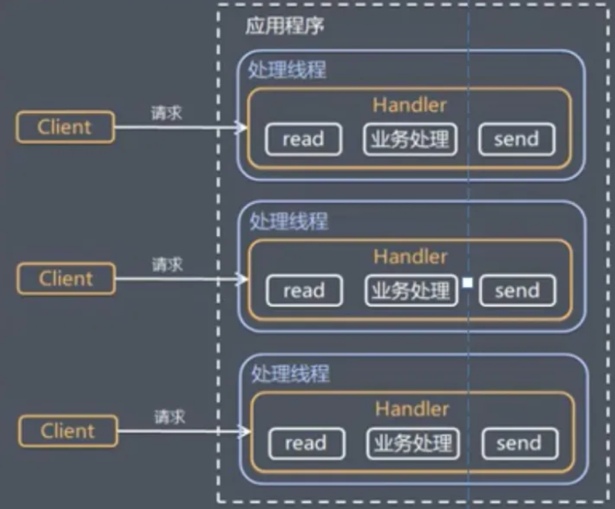
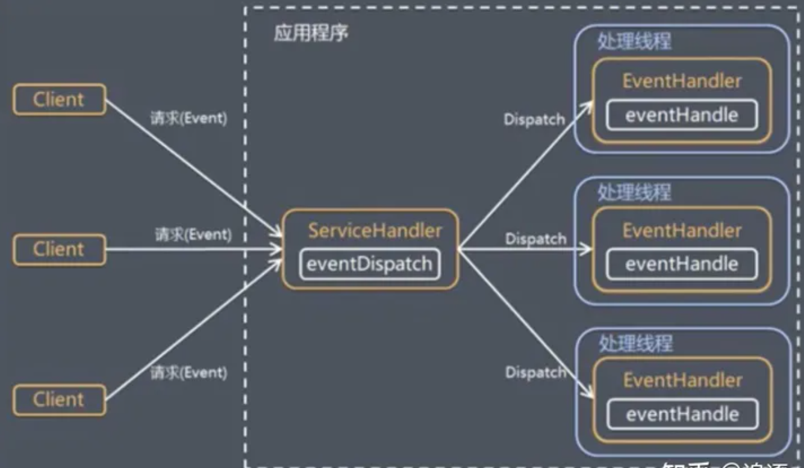
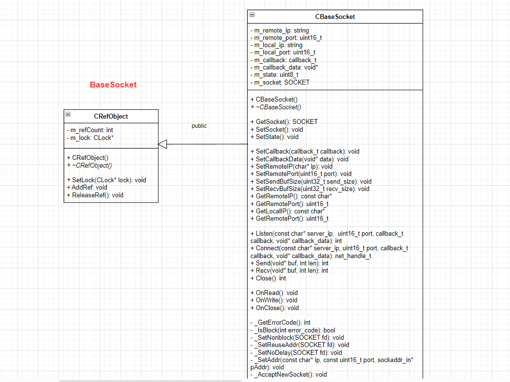
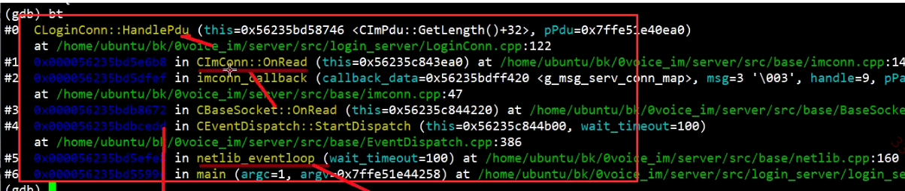
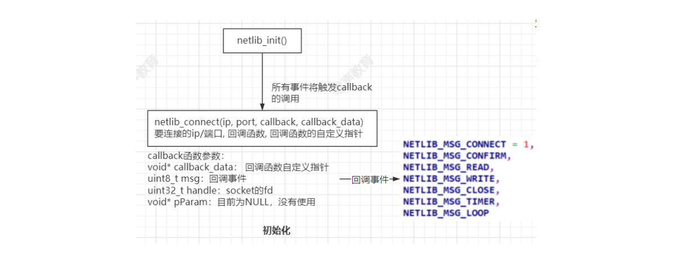
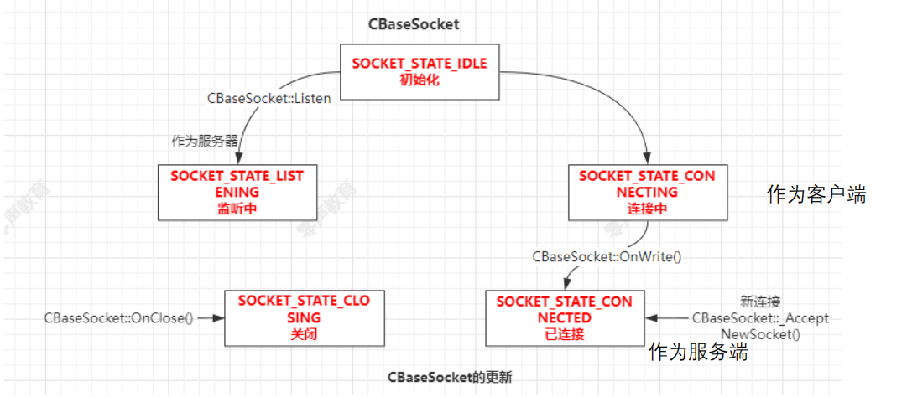
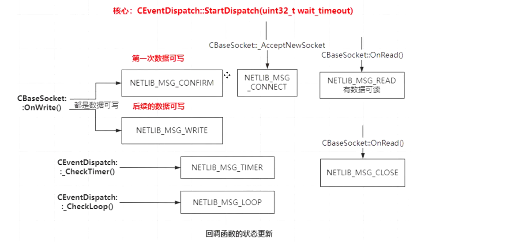
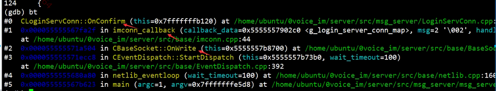
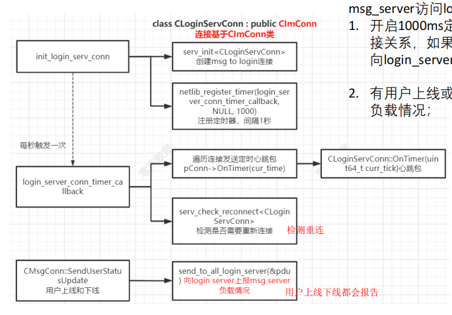
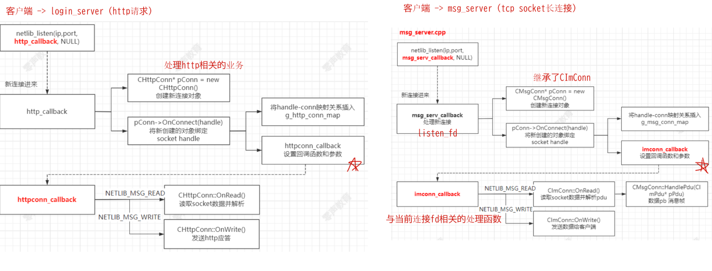

# Reactor模型

---

### 1.传统IO模式

传统阻塞IO服务模式特点：



1. 采用阻塞I/O模式获取输入数据
2. 每个连接都需要独立的线程完成数据的输入，业务处理，数据返回

问题分析：

1. 当并发数很大，就会创建大量线程，占用大量的系统资源
2. 连接创建后，如果当前线程暂时没有数据可读，该线程会阻塞在read操作，造成线程资源浪费、

### 2.Reactor模式

Reactor模式是处理并发IO比较常见的一种模式，Reactor模式基本设计思想就是I/O复用（poll、epoll、select） + 线程池

Reactor模式称为反应器模式或应答者模式，是基于事件驱动的设计模式，

1. Reactor模式有1个服务处理器和多个请求处理器，服务处理器会将输入的请求事件以多路复用的方式分发给相应的请求处理器。
    - 将所有要处理的IO事件注册到一个中心IO多路复用器上，同时<font color='#BAOC2F'>主线程or进程阻塞在多路复用器上</font>，
    - 一旦有IO事件到来或是准备就绪（文件描述符或socket可读可写），则多路复用器返回并将事先注册的相应IO事件分发到对应的请求处理器中，进行相应的业务处理。
2. Reactor模式是一种为处理并发服务请求，并将请求提交到一个或多个服务处理程序的事件设计模式。
3. 当客户端请求抵达后，服务处理程序使用<font color='#BAOC2F'>多路分配策略</font>，由一个非阻塞的线程来接收所有请求，然后将请求派发到相关的工作线程并进行处理的过程。
4. 对于高并发系统经常会使用到Reactor模式，用来替代常用的多线程处理方式以节省系统资源并提高系统的吞吐量。

Reactor模型有3个重要组件：

- 多路复用器：由操作系统提供，在linux上一般是selec、poll、epoll等系统调用。
- 事件分发器：将多路复用器中返回的就绪事件分到对应的处理函数中。
- 事件处理器：负责处理特定事件的处理函数



具体流程如下：

1. 注册读就绪事件和相应的事件处理器
2. 事件分离器等待事件。
3. 事件到来激活分离器，分离器调用事件对应的处理器。
4. 事件处理器完成实际的读操作，处理读到的数据

> reactor模式在项目中的使用：
>
> 在server/src/base目录下有三个头文件及其实现类，BaseSocket.h/.cpp、EventDispatch.h/.cpp、netlib.h/.cpp
>
> 这三个文件构成了即时通信中的核心部分reactor模型，分别对这三个文件进行详细分析如下：
>
> - CBaseSocket：管理socket io，无论作为client或者server都需要实例化一个CBaseSocket
> - CEventDispatch：是reactor的触发器，epoll相关的函数都在此调用
> - netlib：是对外提供了调用的api ，它封装了CEventDispatch

### 2.CBaseSocket

不同的服务之间（如login_server与msg_server进行通信）除了http只要是tcp长连接，

1. 每一个socket连接都是会绑定一个CImConn，
2. 在读取到一个完整的Pdu后，调用对应的业务方法CLoginConn会继承CImConn，然后去实现具体的HandlePdu业务处理方法，根据业务的处理逻辑
3. 管理socket io，作为client或者server都需要实例化一个CBaseSocket，
4. `hash_map<net_handle_t, CBaseSocket*> SocketMap;`管理所有的连接，以fd为key，CBaseSocket对象为value，
    - 如果有数据新连接创建，accept得到一个fd，
    - 创建一个对象绑定fd，因为之后需要根据这个fd找到对应的业务封装（需要调用`AddBaseSocket`方法创建CBaseSocket对象），
    - 即net_handle_t对应了新连接fd，而CBaseSocket*对应了一个CBaseSocket对象

#### BaseSocket.h

CBaseSocket对socket操作进⾏了一些封装，

基于非阻塞套接字的包装类 CBaseSocket 用于在Windows、Linux和MacOS X平台上进行网络通信

1. 封装了套接字的基本操作，使网络编程更加方便和简化
2. 支持监听和接受连接请求，可以用于创建服务器端套接字
3. 支持发起连接到远程服务器，可以用于创建客户端套接字
4. 提供了发送和接收数据的方法，用于在网络上进行数据的传输
5. 处理套接字的事件，例如可读事件、可写事件和关闭事件，通过回调函数的方式进行处理
6. 提供了一些辅助函数，如设置套接字的选项和获取错误代码等



socket自定义状态：

```cpp
enum {
	SOCKET_STATE_IDLE, //CBaseSocket()
	SOCKET_STATE_LISTENING, //Listen() 作为server的时候用
	SOCKET_STATE_CONNECTING, //Connect() 作为client的时候用
	SOCKET_STATE_CONNECTED, //OnWrite() 作为client的时候用
	SOCKET_STATE_CLOSING //OnClose()
};
```

```cpp
#ifndef __SOCKET_H__
#define __SOCKET_H__

#include "ostype.h"
#include "util.h"

enum {
	SOCKET_STATE_IDLE,
	SOCKET_STATE_LISTENING,
	SOCKET_STATE_CONNECTING,
	SOCKET_STATE_CONNECTED,
	SOCKET_STATE_CLOSING
};

class CBaseSocket : public CRefObject {
public:
	CBaseSocket();
	virtual ~CBaseSocket();

	//获取套接字描述符
	SOCKET GetSocket() { return m_socket; }
	//设置套接字描述符
	void SetSocket(SOCKET fd) { m_socket = fd; }
	//设置套接字的状态
	void SetState(uint8_t state) { m_state = state; }

	//设置回调函数
	void SetCallback(callback_t callback) { m_callback = callback; }
	//设置回调函数的参数数据
	void SetCallbackData(void* data) { m_callback_data = data; }
	//设置远程IP地址
	void SetRemoteIP(char* ip) { m_remote_ip = ip; }
	//设置远程端口号
	void SetRemotePort(uint16_t port) { m_remote_port = port; }
	//设置发送缓冲区大小
	void SetSendBufSize(uint32_t send_size);
	//设置接收缓冲区大小
	void SetRecvBufSize(uint32_t recv_size);

	//获取远程IP地址
	const char*	GetRemoteIP() { return m_remote_ip.c_str(); }
	//获取远程端口号
	uint16_t	GetRemotePort() { return m_remote_port; }
	//获取本地IP地址
	const char*	GetLocalIP() { return m_local_ip.c_str(); }
	//获取本地端口号
	uint16_t	GetLocalPort() { return m_local_port; }

public:
	//监听指定IP地址和端口号的连接请求
	int Listen(
		const char*		server_ip, 
		uint16_t		port,
		callback_t		callback,
		void*			callback_data);

	//发起到指定IP地址和端口号的连接
	net_handle_t Connect(
		const char*		server_ip, 
		uint16_t		port,
		callback_t		callback,
		void*			callback_data);

	//发送数据
	int Send(void* buf, int len);
	//接收数据
	int Recv(void* buf, int len);
	//关闭套接字
	int Close();

public:
	//套接字可读事件的回调函数
	void OnRead();
	//套接字可写事件的回调函数
	void OnWrite();
	//套接字关闭事件的回调函数
	void OnClose();

private:
	//获取错误代码
	int _GetErrorCode();
	//判断错误代码是否表示阻塞状态
	bool _IsBlock(int error_code);

	//设置套接字为非阻塞模式
	void _SetNonblock(SOCKET fd);
	//设置套接字的地址复用选项
	void _SetReuseAddr(SOCKET fd);
	//设置套接字的TCP_NODELAY选项
	void _SetNoDelay(SOCKET fd);
	//设置套接字地址
	void _SetAddr(const char* ip, const uint16_t port, sockaddr_in* pAddr);

	//接受新的连接套接字
	void _AcceptNewSocket();
private:
	string			m_remote_ip;//远程IP地址
	uint16_t		m_remote_port;//远程端口号
	string			m_local_ip;//本地IP地址
	uint16_t		m_local_port;//本地端口号

	callback_t		m_callback;//回调函数指针，用于处理套接字事件
	void*			m_callback_data;//回调函数的参数数据

	uint8_t			m_state;//套接字的状态，可能的取值为 SOCKET_STATE_IDLE、等
	SOCKET			m_socket;//套接字描述符
};

//根据fd查找到对应的CBaseSocket对象，然后去处理对应的业务逻辑
CBaseSocket* FindBaseSocket(net_handle_t fd);

#endif
```

#### BaseSocket.cpp

```cpp
#include "BaseSocket.h"
#include "EventDispatch.h"

typedef hash_map<net_handle_t, CBaseSocket*> SocketMap;
SocketMap g_socket_map;

//向全局的 g_socket_map 中添加 CBaseSocket 对象
void AddBaseSocket(CBaseSocket* pSocket) {
	//其中 (net_handle_t)pSocket->GetSocket() 将 pSocket 的套接字句柄转换为 net_handle_t 类型作为键
	//pSocket 作为对应的值 插入到 g_socket_map 中
	//可以通过套接字句柄快速查找到对应的 CBaseSocket 对象，方便管理和操作套接字对象
    g_socket_map.insert(make_pair((net_handle_t)pSocket->GetSocket(), pSocket));
}

//从全局的 g_socket_map 中移除指定的 CBaseSocket 对象
void RemoveBaseSocket(CBaseSocket* pSocket) {
    g_socket_map.erase((net_handle_t)pSocket->GetSocket());
}

//从全局的 g_socket_map 中根据 net_handle_t 查找对应的 CBaseSocket 对象
CBaseSocket* FindBaseSocket(net_handle_t fd) {
    CBaseSocket* pSocket = NULL;
    SocketMap::iterator iter = g_socket_map.find(fd);
    if (iter != g_socket_map.end()) {
        pSocket = iter->second;
        pSocket->AddRef();
    }
    return pSocket;
}

//////////////////////////////////CBaseSocket//////////////////////////////////////////////
CBaseSocket::CBaseSocket() {
    // log("CBaseSocket::CBaseSocket\n");
    m_socket = INVALID_SOCKET;
    m_state = SOCKET_STATE_IDLE;
}

CBaseSocket::~CBaseSocket() {
    // log("CBaseSocket::~CBaseSocket, socket=%d\n", m_socket);
}

//////////////////////////////////CBaseSocket Listen Connect Send Recv Close/////////////////////////////////////
/**
 * 作为服务端进行 listen 操作
 * 网络层的核心部分操作
 * 该方法主要用于在服务器端创建一个监听套接字，绑定本地IP地址和端口，并开始监听连接请求
 * 监听套接字在有新的连接请求时会触发相应的事件回调函数
*/
/// @brief CBaseSocket类的Listen方法 用于将套接字绑定到指定的本地IP地址和端口，并开始监听连接请求
/// @param server_ip 要绑定的本地 IP 地址
/// @param port 要绑定的本地端口
/// @param callback 连接事件回调函数
/// @param callback_data 连接事件回调函数的用户数据
/// @return NETLIB_OK
int CBaseSocket::Listen(const char* server_ip, uint16_t port, callback_t callback, void* callback_data) {
    m_local_ip = server_ip;
    m_local_port = port;
    m_callback = callback;//连接事件回调函数
    m_callback_data = callback_data;//连接事件回调函数的用户数据

	// 1.调用 socket 函数创建一个TCP套接字，并将返回的套接字句柄存储到成员变量 m_socket 中
    m_socket = socket(AF_INET, SOCK_STREAM, 0);
    if (m_socket == INVALID_SOCKET) {
        log_error("socket failed, err_code=%d, server_ip=%s, port=%u", _GetErrorCode(), server_ip, port);
        return NETLIB_ERROR;
    }

	// 2.设置套接字的地址重用和非阻塞属性
    _SetReuseAddr(m_socket);
    _SetNonblock(m_socket);

	// 3.结构体设置套接字的本地地址信息
    sockaddr_in serv_addr;
    _SetAddr(server_ip, port, &serv_addr);

	// 4.调用bind函数将套接字与本地地址绑定
    int ret = ::bind(m_socket, (sockaddr*)&serv_addr, sizeof(serv_addr));
    if (ret == SOCKET_ERROR) {
        log_error("bind failed, err_code=%d, server_ip=%s, port=%u", _GetErrorCode(), server_ip, port);
        closesocket(m_socket);
        return NETLIB_ERROR;
    }

	// 5.调用listen函数开始监听连接请求 并更新套接字的状态为 SOCKET_STATE_LISTENING
    ret = listen(m_socket, 64);
    if (ret == SOCKET_ERROR) {
        log_error("listen failed, err_code=%d, server_ip=%s, port=%u", _GetErrorCode(), server_ip, port);
        closesocket(m_socket);
        return NETLIB_ERROR;
    }
    m_state = SOCKET_STATE_LISTENING;
    log_debug("CBaseSocket::Listen on %s:%d", server_ip, port);

	// 6.调用AddBaseSocket将当前对象添加到全局的套接字映射表中
    AddBaseSocket(this);

	// 7.调用 CEventDispatch::Instance()->AddEvent 将套接字句柄 和 待监听的事件类型注册到事件分发器中
    CEventDispatch::Instance()->AddEvent(m_socket, SOCKET_READ | SOCKET_EXCEP);
    return NETLIB_OK;
}


/**
 * 作为客户端进行 connect 操作
 * 方法主要用于在客户端与指定的服务器建立连接
 * 它会创建一个套接字并尝试连接到服务器，连接成功后会触发相应的事件回调函数。
 * 函数返回的套接字句柄可用于后续的读写操作或关闭连接。
*/
/// @brief CBaseSocket类的Connect 方法 用于与指定的服务器建立连接
/// @param server_ip 要连接的服务器的 IP 地址
/// @param port 要连接的服务器的端口
/// @param callback 连接事件回调函数
/// @param callback_data 连接事件回调函数的用户数据
/// @return 
net_handle_t CBaseSocket::Connect(const char* server_ip, uint16_t port, callback_t callback, void* callback_data) {
    log_debug("CBaseSocket::Connect, server_ip=%s, port=%d", server_ip, port);
    m_remote_ip = server_ip;
    m_remote_port = port;
    m_callback = callback;//连接事件回调函数
    m_callback_data = callback_data;//连接事件回调函数的用户数据

	// 1.调用socket函数创建一个 TCP 套接字，并将返回的套接字句柄存储到成员变量 m_socket 中。
    m_socket = socket(AF_INET, SOCK_STREAM, 0);
    if (m_socket == INVALID_SOCKET) {
        log_error("socket failed, err_code=%d, server_ip=%s, port=%u", _GetErrorCode(), server_ip, port);
        return NETLIB_INVALID_HANDLE;
    }

	// 2.调用_SetNonblock和_SetNoDelay分别设置套接字的非阻塞和禁用Nagle算法属性
    _SetNonblock(m_socket);
    _SetNoDelay(m_socket);

	// 3.使用 sockaddr_in 结构体设置套接字的服务器地址信息
    sockaddr_in serv_addr;
    _SetAddr(server_ip, port, &serv_addr);

	// 4.调用 connect 函数与服务器建立连接 更新套接字的状态为 SOCKET_STATE_CONNECTING
    int ret = connect(m_socket, (sockaddr*)&serv_addr, sizeof(serv_addr));
    if ((ret == SOCKET_ERROR) && (!_IsBlock(_GetErrorCode()))) {
		//连接失败且错误码不表示阻塞状态 关闭套接字并返回 NETLIB_INVALID_HANDLE
        log_error("connect failed, err_code=%d, server_ip=%s, port=%u", _GetErrorCode(), server_ip, port);
        closesocket(m_socket);
        return NETLIB_INVALID_HANDLE;
    }
    m_state = SOCKET_STATE_CONNECTING;

	// 5.调用 AddBaseSocket 将当前对象添加到全局的套接字映射表中
    AddBaseSocket(this);

	// 6.调用 CEventDispatch::Instance()->AddEvent 将套接字句柄和待监听的事件类型注册到事件分发器中
    CEventDispatch::Instance()->AddEvent(m_socket, SOCKET_ALL);

	// 7.返回套接字句柄 (net_handle_t)m_socket
    return (net_handle_t)m_socket;
}

/**
 * 该方法用于向已连接的套接字发送数据，返回实际发送的字节数
 * 在发送数据时，如果发送缓冲区已满而无法立即发送，函数会返回阻塞状态，并将套接字注册到写事件中，
 * 等待下次可写事件触发再继续发送
*/
/// @brief CBaseSocket类的Send方法 用于向已连接的套接字发送数据
/// @param buf 指向要发送的数据缓冲区的指针
/// @param len 要发送的数据长度
/// @return 
int CBaseSocket::Send(void* buf, int len) {
	// 1.检查套接字的状态，如果不是已连接状态 (SOCKET_STATE_CONNECTED)，则返回 NETLIB_ERROR 表示发送失败
    if (m_state != SOCKET_STATE_CONNECTED) return NETLIB_ERROR;

	// 2.调用 send 函数发送数据
    int ret = send(m_socket, (char*)buf, len, 0);
    if (ret == SOCKET_ERROR) {
        int err_code = _GetErrorCode();
        if (_IsBlock(err_code)) {
			//数据发送失败 且错误码为阻塞状态 表示发送缓冲区已满
			/**
			 * 如果是WIN32或者苹果操作系统
			 * 此时会调用 CEventDispatch::Instance()->AddEvent(m_socket, SOCKET_WRITE) 将套接字注册到写事件中 等待下次可写事件触发再继续发送数据
			 * 如果是Linux操作系统 直接忽略改行代码
			 * 因为在Linux下，写事件是默认开启的，不需要手动注册到写事件中 发送缓冲区满时会自动触发写事件
			 * 通过注册写事件，可以实现非阻塞的方式发送数据，而不需要等待发送缓冲区可用。这样可以提高发送数据的效率
			*/
			#if ((defined _WIN32) || (defined __APPLE__))
			CEventDispatch::Instance()->AddEvent(m_socket, SOCKET_WRITE);
			#endif
            ret = 0;
            // log("socket send block fd=%d", m_socket);
        } else {
			//数据发送失败 且错误码不是阻塞状态 则记录错误日志
            log_error("send failed, err_code=%d, len=%d", err_code, len);
        }
    }

	// 3.返回发送的字节数 ret
    return ret;
}

/// @brief 用于接收数据 该方法调用操作系统提供的recv函数来接收数据并存储到指定的缓冲区中
/// @param buf 接收数据的缓冲区指针
/// @param len 期望接收的数据长度
/// @return 
int CBaseSocket::Recv(void* buf, int len) {
	/**
	 * m_socket 套接字描述符
	 * (char*)buf 接收数据的缓冲区指针
	 * len 期望接收的数据长度
	 * 标志参数 0
	 * 函数返回值为实际接收到的数据长度 返回值为-1表示接收出错
	*/
    return recv(m_socket, (char*)buf, len, 0);
}

//关闭套接字连接
int CBaseSocket::Close() {
	//调用CEventDispatch::Instance()->RemoveEvent函数将套接字从事件监听中移除 取消对其的读写事件监听
    CEventDispatch::Instance()->RemoveEvent(m_socket, SOCKET_ALL);
	//调用RemoveBaseSocket函数将套接字从全局套接字映射表中移除
    RemoveBaseSocket(this);
	//调用closesocket函数关闭套接字连接
    closesocket(m_socket);
	//调用ReleaseRef函数释放对CBaseSocket对象的引用
    ReleaseRef();
    return 0;
}


//////////////////////////////////CBaseSocket回调函数//////////////////////////////////////////////
/**
 * 用于处理套接字可读事件
 * 根据套接字的当前状态进行不同的处理：
*/
void CBaseSocket::OnRead() {
    if (m_state == SOCKET_STATE_LISTENING) {
		// 1.如果套接字处于监听状态（SOCKET_STATE_LISTENING），则调用_AcceptNewSocket函数接受新的连接
        _AcceptNewSocket();
    } else {
		// 2.否则通过调用ioctlsocket函数获取套接字接收缓冲区中 可读的字节数
		//#define ioctlsocket ioctl
		u_long avail = 0;
        int ret = ioctlsocket(m_socket, FIONREAD, &avail);
        if ((SOCKET_ERROR == ret) || (avail == 0)) {
			// 2-1.如果返回值为SOCKET_ERROR或avail为0，表示发生错误或没有可读数据
			// 通过调用回调函数m_callback将关闭事件（NETLIB_MSG_CLOSE）通知给上层处理
            m_callback(m_callback_data, NETLIB_MSG_CLOSE, (net_handle_t)m_socket, NULL);
        } else {
			// 有可读数据，通过调用回调函数m_callback将读事件（NETLIB_MSG_READ）通知给上层处理。
            m_callback(m_callback_data, NETLIB_MSG_READ, (net_handle_t)m_socket, NULL);
        }
    }
}

/**
 * 用于处理套接字可写事件
 * 根据套接字的当前状态进行不同的处理：
*/
void CBaseSocket::OnWrite() {

#if ((defined _WIN32) || (defined __APPLE__))
	//如果在Windows或苹果平台下，先调用CEventDispatch::Instance()->RemoveEvent函数移除套接字的 可写事件监听
    CEventDispatch::Instance()->RemoveEvent(m_socket, SOCKET_WRITE);
#endif

    if (m_state == SOCKET_STATE_CONNECTING) {
		// 1.如果套接字处于连接中状态（SOCKET_STATE_CONNECTING），则调用getsockopt函数获取套接字的错误状态
        int error = 0;
        socklen_t len = sizeof(error);
		
#ifdef _WIN32
        getsockopt(m_socket, SOL_SOCKET, SO_ERROR, (char*)&error, &len);
#else
        getsockopt(m_socket, SOL_SOCKET, SO_ERROR, (void*)&error, &len);
#endif

        if (error) {
			// 1-1.如果error不为0表示连接发生错误，通过调用回调函数m_callback将关闭事件（NETLIB_MSG_CLOSE）通知给上层处理
            m_callback(m_callback_data, NETLIB_MSG_CLOSE, (net_handle_t)m_socket, NULL);
        } else {
			// 1-2.如果error为0 连接成功，将套接字状态设置为已连接
            m_state = SOCKET_STATE_CONNECTED;
			// 并通过调用回调函数m_callback将确认事件（NETLIB_MSG_CONFIRM）通知给上层处理
            m_callback(m_callback_data, NETLIB_MSG_CONFIRM, (net_handle_t)m_socket, NULL);
        }
    } else {
		// 2.如果套接字不处于连接中状态，直接通过调用回调函数m_callback将写事件（NETLIB_MSG_WRITE）通知给上层处理
        m_callback(m_callback_data, NETLIB_MSG_WRITE, (net_handle_t)m_socket, NULL);
    }
}


//用于处理套接字关闭事件
void CBaseSocket::OnClose() {
	//将套接字的状态设置为正在关闭（SOCKET_STATE_CLOSING）
    m_state = SOCKET_STATE_CLOSING;
	//然后通过调用回调函数m_callback将关闭事件（NETLIB_MSG_CLOSE）通知给上层处理
    m_callback(m_callback_data, NETLIB_MSG_CLOSE, (net_handle_t)m_socket, NULL);
}


//////////////////////////////////CBaseSocket设置私有变量//////////////////////////////////////////////


/**
 * 设置套接字发送缓冲区的大小
 * 
 * 在网络通信中，发送缓冲区用于存储待发送的数据，套接字通过将数据写入发送缓冲区来进行发送操作。
 * 设置发送缓冲区的大小可以影响发送数据的效率和性能，
 * 	- 较大的发送缓冲区可以一次性发送更多的数据，减少系统调用的次数，提高发送速度
 *  - 过大的发送缓冲区可能会占用过多的内存资源
*/
void CBaseSocket::SetSendBufSize(uint32_t send_size) {
	/**
	 * 通过调用setsockopt函数设置 SO_SNDBUF 选项来指定发送缓冲区的大小
	 * m_socket 当前套接字的文件描述符
	 * SOL_SOCKET 套接字选项级别
	 * SO_SNDBUF 发送缓冲区大小的选项名
	 * &send_size 设置发送缓冲区大小的值
	 * 4 发送缓冲区大小的值的字节数
	*/
    int ret = setsockopt(m_socket, SOL_SOCKET, SO_SNDBUF, &send_size, 4);
	//如果设置套接字选项失败，将输出一条错误日志 提示设置SO_SNDBUF失败
    if (ret == SOCKET_ERROR) log_error("set SO_SNDBUF failed for fd=%d", m_socket);

	int size = 0;
    socklen_t len = 4;
	/**
	 * 通过调用getsockopt函数获取 实际设置的发送缓冲区大小 存储在变量 size 中，并打印日志进行记录
	 * m_socket 当前套接字的文件描述符
	 * SOL_SOCKET 套接字选项级别
	 * SO_SNDBUF 发送缓冲区大小的选项名
	 * &size 接收发送缓冲区大小的值的指针
	 * &len 发送缓冲区大小的值的字节数
	*/
    getsockopt(m_socket, SOL_SOCKET, SO_SNDBUF, &size, &len);
    log_debug("socket=%d send_buf_size=%d", m_socket, size);
}

/**
 * 设置套接字的接收缓冲区大小
*/
void CBaseSocket::SetRecvBufSize(uint32_t recv_size) {
	/**
	 * 通过调用setsockopt函数设置 SO_SNDBUF 选项来指定接收缓冲区的大小
	 * m_socket 当前套接字的文件描述符
	 * SOL_SOCKET 套接字选项级别
	 * SO_RCVBUF 接受缓冲区大小的选项名
	 * &send_size 设置发送缓冲区大小的值
	 * 4 发送缓冲区大小的值的字节数
	*/
    int ret = setsockopt(m_socket, SOL_SOCKET, SO_RCVBUF, &recv_size, 4);
	//如果设置套接字选项失败，将输出一条错误日志 提示设置SO_RCVBUF失败
    if (ret == SOCKET_ERROR) log_error("set SO_RCVBUF failed for fd=%d", m_socket);

	int size = 0;
    socklen_t len = 4;
	/**
	 * 通过调用getsockopt函数获取 实际设置的接收缓冲区大小存储在变量 size 中，并打印日志进行记录
	 * m_socket 当前套接字的文件描述符
	 * SOL_SOCKET 套接字选项级别
	 * SO_RCVBUF 接收缓冲区大小的选项名
	 * &size 接收发送缓冲区大小的值的指针
	 * &len 发送缓冲区大小的值的字节数
	*/
    getsockopt(m_socket, SOL_SOCKET, SO_RCVBUF, &size, &len);
    log_debug("socket=%d recv_buf_size=%d", m_socket, size);
}


//////////////////////////////////CBaseSocket 私有函数//////////////////////////////////////////////

//获取套接字操作的错误码
int CBaseSocket::_GetErrorCode() {
#ifdef _WIN32
	//调用 WSAGetLastError() 函数获取最近一次套接字操作的错误码
    return WSAGetLastError();
#else
	//在非Windows平台直接返回 errno，它是一个全局变量记录最近一次系统调用发生的错误码
    return errno;
#endif
}

//判断套接字操作是否处于阻塞状态
bool CBaseSocket::_IsBlock(int error_code) {
#ifdef _WIN32
	//在Windows平台判断错误码是否等于 WSAEINPROGRESS 或 WSAEWOULDBLOCK
	//如果是则返回 true，表示套接字操作处于阻塞状态
    return ((error_code == WSAEINPROGRESS) || (error_code == WSAEWOULDBLOCK));
#else
	//在非Windows平台，判断错误码是否等于 EINPROGRESS 或 EWOULDBLOCK
	//如果是则返回 true，表示套接字操作处于阻塞状态
    return ((error_code == EINPROGRESS) || (error_code == EWOULDBLOCK));
#endif
}

//设置套接字为非阻塞模式
void CBaseSocket::_SetNonblock(SOCKET fd) {
#ifdef _WIN32
	//在Windows平台，将 u_long 类型的变量 nonblock 设置为 1，表示启用非阻塞模式
	//然后使用 ioctlsocket 函数将套接字 fd 设置为非阻塞模式，并将 nonblock 作为参数传递
    u_long nonblock = 1;
    int ret = ioctlsocket(fd, FIONBIO, &nonblock);
#else
	//在非Windows平台，首先使用fcntl函数获取套接字 fd 的当前属性
	//并通过按位或操作符 | 将 O_NONBLOCK 标志与当前属性进行组合，以设置非阻塞模式
	//然后再次使用 fcntl 函数将修改后的属性应用到套接字 fd 上
    int ret = fcntl(fd, F_SETFL, O_NONBLOCK | fcntl(fd, F_GETFL));
#endif
    if (ret == SOCKET_ERROR) log_error("_SetNonblock failed, err_code=%d, fd=%d", _GetErrorCode(), fd);
}

/**
 * 关于 setsockopt 函数参数的解释：
 * int setsockopt(int sockfd, int level, int optname, const void *optval, socklen_t optlen);
 *  - sockfd 套接字文件描述符，表示要设置选项的套接字
 *  - level 选项的协议层级。常见的协议层级包括
 * 		SOL_SOCKET 用于设置套接字级别的选项
 * 		IPPROTO_TCP  用于设置TCP协议级别的选项
 * 		IPPROTO_IP  用于设置IP协议级别的选项
 * 		其他协议层级 如IPPROTO_IPV6等
 *  - optname 选项的名称或标识符，用于指定要设置的具体选项
 * 		SO_REUSEADDR  允许地址重用，通常在服务器程序中使用
 * 		TCP_NODELAY 禁用Nagle算法，用于实时传输或需要低延迟的应用
 * 		SO_SNDBUF 发送缓冲区大小
 * 		SO_RCVBUF 接收缓冲区大小
 * 		其他选项 具体取决于所使用的协议和操作系统
 *  - optval 指向存储选项值的缓冲区的指针
 *  - optlen 选项值的长度
*/


/**
 * 当创建一个套接字并绑定到一个地址时，操作系统会保留该地址一段时间，以确保任何延迟到达的数据都能正确发送到该地址
 * 这意味着在关闭套接字后，一段时间内无法立即重新使用相同的地址和端口
 * 为了允许快速地重用套接字地址，可以使用SO_REUSEADDR套接字选项
 * 设置SO_REUSEADDR选项后，即使套接字处于TIME_WAIT状态，也可以立即重新绑定到相同的地址和端口
 * 设置后可以更灵活地管理套接字地址的重用，提高套接字的可用性和性能
*/
void CBaseSocket::_SetReuseAddr(SOCKET fd) {
    int reuse = 1;//定义reuse变量并设置为1，表示启用SO_REUSEADDR选项
	/**
	 * fd 套接字文件描述符
	 * SOL_SOCKET 套接字选项级别
	 * reuse 
	*/
    int ret = setsockopt(fd, SOL_SOCKET, SO_REUSEADDR, (char*)&reuse, sizeof(reuse));
	// 如果设置失败 则将错误码_GetErrorCode和套接字文件描述符fd记录到日志中，以供调试和错误处理
    if (ret == SOCKET_ERROR) log_error("_SetReuseAddr failed, err_code=%d, fd=%d", _GetErrorCode(), fd);
}

/**
 * 设置套接字的TCP_NODELAY选项，以控制是否启用Nagle算法
 * Nagle算法是一种优化TCP传输的算法，
 * 其原理是通过将较小的数据块组合成较大的数据包进行传输，以减少网络上的小数据包数量。
 * 	 - 这种算法在某些情况下可以提高网络传输的效率，特别是在带宽有限或延迟较高的网络环境下
 *   - 然而对于某些实时性要求较高的应用，如实时音视频传输或游戏，使用Nagle算法会引入一定的延迟，因为数据需要等待一定的时间才会被发送出去
 * 	 - 在这些情况下禁用Nagle算法可以减少延迟，提高实时性
*/
void CBaseSocket::_SetNoDelay(SOCKET fd) {
    int nodelay = 1;//设置TCP_NODELAY选项为1
	/**
	 * fd 套接字文件描述符
	 * IPPROTO_TCP 用于设置TCP协议级别的选项
	 * nodelay 
	*/
    int ret = setsockopt(fd, IPPROTO_TCP, TCP_NODELAY, (char*)&nodelay, sizeof(nodelay));
    if (ret == SOCKET_ERROR) log_error("_SetNoDelay failed, err_code=%d, fd=%d", _GetErrorCode(), fd);
}

/// @brief 设置IPv4套接字地址
/// @param ip ip地址
/// @param port 端口号
/// @param pAddr sockaddr_in结构体
void CBaseSocket::_SetAddr(const char* ip, const uint16_t port, sockaddr_in* pAddr) {、
	//1.确保没有任何旧数据残留
    memset(pAddr, 0, sizeof(sockaddr_in));
	//2.设置地址族为IPv4
    pAddr->sin_family = AF_INET;
	//3.将端口号转换为网络字节序（大端序）并赋值给sin_port成员变量
    pAddr->sin_port = htons(port);

	//4.将提供的IP地址转换为 网络字节序的32位无符号整数 并赋值给s_addr成员变量
    pAddr->sin_addr.s_addr = inet_addr(ip);
    if (pAddr->sin_addr.s_addr == INADDR_NONE) {
		//如果转换失败，即inet_addr返回INADDR_NONE
		//调用gethostbyname函数获取主机信息，通过提供的主机名或IP地址获取对应的 主机信息结构体hostent
        hostent* host = gethostbyname(ip);
        if (host == NULL) {
            log_error("gethostbyname failed, ip=%s, port=%u", ip, port);
            return;
        }
		//从主机信息结构体中获取主机的IP地址，并赋值给s_addr成员变量
        pAddr->sin_addr.s_addr = *(uint32_t*)host->h_addr;
    }

}


/**
 * 客户端发送请求连接到服务端
 * 服务端接受新的连接请求并创建一个新的套接字对象用于处理该连接
*/
void CBaseSocket::_AcceptNewSocket() {
    SOCKET fd = 0;//套接字描述符变量，用于接受新的连接
    sockaddr_in peer_addr;//用于保存对端地址信息的sockaddr_in结构体
    socklen_t addr_len = sizeof(sockaddr_in);//结构体的长度
    char ip_str[64];//保存对端IP地址的字符串

	//定义一个while循环
	//调用accept函数接受新的连接请求 并将返回的套接字描述符赋值给fd
	//如果接受成功（fd不等于INVALID_SOCKET）则进入循环体
    while ((fd = accept(m_socket, (sockaddr*)&peer_addr, &addr_len)) != INVALID_SOCKET) {
		// 1.创建一个新的CBaseSocket对象，用于处理新的连接
        CBaseSocket* pSocket = new CBaseSocket();
		// 2.将对端IP地址和端口号转换为字符串形式，并保存在 ip_str 中
        uint32_t ip = ntohl(peer_addr.sin_addr.s_addr);
        uint16_t port = ntohs(peer_addr.sin_port);
        snprintf(ip_str, sizeof(ip_str), "%d.%d.%d.%d", ip >> 24, (ip >> 16) & 0xFF, (ip >> 8) & 0xFF, ip & 0xFF);

        log_debug("AcceptNewSocket, socket=%d from %s:%d\n", fd, ip_str, port);

		// 3.设置新的套接字对象的相关属性，包括套接字描述符、回调函数、回调数据、连接状态、对端IP地址和端口号
        pSocket->SetSocket(fd);
        pSocket->SetCallback(m_callback);
        pSocket->SetCallbackData(m_callback_data);
        pSocket->SetState(SOCKET_STATE_CONNECTED);
        pSocket->SetRemoteIP(ip_str);
        pSocket->SetRemotePort(port);

		// 4.调用_SetNoDelay函数设置套接字的TCP_NODELAY选项，以禁用Nagle算法
        _SetNoDelay(fd);

		// 5.调用_SetNonblock函数设置套接字为非阻塞模式
        _SetNonblock(fd);

		// 6.将新的套接字对象添加到套接字管理器中
        AddBaseSocket(pSocket);

		// 7.使用事件调度器（CEventDispatch）为新的套接字对象添加读事件和异常事件
        CEventDispatch::Instance()->AddEvent(fd, SOCKET_READ | SOCKET_EXCEP);

		// 8.调用回调函数，通知上层逻辑有新的连接建立，将套接字描述符作为参数传递
        m_callback(m_callback_data, NETLIB_MSG_CONNECT, (net_handle_t)fd, NULL);
    }
}
```


### 3.CEventDispatch

CEventDispatch：是<font color='#BAOC2F'>reactor的触发器</font>，epoll相关的函数都在此进行调用，网络数据收发

CEventDispatch类 用于实现事件调度器的功能：

该类定义提供了一种机制，可以方便地使用事件调度器来处理套接字事件和定时任务，以 实现高效的事件驱动编程模型

1. 事件调度器（CEventDispatch）用于管理和调度事件和定时器
2. 可以添加套接字的读、写和异常事件，并通过回调函数通知上层逻辑
3. 此外还支持添加定时器和循环任务，以便在指定的时间间隔内执行相应的操作

==CEventDispatch中的函数分类解析==：

- Timer相关：在连接断开，需要重连的情况下需要定时器的机制
    - AddTimer：加入定时事件
    - RemoveTimer：删除定时事件
    - \_CheckTimer：检测定时事件（\_私有函数）
- Loop相关：
    - AddLoop：加入循环事件
    - _CheckLoop：检测循环事件，设置回调函数专门处理数据回发（IO线程负责数据的解析、收发，线程池来处理具体的业务）
- epoll相关：对epoll的相关操作
    - AddEvent： 添加fd事件
    - RemoveEvent：删除fd事件
    - StartDispatch：进入reactor主循环
    - StopDispatch：停止reactor主循环

#### EventDispatch.h

```cpp
#ifndef __EVENT_DISPATCH_H__
#define __EVENT_DISPATCH_H__

#include "ostype.h"
#include "util.h"

#include "Lock.h"

//用于事件类型的常量
enum {
	SOCKET_READ		= 0x1,
	SOCKET_WRITE	= 0x2,
	SOCKET_EXCEP	= 0x4,
	SOCKET_ALL		= 0x7
};


/**
 * CEventDispatch类 用于实现事件调度器的功能
 *  - 事件调度器（CEventDispatch）用于管理和调度事件和定时器
 *  - 可以添加套接字的读、写和异常事件，并通过回调函数通知上层逻辑
 *  - 此外还支持添加定时器和循环任务，以便在指定的时间间隔内执行相应的操作
 * 该类定义提供了一种机制，可以方便地使用事件调度器来处理套接字事件和定时任务，以 实现高效的事件驱动编程模型
*/
class CEventDispatch {
public:
	virtual ~CEventDispatch();

	//添加套接字事件
	void AddEvent(SOCKET fd, uint8_t socket_event);
	//删除套接字事件
	void RemoveEvent(SOCKET fd, uint8_t socket_event);
	//添加定时器
	void AddTimer(callback_t callback, void* user_data, uint64_t interval);
	//删除定时器
	void RemoveTimer(callback_t callback, void* user_data);
	//添加循环任务
    void AddLoop(callback_t callback, void* user_data);

	//启动事件调度器
	void StartDispatch(uint32_t wait_timeout = 100);
	//停止事件调度器
    void StopDispatch();
    //判断事件调度器是否正在运行
    bool isRunning() {return running;}

	//获取事件调度器实例
	static CEventDispatch* Instance();
protected:
	CEventDispatch();

private:
	//检查定时器
	void _CheckTimer();
	//检查循环任务
    void _CheckLoop();

	//定时器结构体 用于存储定时器的信息
	typedef struct {
		callback_t	callback;//回调函数
		void*		user_data;//用户数据
		uint64_t	interval;//时间间隔
		uint64_t	next_tick;//下一次触发的时间戳
	} TimerItem;

private:

#ifdef _WIN32
	//在Windows平台下，定义了三个 fd_set 类型的成员变量
	fd_set	m_read_set;//存储需要监视读事件的套接字集合
	fd_set	m_write_set;//存储需要监视写事件的套接字集合
	fd_set	m_excep_set;//存储需要监视异常事件的套接字集合
#elif __APPLE__
	//在苹果macOS平台定义了一个int类型的成员变量 m_kqfd
	int 	m_kqfd;//用于存储内核事件队列的文件描述符。
#else
	//在其他平台
	int		m_epfd;//用于存储epoll实例的文件描述符
#endif

	CLock			m_lock;//用于保护并发访问的互斥锁
	list<TimerItem*>	m_timer_list;//存储定时器项的链表
	list<TimerItem*>	m_loop_list;//存储循环任务项的链表

	static CEventDispatch* m_pEventDispatch;//静态指针，指向CEventDispatch类的唯一实例
    
    bool running;//事件调度器是否正在运行
};

#endif
```

#### EventDispatch.cpp

```cpp
#include "EventDispatch.h"
#include "BaseSocket.h"

#define MIN_TIMER_DURATION 100 // 100 miliseconds

CEventDispatch* CEventDispatch::m_pEventDispatch = NULL;

CEventDispatch::CEventDispatch() {
    running = false;

#ifdef _WIN32
	//初始化了不同操作系统平台下的相关数据结构
	//初始化fd文件描述符集合
    FD_ZERO(&m_read_set);
    FD_ZERO(&m_write_set);
    FD_ZERO(&m_excep_set);
#elif __APPLE__
    m_kqfd = kqueue();
    if (m_kqfd == -1) log_error("kqueue failed");
#else
	//创建一个epoll实例 并设置最多可以监听1024个文件描述符
    m_epfd = epoll_create(1024);
    if (m_epfd == -1) log_error("epoll_create failed");
#endif

}

CEventDispatch::~CEventDispatch() {
#ifdef _WIN32
	//销毁不同操作系统平台下的相关数据结构
#elif __APPLE__
    close(m_kqfd);
#else
    close(m_epfd);
#endif
}

/**
 * 向事件调度器中添加一个定时器（定时回调）
 * 定时器项包含了定时器的相关信息，包括回调函数、间隔时间和下一次触发时间
 * 在后续的事件调度过程中，事件调度器会根据定时器项的信息来触发定时器的回调函数
 * 如果已经存在相同回调函数和用户数据的定时器项，会更新其间隔时间和下一次触发时间，以实现定时器的调整功能
*/
/// @brief 向事件调度器中添加一个定时器
/// @param callback 定时器的回调函数
/// @param user_data 传递给回调函数的用户数据
/// @param interval 定时器的间隔时间
void CEventDispatch::AddTimer(callback_t callback, void* user_data, uint64_t interval) {
    list<TimerItem*>::iterator it;
	// 1.遍历存储定时器的链表 m_timer_list，查找是否已经存在具有相同回调函数和用户数据的定时器项
    for (it = m_timer_list.begin(); it != m_timer_list.end(); it++) {
        TimerItem* pItem = *it;
        if (pItem->callback == callback && pItem->user_data == user_data) {
			// 2.如果找到了相同的定时器项，更新该定时器项的间隔时间和下一次触发时间
            pItem->interval = interval;
            pItem->next_tick = get_tick_count() + interval;
            return;
        }
    }

	// 3.如果没有找到相同的定时器项，创建一个新的定时器项，并设置回调函数、用户数据、间隔时间和下一次触发时间
    TimerItem* pItem = new TimerItem;
    pItem->callback = callback;
    pItem->user_data = user_data;
    pItem->interval = interval;
    pItem->next_tick = get_tick_count() + interval;

	// 4.将新创建的定时器项添加到m_timer_list链表中
    m_timer_list.push_back(pItem);

}


/**
 * 从事件调度器中移除定时器
 * 在后续的事件调度过程中，被移除的定时器项将不再触发其回调函数
 * 通过比较回调函数和用户数据来确定要移除的定时器项。
*/
/// @brief 从事件调度器中移除定时器
/// @param callback 要移除的定时器的回调函数
/// @param user_data 要移除的定时器的用户数据
void CEventDispatch::RemoveTimer(callback_t callback, void* user_data) {
    list<TimerItem*>::iterator it;
	// 1.遍历存储定时器的链表m_timer_list，查找具有相同回调函数和用户数据的定时器项
    for (it = m_timer_list.begin(); it != m_timer_list.end(); it++) {
        TimerItem* pItem = *it;
        if (pItem->callback == callback && pItem->user_data == user_data) {
			// 2.如果找到了相同的定时器项，通过迭代器 it 删除该定时器项，并释放相应的内存资源
            m_timer_list.erase(it);
            delete pItem;
            return;
        }
    }
}


//用于检查和触发定时器事件
void CEventDispatch::_CheckTimer() {
	// 1.获取当前系统时钟curr_tick，通常使用get_tick_count函数获取
    uint64_t curr_tick = get_tick_count();

	// 2.遍历定时器列表 m_timer_list，其中存储了所有的定时器项
    list<TimerItem*>::iterator it;
    for (it = m_timer_list.begin(); it != m_timer_list.end();) {
		// 2-1.对于每个定时器项 pItem 进行判断
        TimerItem* pItem = *it;
        it++; //it指针可能会在回调时被调用 应该首先++
		// 2-2.如果当前时钟 curr_tick 大于等于下一次触发时间 表示定时器触发了
        if (curr_tick >= pItem->next_tick) {
			//更新下一次触发时间pItem->next_tick为 当前时钟加上定时器间隔时间pItem->interval，用于下一次触发
            pItem->next_tick += pItem->interval;
			//调用定时器回调函数 pItem->callback，传递相应的参数，通常是触发定时器事件
            pItem->callback(pItem->user_data, NETLIB_MSG_TIMER, 0, NULL);
        }
    }
}


/**
 * 用于向循环列表中添加循环事件
 * 循环事件会以一定的时间间隔反复触发，直到被移除
*/
void CEventDispatch::AddLoop(callback_t callback, void* user_data) {
    TimerItem* pItem = new TimerItem;//创建一个新的 TimerItem 对象 pItem，用于存储循环事件的信息
    pItem->callback = callback;//设置 pItem 的回调函数
    pItem->user_data = user_data;//设置 pItem 的用户数据
    m_loop_list.push_back(pItem);//将 pItem 添加到循环列表 m_loop_list 的末尾，以便后续的循环调度
}

/**
 * 该函数的作用是检查并触发事件调度器中的循环事件
 * 调用每个循环事件的回调函数，用于执行循环事件的逻辑
*/
void CEventDispatch::_CheckLoop() {
	//使用迭代器遍历循环列表 m_loop_list 中的每个循环事件
    for (list<TimerItem*>::iterator it = m_loop_list.begin(); it != m_loop_list.end(); it++) {
		//获取当前循环事件的指针 pItem
        TimerItem* pItem = *it;
		//调用循环事件的回调函数 pItem->callback，并传递相应的参数
		//NETLIB_MSG_LOOP 表示该事件是循环事件 0 表示事件句柄为0 NULL 表示没有附加数据
        pItem->callback(pItem->user_data, NETLIB_MSG_LOOP, 0, NULL);
    }
}

//静态成员函数 用于获取 CEventDispatch 类的单例实例
CEventDispatch* CEventDispatch::Instance() {
	//首先检查静态成员变量m_pEventDispatch是否为NULL 即是否已经创建了单例实例
	//如果没有则创建一个新的 CEventDispatch 对象并将其赋值给 m_pEventDispatch
    if (m_pEventDispatch == NULL) m_pEventDispatch = new CEventDispatch();
	//返回 m_pEventDispatch，即单例实例的指针
    return m_pEventDispatch;
}

/// @brief 向事件循环中添加一个事件
/// @param fd 要添加事件的文件描述符
/// @param socket_event 要监听的事件类型
void CEventDispatch::AddEvent(SOCKET fd, uint8_t socket_event) {
	//创建一个 epoll_event 结构体对象 ev
    struct epoll_event ev;
	//设置ev.events的值 
	//包括 EPOLLIN可读事件、EPOLLOUT可写事件、EPOLLET边缘触发模式、EPOLLPRI高优先级事件、EPOLLERR错误事件和 EPOLLHUP挂起事件等
    ev.events = EPOLLIN | EPOLLOUT | EPOLLET | EPOLLPRI | EPOLLERR | EPOLLHUP;
	//将 fd 赋值给 ev.data.fd 表示要监听的文件描述符
    ev.data.fd = fd;
	//调用 epoll_ctl() 函数将事件添加到事件循环中
    if (epoll_ctl(m_epfd, EPOLL_CTL_ADD, fd, &ev) != 0) log_error("epoll_ctl() failed, errno=%d", errno);
	//如果 epoll_ctl() 返回值不为0 表示添加事件失败打印错误信息
}


/// @brief 从事件循环中移除一个事件
/// @param fd 要移除事件的文件描述符
/// @param socket_event 要移除的事件类型
void CEventDispatch::RemoveEvent(SOCKET fd, uint8_t socket_event) {
	//调用 epoll_ctl() 函数将事件从事件循环中移除 NULL 表示不关心移除的事件信息
	int ret = epoll_ctl(m_epfd, EPOLL_CTL_DEL, fd, NULL);
	//返回值不为 0，表示移除事件失败打印错误信息
    if (ret != 0) log_error("epoll_ctl failed, errno=%d", errno);
}

/// @brief 启动事件循环的调度过程
/// @param wait_timeout 等待事件发生时的超时时间
void CEventDispatch::StartDispatch(uint32_t wait_timeout) {
    struct epoll_event events[1024];//大小为1024的epoll_event数组 events，用于存储事件的信息
    int nfds = 0;//表示接收到的事件数量

    if (running) return;
    running = true;

	//进入事件循环的主体
    while (running) {
		// 1.使用 epoll_wait() 函数等待事件发生
        nfds = epoll_wait(m_epfd, events, 1024, wait_timeout);
		// 2.遍历接收到的事件数组，处理每个事件
        for (int i = 0; i < nfds; i++) {
			// 2-1.通过 events[i].data.fd 获取事件对应的文件描述符
            int ev_fd = events[i].data.fd;
			// 2-2.调用 FindBaseSocket 函数找到对应的 CBaseSocket 对象
            CBaseSocket* pSocket = FindBaseSocket(ev_fd);
            if (!pSocket) continue;//未找到对应的CBaseSocket对象 则继续处理下一个事件

			// 2-3.根据事件的事件类型进行 调用对应的回调函数进行处理
			#ifdef EPOLLRDHUP
			// （1）如果事件中包含 EPOLLRDHUP 标志，表示对端关闭连接，调用 OnClose() 函数处理该事件
            if (events[i].events & EPOLLRDHUP) {
				// log("On Peer Close, socket=%d, ev_fd);
				pSocket->OnClose();
			}
			#endif

			// （2）如果事件中包含 EPOLLIN 标志表示可读事件，调用 OnRead() 函数处理该事件
            if (events[i].events & EPOLLIN) {
                // log("OnRead, socket=%d\n", ev_fd);
                pSocket->OnRead();
            }

			//（3）如果事件中包含 EPOLLOUT 标志表示可写事件，调用 OnWrite() 函数处理该事件。
            if (events[i].events & EPOLLOUT) {
                // log("OnWrite, socket=%d\n", ev_fd);
                pSocket->OnWrite();
            }

			//（4）如果事件中包含 EPOLLPRI、EPOLLERR 或 EPOLLHUP 标志，表示出错或连接关闭，调用OnClose()函数处理该事件
            if (events[i].events & (EPOLLPRI | EPOLLERR | EPOLLHUP)) {
                // log("OnClose, socket=%d\n", ev_fd);
                pSocket->OnClose();
            }

			// 2-4.调用ReleaseRef()函数释放对 CBaseSocket 对象的引用
            pSocket->ReleaseRef();
        }

		// 3.调用 _CheckTimer() 函数检查定时器事件并处理
        _CheckTimer();

		// 4.调用 _CheckLoop() 函数处理循环事件
        _CheckLoop();
    }
}

//停止事件循环的调度过程
void CEventDispatch::StopDispatch() {
    running = false;
}
```


### 4.netlib

netlib：是对外提供了调用的api ，它封装了CEventDispatch，主要用于处理tcp连接，实现了一个网络库

==netlib函数分类说明==：

1. netlib_init：初始化网络连接，Linux系统⽆操作，返回NETLIB_OK；
2. netlib_destroy：清除⽹络连接，Linux系统⽆操作，返回NETLIB_OK；

fd相关：

1. netlib_listen：监听连接，底层实现：CBaseSocket返回int
2. netlib_connect：连接，返回net_handle_t
3. netlib_send：发送
4. netlib_recv：接收
5. netlib_close：关闭
6. netlib_option：参数设置
7. <font color='#BAOC2F'>NETLIB_OPT_SET_CALLBACK 设置回调函数</font>（核心）

定时器相关：

1. netlib_register_timer：注册定时器
2. netlib_delete_timer：删除定时器

循环相关：

1. netlib_add_loop：可以加入需要循环处理的事务到reactor
2. netlib_eventloop：进入reactor主循环
3. netlib_stop_event：停⽌事件
4. netlib_is_running：判断是否运⾏

#### netlib.h

login_server与msg_server调用了netlib对外提供的一个接口，

主线程对应了`netlib_eventloop`方法，其中调用了`StartDispatch`方法，

```cpp
//初始化网络库
int netlib_init();
//销毁网络库
int netlib_destroy();

//监听指定的服务器 IP 地址和端口
int netlib_listen(
		const char*	server_ip, 
		uint16_t	port,
		callback_t	callback,
		void*		callback_data);
//连接到指定的服务器 IP 地址和端口
net_handle_t netlib_connect(
		const char*	server_ip,
		uint16_t	port,
		callback_t	callback,
		void*		callback_data);

//发送数据到指定的网络句柄
int netlib_send(net_handle_t handle, void* buf, int len);

//从指定的网络句柄接收数据
int netlib_recv(net_handle_t handle, void* buf, int len);

//关闭指定的网络句柄
int netlib_close(net_handle_t handle);

//设置或获取网络句柄的选项
int netlib_option(net_handle_t handle, int opt, void* optval);

//注册定时器回调函数
int netlib_register_timer(callback_t callback, void* user_data, uint64_t interval);

//删除定时器回调函数
int netlib_delete_timer(callback_t callback, void* user_data);

//添加循环回调函数
int netlib_add_loop(callback_t callback, void* user_data);

//启动网络事件循环，处理网络事件和定时器事件
void netlib_eventloop(uint32_t wait_timeout = 100);

//停止网络事件循环
void netlib_stop_event();

//检查网络事件循环是否在运行
bool netlib_is_running();
```

#### netlib.cpp

```cpp
//创建一个监听套接字并开始监听指定的 IP 地址和端口号
int netlib_listen(const char* server_ip, uint16_t port, callback_t callback, void* callback_data) {
    // 1.创建一个基础套接字对象CBaseSocket对象
    CBaseSocket* pSocket = new CBaseSocket();
    if (!pSocket) return NETLIB_ERROR;

    // 2.调用CBaseSocket对象的Listen()方法来进行实际的监听操作
    // 同时还会设置回调函数和回调数据，以便在有连接事件发生时进行处理
    int ret = pSocket->Listen(server_ip, port, callback, callback_data);
    if (ret == NETLIB_ERROR) delete pSocket;//释放先前创建的 CBaseSocket 对象

    return ret;
}

net_handle_t netlib_connect(const char* server_ip, uint16_t port, callback_t callback, void* callback_data) {
    // 1.创建一个基础套接字对象CBaseSocket对象
    CBaseSocket* pSocket = new CBaseSocket();
    if (!pSocket) return NETLIB_INVALID_HANDLE;

    // 2.调用CBaseSocket对象的Connect()方法来进行实际的连接操作
    // 同时还会设置回调函数和回调数据，以便在有连接事件发生时进行处理
    net_handle_t handle = pSocket->Connect(server_ip, port, callback, callback_data);
    if (handle == NETLIB_INVALID_HANDLE) delete pSocket;//释放先前创建的 CBaseSocket 对象

    // 3.返回一个有效的 net_handle_t 值表示连接句柄
    return handle;
}

/**
 * 补充问题：
 * netlib_connect与netlib_send中对分别使用delete pSocket和pSocket->ReleaseRef()操作有什么不同？
 * 
 * 1.在netlib_connect函数中，如果连接操作失败会通过 delete pSocket 删除创建的 CBaseSocket 对象
 * 这是因为在连接失败的情况下，创建的套接字对象没有被添加到套接字管理中，并且无法被其他地方引用和使用因此需要手动删除。
 * 
 * 2.而在netlib_send函数中，通过调用FindBaseSocket找到了对应的CBaseSocket 对象
 * 此时套接字对象仍然需要保持可用状态，以便在后续的发送操作中继续使用。
 * 因此通过调用 pSocket->ReleaseRef() 方法来释放之前增加的引用计数，而不是直接删除对象。
 * 
 * 3.总结：
 *  - delete pSocket 用于删除无法使用的套接字对象
 *  - pSocket->ReleaseRef() 用于释放引用计数，但保留套接字对象以供后续使用
*/


int netlib_send(net_handle_t handle, void* buf, int len) {
    // 1.根据handle套接字句柄查找相应的 CBaseSocket基础套接字对象
    CBaseSocket* pSocket = FindBaseSocket(handle);
    if (!pSocket) return NETLIB_ERROR;

    // 2.调用CBaseSocket对象的Send()方法来进行数据发送操作
    int ret = pSocket->Send(buf, len);

    // 3.调用ReleaseRef方法释放之前增加的引用计数，确保正确地管理套接字对象的生命周期
    pSocket->ReleaseRef();
    return ret;
}

int netlib_recv(net_handle_t handle, void* buf, int len) {
    // 1.根据handle套接字句柄查找相应的 CBaseSocket基础套接字对象
    CBaseSocket* pSocket = FindBaseSocket(handle);
    if (!pSocket) return NETLIB_ERROR;

    // 2.调用CBaseSocket对象的Recv()方法来进行数据接收操作
    int ret = pSocket->Recv(buf, len);

    // 3.调用ReleaseRef方法释放之前增加的引用计数，确保正确地管理套接字对象的生命周期
    pSocket->ReleaseRef();
    return ret;
}


int netlib_close(net_handle_t handle) {
    // 1.根据handle套接字句柄查找相应的 CBaseSocket基础套接字对象
    CBaseSocket* pSocket = FindBaseSocket(handle);
    if (!pSocket) return NETLIB_ERROR;

    // 2.调用CBaseSocket对象的Close()方法来关闭套接字
    // 这个方法会关闭套接字并释放与之相关的资源
    int ret = pSocket->Close();

    // 3.调用ReleaseRef方法释放之前增加的引用计数，确保正确地管理套接字对象的生命周期
    // 递减套接字对象的引用计数，并在引用计数为零时销毁套接字对象
    pSocket->ReleaseRef();
    return ret;
}


/// @brief 设置和获取套接字选项
/// @param handle 套接字句柄
/// @param opt 选项类型
/// @param optval 选项值
/// @return 
int netlib_option(net_handle_t handle, int opt, void* optval) {
    // 1.根据handle套接字句柄查找相应的 CBaseSocket基础套接字对象
    CBaseSocket* pSocket = FindBaseSocket(handle);
    if (!pSocket) return NETLIB_ERROR;

    // 2.检查选项类型 opt 是否合法，同时检查选项值 optval 是否为空
    if ((opt >= NETLIB_OPT_GET_REMOTE_IP) && !optval) return NETLIB_ERROR;

    // 3.根据选项类型 opt 执行相应的操作
    switch (opt) {
    case NETLIB_OPT_SET_CALLBACK:
        // 3-1.将回调函数设置为 optval
        pSocket->SetCallback((callback_t)optval);
        break;
    case NETLIB_OPT_SET_CALLBACK_DATA:
        // 3-2.将回调函数的数据设置为 optval
        pSocket->SetCallbackData(optval);
        break;
    case NETLIB_OPT_GET_REMOTE_IP:
        // 3-3.将远程 IP 地址存储到 optval 指向的字符串对象中
        *(string*)optval = pSocket->GetRemoteIP();
        break;
    case NETLIB_OPT_GET_REMOTE_PORT:
        // 3-4.将远程端口号存储到 optval 指向的 uint16_t 对象中
        *(uint16_t*)optval = pSocket->GetRemotePort();
        break;
    case NETLIB_OPT_GET_LOCAL_IP:
        // 3-5.将本地 IP 地址存储到 optval 指向的字符串对象中
        *(string*)optval = pSocket->GetLocalIP();
        break;
    case NETLIB_OPT_GET_LOCAL_PORT:
        // 3-6.将本地端口号存储到 optval 指向的 uint16_t 对象中
        *(uint16_t*)optval = pSocket->GetLocalPort();
        break;
    case NETLIB_OPT_SET_SEND_BUF_SIZE:
        // 3-7.将发送缓冲区大小设置为 optval 指向的 uint32_t 值
        pSocket->SetSendBufSize(*(uint32_t*)optval);
        break;
    case NETLIB_OPT_SET_RECV_BUF_SIZE:
        // 3-8.将接收缓冲区大小设置为 optval 指向的 uint32_t 值
        pSocket->SetRecvBufSize(*(uint32_t*)optval);
        break;
    }

    // 4.操作完成后调用pSocket->ReleaseRef()方法释放之前增加的引用计数
    pSocket->ReleaseRef();

    // 5.函数返回 NETLIB_OK 表示操作成功
    return NETLIB_OK;
}


/**
 * 通过提供合适的回调函数、用户数据和时间间隔，
 * 可以注册定时器并在指定的时间间隔内执行相应的操作
*/
/// @brief 注册定时器，以便在指定的时间间隔后触发回调函数
/// @param callback 函数指针指向一个函数，该函数在定时器触发时被调用
/// @param user_data 用户数据是一个指针，可以传递任意类型的数据给回调函数
/// @param interval 时间间隔
/// @return 
int netlib_register_timer(callback_t callback, void* user_data, uint64_t interval) {
    //调用 CEventDispatch::Instance() 获取 CEventDispatch 类的单例对象
    //调用单例对象的AddTimer方法，将回调函数callback、用户数据user_data 和时间间隔interval 添加到定时器列表中
    CEventDispatch::Instance()->AddTimer(callback, user_data, interval);
    return 0;
}

//删除定时器
int netlib_delete_timer(callback_t callback, void* user_data) {
    //调用 CEventDispatch::Instance() 获取 CEventDispatch 类的单例对象
    //调用单例对象的RemoveTimer方法，根据将回调函数callback和用户数据user_data删除定时器列表中的定时器
    CEventDispatch::Instance()->RemoveTimer(callback, user_data);
    return 0;
}

/**
 * 将指定的回调函数和用户数据添加到事件循环中
 * 在每次事件循环迭代时，都会调用注册的回调函数，并传递相应的用户数据
 * 这可用于周期性执行特定的任务 或处理其他需要在事件循环中执行的操作
*/
int netlib_add_loop(callback_t callback, void* user_data) {
    //调用 CEventDispatch::Instance() 获取 CEventDispatch 类的单例对象
    //调用单例对象的AddLoop方法，根据将回调函数callback和用户数据user_data添加到事件循环中
    CEventDispatch::Instance()->AddLoop(callback, user_data);
    return 0;
}

//启动网络库的事件循环 wait_timeout可以控制事件循环在等待事件时的超时时间
void netlib_eventloop(uint32_t wait_timeout) {
    //调用 CEventDispatch::Instance() 获取 CEventDispatch 类的单例对象
    //调用单例对象的StartDispatch方法 启动事件循环
    CEventDispatch::Instance()->StartDispatch(wait_timeout);
}

//停止网络库的事件循环
void netlib_stop_event() {
    //调用 CEventDispatch::Instance() 获取 CEventDispatch 类的单例对象
    //调用单例对象的StopDispatch方法 停止事件循环
    CEventDispatch::Instance()->StopDispatch();
}

//检查网络库的事件循环是否正在运行
bool netlib_is_running() {
    //调用 CEventDispatch::Instance() 获取 CEventDispatch 类的单例对象
    //调用单例对象的isRunning()方法 来获取事件循环的运行状态
    return CEventDispatch::Instance()->isRunning();
}
```

### epoll如何在teamtalk中发回作用？

在TeamTalk中，epoll是一种在Linux系统上使用的I/O事件通知机制，用于处理并发连接和事件。

它在TeamTalk服务器中的作用主要体现在以下几个方面：

1. 高并发连接管理：TeamTalk服务器需要处理大量的并发连接，包括客户端的连接请求和数据传输。使用epoll可以实现高效的并发连接管理，通过注册和监听连接事件，服务器可以同时处理多个连接而不需要为每个连接创建独立的线程，提高服务器的性能和可扩展性。
2. 异步事件处理：通过将连接的I/O事件注册到epoll中，服务器可以异步地监听和处理事件，而不需要阻塞在每个连接上。当有数据到达、连接关闭或其他事件发生时，epoll会通知服务器，服务器可以相应地进行数据读取、处理和发送等操作，实现高效的事件驱动模型。
3. 提高资源利用率：epoll使用事件驱动的方式，仅在有事件发生时才会通知服务器，避免了频繁的轮询和资源浪费。它能够有效利用系统资源，提高CPU和内存的利用率，并且在连接数较多时表现较好。
4. 定时器管理：epoll还可以结合定时器机制，用于管理连接的超时和心跳检测。通过在epoll中注册定时器事件，服务器可以定期检查连接的状态，判断是否超时或需要发送心跳包，从而实现连接的管理和维护。

总的来说，epoll在TeamTalk中发挥了关键的作用，通过<font color='#BAOC2F'>高效的并发连接管理和异步事件处理</font>，提高了服务器的性能和可扩展性。它允许服务器同时处理多个连接和事件，并且能够有效利用系统资源，实现高效的事件驱动模型。同时，结合定时器机制，还能管理连接的超时和心跳检测，保证连接的稳定性和可靠性。


### 即时通讯引入reactor模式

即时通讯系统通常需要处理大量的并发连接和事件，以实现实时消息传递和实时状态更新。在这种情况下，使用Reactor模式是一种常见的设计模式，有以下几个原因：

1. 高并发处理：Reactor模式允许即时通讯服务器同时处理多个并发连接和事件。它使用事件驱动的方式，将每个连接和事件注册到一个中心事件循环（即Reactor），然后由Reactor根据事件的发生情况调用相应的处理程序。
2. 高性能：Reactor模式在处理大量并发连接时具有较高的性能。通过使用事件驱动的方式，它避免了每个连接都需要一个独立的线程来处理的开销，而是利用事件循环在一个或少数几个线程中高效处理多个连接。
3. 可扩展性：Reactor模式支持服务器的可扩展性。由于每个连接和事件都是异步处理的，因此可以轻松地增加或减少服务器的处理能力。通过增加更多的Reactor线程或使用多核处理器，可以提高系统的吞吐量和并发连接数。
4. 简化编程模型：Reactor模式提供了一种清晰、结构化的编程模型。通过将每个事件的处理逻辑封装到相应的事件处理程序中，可以更好地组织和维护代码。同时，它还提供了一些方便的工具和库，如事件分发器、定时器等，简化了开发人员的工作。

Reactor模式是一种适用于高并发、高性能、可扩展的即时通讯系统的设计模式，它能够有效地处理大量的并发连接和事件，并提供简化的编程模型。

在许多即时通讯系统中，客户端与服务器之间通常需要建立和维持TCP长连接。这种长连接的使用有以下几个好处：

1. 实时消息传递：通过建立TCP长连接，客户端和服务器可以实时地进行消息传递。客户端可以即时发送消息给服务器，服务器也可以即时将消息推送给客户端，实现实时的双向通信。
2. 减少连接建立和断开的开销：TCP的连接建立和断开是有开销的，包括网络延迟和资源消耗。通过使用长连接，客户端和服务器之间的连接可以一直保持，避免了频繁的连接建立和断开操作，减少了相关开销。
3. 减少服务器负载：在短连接的情况下，每次客户端需要与服务器进行通信时都需要建立一个新的连接。当有大量客户端同时连接服务器时，这将给服务器带来较大的负载压力。而使用长连接可以减少连接数，降低服务器的负载。
4. 心跳检测和保活机制：通过长连接，客户端和服务器可以定期发送心跳消息来检测连接的健康状态。如果检测到连接异常断开，可以及时采取恢复或重新连接的措施，保证连接的稳定性和可靠性。

客户端与服务端之间建立TCP长连接可以实现实时消息传递、减少连接建立和断开的开销，降低服务器负载，并提供心跳检测和保活机制，从而提供稳定、可靠的通信环境。


### 扩展并发量的方法？

扩展TeamTalk的并发量可以通过以下几种方式实现：

1. 使用多线程/多进程：通过在服务器端使用多线程或多进程的方式，可以同时处理多个客户端连接和请求。每个线程/进程负责处理一部分连接和请求，从而提高并发处理能力。这种方式需要考虑线程/进程间的同步和通信机制，以及负载均衡的问题。
2. 使用线程池：使用线程池可以更好地管理和控制并发连接。线程池中的线程可以复用，避免了线程的频繁创建和销毁开销，提高了性能和效率。通过合理设置线程池的大小和调度策略，可以适应不同负载情况和并发需求。
3. 使用异步I/O模型：采用异步I/O模型（如epoll、IOCP等）可以提高并发处理能力。异步I/O模型使用事件驱动的方式，通过异步操作和回调函数处理连接和数据，避免了阻塞和线程消耗，提高了系统的吞吐量和并发能力。
4. 分布式架构：将系统分布到多个物理或虚拟服务器上，通过负载均衡和分布式调度，将并发连接和请求均匀地分配到不同的服务器上进行处理。这样可以将负载分散到多个节点上，提高系统的整体并发能力。
5. 优化算法和数据结构：对于特定的业务场景，可以通过优化算法和数据结构来提高并发处理能力。例如，使用高效的哈希算法、索引结构或缓存技术，减少数据库或磁盘的访问频率，加快数据查询和处理速度。


### 作为客户端（reactor实际应用）

reactor模型在客户端与服务器都可以使用，作为msg_server作为客户端去连接login_server服务器，msg_server如何与login_server保持通信？



#### 1.netlib



windows需要调用`netlib_init()`方法，

一个reactor可以作为服务端管理多个客户端连接的业务，也能作为客户端去连接其他服务器，如login_server等，

回调事件：

```cpp
enum {
  NETLIB_MSG_CONNECT = 1,
  NETLIB_MSG_CONFIRM,
  NETLIB_MSG_READ,
  NETLIB_MSG_WRITE,
  NETLIB_MSG_CLOSE,
  NETLIB_MSG_TIMER,
  NETLIB_MSG_LOOP
};
```

#### 2.BaseSocket



```cpp
enum {
	SOCKET_STATE_IDLE,
	SOCKET_STATE_LISTENING,
	SOCKET_STATE_CONNECTING,
	SOCKET_STATE_CONNECTED,
	SOCKET_STATE_CLOSING
};
```

1. CBaseSocket刚被初始化时，是处于SOCKET_STATE_IDLE状态，
2. 如果CBaseSocket作为服务器端，则CBaseSocket将会被更新为SOCKET_STATE_LISTENING状态，
3. 如果有调用`OnWrite()`方法状态会更新为SOCKET_STATE_CONNECTING
4. 当真正连接上的时候可以进行数据写入发送数据时（作为客户端），包括有新连接进入时`AcceptNewSocket`（作为服务端），CBaseSocket将会被更新为SOCKET_STATE_CONNECTED状态，
5. 当调用`OnClose()`方法时，CBaseSocket将会被更新为SOCKET_STATE_CLOSING状态，

#### 3.EventDispatch（核心）



以msg_server为例分析整个流程，msg_server如何连接login_server？

##### msg_server.cpp

```cpp
  char* listen_ip = config_file.GetConfigName("ListenIP");
  char* str_listen_port = config_file.GetConfigName("ListenPort");
  char* ip_addr1 = config_file.GetConfigName("IpAddr1");  // 电信IP
  char* ip_addr2 = config_file.GetConfigName("IpAddr2");  // 网通IP
  char* str_max_conn_cnt = config_file.GetConfigName("MaxConnCnt");
  char* str_aes_key = config_file.GetConfigName("aesKey");
  uint32_t db_server_count = 0;
  serv_info_t* db_server_list = read_server_config(&config_file, "DBServerIP", "DBServerPort", db_server_count);

  uint32_t login_server_count = 0;
  serv_info_t* login_server_list = read_server_config(&config_file, "LoginServerIP", "LoginServerPort", login_server_count);

  uint32_t route_server_count = 0;
  serv_info_t* route_server_list = read_server_config(&config_file, "RouteServerIP", "RouteServerPort", route_server_count);

  uint32_t push_server_count = 0;
  serv_info_t* push_server_list = read_server_config(&config_file, "PushServerIP", "PushServerPort", push_server_count);

  uint32_t file_server_count = 0;
  serv_info_t* file_server_list = read_server_config(&config_file, "FileServerIP", "FileServerPort", file_server_count);
```

```cpp
  printf("server start listen on: %s:%d\n", listen_ip, listen_port);

  init_msg_conn();

  init_file_serv_conn(file_server_list, file_server_count);

  init_db_serv_conn(db_server_list2, db_server_count2, concurrent_db_conn_cnt);

  init_login_serv_conn(login_server_list, login_server_count, ip_addr1, ip_addr2, listen_port, max_conn_cnt);

  init_route_serv_conn(route_server_list, route_server_count);

  init_push_serv_conn(push_server_list, push_server_count);
  printf("now enter the event loop...\n");
```

##### LoginServerConn.cpp:CImConn

```cpp
/* LoginServerConn.h */
#ifndef LOGINSERVCONN_H_
#define LOGINSERVCONN_H_

#include "ServInfo.h"
#include "imconn.h"

class CLoginServConn : public CImConn {
 public:
  CLoginServConn();
  virtual ~CLoginServConn();

  bool IsOpen() { return m_bOpen; }

  void Connect(const char* server_ip, uint16_t server_port, uint32_t serv_idx);
  virtual void Close();

  virtual void OnConfirm();
  virtual void OnClose();
  virtual void OnTimer(uint64_t curr_tick);23w3we
  virtual void HandlePdu(CImPdu* pPdu);

 private:
  bool m_bOpen;
  uint32_t m_serv_idx;
};

void init_login_serv_conn(serv_info_t* server_list, uint32_t server_count,
                          const char* msg_server_ip_addr1,
                          const char* msg_server_ip_addr2,
                          uint16_t msg_server_port, uint32_t max_conn_cnt);
bool is_login_server_available();
void send_to_all_login_server(CImPdu* pPdu);

#endif /* MSGCONN_LS_H_ */
```

```cpp
/* LoginServerConn.cpp部分代码 */
void login_server_conn_timer_callback(void* callback_data, uint8_t msg, uint32_t handle, void* pParam) {
  ConnMap_t::iterator it_old;
  CLoginServConn* pConn = NULL;
  uint64_t cur_time = get_tick_count();

  for (ConnMap_t::iterator it = g_login_server_conn_map.begin(); it != g_login_server_conn_map.end();) {
    //如果已经连接 则会触发对应的业务
	it_old = it;
    it++;

	//每个连接都有自己的业务 
    pConn = (CLoginServConn*)it_old->second;
    pConn->OnTimer(cur_time);
  }

  // reconnect LoginServer 检测是否需要重新连接
  serv_check_reconnect<CLoginServConn>(g_login_server_list, g_login_server_count);
}

void init_login_serv_conn(serv_info_t* server_list, uint32_t server_count,
                          const char* msg_server_ip_addr1,
                          const char* msg_server_ip_addr2,
                          uint16_t msg_server_port, uint32_t max_conn_cnt) {
  g_login_server_list = server_list;
  g_login_server_count = server_count;

  serv_init<CLoginServConn>(g_login_server_list, g_login_server_count);

  g_msg_server_ip_addr1 = msg_server_ip_addr1;
  g_msg_server_ip_addr2 = msg_server_ip_addr2;
  g_msg_server_port = msg_server_port;
  g_max_conn_cnt = max_conn_cnt;

  //定时器 每隔1秒触发定时器 检测与login_server是否有连接 如果没有连接则重新进行去连接
  netlib_register_timer(login_server_conn_timer_callback, NULL, 1000);
}
```

##### ServInfo.h

```cpp
template <class T>
void serv_check_reconnect(serv_info_t* server_list, uint32_t server_count) {
  T* pConn;
  for (uint32_t i = 0; i < server_count; i++) {
    pConn = (T*)server_list[i].serv_conn;
    if (!pConn) {
      server_list[i].idle_cnt++;
      if (server_list[i].idle_cnt >= server_list[i].reconnect_cnt) {
        pConn = new T();
        pConn->Connect(server_list[i].server_ip.c_str(), server_list[i].server_port, i);
        server_list[i].serv_conn = pConn;
      }
    }
  }
}
```

```cpp
/* LoginServerConn::Connect */
void CLoginServConn::Connect(const char* server_ip, uint16_t server_port, uint32_t serv_idx) {
  log("Connecting to LoginServer %s:%d ", server_ip, server_port);
  //作为服务器 关注数据可读 作为客户端连接别人 关注数据可写
  m_serv_idx = serv_idx;
  m_handle = netlib_connect(server_ip, server_port, imconn_callback, (void*)&g_login_server_conn_map);
  
  if (m_handle != NETLIB_INVALID_HANDLE) {
    g_login_server_conn_map.insert(make_pair(m_handle, this));
  }
}
```

##### imconn.cpp

```cpp
/* imconn.h */
#ifndef IMCONN_H_
#define IMCONN_H_

#include "ImPduBase.h"
#include "netlib.h"
#include "util.h"

#define SERVER_HEARTBEAT_INTERVAL 5000
#define SERVER_TIMEOUT 30000
#define CLIENT_HEARTBEAT_INTERVAL 30000
#define CLIENT_TIMEOUT 120000
#define MOBILE_CLIENT_TIMEOUT 60000 * 5
#define READ_BUF_SIZE 2048

class CImConn : public CRefObject {
 public:
  CImConn();
  virtual ~CImConn();

  bool IsBusy() { return m_busy; }
  int SendPdu(CImPdu* pPdu) {
    return Send(pPdu->GetBuffer(), pPdu->GetLength());
  }
  int Send(void* data, int len);

  virtual void OnConnect(net_handle_t handle) { m_handle = handle; }
  virtual void OnConfirm() {}
  virtual void OnRead();
  virtual void OnWrite();
  virtual void OnClose() {}
  virtual void OnTimer(uint64_t curr_tick) {}
  virtual void OnWriteCompelete(){};

  virtual void HandlePdu(CImPdu* pPdu) {}

 protected:
  net_handle_t m_handle;
  bool m_busy;

  string m_peer_ip;
  uint16_t m_peer_port;
  CSimpleBuffer m_in_buf;  // socket读取数据缓存
  CSimpleBuffer m_out_buf;

  bool m_policy_conn;
  uint32_t m_recv_bytes;
  uint64_t m_last_send_tick;
  uint64_t m_last_recv_tick;
  uint64_t m_last_all_user_tick;
};

typedef hash_map<net_handle_t, CImConn*> ConnMap_t;
typedef hash_map<uint32_t, CImConn*> UserMap_t;

void imconn_callback(void* callback_data, uint8_t msg, uint32_t handle,
                     void* pParam);
void ReadPolicyFile();

#endif /* IMCONN_H_ */
```

每一个业务相关的连接都需要去继承CImConn类，

imconn.cpp中对应者事件分发，

```cpp
/* imconn.cpp部分代码 */
void imconn_callback(void* callback_data, uint8_t msg, uint32_t handle, void* pParam) {
  NOTUSED_ARG(handle);
  NOTUSED_ARG(pParam);

  if (!callback_data) return;

  ConnMap_t* conn_map = (ConnMap_t*)callback_data;
  CImConn* pConn = FindImConn(conn_map, handle);
  if (!pConn) return;

  // log("msg=%d, handle=%d ", msg, handle);
  switch (msg) {
    case NETLIB_MSG_CONFIRM:
      pConn->OnConfirm();
      break;
    case NETLIB_MSG_READ:
      pConn->OnRead();
      break;
    case NETLIB_MSG_WRITE:
      pConn->OnWrite();
      break;
    case NETLIB_MSG_CLOSE:
      pConn->OnClose();
      break;
    default:
      log_error("!!!imconn_callback error msg: %d ", msg);
      break;
  }

  pConn->ReleaseRef();
}
```

##### LoginServerConn.cpp:CImConn::OnConfirm

```cpp
void CLoginServConn::OnConfirm() {
  log("connect to login server success ");
  m_bOpen = true;
  g_login_server_list[m_serv_idx].reconnect_cnt = MIN_RECONNECT_CNT / 2;

  uint32_t cur_conn_cnt = 0;
  uint32_t shop_user_cnt = 0;

  list<user_conn_t> user_conn_list;
  CImUserManager::GetInstance()->GetUserConnCnt(&user_conn_list, cur_conn_cnt);
  char hostname[256] = {0};
  gethostname(hostname, 256);
  IM::Server::IMMsgServInfo msg;
  msg.set_ip1(g_msg_server_ip_addr1);
  msg.set_ip2(g_msg_server_ip_addr2);
  msg.set_port(g_msg_server_port);
  msg.set_max_conn_cnt(g_max_conn_cnt);
  msg.set_cur_conn_cnt(cur_conn_cnt);
  msg.set_host_name(hostname);
  CImPdu pdu;
  pdu.SetPBMsg(&msg);
  pdu.SetServiceId(SID_OTHER);
  pdu.SetCommandId(CID_OTHER_MSG_SERV_INFO);
  SendPdu(&pdu);
}
```

#### 4.函数调用逻辑





msg_server访问login_server的流程：

1. 开启1000ms定时器，定时检测login_server之间的连接关系
    - 如果没有连接 则进行重连
    - 如果已经连接则定时向login_server发送心跳包
2. 有用户上线或者下线时向msg_server上报目前其的负载情况


### 作为服务端（reactor实际应用）

login_server 作为服务端，如何响应客户端的连接并处理？客户端 -> login_server http请求



#### 1.http_callback

```cpp
  /* login_server.cpp */
  CStrExplode http_listen_ip_list(http_listen_ip, ';');
  for (uint32_t i = 0; i < http_listen_ip_list.GetItemCnt(); i++) {
    ret = netlib_listen(http_listen_ip_list.GetItem(i), http_port, http_callback, NULL);
    if (ret == NETLIB_ERROR) return ret;
  }
```

```cpp
/* login_server.cpp */
// Android、IOS、PC等客户端请求连接事件
void http_callback(void* callback_data, uint8_t msg, uint32_t handle, void* pParam) {
  if (msg == NETLIB_MSG_CONNECT) {
    // 这里是不是觉得很奇怪,为什么new了对象却没有释放?
    // 实际上对象在被Close时使用delete this的方式释放自己
    CHttpConn* pConn = new CHttpConn();
    pConn->OnConnect(handle);
  } else {
    log_error("!!!error msg: %d ", msg);
  }
}
```

```cpp
/* HttpConn.cpp */
void CHttpConn::OnConnect(net_handle_t handle) {
  log("OnConnect, handle=%d\n", handle);
  m_sock_handle = handle;
  m_state = CONN_STATE_CONNECTED;
  g_http_conn_map.insert(make_pair(m_conn_handle, this));

  netlib_option(handle, NETLIB_OPT_SET_CALLBACK, (void*)httpconn_callback);
  netlib_option(handle, NETLIB_OPT_SET_CALLBACK_DATA, reinterpret_cast<void*>(m_conn_handle));
  netlib_option(handle, NETLIB_OPT_GET_REMOTE_IP, (void*)&m_peer_ip);
}
```


#### 2.msg_serv_callback

```cpp
  /* login_server.cpp */
  CStrExplode msg_server_listen_ip_list(msg_server_listen_ip, ';');
  for (uint32_t i = 0; i < msg_server_listen_ip_list.GetItemCnt(); i++) {
    ret = netlib_listen(msg_server_listen_ip_list.GetItem(i), msg_server_port, msg_serv_callback, NULL);
    if (ret == NETLIB_ERROR) return ret;
  }
```

```cpp
/* login_server.cpp */
// this callback will be replaced by imconn_callback() in OnConnect()
// msg_server请求连接事件
void msg_serv_callback(void* callback_data, uint8_t msg, uint32_t handle, void* pParam) {
  log("msg_server come in");

  if (msg == NETLIB_MSG_CONNECT) {
    CLoginConn* pConn = new CLoginConn();
    pConn->OnConnect2(handle, LOGIN_CONN_TYPE_MSG_SERV);
  } else {
    log_error("!!!error msg: %d ", msg);
  }
}
```

```cpp
/* LoginConn.cpp */
void CLoginConn::OnConnect2(net_handle_t handle, int conn_type) {
  m_handle = handle;
  m_conn_type = conn_type;
  ConnMap_t* conn_map = &g_msg_serv_conn_map;
  if (conn_type == LOGIN_CONN_TYPE_CLIENT) {
    conn_map = &g_client_conn_map;
  } else {
    conn_map->insert(make_pair(handle, this));
  }
  netlib_option(handle, NETLIB_OPT_SET_CALLBACK, (void*)imconn_callback);
  netlib_option(handle, NETLIB_OPT_SET_CALLBACK_DATA, (void*)conn_map);
}
```


