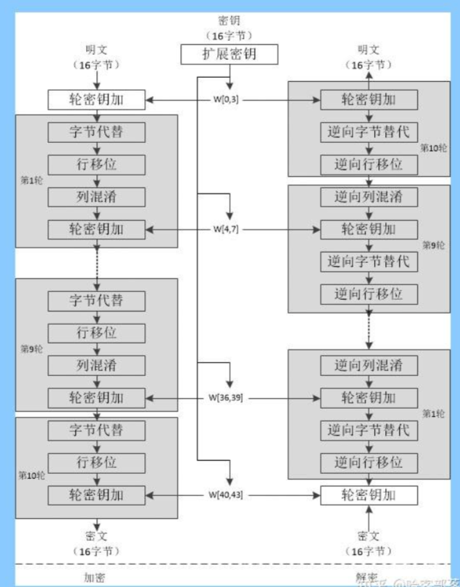

# base目录解析1
---

### 1.atomic原子操作

```cpp
#ifndef _ATOMIC_H_
#define _ATOMIC_H_

//ATOMIC_ADD宏用于将一个值加到给定指针所指向的内存位置
#define ATOMIC_ADD(src_ptr, v) (void)__sync_add_and_fetch(src_ptr, v)

//ATOMIC_ADD宏用于将一个值加到给定指针所指向的内存位置，并返回相加后的结果
#define ATOMIC_ADD_AND_FETCH(src_ptr, v) __sync_add_and_fetch(src_ptr, v)

//ATOMIC_SUB_AND_FETCH宏用于将一个值从给定指针所指向的内存位置减去，并返回相减后的结果
#define ATOMIC_SUB_AND_FETCH(src_ptr, v) __sync_sub_and_fetch(src_ptr, v)

//ATOMIC_FETCH宏用于获取给定指针所指向的内存位置的值，并返回该值
#define ATOMIC_FETCH(src_ptr) __sync_add_and_fetch(src_ptr, 0)

//ATOMIC_SET宏用于将给定值设置到给定指针所指向的内存位置
#define ATOMIC_SET(src_ptr, v) (void)__sync_bool_compare_and_swap(src_ptr, *(src_ptr), v)


// 定义了一个atomic_t类型 是一个long类型的变量
// 并使用volatile关键字修饰 以确保在多线程环境中对该变量的访问是原子的
typedef volatile long atomic_t;

#endif
```

#### 宏定义写法分析

关于这种宏定义写法的说明：宏定义是一种在预处理阶段进行文本替换的机制。

以`#define ATOMIC_ADD(src_ptr, v) (void)__sync_add_and_fetch(src_ptr, v)`为例：

1. 在这个宏定义中`ATOMIC_ADD(src_ptr, v)`是宏的名称，`(void)` 是返回类型，`__sync_add_and_fetch(src_ptr, v)`是宏的替换体
2. `__sync_add_and_fetch(src_ptr, v)` 是一个<font color='#BAOC2F'>内建函数</font>，用于执行原子的加法操作，并返回相加后的结果。该函数接受两个参数：`src_ptr` 是一个指针，表示要进行加法操作的内存位置；`v` 是要相加的值。`__sync_add_and_fetch` 函数将指针所指向的内存位置的值与 `v` 相加，并<font color='#BAOC2F'>将结果存回该内存位置</font>。最后，函数返回相加后的结果。
3. 宏定义的目的是<font color='#BAOC2F'>将函数调用和返回值类型包装在一个方便使用的宏中</font>，以便在代码中直接调用宏来执行相应的操作，而不需要显式调用函数。这种宏定义的写法可以<font color='#BAOC2F'>简化对内建函数的调用</font>，使代码更加简洁和易读。
4. 在这种写法中，`(void)` 表示该宏没有返回值，只执行加法操作而不获取返回结果。
5. 因此当在代码中使用 `ATOMIC_ADD(src_ptr, v)` 时，预处理器将会将其替换为 `(void)__sync_add_and_fetch(src_ptr, v)`，从而实现对应的原子加法操作

以`#define ATOMIC_ADD_AND_FETCH(src_ptr, v) __sync_add_and_fetch(src_ptr, v)`为例：

1. 这种写法没有明确声明返回值类型是因为 `__sync_add_and_fetch()` 是一个内建函数，它的<font color='#BAOC2F'>返回值类型是根据参数的类型来推导的</font>。在这种情况下，<font color='#BAOC2F'>返回值类型将与 src_ptr 指针所指向的内存位置的类型相匹配</font>。
2. 由于宏定义仅是对代码进行文本替换，因此无法在宏定义中明确指定返回值类型。预处理器只会将宏调用展开为相应的代码，而无法对代码进行类型检查。因此，使用这种写法时，需要确保 `src_ptr` 指针所指向的内存位置的类型与预期的操作和返回值类型是相容的。
3. 在使用 `ATOMIC_ADD_AND_FETCH(src_ptr, v)` 这样的宏时，应确保 `src_ptr` 指向的内存位置和 `v` 的类型是兼容的，并且使用该宏的上下文中可以正确处理返回值。

#### GCC内建函数

关于`__sync_add_and_fetch(src_ptr, v)` 与 `__sync_sub_and_fetch` 的说明：

`__sync_add_and_fetch`是GCC内建函数（GCC built-in function），属于GCC编译器提供的一组内建函数之一。

GCC内建函数提供了一些特定的原子操作，如原子加法、原子比较交换等。这些函数在编译时会被<font color='#BAOC2F'>直接转换为相应的硬件指令</font>或者<font color='#BAOC2F'>使用特定的处理器指令集</font>来实现原子操作。`__sync_add_and_fetch` 函数的具体实现取决于所使用的编译器和目标平台。

在实际开发项目中，`__sync_add_and_fetch` 函数可以在代码中直接使用，而无需特定的头文件或库。编译器会根据代码上下文自动识别并转换为相应的硬件指令或处理器指令，从而实现原子加法操作。

GCC提供了一系列的内建函数（built-in functions），用于提供特定的功能或操作。

除了 `__sync_add_and_fetch` 之外，GCC还提供了其他常用的内建函数，包括但不限于以下几个：

1. 原子操作函数：
    - `__sync_fetch_and_add`：执行原子加法操作并返回旧值。
    - `__sync_fetch_and_sub`：执行原子减法操作并返回旧值
    - `__sync_fetch_and_or`：执行原子按位或操作并返回旧值。
    - `__sync_fetch_and_and`：执行原子按位与操作并返回旧值。
    - `__sync_fetch_and_xor`：执行原子<font color='#BAOC2F'>按位异或操作</font>并返回旧值。
    - `__sync_bool_compare_and_swap`：执行原子<font color='#BAOC2F'>比较并交换</font>操作。
    - `__sync_val_compare_and_swap`：执行原子<font color='#BAOC2F'>比较并交换</font>操作，<font color='#BAOC2F'>并返回比较结果</font>。
2. 内存屏障函数：
    - `__sync_synchronize`：执行一个<font color='#BAOC2F'>全局的内存屏障</font>，确保内存操作按照顺序执行。

这些内建函数提供了一些原子操作和内存屏障功能，可以在多线程编程中使用，确保数据的一致性和线程安全性。

请注意，这些内建函数的使用可能会依赖于特定的编译器和目标平台。

建议查阅相关编译器文档或 GCC 官方文档以获取更详细的信息和完整的内建函数列表。

#### volatile关键字

用于声明一个变量是易变的（volatile variable）。它的作用是告诉编译器该变量的值<font color='#BAOC2F'>可能会在程序执行过程中被意外地改变</font>，因此编译器在对该变量的<font color='#BAOC2F'>读取和写入时应该遵循一些特定的规则</font>，以确保对变量的操作是准确的。

需要注意的是，`volatile` <font color='#BAOC2F'>并不能完全解决多线程编程中的并发访问问题</font>，它<font color='#BAOC2F'>只能确保对变量的读取和写入操作的可见性</font>。要实现线程安全，还需要使用其他的同步机制，如互斥锁（mutex）或原子操作。

`volatile` 的主要作用有两个方面：

1. 防止编译器进行优化：编译器在进行代码优化时会尽可能地将变量的读取和写入操作进行重排或优化，以提高程序的执行效率。然而，对于声明为 `volatile` 的变量，编译器会禁止对其进行优化，确保每次读取和写入都是直接对内存进行操作，而不是使用寄存器或缓存的副本。
2. 处理多线程或并发访问：在多线程或并发编程中，多个线程可能同时访问某个变量。如果不使用 `volatile` 关键字，编译器可能会对变量的读取和写入操作进行优化，导致某些线程无法及时感知到其他线程对变量的修改。通过使用 `volatile` 关键字，可以告诉编译器确保变量的读取和写入操作在多线程环境中具有可见性，从而避免潜在的并发访问问题。

总而言之，`volatile` 关键字用于告诉编译器该变量是易变的，需要遵循特定的规则进行读取和写入操作，以确保可见性和准确性。

在多线程编程中，可以与其他同步机制配合使用来确保线程安全性。


### 2.slog日志系统

SLog模块依赖于log4cxx，实际是对log4cxx的进一步封装 从而实现一个简单的日志系统：

CLog4CXX继承于CSLogObject，利用内部成员(LoggerPtr m_logger)的log4cxx接口重写父类的接口，在util定义了CSLog g_imlog全局变量，实现全局唯一(一般日志类都是单例)


在设计中选择将 `CSLogObject` 作为 `CSLog` 类的成员变量而不是直接使用 `CLog4CXX` 类，出于以下考虑：

1. 解耦合：通过使用基类 `CSLogObject`，可以实现代码的解耦合。使用基类作为成员变量可以使得 `CSLog` 类与具体的实现类（如 `CLog4CXX`）之间存在抽象的接口，而不是直接依赖于具体的实现。这样做可以降低代码的耦合性，使得在未来可能切换或扩展其他日志记录器时更加灵活和方便。
2. 可扩展性：通过使用基类 `CSLogObject`，可以方便地扩展和添加其他日志记录器类。如果日后需要引入新的日志记录器，只需要派生一个新的类，并实现基类中的虚函数即可，而不需要修改 `CSLog` 类的代码。
3. 接口一致性：使用基类作为成员变量可以确保 `CSLog` 类的接口与基类的接口一致，而不会暴露特定日志记录器类的细节。这样可以提供一致的接口给调用者使用，无论是使用 `CLog4CXX` 还是其他实现类，调用者可以统一使用 `CSLog` 类的接口进行日志记录。

总之，使用 `CSLogObject` 作为成员变量而不是直接使用 `CLog4CXX` 类，可以提供解耦合、可扩展性和接口一致性等好处，使代码更加灵活、可维护和可扩展。

通过使用基类CSLogObject的指针类型作为成员变量 m_log 的类型，可以实现多态性，即通过基类指针调用派生类的成员函数，这样做可以提高代码的灵活性和可扩展性。

#### CLog4CXX

```cpp
// 通过 CLog4CXX 类的构造函数初始化日志记录器对象 m_logger
// 1.使用了成员初始化列表来调用基类 CSLogObject 的构造函数，并将 module_name 和 delay 作为参数传递给基类的构造函数
CLog4CXX::CLog4CXX(const char* module_name, int delay) : CSLogObject(module_name, delay) {
    // 2.使用log4cxx提供的configureAndWatch方法 从log4cxx.properties 文件中读取配置信息，并指定了刷新配置的时间间隔delay
    PropertyConfigurator::configureAndWatch("log4cxx.properties", delay);
    // 3.使用log4cxx的Logger::getLogger方法，根据module_name获取与之对应的日志记录器对象，并将其赋值给成员变量m_logger
    m_logger = Logger::getLogger(module_name);
}

CLog4CXX::~CLog4CXX() {}

void CLog4CXX::Trace(const char *loginfo) {
    m_logger->trace(loginfo);
    //LOG4CXX_TRACE(m_logger, loginfo);
}

void CLog4CXX::Debug(const char *loginfo) {
    m_logger->debug(loginfo);
}

void CLog4CXX::Info(const char *loginfo) {
    m_logger->info(loginfo);
}

void CLog4CXX::Warn(const char *loginfo) {
    m_logger->warn(loginfo);
}

void CLog4CXX::Error(const char *loginfo) {
    m_logger->error(loginfo);
}

void CLog4CXX::Fatal(const char *loginfo) {
    m_logger->fatal(loginfo);
}
```

#### CSLog

```cpp
// 在CSLog类的构造函数中创建一个CLog4CXX 对象，并将其作为日志记录器对象赋值给成员变量m_log，以便在后续的日志输出操作中使用
// 通过使用基类CSLogObject的指针类型作为成员变量 m_log 的类型
// 可以实现多态性，即通过基类指针调用派生类的成员函数，这样做可以提高代码的灵活性和可扩展性
CSLog::CSLog(const char* module_name, int delay) {
    m_log = new CLog4CXX(module_name, delay);
}

CSLog::~CSLog() {
    delete m_log;
}

// 接收格式化字符串和变长参数，将其格式化为完整的日志消息，并调用相应的日志记录器对象的 Trace 函数进行日志输出
void CSLog::Trace(const char *format, ...) {
    // 声明一个变量args用于存储可变参数列表的信息
    va_list args;
    // 将args初始化为传递给函数的可变参数列表的起始位置，format是可变参数列表中的第一个参数
    va_start(args, format);
    // 声明一个字符数组szBuffer，用于存储格式化后的日志消息
    char szBuffer[MAX_LOG_LENGTH];
    // 使用 vsnprintf 函数将可变参数列表中的参数按照指定的格式format格式化为字符串，并将结果存储在szBuffer中
    vsnprintf(szBuffer, sizeof(szBuffer), format, args);
    // 可变参数获取结束 清理args
    va_end(args);
    // 调用m_log指向的对象（在此情况下是 CLog4CXX 对象）的Trace函数，将格式化后的日志消息作为参数传递给它，实现日志输出
    m_log->Trace(szBuffer);
}

void CSLog::Debug(const char *format, ...) {
    va_list args;
    va_start(args, format);
    char szBuffer[MAX_LOG_LENGTH];
    vsnprintf(szBuffer, sizeof(szBuffer) , format, args);
    va_end(args);
    m_log->Debug(szBuffer);
}

void CSLog::Info(const char *format, ...) {
    va_list args;
    va_start(args, format);
    char szBuffer[MAX_LOG_LENGTH];
    vsnprintf(szBuffer, sizeof(szBuffer), format, args);
    va_end(args);
    m_log->Info(szBuffer);
}

void CSLog::Warn(const char *format, ...) {
    va_list args;
    va_start(args, format);
    char szBuffer[MAX_LOG_LENGTH];
    vsnprintf(szBuffer, sizeof(szBuffer), format, args);
    va_end(args);
    m_log->Warn(szBuffer);
}

void CSLog::Error(const char *format, ...) {
    va_list args;
    va_start(args, format);
    char szBuffer[MAX_LOG_LENGTH];
    vsnprintf(szBuffer, sizeof(szBuffer), format, args);
    va_end(args);
    m_log->Error(szBuffer);
}

void CSLog::Fatal(const char *format, ...) {
    va_list args;
    va_start(args, format);
    char szBuffer[MAX_LOG_LENGTH];
    vsnprintf(szBuffer, sizeof(szBuffer), format, args);
    va_end(args);
    m_log->Fatal(szBuffer);
}
```

#### log4cxx.properties

```properties
# 用于配置log4CXX日志记录器的行为 该文件指定了日志记录的级别、输出目标（控制台和文件）、格式等设置

# 1.根记录器的配置 缺省不输出日志到控制台stdout
# 1-1.将日志级别设置为INFO，表示只输出INFO级别及以上的日志消息 输出目标为名为 default 的appender
log4j.rootLogger=INFO, default
# log4j.rootLogger=DEBUG, stdout, default

# 1-2.配置名为org.apache的logger的附加属性 当设置为false 表示该logger的日志消息不会被传递给父级logger
log4j.additivity.org.apache=false


# 2.应用于控制台
# 2-1.配置控制台输出的appender:使用了ConsoleAppender，并指定了输出格式
log4j.appender.stdout=org.apache.log4j.ConsoleAppender
log4j.appender.stdout.layout=org.apache.log4j.PatternLayout
log4j.appender.stdout.layout.ConversionPattern=%d{HH:mm:ss,SSS} [%-5p] - %m%n
#log4j.appender.stdout.layout.ConversionPattern=%d{HH:mm:ss,SSS} [%t] %-5p - %m%n


# 3.应用于文件回滚
# 3-1.配置默认的文件回滚appender:指定了输出文件路径、文件大小上限、文件备份索引等设置
log4j.appender.default=org.apache.log4j.RollingFileAppender
log4j.appender.default.File=./log/default.log
log4j.appender.default.MaxFileSize=10MB
log4j.appender.default.MaxBackupIndex=12

# 3-2.配置名为test的 appender 的附加模式 日志消息将被追加到现有的日志文件末尾 否则会覆盖或创建新的日志文件
log4j.appender.default.Append=true

# 3-3.Threshold用于控制输出级别
log4j.appender.default.Threshold=DEBUG

# 3-4.指定默认布局模式 决定了日志消息的输出格式
log4j.appender.default.layout=org.apache.log4j.PatternLayout
log4j.appender.default.layout.ConversionPattern=%d [%-5p %.16c] - %m%n
#log4j.appender.default.layout.ConversionPattern=%d [%t] %-5p %.16c - %m%n


# 4.配置名为test的记录器，将日志级别设置为DEBUG，并将输出目标指定为名为 test 的appender
log4j.logger.test=DEBUG, test
# 应用于文件回滚
# 4-1.配置用于test记录器的文件回滚appender：指定了输出文件路径、文件大小上限、文件备份索引等设置
log4j.appender.test=org.apache.log4j.RollingFileAppender
log4j.appender.test.File=./log/TEST.log
log4j.appender.test.MaxFileSize=10MB
log4j.appender.test.MaxBackupIndex=12
log4j.appender.test.DatePattern='.'yyyy-MM-dd

# 4-2.配置名为test的 appender 的附加模式 日志消息将被追加到现有的日志文件末尾 否则会覆盖或创建新的日志文件
log4j.appender.test.Append=true

# 4-3.Threshold用于控制输出级别
log4j.appender.test.Threshold=DEBUG

# 4-4.指定默认布局模式 日志消息的输出格式
log4j.appender.test.layout=org.apache.log4j.PatternLayout
log4j.appender.test.layout.ConversionPattern=%d [%-5p %.16c] - %m%n
```

### 3.base64编解码

base64就是使用64个可打印的字符来表示二进制的数据，本质上是一种编码方式，用于<font color='#BAOC2F'>将二进制数据转换成可打印字符的形式</font>。它的作用是将二进制数据在不损失数据的情况下进行表示，以便在文本环境中传输或存储。

#### 应用场景

在实际开发中，Base64 编码经常用于以下情况：

1. 数据传输：当需要<font color='#BAOC2F'>在文本协议或文本格式中传输二进制数据时</font>，常常需要将二进制数据编码成 Base64 格式，以<font color='#BAOC2F'>确保数据能够正确地传输和解析</font>。例如，在电子邮件中传输二进制附件、在HTTP请求中传输图片或文件等。
2. 数据存储：有些<font color='#BAOC2F'>存储介质或存储格式只支持文本数据</font>，无法直接存储二进制数据。在这种情况下，可以将二进制数据进行 Base64 编码后再进行存储。<font color='#BAOC2F'>常见的例子是将图片数据以 Base64 编码的形式存储在数据库中</font>。
3. URL 参数传递：在 URL 中传递特殊字符或二进制数据时，为了避免特殊字符对 URL 的解析造成干扰，常常需要将二进制数据进行 Base64 编码后再传递。
4. 数据加密：有些加密算法只能处理特定长度的数据，而输入的数据长度不满足要求时，可以使用 Base64 编码将数据填充至满足要求的长度后再进行加密。

总而言之，Base64 编码在实际开发中<font color='#BAOC2F'>主要用于将二进制数据转换成文本格式</font>，以便在各种文本环境中进行传输、存储或处理。

#### base64编解码原理

base64使用64个可打印的字符来表示二进制的数据，

- [彻底弄懂base64的编码与解码原理](https://zhuanlan.zhihu.com/p/408318391) 
- [一篇文章彻底弄懂Base64编码原理](https://blog.csdn.net/wo541075754/article/details/81734770) 

加密与编码的区别：

1. 加密：将明文变为一种不可破解的密文，提高识别难度
2. 编码：换一种体现形式，以便于传输提高计算机可读性

base64编码表：


以将中文使用base64编码为例：

1. step1：找到中文字符在操作系统中相应字符编码的代表码（chcp）GB2312，中文找到字符编码中的十进制值
2. step2：将十进制转为二进制
3. step3：对二进制进行分组，每六个一组（最后一组不满6位补0即可）
4. step4：将分组后的二进制组转为十进制
5. step5：在base64表中查找其对应的编码（可使用不同的编码表达到数据加密的效果）

#### 代码实现

- 学习到的编程技巧1：断言assert运用判定验证条件是否为真

断言 (assert) 是一种在程序中<font color='#BAOC2F'>用于验证条件是否为真的机制</font>。

它用于<font color='#BAOC2F'>在代码中插入检查点</font>，以<font color='#BAOC2F'>确保特定条件满足或特定状态正确</font>。如果<font color='#BAOC2F'>断言的条件为假</font>，则<font color='#BAOC2F'>断言会引发一个异常终止程序的执行</font>。

- 学习到的编程技巧2：利用二进制位运算获取最低 n 位二进制数据

- 利用位运算提取一个字节（最低的8位二进制）数据：accumulator & 0xffu
    - `0xffu` 是一个无符号整数常量，它的二进制表示为 `00000000 00000000 00000000 11111111`
    - 按位与将`accumulator`的值与`0xffu`进行按位与操作，实际上是将`accumulator`的高位部分清零，只保留最低的 8 位数据。
    - 这个操作的目的是提取`accumulator`中的最低有效字节，即保留最右边的 8 位二进制数据。
    - 通过该运算后得到的结果是一个<font color='#BAOC2F'>无符号整数</font>，表示`accumulator`中的最低有效字节。
    - 最后将提取到的 8 位二进制数据转换为 `char` 类型，然后添加到 `retval` 字符串中，用于存储解码后的原始二进制数据。
- 利用位运算提取（最低的6位二进制）数据：accumulator & 0x3fu
    - `0x3fu` 是一个无符号整数常量，它的二进制表示为 `00000000 00000000 00000000 00111111` 
    - 按位与将`accumulator`的值与`0x3fu`进行按位与操作，实际上是将`accumulator`的高位部分清零，只保留最低的 6 位数据。
    - 这个操作的目的是从 `accumulator` 中提取最低的6位二进制数据，以获取索引值。
    - 通过该运算后得到的结果是一个<font color='#BAOC2F'>无符号整数</font>，它的值在 0 ~ 63 的范围内，对应于 `b64_table` 中的有效索引。
    - 最后使用该索引从 `b64_table` 中找到相应的 Base64 字符，并将其存入 `retval` 字符串中，用于进行解码操作。

```cpp
#ifndef __BASE64_H__
#define __BASE64_H__

#include<iostream>
using namespace std;

// 对 Base64 编码的字符串进行解码，返回解码后的原始数据
string base64_decode(const string &ascdata);
// 对原始数据进行 Base64 编码，返回编码后的字符串
string base64_encode(const string &bindata);

#endif
```

```cpp
#include <stdio.h>
#include <iostream>
#include <string>
#include <cassert>
#include <limits>
#include <stdexcept>
#include <cctype>

using namespace std;

// base64编码表 用于将6位二进制值映射到相应的Base64字符
static const char b64_table[65] = "ABCDEFGHIJKLMNOPQRSTUVWXYZabcdefghijklmnopqrstuvwxyz0123456789+/";

// reverse_table解码表 用于将Base64字符映射回原始的6位二进制值
static const char reverse_table[128] = {
    64, 64, 64, 64, 64, 64, 64, 64, 64, 64, 64, 64, 64, 64, 64, 64,
    64, 64, 64, 64, 64, 64, 64, 64, 64, 64, 64, 64, 64, 64, 64, 64,
    64, 64, 64, 64, 64, 64, 64, 64, 64, 64, 64, 62, 64, 64, 64, 63,
    52, 53, 54, 55, 56, 57, 58, 59, 60, 61, 64, 64, 64, 64, 64, 64,
    64,  0,  1,  2,  3,  4,  5,  6,  7,  8,  9, 10, 11, 12, 13, 14,
    15, 16, 17, 18, 19, 20, 21, 22, 23, 24, 25, 64, 64, 64, 64, 64,
    64, 26, 27, 28, 29, 30, 31, 32, 33, 34, 35, 36, 37, 38, 39, 40,
    41, 42, 43, 44, 45, 46, 47, 48, 49, 50, 51, 64, 64, 64, 64, 64
};

/**
 * @brief base64编码过程
 * 
 * @param const string &bindata 待编码的01二进制数据
 * @return string Base64编码字符串
*/
string base64_encode(const string &bindata) {
    using std::numeric_limits;
    
    // 1.首先检查待编码的数据是否过大
    // numeric_limits<string::size_type>::max()获取 string::size_type 类型的最大值
    // 将最大值除以4 再乘以3 以确定进行Base64编码后的最大字符串长度
    if (bindata.size() > (numeric_limits<string::size_type>::max() / 4u) * 3u) {
        //throw length_error("Converting too large a string to base64.");
        /* 如果待编码的数据长度超过限制 返回空字符串 */
        return "";
    }

    // 2.根据二进制数据的长度 计算编码后的字符串长度
    const size_t binlen = bindata.size();
    // 初始化string对象来存储编码结果: 第一个参数为字符串长度 第二个参数为初始化字符串的值
    // 使用(binlen + 2) / 3可以确保编码后的字符串长度能够容纳所有的数据
    // 乘以4是因为每3个字节的数据会编码为4个字符（3 * 8 = 4 * 6）
    string retval((((binlen + 2) / 3) * 4), '=');


    // 3.函数通过迭代遍历输入数据的每个字节，并将字节转换为对应的Base64字符
    size_t outpos = 0;//retval中存储字符的位置
    int bits_collected = 0;//跟踪累加器中已经收集的比特位数
    unsigned int accumulator = 0;//用于存储累加器的值
    const string::const_iterator binend = bindata.end();//指向字符串bindata结尾位置的迭代器

    for (string::const_iterator i = bindata.begin(); i != binend; ++i) {
        //每次迭代将当前字节与0xffu按位与运算
        //将其左移8位并与accumulator进行按位或运算 以确保只取字节的低8位
        accumulator = (accumulator << 8) | (*i & 0xffu);
        //将新的字节添加到累加器中
        bits_collected += 8;
        //当累加器中的比特位数bits_collected达到6位或以上时
        while (bits_collected >= 6) {
            bits_collected -= 6;//表示已从累加器中取出了6位值
            //将accumulator右移并与0x3fu按位与运算 以获取累加器中的6位值对应的索引
            int index = (accumulator >> bits_collected) & 0x3fu;
            //根据索引从b64_table中找到相应的Base64字符，并将其存入retval中
            retval[outpos++] = b64_table[index];
        }
    }

    // 4.最后如果存在剩余的不足6位的二进制位 则将累加器左移使剩余位移动到高位 再次索引并存入retval
    // Any trailing bits that are missing.
    // 利用断言assert验证条件是否为真
    if (bits_collected > 0) {
        //剩余不足6位的二进制位 但bits_collected值大于等于6 断言失败并抛出异常（值错误或算法逻辑错误）
        assert(bits_collected < 6);
        //剩余的不足6位的二进制位 且bits_collected < 6 则进行左移操作
        accumulator <<= 6 - bits_collected;
        //并通过与0x3fu按位与运算获取索引
        int index =  accumulator & 0x3fu;
        //根据索引从b64_table中找到相应的Base64字符，并将其存入retval中
        retval[outpos++] = b64_table[index];
    }

    // 5.通过不断更新的outpos来确定retval中存储字符的位置 使用断言assert进行一些边界检查 确保编码结果的正确性
    // 确保outpos的值不小于retval的长度减去2：是否正确计算了编码结果的长度，并且没有发生越界访问
    assert(outpos >= (retval.size() - 2));
    // 确保outpos的值不大于等于retval的长度：检查是否正确更新了outpos的值，避免越界写入retval
    assert(outpos <= retval.size());

    return retval;   
}

/**
 * @brief base64解码过程
 * 对Base64编码字符串进行逐字符解码 并将解码后的二进制数据以字符串形式存储在retval中
 * 
 * @param const string &ascdata Base64编码字符串
 * @return string 01二进制数据
*/
string base64_decode(const string &ascdata) {
    string retval;
    const string::const_iterator last = ascdata.end();//ascdata字符串的末尾位置的迭代器
    int bits_collected = 0;//表示当前已收集的二进制位数
    unsigned int accumulator = 0;//用于累积收集的二进制数据的变量

    // 逐字符解码 并将解码后的二进制数据以字符串形式存储在retval中    
    for (string::const_iterator i = ascdata.begin(); i != last; ++i) {
        const int c = *i;
        // 1.当前字符是否为空格或者为等号，如果是则跳过该字符
        // 在Base64编码中空格和填充字符'='是可以存在的，但对解码结果没有影响 故直接跳过
        if (isspace(c) || c == '=') continue;

        // 2.检查当前字符是否在合法的范围内，异常返回空字符串
        if ((c > 127) || (c < 0) || (reverse_table[c] > 63)) return "";

        // 3.将收集到的二进制数据累积到accumulator中
        // 将accumulator左移6位 并与reverse_table[c]按位或运算
        accumulator = (accumulator << 6) | reverse_table[c];
        // 将bits_collected增加6，表示已经收集了6位二进制数据
        bits_collected += 6;

        // 4.如果bits_collected达到或超过8，表示已经收集足够的二进制数据可以解码为一个字节
        if (bits_collected >= 8) {
            bits_collected -= 8;
            //从accumulator中取出最高位的8位二进制数据，并将其转换为字符类型添加到retval字符串中
            retval += (char)((accumulator >> bits_collected) & 0xffu);
        }
    }
    return retval;
}
```


### 4.AES加解密与md5计算


主要用于处理AES加解密（对称加密算法加密和解密用相同的密钥），和MD5计算

高级加密标准(AES,Advanced Encryption Standard)为<font color='#BAOC2F'>最常见的对称加密算法</font>（微信小程序加密传输就是用这个加密算法的）

该模块依赖于UtilPdu（自己实现）、Base64（自己实现）和openssl/aes，该模块主要用于<font color='#BAOC2F'>AES加解密和MD5计算</font>。

#### AES加密原理

在密码学中，加密算法分为双向加密和单向加密。

- 单向加密包括MD5、SHA等摘要算法，它们是不可逆的。
- 双向加密包括对称加密和非对称加密，双向加密是可逆的，存在密文的密钥。
    - 对称加密指，<font color='#BAOC2F'>加密和解密使用相同密钥</font>的加密算法。包括AES加密、DES加密等。AES算法是DES算法的替代者，也是现在最流行的加密算法之一。
    - 非对称加密指，<font color='#BAOC2F'>加密和解密使用不同密钥的加密算法</font>，也称为公私钥加密。常见的非对称加密算法包括：RSA、DSA（数字签名用）、ECC（移动设备用）、Diffie-Hellman、El Gamal。

AES是高级加密标准，在密码学中又称<font color='#BAOC2F'>Rijndael加密法</font>，是美国联邦政府采用的一种<font color='#BAOC2F'>区块加密标准</font>。这个标准用来替代原先的DES，目前已经被全世界广泛使用，同时AES已经成为对称密钥加密中最流行的算法之一。AES支持三种长度的密钥：128位，192位，256位。

##### 秘钥

密钥是AES算法实现加密和解密的根本。对称加密算法之所以对称，是因为这类算法对明文的加密和解密需要使用同一个密钥。

AES支持三种长度的密钥：128位，192位，256位，AES128，AES192，AES256

##### 填充

1. AES具有分组加密的特性，AES算法在对明文加密的时候<font color='#BAOC2F'>并不是把整个明文一股脑加密成一整段密文</font>，而是<font color='#BAOC2F'>把明文拆分成一个个独立的明文块</font>，每一个明文块长度128bit。

2. 这些明文块经过AES加密器的复杂处理，生成一个个独立的密文块，这些密文块拼接在一起，就是最终的AES加密结果。

3. 当一段明文长度是192bit，如果按每128bit一个明文块来拆分的话，第二个明文块只有64bit，不足128bit的时候就需要对明文块进行填充（Padding）。

4. AES具有三种填充模式：

    - NoPadding：不做任何填充，但是要求明文必须是16字节的整数倍。

    - PKCS5Padding：如果明文块少于16个字节128bit，在明文块末尾补足相应数量的字符，且每个字节的值等于缺少的字符数。

        比如明文：{1,2,3,4,5,a,b,c,d,e},缺少6个字节，则补全为{1,2,3,4,5,a,b,c,d,e,6,6,6,6,6,6}

    - ISO10126Padding：如果明文块少于16个字节128bit，在明文块末尾补足相应数量的字节，最后一个字符值等于缺少的字符数，其他字符填充随机数。

        比如明文：{1,2,3,4,5,a,b,c,d,e},缺少6个字节，则可能补全为{1,2,3,4,5,a,b,c,d,e,5,c,3,G,$,6}


##### 算法流程

AES加密算法涉及4种操作：

- 字节替代（SubBytes）：通过非线性的替换函数，用查找表的方式把每个字节替换成对应的字节。
- 行移位（ShiftRows）：将矩阵中的每个横列进行循环式移位。
- 列混淆（MixColumns）：为了充分混合矩阵中各个直行的操作。这个步骤使用线性转换来混合每列的四个字节。
- 轮密钥加（AddRoundKey）：矩阵中的每一个字节都与该次轮密钥（round key）做XOR运算；每个子密钥由密钥生成方案产生。

下图给出了AES加解密的流程，从图中可以看出：

1. 解密算法的每一步分别对应加密算法的逆操作；
2. 加解密所有操作的顺序正好是相反的。正是由于这几点（再加上加密算法与解密算法每步的操作互逆）保证了算法的正确性。加解密中每轮的密钥分别由种子密钥经过密钥扩展算法得到。算法中16字节的明文、密文和轮子密钥都以一个4x4的矩阵表示。



#### 代码实现

##### security.h

```cpp
DLL_MODIFIER int EncryptMsg(const char* pInData, uint32_t nInLen, char** pOutData, uint32_t& nOutLen);
DLL_MODIFIER int DecryptMsg(const char* pInData, uint32_t nInLen, char** pOutData, uint32_t& nOutLen);
DLL_MODIFIER int EncryptPass(const char* pInData, uint32_t nInLen, char** pOutData, uint32_t& nOutLen, const char* pKey);
L_MODIFIER int DecryptPass(const char* pInData, uint32_t nInLen, char** ppOutData, uint32_t& nOutLen, const char* pKey);
DLL_MODIFIER void Free(char* pOutData);
```

##### EncDec.h

```cpp
#ifndef __ENCDEC_H__
#define __ENCDEC_H__

#include <iostream>
#include <openssl/aes.h>
#include <openssl/md5.h>
#include "ostype.h"

using namespace std;

class CAes {
public:
    CAes(const string& strKey);
    
    int Encrypt(const char* pInData, uint32_t nInLen, char** ppOutData, uint32_t& nOutLen);
    int Decrypt(const char* pInData, uint32_t nInLen, char** ppOutData, uint32_t& nOutLen);
    void Free(char* pData);
private:
    AES_KEY m_cEncKey;
    AES_KEY m_cDecKey;
};

class CMd5 {
public:
    static void MD5_Calculate (const char* pContent, unsigned int nLen,char* md5);
};

#endif
```

##### EncDec.cpp

```cpp
#include "EncDec.h"
#include "Base64.h"
#include "UtilPdu.h"
#include <stdio.h>
#include <string.h>

/// @brief 在构造函数中使用AES算法设置 加密和解密密钥
/// @param strKey 明文密码
CAes::CAes(const string& strKey) {
    AES_set_encrypt_key((const unsigned char*)strKey.c_str(), 256, &m_cEncKey);
    AES_set_decrypt_key((const unsigned char*)strKey.c_str(), 256, &m_cDecKey);
}

/// @brief 对输入数据进行AES加密
/// 在使用该函数之前，需要确保相关的AES加密库和头文件已正确引入，并链接到程序中
/// @param pInData 指向要加密的输入数据的指针
/// @param nInLen 输入数据的长度
/// @param ppOutData 指向指针的指针，用于存储加密后的数据
/// @param nOutLen 加密后的数据长度
/// @return int
int CAes::Encrypt(const char* pInData, uint32_t nInLen, char** ppOutData, uint32_t& nOutLen) {
    if (pInData == NULL || nInLen <= 0) return -1;

    // 1.计算加密后数据的长度
    uint32_t nRemain = nInLen % 16;
    uint32_t nBlocks = (nInLen + 15) / 16;

    // 2.并根据加密算法的要求进行数据块大小的调整
    if (nRemain > 12 || nRemain == 0) nBlocks += 1;
    uint32_t nEncryptLen = nBlocks * 16;

    // 3.动态分配内存用于存储加密前和加密后的数据
    unsigned char* pData = (unsigned char*)calloc(nEncryptLen, 1);//加密前的数据
    memcpy(pData, pInData, nInLen);
    unsigned char* pEncData = (unsigned char*)malloc(nEncryptLen);//加密后的数据

    // 4.将原始数据的长度（nInLen）写入到最后一个数据块的末尾
    CByteStream::WriteUint32((pData + nEncryptLen - 4), nInLen);

    // 5.使用AES_encrypt函数对每个数据块进行AES加密，将加密后的结果存储在pEncData中
    for (uint32_t i = 0; i < nBlocks; i++) AES_encrypt(pData + i * 16, pEncData + i * 16, &m_cEncKey);

    // 6.完成加密后释放原始数据的内存 并将加密后的数据转换为string类型
    free(pData);
    string strEnc((char*)pEncData, nEncryptLen);
    free(pEncData);

    // 7.使用base64_encode函数对加密后的数据进行Base64编码，将编码后的结果存储在strDec中
    string strDec = base64_encode(strEnc);

    // 8.确定编码后数据的长度 并为其分配内存
    nOutLen = (uint32_t)strDec.length();
    char* pTmp = (char*)malloc(nOutLen + 1);//指向存储加密后并经过Base64编码的数据的字符指针

    // 9.将编码后的数据复制到新分配的内存中，并在末尾添加字符串结束符
    memcpy(pTmp, strDec.c_str(), nOutLen);
    pTmp[nOutLen] = 0;

    // 10.将指向加密后数据的指针赋值给ppOutData，以便在函数外部可以访问到加密后的数据
    *ppOutData = pTmp;

    return 0;
}

/// @brief 解密函数Decrypt的实现
/// @param pInData 指向待解密数据的字符数组的指针
/// @param nInLen 待解密数据的长度 以字节为单位
/// @param ppOutData 指向char*类型指针的指针，用于存储解密后的数据
/// @param nOutLen uint32_t类型的引用，用于存储解密后的数据的长度
/// @return int
int CAes::Decrypt(const char* pInData, uint32_t nInLen, char** ppOutData, uint32_t& nOutLen) {
    if (pInData == NULL || nInLen <= 0) return -1;

    // 1.将输入数据pInData和长度nInLen构造成string对象strInData
    string strInData(pInData, nInLen);

    // 2.使用base64_decode函数对strInData进行Base64解码
    std::string strResult = base64_decode(strInData);

    // 3.获取解码后数据的长度nLen并进行判断 如果解码后的数据长度为0表示解码失败返回-2
    uint32_t nLen = (uint32_t)strResult.length();
    if (nLen == 0) return -2;

    // 4.将解码后的数据转换为const unsigned char*类型 并赋值给pData
    const unsigned char* pData = (const unsigned char*)strResult.c_str();

    // 5.检查待解密数据的长度是否是16的倍数如果不是，即存在不完整的AES加密块 返回-3
    // 如果待解密数据的长度不是16的倍数，说明数据不完整或格式错误，无法正确解密
    if (nLen % 16 != 0) return -3;
    
    // 6.根据解码后的数据长度nLen为 pTmp 分配足够的内存空间用于存储解密后的数据（解密完成后的长度应该小于该长度）
    char* pTmp = (char*)malloc(nLen + 1);

    // 7.通过循环遍历将解码后的数据进行分块AES解密
    uint32_t nBlocks = nLen / 16;
    for (uint32_t i = 0; i < nBlocks; i++) AES_decrypt(pData + i * 16, (unsigned char*)pTmp + i * 16, &m_cDecKey);

    // 8.在解密后的数据末尾，使用CByteStream::ReadUint32函数从解密后数据的末尾读取出长度值，并将其赋值给 nOutLen
    uchar_t* pStart = (uchar_t*)pTmp + nLen - 4;
    nOutLen = CByteStream::ReadUint32(pStart);
    
    // 9.判断解密后的数据长度nOutLen是否大于解密前的数据长度nLen
    // 如果是表示解密后的数据长度异常 释放pTmp所指向的内存空间并返回-4
    if (nOutLen > nLen) {
        free(pTmp);
        return -4;
    }

    // 10.将解密后的数据以空字符结尾 并将pTmp赋值给*ppOutData，将解密后的数据指针输出
    pTmp[nOutLen] = 0;//将其最后一个字符置为null终止符 \0 以确保字符串的正确结束
    *ppOutData = pTmp;
    return 0;
}

/// @brief 安全地释放动态分配的内存 确保不会导致内存泄漏或使用已释放的内存
/// @param pOutData 指向需要释放内存的空间的指针
void CAes::Free(char* pOutData) {
    if (pOutData) {
        free(pOutData);
        pOutData = NULL;
    }
}

/// @brief 计算给定数据的MD5哈希值
/// @param pContent 指向要计算哈希值的数据的指针
/// @param nLen 数据的长度
/// @param md5 存储计算得到的MD5哈希值的字符串缓冲区
void CMd5::MD5_Calculate(const char* pContent, unsigned int nLen, char* md5) {
    uchar_t d[16];//存储计算得到的MD5哈希值
    MD5_CTX ctx;//MD5_CTX结构体类型的变量ctx 存储MD5计算的上下文信息
    MD5_Init(&ctx);//初始化MD5计算的上下文
    MD5_Update(&ctx, pContent, nLen);//利用MD5_Update函数将数据块pContent的内容添加到MD5计算中
    MD5_Final(d, &ctx);//使用MD5_Final函数将最终的MD5哈希值存储到数组d中

    //循环通过将每个字节转换为两位的十六进制表示，并使用snprintf函数将结果存储在字符串缓冲区md5中
    for (int i = 0; i < 16; ++i) snprintf(md5 + (i * 2), 32, "%02x", d[i]);
    //将字符串缓冲区的最后一个字符设置为零，以表示字符串的结尾。
    md5[32] = 0;
    return;
}
```

##### md5.cpp

```cpp

```

##### security.cpp

```cpp

```


### 5.Lock锁机制与自动锁管理类


条件编译关于`CRITICAL_SECTION m_critical_section;`的解释：

`CRITICAL_SECTION` 是 Windows 操作系统提供的一种临界区（Critical Section）的同步对象，用于<font color='#BAOC2F'>实现线程间的互斥访问</font>。

- 在 C++ 中是一种<font color='#BAOC2F'>同步原语，用于保护临界区代码，</font>防止多个线程同时访问导致的数据竞争和不一致性。
- 在 Windows 平台上一是一种轻量级的同步机制，<font color='#BAOC2F'>相对于互斥锁（Mutex）而言，它的开销较小</font>，适用于同一进程内的线程同步。
- 是一个类成员变量，用于表示一个临界区对象。
- 该对象可以在多个成员函数中使用，以实现线程安全的访问。

临界区对象的使用一般涉及两个主要的操作：

1. 进入临界区：通过调用 `EnterCriticalSection` 函数来进入临界区，该操作会阻塞其他线程的进入，直到当前线程离开临界区。
2. 离开临界区：通过调用 `LeaveCriticalSection` 函数来离开临界区，该操作允许其他线程进入临界区。

使用临界区对象可以<font color='#BAOC2F'>在多线程环境中保护共享资源的访问</font>，确保只有一个线程可以同时进入临界区执行相关代码，从而<font color='#BAOC2F'>避免并发访问引发的数据竞争问题</font>。

#### lock.h

```cpp
#ifndef __LOCK_H__
#define __LOCK_H__

#include "ostype.h"

////////////////////////CLock/////////////////////////////////////
/**
 * CLock 类是一个互斥锁的封装类
 * 
 * CLock：用于获取互斥锁。如果互斥锁当前不可用，调用线程将被阻塞，直到互斥锁可用为止
 * ~CLock：用于释放互斥锁，使其可被其他线程获取
 * getMutex：返回互斥锁对象，以便对其进行直接操作（例如在条件变量中使用）
 * try_lock（非Windows系统）：尝试获取互斥锁，如果互斥锁当前不可用，则立即返回失败
 * 
 * 在Windows系统下（_WIN32宏定义为真），使用临界区（CRITICAL_SECTION）来实现互斥锁
 * 而在非Windows系统下，则使用 pthread 库提供的互斥锁（pthread_mutex_t）
 * 
 * 这样的封装使得代码在不同操作系统上具有可移植性，因为在不同系统上使用不同的互斥锁实现方式
*/
class CLock {
public:
    CLock();
    virtual ~CLock();

    void lock();
    void unlock();
    pthread_mutex_t& getMutex() { return m_lock; }
#ifndef _WIN32
    virtual bool try_lock();
#endif
private:
#ifdef _WIN32
	CRITICAL_SECTION m_critical_section;
#else
    pthread_mutex_t m_lock;
#endif
};

///////////////////// CAutoLock//////////////////////////////////////
/**
 * CAutoLock 类是一个自动锁的封装类，用于简化对互斥锁的加锁和解锁操作
 * 封装了普通局部锁 利用c++语法局部变量离开作用域自动析构原理，实现自动解锁（牺牲了一定效率）
 * 
 * 通过构造函数和析构函数的调用，实现了自动获取锁和自动释放锁的功能，避免了手动管理锁的操作
 * CAutoLock(CLock* pLock)：接受一个CLock对象指针作为参数，用于初始化CAutoLock对象
 * 在构造函数中会调用pLock对象的lock()方法，自动获取锁
 * ~CAutoLock()：在对象销毁时自动调用
 * 在析构函数中会调用m_pLock对象的unlock()方法自动释放锁
*/
class CAutoLock {
public:
    CAutoLock(CLock* pLock);
    virtual ~CAutoLock();
private:
    CLock* m_pLock;
};

//////////////////////WIN32//////////////////////////////////////////
#ifndef _WIN32
///////////////////// CRWLock//////////////////////////////////////
/**
 * CRWLock 类是一个读写锁的封装类，用于实现多读单写的并发控制
 * 
 * CRWLock(); 构造函数用于初始化读写锁对象。
 * virtual ~CRWLock(); 析构函数用于销毁读写锁对象。
 * 
 * void rlock(); 获取读锁，允许多个线程同时获取读锁，当有线程持有写锁时，其他线程无法获取写锁。
 * void wlock(); 获取写锁，只允许一个线程获取写锁，当有线程持有读锁或写锁时，其他线程无法获取读锁或写锁。
 * void unlock(); 释放读锁或写锁
 * bool try_rlock(); 尝试获取读锁，如果能成功获取则返回 true，否则返回 false
 * bool try_wlock(); 尝试获取写锁，如果能成功获取则返回 true，否则返回 false
 * 
 * 使用读写锁可以实现多线程读取共享数据，而在写操作时需要独占访问共享数据的情况下，保证数据的一致性和并发安全性
*/
class CRWLock {
public:
    CRWLock();
    virtual ~CRWLock();

    void rlock();
    void wlock();
    void unlock();
    bool try_rlock();
    bool try_wlock();
private:
    pthread_rwlock_t m_lock;
};

///////////////////// CAutoRWLock//////////////////////////////////////
/**
 * CAutoRWLock 类是一个自动读写锁的封装类，用于简化对读写锁的加锁和解锁操作
 * 封装了读写局部锁，利用c++语法局部变量离开作用域自动析构原理，实现自动解锁（牺牲了一定效率）
 * 
 * 构造函数，接收一个CRWLock对象指针和一个布尔值参数 当布尔值参数为true时默认获取读锁；当布尔值参数为false时获取写锁。
 * 析构函数，用于释放自动锁对象，自动调用解锁操作
 * 
 * 使用 CAutoRWLock 类可以在进入作用域时自动获取读锁或写锁
 * 并在离开作用域时自动释放锁，避免手动管理锁的加锁和解锁操作，从而简化代码并确保正确的加锁和解锁顺序
*/
class CAutoRWLock {
public:
    CAutoRWLock(CRWLock* pLock, bool bRLock = true);
    virtual ~CAutoRWLock();
private:
    CRWLock* m_pLock;
};

#endif  

#endif
```

#### lock.cpp

```cpp
#include "Lock.h"

////////////////////////////CLock/////////////////////////////////////
CLock::CLock() {
#ifdef _WIN32
    InitializeCriticalSection(&m_critical_section);
#else
    pthread_mutex_init(&m_lock, NULL);
#endif
}

CLock::~CLock() {
#ifdef _WIN32
    DeleteCriticalSection(&m_critical_section);
#else
    pthread_mutex_destroy(&m_lock);
#endif
}

void CLock::lock() {
#ifdef _WIN32
    EnterCriticalSection(&m_critical_section);
#else
    pthread_mutex_lock(&m_lock);
#endif
}

void CLock::unlock() {
#ifdef _WIN32
    LeaveCriticalSection(&m_critical_section);
#else
    pthread_mutex_unlock(&m_lock);
#endif
}

#ifndef _WIN32
bool CLock::try_lock() {
    // pthread_mutex_trylock(&m_lock)是一个函数调用 用于尝试获取互斥锁
    // 如果成功获取到互斥锁返回值为0 否则返回其他非零值
    return pthread_mutex_trylock(&m_lock) == 0;
}
#endif

////////////////////////////CAutoLock/////////////////////////////////////
CAutoLock::CAutoLock(CLock* pLock) {
    m_pLock = pLock;
    if (m_pLock != NULL) m_pLock->lock();
}

CAutoLock::~CAutoLock() {
    if (NULL != m_pLock) m_pLock->unlock();
}


////////////////////////////CRWLock/////////////////////////////////////
#ifndef _WIN32
CRWLock::CRWLock() {
    pthread_rwlock_init(&m_lock, NULL);
}

CRWLock::~CRWLock() {
    pthread_rwlock_destroy(&m_lock);
}

void CRWLock::rlock() {
    pthread_rwlock_rdlock(&m_lock);
}

void CRWLock::wlock() {
    pthread_rwlock_wrlock(&m_lock);
}

void CRWLock::unlock() {
    pthread_rwlock_unlock(&m_lock);
}

bool CRWLock::try_rlock() {
    return pthread_rwlock_tryrdlock(&m_lock) == 0;
}

bool CRWLock::try_wlock() {
    return pthread_rwlock_trywrlock(&m_lock) == 0;
}

////////////////////////////CAutoRWLock/////////////////////////////////////

/// @brief 构造函数
/// @param pLock 指向CRWLock对象的指针，表示要操作的读写锁
/// @param bRLock 布尔值用于指定是否进行读锁操作 ture进行读锁操作 false进行写锁操作
CAutoRWLock::CAutoRWLock(CRWLock* pLock, bool bRLock) {
    m_pLock = pLock;
    if (NULL != m_pLock) {
        // 据传入的参数bRLock来选择执行读锁操作还是写锁操作（获取锁和上锁实际上是指同一个操作）
        // 如果写锁当前可用，则获取成功，线程可以继续执行
        // 如果写锁当前被其他线程持有，则获取失败，线程会被阻塞，直到写锁可用为止
        if (bRLock) m_pLock->rlock();//获取读锁
        else m_pLock->wlock();//获取写锁
    }
}

CAutoRWLock::~CAutoRWLock() {
    if (NULL != m_pLock) m_pLock->unlock();
}

#endif
```


### 6.Condition条件变量


#### Condition.h

```cpp
#ifndef __CONDITION_H__
#define __CONDITION_H__

#include <pthread.h>
#include "Lock.h"

/**
 * 线程同步条件变量的抽象
*/
class CCondition {
public:
    //将条件变量与特定的锁相关联
    CCondition(CLock* pLock);
    //清理与条件变量相关的任何资源
    ~CCondition();
    //阻塞调用线程，直到条件变量被发信号
    //在调用该函数时，必须持有关联的锁
    //它将释放锁，并等待另一个线程发出的信号，然后重新获取锁并返回
    void wait();
    //类似于wait() 但它包括一个以毫秒（nWaitTime）为单位的超时值
    //如果在指定的时间内收到信号，它将返回true 否则，如果超时时间到期而未收到信号，它将返回false
    bool waitTime(uint64_t nWaitTime);
    //通知一个等待的线程条件已发生 它唤醒一个等待的线程（如果有），使其可以继续执行
    void notify();
    //通知所有等待的线程条件已发生 它唤醒所有等待的线程，使它们可以继续执行
    void notifyAll();
private:
    CLock* m_pLock;//指向关联的CLock对象的指针
    pthread_cond_t m_cond;//实际的条件变量 用于线程同步
};

#endif
```

#### condition.cpp

```cpp
#include <assert.h>
#include "Condition.h"

CCondition::CCondition(CLock* pLock) : m_pLock(pLock) {
    if (!pLock) assert(false);
    //初始化条件变量
    pthread_cond_init(&m_cond, NULL);
}

CCondition::~CCondition() {
    //销毁条件变量
    pthread_cond_destroy(&m_cond);
}

/**
 * 等待条件变量的发生
 * 当一个线程调用wait()函数时，它会首先释放关联的锁（通过调用m_pLock->getMutex()获取锁）
 * 然后线程进入等待状态，直到其他线程发出条件信号（通过调用notify()或notifyAll()函数）
*/
void CCondition::wait() {
    //wait函数调用pthread_cond_wait来等待条件变量
    //释放关联的锁CLock 并等待直到其他线程发出条件信号
    pthread_cond_wait(&m_cond, &m_pLock->getMutex());
}

//带有指定的超时时间等待条件变量
bool CCondition::waitTime(uint64_t nWaitTime) {
    //根据输入的nWaitTime计算超时值 转换为struct timespec类型
    uint64_t nTime = nWaitTime * 1000000;
    struct timespec sTime;
    uint64_t nSec = nTime / (1000000000);
    uint64_t nNsec = nTime % (1000000000);
    sTime.tv_sec = time(NULL) + (uint32_t)nSec;
    sTime.tv_nsec = (uint32_t)nNsec;

    //调用pthread_cond_timedwait
    //如果超时时间到期（返回ETIMEDOUT）则返回false 否则返回true
    if (ETIMEDOUT == pthread_cond_timedwait(&m_cond, &m_pLock->getMutex(), &sTime)) return false;
    return true;
}

void CCondition::notify() {
    //notify()函数通过pthread_cond_signal发出条件变量的信号，唤醒一个等待的线程
    pthread_cond_signal(&m_cond);
}

void CCondition::notifyAll() {
    //notifyAll()函数通过pthread_cond_broadcast发出条件变量的信号，唤醒所有等待的线程
    pthread_cond_broadcast(&m_cond);
}
```


### 7.util工具


==为什么要设计CRefObject类==?

`CRefObject` 类的设计是为了实现引用计数机制，用于管理对象的生命周期和资源释放。

引用计数是一种常见的内存管理技术，通过在对象中维护一个计数器，记录当前有多少个指针引用了该对象，从而在合适的时机进行对象的释放。

引用计数机制的优点包括：

1. 自动内存管理：通过引用计数，对象的创建和销毁可以自动进行，减轻了手动管理内存的负担。当没有任何指针引用该对象时，引用计数为0，可以安全地释放对象占用的内存。
2. 避免悬挂指针：引用计数机制可以防止悬挂指针的问题，即当一个指针引用了一个已经被销毁的对象时，可以通过引用计数进行判断，在对象销毁时将所有引用指针置为无效，避免了访问无效对象的问题。
3. 支持共享所有权：多个指针可以共享同一个对象的所有权，通过增加和减少引用计数来管理对象的生命周期。这样可以实现对象在多个地方被引用和共享，而无需手动跟踪和协调对象的创建和销毁。

`CRefObject` 类作为基类，提供了引用计数的基本功能，包括引用计数的增加、减少和获取当前引用计数的方法。其他的类可以继承 `CRefObject` 类，从而获得引用计数功能，并在需要时覆写 `ReleaseRef` 方法来自定义对象释放的逻辑。

通过引用计数机制，可以简化对象的管理和释放，提高代码的可维护性和健壮性，同时避免了常见的内存管理问题。

#### util.h

```cpp
/**
 * 引用计数类 CRefObject 用于实现对象的引用计数管理
*/
class CRefObject {
public:
    CRefObject();
    virtual ~CRefObject();

    // 设置对象的锁指针，用于多线程环境下对引用计数的安全操作
    void SetLock(CLock* lock) { m_lock = lock; }
    // 增加对象的引用计数 每当有对象持有该引用计数对象时，应调用该方法增加引用计数
    void AddRef();
    // 减少对象的引用计数 当对象不再持有该引用计数对象时，应调用该方法减少引用计数。如果引用计数变为0，则可以释放该对象
    void ReleaseRef();
private:
    int m_refCount;// 引用计数，记录当前对象的引用次数
    CLock* m_lock;// 指向一个锁对象的指针，用于线程安全地管理引用计数
};


// 用于获取文件名的宏 该宏的目的是为了在日志输出中只显示文件名而不显示完整的路径
#define __FILENAME__ (strrchr(__FILE__, '/') ? (strrchr(__FILE__, '/') + 1) : __FILE__)

// 日志输出的条件编译 根据编译平台不同设置了不同的日志输出格式
#if defined(_WIN32) || defined(_WIN64)
/* 在Windows平台下使用的日志输出格式 */
#define log(fmt, ...) g_imlog.Info("<%s>\t<%d>\t<%s>," fmt, __FILENAME__, __LINE__, __FUNCTION__, ##__VA_ARGS__)
#else
/* 在非Windows平台下使用的日志输出格式 */
#define log(fmt, args...) g_imlog.Info("<%s>|<%d>|<%s>," fmt, __FILENAME__, __LINE__, __FUNCTION__, ##args)
#define log_debug(fmt, args...) g_imlog.Debug("<%s>|<%d>|<%s>," fmt, __FILENAME__, __LINE__, __FUNCTION__, ##args)
#define log_warn(fmt, args...) g_imlog.Warn("<%s>|<%d>|<%s>," fmt, __FILENAME__, __LINE__, __FUNCTION__, ##args)
#define log_error(fmt, args...) g_imlog.Error("<%s>|<%d>|<%s>," fmt, __FILENAME__, __LINE__, __FUNCTION__, ##args)
#define log_fatal(fmt, args...) g_imlog.Fatal("<%s>|<%d>|<%s>," fmt, __FILENAME__, __LINE__, __FUNCTION__, ##args)
#endif

//根据不同的操作系统环境获取当前的系统时间或高精度计时器值
uint64_t get_tick_count();

//用于在不同的操作系统环境下暂停/睡眠指定的时间
void util_sleep(uint32_t millisecond);

/**
 * CStrExplode 类是一个字符串分割器，用于将一个字符串按照指定的分隔符拆分成多个子字符串
 * 可以用于处理字符串分割的需求，
 * 例如将以特定分隔符分隔的文件路径、配置项等字符串拆分成单独的子字符串，便于进一步处理和使用
*/
class CStrExplode {
public:
    //待分割的字符串str，另一个是分隔符separator
    //将字符串str按照separator分隔符进行拆分，并将拆分得到的子字符串存储起来
    CStrExplode(char* str, char seperator);
    //该类的析构函数负责释放存储子字符串的内存空间
    virtual ~CStrExplode();
    
    //返回拆分后的子字符串数量，即拆分得到的子字符串的个数
    uint32_t GetItemCnt() { return m_item_cnt; }
    //返回指定索引idx处的子字符串
    char* GetItem(uint32_t idx) { return m_item_list[idx]; }
private:
    uint32_t m_item_cnt;//拆分后的子字符串的数量
    char** m_item_list;//存储拆分后的子字符串的指针列表（二维数组）
};

//工具组1
//替换字符串中的指定的字符
char* replaceStr(char* pSrc, char oldChar, char newChar);
//无符号整数转换为字符串
string int2string(uint32_t user_id);
//字符串转换为无符号整数
uint32_t string2int(const string& value);
//将字符串str中的?替换为字符串'new_value'
void replace_mark(string& str, string& new_value, uint32_t& begin_pos);
//将字符串str中的?替换为字符串'new_value'
void replace_mark(string& str, uint32_t new_value, uint32_t& begin_pos);

//工具组2
//将当前进程的PID写入到名为 server.pid 的文件中
void writePid();
//将数字转换为对应十六进制字符
inline unsigned char toHex(const unsigned char& x);
//将十六进制表示的字符转换为对应的数值
inline unsigned char fromHex(const unsigned char& x);
//将字符串进行URL编码
string URLEncode(const string& sIn);
//对URL编码的字符串进行解码
string URLDecode(const string& sIn);

//工具组3
//获取文件的大小
int64_t get_file_size(const char* path);
//在内存中查找子字符串
const char* memfind(const char* src_str, size_t src_len, const char* sub_str, size_t sub_len, bool flag = true);
```

#### util.cpp

```cpp
CRefObject::CRefObject() {
    m_lock = NULL;
    m_refCount = 1;
}

CRefObject::~CRefObject() { }

void CRefObject::AddRef() {
    if (m_lock) {
        m_lock->lock();
        m_refCount++;
        m_lock->unlock();
    } else {
        m_refCount++;
    }
}

void CRefObject::ReleaseRef() {
    //首先检查是否有关联的锁对象m_lock
    if (m_lock) {
        //如果有先对锁进行加锁操作 再进行减1操作
        m_lock->lock();
        m_refCount--;
        if (m_refCount == 0) {
            delete this;
            return;
        }
        m_lock->unlock();
    } else {
        //如果没有直接对引用计数进行减1操作
        m_refCount--;
        if (m_refCount == 0) delete this;
    }
}

/**
 * 构造函数
 * 将一个字符串按照指定的分隔符分割成多个子字符串，并存储在动态分配的数组中以便后续使用和访问
*/
CStrExplode::CStrExplode(char* str, char seperator) {
    m_item_cnt = 1;
    char* pos = str;//起始位置

    // 1.首先计算分割后的子字符串数量，通过遍历字符串中的字符来确定
    while (*pos) {
        if (*pos == seperator) m_item_cnt++;
        pos++;
    }

    // 2.动态分配一个大小为m_item_cnt的char*数组，用于存储分割后的子字符串
    m_item_list = new char*[m_item_cnt];

    // 3.再次遍历字符串，将每个子字符串拷贝到对应的数组元素中
    int idx = 0;//子字符串在数组中的位置
    char* start = pos = str;
    while (*pos) {
        if (pos != start && *pos == seperator) {
            // 将子字符串存入数组元素中
            uint32_t len = pos - start;
            m_item_list[idx] = new char[len + 1];
            strncpy(m_item_list[idx], start, len);
            m_item_list[idx][len] = '\0';
            idx++;
            start = pos + 1;
        }
        pos++;
    }

    // 4.如果最后一个子字符串不以分隔符结尾，需要单独处理并将其拷贝到数组中
    uint32_t len = pos - start;
    if (len != 0) {
        m_item_list[idx] = new char[len + 1];
        strncpy(m_item_list[idx], start, len);
        m_item_list[idx][len] = '\0';
    }
}

CStrExplode::~CStrExplode() {
    for (uint32_t i = 0; i < m_item_cnt; i++) delete[] m_item_list[i];
    delete[] m_item_list;
}
```


### 8.配置文件读取


#### ConfigFileReader.h

```cpp
#ifndef CONFIGFILEREADER_H_
#define CONFIGFILEREADER_H_

#include "util.h"

class CConfigFileReader {
public:
    CConfigFileReader(const char* filename);
    ~CConfigFileReader();

    //根据配置项名称获取对应的配置值
    char* GetConfigName(const char* name);
    //设置配置项的值
    int SetConfigValue(const char* name, const char* value);
private:
    //加载配置文件内容
    void _LoadFile(const char* filename);
    //将配置内容写入文件
    int _WriteFIle(const char* filename = NULL);
    //解析配置文件中的一行内容
    void _ParseLine(char* line);
    //去除配置项名称中的空格
    char* _TrimSpace(char* name);

    bool m_load_ok;//配置文件是否成功加载
    map<string, string> m_config_map;//存储配置项和对应值的映射关系的容器
    string m_config_file;//配置文件的路径
};

#endif
```

#### ConfigFileReader.cpp

```cpp
#include "ConfigFileReader.h"
CConfigFileReader::CConfigFileReader(const char* filename) {
    _LoadFile(filename);
}

CConfigFileReader::~CConfigFileReader() {}

char* CConfigFileReader::GetConfigName(const char* name) {
    if (!m_load_ok) return NULL;
	// 用于存储查询结果
	char* value = NULL;
	// 在map中查找对应的配置项的值
    map<string, string>::iterator it = m_config_map.find(name);
	// 将查到的结果赋值给value
    if (it != m_config_map.end()) value = (char*)it->second.c_str();
    return value;
}

int CConfigFileReader::SetConfigValue(const char* name, const char* value) {
    if (!m_load_ok) return -1;
	// 在map中查找配置项名称
    map<string, string>::iterator it = m_config_map.find(name);
	// 将value设置到map配置项中
    if (it != m_config_map.end()) it->second = value;
    else m_config_map.insert(make_pair(name, value));
	// 将map写入到文件中
    return _WriteFIle();
}

void CConfigFileReader::_LoadFile(const char* filename) {
    m_config_file.clear();
	// 1.以可读的方式打开配置文件
    m_config_file.append(filename);
    FILE* fp = fopen(filename, "r");
	// 2.打开失败则记录错误日志并返回
    if (!fp) {
        log_error("can not open %s,errno = %d", filename, errno);
        return;
    }

	// 3.循环读取文件中的每一行内容，直到文件结束
    char buf[256];
    for (;;) {
		// 3-1.获取每一行内容
        char* p = fgets(buf, 256, fp);
        if (!p) break;

		// 3-2.去除行末的换行符\n，将其替换为字符串结束符
        size_t len = strlen(buf);
        if (buf[len - 1] == '\n') buf[len - 1] = 0;

		// 3-3.查找行中的 # 字符，并将其后的内容截断，以去除注释部分
        char* ch = strchr(buf, '#');
        if (ch) *ch = 0;

		// 3-4.如果处理后的行长度为0，则跳过此行
        if (strlen(buf) == 0) continue;

		// 3-5.调用 _ParseLine 函数解析配置项
        _ParseLine(buf);
    }

	// 4.关闭配置文件指针 将加载成功标志设置为 true
    fclose(fp);
    m_load_ok = true;
}

//将配置项写入到配置文件中 
int CConfigFileReader::_WriteFIle(const char* filename) {
    FILE* fp = NULL;

	// 1.根据传入的文件名确定要写入的文件路径，并使用文件指针fp打开文件以供写入
    if (filename == NULL) fp = fopen(m_config_file.c_str(), "w");
    else fp = fopen(filename, "w");
    if (fp == NULL) return -1;//文件打开失败返回错误码 -1

	// 2.遍历配置映射容器m_config_map中的每个配置项，逐个将配置项写入文件
    char szPaire[128];
    map<string, string>::iterator it = m_config_map.begin();
    for (; it != m_config_map.end(); it++) {
        memset(szPaire, 0, sizeof(szPaire));
        snprintf(szPaire, sizeof(szPaire), "%s=%s\n", it->first.c_str(), it->second.c_str());
        uint32_t ret = fwrite(szPaire, strlen(szPaire), 1, fp);
		// 如果写入失败，则关闭文件指针并返回错误码 -1
        if (ret != 1) {
            fclose(fp);
            return -1;
        }
    }

	// 3.关闭文件指针 所有配置项都成功写入文件，则返回成功标志 0
    fclose(fp);
    return 0;
}

//解析配置文件中的某行 插入到配置映射容器m_config_map中
void CConfigFileReader::_ParseLine(char* line) {
    char* p = strchr(line, '=');
    if (p == NULL) return;

    *p = 0;
    char* key = _TrimSpace(line);
    char* value = _TrimSpace(p + 1);
    if (key && value) m_config_map.insert(make_pair(key, value));
}

//去除字符串两端的空格和制表符
char* CConfigFileReader::_TrimSpace(char* name) {
    // 1.定义指针start_pos指向字符串name的起始位置
    char* start_pos = name;
    while ((*start_pos == ' ') || (*start_pos == '\t')) start_pos++;
	// 检查起始位置之后的子串长度，如果长度为0，则返回空指针
    if (strlen(start_pos) == 0) return NULL;

	// 2.定义指针end_pos指向字符串name的结束位置
    char* end_pos = name + strlen(name) - 1;
    while ((*end_pos == ' ') || (*end_pos == '\t')) {
        *end_pos = 0;//设为字符串结束符'\0'
        end_pos--;
    }

	// 3.计算去除空格和制表符后的字符串长度len 
    int len = (int)(end_pos - start_pos) + 1;
    if (len <= 0) return NULL; //如果长度小于等于0，则返回空指针
    return start_pos;
}
```


