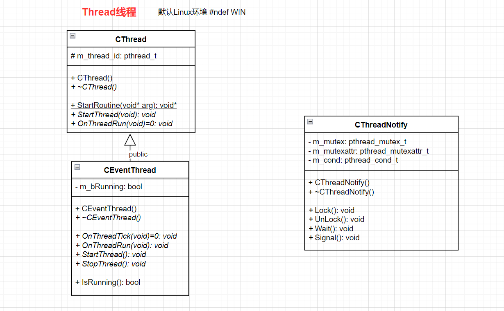
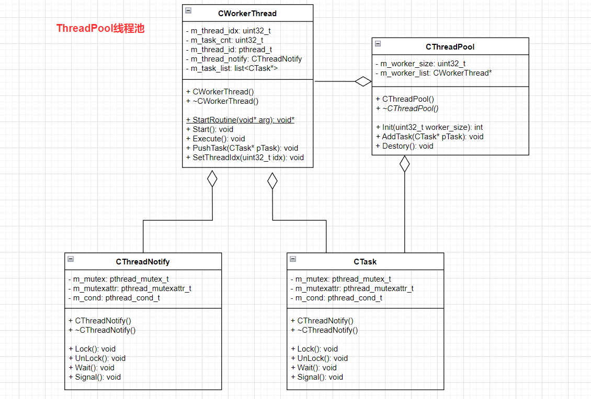

# base目录解析2
---

### 1.Task

```cpp
#ifndef __TASK_H__
#define __TASK_H__

/**
 * CTask类是一个抽象基类，用于表示任务的概念
 * 只能用作其他具体任务类的基类 派生类必须实现run()函数来定义任务的具体逻辑
 * 通过派生类的实现，可以创建不同类型的任务对象，并通过调用run()函数来执行任务的逻辑
 * 
 * 这样的设计允许在任务执行过程中的多态行为，以便针对不同的任务类型执行不同的操作
*/
class CTask {
public:
    CTask(){}
    virtual ~CTask(){}
    
    virtual void run() = 0;
private:
};

#endif
```


### 2.Thread



#### thread.h

```cpp
#ifndef __THREAD_H__
#define __THREAD_H__

#include <pthread.h>

/**
 * CThread的类是一个线程的抽象
 * CThread类提供了一个基本的线程封装，用于创建和管理线程
 * 派生类可以通过实现OnThreadRun()函数来定义线程的具体行为
*/
class CThread {
public:
    CThread();
    virtual ~CThread();

/**
 * 静态函数StartRoutine用于线程的启动
 * 在Windows平台下，它返回DWORD类型
 * 在非Windows平台下，它返回void*类型
 * 函数是用于启动线程的入口点，实际执行的是CThread对象的OnThreadRun()函数
*/
#ifdef _WIN32
    static DWORD WINAPI StartRoutine(LPVOID lpParameter);
#else
    static void* StartRoutine(void* arg);
#endif

	//启动线程StartThread 会创建一个新线程，并将线程的入口点设置为StartRoutine函数
    virtual void StartThread(void);
	//抽象函数，派生类需要实现该函数 以定义线程的具体执行逻辑
    virtual void OnThreadRun(void) = 0;

protected:
#ifdef _WIN32
    DWORD m_thread_id;
#else
    pthread_t m_thread_id;//线程的标识符
#endif
};

/**
 * CEventThread类扩展了基类CThread 并为派生类提供了一个框架 使其可以实现周期性的操作
 * 派生类需要实现OnThreadTick()函数来定义每个周期内的操作
*/
class CEventThread : public CThread {
public:
    CEventThread();
    virtual ~CEventThread();

	//派生类需要实现该函数以定义线程的周期性操作
    virtual void OnThreadTick(void) = 0;
	//重写了基类CThread的OnThreadRun函数
	//在派生类中，OnThreadRun()函数会在线程启动时被调用，并在一个循环中不断调用OnThreadTick()函数
    virtual void OnThreadRun(void);
	//重写了基类CThread的StartThread()函数 用于启动线程并将m_bRunning标志设置为true
    virtual void StartThread();
	//停止线程的执行，并将m_bRunning标志设置为false
    virtual void StopThread();
	//检查线程的运行状态
    bool IsRunning() { return m_bRunning; }
private:
	//标识线程是否正在运行
    bool m_bRunning;
};

/**
 * CThreadNotify的类，用于线程间的通知和同步
 * CThreadNotify类封装了互斥锁和条件变量的操作，提供了简单的接口用于线程的同步和通知
 * 	- 通过调用Lock()和Unlock()来控制对共享资源的访问
 * 	- Wait()等待条件变量的发生
 * 	- Signal()发送条件信号通知等待的线程
*/
class CThreadNotify {
public:
	//初始化类的成员变量和互斥锁
    CThreadNotify();
	//销毁互斥锁和条件变量
    ~CThreadNotify();

	//获取互斥锁 阻塞线程直到成功获取锁
    void Lock() { pthread_mutex_lock(&m_mutex); }
	//释放互斥锁 调用pthread_mutex_unlock来释放互斥锁
    void Unlock() { pthread_mutex_unlock(&m_mutex); }
	//等待条件变量 调用pthread_cond_wait，使线程进入等待状态，直到条件变量被其他线程发出信号
    void Wait() { pthread_cond_wait(&m_cond, &m_mutex); }
	//发送条件信号 调用pthread_cond_signal来发送条件变量的信号，唤醒一个等待的线程
    void Signal() { pthread_cond_signal(&m_cond); }

private:
    pthread_mutex_t m_mutex;//互斥锁 实现对共享资源的互斥访问
    pthread_mutexattr_t m_mutexattr;//互斥锁的属性，使用默认的属性
    pthread_cond_t m_cond;//条件变量，用于线程间的同步和通知
};

#endif
```


#### thread.cpp

```cpp
#include "Thread.h"

////////////////////////////////////////CThread//////////////////////////////////////
CThread::CThread() {
    m_thread_id = 0;
}

CThread::~CThread() { }

/**
 * StartRoutine 作为线程的入口点
 * 根据编译平台的不同，函数的返回类型和参数类型可能会有所不同
 * 
 * 在Windows平台 StartRoutine的返回类型为DWORD 参数类型为LPVOID（相当于void*）
 * 在非Windows平台，返回类型为void*，参数类型为void*
*/
#ifdef _WIN32
DWORD WINAPI CThread::StartRoutine(LPVOID arg)
#else
void* CThread::StartRoutine(void* arg)
#endif
{
	//首先将传递给线程的参数转换为CThread*类型，并将其赋值给pThread变量
    CThread* pThread = (CThread*)arg;
	//调用OnThreadRun()函数
	//OnThreadRun是一个虚函数由派生类实现 在派生类中可以重写OnThreadRun()函数来定义线程的具体行为
    pThread->OnThreadRun();

#ifdef _WIN32
    return 0;//在Windows平台，返回值为0
#else
    return NULL;//在非Windows平台，返回值为NULL
#endif
}


/**
 * StartThread 用于启动线程
 * 根据编译平台的不同，函数使用不同的线程创建方法
*/
void CThread::StartThread() {
#ifdef _WIN32
	//在Windows平台使用CreateThread函数来创建线程
	//函数参数包括 线程属性NULL、堆栈大小0、线程入口点函数StartRoutine 和传递给线程的参数this 创建线程时使用默认的标志0 线程的标识符m_thread_id
    (void)CreateThread(NULL, 0, StartRoutine, this, 0, &m_thread_id);
#else
	//在非Windows平台使用pthread_create函数来创建线程
	//函数参数包括 线程标识符m_thread_id、线程属性NULL、线程入口点函数StartRoutine 和传递给线程的参数 this
    (void)pthread_create(&m_thread_id, NULL, StartRoutine, this);
#endif
}

////////////////////////////////////////CEventThread//////////////////////////////////////
CEventThread::CEventThread() {
    m_bRunning = false;
}

CEventThread::~CEventThread() {
    StopThread();
}

void CEventThread::StartThread() {
    m_bRunning = true;
    CThread::StartThread();
}

void CEventThread::StopThread() {
    m_bRunning = false;
}

/**
 * OnThreadRun 重写了基类CThread的OnThreadRun()函数
 * 在函数中使用一个循环来不断调用OnThreadTick()函数，直到m_bRunning标志为 false 为止
 * 
 * 这样的设计使得线程能够在启动后持续执行指定的操作
 * 每次循环中，调用OnThreadTick函数，该函数是一个纯虚函数 派生类必须实现它以定义每个周期内的操作
*/
void CEventThread::OnThreadRun() {
    while (m_bRunning) OnThreadTick();
}


////////////////////////////////////////CThreadNotify//////////////////////////////////////
/**
 * CThreadNotify构造函数
*/
CThreadNotify::CThreadNotify() {
	//初始化互斥锁属性对象
    pthread_mutexattr_init(&m_mutexattr);
	//设置互斥锁的类型为PTHREAD_MUTEX_RECURSIVE，表示这是一个递归锁允许同一线程多次对锁进行加锁
    pthread_mutexattr_settype(&m_mutexattr, PTHREAD_MUTEX_RECURSIVE);
	//初始化互斥锁 并将属性对象m_mutexattr传递给它，以指定互斥锁的属性。
    pthread_mutex_init(&m_mutex, &m_mutexattr);
	//初始化条件变量 m_cond 并使用默认的属性
    pthread_cond_init(&m_cond, NULL);
}

/**
 * ~CThreadNotify析构函数
*/
CThreadNotify::~CThreadNotify() {
	//销毁互斥锁属性对象 以释放相关资源
    pthread_mutexattr_destroy(&m_mutexattr);
	//销毁互斥锁m_mutex，以释放互斥锁的资源
    pthread_mutex_destroy(&m_mutex);
	//销毁条件变量m_cond，以释放条件变量的资源
    pthread_cond_destroy(&m_cond);
}
```


### 3.ThreadPool

使用现有线程库（pthread.h）实现一个工作线程池，工作线程使用std::list实现任务队列，使用条件变量来解决生产者消费者的竞争问题 



#### threadPool.h

```cpp
#ifndef THREADPOOL_H_
#define THREADPOOL_H_
#include "ostype.h"
#include "Thread.h"
#include "Task.h"
#include <pthread.h>
#include <list>
using namespace std;

/**
 * CWorkerThread类是一个工作线程的实现
*/
class CWorkerThread {
public:
	//初始化工作线程对象
	CWorkerThread();
	//清理工作线程对象
	~CWorkerThread();

	//静态成员函数StartRoutine(void* arg)：作为线程的入口点函数，接受一个参数作为线程的参数
	static void* StartRoutine(void* arg);

	//启动工作线程
	void Start();
	//执行工作线程的任务处理逻辑
	void Execute();
	//将任务对象pTask推入任务队列
	void PushTask(CTask* pTask);
	//设置工作线程的索引
	void SetThreadIdx(uint32_t idx) { m_thread_idx = idx; }

private:
	uint32_t		m_thread_idx;//工作线程的索引
	uint32_t		m_task_cnt;//任务计数，用于跟踪任务的数量
	pthread_t		m_thread_id;//线程标识符
	CThreadNotify	m_thread_notify;//线程通知对象，用于线程同步
	list<CTask*>	m_task_list;//任务队列，存储待处理的任务对象
};

/**
 * CThreadPool类表示线程池，用于管理一组工作线程
*/
class CThreadPool {
public:
	//初始化线程池对象
	CThreadPool();
	//清理线程池对象
	virtual ~CThreadPool();

	//初始化线程池，创建指定数量的工作线程
	int Init(uint32_t worker_size);
	//向线程池添加任务对象
	void AddTask(CTask* pTask);
	//销毁线程池，停止所有工作线程
	void Destory();
private:
	uint32_t 		m_worker_size;//线程池中的工作线程数量
	CWorkerThread* 	m_worker_list;//工作线程对象数组
};

#endif
```

#### threadPool.cpp

```cpp
#include "ThreadPool.h"
#include "util.h"
#include <stdlib.h>

///////////////////////////////////////////CWorkerThread//////////////////////////////////////////
CWorkerThread::CWorkerThread() {
    m_task_cnt = 0;
}

CWorkerThread::~CWorkerThread() {}

/**
 * 将工作线程的执行入口函数StartRoutine 与工作线程对象pThread进行关联
 * 在启动线程时，会调用这个静态成员函数作为线程的入口点，然后在函数中通过工作线程对象调用实际的任务处理逻辑
*/
void* CWorkerThread::StartRoutine(void* arg) {
	//将传入的参数arg转换为CWorkerThread*类型，将其赋值给指针变量pThread
    CWorkerThread* pThread = (CWorkerThread*)arg;
	//调用Execute()函数，该函数用于执行工作线程的任务处理逻辑
	//这个函数是CWorkerThread类的成员函数，会被具体的工作线程对象调用
    pThread->Execute();
    return NULL;
}

void CWorkerThread::Start() {
	//调用pthread_create()函数创建一个新的线程 并将线程标识符存储在成员变量m_thread_id中
	/**
	 * thread_create()函数接受四个参数
	 * @param &m_thread_id 指向线程标识符的指针，用于存储创建的线程的标识符
	 * @param NULL 用于设置默认的线程属性
	 * @param StartRoutine 线程的入口点函数，即静态成员函数StartRoutine
	 * @param this 作为线程的参数 将当前对象的指针传递给线程入口点函数
	*/
    (void)pthread_create(&m_thread_id, NULL, StartRoutine, this);
}

/**
 * 用于实际执行工作线程的任务处理逻辑
 * 使用一个无限循环来表示工作线程的执行过程 循环的每次迭代代表一个任务的处理逻辑
*/
void CWorkerThread::Execute() {
    while (true) {
		// 1.调用m_thread_notify.Lock()来获取线程通知对象的互斥锁，以进行线程同步
        m_thread_notify.Lock();

		// 2.使用while循环检查任务队列m_task_list是否为空
		// 由于存在虚假唤醒的可能性，这里使用while循环而不是if条件语句（惊群效应）
		// 如果任务队列为空，则调用m_thread_notify.Wait()进入等待状态，直到有新任务被添加到队列中并发出通知信号。
        // put wait in while cause there can be spurious wake up (due to signal/ENITR)
        while (m_task_list.empty()) m_thread_notify.Wait();

		// 3.一旦有任务被添加到队列中，会从任务队列的前端取出一个任务对象，并将其从队列中移除
        CTask* pTask = m_task_list.front();
        m_task_list.pop_front();

		// 4.使用m_thread_notify.Unlock()释放线程通知对象的互斥锁，以便其他线程可以访问任务队列
        m_thread_notify.Unlock();

		// 5.调用任务对象的run()函数，执行具体的任务逻辑
        pTask->run();

		// 6.使用delete操作符释放任务对象的内存空间，避免内存泄漏。
        delete pTask;

		// 7.增加任务计数m_task_cnt的值，表示已执行的任务数量
        m_task_cnt++;
        // log("%d have the execute %d task\n", m_thread_idx, m_task_cnt);
    }
}

/**
 * 将任务添加到工作线程的任务队列中，以便工作线程能够按序处理任务
*/
void CWorkerThread::PushTask(CTask* pTask) {
	//调用m_thread_notify.Lock()获取线程通知对象的互斥锁，以进行线程同步
    m_thread_notify.Lock();
	//将任务对象指针pTask添加到任务队列m_task_list的末尾，使用push_back()函数实现
    m_task_list.push_back(pTask);
	//调用m_thread_notify.Signal()发送一个信号给正在等待的工作线程，通知有新任务可用
    m_thread_notify.Signal();
	//调用m_thread_notify.Unlock()释放线程通知对象的互斥锁，以便其他线程可以访问任务队列
    m_thread_notify.Unlock();
}


///////////////////////////////////////////CThreadPool//////////////////////////////////////////
CThreadPool::CThreadPool() {
    m_worker_size = 0;
    m_worker_list = NULL;
}

CThreadPool::~CThreadPool() {}

/**
 * 初始化线程池，创建指定数量的工作线程，并启动它们以准备处理任务
*/
int CThreadPool::Init(uint32_t worker_size) {
    m_worker_size = worker_size;
    m_worker_list = new CWorkerThread[m_worker_size];
    if (!m_worker_list) return 1;

	//使用循环遍历每个工作线程，设置其线程索引 SetThreadIdx(i) 和启动线程 Start()
    for (uint32_t i = 0; i < m_worker_size; i++) {
        m_worker_list[i].SetThreadIdx(i);
        m_worker_list[i].Start();
    }

    return 0;
}

void CThreadPool::Destory() {
    if (m_worker_list) delete[] m_worker_list;
}

/**
 * 向线程池中的工作线程添加任务
 * 选择一个随机的工作线程来添加任务
 * 这样可以平均分配任务负载，避免某个工作线程一直处理大量任务而其他工作线程处于空闲状态
 * 
 * 也可以根据具体的需求采用其他任务分配策略，例如选择任务最少的工作线程来添加任务
*/
void CThreadPool::AddTask(CTask* pTask) {
	//通过random() % m_worker_size生成一个随机数，范围在0到m_worker_size-1之间，用于选择一个随机的工作线程索引
    uint32_t thread_idx = random() % m_worker_size;
	//使用选定的线程索引thread_idx访问线程池中的对应工作线程对象m_worker_list[thread_idx]
	//调用选定的工作线程对象的PushTask(pTask)函数，将任务对象指针pTask添加到该工作线程的任务队列中
	//选定的工作线程将在适当的时候从任务队列中获取任务并执行
    m_worker_list[thread_idx].PushTask(pTask);
}
```


### 4.HttpParser

http解析实际上是利用了ngnix的http_parse解析库，http_parse为HTTP解析器定义了HTTP解析器的结构体、枚举值和相关函数的声明

头文件提供了HTTP解析器的相关声明和常量定义，可以在其他源文件中包含该头文件以使用HTTP解析器功能。

- 定义了`http_parser`结构体，表示HTTP解析器的状态和相关信息。
- 定义了`http_parser_settings`结构体，用于设置HTTP解析器的回调函数。
- 定义了`http_method`枚举，表示HTTP请求方法。
- 定义了一些常量，如HTTP解析器的版本号、最大报文头大小等。
- 定义了一些错误码的枚举值和错误相关的宏。
- 声明了HTTP解析器的相关操作函数：提供了对HTTP解析器的初始化、执行解析、获取解析结果等功能
    - unsigned long http_parser_version(void)`：获取HTTP解析器的版本号
    - void http_parser_init(http_parser *parser, enum http_parser_type type)`：初始化HTTP解析器
    - size_t http_parser_execute(http_parser *parser, const http_parser_settings *settings, const char *data, size_t len)`：执行HTTP解析器，解析给定的数据
    - int http_should_keep_alive(const http_parser *parser)`：检查解析器是否应保持连接
    - const char *http_method_str(enum http_method m)`：将给定的HTTP方法枚举值转换为字符串表示。
    - const char *http_errno_name(enum http_errno err)：返回给定错误码的名称。
    - const char *http_errno_description(enum http_errno err)`：返回给定错误码的描述。
    - int http_parser_parse_url(const char *buf, size_t buflen, int is_connect, struct http_parser_url *u)`：解析URL，并填充`http_parser_url`结构体。
    - void http_parser_pause(http_parser *parser, int paused)`：暂停或恢复解析器的解析过程。
    - int http_body_is_final(const http_parser *parser)`：检查当前报文体是否为最后一个块。

### 5.HttpParserWrapper

#### HttpParserWrapper.h

```cpp
#ifndef http_msg_server_HttpParserWrapper_h
#define http_msg_server_HttpParserWrapper_h

#include "util.h"
#include "http_parser.h"

/**
 * CHttpParserWrapper类 封装了一个HTTP请求解析器 封装HTTP请求解析的逻辑
 * 通过调用ParseHttpContent()方法来解析HTTP内容，并使用其他成员函数来获取解析结果
 * extract url and content body from an ajax request
*/
class CHttpParserWrapper {
public:
    //构造函数，用于初始化解析器和成员变量
    CHttpParserWrapper();
    //虚析构函数
    virtual ~CHttpParserWrapper() {}
    
    //解析HTTP内容，接受一个指向缓冲区的指针和长度作为参数
    void ParseHttpContent(const char* buf, uint32_t len);
    
    //用于检查特定字段或内容是否已读取
    bool IsReadAll() { return m_read_all; }
    bool IsReadReferer() { return m_read_referer; }
    bool HasReadReferer() { return m_referer.size() > 0; }

    bool IsReadForwardIP() { return m_read_forward_ip; }
    bool HasReadForwardIP() { return m_forward_ip.size() > 0; }

    bool IsReadUserAgent() { return m_read_user_agent; }
    bool HasReadUserAgent() { return m_user_agent.size() > 0; }

    bool IsReadContentType() { return m_read_content_type;  }
    bool HasReadContentType() { return m_content_type.size() > 0; }

    bool IsReadContentLen()  { return m_read_content_len; }
    bool HasReadContentLen() { return m_content_len != 0; }

    bool IsReadHost()  { return m_read_host;  }
    bool HasReadHost() { return m_host.size()>0; }

    //一系列的Getxxx()函数用于获取已读取的字段或内容的值
    uint32_t GetTotalLength() { return m_total_length; }
    char* GetUrl() { return (char*)m_url.c_str(); }
    char* GetBodyContent() { return (char*)m_body_content.c_str(); }
    uint32_t GetBodyContentLen() { return (uint32_t)m_body_content.length(); }
    char* GetReferer() { return (char*)m_referer.c_str(); }
    char* GetForwardIP() { return (char*)m_forward_ip.c_str(); }
    char* GetUserAgent() { return (char*)m_user_agent.c_str(); }
    char GetMethod() { return (char) m_http_parser.method; }
    char* GetContentType() { return (char*) m_content_type.c_str(); }
    uint32_t  GetContentLen() { return m_content_len; }
    char* GetHost() { return (char*) m_host.c_str(); }
    
    //一系列的Setxxx()函数用于设置字段或内容的值
    void SetUrl(const char* url, size_t length) { m_url.append(url, length); }
    void SetReferer(const char* referer, size_t length) { m_referer.append(referer, length); }
    void SetForwardIP(const char* forward_ip, size_t length) { m_forward_ip.append(forward_ip, length); }
    void SetUserAgent(const char* user_agent, size_t length) { m_user_agent.append(user_agent, length); }
    void SetBodyContent(const char* content, size_t length) { m_body_content.append(content, length); }
    void SetContentType(const char* content_type, size_t length) {  m_content_type.append(content_type, length); }
    void SetContentLen(uint32_t content_len) { m_content_len = content_len; }
    void SetTotalLength(uint32_t total_len) { m_total_length = total_len; }
    void SetHost(const char* host, size_t length) { m_host.append(host, length); }
    void SetReadAll() { m_read_all = true; }
    void SetReadReferer(bool read_referer) { m_read_referer = read_referer; }
    void SetReadForwardIP(bool read_forward_ip) { m_read_forward_ip = read_forward_ip; }
    void SetReadUserAgent(bool read_user_agent) { m_read_user_agent = read_user_agent; }
    void SetReadContentType(bool read_content_type) { m_read_content_type =  read_content_type; }
    void SetReadContentLen(bool read_content_len) { m_read_content_len = read_content_len; }
    void SetReadHost(bool read_host) { m_read_host = read_host; }

    //HTTP解析器的回调函数，用于处理解析过程中的不同事件
    static int OnUrl(http_parser* parser, const char *at, size_t length, void* obj);
    static int OnHeaderField(http_parser* parser, const char *at, size_t length, void* obj);
    static int OnHeaderValue(http_parser* parser, const char *at, size_t length, void* obj);
    static int OnHeadersComplete (http_parser* parser, void* obj);
    static int OnBody (http_parser* parser, const char *at, size_t length, void* obj);
    static int OnMessageComplete (http_parser* parser, void* obj);

private:

private:
    http_parser m_http_parser;//HTTP解析器对象，用于解析HTTP请求
    http_parser_settings m_settings;//HTTP解析器的设置，包含回调函数等配置信息

    //bool类型的成员变量用于标记是否已读取特定的HTTP字段或内容
    bool m_read_all;//是否已读取全部的字段
    bool m_read_referer;//是否已读取Referer字段
    bool m_read_forward_ip;//是否已读取Forward IP字段
    bool m_read_user_agent;//是否已读取User-Agent字段
    bool m_read_content_type;//是否已读取Content-Type字段
    bool m_read_content_len;//是否已读取Content-Length字段
    bool m_read_host;//是否已读取Host字段

    uint32_t m_total_length;//HTTP请求的总长度
    string	m_url;//请求的URL
    string	m_body_content;//请求的消息体内容
    string	m_referer;//Referer字段的值，表示请求的来源
    string m_forward_ip;//请求经过的代理服务器的IP
    string m_user_agent;//发起请求的用户代理(浏览器、应用程序等)
    string m_content_type;//请求消息体的类型
    uint32_t  m_content_len;//请求消息体的长度
    string m_host;//请求的目标主机
};

#endif
```


#### HttpParserWrapper.cpp

```cpp
#include "HttpParserWrapper.h"
#include "http_parser.h"

#define MAX_REFERER_LEN 32

CHttpParserWrapper::CHttpParserWrapper() { }

void CHttpParserWrapper::ParseHttpContent(const char* buf, uint32_t len) {
    //初始化 m_http_parser 和 m_settings 对象
    http_parser_init(&m_http_parser, HTTP_REQUEST);
    memset(&m_settings, 0, sizeof(m_settings));

    //设置解析器的回调函数
    m_settings.on_url = OnUrl;
    m_settings.on_header_field = OnHeaderField;
    m_settings.on_header_value = OnHeaderValue;
    m_settings.on_headers_complete = OnHeadersComplete;
    m_settings.on_body = OnBody;
    m_settings.on_message_complete = OnMessageComplete;

    //将当前对象的指针设置为 m_settings 的 object 字段，以便在回调函数中可以访问到当前对象的成员变量和方法
    m_settings.object = this;

    //重置解析器相关的标志和成员变量，包括是否已读取全部字段
    m_read_all = false;
    m_read_referer = false;
    m_read_forward_ip = false;
    m_read_user_agent = false;
    m_read_content_type = false;
    m_read_content_len = false;
    m_read_host = false;
    m_total_length = 0;
    m_url.clear();
    m_body_content.clear();
    m_referer.clear();
    m_forward_ip.clear();
    m_user_agent.clear();
    m_content_type.clear();
    m_content_len = 0;
    m_host.clear();

    //调用 http_parser_execute 函数
    //传入解析器、设置、HTTP内容的缓冲区 buf 和长度 len参数 该函数会根据设置的回调函数逐步解析 HTTP 内容
    http_parser_execute(&m_http_parser, &m_settings, buf, len);
}

/**
 * 在解析HTTP请求的URL时，该函数将解析得到的URL字符串设置到 CHttpParserWrapper 对象的成员变量中
 * 这样解析器在解析完整个 URL 后，就可以通过调用 GetUrl() 方法来获取解析得到的 URL 字符串
*/
int CHttpParserWrapper::OnUrl(http_parser* parser, const char* at, size_t length, void* obj) {
    //将解析得到的 URL 字符串 at（指针）和长度 length 作为参数传入
    //将 URL 字符串设置到 CHttpParserWrapper 对象的成员变量 m_url 中
    ((CHttpParserWrapper*)obj)->SetUrl(at, length);
    return 0;
}

/**
 * 在解析HTTP头部字段时，会根据字段名称判断是否需要读取该字段的值，并设置相应的标志位
*/
int CHttpParserWrapper::OnHeaderField(http_parser* parser, const char* at, size_t length, void* obj) {
    //检查是否已经读取过 Referer 字段
    if (!((CHttpParserWrapper*)obj)->HasReadReferer()) {
        //如果还未读取，并且当前字段的名称是 "Referer"，则将读取Referer标志位设置为 true
        if (strncasecmp(at, "Referer", 7) == 0) {
            ((CHttpParserWrapper*)obj)->SetReadReferer(true);
        }
    }

    //检查是否已经读取过 X-Forwarded-For 字段
    if (!((CHttpParserWrapper*)obj)->HasReadForwardIP()) {
        //如果还未读取，并且当前字段的名称是 "X-Forwarded-For"，则将读取 X-Forwarded-For 标志位设置为 true
        if (strncasecmp(at, "X-Forwarded-For", 15) == 0) {
            ((CHttpParserWrapper*)obj)->SetReadForwardIP(true);
        }
    }

    //检查是否已经读取过 User-Agent 字段
    if (!((CHttpParserWrapper*)obj)->HasReadUserAgent()) {
        //如果还未读取，并且当前字段的名称是 "User-Agent"，则将读取 User-Agent 标志位设置为 true
        if (strncasecmp(at, "User-Agent", 10) == 0) {
            ((CHttpParserWrapper*)obj)->SetReadUserAgent(true);
        }
    }

    //检查是否已经读取过 Content-Type 字段
    if (!((CHttpParserWrapper*)obj)->HasReadContentType()) {
        //如果还未读取，并且当前字段的名称是 "Content-Type"，则将读取 Content-Type 标志位设置为 true
        if (strncasecmp(at, "Content-Type", 12) == 0) {
            ((CHttpParserWrapper*)obj)->SetReadContentType(true);
        }
    }

    //检查是否已经读取过 Content-Length 字段
    if (!((CHttpParserWrapper*)obj)->HasReadContentLen()) {
        //如果还未读取，并且当前字段的名称是 "Content-Length"，则将读取 Content-Length 标志位设置为 true
        if (strncasecmp(at, "Content-Length", 14) == 0) {
            ((CHttpParserWrapper*)obj)->SetReadContentLen(true);
        }
    }

    //检查是否已经读取过 Host 字段
    if (!((CHttpParserWrapper*)obj)->HasReadHost()) {
        //如果还未读取，并且当前字段的名称是 "Host"，则将读取 Host 标志位设置为 true
        if (strncasecmp(at, "Host", 4) == 0) {
            ((CHttpParserWrapper*)obj)->SetReadHost(true);
        }
    }
    return 0;
}

/**
 * 该函数在解析器解析到请求头的值时进行回调
*/
int CHttpParserWrapper::OnHeaderValue(http_parser* parser, const char* at, size_t length, void* obj) {
    //判断是否需要解析 Referer 字段
    if (((CHttpParserWrapper*)obj)->IsReadReferer()) {
        size_t referer_len = (length > MAX_REFERER_LEN) ? MAX_REFERER_LEN : length;
        //如果需要 则将请求头值的内容（at）以最大长度 MAX_REFERER_LEN（如果长度超过该限制）或实际长度作为参数调用 SetReferer 方法
        ((CHttpParserWrapper*)obj)->SetReferer(at, referer_len);
        //将解析到的 Referer 值设置到 m_referer 成员变量中，并将 m_read_referer 设置为 false，表示已读取完 Referer 字段
        ((CHttpParserWrapper*)obj)->SetReadReferer(false);
    }

    //判断是否需要解析 ForwardIP 字段
    if (((CHttpParserWrapper*)obj)->IsReadForwardIP()) {
        //将请求头值的内容（at）以实际长度作为参数调用 SetForwardIP 方法，将解析到的 ForwardIP 值设置到 m_forward_ip 成员变量中
        ((CHttpParserWrapper*)obj)->SetForwardIP(at, length);
        //将m_read_forward_ip 设置为 false，表示已读取完 ForwardIP 字段
        ((CHttpParserWrapper*)obj)->SetReadForwardIP(false);
    }

    //判断是否需要解析 User-Agent 字段
    if (((CHttpParserWrapper*)obj)->IsReadUserAgent()) {
        //将请求头值的内容（at）以实际长度作为参数调用 SetUserAgent 方法，将解析到的 User-Agent 值设置到 m_user_agent 成员变量中
        ((CHttpParserWrapper*)obj)->SetUserAgent(at, length);
        //将 m_read_user_agent 设置为 false，表示已读取完 User-Agent 字段
        ((CHttpParserWrapper*)obj)->SetReadUserAgent(false);
    }

    //判断是否需要解析 Content-Type 字段
    if (((CHttpParserWrapper*)obj)->IsReadContentType()) {
        //将请求头值的内容（at）以实际长度作为参数调用 SetContentType 方法，将解析到的 Content-Type 值设置到 m_content_type 成员变量中
        ((CHttpParserWrapper*)obj)->SetContentType(at, length);
        //将 m_read_content_type 设置为 false，表示已读取完 Content-Type 字段
        ((CHttpParserWrapper*)obj)->SetReadContentType(false);
    }

    //判断是否需要解析 Content-Length 字段
    if (((CHttpParserWrapper*)obj)->IsReadContentLen()) {
        string strContentLen(at, length);
        //将请求头值的内容（at）转换为字符串，并使用 atoi 函数将其转换为整数类型，将解析到的 Content-Length 值设置到 m_content_len 成员变量中
        ((CHttpParserWrapper*)obj)->SetContentLen(atoi(strContentLen.c_str()));
        //将m_read_content_len设置为false，表示已读取完Content-Length字段
        ((CHttpParserWrapper*)obj)->SetReadContentLen(false);
    }

    //判断是否需要解析 Host 字段
    if (((CHttpParserWrapper*)obj)->IsReadHost()) {
        //将请求头值的内容（at）以实际长度作为参数调用 SetHost 方法，将解析到的 Host 值设置到 m_host 成员变量中
        ((CHttpParserWrapper*)obj)->SetHost(at, length);
        //将 m_read_host 设置为 false，表示已读取完 Host 字段
        ((CHttpParserWrapper*)obj)->SetReadHost(false);
    }
    return 0;
}

/**
 * 该函数在解析器完成解析请求头时进行回调
 * 目的是在解析器完成解析请求头时更新 CHttpParserWrapper 对象的状态，将解析到的请求头的总长度保存起来
*/
int CHttpParserWrapper::OnHeadersComplete(http_parser* parser, void* obj) {
    //将obj转换为CHttpParserWrapper*类型，并调用SetTotalLength方法，将解析到的请求头的总长度设置到 m_total_length 成员变量中
    ((CHttpParserWrapper*)obj)->SetTotalLength(parser->nread + (uint32_t)parser->content_length);
    return 0;
}

/**
 * 该函数在解析器解析消息体时进行回调
 * 这个回调函数的目的是在解析器解析消息体时更新 CHttpParserWrapper 对象的状态
 * 将解析到的消息体内容保存起来
*/
int CHttpParserWrapper::OnBody(http_parser* parser, const char* at, size_t length, void* obj) {
    //将obj转换为CHttpParserWrapper*类型，并调用SetBodyContent(at, length)方法，将解析到的消息体内容设置到m_body_content成员变量中
    ((CHttpParserWrapper*)obj)->SetBodyContent(at, length);
    return 0;
}

/**
 * 该函数在解析器完成解析整个消息时进行回调
*/
int CHttpParserWrapper::OnMessageComplete(http_parser* parser, void* obj) {
    //将obj转换为CHttpParserWrapper*类型，并调用SetReadAll()方法，将m_read_all标志设置为 true，表示已读取了全部字段
    ((CHttpParserWrapper*)obj)->SetReadAll();
    return 0;
}
```


### 6.HttpClient

HttpClient利用<font color='#BAOC2F'>curl库</font>和<font color='#BAOC2F'>jsoncpp</font>实现了<font color='#BAOC2F'>http客户端Get/Post和语音数据的上传下载</font>，

- 关于`#include <curl/curl.h>`引入的curl库：

CURL（Client for URLs）是一个开源的<font color='#BAOC2F'>用于传输数据的库</font>，支持多种协议HTTP、FTP、SMTP等。它提供了一组丰富的功能和接口，用于进行网络通信和数据传输操作。在C语言程序中使用CURL库，可以实现各种网络操作如发送HTTP请求、下载文件、上传文件、处理网络数据等。CURL库提供了丰富的选项和配置，允许开发者进行高度定制和灵活控制网络通信过程。

#### HttpClient.h

```cpp
#ifndef __HTTP_CURL_H__
#define __HTTP_CURL_H__

#include <string>
#include <curl/curl.h>
#include "public_define.h"

/**
 * CHttpClient 类提供了一些HTTP客户端的功能
*/
class CHttpClient {
public:
    CHttpClient(void);
    ~CHttpClient(void);
public:
    //发送HTTP POST请求，并返回CURLcode类型的结果代码
    CURLcode Post(const string & strUrl, const string & strPost, string & strResponse);
    //发送HTTP GET请求，并返回CURLcode类型的结果代码
    CURLcode Get(const string & strUrl, string & strResponse);
    //上传字节文件到指定URL，并返回服务器的响应字符串
    string UploadByteFile(const string &url, void* data, int data_len);
    //从指定URL下载字节文件，并将下载的数据存储在AudioMsgInfo对象中
    bool DownloadByteFile(const string &url, AudioMsgInfo* pAudioMsg);
};

#endif
```

#### HttpClient.cpp

```cpp
#include "HttpClient.h"
#include "util.h"
#include "json/json.h"
#include <string>
using namespace std;

/**
 * @brief 用于CURL库回调的写入数据
 * 在使用CURL库进行数据接收时，可以通过设置回调函数为 write_data_string，将接收到的数据保存到 string 对象中
 * @param ptr 指向接收到的数据的指针
 * @param size 每个数据块的大小
 * @param nmemb 数据块的数量
 * @param userp 用户指针，通常用于传递额外的数据或对象
 * @return 
*/ 
size_t write_data_string(void* ptr, size_t size, size_t nmemb, void* userp) {
    size_t len = size * nmemb;
    //函数将接收到的数据拼接到 userp 指向的 string 对象中，并返回已写入的数据大小 len
    string* response = (string*)userp;
    response->append((char*)ptr, len);
    return len;
}

/**
 * @brief 用于 CURL 库回调的写入数据函数
 * 通过设置回调函数为 write_data_binary，将接收到的二进制数据保存到指定的数据结构中 如 AudioMsgInfo 对象
 * @param ptr 指向接收到的数据的指针
 * @param size 每个数据块的大小
 * @param nmemb 数据块的数量
 * @param pAudio 指向 AudioMsgInfo 对象的指针，该对象用于存储音频消息的相关信息
 * @return 
*/
size_t write_data_binary(void* ptr, size_t size, size_t nmemb, AudioMsgInfo* pAudio) {
    size_t nLen = size * nmemb;
    //检查是否超过了预设的文件大小限制，避免数据溢出
    if (pAudio->data_len + nLen <= pAudio->fileSize + 4) {
        //函数将接收到的二进制数据拷贝到 pAudio 对象的 data 缓冲区中
        memcpy(pAudio->data + pAudio->data_len, ptr, nLen);
        //并更新 pAudio 对象的 data_len 字段以跟踪已接收的数据长度
        pAudio->data_len += nLen;
    }
    return nLen;
}


CHttpClient::CHttpClient(void) { }

CHttpClient::~CHttpClient(void) { }

/// @brief 静态函数用作 CURL 库的回调函数 用于接收数据并将其保存到字符串对象中
/// @param buffer 指向接收到的数据的指针
/// @param size 每个数据块的大小
/// @param nmemb 数据块的数量
/// @param lpVoid 指向 string 对象的指针，用于保存接收到的数据
/// @return 
static size_t OnWriteData(void* buffer, size_t size, size_t nmemb, void* lpVoid) {
    //将lpVoid强制转换为string*类型
    string* str = dynamic_cast<string*>((string*)lpVoid);
    if (NULL == str || NULL == buffer) return -1;

    //将buffer中的数据以 size*nmemb 的长度追加到 string 对象中
    char* pData = (char*)buffer;
    str->append(pData, size * nmemb);

    //返回 nmemb 表示成功接收到的数据块数量
    return nmemb;
}

/// @brief Post 函数实现，用于发送 POST 请求并接收响应数据
/// @param strUrl POST 请求的 URL
/// @param strPost POST 请求的数据
/// @param strResponse 保存接收到的响应数据的字符串
/// @return 
CURLcode CHttpClient::Post(const string& strUrl, const string& strPost, string& strResponse) {
    CURLcode res;
    //1.初始化一个CURL句柄curl
    CURL* curl = curl_easy_init();
    if (NULL == curl) return CURLE_FAILED_INIT;

    //2.为curl设置各种选项
    curl_easy_setopt(curl, CURLOPT_URL, strUrl.c_str());//设置请求的 URL
    curl_easy_setopt(curl, CURLOPT_FORBID_REUSE, 1);//禁止重用连接
    curl_easy_setopt(curl, CURLOPT_POST, 1);//启用 POST 请求
    curl_easy_setopt(curl, CURLOPT_POSTFIELDS, strPost.c_str());//设置 POST 请求的数据

    curl_easy_setopt(curl, CURLOPT_READFUNCTION, NULL);//不使用自定义的读取数据方式
    //不使用自定义的读取数据方式 意味着该 POST 请求不需要发送任何请求体数据，而是只需要接收服务器的响应数据
    curl_easy_setopt(curl, CURLOPT_WRITEFUNCTION, OnWriteData);//设置写数据回调函数为 OnWriteData
    curl_easy_setopt(curl, CURLOPT_WRITEDATA, (void*)&strResponse);//设置写数据回调函数的用户数据为 strResponse

    curl_easy_setopt(curl, CURLOPT_NOSIGNAL, 1);//禁止使用信号进行超时处理
    curl_easy_setopt(curl, CURLOPT_CONNECTTIMEOUT, 3);//设置连接超时时间
    curl_easy_setopt(curl, CURLOPT_TIMEOUT, 3);//设置请求超时时间

    //3.调用curl_easy_perform执行请求，并将返回的结果保存在 res 变量中
    res = curl_easy_perform(curl);

    //4.使用curl_easy_cleanup清理 curl 句柄
    curl_easy_cleanup(curl);

    //5.返回结果 res
    return res;
}

/// @brief 使用libcurl库执行 HTTP GET 请求
/// @param strUrl 要发送HTTP请求的URL
/// @param strResponse 保存HTTP响应的内容
/// @return 
CURLcode CHttpClient::Get(const string& strUrl, string& strResponse) {
    // 1.CURLcode这是一个枚举类型，表示 CURL 库的操作结果
    CURLcode res;

    // 2.初始化 libcurl 库，并返回一个指向 CURL 对象的指针
    CURL* curl = curl_easy_init();
    if (NULL == curl) return CURLE_FAILED_INIT;

    // 3.设置 CURL 对象的选项
    curl_easy_setopt(curl, CURLOPT_URL, strUrl.c_str());//设置请求的 URL
    curl_easy_setopt(curl, CURLOPT_READFUNCTION, NULL);//指定读取数据的回调函数 NULL，表示不使用读取回调函数
    curl_easy_setopt(curl, CURLOPT_FORBID_REUSE, 1);//禁用连接的重用 确保每次请求都使用新的连接

    curl_easy_setopt(curl, CURLOPT_WRITEFUNCTION, OnWriteData);//指定写入数据的回调函数
    curl_easy_setopt(curl, CURLOPT_WRITEDATA, (void*)&strResponse);//指定写入回调函数中的用户数据
    /**
     * 当多个线程都使用超时处理的时候，同时主线程中有sleep或是wait等操作
     * 如果不设置这个选项，libcurl将会发信号打断这个wait从而导致程序退出
     */
    curl_easy_setopt(curl, CURLOPT_NOSIGNAL, 1);//在多线程环境中避免使用信号处理函数
    curl_easy_setopt(curl, CURLOPT_CONNECTTIMEOUT, 3);//设置连接超时时间 s秒
    curl_easy_setopt(curl, CURLOPT_TIMEOUT, 3);//设置请求超时时间 s秒

    //4.调用curl_easy_perform执行请求，并将返回的结果保存在 res 变量中
    res = curl_easy_perform(curl);

    //5.使用curl_easy_cleanup清理 curl 句柄
    curl_easy_cleanup(curl);

    //6.返回结果 res
    return res;
}

/// @brief 将字节数据上传到指定的 URL 地址
/// @param strUrl 要发送 GET 请求的 URL 地址 
/// @param pData 指向要上传的二进制数据的指针
/// @param nSize 要上传的二进制数据的大小 
/// @return String 返回上传成功后的URL
string CHttpClient::UploadByteFile(const string& strUrl, void* pData, int nSize) {
    // strUrl为空直接返回空字符串
    if (strUrl.empty()) return "";

    // 1.初始化一个CURL对象
    CURL* curl = curl_easy_init();
    if (!curl) return "";

    // 2.创建一个curl_slist结构体指针headerlist，用于存储 HTTP 请求的头部信息
    struct curl_slist* headerlist = NULL;
    // 添加了一个头部信息
    headerlist = curl_slist_append(headerlist, "Content-Type: multipart/form-data; boundary=WebKitFormBoundary8riBH6S4ZsoT69so");

    // 3.设置 CURL 对象的选项
    // what URL that receives this POST
    curl_easy_setopt(curl, CURLOPT_HTTPHEADER, headerlist);//上述头部信息 headerlist 设置给CURL对象
    curl_easy_setopt(curl, CURLOPT_URL, strUrl.c_str());//指定要发送请求的 URL
    //curl_easy_setopt(curl, CURLOPT_POST, 1);
    curl_easy_setopt(curl, CURLOPT_VERBOSE, 1L); // enable verbose for easier tracing

    // 4.构建请求体body，包括边界标识和文件数据
    string body = "--WebKitFormBoundary8riBH6S4ZsoT69so\r\nContent-Disposition: form-data; name=\"file\"; filename=\"1.audio\"\r\nContent-Type:image/jpg\r\n\r\n";
    // 这里的请求体是一个多部分表单数据，其中包含一个名为 "file" 的表单字段，其值为字节数据
    // 在请求体的最后添加了一个结束标识。
    body.append((char*)pData, nSize); // image buffer
    string str = "\r\n--WebKitFormBoundary8riBH6S4ZsoT69so--\r\n\r\n";
    body.append(str.c_str(), str.size());

    // post binary data
    curl_easy_setopt(curl, CURLOPT_POSTFIELDS, body.c_str());//将请求体数据设置给 CURL 对象
    // set the size of the postfields data
    curl_easy_setopt(curl, CURLOPT_POSTFIELDSIZE, body.size());//指定请求体数据的大小

    // 5.创建一个空字符串 strResp，用于接收服务器的响应数据
    string strResp;
    curl_easy_setopt(curl, CURLOPT_WRITEFUNCTION, write_data_string);//指定一个写入回调函数 write_data_string
    curl_easy_setopt(curl, CURLOPT_WRITEDATA, &strResp);//将strResp的地址传递给写入回调函数，以便在回调函数中操作strResp
    curl_easy_setopt(curl, CURLOPT_NOPROGRESS, 1L);//禁用进度条显示

    // 6.用curl_easy_perform函数执行HTTP请求，并将返回结果保存在res变量中
    // Perform the request, res will get the return code
    CURLcode res = curl_easy_perform(curl);

    // 7.清理并释放CURL对象
    curl_easy_cleanup(curl);

    // 8.检查请求是否成功，如果res不等于CURLE_OK，则输出错误日志并返回空字符串
    if (CURLE_OK != res) {
        log_error("curl_easy_perform failed, res=%d", res);
        return "";
    }

    // 9.使用Json::Reader解析strResp字符串为 Json::Value对象，以便进一步处理服务器返回的JSON 数据
    // upload 返回的json格式不一样，要特殊处理
    Json::Reader reader;
    Json::Value value;
    // 9-1.检查解析结果，如果解析失败或者返回的JSON中没有error_code字段，则输出错误日志并返回空字符串
    if (!reader.parse(strResp, value)) {
        log_error("json parse failed: %s", strResp.c_str());
        return "";
    }
    if (value["error_code"].isNull()) {
        log_error("no code in response %s", strResp.c_str());
        return "";
    }

    // 9-2.检查返回的错误码 nRet，如果不等于0 则输出错误日志并返回空字符串
    uint32_t nRet = value["error_code"].asUInt();
    if (nRet != 0) {
        log_error("upload faile:%u", nRet);
        return "";
    }

    // 9-3.如果以上条件都满足说明上传成功，返回从JSON中提取的URL
    return value["url"].asString();
}

/// @brief 用于从指定的URL下载字节文件
/// @param url 要下载的文件的URL地址
/// @param pAudioMsg 指向AudioMsgInfo结构体的指针，用于存储下载的字节数据
/// @return 
bool CHttpClient::DownloadByteFile(const string& url, AudioMsgInfo* pAudioMsg) {
    // 1.初始化libcurl
    CURL* curl = curl_easy_init();
    if (!curl) return false;

    // 2.设置curl对象
    curl_easy_setopt(curl, CURLOPT_URL, url.c_str());//设置下载的URL地址
    curl_easy_setopt(curl, CURLOPT_TIMEOUT, 2);//设置超时时间
    curl_easy_setopt(curl, CURLOPT_NOSIGNAL, 1L);//禁止使用信号处理
    curl_easy_setopt(curl, CURLOPT_FORBID_REUSE, 1);//禁止重用连接

    curl_easy_setopt(curl, CURLOPT_WRITEFUNCTION, write_data_binary);//设置回调函数，用于处理下载的字节数据
    curl_easy_setopt(curl, CURLOPT_WRITEDATA, pAudioMsg);//设置回调函数的用户参数，用于存储下载的字节数据

    // 3.执行下载操作
    CURLcode res = curl_easy_perform(curl);

    // 4.获取下载的HTTP响应状态码
    int retcode = 0;
    res = curl_easy_getinfo(curl, CURLINFO_RESPONSE_CODE, &retcode);
    if (CURLE_OK != res || retcode != 200) {
        log_error("curl_easy_perform failed, res=%d, ret=%u", res, retcode);
    }

    // 5.获取下载的文件大小
    double nLen = 0;
    res = curl_easy_getinfo(curl, CURLINFO_CONTENT_LENGTH_DOWNLOAD, &nLen);

    // 6.清理libcurl资源
    curl_easy_cleanup(curl);

    // 7.验证下载的文件大小是否与预期一致
    if (nLen != pAudioMsg->fileSize) return false;
    return true;
}
```


### 7.public_define.h

```cpp
typedef struct AudioMsgInfo{
    uint32_t    audioId;
    uint32_t    fileSize;
    uint32_t    data_len;
    uchar_t*    data;
    string      path;
    
} AudioMsgInfo_t;

/**
 * 结构体可以用来表示用户的基本信息
 * 并通过赋值运算符重载函数实现对象之间的赋值操作
*/
typedef struct DBUserInfo_t {
    /* 成员变量 */
    uint32_t nId;//用户ID
    uint8_t nSex;// 用户性别 1.男;2.女
    uint8_t nStatus; // 用户状态0 正常， 1 离职
    uint32_t nDeptId;// 所属部门
    string strNick;// 花名
    string strDomain;// 花名拼音
    string strName;// 真名
    string strTel;// 手机号码
    string strEmail;// Email
    string strAvatar;// 头像
    string sign_info;//个性签名

    /* 赋值运算符重载函数 用于DBUserInfo_t对象之间的赋值操作 */
    DBUserInfo_t& operator=(const DBUserInfo_t& rhs) {
        /* 避免自我赋值 */
        if(this != &rhs) {
            nId = rhs.nId;
            nSex = rhs.nSex;
            nStatus = rhs.nStatus;
            nDeptId = rhs.nDeptId;
            strNick = rhs.strNick;
            strDomain = rhs.strDomain;
            strName = rhs.strName;
            strTel = rhs.strTel;
            strEmail = rhs.strEmail;
            strAvatar = rhs.strAvatar;
            sign_info = rhs.sign_info;
        }
        return *this;
    }
} DBUserInfo_t;

typedef hash_map<uint32_t, DBUserInfo_t*> DBUserMap_t;


/**
 * 结构体可以用于存储部门的基本信息
 * 并通过赋值运算符重载函数实现对象之间的赋值操作
*/
typedef struct DBDeptInfo_t {
    /* 成员变量 */
    uint32_t nId;
    uint32_t nParentId;
    string strName;
    
    /* 赋值运算符重载函数 用于DBDeptInfo_t对象之间的赋值操作 */
    DBDeptInfo_t& operator=(const DBDeptInfo_t& rhs) {
        /* 避免自我赋值 */
        if(this != &rhs) {
            nId = rhs.nId;
            nParentId = rhs.nParentId;
            strName = rhs.strName;
        }
        return *this;
    }
    
} DBDeptInfo_t;

typedef hash_map<uint32_t, DBDeptInfo_t*> DBDeptMap_t;


/**
 * user_conn_t 用于表示用户连接信息
 * 方便地记录用户的连接情况，并对连接数量进行统计和处理
*/
typedef struct {
    uint32_t 	user_id;//用户id
    uint32_t	conn_cnt;//连接数量
} user_conn_t;

/**
 * user_stat_t 用于存储用户的状态信息
*/
typedef struct {
    uint32_t user_id;//用户ID
    uint32_t status;//用户状态
    uint32_t client_type;//登录客户端类型
} user_stat_t;

/**
 * auth_struct 表示授权信息
 * 通过使用 auth_struct 结构体，可以方便地记录和管理授权信息
 * 例如确定用户是否有权限访问某些资源、验证用户的身份等
 * 
 * set是C++标准库中的容器，用于存储不重复的元素，并且可以进行高效的插入、删除和查找操作
*/
typedef struct {
    uint32_t user_id;//用户id
    set<uint32_t> allow_user_ids;//允许访问的用户id集合
    set<uint32_t> allow_group_ids;//允许访问的用户组id集合
    set<string>  authed_ips;//已授权的IP地址集合
    set<string>  authed_interfaces;//已授权的接口名称集合
} auth_struct;

#define MAX_MSG_LEN     4096
```


### 8.TokenValidator

#### TokenValidator.h

```cpp
#ifndef TOKENVALIDATOR_H_
#define TOKENVALIDATOR_H_

#include "util.h"

/// @brief 用于生成令牌token
/// @param uid 用户id
/// @param time_offset 时间偏移量
/// @param md5_str_buf 指向字符数组的指针
/// @return 0 if generate token successful
int genToken(unsigned int uid, time_t time_offset, char* md5_str_buf);

/// @brief 验证用户令牌token是否有效
/// @param user_id 用户id
/// @param token 
/// @return 
bool IsTokenValid(uint32_t user_id, const char* token);

#endif
```

#### TokenValidator.cpp

```cpp
#include "TokenValidator.h"

// 字符串常量，用作令牌生成过程中的密钥
#define AUTH_ENCRYPT_KEY "Mgj!@#123" 

// Constants are the integer part of the sines of integers (in radians) * 2^32.
// 定义 k[64] 和 r[] 用于MD5哈希计算的常量
const uint32_t k[64] = {
    0xd76aa478, 0xe8c7b756, 0x242070db, 0xc1bdceee,
    0xf57c0faf, 0x4787c62a, 0xa8304613, 0xfd469501,
    0x698098d8, 0x8b44f7af, 0xffff5bb1, 0x895cd7be,
    0x6b901122, 0xfd987193, 0xa679438e, 0x49b40821,
    0xf61e2562, 0xc040b340, 0x265e5a51, 0xe9b6c7aa,
    0xd62f105d, 0x02441453, 0xd8a1e681, 0xe7d3fbc8,
    0x21e1cde6, 0xc33707d6, 0xf4d50d87, 0x455a14ed,
    0xa9e3e905, 0xfcefa3f8, 0x676f02d9, 0x8d2a4c8a,
    0xfffa3942, 0x8771f681, 0x6d9d6122, 0xfde5380c,
    0xa4beea44, 0x4bdecfa9, 0xf6bb4b60, 0xbebfbc70,
    0x289b7ec6, 0xeaa127fa, 0xd4ef3085, 0x04881d05,
    0xd9d4d039, 0xe6db99e5, 0x1fa27cf8, 0xc4ac5665,
    0xf4292244, 0x432aff97, 0xab9423a7, 0xfc93a039,
    0x655b59c3, 0x8f0ccc92, 0xffeff47d, 0x85845dd1,
    0x6fa87e4f, 0xfe2ce6e0, 0xa3014314, 0x4e0811a1,
    0xf7537e82, 0xbd3af235, 0x2ad7d2bb, 0xeb86d391
};

// r specifies the per-round shift amounts
const uint32_t r[] = { 
    7, 12, 17, 22, 7, 12, 17, 22, 7, 12, 17, 22, 7, 12, 17, 22,
    5, 9, 14, 20, 5, 9, 14, 20, 5, 9, 14, 20, 5, 9, 14, 20,
    4, 11, 16, 23, 4, 11, 16, 23, 4, 11, 16, 23, 4, 11, 16, 23,
    6, 10, 15, 21, 6, 10, 15, 21, 6, 10, 15, 21, 6, 10, 15, 21
};


/**
 * leftrotate function definition 用于左循环移位操作 
 * 接受两个参数 x 和 c，并返回将 x 向左循环移位 c 位后的结果
 * 
 * 宏定义展开后的表达式为 (((x) << (c)) | ((x) >> (32 - (c))))
 *  - (x) << (c) 表示将 x 向左移动 c 位，空出的低位用零填充
 *  - (x) >> (32 - (c)) 表示将 x 向右移动 32 - c 位，空出的高位用零填充
 *  - | 表示按位或操作，将左移和右移的结果合并起来
 * 这样宏定义 LEFTROTATE(x, c) 实现了将 x 向左循环移位 c 位的操作，保留了移位后的结果
 * 在一些位操作中，左循环移位常用于循环算法和加密算法的实现中
*/
#define LEFTROTATE(x, c) (((x) << (c)) | ((x) >> (32 - (c))))


/// @brief 将一个 uint32_t 类型的整数值转换为字节数组
/// @param val 要转换的uint32_t类型的整数值
/// @param bytes 指向uint8_t类型的字节数组的指针
void to_bytes(uint32_t val, uint8_t* bytes) {
    //将val的低字节存储在bytes[0]中
    bytes[0] = (uint8_t)val;
    //次低字节存储在bytes[1]中 依此类推
    bytes[1] = (uint8_t)(val >> 8);
    bytes[2] = (uint8_t)(val >> 16);
    bytes[3] = (uint8_t)(val >> 24);
    //通过右移操作val >> 8、val >> 16 和 val >> 24
    //将val中的高位逐步移动到低位，并将其强制转换为 uint8_t 类型后存储在相应的字节位置上
    //val >> 8 用于将变量val的二进制表示向右移动8位
}

/// @brief 将长度为4字节的字节数组转换为一个 uint32_t 类型的整数
/// @param bytes 指向字节数组的指针
/// @return uint32_t
uint32_t to_int32(const uint8_t* bytes) {
    /**
     * 函数中的每一行代码都将字节数组中的一个字节转换为 uint32_t 类型
     * 并根据其位置进行位移操作
     * 然后将这些结果通过 按位或运算符 | 进行合并
     * 得到最终的 uint32_t 值
    */
    return (uint32_t)bytes[0]
        | ((uint32_t)bytes[1] << 8)
        | ((uint32_t)bytes[2] << 16)
        | ((uint32_t)bytes[3] << 24);
}


/// @brief C实现的MD5哈希算法
/// @param initial_msg 初始消息
/// @param initial_len 消息的长度
/// @param digest 缓冲区用于存储生成的MD5哈希值
void md5(const uint8_t* initial_msg, size_t initial_len, uint8_t* digest) {
    // These vars will contain the hash
    uint32_t h0, h1, h2, h3;

    // Message (to prepare)
    uint8_t* msg = NULL;

    size_t new_len, offset;
    uint32_t w[16];
    uint32_t a, b, c, d, i, f, g, temp;

    // 1.使用预定义的常量初始化哈希变量 h0、h1、h2 和 h3
    // Initialize variables - simple count in nibbles:
    h0 = 0x67452301;
    h1 = 0xefcdab89;
    h2 = 0x98badcfe;
    h3 = 0x10325476;

    // 2.预处理消息
    // Pre-processing:
    // append "1" bit to message
    // append "0" bits until message length in bits ≡ 448 (mod 512)
    // append length mod (2^64) to message
    // 2-1.计算填充位后的消息长度
    for (new_len = initial_len + 1; new_len % (512 / 8) != 448 / 8; new_len++);

    // 2-2.分配内存以存储填充后的消息
    msg = (uint8_t*)malloc(new_len + 8);

    // 2-3.将初始消息复制到填充后的消息
    memcpy(msg, initial_msg, initial_len);

    // 2-4.在消息末尾追加 "1" 比特和零比特，直到长度满足模 512 余 448 的条件
    msg[initial_len] = 0x80; // append the "1" bit; most significant bit is "first"

    // 2-5.将填充后的消息的剩余部分设置为零比特0 这样做是为了确保消息的长度满足模 512 余 448 的条件
    for (offset = initial_len + 1; offset < new_len; offset++) msg[offset] = 0; // append "0" bits

    // 2-6.在消息末尾追加初始消息的比特长度
    // append the len in bits at the end of the buffer.
    to_bytes(initial_len * 8, msg + new_len);
    // initial_len>>29 == initial_len*8>>32, but avoids overflow.
    to_bytes(initial_len >> 29, msg + new_len + 4);

    // 3.照 512 比特块对消息进行处理
    // Process the message in successive 512-bit chunks:
    // for each 512-bit chunk of message:
    for (offset = 0; offset < new_len; offset += (512 / 8)) {
        // 3-1.将每个块分解为十六个 32 比特的单词（w[j]）
        for (i = 0; i < 16; i++) w[i] = to_int32(msg + offset + i * 4);

        // 3-2.使用哈希值初始化临时变量 a、b、c 和 d
        a = h0;
        b = h1;
        c = h2;
        d = h3;

        // 3-3.根据当前迭代进行一系列位操作和变换，更新 a、b、c 和 d
        for (i = 0; i < 64; i++) {
            if (i < 16) {
                f = (b & c) | ((~b) & d);
                g = i;
            } else if (i < 32) {
                f = (d & b) | ((~d) & c);
                g = (5 * i + 1) % 16;
            } else if (i < 48) {
                f = b ^ c ^ d;
                g = (3 * i + 5) % 16;
            } else {
                f = c ^ (b | (~d));
                g = (7 * i) % 16;
            }
            temp = d;
            d = c;
            c = b;
            b = b + LEFTROTATE((a + f + k[i] + w[g]), r[i]);//左循环位移进行加密
            a = temp;
        }

        // 4.将当前块的哈希值添加到当前结果中，更新哈希变量 h0、h1、h2 和 h3
        h0 += a;
        h1 += b;
        h2 += c;
        h3 += d;
    }

    // 5.清理用于填充后的消息的内存
    free(msg);

    // 6.使用 to_bytes 函数将生成的哈希值转换为字节，并将其存储在 digest 缓冲区中
    to_bytes(h0, digest);
    to_bytes(h1, digest + 4);
    to_bytes(h2, digest + 8);
    to_bytes(h3, digest + 12);
}


/// @brief 用于生成令牌token
/// 使用 MD5 哈希算法来计算字符串的MD5值，并将结果以字符串的形式存储在 md5_str_buf 中
/// @param uid 用户id
/// @param time_offset 时间偏移量
/// @param md5_str_buf 指向字符数组的指针
/// @return 0 if generate token successful
int genToken(unsigned int uid, time_t time_offset, char* md5_str_buf) {
    // MD5_CTX ctx;
    // 1.定义了一些临时缓冲区和变量，包括 tmp_buf、t_buf 和 md5_buf
    char tmp_buf[256];
    char t_buf[128];
    unsigned char md5_buf[32];

    // 2.通过调用系统相关的函数获取当前时间，并将其格式化为字符串存储在t_buf中
#ifdef _WIN32
    SYSTEMTIME systemTime;
    GetLocalTime(&systemTime);
    snprintf(t_buf, sizeof(t_buf), "%04d-%02d-%02d-%02d", systemTime.wYear, systemTime.wMonth, systemTime.wDay, systemTime.wHour);
#else
    struct tm* tm;
    time_t currTime;
    time(&currTime);
    currTime += time_offset;
    tm = localtime(&currTime);
    snprintf(t_buf, sizeof(t_buf), "%04d-%02d-%02d-%02d", tm->tm_year + 1900, tm->tm_mon + 1, tm->tm_mday, tm->tm_hour);
#endif

    // 3.使用 snprintf 函数将字符串 tmp_buf 格式化为 %s_%u_%s_%s 的形式
    // AUTH_ENCRYPT_KEY预定义的密钥 uid用户id 混合
    snprintf(tmp_buf, sizeof(tmp_buf), "%s_%u_%s_%s", AUTH_ENCRYPT_KEY, uid, t_buf, AUTH_ENCRYPT_KEY);

    // 4.将 tmp_buf 的内容作为输入进行 MD5 计算，将结果存储在 md5_buf 中
    md5((unsigned char*)tmp_buf, strlen(tmp_buf), md5_buf);

    // 5.使用循环将 md5_buf 的每个字节转换为两位的十六进制字符串，并存储在 md5_str_buf 中
    for (int i = 0; i < 16; i++) sprintf(md5_str_buf + 2 * i, "%02x", md5_buf[i]);

    // 6.反转 md5_str_buf 的内容，将首尾的字符依次交换位置
    char c = 0;
    for (int i = 0; i < 16; i++) {
        c = md5_str_buf[i];
        md5_str_buf[i] = md5_str_buf[31 - i];
        md5_str_buf[31 - i] = c;
    }

    // 7.交换 md5_str_buf 中每两个连续字符的位置
    // switch md5_str_buf[i] and md5_str_buf[i + 1]
    for (int i = 0; i < 32; i += 2) {
        c = md5_str_buf[i];
        md5_str_buf[i] = md5_str_buf[i + 1];
        md5_str_buf[i + 1] = c;
    }
    return 0;
}


/// @brief 验证用户令牌token是否有效
/// @param user_id 用户id
/// @param token 
/// @return 
bool IsTokenValid(uint32_t user_id, const char* token) {
    // 1.定义了三个临时缓冲区用于存储生成的令牌
    char token1[64], token2[64], token3[64];

    // 2.调用 genToken 函数生成了三个令牌，分别对应用户id在过去一小时、当前时间和未来一小时的情况下生成的令牌
    genToken(user_id, -3600, token1); // token an hour ago
    genToken(user_id, 0, token2); // current token
    genToken(user_id, 3600, token3); // token an hour later

    // 3.如果传入的令牌与任何一个生成的令牌相等，则返回true表示令牌有效
    if (!strcmp(token, token1) || !strcmp(token, token2) || !strcmp(token, token3)) return true;
    return false;
}
```


