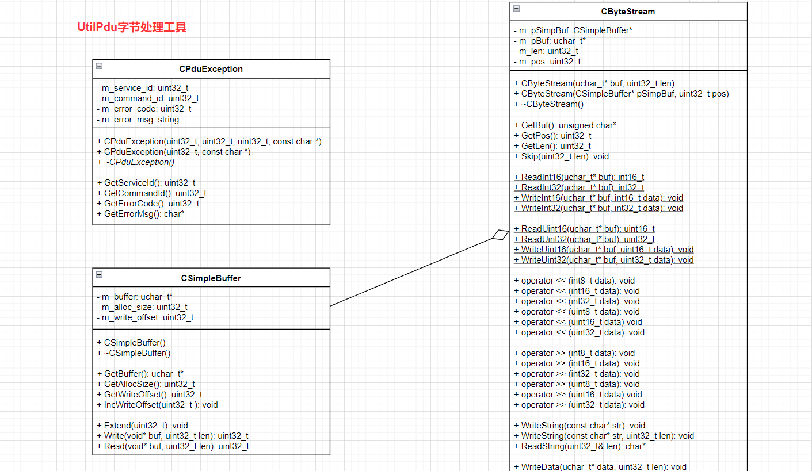
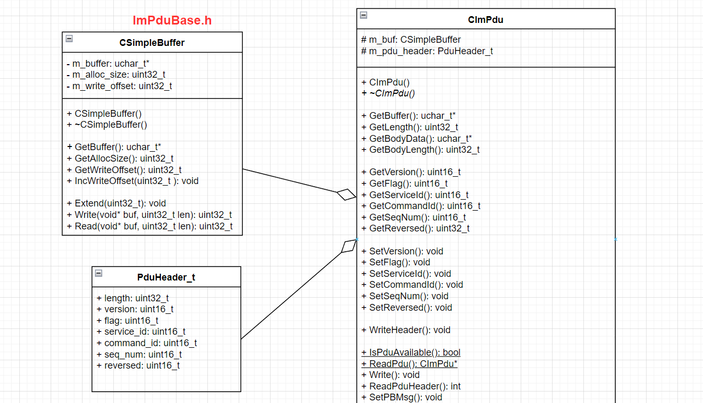
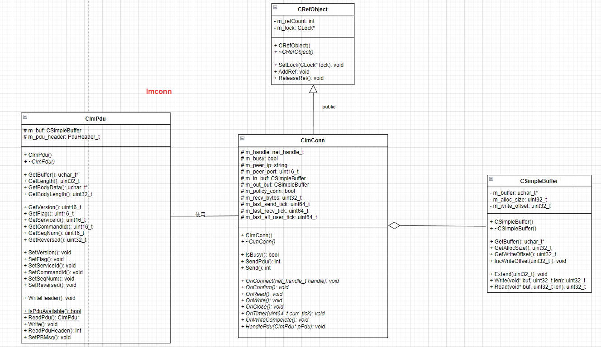

# base目录解析3

---

### 1.UtilPdu

字节是通过网络传输信息（或在硬盘或内存中存储信息）的单位，该模块实现了字节流数据处理的一些工具类。



#### CPduException

```cpp
/**
 * CPduException 类用于处理 PDU 过程中的异常情况 以便捕获和处理错误情况
 * 通过获取异常对象的属性，可以获取有关错误的详细信息，如服务ID、命令ID、错误代码和错误消息，从而进行相应的错误处理
*/
class CPduException {
public:
	CPduException(uint32_t service_id, uint32_t command_id, uint32_t error_code, const char* error_msg) {
		m_service_id = service_id;
		m_command_id = command_id;
		m_error_code = error_code;
		m_error_msg = error_msg;
	}
	CPduException(uint32_t error_code, const char* error_msg) {
		m_service_id = 0;
		m_command_id = 0;
		m_error_code = error_code;
		m_error_msg = error_msg;
	}
	virtual ~CPduException() {}

	uint32_t GetServiceId() { return m_service_id; }
	uint32_t GetCommandId() { return m_command_id; }
	uint32_t GetErrorCode() { return m_error_code; }
	char* GetErrorMsg() { return (char*)m_error_msg.c_str(); }
private:
	uint32_t	m_service_id;
	uint32_t	m_command_id;
	uint32_t	m_error_code;
	string		m_error_msg;
};
```

#### CSimpleBuffer

```cpp
/**
 * CSimpleBuffer 类提供一个简单的缓冲区实现，用于在内存中存储数据
 * 可以通过扩展缓冲区的大小来适应不断增长的数据量，并提供了写入和读取数据的方法，方便进行数据的存储和读取操作
 * 用于网络通信或数据序列化等场景，提供了基本的缓冲区功能。
*/
class DLL_MODIFIER CSimpleBuffer {
public:
	CSimpleBuffer();
	~CSimpleBuffer();
	uchar_t*  GetBuffer() { return m_buffer; }
	uint32_t GetAllocSize() { return m_alloc_size; }
	uint32_t GetWriteOffset() { return m_write_offset; }
	void IncWriteOffset(uint32_t len) { m_write_offset += len; }

	//扩展内部缓冲区的大小
	void Extend(uint32_t len);
	//向内部缓冲区写入数据
	uint32_t Write(void* buf, uint32_t len);
	//从内部缓冲区读取数据
	uint32_t Read(void* buf, uint32_t len);
private:
	uchar_t*	m_buffer;//内部缓冲区的指针uchar_t*
	uint32_t	m_alloc_size;//内部缓冲区的总大小
	uint32_t	m_write_offset;//当前写入位置的偏移量 
};
```

```cpp
CSimpleBuffer::CSimpleBuffer() {
    m_buffer = NULL;
    m_alloc_size = 0;
    m_write_offset = 0;
}

CSimpleBuffer::~CSimpleBuffer() {
    m_alloc_size = 0;
    m_write_offset = 0;
    if (m_buffer) {
        free(m_buffer);
        m_buffer = NULL;
    }
}

void CSimpleBuffer::Extend(uint32_t len) {
    m_alloc_size = m_write_offset + len;
    m_alloc_size += m_alloc_size >> 2;//扩展为原始大小的 1.25(5/4) 倍数
    uchar_t* new_buf = (uchar_t*)realloc(m_buffer, m_alloc_size);
    m_buffer = new_buf;
}

uint32_t CSimpleBuffer::Write(void* buf, uint32_t len) {
    if (m_write_offset + len > m_alloc_size) Extend(len);
    if (buf) memcpy(m_buffer + m_write_offset, buf, len);
    m_write_offset += len;
    return len;
}

uint32_t CSimpleBuffer::Read(void* buf, uint32_t len) {
    if (0 == len) return len;
    if (len > m_write_offset) len = m_write_offset;
    if (buf) memcpy(buf, m_buffer, len);
    m_write_offset -= len;
    //将m_buffer中的数据向前移动len个字节盖原来的数据
    memmove(m_buffer, m_buffer + len, m_write_offset);
    return len;
}
```


#### CByteStream

```cpp
/**
 * CByteStream类提供了一些方便的方法来读取和写入不同类型的数据（例如整数、字符串、字节数组）到缓冲区中 以及从缓冲区中读取数据
 * 这些方法可以帮助简化数据的序列化和反序列化过程。
*/
class CByteStream {
public:
	CByteStream(uchar_t* buf, uint32_t len);
	CByteStream(CSimpleBuffer* pSimpBuf, uint32_t pos);
	~CByteStream() {}

	//获取string类型字符串形式 类似c_str()
	//返回内部缓冲区的指针
	unsigned char* GetBuf() { return m_pSimpBuf ? m_pSimpBuf->GetBuffer() : m_pBuf; }
	//返回当前读写位置
	uint32_t GetPos() { return m_pos; }
	//返回缓冲区的长度
	uint32_t GetLen() { return m_len; }

	//跳过指定长度的数据，将读写位置向后移动
	void Skip(uint32_t len) {
		m_pos += len;
		if(m_pos > m_len) throw CPduException(ERROR_CODE_PARSE_FAILED, "parase packet failed!");
	}

	//从给定缓冲区中读取 16 位有符号整数并返回
	static int16_t ReadInt16(uchar_t* buf);
	//从给定缓冲区中读取 32 位有符号整数并返回
	static int32_t ReadInt32(uchar_t* buf);
	//将 16 位有符号整数写入到给定缓冲区中
	static void WriteInt16(uchar_t* buf, int16_t data);
	//将 32 位有符号整数写入到给定缓冲区中
	static void WriteInt32(uchar_t* buf, int32_t data);

	//从给定缓冲区中读取 16 位无符号整数并返回
	static uint16_t ReadUint16(uchar_t* buf);
	//从给定缓冲区中读取 32 位无符号整数并返回
	static uint32_t ReadUint32(uchar_t* buf);
	//将 16 位无符号整数写入到给定缓冲区中
	static void WriteUint16(uchar_t* buf, uint16_t data);
	//将 32 位无符号整数写入到给定缓冲区中
	static void WriteUint32(uchar_t* buf, uint32_t data);

	//重载左移运算符 将一个 8 | 16 | 32 位有符号整数写入到缓冲区中
	void operator << (int8_t data);
	void operator << (int16_t data);
	void operator << (int32_t data);
	void operator << (uint8_t data);
	void operator << (uint16_t data);
	void operator << (uint32_t data);

	//重载右移运算符，从缓冲区中读取一个 8 | 16 | 32 位有符号整数并赋值给指定变量
	void operator >> (int8_t& data);
	void operator >> (int16_t& data);
	void operator >> (int32_t& data);
	void operator >> (uint8_t& data);
	void operator >> (uint16_t& data);
	void operator >> (uint32_t& data);
	
	//将字符串写入到缓冲区中
	void WriteString(const char* str);
	//将指定长度的字符串写入到缓冲区中
	void WriteString(const char* str, uint32_t len);
	//从缓冲区中读取字符串并返回 同时将字符串的长度保存到指定变量中
	char* ReadString(uint32_t& len);

	//将给定数据写入到缓冲区中
	void WriteData(uchar_t* data, uint32_t len);
	//从缓冲区中读取数据并返回，同时将数据的长度保存到指定变量中
	uchar_t* ReadData(uint32_t& len);
private:
	void _WriteByte(void* buf, uint32_t len);
	void _ReadByte(void* buf, uint32_t len);
private:
	CSimpleBuffer*	m_pSimpBuf;//指向 CSimpleBuffer 对象的指针，用于处理数据读写操作
	uchar_t*		m_pBuf;//指向缓冲区的指针
	uint32_t		m_len;//缓冲区的长度
	uint32_t		m_pos;//当前读写位置
};
```

```cpp
CByteStream::CByteStream(uchar_t* buf, uint32_t len) {
    m_pBuf = buf;
    m_len = len;
    m_pSimpBuf = NULL;
    m_pos = 0;
}

CByteStream::CByteStream(CSimpleBuffer* pSimpBuf, uint32_t pos) {
    m_pSimpBuf = pSimpBuf;
    m_pos = pos;
    m_pBuf = NULL;
    m_len = 0;
}
```

```cpp
//字节数组和uint16_t int6_t uint32_t int32_t等数字的相互转换
int16_t CByteStream::ReadInt16(uchar_t* buf) {
    int16_t data = (buf[0] << 8) | buf[1];
    return data;
}

uint16_t CByteStream::ReadUint16(uchar_t* buf) {
    uint16_t data = (buf[0] << 8) | buf[1];
    return data;
}

int32_t CByteStream::ReadInt32(uchar_t* buf) {
    int32_t data = (buf[0] << 24) | (buf[1] << 16) | (buf[2] << 8) | buf[3];
    return data;
}

uint32_t CByteStream::ReadUint32(uchar_t* buf) {
    uint32_t data = (buf[0] << 24) | (buf[1] << 16) | (buf[2] << 8) | buf[3];
    return data;
}

void CByteStream::WriteInt16(uchar_t* buf, int16_t data) {
    buf[0] = static_cast<uchar_t>(data >> 8);
    buf[1] = static_cast<uchar_t>(data & 0xFF);
}

void CByteStream::WriteUint16(uchar_t* buf, uint16_t data) {
    buf[0] = static_cast<uchar_t>(data >> 8);
    buf[1] = static_cast<uchar_t>(data & 0xFF);
}

void CByteStream::WriteInt32(uchar_t* buf, int32_t data) {
    buf[0] = static_cast<uchar_t>(data >> 24);
    buf[1] = static_cast<uchar_t>((data >> 16) & 0xFF);
    buf[2] = static_cast<uchar_t>((data >> 8) & 0xFF);
    buf[3] = static_cast<uchar_t>(data & 0xFF);
}

void CByteStream::WriteUint32(uchar_t* buf, uint32_t data) {
    buf[0] = static_cast<uchar_t>(data >> 24);
    buf[1] = static_cast<uchar_t>((data >> 16) & 0xFF);
    buf[2] = static_cast<uchar_t>((data >> 8) & 0xFF);
    buf[3] = static_cast<uchar_t>(data & 0xFF);
}
```

```cpp
//将字符串写入到字节流中
void CByteStream::WriteString(const char* str) {
    uint32_t size = str ? (uint32_t)strlen(str) : 0;//获取字符串的长度
    *this << size;//使用运算符重载函数operator<<将字符串的长度写入到字节流中（将长度作为一个无符号整数写入）
    _WriteByte((void*)str, size);//将字符串内容写入到字节流中 传入参数为字符串的指针和长度
}

void CByteStream::WriteString(const char* str, uint32_t len) {
    *this << len;
    _WriteByte((void*)str, len);
}

//从字节流中读取字符串
char* CByteStream::ReadString(uint32_t& len) {
    *this >> len;//使用运算符重载函数 operator>> 从字节流中读取字符串的长度 存储在参数len中
    char* pStr = (char*)GetBuf() + GetPos();//获取字节流的缓冲区指针，加上当前的读取位置GetPos()得到字符串的起始地址 pStr
    Skip(len);//跳过已经读取的字符串部分 以便后续的读取操作
    return pStr;
}

//向字节流中写入数据
void CByteStream::WriteData(uchar_t* data, uint32_t len) {
    *this << len;//用运算符重载函数 operator<< 将数据的长度 len 写入字节流
    _WriteByte(data, len);//将数据 data 写入字节流，指定写入的长度为len
}

//从字节流中读取数据
uchar_t* CByteStream::ReadData(uint32_t& len) {
    *this >> len;//使用运算符重载函数 operator>> 从字节流中读取数据的长度 len
    uchar_t* pData = (uchar_t*)GetBuf() + GetPos();//当前读取位置 GetPos() + 字节流的起始地址 GetBuf() = 数据指针pData
    Skip(len);//跳过已读取的数据 以便后续的读取操作
    return pData;
}
```

#### URL字符串与uint32_t类型转换的用途

URL字符串与uint32_t类型的互相转换可以用于一些特定的应用场景，例如：

1. 缩短URL：将长的URL转换为短的uint32_t类型的整数表示，可以减小URL的长度，方便传输和存储。
2. 数据索引：将URL映射为唯一的uint32_t标识符，可以用于在数据库或索引中进行快速的查找和检索操作。
3. 数据加密：将敏感的URL信息转换为无意义的uint32_t类型的值，以保护数据的安全性和隐私性。
4. 内部数据处理：在内部数据处理过程中，将URL字符串转换为uint32_t类型的整数可以加快计算速度和减少存储空间。

总的来说，URL字符串与uint32_t类型的互相转换可以在某些场景下提供更高效、更紧凑的数据表示和处理方式。具体应用取决于具体需求和业务场景。

```cpp
// 将一个uint32_t类型的整数转换为对应的URL字符串
char* idtourl(uint32_t id) {
    // 1.用于转换的数字和字母字符
    static char digits[] = "0123456789abcdefghijklmnopqrstuvwxyz";
    static char buf[64];
    char* ptr;
    uint32_t value = id * 2 + 56;
    // convert to 36 number system
    ptr = buf + sizeof(buf) - 1;
    *ptr = '\0';

    // 2.循环直到 value 为 0 或者缓冲区指针 ptr 到达缓冲区的起始位置
    do {
        *--ptr = digits[value % 36];
        value /= 36;
    } while (ptr > buf && value);

    // 3.在转换结束后，在缓冲区的最前面添加版本号字符1
    *--ptr = '1'; // add version number

    // 4.返回指向缓冲区的指针ptr
    return ptr;
}

//将URL字符串转换为对应的uint32_t类型的整数
uint32_t urltoid(const char* url) {
    uint32_t url_len = strlen(url);
    char c;
    uint32_t number = 0;//用于存储转换结果的中间值
    for (uint32_t i = 1; i < url_len; i++) {
        //从URL字符串的第二个字符开始遍历（跳过版本号字符1）直到字符串末尾
        c = url[i];
        if (c >= '0' && c <= '9') c -= '0';
        else if (c >= 'a' && c <= 'z') c -= 'a' - 10;
        else if (c >= 'A' && c <= 'Z') c -= 'A' - 10;
        else continue;
        number = number * 36 + c;
    }
    return (number - 56) >> 1;
}
```


### 2.ImPduBase

ImPduBase用于<font color='#BAOC2F'>通讯数据包的读取解析</font>依，赖于UtilPdu工具类，依赖于protobuf第三方库，



#### ImPduBase.h

```cpp
typedef struct {
    uint32_t 	length;//整个PDU的长度
    uint16_t 	version;//PDU版本号
    uint16_t	flag;//未使用
    uint16_t	service_id;//服务id
    uint16_t	command_id;//命令id
    uint16_t	seq_num;//包序号
    uint16_t    reversed;//预留字段
} PduHeader_t;

class DLL_MODIFIER CImPdu {
public:
    CImPdu();
    virtual ~CImPdu() {}
    
    uchar_t* GetBuffer();
    uint32_t GetLength();
    uchar_t* GetBodyData();
    uint32_t GetBodyLength();
    
    uint16_t GetVersion() { return m_pdu_header.version; }
    uint16_t GetFlag() { return m_pdu_header.flag; }
    uint16_t GetServiceId() { return m_pdu_header.service_id; }
    uint16_t GetCommandId() { return m_pdu_header.command_id; }
    uint16_t GetSeqNum() { return m_pdu_header.seq_num; }
    uint32_t GetReversed() { return m_pdu_header.reversed; }
    
    void SetVersion(uint16_t version);
    void SetFlag(uint16_t flag);
    void SetServiceId(uint16_t service_id);
    void SetCommandId(uint16_t command_id);
    void SetError(uint16_t error);
    void SetSeqNum(uint16_t seq_num);
    void SetReversed(uint32_t reversed);

    //将 m_pdu_header 中的数据写入到内部的缓冲区 m_buf 中
    void WriteHeader();
    
    //检查给定的缓冲区中是否存在完整的 PDU 数据
    static bool IsPduAvailable(uchar_t* buf, uint32_t len, uint32_t& pdu_len);
    //从给定的缓冲区中解析出一个完整的PDU，并返回一个新创建的CImPdu对象
    static CImPdu* ReadPdu(uchar_t* buf, uint32_t len);
    //将给定的数据写入到内部的缓冲区 m_buf 中
    void Write(uchar_t* buf, uint32_t len) { m_buf.Write((void*)buf, len); }
    //从给定的缓冲区中解析出 PDU 头部，并更新 m_pdu_header 成员的值
    int ReadPduHeader(uchar_t* buf, uint32_t len);
    //将给定的 Protobuf 消息设置为当前 PDU 对象的消息体
    void SetPBMsg(const google::protobuf::MessageLite* msg);
    
protected:
    CSimpleBuffer	m_buf;
    PduHeader_t		m_pdu_header;
};
```

#### ImPduBase.cpp

```cpp
#include "ImPduBase.h"
#include "IM.BaseDefine.pb.h"
#include "util.h"
using namespace IM::BaseDefine;

CImPdu::CImPdu() {
    m_pdu_header.version = IM_PDU_VERSION;
    m_pdu_header.flag = 0;
    m_pdu_header.service_id = SID_OTHER;
    m_pdu_header.command_id = 0;
    m_pdu_header.seq_num = 0;
    m_pdu_header.reversed = 0;
}

///////////////////////////////////Get////////////////////////////////////////
uchar_t* CImPdu::GetBuffer() {
    //获取 m_buf 对应的内部缓冲区的指针uchar_t*
    return m_buf.GetBuffer();
}

uint32_t CImPdu::GetLength() {
    //当前缓冲区写入位置的偏移量
    return m_buf.GetWriteOffset();
}

uchar_t* CImPdu::GetBodyData() {
    //将内部缓冲区的指针向后偏移sizeof(PduHeader_t)字节，指向PDU消息体的起始位置
    return m_buf.GetBuffer() + sizeof(PduHeader_t);
}

uint32_t CImPdu::GetBodyLength() {
    uint32_t body_length = 0;
    //当前缓冲区写入位置的偏移量 - PDU 头部的长度
    body_length = m_buf.GetWriteOffset() - sizeof(PduHeader_t);
    return body_length;
}

////////////////////////////////////////////Set///////////////////////////////////////////
void CImPdu::SetVersion(uint16_t version) {
    uchar_t* buf = GetBuffer();
    CByteStream::WriteUint16(buf + 4, version);
}

void CImPdu::SetFlag(uint16_t flag) {
    uchar_t* buf = GetBuffer();
    CByteStream::WriteUint16(buf + 6, flag);
}

void CImPdu::SetServiceId(uint16_t service_id) {
    uchar_t* buf = GetBuffer();
    CByteStream::WriteUint16(buf + 8, service_id);
}

void CImPdu::SetCommandId(uint16_t command_id) {
    uchar_t* buf = GetBuffer();
    CByteStream::WriteUint16(buf + 10, command_id);
}

void CImPdu::SetError(uint16_t error) {
    uchar_t* buf = GetBuffer();
    CByteStream::WriteUint16(buf + 12, error);
}

void CImPdu::SetSeqNum(uint16_t seq_num) {
    uchar_t* buf = GetBuffer();
    CByteStream::WriteUint16(buf + 12, seq_num);
}

void CImPdu::SetReversed(uint32_t reversed) {
    uchar_t* buf = GetBuffer();
    CByteStream::WriteUint16(buf + 14, reversed);
}

//////////////////////////////////////////////////////////////////////////////////////////


/**
 * 将 m_pdu_header 中的数据写入到内部的缓冲区 m_buf 的开头（即写入 PDU 的头部信息）
 * m_buf 主要用于存储 PDU 的数据内容，包括头部信息和消息体
*/
void CImPdu::WriteHeader() {
    // 1.获取内部缓冲区的指针
    uchar_t* buf = GetBuffer();

    // 2.使用CByteStream::WriteInt32将PDU的总长度写入 buf 的前4个字节
    CByteStream::WriteInt32(buf, GetLength());
    // 3.使用CByteStream::WriteUint16函数依次将 m_pdu_header 中的版本号、标志、服务ID、命令ID、包序号和保留字段写入 buf 中的相应位置
    CByteStream::WriteUint16(buf + 4, m_pdu_header.version);
    CByteStream::WriteUint16(buf + 6, m_pdu_header.flag);
    CByteStream::WriteUint16(buf + 8, m_pdu_header.service_id);
    CByteStream::WriteUint16(buf + 10, m_pdu_header.command_id);
    CByteStream::WriteUint16(buf + 12, m_pdu_header.seq_num);
    CByteStream::WriteUint16(buf + 14, m_pdu_header.reversed);
}

/// @brief 从给定的缓冲区中解析 PDU 的头部信息并将解析结果存储在 m_pdu_header 中
/// @param buf 缓冲区 
/// @param len 缓冲区长度
/// @return 
int CImPdu::ReadPduHeader(uchar_t* buf, uint32_t len) {
    int ret = -1;
    // 1.确保缓冲区长度len大于等于PDU头部长度 且缓冲区指针 buf 不为 nullptr
    if (len >= IM_PDU_HEADER_LEN && buf) {
        // 2.创建一个CByteStream对象is，将缓冲区buf作为参数传入构造函数，以便进行数据读取操作。
        CByteStream is(buf, len);
        // 3.使用CByteStream对象的重载的>>运算符，依次从is中读取PDU头部的各个字段
        // 将读取结果存储在 m_pdu_header 的对应成员变量中
        is >> m_pdu_header.length;
        is >> m_pdu_header.version;
        is >> m_pdu_header.flag;
        is >> m_pdu_header.service_id;
        is >> m_pdu_header.command_id;
        is >> m_pdu_header.seq_num;
        is >> m_pdu_header.reversed;

        ret = 0;
    }
    return ret;
}

/// @brief 从给定的缓冲区 buf 中解析出一个完整的 PDU，并返回一个新创建的 CImPdu 对象
/// @param buf 缓冲区
/// @param len 缓冲区长度
/// @return 
CImPdu* CImPdu::ReadPdu(uchar_t* buf, uint32_t len) {
    uint32_t pdu_len = 0;
    // 1.检查给定缓冲区中是否存在完整的 PDU 数据
    if (!IsPduAvailable(buf, len, pdu_len)) return NULL;
    // 2.从缓冲区 buf 中读取 service_id 和 command_id 字段，分别存储在对应的变量中
    uint16_t service_id = CByteStream::ReadUint16(buf + 8);
    uint16_t command_id = CByteStream::ReadUint16(buf + 10);
    
    CImPdu* pPdu = NULL;
    pPdu = new CImPdu();
    // 3.调用pPdu->Write(buf, pdu_len)将缓冲区buf中的数据写入到pPdu对象的内部缓冲区中（消息体）
    pPdu->Write(buf, pdu_len);
    // 4.调用pPdu->ReadPduHeader(buf, IM_PDU_HEADER_LEN)解析pPdu对象的PDU头部信息（消息头）
    pPdu->ReadPduHeader(buf, IM_PDU_HEADER_LEN);

    return pPdu;
}

/// @brief 检查给定的缓冲区buf中是否存在完整的PDU数据，并将解析出的PDU长度存储在pdu_len中
/// @param buf 缓冲区
/// @param len 缓冲区长度
/// @param pdu_len PDU长度
/// @return 
bool CImPdu::IsPduAvailable(uchar_t* buf, uint32_t len, uint32_t& pdu_len) {
    // 1.缓冲区的长度是否小于 PDU 头部长度
    if (len < IM_PDU_HEADER_LEN) return false;

    // 2.从缓冲区buf中读取出PDU的长度，并将其存储在变量pdu_len中
    pdu_len = CByteStream::ReadUint32(buf);
    if (pdu_len > len) {
        //函数检查读取到的 PDU 长度是否超过了给定的缓冲区长度 len
        // log("pdu_len=%d, len=%d\n", pdu_len, len);
        return false;
    }

    // 3.读取到的PDU长度为0，即pdu_len为0，则抛出一个CPduException异常
    if (0 == pdu_len) throw CPduException(1, "pdu_len is 0");

    // 4.以上条件都满足，则表示存在完整的PDU数据返回true
    return true;
}

/// @brief 用于将给定的 Protobuf 消息（msg）设置为当前 PDU 对象的消息体（protobuf消息转化）
/// @param msg protobuf消息
void CImPdu::SetPBMsg(const google::protobuf::MessageLite* msg) {
    // 1.设置包体，则需要重置下空间
    // 清空内部缓冲区的数据，将读取偏移量重置为0，相当于清空缓冲区
    m_buf.Read(NULL, m_buf.GetWriteOffset());
    // 向内部缓冲区写入一个大小为 PduHeader_t 的空数据，相当于写入 PDU 头部占用的空间
    m_buf.Write(NULL, sizeof(PduHeader_t));

    // 2.获取 Protobuf 消息的大小
    uint32_t msg_size = msg->ByteSize();

    // 3.创建一个大小为msg_size的uchar_t数组，命名为szData用于存储序列化后的消息数据
    uchar_t* szData = new uchar_t[msg_size];

    // 4.将Protobuf消息序列化为二进制数据，并存储到szData数组中
    if (!msg->SerializeToArray(szData, msg_size)) log_error("pb msg miss required fields.");

    // 5.调用 m_buf.Write(szData, msg_size) 将序列化后的消息数据写入内部缓冲区
    m_buf.Write(szData, msg_size);

    // 6.释放 szData 数组的内存
    delete[] szData;

    // 7.调用WriteHeader()函数，将PDU头部信息写入内部缓冲区
    WriteHeader();
}
```


### 3.imconn

利用netlib封装了一套<font color='#BAOC2F'>通用的tcp连接基础类</font>，

业务类的连接像CLoginConn用于登录服务器连接和CHttpConn用于http连接等<font color='#BAOC2F'>可继承该类重写自己的业务逻辑</font>。



#### imconn.h

```cpp
#ifndef IMCONN_H_
#define IMCONN_H_

#include "netlib.h"
#include "util.h"
#include "ImPduBase.h"

#define SERVER_HEARTBEAT_INTERVAL	5000
#define SERVER_TIMEOUT				30000
#define CLIENT_HEARTBEAT_INTERVAL	30000
#define CLIENT_TIMEOUT				120000
#define MOBILE_CLIENT_TIMEOUT       60000 * 5
#define READ_BUF_SIZE	2048

/**
 * CImConn 类封装了对网络连接的管理和事件处理
 * 提供了发送和接收数据的功能，并定义了一些虚拟函数供派生类进行重写以实现特定的业务逻辑
 * 
 * CImConn 继承了引用计数类 CRefObject 实现对象的引用计数管理
*/
class CImConn : public CRefObject {
public:
	CImConn();
	virtual ~CImConn();

	//返回连接是否处于忙碌状态
	bool IsBusy() { return m_busy; }
	//发送一个 CImPdu 对象
	int SendPdu(CImPdu* pPdu) { return Send(pPdu->GetBuffer(), pPdu->GetLength()); }
	//发送数据
	int Send(void* data, int len);

	//OnXXX回调函数用于处理连接的不同事件
	//包括连接建立、连接确认、读取数据、写入数据、连接关闭、定时器事件和写入完成事件
	virtual void OnConnect(net_handle_t handle) { m_handle = handle; }
	virtual void OnConfirm() {}
	virtual void OnRead();
	virtual void OnWrite();
	virtual void OnClose() {}
	virtual void OnTimer(uint64_t curr_tick) {}
    virtual void OnWriteCompelete() {};

	//处理接收到的 CImPdu 对象
	virtual void HandlePdu(CImPdu* pPdu) {}

protected:
	net_handle_t	m_handle;//网络句柄，用于标识连接 int类型
	bool			m_busy;//连接是否处于忙碌状态

	string			m_peer_ip;//对端IP地址
	uint16_t		m_peer_port;//对端端口号
	CSimpleBuffer	m_in_buf;//输入缓冲区
	CSimpleBuffer	m_out_buf;//输出缓冲区

	bool			m_policy_conn;//连接是否为策略连接
	uint32_t		m_recv_bytes;//已接收的字节数
	uint64_t		m_last_send_tick;//最后一次发送数据的时间戳
	uint64_t		m_last_recv_tick;//最后一次接收数据的时间戳
    uint64_t        m_last_all_user_tick;//最后一次处理所有用户的时间戳
};

//哈希映射容器类型 用于将网络句柄 net_handle_t 映射到 CImConn* 对象
typedef hash_map<net_handle_t, CImConn*> ConnMap_t;

//哈希映射容器类型 用于将uint32_t类型的用户id 映射到 CImConn* 对象
typedef hash_map<uint32_t, CImConn*> UserMap_t;

//将具体的事件回调委托给对应的连接对象 CImConn 进行处理 根据不同的消息类型 分发事件处理
void imconn_callback(void* callback_data, uint8_t msg, uint32_t handle, void* pParam);

void ReadPolicyFile();

#endif
```

#### icmconn.cpp

```cpp
#include "imconn.h"

// static uint64_t g_send_pkt_cnt = 0;		// 发送数据包总数
// static uint64_t g_recv_pkt_cnt = 0;		// 接收数据包总数

//根据网路句柄 在ConnMap_t 类型的哈希映射容器中 查找对应的网络连接 CImConn*
static CImConn* FindImConn(ConnMap_t* imconn_map, net_handle_t handle) {
    CImConn* pConn = NULL;
    ConnMap_t::iterator iter = imconn_map->find(handle);
    if (iter != imconn_map->end()) {
        pConn = iter->second;
        pConn->AddRef();//增加对象的引用计数
    }
    return pConn;
}

/// @brief imconn_callback回调函数，用于处理与网络连接相关的消息 根据不同的消息类型分发事件处理
/// @param callback_data 回调函数的用户数据 指向 ConnMap_t 类型的哈希映射容器的指针
/// @param msg 接收到的消息类型的无符号字节
/// @param handle 网络句柄 用于标识一个网络连接
/// @param pParam 参数指针用于传递额外的参数
void imconn_callback(void* callback_data, uint8_t msg, uint32_t handle, void* pParam) {
	// 1.忽略 handle 和 pParam 参数 函数体内部没有使用它们
    NOTUSED_ARG(handle);
    NOTUSED_ARG(pParam);

	//callback_data为空则直接返回
    if (!callback_data) return;

	// 2.将 callback_data 转换为 ConnMap_t* 类型的指针，并将其赋值给 conn_map
    ConnMap_t* conn_map = (ConnMap_t*)callback_data;

	// 3.使用FindImConn根据 handle网络句柄在 conn_map 中查找对应的 CImConn* 对象，并将结果赋值给 pConn
    CImConn* pConn = FindImConn(conn_map, handle);
    if (!pConn) return;

	// 4.根据接收到的msg类型执行相应的操作
    switch (msg) {
    case NETLIB_MSG_CONFIRM:
        pConn->OnConfirm();
        break;
    case NETLIB_MSG_READ:
        pConn->OnRead();
        break;
    case NETLIB_MSG_WRITE:
        pConn->OnWrite();
        break;
    case NETLIB_MSG_CLOSE:
        pConn->OnClose();
        break;
    default:
		//其他消息类型：记录错误日志
        log_error("!!!imconn_callback error msg: %d ", msg);
        break;
    }

	// 5.用 pConn 的 ReleaseRef 方法，释放对连接对象的引用
    pConn->ReleaseRef();
}

////////////////////////////////////////////////////CImConn////////////////////////////////////////////////
CImConn::CImConn() {
    log_debug("CImConn::CImConn ");
    m_busy = false;//连接未忙碌
    m_handle = NETLIB_INVALID_HANDLE;//连接的句柄无效
    m_recv_bytes = 0;//接收的字节数为 0
    m_last_send_tick = m_last_recv_tick = get_tick_count();//设置为当前的系统时间戳
}

CImConn::~CImConn() {
    log_debug("CImConn::~CImConn, handle=%d ", m_handle);
}

/**
 * CImConn类中的Send方法 用于向连接发送数据
*/
int CImConn::Send(void* data, int len) {
	// 1.更新m_last_send_tick变量，记录最后一次发送数据的时间戳
    m_last_send_tick = get_tick_count();

	// 2.连接处于忙碌状态（之前的发送操作还未完成）那么将待发送的数据写入输出缓冲区m_out_buf，并返回数据长度len
    if (m_busy) {
        m_out_buf.Write(data, len);
        return len;
    }

	// 3.不处于忙碌状态 则进入循环进行实际的发送数据操作
    int offset = 0;
    int remain = len;
    while (remain > 0) {
		//将待发送数据分割为较小的块，并使用netlib_send函数发送数据块
        int send_size = remain;
        if (send_size > NETLIB_MAX_SOCKET_BUF_SIZE) send_size = NETLIB_MAX_SOCKET_BUF_SIZE;
        int ret = netlib_send(m_handle, (char*)data + offset, send_size);
		//如果发送失败（返回值ret小于等于0）终止循环
        if (ret <= 0) { ret = 0; break; }
		//每次发送后更新偏移量offset和剩余字节数remain
        offset += ret;
        remain -= ret;
    }

	// 4.如果仍有剩余数据未发送完毕（remain > 0）
    if (remain > 0) {
		// 将剩余数据写入输出缓冲区m_out_buf，并将m_busy标记为true，表示连接处于忙碌状态
        m_out_buf.Write((char*)data + offset, remain);
        m_busy = true;
        log_debug("send busy, remain=%d ", m_out_buf.GetWriteOffset());
    } else {
		// 5.如果所有数据都发送完毕 则调用OnWriteCompelete方法
        OnWriteCompelete();
    }

    return len;
}

/**
 * OnRead方法完成了从连接读取数据、解析CImPdu对象并处理的过程
*/
void CImConn::OnRead() {
	// 1.通过循环不断读取数据
    for (;;) {
		// 1-1.在每次循环开始时，检查输入缓冲区m_in_buf的剩余可写空间free_buf_len
        uint32_t free_buf_len = m_in_buf.GetAllocSize() - m_in_buf.GetWriteOffset();
		// 如果不足READ_BUF_SIZE，则扩展输入缓冲区的大小为READ_BUF_SIZE
        if (free_buf_len < READ_BUF_SIZE) m_in_buf.Extend(READ_BUF_SIZE);
        log_debug("handle = %u, netlib_recv into, time = %u\n", m_handle, get_tick_count());

		// 1-2.调用netlib_recv函数从连接中接收数据
        int ret = netlib_recv(m_handle, m_in_buf.GetBuffer() + m_in_buf.GetWriteOffset(), READ_BUF_SIZE);
        if (ret <= 0) break;//ret小于等于0，表示接收失败或连接关闭，跳出循环

		// 1-3.更新已接收的字节数m_recv_bytes和最后一次接收数据的时间戳m_last_recv_tick
        m_recv_bytes += ret;
        m_in_buf.IncWriteOffset(ret);
        m_last_recv_tick = get_tick_count();
    }

	// 2.通过while循环从输入缓冲区中解析出CImPdu对象，并处理每个CImPdu对象
    CImPdu* pPdu = NULL;
    try {
		// 调用CImPdu::ReadPdu方法从输入缓冲区中读取一个完整的CImPdu对象pPdu
        while ((pPdu = CImPdu::ReadPdu(m_in_buf.GetBuffer(), m_in_buf.GetWriteOffset()))) {
			// 2-1.如果成功读取到了CImPdu对象，则获取该对象的长度pdu_len，并调用HandlePdu方法处理该对象
            uint32_t pdu_len = pPdu->GetLength();
            log_debug("handle = %u, pdu_len into = %u\n", m_handle, pdu_len);
            HandlePdu(pPdu);

			// 2-2.从输入缓冲区 m_in_buf 中读取指定长度的数据并将其丢弃
			// 通过将参数设置为 NULL 和 pdu_len，即表示从输入缓冲区中读取 pdu_len 长度的数据，但是并不保存读取的数据
			// 作用是丢弃输入缓冲区中指定长度的数据，以便在处理完相应的 CImPdu 对象后，将这部分数据从输入缓冲区中移除
            m_in_buf.Read(NULL, pdu_len);

			// 2-3.删除已处理的CImPdu对象，并将pPdu置为NULL
            delete pPdu;
            pPdu = NULL;
        }
    } catch (CPduException& ex) {
		// 2-4.如果在解析过程中捕获到CPduException异常，表示解析出现错误，记录错误信息并关闭连接
        log_error("!!!catch exception, sid=%u, cid=%u, err_code=%u, err_msg=%s, close the connection ",
            ex.GetServiceId(), ex.GetCommandId(), ex.GetErrorCode(), ex.GetErrorMsg());
        if (pPdu) {
            delete pPdu;
            pPdu = NULL;
        }
        OnClose();
    }

}

/**
 * OnWrite方法用于处理写入数据的事件
 * 将待发送的数据从输出缓冲区逐次发送出去，直到输出缓冲区中的数据全部发送完成
*/
void CImConn::OnWrite() {
    // 1.首先检查连接是否处于忙碌状态 如果连接不忙碌则直接返回，因为没有需要写入的数据
    if (!m_busy) return;

    // 2.如果连接处于忙碌状态，即存在待发送的数据 那么进入循环进行数据发送
    while (m_out_buf.GetWriteOffset() > 0) {
        // 2-1.获取待发送数据的长度，并根据网络库的最大缓冲区大小对发送长度进行调整
        int send_size = m_out_buf.GetWriteOffset();
        if (send_size > NETLIB_MAX_SOCKET_BUF_SIZE) send_size = NETLIB_MAX_SOCKET_BUF_SIZE;

        // 2-2.调用 netlib_send 函数将数据发送出去，并获取实际发送的字节数
        int ret = netlib_send(m_handle, m_out_buf.GetBuffer(), send_size);

        // 2-3.发送失败或返回的字节数小于等于0，表示发送遇到了错误循环中断
        if (ret <= 0) {
            ret = 0;
            break;
        }

        // 2-4.发送成功，从输出缓冲区m_out_buf中读取已发送的数据，并将其从缓冲区中丢弃
        m_out_buf.Read(NULL, ret);
    }

    // 3.检查输出缓冲区的写入偏移量是否为0 如果为0，表示所有待发送的数据已经发送完毕，将连接的忙碌状态设置为false
    if (m_out_buf.GetWriteOffset() == 0) m_busy = false;
    log_debug("onWrite, remain=%d ", m_out_buf.GetWriteOffset());
}
```


### 4.im_conn_util

一些用于发送消息的辅助函数

#### im_conn_util.h

```cpp
#ifndef BASE_IM_CONN_UTIL_H_
#define BASE_IM_CONN_UTIL_H_

#include "base/ostype.h"

namespace google { namespace protobuf {
    class MessageLite;
}}

//类前置声明，文件中使用了CImConn类
class CImConn;

/**
 * 这些函数提供了便捷的方式来发送使用Google Protocol Buffers库定义的消息对象
 * 通过传入连接对象、服务id、命令id等参数，可以将消息对象 转换为字节流并发送给对应的连接
*/
int SendMessageLite(CImConn* conn, uint16_t sid, uint16_t cid, const ::google::protobuf::MessageLite* message);
int SendMessageLite(CImConn* conn, uint16_t sid, uint16_t cid, uint16_t seq_num, const ::google::protobuf::MessageLite* message);
int SendMessageLite(CImConn* conn, uint16_t sid, uint16_t cid, uint16_t seq_num, uint16_t error, const ::google::protobuf::MessageLite* message);

#endif
```

#### im_conn_util.cpp

```cpp
#include "im_conn_util.h"

#include "base/imconn.h"
#include "base/ImPduBase.h"

/// @brief SendMessageLite函数重载
/// @param conn 要发送消息的连接对象
/// @param sid 消息的服务id
/// @param cid 消息的命令id
/// @param message 要发送的消息对象 使用Google Protocol Buffers库的MessageLite类
/// @return 发送消息的结果
int SendMessageLite(CImConn* conn, uint16_t sid, uint16_t cid, const ::google::protobuf::MessageLite* message) {
    CImPdu pdu;
    
    pdu.SetPBMsg(message);
    pdu.SetServiceId(sid);
    pdu.SetCommandId(cid);
    
    return conn->SendPdu(&pdu);
}

/// @brief SendMessageLite函数重载
/// @param conn 要发送消息的连接对象
/// @param sid 服务id
/// @param cid 命令id
/// @param seq_num 消息的序列号
/// @param message 要发送的消息对象 使用Google Protocol Buffers库的MessageLite类
/// @return 发送消息的结果
int SendMessageLite(CImConn* conn, uint16_t sid, uint16_t cid, uint16_t seq_num, const ::google::protobuf::MessageLite* message) {
    CImPdu pdu;
    
    pdu.SetPBMsg(message);
    pdu.SetServiceId(sid);
    pdu.SetCommandId(cid);
    pdu.SetSeqNum(seq_num);
    
    return conn->SendPdu(&pdu);
}

/// @brief SendMessageLite函数重载
/// @param conn 要发送消息的连接对象
/// @param sid 服务id
/// @param cid 命令id
/// @param seq_num 消息的序列号
/// @param error 消息的错误码
/// @param message 要发送的消息对象 使用Google Protocol Buffers库的MessageLite类
/// @return 发送消息的结果
int SendMessageLite(CImConn* conn, uint16_t sid, uint16_t cid, uint16_t seq_num, uint16_t error, const ::google::protobuf::MessageLite* message) {
    CImPdu pdu;
    
    pdu.SetPBMsg(message);
    pdu.SetServiceId(sid);
    pdu.SetCommandId(cid);
    pdu.SetSeqNum(seq_num);
    pdu.SetError(error);
    
    return conn->SendPdu(&pdu);
}
```


### 5.ServInfo

#### ServInfo.h

```cpp
#ifndef SERVINFO_H_
#define SERVINFO_H_

#include "ConfigFileReader.h"
#include "imconn.h"
#include "util.h"

#define MAX_RECONNECT_CNT 64 //最大重连次数
#define MIN_RECONNECT_CNT 4 //最小重连次数

//服务器信息结构体
typedef struct {
    string server_ip;//服务器IP
    uint16_t server_port;//端口
    uint32_t idle_cnt;//空闲计数
    uint32_t reconnect_cnt;//重连计数
    CImConn* serv_conn;//服务器连接对象
} serv_info_t;

/**
 * 这个函数通过模板参数T可以适配不同类型的服务器连接对象，例如CImConn
 * 其遍历服务器列表，为每个服务器创建连接对象并初始化相关参数，以便后续使用
*/
/// @brief 函数模板定义 用于初始化服务器连接对象
/// @tparam T 服务器连接对象的类型
/// @param server_list 指向服务器信息结构体数组的指针
/// @param server_count 服务器信息结构体数组的大小
template <class T>
void serv_init(serv_info_t* server_list, uint32_t server_count) {
    //遍历服务器信息结构体数组
    for (uint32_t i = 0; i < server_count; i++) {
        //对于每个服务器，创建一个类型为T的服务器连接对象
        T* pConn = new T();
        //调用服务器连接对象的Connect方法，传入服务器的IP地址、端口号和序号i
        pConn->Connect(server_list[i].server_ip.c_str(), server_list[i].server_port, i);
        //将服务器连接对象赋值给相应的服务器信息结构体的serv_conn成员
        server_list[i].serv_conn = pConn;
        //将服务器信息结构体的idle_cnt设置为0
        server_list[i].idle_cnt = 0;
        //将服务器信息结构体的reconnect_cnt设置为MIN_RECONNECT_CNT / 2
        server_list[i].reconnect_cnt = MIN_RECONNECT_CNT / 2;
    }
}

/**
 * 这个函数通过模板参数T可以适配不同类型的服务器连接对象，例如CImConn。
 * 遍历服务器列表，检查每个服务器的连接状态，如果连接断开且达到了重连的条件，就创建新的连接对象并进行重新连接
*/
/// @brief 函数模板定义 用于检查服务器连接对象是否需要重新连接
/// @tparam T 服务器连接对象的类型
/// @param server_list 指向服务器信息结构体数组的指针
/// @param server_count 服务器信息结构体数组的大小
template <class T>
void serv_check_reconnect(serv_info_t* server_list, uint32_t server_count) {
    T* pConn;
    //遍历服务器信息结构体数组
    for (uint32_t i = 0; i < server_count; i++) {
        //获取服务器连接对象指针，并将其转换为类型为T*
        pConn = (T*)server_list[i].serv_conn;
        //如果连接对象为空指针，表示连接已断开 尝试进行重新连接
        if (!pConn) {
            //将服务器信息结构体的idle_cnt加1
            server_list[i].idle_cnt++;
            //如果idle_cnt达到了重连的次数阈值
            if (server_list[i].idle_cnt >= server_list[i].reconnect_cnt) {
                //创建一个类型为T的服务器连接对象
                pConn = new T();
                //调用连接对象的Connect方法，传入服务器的IP地址、端口号和序号（i）
                pConn->Connect(server_list[i].server_ip.c_str(), server_list[i].server_port, i);
                //将连接对象赋值给相应的服务器信息结构体的serv_conn成员
                server_list[i].serv_conn = pConn;
            }
        }
    }
}

/**
 * 这个函数通过模板参数T可以适配不同类型的服务器连接对象，例如CImConn。
 * 根据给定的服务器索引重置相应服务器的连接对象状态，包括将连接对象设为NULL、重置空闲计数器、调整重连次数等
*/
/// @brief 函数模板定义 用于重置服务器连接对象的状态
/// @tparam T 服务器连接对象的类型
/// @param server_list 指向服务器信息结构体数组的指针
/// @param server_count 服务器信息结构体数组的大小
/// @param serv_idx 要重置的服务器的索引
template <class T>
void serv_reset(serv_info_t* server_list, uint32_t server_count, uint32_t serv_idx) {
    //首先检查要重置的服务器的索引是否超出了数组的范围，如果超出则直接返回
    if (serv_idx >= server_count) return;
    //将服务器信息结构体的serv_conn成员设置为NULL，表示连接已断开
    server_list[serv_idx].serv_conn = NULL;
    //将服务器信息结构体的idle_cnt重置为0，表示空闲计数器归零
    server_list[serv_idx].idle_cnt = 0;
    //将服务器信息结构体的reconnect_cnt乘以2，表示下次重连的次数将增加一倍
    server_list[serv_idx].reconnect_cnt *= 2;
    //如果重连次数超过了最大重连次数阈值，则将重连次数重置为最小重连次数阈值
    if (server_list[serv_idx].reconnect_cnt > MAX_RECONNECT_CNT) {
        server_list[serv_idx].reconnect_cnt = MIN_RECONNECT_CNT;
    }
}

//从配置文件中读取服务器配置信息
serv_info_t* read_server_config(CConfigFileReader* config_file,
    const char* server_ip_format,
    const char* server_port_format,
    uint32_t& server_count);

#endif
```

#### ServInfo.cpp

```cpp
#include "ServInfo.h"

/// @brief 从配置文件中读取服务器配置信息并返回服务器信息结构体数组
/// @param config_file 指向配置文件读取器对象的指针
/// @param server_ip_format 服务器IP地址的配置项格式字符串
/// @param server_port_format 服务器端口号的配置项格式字符串
/// @param server_count 用于存储读取到的服务器数量
/// @return 
serv_info_t* read_server_config(CConfigFileReader* config_file,
								const char* server_ip_format,
								const char* server_port_format,
								uint32_t& server_count) {
	
	// 1.定义用于构建配置项名称的字符数组
	char server_ip_key[64];
	char server_port_key[64];

	server_count = 0;

	// 2.通过循环遍历配置文件，逐个获取服务器ip地址和端口号port的配置项，直到遇到配置项不存在的情况为止
	while (true) {
		// 2-1.使用sprintf函数根据格式字符串和索引 构建配置项名称
		sprintf(server_ip_key, "%s%d", server_ip_format, server_count + 1);
		sprintf(server_port_key, "%s%d", server_port_format, server_count + 1);

		// 2-2.调用GetConfigName函数获取配置项的值
		char* server_ip_value = config_file->GetConfigName(server_ip_key);
		char* server_port_value = config_file->GetConfigName(server_port_key);

		// 2-3.遇到配置项不存在的情况退出循环
		if (!server_ip_value || !server_port_value) break;
		server_count++;
	}

	// 如果server_count为0，表示配置文件中没有服务器配置信息，此时返回NULL
	if (server_count == 0) return NULL;

	// 3.动态分配一个serv_info_t类型的数组，大小为server_count，用于存储服务器信息
	serv_info_t* server_list = new serv_info_t [server_count];

	// 4.再次通过循环遍历配置文件，将每个服务器的IP地址和端口号存储到相应的服务器信息结构体中
	for (uint32_t i = 0; i < server_count; i++) {
		// 4-1.使用sprintf函数根据格式字符串和索引 构建配置项名称 
		// IP地址配置项名称存储在server_ip_key中
		// 端口号配置项名称存储在server_port_key中
		sprintf(server_ip_key, "%s%d", server_ip_format, i + 1);
		sprintf(server_port_key, "%s%d", server_port_format, i + 1);

		// 4-2.调用GetConfigName函数获取配置项的值
		char* server_ip_value = config_file->GetConfigName(server_ip_key);
		char* server_port_value = config_file->GetConfigName(server_port_key);

		// 4-3.将获取到的服务器IP地址和端口号分别赋值给相应的服务器信息结构体中的server_ip和server_port成员
		server_list[i].server_ip = server_ip_value;
		server_list[i].server_port = atoi(server_port_value);
	}

	// 5.返回服务器信息结构体数组
	return server_list;
}
```


### 6.singleton.h

模板类 `Singleton`用于实现单例模式，

该模板类的特点如下：

1. 通过静态成员变量 `s_instance` 来保存单例对象的指针
2. 提供了静态的 `Instance()`、`GetInstance()` 和 `getInstance()` 方法来获取单例对象的引用或指针
3. 提供了静态的 `Destroy()` 方法用于销毁单例对象
4. 构造函数和析构函数被保护起来，确保只能通过单例模式获取对象，并防止外部直接创建对象
5. 提供了私有的 `CreateInstance()` 和 `DestroyInstance()` 方法，用于创建和销毁单例对象
6. 实现了私有的复制构造函数和赋值操作符，禁止拷贝和赋值操作

使用该模板类可以方便地实现各种类的单例模式，通过调用 `Instance()`、`GetInstance()` 或 `getInstance()` 方法获取单例对象的引用或指针，并通过 `Destroy()` 方法销毁单例对象。

请注意，该单例模式是线程不安全的，如果在多线程环境下使用，需要自行添加线程安全措施。

```cpp
#ifndef BASE_SINGLETON_H_
#define BASE_SINGLETON_H_

template<typename T>
class Singleton {
public:
    /**
     * 提供了静态的 Instance()、GetInstance() 和 getInstance() 方法来获取单例对象的引用或指针 这三个方法的区别在于命名风格
     * 这三个方法都用于获取单例对象的引用或指针，它们的实现逻辑是相同的：
     *  1.首先检查静态成员变量 s_instance 是否为 nullptr，即单例对象是否已经被创建
     *  2.如果s_instance是nullptr，则调用CreateInstance()方法创建单例对象，并将其赋值给 s_instance
     *  3.返回s_instance的引用或指针
    */
    static T& Instance() {
        if(Singleton::s_instance==0) Singleton::s_instance = CreateInstance();
        return *(Singleton::s_instance);
    }
    static T* GetInstance() {
        if(Singleton::s_instance==0) Singleton::s_instance = CreateInstance();
        return Singleton::s_instance;
    }
    static T* getInstance() {
        if(Singleton::s_instance==0) Singleton::s_instance = CreateInstance();
        return Singleton::s_instance;
    }
    /**
     * 提供了静态的 Destroy() 方法用于销毁单例对象,具体的实现逻辑如下：
     *  1.检查静态成员变量 s_instance 是否为 nullptr，即单例对象是否存在
     *  2.如果 s_instance 不为 nullptr，则调用 DestroyInstance() 方法销毁单例对象
     *  3.将 s_instance 设置为 nullptr，表示单例对象已被销毁
    */
    static void Destroy() {
        if(Singleton::s_instance!=0) {
            DestroyInstance(Singleton::s_instance);
            Singleton::s_instance=0;
        }
    }
    
protected:
    /**
     * 构造函数和析构函数被保护起来，确保只能通过单例模式获取对象，并防止外部直接创建对象
     * 这里的构造函数和析构函数是保护（protected）的，因此只能在派生类中使用，不能直接在外部实例化或销毁单例对象
     * 这是为了确保单例对象的控制权和唯一性，只能通过 Instance() 或 GetInstance() 方法来获取单例对象的引用或指针
    */
    Singleton()	{
        //构造函数在创建单例对象时被调用
        //将当前对象的指针转换为 T* 类型，并将其赋值给静态成员变量 s_instance
        //确保单例对象在整个程序中只有一个实例，并且可以通过静态成员函数访问该实例
        Singleton::s_instance = static_cast<T*>(this);
    }
    ~Singleton() {
        //析构函数在销毁单例对象时被调用
        //将静态成员变量 s_instance 设置为 nullptr，表示单例对象已被销毁
        Singleton::s_instance = 0;
    }
    
private:
    //提供了私有的 CreateInstance() 和 DestroyInstance() 方法，用于创建和销毁单例对象
    static T* CreateInstance(){
        return new T();
    }
    static void DestroyInstance(T* p) {
        delete p;
    }
    
private:
    //通过静态成员变量 s_instance 来保存单例对象的指针
    static T *s_instance;
    
private:
    //实现私有的拷贝构造函数和赋值操作符，默认禁止拷贝和赋值操作
    /**
     * 私有的拷贝构造函数确保无法从单例对象创建新的副本
     * 构造函数的参数是 Singleton const & 类型，表示拷贝构造函数接受一个常量引用
     * 将构造函数声明为 explicit 是为了避免隐式的拷贝构造，只能在类内部访问
    */
    explicit Singleton(Singleton const &) { }
    /**
     * 私有的赋值操作符确保无法通过赋值操作将一个单例对象赋值给另一个对象
     * 赋值操作符的参数是 Singleton const & 类型，表示赋值操作符接受一个常量引用
     * 在赋值操作符的实现中，直接返回 *this，即当前对象的引用
    */
    Singleton& operator=(Singleton const&) { return *this; }
};

template<typename T>
T* Singleton<T>::s_instance=0;

#endif
```


