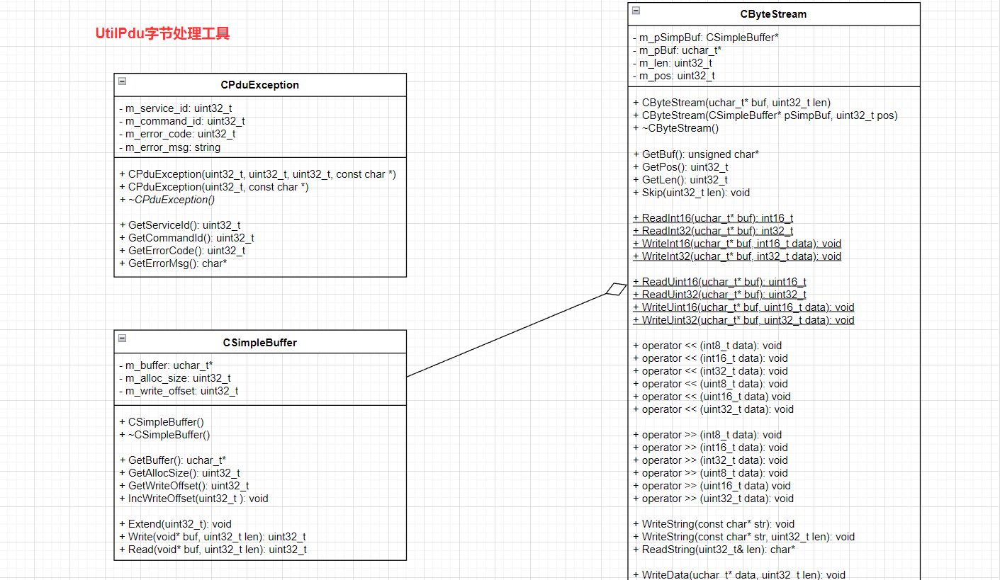

# base目录解析3

---

### 1.impdu


### 2.ImPduBase


### 3.UtilPdu



#### CPduException

```cpp
class CPduException {
public:
	CPduException(uint32_t service_id, uint32_t command_id, uint32_t error_code, const char* error_msg) {
		m_service_id = service_id;
		m_command_id = command_id;
		m_error_code = error_code;
		m_error_msg = error_msg;
	}
	CPduException(uint32_t error_code, const char* error_msg) {
		m_service_id = 0;
		m_command_id = 0;
		m_error_code = error_code;
		m_error_msg = error_msg;
	}
	virtual ~CPduException() {}

	uint32_t GetServiceId() { return m_service_id; }
	uint32_t GetCommandId() { return m_command_id; }
	uint32_t GetErrorCode() { return m_error_code; }
	char* GetErrorMsg() { return (char*)m_error_msg.c_str(); }
private:
	uint32_t	m_service_id;
	uint32_t	m_command_id;
	uint32_t	m_error_code;
	string		m_error_msg;
};
```

#### CSimpleBuffer

```cpp
class DLL_MODIFIER CSimpleBuffer {
public:
	CSimpleBuffer();
	~CSimpleBuffer();
	uchar_t*  GetBuffer() { return m_buffer; }
	uint32_t GetAllocSize() { return m_alloc_size; }
	uint32_t GetWriteOffset() { return m_write_offset; }
	void IncWriteOffset(uint32_t len) { m_write_offset += len; }

	//扩展内部缓冲区的大小
	void Extend(uint32_t len);
	//向内部缓冲区写入数据
	uint32_t Write(void* buf, uint32_t len);
	//从内部缓冲区读取数据
	uint32_t Read(void* buf, uint32_t len);
private:
	uchar_t*	m_buffer;//内部缓冲区的指针uchar_t*
	uint32_t	m_alloc_size;//内部缓冲区的总大小
	uint32_t	m_write_offset;//当前写入位置的偏移量 
};
```

```cpp
CSimpleBuffer::CSimpleBuffer() {
    m_buffer = NULL;
    m_alloc_size = 0;
    m_write_offset = 0;
}

CSimpleBuffer::~CSimpleBuffer() {
    m_alloc_size = 0;
    m_write_offset = 0;
    if (m_buffer) {
        free(m_buffer);
        m_buffer = NULL;
    }
}

void CSimpleBuffer::Extend(uint32_t len) {
    m_alloc_size = m_write_offset + len;
    m_alloc_size += m_alloc_size >> 2;//扩展为原始大小的 1.25(5/4) 倍数
    uchar_t* new_buf = (uchar_t*)realloc(m_buffer, m_alloc_size);
    m_buffer = new_buf;
}

uint32_t CSimpleBuffer::Write(void* buf, uint32_t len) {
    if (m_write_offset + len > m_alloc_size) Extend(len);
    if (buf) memcpy(m_buffer + m_write_offset, buf, len);
    m_write_offset += len;
    return len;
}

uint32_t CSimpleBuffer::Read(void* buf, uint32_t len) {
    if (0 == len) return len;
    if (len > m_write_offset) len = m_write_offset;
    if (buf) memcpy(buf, m_buffer, len);
    m_write_offset -= len;
    //将m_buffer中的数据向前移动len个字节盖原来的数据
    memmove(m_buffer, m_buffer + len, m_write_offset);
    return len;
}
```


#### CByteStream

```cpp
class CByteStream {
public:
	CByteStream(uchar_t* buf, uint32_t len);
	CByteStream(CSimpleBuffer* pSimpBuf, uint32_t pos);
	~CByteStream() {}

	unsigned char* GetBuf() { return m_pSimpBuf ? m_pSimpBuf->GetBuffer() : m_pBuf; }
	uint32_t GetPos() { return m_pos; }
	uint32_t GetLen() { return m_len; }

	void Skip(uint32_t len) {
		m_pos += len;
		if(m_pos > m_len) throw CPduException(ERROR_CODE_PARSE_FAILED, "parase packet failed!");
	}

	static int16_t ReadInt16(uchar_t* buf);
	static int32_t ReadInt32(uchar_t* buf);
	static void WriteInt16(uchar_t* buf, int16_t data);
	static void WriteInt32(uchar_t* buf, int32_t data);

	static uint16_t ReadUint16(uchar_t* buf);
	static uint32_t ReadUint32(uchar_t* buf);
	static void WriteUint16(uchar_t* buf, uint16_t data);
	static void WriteUint32(uchar_t* buf, uint32_t data);

	void operator << (int8_t data);
	void operator << (int16_t data);
	void operator << (int32_t data);
	void operator << (uint8_t data);
	void operator << (uint16_t data);
	void operator << (uint32_t data);

	void operator >> (int8_t& data);
	void operator >> (int16_t& data);
	void operator >> (int32_t& data);
	void operator >> (uint8_t& data);
	void operator >> (uint16_t& data);
	void operator >> (uint32_t& data);
	
	void WriteString(const char* str);
	void WriteString(const char* str, uint32_t len);
	char* ReadString(uint32_t& len);

	void WriteData(uchar_t* data, uint32_t len);
	uchar_t* ReadData(uint32_t& len);
private:
	void _WriteByte(void* buf, uint32_t len);
	void _ReadByte(void* buf, uint32_t len);
private:
	CSimpleBuffer*	m_pSimpBuf;
	uchar_t*		m_pBuf;//unsigned char
	uint32_t		m_len;
	uint32_t		m_pos;
};
```

```cpp
CByteStream::CByteStream(uchar_t* buf, uint32_t len) {
    m_pBuf = buf;
    m_len = len;
    m_pSimpBuf = NULL;
    m_pos = 0;
}

CByteStream::CByteStream(CSimpleBuffer* pSimpBuf, uint32_t pos) {
    m_pSimpBuf = pSimpBuf;
    m_pos = pos;
    m_pBuf = NULL;
    m_len = 0;
}
```

```cpp
//字节数组和uint16_t int6_t uint32_t int32_t等数字的相互转换
int16_t CByteStream::ReadInt16(uchar_t* buf) {
    int16_t data = (buf[0] << 8) | buf[1];
    return data;
}

uint16_t CByteStream::ReadUint16(uchar_t* buf) {
    uint16_t data = (buf[0] << 8) | buf[1];
    return data;
}

int32_t CByteStream::ReadInt32(uchar_t* buf) {
    int32_t data = (buf[0] << 24) | (buf[1] << 16) | (buf[2] << 8) | buf[3];
    return data;
}

uint32_t CByteStream::ReadUint32(uchar_t* buf) {
    uint32_t data = (buf[0] << 24) | (buf[1] << 16) | (buf[2] << 8) | buf[3];
    return data;
}

void CByteStream::WriteInt16(uchar_t* buf, int16_t data) {
    buf[0] = static_cast<uchar_t>(data >> 8);
    buf[1] = static_cast<uchar_t>(data & 0xFF);
}

void CByteStream::WriteUint16(uchar_t* buf, uint16_t data) {
    buf[0] = static_cast<uchar_t>(data >> 8);
    buf[1] = static_cast<uchar_t>(data & 0xFF);
}

void CByteStream::WriteInt32(uchar_t* buf, int32_t data) {
    buf[0] = static_cast<uchar_t>(data >> 24);
    buf[1] = static_cast<uchar_t>((data >> 16) & 0xFF);
    buf[2] = static_cast<uchar_t>((data >> 8) & 0xFF);
    buf[3] = static_cast<uchar_t>(data & 0xFF);
}

void CByteStream::WriteUint32(uchar_t* buf, uint32_t data) {
    buf[0] = static_cast<uchar_t>(data >> 24);
    buf[1] = static_cast<uchar_t>((data >> 16) & 0xFF);
    buf[2] = static_cast<uchar_t>((data >> 8) & 0xFF);
    buf[3] = static_cast<uchar_t>(data & 0xFF);
}
```

```cpp
//将字符串写入到字节流中
void CByteStream::WriteString(const char* str) {
    uint32_t size = str ? (uint32_t)strlen(str) : 0;//获取字符串的长度
    *this << size;//使用运算符重载函数operator<<将字符串的长度写入到字节流中（将长度作为一个无符号整数写入）
    _WriteByte((void*)str, size);//将字符串内容写入到字节流中 传入参数为字符串的指针和长度
}

void CByteStream::WriteString(const char* str, uint32_t len) {
    *this << len;
    _WriteByte((void*)str, len);
}

//从字节流中读取字符串
char* CByteStream::ReadString(uint32_t& len) {
    *this >> len;//使用运算符重载函数 operator>> 从字节流中读取字符串的长度 存储在参数len中
    char* pStr = (char*)GetBuf() + GetPos();//获取字节流的缓冲区指针，加上当前的读取位置GetPos()得到字符串的起始地址 pStr
    Skip(len);//跳过已经读取的字符串部分 以便后续的读取操作
    return pStr;
}

//向字节流中写入数据
void CByteStream::WriteData(uchar_t* data, uint32_t len) {
    *this << len;//用运算符重载函数 operator<< 将数据的长度 len 写入字节流
    _WriteByte(data, len);//将数据 data 写入字节流，指定写入的长度为len
}

//从字节流中读取数据
uchar_t* CByteStream::ReadData(uint32_t& len) {
    *this >> len;//使用运算符重载函数 operator>> 从字节流中读取数据的长度 len
    uchar_t* pData = (uchar_t*)GetBuf() + GetPos();//当前读取位置 GetPos() + 字节流的起始地址 GetBuf() = 数据指针pData
    Skip(len);//跳过已读取的数据 以便后续的读取操作
    return pData;
}
```

#### URL字符串与uint32_t类型互相转换的作用

URL字符串与uint32_t类型的互相转换可以用于一些特定的应用场景，例如：

1. 缩短URL：将长的URL转换为短的uint32_t类型的整数表示，可以减小URL的长度，方便传输和存储。
2. 数据索引：将URL映射为唯一的uint32_t标识符，可以用于在数据库或索引中进行快速的查找和检索操作。
3. 数据加密：将敏感的URL信息转换为无意义的uint32_t类型的值，以保护数据的安全性和隐私性。
4. 内部数据处理：在内部数据处理过程中，将URL字符串转换为uint32_t类型的整数可以加快计算速度和减少存储空间。

总的来说，URL字符串与uint32_t类型的互相转换可以在某些场景下提供更高效、更紧凑的数据表示和处理方式。具体应用取决于具体需求和业务场景。

```cpp
// 将一个uint32_t类型的整数转换为对应的URL字符串
char* idtourl(uint32_t id) {
    // 1.用于转换的数字和字母字符
    static char digits[] = "0123456789abcdefghijklmnopqrstuvwxyz";
    static char buf[64];
    char* ptr;
    uint32_t value = id * 2 + 56;
    // convert to 36 number system
    ptr = buf + sizeof(buf) - 1;
    *ptr = '\0';

    // 2.循环直到 value 为 0 或者缓冲区指针 ptr 到达缓冲区的起始位置
    do {
        *--ptr = digits[value % 36];
        value /= 36;
    } while (ptr > buf && value);

    // 3.在转换结束后，在缓冲区的最前面添加版本号字符1
    *--ptr = '1'; // add version number

    // 4.返回指向缓冲区的指针ptr
    return ptr;
}

//将URL字符串转换为对应的uint32_t类型的整数
uint32_t urltoid(const char* url) {
    uint32_t url_len = strlen(url);
    char c;
    uint32_t number = 0;//用于存储转换结果的中间值
    for (uint32_t i = 1; i < url_len; i++) {
        //从URL字符串的第二个字符开始遍历（跳过版本号字符1）直到字符串末尾
        c = url[i];
        if (c >= '0' && c <= '9') c -= '0';
        else if (c >= 'a' && c <= 'z') c -= 'a' - 10;
        else if (c >= 'A' && c <= 'Z') c -= 'A' - 10;
        else continue;
        number = number * 36 + c;
    }
    return (number - 56) >> 1;
}
```


### 4.imconn

利用netlib封装了一套比较通用的tcp连接基础类，业务类的连接像CLoginConn用于登录服务器连接和CHttpConn用于http连接等可继承该类重写自己的业务逻辑


### 5.im_conn_util


