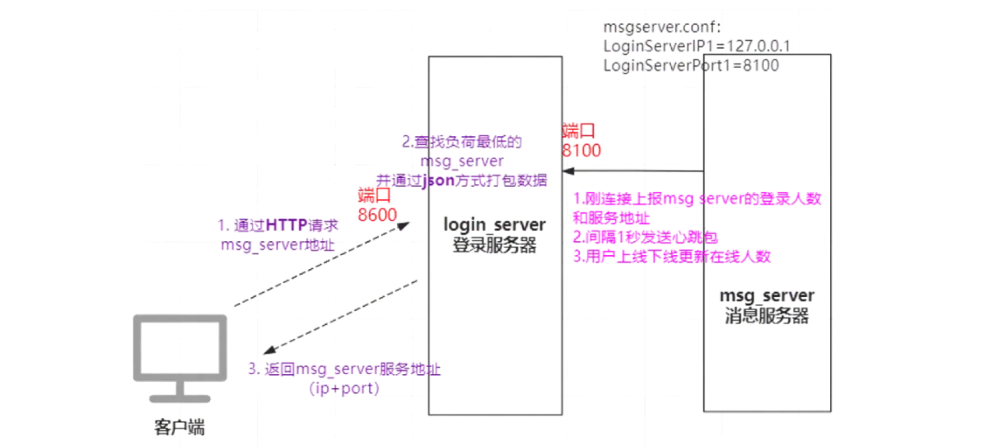

# 登录服务器与消息服务器设计1
---

### 配置文件读取

```cpp
/* ConfigFileReader.h */
#ifndef CONFIGFILEREADER_H_
#define CONFIGFILEREADER_H_

#include "util.h"

class CConfigFileReader {
public:
	CConfigFileReader(const char* filename);
	~CConfigFileReader();

    char* GetConfigName(const char* name);
    int SetConfigValue(const char* name, const char*  value);
private:
    void _LoadFile(const char* filename);
    int _WriteFIle(const char*filename = NULL);
    void _ParseLine(char* line);
    char* _TrimSpace(char* name);

    bool m_load_ok;
    map<string, string> m_config_map;
    string m_config_file;
};

#endif /* CONFIGFILEREADER_H_ */
```

```cpp
#include "ConfigFileReader.h"
CConfigFileReader::CConfigFileReader(const char* filename) {
  _LoadFile(filename);
}

CConfigFileReader::~CConfigFileReader() {}

char* CConfigFileReader::GetConfigName(const char* name) {
	if (!m_load_ok) return NULL;

	char* value = NULL;
	map<string, string>::iterator it = m_config_map.find(name);
	if (it != m_config_map.end()) value = (char*)it->second.c_str();

	return value;
}

int CConfigFileReader::SetConfigValue(const char* name, const char* value) {
	if (!m_load_ok) return -1;

	map<string, string>::iterator it = m_config_map.find(name);
	if (it != m_config_map.end()) it->second = value;
	else m_config_map.insert(make_pair(name, value));
	return _WriteFIle();
}

void CConfigFileReader::_LoadFile(const char* filename) {
	m_config_file.clear();
	m_config_file.append(filename);
	FILE* fp = fopen(filename, "r");
	if (!fp) {
		log_error("can not open %s,errno = %d", filename, errno);
		return;
	}

	char buf[256];
	for (;;) {
		char* p = fgets(buf, 256, fp);
		if (!p) break;

		size_t len = strlen(buf);
		if (buf[len - 1] == '\n') buf[len - 1] = 0;  // remove \n at the end

		char* ch = strchr(buf, '#');  // remove string start with #
		if (ch) *ch = 0;
		if (strlen(buf) == 0) continue;
		_ParseLine(buf);
	}

	fclose(fp);
	m_load_ok = true;
}

int CConfigFileReader::_WriteFIle(const char* filename) {
	FILE* fp = NULL;
	if (filename == NULL) fp = fopen(m_config_file.c_str(), "w");
	else fp = fopen(filename, "w");
	if (fp == NULL) return -1;

	char szPaire[128];
	map<string, string>::iterator it = m_config_map.begin();
	for (; it != m_config_map.end(); it++) {
		memset(szPaire, 0, sizeof(szPaire));
		snprintf(szPaire, sizeof(szPaire), "%s=%s\n", it->first.c_str(), it->second.c_str());
		uint32_t ret = fwrite(szPaire, strlen(szPaire), 1, fp);
		if (ret != 1) {
			fclose(fp);
			return -1;
		}
	}
	fclose(fp);
	return 0;
}

void CConfigFileReader::_ParseLine(char* line) {
	char* p = strchr(line, '=');
	if (p == NULL) return;

	*p = 0;
	char* key = _TrimSpace(line);
	char* value = _TrimSpace(p + 1);
	if (key && value) m_config_map.insert(make_pair(key, value));
}

char* CConfigFileReader::_TrimSpace(char* name) {
	// remove starting space or tab
	char* start_pos = name;
	while ((*start_pos == ' ') || (*start_pos == '\t')) start_pos++;

	if (strlen(start_pos) == 0) return NULL;

	// remove ending space or tab
	char* end_pos = name + strlen(name) - 1;
	while ((*end_pos == ' ') || (*end_pos == '\t')) {
		*end_pos = 0;
		end_pos--;
	}

	int len = (int)(end_pos - start_pos) + 1;
	if (len <= 0) return NULL;

	return start_pos;
}
```


### login_server

login_server主要是用于做负载均衡的，

**客户端与login_server之间的通信**

客户端发送http请求给login_server，主要是去查找哪一个msg_server负载少的，

login_server通过json的方式返回msg_server的服务器地址ip+port，发送回给客户端，

**msg_server与login_server之间的通信**

1. msg_server与login_server之间也是保持tcp长连接，当msg_server连接上login_server时会将msg_server上登录的人数与服务器地址上报给login_server
2. 并且msg_server与login_server之间也有心跳机制，msg_server不断发送心跳包给login_server从而确认msg_server正常运行
3. 用户上线下线时也会不断发消息更新到login_server中去




### login_server.cpp

```cpp
#include "ConfigFileReader.h"
#include "HttpConn.h"
#include "LoginConn.h"
#include "ipparser.h"
#include "netlib.h"
#include "version.h"

IpParser* pIpParser = NULL;
string strMsfsUrl;
string strDiscovery;  // 发现获取地址
void client_callback(void* callback_data, uint8_t msg, uint32_t handle, void* pParam) {
  if (msg == NETLIB_MSG_CONNECT) {
    CLoginConn* pConn = new CLoginConn();
    pConn->OnConnect2(handle, LOGIN_CONN_TYPE_CLIENT);
  } else {
    log_error("!!!error msg: %d ", msg);
  }
}

// this callback will be replaced by imconn_callback() in OnConnect()
// msg_server请求连接事件
void msg_serv_callback(void* callback_data, uint8_t msg, uint32_t handle, void* pParam) {
  log("msg_server come in");

  if (msg == NETLIB_MSG_CONNECT) {
    CLoginConn* pConn = new CLoginConn();
    pConn->OnConnect2(handle, LOGIN_CONN_TYPE_MSG_SERV);
  } else {
    log_error("!!!error msg: %d ", msg);
  }
}

// Android、IOS、PC等客户端请求连接事件
void http_callback(void* callback_data, uint8_t msg, uint32_t handle, void* pParam) {
  if (msg == NETLIB_MSG_CONNECT) {
    // 这里是不是觉得很奇怪,为什么new了对象却没有释放?
    // 实际上对象在被Close时使用delete this的方式释放自己
    CHttpConn* pConn = new CHttpConn();
    pConn->OnConnect(handle);
  } else {
    log_error("!!!error msg: %d ", msg);
  }
}

int main(int argc, char* argv[]) {
  if ((argc == 2) && (strcmp(argv[1], "-v") == 0)) {
    log_fatal("Server Version: LoginServer/%s\n", VERSION);
    log_fatal("Server Build: %s %s\n", __DATE__, __TIME__);
    return 0;
  }

  signal(SIGPIPE, SIG_IGN);

  // 1.配置文件读取
  CConfigFileReader config_file("loginserver.conf");

  char* client_listen_ip = config_file.GetConfigName("ClientListenIP");
  char* str_client_port = config_file.GetConfigName("ClientPort");
  char* http_listen_ip = config_file.GetConfigName("HttpListenIP");
  char* str_http_port = config_file.GetConfigName("HttpPort");
  char* msg_server_listen_ip = config_file.GetConfigName("MsgServerListenIP");
  char* str_msg_server_port = config_file.GetConfigName("MsgServerPort");
  char* str_msfs_url = config_file.GetConfigName("msfs");
  char* str_discovery = config_file.GetConfigName("discovery");

  if (!msg_server_listen_ip || !str_msg_server_port || !http_listen_ip ||
      !str_http_port || !str_msfs_url || !str_discovery) {
    log("config item missing, exit... ");
    return -1;
  }

  uint16_t client_port = atoi(str_client_port);
  uint16_t msg_server_port = atoi(str_msg_server_port);
  uint16_t http_port = atoi(str_http_port);
  strMsfsUrl = str_msfs_url;
  strDiscovery = str_discovery;

  // 2.开始监听 对应的ip与端口号 调用对应的回调函数
  pIpParser = new IpParser();

  int ret = netlib_init();

  if (ret == NETLIB_ERROR) return ret;
  CStrExplode client_listen_ip_list(client_listen_ip, ';');
  for (uint32_t i = 0; i < client_listen_ip_list.GetItemCnt(); i++) {
    ret = netlib_listen(client_listen_ip_list.GetItem(i), client_port, client_callback, NULL);
    if (ret == NETLIB_ERROR) return ret;
  }

  CStrExplode msg_server_listen_ip_list(msg_server_listen_ip, ';');
  for (uint32_t i = 0; i < msg_server_listen_ip_list.GetItemCnt(); i++) {
    ret = netlib_listen(msg_server_listen_ip_list.GetItem(i), msg_server_port, msg_serv_callback, NULL);
    if (ret == NETLIB_ERROR) return ret;
  }

  CStrExplode http_listen_ip_list(http_listen_ip, ';');
  for (uint32_t i = 0; i < http_listen_ip_list.GetItemCnt(); i++) {
    ret = netlib_listen(http_listen_ip_list.GetItem(i), http_port, http_callback, NULL);
    if (ret == NETLIB_ERROR) return ret;
  }

  log("server start listen on:\nFor client %s:%d\nFor MsgServer: %s:%d\nFor "
      "http:%s:%d\n",
      client_listen_ip, client_port, msg_server_listen_ip, msg_server_port,
      http_listen_ip, http_port);
  init_login_conn();
  init_http_conn();

  log("now enter the event loop...\n");

  writePid();

  netlib_eventloop();

  return 0;
}
```

监听 对应的ip与端口号 调用对应的回调函数client_callback、msg_serv_callback、http_callback

对于reactor模型回调函数是非常重要的，监听时监听不同，<font color='#BAOC2F'>不同的端口要处理什么业务</font>是需要<font color='#BAOC2F'>由对应的回调函数来决定的</font>，

```cpp
  CStrExplode client_listen_ip_list(client_listen_ip, ';');
  for (uint32_t i = 0; i < client_listen_ip_list.GetItemCnt(); i++) {
    ret = netlib_listen(client_listen_ip_list.GetItem(i), client_port, client_callback, NULL);
    if (ret == NETLIB_ERROR) return ret;
  }

  CStrExplode msg_server_listen_ip_list(msg_server_listen_ip, ';');
  for (uint32_t i = 0; i < msg_server_listen_ip_list.GetItemCnt(); i++) {
    ret = netlib_listen(msg_server_listen_ip_list.GetItem(i), msg_server_port, msg_serv_callback, NULL);
    if (ret == NETLIB_ERROR) return ret;
  }

  CStrExplode http_listen_ip_list(http_listen_ip, ';');
  for (uint32_t i = 0; i < http_listen_ip_list.GetItemCnt(); i++) {
    ret = netlib_listen(http_listen_ip_list.GetItem(i), http_port, http_callback, NULL);
    if (ret == NETLIB_ERROR) return ret;
  }
```

#### http_callback

对于http_callback函数，

如果有http客户端请求则会创建一个`CHttpConn();`服务对象，通过http的方式去解析数据，然后对数据进行处理，最后将response响应发回给客户端，

```cpp
// Android、IOS、PC等客户端请求连接事件
void http_callback(void* callback_data, uint8_t msg, uint32_t handle, void* pParam) {
  if (msg == NETLIB_MSG_CONNECT) {
    // 这里是不是觉得很奇怪,为什么new了对象却没有释放?
    // 实际上对象在被Close时使用delete this的方式释放自己
    CHttpConn* pConn = new CHttpConn();
    pConn->OnConnect(handle);
  } else {
    log_error("!!!error msg: %d ", msg);
  }
}
```

##### HttpConn.h

```cpp
#ifndef __HTTP_CONN_H__
#define __HTTP_CONN_H__

#include "HttpParserWrapper.h"
#include "netlib.h"
#include "util.h"

#define HTTP_CONN_TIMEOUT 60000

#define READ_BUF_SIZE 2048
#define HTTP_RESPONSE_HTML \
  "HTTP/1.1 200 OK\r\n"    \
  "Connection:close\r\n"   \
  "Content-Length:%d\r\n"  \
  "Content-Type:text/html;charset=utf-8\r\n\r\n%s"
#define HTTP_RESPONSE_HTML_MAX 1024

enum {
  CONN_STATE_IDLE,
  CONN_STATE_CONNECTED,
  CONN_STATE_OPEN,
  CONN_STATE_CLOSED,
};

class CHttpConn : public CRefObject {
 public:
  CHttpConn();
  virtual ~CHttpConn();

  uint32_t GetConnHandle() { return m_conn_handle; }
  char* GetPeerIP() { return (char*)m_peer_ip.c_str(); }

  int Send(void* data, int len);

  void Close();
  void OnConnect(net_handle_t handle);
  void OnRead();
  void OnWrite();
  void OnClose();
  void OnTimer(uint64_t curr_tick);
  void OnWriteComlete();

 private:
  void _HandleMsgServRequest(string& url, string& post_data);

 protected:
  net_handle_t m_sock_handle;
  uint32_t m_conn_handle;
  bool m_busy;

  uint32_t m_state;
  std::string m_peer_ip;
  uint16_t m_peer_port;
  CSimpleBuffer m_in_buf;
  CSimpleBuffer m_out_buf;

  uint64_t m_last_send_tick;
  uint64_t m_last_recv_tick;

  CHttpParserWrapper m_cHttpParser;
};

typedef hash_map<uint32_t, CHttpConn*> HttpConnMap_t;

CHttpConn* FindHttpConnByHandle(uint32_t handle);
void init_http_conn();

#endif /* IMCONN_H_ */
```

##### 数据读取OnRead

读取数据解析http数据，然后调用_HandleMsgServRequest函数进行数据处理，

```cpp
void CHttpConn::OnRead() {
  for (;;) {
    uint32_t free_buf_len = m_in_buf.GetAllocSize() - m_in_buf.GetWriteOffset();
    if (free_buf_len < READ_BUF_SIZE + 1) m_in_buf.Extend(READ_BUF_SIZE + 1);

    int ret = netlib_recv(m_sock_handle,
                          m_in_buf.GetBuffer() + m_in_buf.GetWriteOffset(),
                          READ_BUF_SIZE);
    if (ret <= 0) break;

    m_in_buf.IncWriteOffset(ret);

    m_last_recv_tick = get_tick_count();
  }

  // 每次请求对应一个HTTP连接，所以读完数据后，不用在同一个连接里面准备读取下个请求
  char* in_buf = (char*)m_in_buf.GetBuffer();
  uint32_t buf_len = m_in_buf.GetWriteOffset();
  in_buf[buf_len] = '\0';

  // 如果buf_len 过长可能是受到攻击，则断开连接
  // 正常的url最大长度为2048，我们接受的所有数据长度不得大于1K
  if (buf_len > 1024) {
    log_error("get too much data:%s ", in_buf);
    Close();
    return;
  }

  // log("OnRead, buf_len=%u, conn_handle=%u\n", buf_len, m_conn_handle); // for
  // debug

  // 解析http数据
  m_cHttpParser.ParseHttpContent(in_buf, buf_len);

  if (m_cHttpParser.IsReadAll()) {
    string url = m_cHttpParser.GetUrl();
    if (strncmp(url.c_str(), "/msg_server", 11) == 0) {  // 路由判断
      string content = m_cHttpParser.GetBodyContent();
      _HandleMsgServRequest(url, content);
    } else {
      log_error("url unknown, url=%s ", url.c_str());
      Close();
    }
  }
}
```

##### 数据处理_HandleMsgServRequest

将负载较小的msg_server服务器的ip与端口填充到json中，并发送数据回客户端，

```cpp
// Add By Lanhu 2014-12-19 通过登陆IP来优选电信还是联通IP
void CHttpConn::_HandleMsgServRequest(string& url, string& post_data) {
  msg_serv_info_t* pMsgServInfo;
  uint32_t min_user_cnt = (uint32_t)-1;
  map<uint32_t, msg_serv_info_t*>::iterator it_min_conn = g_msg_serv_info.end();
  map<uint32_t, msg_serv_info_t*>::iterator it;
  log("url:%s, post_data:%s", url.c_str(), post_data.c_str());

  if (g_msg_serv_info.size() <= 0)  // 没有可用的msg_server
  {
    Json::Value value;
    value["code"] = 1;
    value["msg"] = "没有msg_server";
    string strContent = value.toStyledString();
    char* szContent = new char[HTTP_RESPONSE_HTML_MAX];
    snprintf(szContent, HTTP_RESPONSE_HTML_MAX, HTTP_RESPONSE_HTML,
             strContent.length(), strContent.c_str());
    Send((void*)szContent, strlen(szContent));
    delete[] szContent;
    return;
  }

  // 查找负载最小的msg_server
  for (it = g_msg_serv_info.begin(); it != g_msg_serv_info.end(); it++) {
    pMsgServInfo = it->second;
    if ((pMsgServInfo->cur_conn_cnt < pMsgServInfo->max_conn_cnt) &&
        (pMsgServInfo->cur_conn_cnt < min_user_cnt)) {
      it_min_conn = it;
      min_user_cnt = pMsgServInfo->cur_conn_cnt;
    }
  }

  if (it_min_conn == g_msg_serv_info.end()) {
    log("All TCP MsgServer are full ");
    Json::Value value;
    value["code"] = 2;
    value["msg"] = "负载过高";
    string strContent = value.toStyledString();
    char* szContent = new char[HTTP_RESPONSE_HTML_MAX];
    snprintf(szContent, HTTP_RESPONSE_HTML_MAX, HTTP_RESPONSE_HTML,
             strContent.length(), strContent.c_str());
    Send((void*)szContent, strlen(szContent));
    delete[] szContent;
    return;
  } else {  // 找到合适的msg_server
    Json::Value value;
    value["code"] = 0;
    value["msg"] = "";
    if (pIpParser->isTelcome(GetPeerIP())) {
      value["priorIP"] = string(it_min_conn->second->ip_addr1);
      value["backupIP"] = string(it_min_conn->second->ip_addr2);
      value["msfsPrior"] = strMsfsUrl;
      value["msfsBackup"] = strMsfsUrl;
    } else {
      value["priorIP"] = string(it_min_conn->second->ip_addr2);
      value["backupIP"] = string(it_min_conn->second->ip_addr1);
      value["msfsPrior"] = strMsfsUrl;
      value["msfsBackup"] = strMsfsUrl;
    }
    value["discovery"] = strDiscovery;
    value["port"] = int2string(it_min_conn->second->port);
    string strContent = value.toStyledString();
    char* szContent = new char[HTTP_RESPONSE_HTML_MAX];
    uint32_t nLen = strContent.length();
    snprintf(szContent, HTTP_RESPONSE_HTML_MAX, HTTP_RESPONSE_HTML, nLen,
             strContent.c_str());
    Send((void*)szContent, strlen(szContent));
    delete[] szContent;
    return;
  }
}
```


#### msg_serv_callback&client_callback

对于msg_serv_callback函数，

如果有http客户端请求则会创建一个`CLoginConn();`服务对象，通过http的方式去解析数据，然后对数据进行处理，最后将response响应发回给客户端，

```cpp
// this callback will be replaced by imconn_callback() in OnConnect()
// msg_server请求连接事件
void msg_serv_callback(void* callback_data, uint8_t msg, uint32_t handle, void* pParam) {
  log("msg_server come in");

  if (msg == NETLIB_MSG_CONNECT) {
    CLoginConn* pConn = new CLoginConn();
    pConn->OnConnect2(handle, LOGIN_CONN_TYPE_MSG_SERV);
  } else {
    log_error("!!!error msg: %d ", msg);
  }
}
```

对于client_callback函数，

如果有http客户端请求则会创建一个`CLoginConn();`服务对象，通过http的方式去解析数据，然后对数据进行处理，最后将response响应发回给客户端，

```cpp
void client_callback(void* callback_data, uint8_t msg, uint32_t handle, void* pParam) {
  if (msg == NETLIB_MSG_CONNECT) {
    CLoginConn* pConn = new CLoginConn();
    pConn->OnConnect2(handle, LOGIN_CONN_TYPE_CLIENT);
  } else {
    log_error("!!!error msg: %d ", msg);
  }
}
```

##### LoginConn.h

```cpp
#ifndef LOGINCONN_H_
#define LOGINCONN_H_

#include "imconn.h"

enum { LOGIN_CONN_TYPE_CLIENT = 1, LOGIN_CONN_TYPE_MSG_SERV };

typedef struct {
  string ip_addr1;  // 电信IP
  string ip_addr2;  // 网通IP
  uint16_t port;
  uint32_t max_conn_cnt;
  uint32_t cur_conn_cnt;
  string hostname;  // 消息服务器的主机名
} msg_serv_info_t;

class CLoginConn : public CImConn {
 public:
  CLoginConn();
  virtual ~CLoginConn();

  virtual void Close();

  void OnConnect2(net_handle_t handle, int conn_type);
  virtual void OnClose();
  virtual void OnTimer(uint64_t curr_tick);

  virtual void HandlePdu(CImPdu* pPdu);

 private:
  void _HandleMsgServInfo(CImPdu* pPdu);
  void _HandleUserCntUpdate(CImPdu* pPdu);
  void _HandleMsgServRequest(CImPdu* pPdu);

 private:
  int m_conn_type;
};

void init_login_conn();

#endif /* LOGINCONN_H_ */
```

##### OnConnect2

```cpp
void CLoginConn::OnConnect2(net_handle_t handle, int conn_type) {
  m_handle = handle;
  m_conn_type = conn_type;
  ConnMap_t* conn_map = &g_msg_serv_conn_map;
  if (conn_type == LOGIN_CONN_TYPE_CLIENT) {
    conn_map = &g_client_conn_map;
  } else {
    conn_map->insert(make_pair(handle, this));
  }
  netlib_option(handle, NETLIB_OPT_SET_CALLBACK, (void*)imconn_callback);
  netlib_option(handle, NETLIB_OPT_SET_CALLBACK_DATA, (void*)conn_map);
}
```

##### HandlePdu

```cpp
// HandlePdu在imconn.cpp的OnRead函数中调用
void CLoginConn::HandlePdu(CImPdu* pPdu) {
  log("HandlePdu = %u", pPdu->GetCommandId());
  switch (pPdu->GetCommandId()) {
    case CID_OTHER_HEARTBEAT:
      break;
    case CID_OTHER_MSG_SERV_INFO:
      _HandleMsgServInfo(pPdu);
      break;
    case CID_OTHER_USER_CNT_UPDATE:
      _HandleUserCntUpdate(pPdu);
      break;
    case CID_LOGIN_REQ_MSGSERVER:
      _HandleMsgServRequest(pPdu);
      break;

    default:
      log("wrong msg, cmd id=%d ", pPdu->GetCommandId());
      break;
  }
}
```

LOGIN_CONN_TYPE_MSG_SERV

对于msg_serv_callback回调函数，其传入的参数LOGIN_CONN_TYPE_MSG_SERV在OnConnect2函数中进行了分支，

```cpp
void CLoginConn::_HandleMsgServInfo(CImPdu* pPdu) {
  msg_serv_info_t* pMsgServInfo = new msg_serv_info_t;
  IM::Server::IMMsgServInfo msg;
  msg.ParseFromArray(pPdu->GetBodyData(), pPdu->GetBodyLength());

  pMsgServInfo->ip_addr1 = msg.ip1();
  pMsgServInfo->ip_addr2 = msg.ip2();
  pMsgServInfo->port = msg.port();
  pMsgServInfo->max_conn_cnt = msg.max_conn_cnt();
  pMsgServInfo->cur_conn_cnt = msg.cur_conn_cnt();
  pMsgServInfo->hostname = msg.host_name();
  g_msg_serv_info.insert(make_pair(m_handle, pMsgServInfo));

  g_total_online_user_cnt += pMsgServInfo->cur_conn_cnt;

  log("MsgServInfo, ip_addr1=%s, ip_addr2=%s, port=%d, max_conn_cnt=%d, "
      "cur_conn_cnt=%d, "
      "hostname: %s. ",
      pMsgServInfo->ip_addr1.c_str(), pMsgServInfo->ip_addr2.c_str(),
      pMsgServInfo->port, pMsgServInfo->max_conn_cnt,
      pMsgServInfo->cur_conn_cnt, pMsgServInfo->hostname.c_str());
}
```


##### LOGIN_CONN_TYPE_CLIENT

对于client_callback回调函数，其传入的参数LOGIN_CONN_TYPE_CLIENT在OnConnect2函数中进行了分支，


