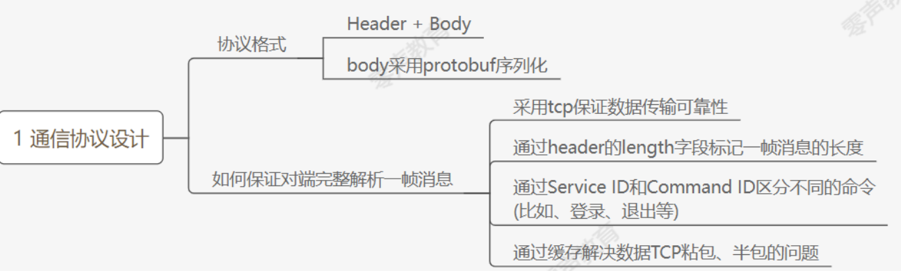
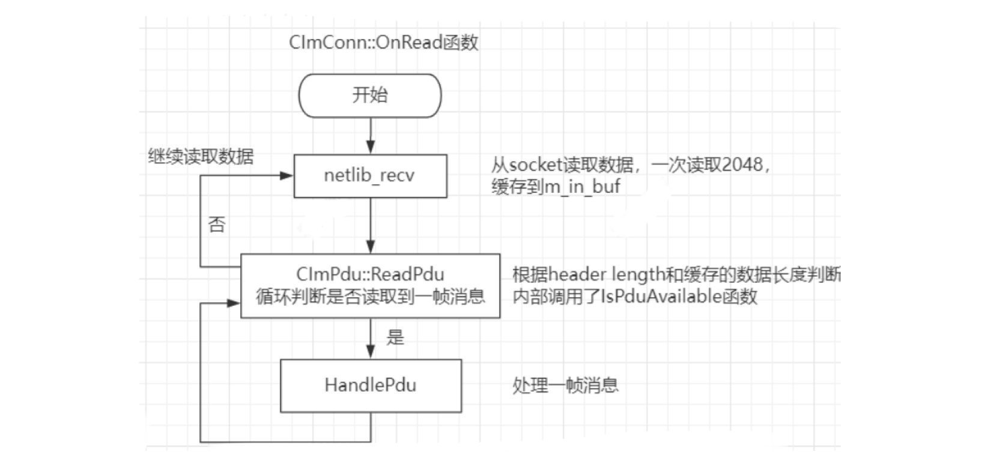

# 通讯协议设计
---

### 1.协议格式



协议格式：Header + body（body采用protobuf序列化）

如何保证对端完整解析——帧消息？

1. 采用tcp保证数据传输的可靠性，
2. 通过header的<font color='#BAOC2F'>length字段</font>标记1帧消息的长度，
3. 通过serviceId和commandId区分不同的命令（如登录、退出等）
4. 通过缓存解决数据TCP粘包、半包的问题

对于消息的处理有很对的消息应答包，从服务器读取消息后需要告诉服务器数据已经读取成功，发送ACK应答包，保证业务逻辑应答的完整性

单纯靠Tcp是无法保证业务逻辑的，需要应答机制保证业务逻辑完整性，

| 协议头字段                              | 类型           | 长度（字节） | 说明                                      |
| --------------------------------------- | -------------- | ------------ | ----------------------------------------- |
| <font color='#BAOC2F'>length</font>     | unsigned int   | 4            | 整个包的长度（协议头+body）               |
| version                                 | unsigned short | 2            | 通信协议的版本号                          |
| appid                                   | unsigned short | 2            | 对外SDK提供服务时，用来识别不同的客户     |
| <font color='#BAOC2F'>service_id</font> | unsigned short | 2            | 对应命令的分组，如login与msg是不同的分组  |
| <font color='#BAOC2F'>command_id</font> | unsigned short | 2            | 分组里面的子命令，如login与login response |
| <font color='#BAOC2F'>seq_num</font>    | unsigned short | 2            | 包序号（保证消息发送的有序性）            |
| reserve                                 | unsigned short | 2            | 预留字节                                  |

```cpp
typedef struct {
    uint32_t length; // the whole pdu length 代表这个包
    uint16_t version; // pdu version number
    uint16_t appid; // not used
    uint16_t service_id; //service_id
    uint16_t command_id; //command_id
    uint16_t seq_num; // 包序号
    uint16_t reversed; // 保留
} PduHeader_t;
```

Header + body

| body字段 | 类型            | 长度（字节） | 说明                              |
| -------- | --------------- | ------------ | --------------------------------- |
| body     | unsigned char[] | n            | 具体的协议数据（具体的proto内容） |


### 2.service_id

所有协议并非完全一致，有些协议不知道具体放在哪个文件合适，就挑选了一个相对合适的文件放入。

1. IM.BaseDefine.proto：该文件定义了service_id,command_id以及一些基础数据结构，如用户，部门等
2. IM.Buddy.proto：该文件定义了与最近联系人，会话相关的协议。
3. IM.File.proto：该文件定义了文件传输相关的协议，但是暂未使用。
4. IM.Group.proto：该文件定义了与群组相关的协议。
5. IM.Login.proto：该文件定义了与登录相关的协议。
6. IM.Message.proto：该文件定义了与消息相关的协议
7. IM.Other.proto：该文件目前只有一个心跳协议。
8. IM.Server.proto：该文件定义了服务端之间专属的协议
9. IM.SwitchService.proto：该文件定义了用户之间的P2P消息，比如正在输入等，服务端不关心具体协议内容，只做转发，客户端互相之间知道协议的含义。

```protobuf
// service id
enum ServiceID{
    SID_LOGIN           = 0x0001;           // 用于登录服务
    SID_BUDDY_LIST      = 0x0002;		    // 用于好友列表服务
    SID_MSG             = 0x0003;           // 用于消息服务
    SID_GROUP           = 0x0004;           // 用于群组消息服务
    SID_FILE            = 0x0005;           // 用于文件传输服务
    SID_SWITCH_SERVICE  = 0x0006;           // 用于切换服务
    SID_OTHER           = 0x0007;           // 用于其他服务
    SID_INTERNAL        = 0x0008;		    // 用于内部服务
}
```

#### LoginCmdID

```cpp
// command id for buddy list
enum BuddyListCmdID{
    CID_BUDDY_LIST_RECENT_CONTACT_SESSION_REQUEST       = 0x0201;   //最近联系人会话请求
    CID_BUDDY_LIST_RECENT_CONTACT_SESSION_RESPONSE      = 0x0202;
    CID_BUDDY_LIST_STATUS_NOTIFY                        = 0x0203;   //用户状态通知
    CID_BUDDY_LIST_USER_INFO_REQUEST                    = 0x0204;   //用户信息请求
    CID_BUDDY_LIST_USER_INFO_RESPONSE                   = 0x0205;
    //其中带了一个latest_update_time字段，请求应答会返回latest_update_time时间之后发生变化的用户回来 
    CID_BUDDY_LIST_REMOVE_SESSION_REQ                   = 0x0206;   //删除最近会话请求
    CID_BUDDY_LIST_REMOVE_SESSION_RES                   = 0x0207;
    CID_BUDDY_LIST_ALL_USER_REQUEST                     = 0x0208;   //所有用户请求
    CID_BUDDY_LIST_ALL_USER_RESPONSE                    = 0x0209;
    CID_BUDDY_LIST_USERS_STATUS_REQUEST                 = 0x020a;   //用户状态请求
    CID_BUDDY_LIST_USERS_STATUS_RESPONSE                = 0x020b;
    CID_BUDDY_LIST_CHANGE_AVATAR_REQUEST                = 0x020c;   //更改头像请求(暂时未使用)
    CID_BUDDY_LIST_CHANGE_AVATAR_RESPONSE               = 0x020d;
    CID_BUDDY_LIST_PC_LOGIN_STATUS_NOTIFY               = 0x020e;   //PC登陆后通知移动端
    CID_BUDDY_LIST_REMOVE_SESSION_NOTIFY                = 0x020f;   //删除会话后的通知，用于多端同步
    CID_BUDDY_LIST_DEPARTMENT_REQUEST                   = 0x0210;   //部门信息请求
    CID_BUDDY_LIST_DEPARTMENT_RESPONSE                  = 0x0211;
    CID_BUDDY_LIST_AVATAR_CHANGED_NOTIFY                = 0x0212;   //头像更改通知
    CID_BUDDY_LIST_CHANGE_SIGN_INFO_REQUEST             = 0x0213;   //修改个性签名请求
    CID_BUDDY_LIST_CHANGE_SIGN_INFO_RESPONSE            = 0x0214;
    CID_BUDDY_LIST_SIGN_INFO_CHANGED_NOTIFY             = 0x0215;   //签名修改通知
}
```

#### MessageCmdID

```cpp
// command id for msg
enum MessageCmdID{
    CID_MSG_DATA					= 0x0301;	//发送消息
    CID_MSG_DATA_ACK				= 0x0302;   //消息收到应答
    CID_MSG_READ_ACK				= 0x0303; 	//消息已读应答
    CID_MSG_READ_NOTIFY     		= 0x0304;   //消息已读通知，用于多端同步
    CID_MSG_TIME_REQUEST 			= 0x0305;	//服务器时间请求
    CID_MSG_TIME_RESPONSE			= 0x0306;   
    CID_MSG_UNREAD_CNT_REQUEST		= 0x0307; 	//未读消息计数请求
    CID_MSG_UNREAD_CNT_RESPONSE		= 0x0308;
    CID_MSG_LIST_REQUEST            = 0x0309;   //获取消息请求
    CID_MSG_LIST_RESPONSE           = 0x030a;
    CID_MSG_GET_LATEST_MSG_ID_REQ   = 0x030b;   //获取某个会话最新msg_id请求
    CID_MSG_GET_LATEST_MSG_ID_RSP   = 0x030c;
    CID_MSG_GET_BY_MSG_ID_REQ       = 0x030d;   //通过msg_id获取消息请求
    CID_MSG_GET_BY_MSG_ID_RES       = 0x030e;
}
```

#### SID_MSG 消息相关

```cpp
// command id for msg
enum MessageCmdID{
    CID_MSG_DATA					= 0x0301;	//  对方需要用 CID_MSG_READ_ACK
    CID_MSG_DATA_ACK				= 0x0302; 	//   CID_MSG_DATA_ACK 服务要应答发送端
    CID_MSG_READ_ACK				= 0x0303; 	//
    CID_MSG_READ_NOTIFY     		= 0x0304;    //  已读消息通知
    CID_MSG_TIME_REQUEST 			= 0x0305;	//
    CID_MSG_TIME_RESPONSE			= 0x0306; 	//
    CID_MSG_UNREAD_CNT_REQUEST		= 0x0307; 	//
    CID_MSG_UNREAD_CNT_RESPONSE		= 0x0308;	//
    CID_MSG_LIST_REQUEST            = 0x0309;    //获取指定队列消息
    CID_MSG_LIST_RESPONSE           = 0x030a;
    CID_MSG_GET_LATEST_MSG_ID_REQ   = 0x030b;
    CID_MSG_GET_LATEST_MSG_ID_RSP   = 0x030c;
    CID_MSG_GET_BY_MSG_ID_REQ       = 0x030d;
    CID_MSG_GET_BY_MSG_ID_RES       = 0x030e;
}
```

#### GroupCmdID

```cpp
// command id for group message
enum GroupCmdID{
    CID_GROUP_NORMAL_LIST_REQUEST			= 0x0401;   //用户所在固定群组请求
    CID_GROUP_NORMAL_LIST_RESPONSE			= 0x0402;
    CID_GROUP_INFO_REQUEST          		= 0x0403;   //群组信息请求
    CID_GROUP_INFO_RESPONSE         		= 0x0404;
    CID_GROUP_CREATE_REQUEST                = 0x0405;   //创建群组请求
    CID_GROUP_CREATE_RESPONSE               = 0x0406;
    CID_GROUP_CHANGE_MEMBER_REQUEST 		= 0x0407;   //群组成员变更请求
    CID_GROUP_CHANGE_MEMBER_RESPONSE 		= 0x0408;
    CID_GROUP_SHIELD_GROUP_REQUEST  		= 0x0409;   //屏蔽群组请求
    CID_GROUP_SHIELD_GROUP_RESPONSE 		= 0x040a;
    CID_GROUP_CHANGE_MEMBER_NOTIFY			= 0x040b;   //群组成员变更通知
}
```

#### FileCmdID

```cpp
// command id for file_server
enum FileCmdID{
    CID_FILE_LOGIN_REQ              = 0x0501; // sender/receiver need to login to
    CID_FILE_LOGIN_RES              = 0x0502; // login success or failure
    CID_FILE_STATE                  = 0x0503;
    CID_FILE_PULL_DATA_REQ          = 0x0504;
    CID_FILE_PULL_DATA_RSP          = 0x0505;
    // To MsgServer
    CID_FILE_REQUEST                = 0x0506; // sender -> receiver
    CID_FILE_RESPONSE               = 0x0507; // receiver -> sender
    CID_FILE_NOTIFY                 = 0x0508;
    CID_FILE_HAS_OFFLINE_REQ        = 0x0509;
    CID_FILE_HAS_OFFLINE_RES        = 0x050a;
    CID_FILE_ADD_OFFLINE_REQ        = 0x050b;
    CID_FILE_DEL_OFFLINE_REQ        = 0x050c;
}
```

#### SwitchServiceCmdID

```cpp
// 客户端之间的协议，服务端只做转发
// command id for switch service
enum SwitchServiceCmdID{
    CID_SWITCH_P2P_CMD	= 0x0601;	//客户端之间的协议，服务端不认识，只做转发 例如 正在输入 这些
}
```

#### OtherCmdID

```cpp
// 主要用于msg_server与db_proxy之间的通信
// other command id
enum OtherCmdID{
    CID_OTHER_HEARTBEAT                     = 0x0701;   //心跳协议

    CID_OTHER_STOP_RECV_PACKET              = 0x0702;
    CID_OTHER_VALIDATE_REQ                  = 0x0703;   //客户端登陆认证请求
    CID_OTHER_VALIDATE_RSP                  = 0x0704;
    CID_OTHER_GET_DEVICE_TOKEN_REQ          = 0x0705;   //获取某个用户的设备token请求
    CID_OTHER_GET_DEVICE_TOKEN_RSP          = 0x0706;
    CID_OTHER_ROLE_SET                      = 0x0707;   //服务端主从角色变换，用于route_server
    CID_OTHER_ONLINE_USER_INFO              = 0x0708;   //在线用户信息
    CID_OTHER_MSG_SERV_INFO                 = 0x0709;   //msg_server信息，主要用于msg_server向login_server汇报用
    CID_OTHER_USER_STATUS_UPDATE            = 0x070a;   //用户状态变更
    CID_OTHER_USER_CNT_UPDATE               = 0x070b;   //用户数量变化
    CID_OTHER_SERVER_KICK_USER              = 0x070d;   //服务端踢人
    CID_OTHER_LOGIN_STATUS_NOTIFY           = 0x070e;   //PC登陆通知
    CID_OTHER_PUSH_TO_USER_REQ              = 0x070f;   //发送push通知请求
    CID_OTHER_PUSH_TO_USER_RSP              = 0x0710;
    CID_OTHER_GET_SHIELD_REQ                = 0x0711;   //获取用户屏蔽群设置请求
    CID_OTHER_GET_SHIELD_RSP                = 0x0712;
    CID_OTHER_FILE_TRANSFER_REQ             = 0x0731;   //文件传输请求
    CID_OTHER_FILE_TRANSFER_RSP             = 0x0732;
    CID_OTHER_FILE_SERVER_IP_REQ            = 0x0733;   //文件服务器信息请求
    CID_OTHER_FILE_SERVER_IP_RSP            = 0x0734;
}
```

#### 枚举类型

```cpp
enum ResultType{
	REFUSE_REASON_NONE				= 0;
	REFUSE_REASON_NO_MSG_SERVER		= 1;
	REFUSE_REASON_MSG_SERVER_FULL 	= 2;
	REFUSE_REASON_NO_DB_SERVER		= 3;
	REFUSE_REASON_NO_LOGIN_SERVER	= 4;
	REFUSE_REASON_NO_ROUTE_SERVER	= 5;
	REFUSE_REASON_DB_VALIDATE_FAILED = 6;
	REFUSE_REASON_VERSION_TOO_OLD	= 7;

}

enum KickReasonType{
	KICK_REASON_DUPLICATE_USER = 1;
    KICK_REASON_MOBILE_KICK    = 2;
}

enum OnlineListType{
	ONLINE_LIST_TYPE_FRIEND_LIST = 1;
}

enum UserStatType{
	USER_STATUS_ONLINE 	= 1;
	USER_STATUS_OFFLINE	= 2;
	USER_STATUS_LEAVE	= 3;
}

enum SessionType{
	SESSION_TYPE_SINGLE = 1;          	//单个用户会话
	SESSION_TYPE_GROUP = 2;          	//群会话
}

enum MsgType{
	MSG_TYPE_SINGLE_TEXT    = 0x01;
    MSG_TYPE_SINGLE_AUDIO   = 0x02;
    MSG_TYPE_GROUP_TEXT     = 0x11;
    MSG_TYPE_GROUP_AUDIO    = 0x12;
}

enum ClientType{
	CLIENT_TYPE_WINDOWS     = 0x01;
    CLIENT_TYPE_MAC         = 0x02;
    CLIENT_TYPE_IOS         = 0x11;
    CLIENT_TYPE_ANDROID     = 0x12;
}

enum GroupType{
	GROUP_TYPE_NORMAL		= 0x01;
	GROUP_TYPE_TMP			= 0x02;
}

enum GroupModifyType{
	GROUP_MODIFY_TYPE_ADD	= 0x01;
	GROUP_MODIFY_TYPE_DEL	= 0x02;
}

enum TransferFileType{
    FILE_TYPE_ONLINE        = 0x01;
    FILE_TYPE_OFFLINE       = 0x02;
}

enum ClientFileState{
    CLIENT_FILE_PEER_READY  = 0x00;
    CLIENT_FILE_CANCEL      = 0x01;
    CLIENT_FILE_REFUSE      = 0x02;
    CLIENT_FILE_DONE       = 0x03;
}

enum ClientFileRole{
    CLIENT_REALTIME_SENDER  = 0x01;
    CLIENT_REALTIME_RECVER  = 0x02;
    CLIENT_OFFLINE_UPLOAD   = 0x03;
    CLIENT_OFFLINE_DOWNLOAD = 0x04;
}

enum FileServerError{
    FILE_SERVER_ERRNO_OK                                = 0x00;
    FILE_SERVER_ERRNO_CREATE_TASK_ID_ERROR              = 0x01;
    FILE_SERVER_ERRNO_CREATE_TASK_ERROR                 = 0x02;
    FILE_SERVER_ERRNO_LOGIN_INVALID_TOKEN               = 0x03;
    FILE_SERVER_ERRNO_INVALID_USER_FOR_TASK             = 0x04;
    FILE_SERVER_ERRNO_PULL_DATA_WITH_INVALID_TASK_ID    = 0x05;
    FILE_SERVER_ERRNO_PULL_DATA_ILLIEAGE_USER           = 0x06;
    FILE_SERVER_ERRNO_PULL_DATA_MKDIR_ERROR             = 0x07;
    FILE_SERVER_ERRNO_PULL_DATA_OPEN_FILE_ERROR         = 0x08;
    FILE_SERVER_ERRNO_PULL_DATA_READ_FILE_HEADER_ERROR  = 0x09;
    FILE_SERVER_ERRNO_PULL_DATA_ALLOC_MEM_ERROR         = 0x0a;
    FILE_SERVER_ERRNO_PULL_DATA_SEEK_OFFSET_ERROR       = 0x0b;
    FILE_SERVER_ERRNO_PULL_DATA_FINISHED                = 0x0c;
}

enum SessionStatusType{
    SESSION_STATUS_OK           = 0x00;
    SESSION_STATUS_DELETE       = 0x01;
}

enum DepartmentStatusType{
    DEPT_STATUS_OK              = 0x00;
    DEPT_STATUS_DELETE          = 0x01;
}
```


### 3.帧数据传输的过程

不论是客户端与服务器之间通信，还是服务器与服务器通信，只要是TcpSocket长连接，都遵循这套通信协议进行交流，

1. Socket Tcp（可靠性）
2. 协议设计的边界处理 header +body，通过header的length字段（4字节）解决
3. 通过service id和command id区分不同的命令
4. 通过<font color='#BAOC2F'>缓存解决数据tcp粘包、半包的问题</font>（分析如下） 

例如客户端发送了两帧数据50+100：




如何读取到一帧完整的消息：

1. 先从协议头中读取到length字段，判断读取消息长度
2. CIm::OnRead函数中调用了标准socket netlib_recv接口，进行数据读取，从网络socket中读取数据缓存到m_in_buf缓存区中
3. CIm::ReadPdu函数循环判定是否读取到完整的一帧数据，PDU（head+body）数据单元
4. HandlePdu用于进行反序列化处理操作，将命令解析出来command_id + service_id，最后进行实际的逻辑操作

#### imconn.cpp->CIm::OnRead

当有客户端连接到服务器时，从连接读取数据到buff缓存中

```cpp
//OnRead方法完成了从连接读取数据、解析CImPdu对象并处理的过程
void CImConn::OnRead() {
	// 1.通过循环不断读取数据
    for (;;) {
		// 1-1.在每次循环开始时，检查输入缓冲区m_in_buf的剩余可写空间free_buf_len
        uint32_t free_buf_len = m_in_buf.GetAllocSize() - m_in_buf.GetWriteOffset();
		// 如果不足READ_BUF_SIZE，则扩展输入缓冲区的大小为READ_BUF_SIZE
        if (free_buf_len < READ_BUF_SIZE) m_in_buf.Extend(READ_BUF_SIZE);
        log_debug("handle = %u, netlib_recv into, time = %u\n", m_handle, get_tick_count());

		// 1-2.调用netlib_recv函数从连接中接收数据
        int ret = netlib_recv(m_handle, m_in_buf.GetBuffer() + m_in_buf.GetWriteOffset(), READ_BUF_SIZE);
        if (ret <= 0) break;//ret小于等于0，表示接收失败或连接关闭，跳出循环

		// 1-3.更新已接收的字节数m_recv_bytes和最后一次接收数据的时间戳m_last_recv_tick
        m_recv_bytes += ret;
        m_in_buf.IncWriteOffset(ret);
        m_last_recv_tick = get_tick_count();
    }

	// 2.通过while循环从输入缓冲区中解析出CImPdu对象，并处理每个CImPdu对象
    CImPdu* pPdu = NULL;
    try {
		// 调用CImPdu::ReadPdu方法从输入缓冲区中读取一个完整的CImPdu对象pPdu
        while ((pPdu = CImPdu::ReadPdu(m_in_buf.GetBuffer(), m_in_buf.GetWriteOffset()))) {
			// 2-1.如果成功读取到了CImPdu对象，则获取该对象的长度pdu_len，并调用HandlePdu方法处理该对象
            uint32_t pdu_len = pPdu->GetLength();
            log_debug("handle = %u, pdu_len into = %u\n", m_handle, pdu_len);
            HandlePdu(pPdu);

			// 2-2.从输入缓冲区 m_in_buf 中读取指定长度的数据并将其丢弃
			// 通过将参数设置为 NULL 和 pdu_len，即表示从输入缓冲区中读取 pdu_len 长度的数据，但是并不保存读取的数据
			// 作用是丢弃输入缓冲区中指定长度的数据，以便在处理完相应的 CImPdu 对象后，将这部分数据从输入缓冲区中移除
            m_in_buf.Read(NULL, pdu_len);

			// 2-3.删除已处理的CImPdu对象，并将pPdu置为NULL
            delete pPdu;
            pPdu = NULL;
        }
    } catch (CPduException& ex) {
		// 2-4.如果在解析过程中捕获到CPduException异常，表示解析出现错误，记录错误信息并关闭连接
        log_error("!!!catch exception, sid=%u, cid=%u, err_code=%u, err_msg=%s, close the connection ",
            ex.GetServiceId(), ex.GetCommandId(), ex.GetErrorCode(), ex.GetErrorMsg());
        if (pPdu) {
            delete pPdu;
            pPdu = NULL;
        }
        OnClose();
    }
}
```

#### ImPduBase.cpp->CImPdu::ReadPdu

从给定的缓冲区 buf 中解析出一个完整的 PDU，并返回一个新创建的 CImPdu 对象

```cpp
/// @brief 从给定的缓冲区 buf 中解析出一个完整的 PDU，并返回一个新创建的 CImPdu 对象
/// @param buf 缓冲区
/// @param len 缓冲区长度
/// @return 
CImPdu* CImPdu::ReadPdu(uchar_t* buf, uint32_t len) {
    uint32_t pdu_len = 0;
    // 1.检查给定缓冲区中是否存在完整的 PDU 数据
    if (!IsPduAvailable(buf, len, pdu_len)) return NULL;

    // 2.从缓冲区 buf 中读取 service_id 和 command_id 字段，分别存储在对应的变量中
    uint16_t service_id = CByteStream::ReadUint16(buf + 8);
    uint16_t command_id = CByteStream::ReadUint16(buf + 10);
    
    CImPdu* pPdu = NULL;
    pPdu = new CImPdu();
    // 3.调用pPdu->Write(buf, pdu_len)将缓冲区buf中的数据写入到pPdu对象的内部缓冲区中（消息体）
    pPdu->Write(buf, pdu_len);
    
    // 4.调用pPdu->ReadPduHeader(buf, IM_PDU_HEADER_LEN)解析pPdu对象的PDU头部信息（消息头）
    pPdu->ReadPduHeader(buf, IM_PDU_HEADER_LEN);

    return pPdu;
}
```

#### imconn.cpp->CImConn::HandlePdu

HandlePdu对获取到的数据进行反序列化，

每个业务逻辑都是在这个HandlePdu中处理包，HandlePdu是一个虚函数需要具体的子类去实现，从而才能完成具体的业务逻辑，

```
virtual void HandlePdu(CImPdu* pPdu) {}
```


# 相关问题

### 1.protobuf

protobuf（protocol buffer）是google 的一种<font color='#BAOC2F'>数据交换的格式</font>，它独立于平台语言。

google 提供了protobuf多种语言的实现：java、c#、c++、go和python，每一种实现都包含了<font color='#BAOC2F'>相应语言的编译器以及库文件</font>。

由于它是一种二进制的格式，比使用 xml、json进行数据交换快很多，可以用于<font color='#BAOC2F'>分布式应用之间的数据通信</font>或者<font color='#BAOC2F'>异构环境下的数据交换</font>。

作为一种效率和兼容性都很优秀的二进制数据传输格式，可以用于诸如<font color='#BAOC2F'>网络传输</font>、<font color='#BAOC2F'>配置文件</font>、<font color='#BAOC2F'>数据存储</font>等诸多领域。

- 数据的序列化：将封装的好的一些面向对象的数据 转换为 字节流或字符流
- 数据的反序列化：将从网络中接受到的字节流或字符流 转换为 面向对象的数据

1. 解压压缩包：unzip protobuf-master.zip
2. 进入解压后的文件夹：cd protobuf-master
3. 安装所需工具：sudo apt-get install autoconf automake libtool curl make g++ unzip
4. 自动生成configure配置文件：sudo ./autogen.sh
5. 配置环境：sudo ./configure --prefix=/usr/local/protobuf
6. 编译源代码(时间比较长)：sudo make
7. 刷新共享库：sudo ldconfig

```cpp
syntax = "proto3";
package fixbug;
option cc_generic_services = true;

message LoginRequest {
    string name = 1;
    string pwd = 2;
}

message RegRequest {
    string name = 1;
    string pwd = 2;
    int32 age = 3;
    enum SEX {
        MAN = 0;
        WOMAN = 1;
    }
    SEX sex = 4;
    string phone = 5;
}

message Response {
    int32 errorno = 1;
    string errormsg = 2;
    bool result = 3;
}

// 定义RPC服务接口类和服务方法
service UserServiceRpc{
    rpc login(LoginRequest) returns (Response);
    rpc reg(RegRequest) returns (Response);
}
```


### 2.protobuf在teamtalk中是如何应用的？

在TeamTalk中，Protocol Buffers（protobuf）被广泛应用于消息的序列化和反序列化。

protobuf是一种<font color='#BAOC2F'>轻量级的数据交换格式</font>，能够高效地<font color='#BAOC2F'>将结构化数据序列化为二进制格式</font>，以便于在网络传输和存储过程中使用。

1. 在TeamTalk的设计中，各种消息类型都通过protobuf进行定义和编解码。具体来说，protobuf用于定义消息的数据结构和字段，然后根据这些定义生成对应的编解码器。在客户端和服务器端之间的通信过程中，通过使用protobuf编解码器，将消息对象序列化为二进制数据进行传输，并在接收端将接收到的二进制数据反序列化为相应的消息对象。
2. 使用protobuf的好处是它可以<font color='#BAOC2F'>提供高效的序列化和反序列化性能</font>，同时生成的二进制数据较小，节省了网络带宽和存储空间。此外，protobuf还具有跨平台和跨语言的特性，可以方便地在不同编程语言之间进行消息的交换和解析。
3. 在TeamTalk中，protobuf的应用不仅限于消息的传输，还包括用户信息、群组信息、文件信息等各种结构化数据的序列化和反序列化。通过protobuf，TeamTalk实现了高效、可靠的消息传递和数据交换，提升了系统的性能和可扩展性。


