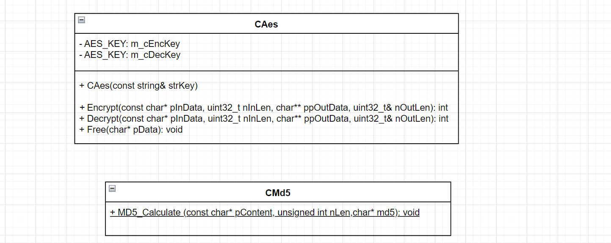
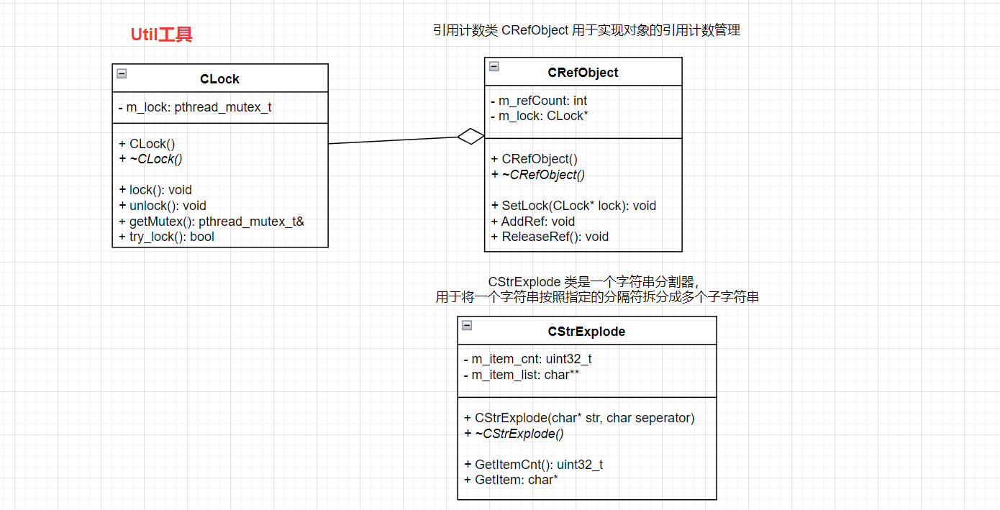
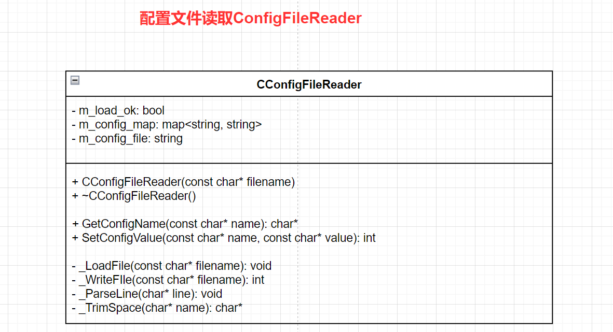
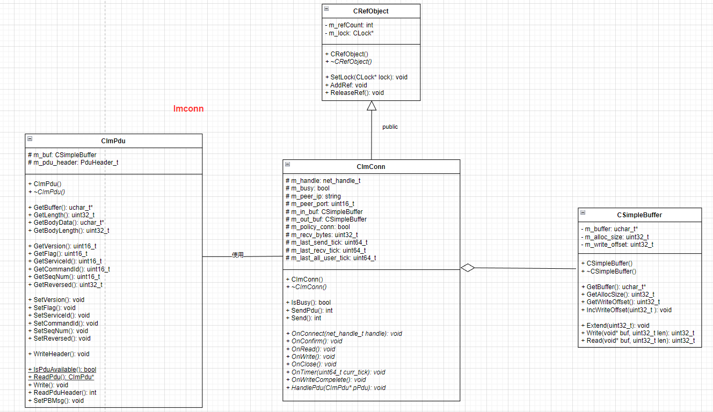

# Base目录
---

## Group1加解密

### 1.base64编解码

base64就是使用64个可打印的字符来表示二进制的数据，本质上是一种编码方式，用于<font color='#BAOC2F'>将二进制数据转换成可打印字符的形式</font>。它的作用是将二进制数据在不损失数据的情况下进行表示，以便在文本环境中传输或存储。

#### 应用场景

在实际开发中，Base64 编码经常用于以下情况：

1. 数据传输：当需要<font color='#BAOC2F'>在文本协议或文本格式中传输二进制数据时</font>，常常需要将二进制数据编码成 Base64 格式，以<font color='#BAOC2F'>确保数据能够正确地传输和解析</font>。例如，在电子邮件中传输二进制附件、在HTTP请求中传输图片或文件等。
2. 数据存储：有些<font color='#BAOC2F'>存储介质或存储格式只支持文本数据</font>，无法直接存储二进制数据。在这种情况下，可以将二进制数据进行 Base64 编码后再进行存储。<font color='#BAOC2F'>常见的例子是将图片数据以 Base64 编码的形式存储在数据库中</font>。
3. URL 参数传递：在 URL 中传递特殊字符或二进制数据时，为了避免特殊字符对 URL 的解析造成干扰，常常需要将二进制数据进行 Base64 编码后再传递。
4. 数据加密：有些加密算法只能处理特定长度的数据，而输入的数据长度不满足要求时，可以使用 Base64 编码将数据填充至满足要求的长度后再进行加密。

总而言之，Base64 编码在实际开发中<font color='#BAOC2F'>主要用于将二进制数据转换成文本格式</font>，以便在各种文本环境中进行传输、存储或处理。

#### base64编解码原理

base64使用64个可打印的字符来表示二进制的数据，

- [彻底弄懂base64的编码与解码原理](https://zhuanlan.zhihu.com/p/408318391) 
- [一篇文章彻底弄懂Base64编码原理](https://blog.csdn.net/wo541075754/article/details/81734770) 

加密与编码的区别：

1. 加密：将明文变为一种不可破解的密文，提高识别难度
2. 编码：换一种体现形式，以便于传输提高计算机可读性

base64编码表：


以将中文使用base64编码为例：

1. step1：找到中文字符在操作系统中相应字符编码的代表码（chcp）GB2312，中文找到字符编码中的十进制值
2. step2：将十进制转为二进制
3. step3：对二进制进行分组，每六个一组（最后一组不满6位补0即可）
4. step4：将分组后的二进制组转为十进制
5. step5：在base64表中查找其对应的编码（可使用不同的编码表达到数据加密的效果）

#### 代码实现

- 学习到的编程技巧1：断言assert运用判定验证条件是否为真

断言 (assert) 是一种在程序中<font color='#BAOC2F'>用于验证条件是否为真的机制</font>。

它用于<font color='#BAOC2F'>在代码中插入检查点</font>，以<font color='#BAOC2F'>确保特定条件满足或特定状态正确</font>。如果<font color='#BAOC2F'>断言的条件为假</font>，则<font color='#BAOC2F'>断言会引发一个异常终止程序的执行</font>。

- 学习到的编程技巧2：利用二进制位运算获取最低 n 位二进制数据

- 利用位运算提取一个字节（最低的8位二进制）数据：accumulator & 0xffu
    - `0xffu` 是一个无符号整数常量，它的二进制表示为 `00000000 00000000 00000000 11111111`
    - 按位与将`accumulator`的值与`0xffu`进行按位与操作，实际上是将`accumulator`的高位部分清零，只保留最低的 8 位数据。
    - 这个操作的目的是提取`accumulator`中的最低有效字节，即保留最右边的 8 位二进制数据。
    - 通过该运算后得到的结果是一个<font color='#BAOC2F'>无符号整数</font>，表示`accumulator`中的最低有效字节。
    - 最后将提取到的 8 位二进制数据转换为 `char` 类型，然后添加到 `retval` 字符串中，用于存储解码后的原始二进制数据。
- 利用位运算提取（最低的6位二进制）数据：accumulator & 0x3fu
    - `0x3fu` 是一个无符号整数常量，它的二进制表示为 `00000000 00000000 00000000 00111111` 
    - 按位与将`accumulator`的值与`0x3fu`进行按位与操作，实际上是将`accumulator`的高位部分清零，只保留最低的 6 位数据。
    - 这个操作的目的是从 `accumulator` 中提取最低的6位二进制数据，以获取索引值。
    - 通过该运算后得到的结果是一个<font color='#BAOC2F'>无符号整数</font>，它的值在 0 ~ 63 的范围内，对应于 `b64_table` 中的有效索引。
    - 最后使用该索引从 `b64_table` 中找到相应的 Base64 字符，并将其存入 `retval` 字符串中，用于进行解码操作。

```cpp
#ifndef __BASE64_H__
#define __BASE64_H__

#include<iostream>
using namespace std;

// 对 Base64 编码的字符串进行解码，返回解码后的原始数据
string base64_decode(const string &ascdata);
// 对原始数据进行 Base64 编码，返回编码后的字符串
string base64_encode(const string &bindata);

#endif
```

```cpp
#include <stdio.h>
#include <iostream>
#include <string>
#include <cassert>
#include <limits>
#include <stdexcept>
#include <cctype>

using namespace std;

// base64编码表 用于将6位二进制值映射到相应的Base64字符
static const char b64_table[65] = "ABCDEFGHIJKLMNOPQRSTUVWXYZabcdefghijklmnopqrstuvwxyz0123456789+/";

// reverse_table解码表 用于将Base64字符映射回原始的6位二进制值
static const char reverse_table[128] = {
    64, 64, 64, 64, 64, 64, 64, 64, 64, 64, 64, 64, 64, 64, 64, 64,
    64, 64, 64, 64, 64, 64, 64, 64, 64, 64, 64, 64, 64, 64, 64, 64,
    64, 64, 64, 64, 64, 64, 64, 64, 64, 64, 64, 62, 64, 64, 64, 63,
    52, 53, 54, 55, 56, 57, 58, 59, 60, 61, 64, 64, 64, 64, 64, 64,
    64,  0,  1,  2,  3,  4,  5,  6,  7,  8,  9, 10, 11, 12, 13, 14,
    15, 16, 17, 18, 19, 20, 21, 22, 23, 24, 25, 64, 64, 64, 64, 64,
    64, 26, 27, 28, 29, 30, 31, 32, 33, 34, 35, 36, 37, 38, 39, 40,
    41, 42, 43, 44, 45, 46, 47, 48, 49, 50, 51, 64, 64, 64, 64, 64
};

/**
 * @brief base64编码过程
 * 
 * @param const string &bindata 待编码的01二进制数据
 * @return string Base64编码字符串
*/
string base64_encode(const string &bindata) {
    using std::numeric_limits;
    
    // 1.首先检查待编码的数据是否过大
    // numeric_limits<string::size_type>::max()获取 string::size_type 类型的最大值
    // 将最大值除以4 再乘以3 以确定进行Base64编码后的最大字符串长度
    if (bindata.size() > (numeric_limits<string::size_type>::max() / 4u) * 3u) {
        //throw length_error("Converting too large a string to base64.");
        /* 如果待编码的数据长度超过限制 返回空字符串 */
        return "";
    }

    // 2.根据二进制数据的长度 计算编码后的字符串长度
    const size_t binlen = bindata.size();
    // 初始化string对象来存储编码结果: 第一个参数为字符串长度 第二个参数为初始化字符串的值
    // 使用(binlen + 2) / 3可以确保编码后的字符串长度能够容纳所有的数据
    // 乘以4是因为每3个字节的数据会编码为4个字符（3 * 8 = 4 * 6）
    string retval((((binlen + 2) / 3) * 4), '=');


    // 3.函数通过迭代遍历输入数据的每个字节，并将字节转换为对应的Base64字符
    size_t outpos = 0;//retval中存储字符的位置
    int bits_collected = 0;//跟踪累加器中已经收集的比特位数
    unsigned int accumulator = 0;//用于存储累加器的值
    const string::const_iterator binend = bindata.end();//指向字符串bindata结尾位置的迭代器

    for (string::const_iterator i = bindata.begin(); i != binend; ++i) {
        //每次迭代将当前字节与0xffu按位与运算
        //将其左移8位并与accumulator进行按位或运算 以确保只取字节的低8位
        accumulator = (accumulator << 8) | (*i & 0xffu);
        //将新的字节添加到累加器中
        bits_collected += 8;
        //当累加器中的比特位数bits_collected达到6位或以上时
        while (bits_collected >= 6) {
            bits_collected -= 6;//表示已从累加器中取出了6位值
            //将accumulator右移并与0x3fu按位与运算 以获取累加器中的6位值对应的索引
            int index = (accumulator >> bits_collected) & 0x3fu;
            //根据索引从b64_table中找到相应的Base64字符，并将其存入retval中
            retval[outpos++] = b64_table[index];
        }
    }

    // 4.最后如果存在剩余的不足6位的二进制位 则将累加器左移使剩余位移动到高位 再次索引并存入retval
    // Any trailing bits that are missing.
    // 利用断言assert验证条件是否为真
    if (bits_collected > 0) {
        //剩余不足6位的二进制位 但bits_collected值大于等于6 断言失败并抛出异常（值错误或算法逻辑错误）
        assert(bits_collected < 6);
        //剩余的不足6位的二进制位 且bits_collected < 6 则进行左移操作
        accumulator <<= 6 - bits_collected;
        //并通过与0x3fu按位与运算获取索引
        int index =  accumulator & 0x3fu;
        //根据索引从b64_table中找到相应的Base64字符，并将其存入retval中
        retval[outpos++] = b64_table[index];
    }

    // 5.通过不断更新的outpos来确定retval中存储字符的位置 使用断言assert进行一些边界检查 确保编码结果的正确性
    // 确保outpos的值不小于retval的长度减去2：是否正确计算了编码结果的长度，并且没有发生越界访问
    assert(outpos >= (retval.size() - 2));
    // 确保outpos的值不大于等于retval的长度：检查是否正确更新了outpos的值，避免越界写入retval
    assert(outpos <= retval.size());

    return retval;   
}

/**
 * @brief base64解码过程
 * 对Base64编码字符串进行逐字符解码 并将解码后的二进制数据以字符串形式存储在retval中
 * 
 * @param const string &ascdata Base64编码字符串
 * @return string 01二进制数据
*/
string base64_decode(const string &ascdata) {
    string retval;
    const string::const_iterator last = ascdata.end();//ascdata字符串的末尾位置的迭代器
    int bits_collected = 0;//表示当前已收集的二进制位数
    unsigned int accumulator = 0;//用于累积收集的二进制数据的变量

    // 逐字符解码 并将解码后的二进制数据以字符串形式存储在retval中    
    for (string::const_iterator i = ascdata.begin(); i != last; ++i) {
        const int c = *i;
        // 1.当前字符是否为空格或者为等号，如果是则跳过该字符
        // 在Base64编码中空格和填充字符'='是可以存在的，但对解码结果没有影响 故直接跳过
        if (isspace(c) || c == '=') continue;

        // 2.检查当前字符是否在合法的范围内，异常返回空字符串
        if ((c > 127) || (c < 0) || (reverse_table[c] > 63)) return "";

        // 3.将收集到的二进制数据累积到accumulator中
        // 将accumulator左移6位 并与reverse_table[c]按位或运算
        accumulator = (accumulator << 6) | reverse_table[c];
        // 将bits_collected增加6，表示已经收集了6位二进制数据
        bits_collected += 6;

        // 4.如果bits_collected达到或超过8，表示已经收集足够的二进制数据可以解码为一个字节
        if (bits_collected >= 8) {
            bits_collected -= 8;
            //从accumulator中取出最高位的8位二进制数据，并将其转换为字符类型添加到retval字符串中
            retval += (char)((accumulator >> bits_collected) & 0xffu);
        }
    }
    return retval;
}
```


### 2.AES加解密与md5计算



主要用于处理AES加解密（对称加密算法加密和解密用相同的密钥），和MD5计算

高级加密标准(AES,Advanced Encryption Standard)为<font color='#BAOC2F'>最常见的对称加密算法</font>（微信小程序加密传输就是用这个加密算法的）

该模块依赖于UtilPdu、Base64和openssl/aes，该模块主要用于<font color='#BAOC2F'>AES加解密和MD5计算</font>。

#### AES加密原理

在密码学中，加密算法分为双向加密和单向加密。

- 单向加密包括MD5、SHA等摘要算法，它们是不可逆的。
- 双向加密包括对称加密和非对称加密，双向加密是可逆的，存在密文的密钥。
    - 对称加密指，<font color='#BAOC2F'>加密和解密使用相同密钥</font>的加密算法。包括AES加密、DES加密等。AES算法是DES算法的替代者，也是现在最流行的加密算法之一。
    - 非对称加密指，<font color='#BAOC2F'>加密和解密使用不同密钥的加密算法</font>，也称为公私钥加密。常见的非对称加密算法包括：RSA、DSA（数字签名用）、ECC（移动设备用）、Diffie-Hellman、El Gamal。

AES是高级加密标准，在密码学中又称<font color='#BAOC2F'>Rijndael加密法</font>，是美国联邦政府采用的一种<font color='#BAOC2F'>区块加密标准</font>。这个标准用来替代原先的DES，目前已经被全世界广泛使用，同时AES已经成为对称密钥加密中最流行的算法之一。AES支持三种长度的密钥：128位，192位，256位。

##### 秘钥

密钥是AES算法实现加密和解密的根本。对称加密算法之所以对称，是因为这类算法对明文的加密和解密需要使用同一个密钥。

AES支持三种长度的密钥：128位，192位，256位，AES128，AES192，AES256

##### 填充

1. AES具有分组加密的特性，AES算法在对明文加密的时候<font color='#BAOC2F'>并不是把整个明文一股脑加密成一整段密文</font>，而是<font color='#BAOC2F'>把明文拆分成一个个独立的明文块</font>，每一个明文块长度128bit。

2. 这些明文块经过AES加密器的复杂处理，生成一个个独立的密文块，这些密文块拼接在一起，就是最终的AES加密结果。

3. 当一段明文长度是192bit，如果按每128bit一个明文块来拆分的话，第二个明文块只有64bit，不足128bit的时候就需要对明文块进行填充（Padding）。

4. AES具有三种填充模式：

    - NoPadding：不做任何填充，但是要求明文必须是16字节的整数倍。

    - PKCS5Padding：如果明文块少于16个字节128bit，在明文块末尾补足相应数量的字符，且每个字节的值等于缺少的字符数。

        比如明文：{1,2,3,4,5,a,b,c,d,e},缺少6个字节，则补全为{1,2,3,4,5,a,b,c,d,e,6,6,6,6,6,6}

    - ISO10126Padding：如果明文块少于16个字节128bit，在明文块末尾补足相应数量的字节，最后一个字符值等于缺少的字符数，其他字符填充随机数。

        比如明文：{1,2,3,4,5,a,b,c,d,e},缺少6个字节，则可能补全为{1,2,3,4,5,a,b,c,d,e,5,c,3,G,$,6}


##### 算法流程

AES加密算法涉及4种操作：

- 字节替代（SubBytes）：通过非线性的替换函数，用查找表的方式把每个字节替换成对应的字节。
- 行移位（ShiftRows）：将矩阵中的每个横列进行循环式移位。
- 列混淆（MixColumns）：为了充分混合矩阵中各个直行的操作。这个步骤使用线性转换来混合每列的四个字节。
- 轮密钥加（AddRoundKey）：矩阵中的每一个字节都与该次轮密钥（round key）做XOR运算；每个子密钥由密钥生成方案产生。

下图给出了AES加解密的流程，从图中可以看出：

1. 解密算法的每一步分别对应加密算法的逆操作；
2. 加解密所有操作的顺序正好是相反的。正是由于这几点（再加上加密算法与解密算法每步的操作互逆）保证了算法的正确性。加解密中每轮的密钥分别由种子密钥经过密钥扩展算法得到。算法中16字节的明文、密文和轮子密钥都以一个4x4的矩阵表示。


#### 代码实现

##### security.h

```cpp
DLL_MODIFIER int EncryptMsg(const char* pInData, uint32_t nInLen, char** pOutData, uint32_t& nOutLen);
DLL_MODIFIER int DecryptMsg(const char* pInData, uint32_t nInLen, char** pOutData, uint32_t& nOutLen);
DLL_MODIFIER int EncryptPass(const char* pInData, uint32_t nInLen, char** pOutData, uint32_t& nOutLen, const char* pKey);
L_MODIFIER int DecryptPass(const char* pInData, uint32_t nInLen, char** ppOutData, uint32_t& nOutLen, const char* pKey);
DLL_MODIFIER void Free(char* pOutData);
```

##### EncDec.h

```cpp
#ifndef __ENCDEC_H__
#define __ENCDEC_H__

#include <iostream>
#include <openssl/aes.h>
#include <openssl/md5.h>
#include "ostype.h"

using namespace std;

class CAes {
public:
    CAes(const string& strKey);
    
    int Encrypt(const char* pInData, uint32_t nInLen, char** ppOutData, uint32_t& nOutLen);
    int Decrypt(const char* pInData, uint32_t nInLen, char** ppOutData, uint32_t& nOutLen);
    void Free(char* pData);
private:
    AES_KEY m_cEncKey;
    AES_KEY m_cDecKey;
};

class CMd5 {
public:
    static void MD5_Calculate (const char* pContent, unsigned int nLen,char* md5);
};

#endif
```

##### EncDec.cpp

```cpp
#include "EncDec.h"
#include "Base64.h"
#include "UtilPdu.h"
#include <stdio.h>
#include <string.h>

/// @brief 在构造函数中使用AES算法设置 加密和解密密钥
/// @param strKey 明文密码
CAes::CAes(const string& strKey) {
    AES_set_encrypt_key((const unsigned char*)strKey.c_str(), 256, &m_cEncKey);
    AES_set_decrypt_key((const unsigned char*)strKey.c_str(), 256, &m_cDecKey);
}

/// @brief 对输入数据进行AES加密
/// 在使用该函数之前，需要确保相关的AES加密库和头文件已正确引入，并链接到程序中
/// @param pInData 指向要加密的输入数据的指针
/// @param nInLen 输入数据的长度
/// @param ppOutData 指向指针的指针，用于存储加密后的数据
/// @param nOutLen 加密后的数据长度
/// @return int
int CAes::Encrypt(const char* pInData, uint32_t nInLen, char** ppOutData, uint32_t& nOutLen) {
    if (pInData == NULL || nInLen <= 0) return -1;

    // 1.计算加密后数据的长度
    uint32_t nRemain = nInLen % 16;
    uint32_t nBlocks = (nInLen + 15) / 16;

    // 2.并根据加密算法的要求进行数据块大小的调整
    if (nRemain > 12 || nRemain == 0) nBlocks += 1;
    uint32_t nEncryptLen = nBlocks * 16;

    // 3.动态分配内存用于存储加密前和加密后的数据
    unsigned char* pData = (unsigned char*)calloc(nEncryptLen, 1);//加密前的数据
    memcpy(pData, pInData, nInLen);
    unsigned char* pEncData = (unsigned char*)malloc(nEncryptLen);//加密后的数据

    // 4.将原始数据的长度（nInLen）写入到最后一个数据块的末尾
    CByteStream::WriteUint32((pData + nEncryptLen - 4), nInLen);

    // 5.使用AES_encrypt函数对每个数据块进行AES加密，将加密后的结果存储在pEncData中
    for (uint32_t i = 0; i < nBlocks; i++) AES_encrypt(pData + i * 16, pEncData + i * 16, &m_cEncKey);

    // 6.完成加密后释放原始数据的内存 并将加密后的数据转换为string类型
    free(pData);
    string strEnc((char*)pEncData, nEncryptLen);
    free(pEncData);

    // 7.使用base64_encode函数对加密后的数据进行Base64编码，将编码后的结果存储在strDec中
    string strDec = base64_encode(strEnc);

    // 8.确定编码后数据的长度 并为其分配内存
    nOutLen = (uint32_t)strDec.length();
    char* pTmp = (char*)malloc(nOutLen + 1);//指向存储加密后并经过Base64编码的数据的字符指针

    // 9.将编码后的数据复制到新分配的内存中，并在末尾添加字符串结束符
    memcpy(pTmp, strDec.c_str(), nOutLen);
    pTmp[nOutLen] = 0;

    // 10.将指向加密后数据的指针赋值给ppOutData，以便在函数外部可以访问到加密后的数据
    *ppOutData = pTmp;

    return 0;
}

/// @brief 解密函数Decrypt的实现
/// @param pInData 指向待解密数据的字符数组的指针
/// @param nInLen 待解密数据的长度 以字节为单位
/// @param ppOutData 指向char*类型指针的指针，用于存储解密后的数据
/// @param nOutLen uint32_t类型的引用，用于存储解密后的数据的长度
/// @return int
int CAes::Decrypt(const char* pInData, uint32_t nInLen, char** ppOutData, uint32_t& nOutLen) {
    if (pInData == NULL || nInLen <= 0) return -1;

    // 1.将输入数据pInData和长度nInLen构造成string对象strInData
    string strInData(pInData, nInLen);

    // 2.使用base64_decode函数对strInData进行Base64解码
    std::string strResult = base64_decode(strInData);

    // 3.获取解码后数据的长度nLen并进行判断 如果解码后的数据长度为0表示解码失败返回-2
    uint32_t nLen = (uint32_t)strResult.length();
    if (nLen == 0) return -2;

    // 4.将解码后的数据转换为const unsigned char*类型 并赋值给pData
    const unsigned char* pData = (const unsigned char*)strResult.c_str();

    // 5.检查待解密数据的长度是否是16的倍数如果不是，即存在不完整的AES加密块 返回-3
    // 如果待解密数据的长度不是16的倍数，说明数据不完整或格式错误，无法正确解密
    if (nLen % 16 != 0) return -3;
    
    // 6.根据解码后的数据长度nLen为 pTmp 分配足够的内存空间用于存储解密后的数据（解密完成后的长度应该小于该长度）
    char* pTmp = (char*)malloc(nLen + 1);

    // 7.通过循环遍历将解码后的数据进行分块AES解密
    uint32_t nBlocks = nLen / 16;
    for (uint32_t i = 0; i < nBlocks; i++) AES_decrypt(pData + i * 16, (unsigned char*)pTmp + i * 16, &m_cDecKey);

    // 8.在解密后的数据末尾，使用CByteStream::ReadUint32函数从解密后数据的末尾读取出长度值，并将其赋值给 nOutLen
    uchar_t* pStart = (uchar_t*)pTmp + nLen - 4;
    nOutLen = CByteStream::ReadUint32(pStart);
    
    // 9.判断解密后的数据长度nOutLen是否大于解密前的数据长度nLen
    // 如果是表示解密后的数据长度异常 释放pTmp所指向的内存空间并返回-4
    if (nOutLen > nLen) {
        free(pTmp);
        return -4;
    }

    // 10.将解密后的数据以空字符结尾 并将pTmp赋值给*ppOutData，将解密后的数据指针输出
    pTmp[nOutLen] = 0;//将其最后一个字符置为null终止符 \0 以确保字符串的正确结束
    *ppOutData = pTmp;
    return 0;
}

/// @brief 安全地释放动态分配的内存 确保不会导致内存泄漏或使用已释放的内存
/// @param pOutData 指向需要释放内存的空间的指针
void CAes::Free(char* pOutData) {
    if (pOutData) {
        free(pOutData);
        pOutData = NULL;
    }
}

/// @brief 计算给定数据的MD5哈希值
/// @param pContent 指向要计算哈希值的数据的指针
/// @param nLen 数据的长度
/// @param md5 存储计算得到的MD5哈希值的字符串缓冲区
void CMd5::MD5_Calculate(const char* pContent, unsigned int nLen, char* md5) {
    uchar_t d[16];//存储计算得到的MD5哈希值
    MD5_CTX ctx;//MD5_CTX结构体类型的变量ctx 存储MD5计算的上下文信息
    MD5_Init(&ctx);//初始化MD5计算的上下文
    MD5_Update(&ctx, pContent, nLen);//利用MD5_Update函数将数据块pContent的内容添加到MD5计算中
    MD5_Final(d, &ctx);//使用MD5_Final函数将最终的MD5哈希值存储到数组d中

    //循环通过将每个字节转换为两位的十六进制表示，并使用snprintf函数将结果存储在字符串缓冲区md5中
    for (int i = 0; i < 16; ++i) snprintf(md5 + (i * 2), 32, "%02x", d[i]);
    //将字符串缓冲区的最后一个字符设置为零，以表示字符串的结尾。
    md5[32] = 0;
    return;
}
```

##### md5.cpp

```cpp

```

##### security.cpp

```cpp

```


## Group2工具项

### 1.atomic原子操作

```cpp
#ifndef _ATOMIC_H_
#define _ATOMIC_H_

//ATOMIC_ADD宏用于将一个值加到给定指针所指向的内存位置
#define ATOMIC_ADD(src_ptr, v) (void)__sync_add_and_fetch(src_ptr, v)

//ATOMIC_ADD宏用于将一个值加到给定指针所指向的内存位置，并返回相加后的结果
#define ATOMIC_ADD_AND_FETCH(src_ptr, v) __sync_add_and_fetch(src_ptr, v)

//ATOMIC_SUB_AND_FETCH宏用于将一个值从给定指针所指向的内存位置减去，并返回相减后的结果
#define ATOMIC_SUB_AND_FETCH(src_ptr, v) __sync_sub_and_fetch(src_ptr, v)

//ATOMIC_FETCH宏用于获取给定指针所指向的内存位置的值，并返回该值
#define ATOMIC_FETCH(src_ptr) __sync_add_and_fetch(src_ptr, 0)

//ATOMIC_SET宏用于将给定值设置到给定指针所指向的内存位置
#define ATOMIC_SET(src_ptr, v) (void)__sync_bool_compare_and_swap(src_ptr, *(src_ptr), v)


// 定义了一个atomic_t类型 是一个long类型的变量
// 并使用volatile关键字修饰 以确保在多线程环境中对该变量的访问是原子的
typedef volatile long atomic_t;

#endif
```

#### 宏定义写法分析

关于这种宏定义写法的说明：宏定义是一种在预处理阶段进行文本替换的机制。

以`#define ATOMIC_ADD(src_ptr, v) (void)__sync_add_and_fetch(src_ptr, v)`为例：

1. 在这个宏定义中`ATOMIC_ADD(src_ptr, v)`是宏的名称，`(void)` 是返回类型，`__sync_add_and_fetch(src_ptr, v)`是宏的替换体
2. `__sync_add_and_fetch(src_ptr, v)` 是一个<font color='#BAOC2F'>内建函数</font>，用于执行原子的加法操作，并返回相加后的结果。该函数接受两个参数：`src_ptr` 是一个指针，表示要进行加法操作的内存位置；`v` 是要相加的值。`__sync_add_and_fetch` 函数将指针所指向的内存位置的值与 `v` 相加，并<font color='#BAOC2F'>将结果存回该内存位置</font>。最后，函数返回相加后的结果。
3. 宏定义的目的是<font color='#BAOC2F'>将函数调用和返回值类型包装在一个方便使用的宏中</font>，以便在代码中直接调用宏来执行相应的操作，而不需要显式调用函数。这种宏定义的写法可以<font color='#BAOC2F'>简化对内建函数的调用</font>，使代码更加简洁和易读。
4. 在这种写法中，`(void)` 表示该宏没有返回值，只执行加法操作而不获取返回结果。
5. 因此当在代码中使用 `ATOMIC_ADD(src_ptr, v)` 时，预处理器将会将其替换为 `(void)__sync_add_and_fetch(src_ptr, v)`，从而实现对应的原子加法操作

以`#define ATOMIC_ADD_AND_FETCH(src_ptr, v) __sync_add_and_fetch(src_ptr, v)`为例：

1. 这种写法没有明确声明返回值类型是因为 `__sync_add_and_fetch()` 是一个内建函数，它的<font color='#BAOC2F'>返回值类型是根据参数的类型来推导的</font>。在这种情况下，<font color='#BAOC2F'>返回值类型将与 src_ptr 指针所指向的内存位置的类型相匹配</font>。
2. 由于宏定义仅是对代码进行文本替换，因此无法在宏定义中明确指定返回值类型。预处理器只会将宏调用展开为相应的代码，而无法对代码进行类型检查。因此，使用这种写法时，需要确保 `src_ptr` 指针所指向的内存位置的类型与预期的操作和返回值类型是相容的。
3. 在使用 `ATOMIC_ADD_AND_FETCH(src_ptr, v)` 这样的宏时，应确保 `src_ptr` 指向的内存位置和 `v` 的类型是兼容的，并且使用该宏的上下文中可以正确处理返回值。

#### GCC内建函数

关于`__sync_add_and_fetch(src_ptr, v)` 与 `__sync_sub_and_fetch` 的说明：

`__sync_add_and_fetch`是GCC内建函数（GCC built-in function），属于GCC编译器提供的一组内建函数之一。

GCC内建函数提供了一些特定的原子操作，如原子加法、原子比较交换等。这些函数在编译时会被<font color='#BAOC2F'>直接转换为相应的硬件指令</font>或者<font color='#BAOC2F'>使用特定的处理器指令集</font>来实现原子操作。`__sync_add_and_fetch` 函数的具体实现取决于所使用的编译器和目标平台。

在实际开发项目中，`__sync_add_and_fetch` 函数可以在代码中直接使用，而无需特定的头文件或库。编译器会根据代码上下文自动识别并转换为相应的硬件指令或处理器指令，从而实现原子加法操作。

GCC提供了一系列的内建函数（built-in functions），用于提供特定的功能或操作。

除了 `__sync_add_and_fetch` 之外，GCC还提供了其他常用的内建函数，包括但不限于以下几个：

1. 原子操作函数：
    - `__sync_fetch_and_add`：执行原子加法操作并返回旧值。
    - `__sync_fetch_and_sub`：执行原子减法操作并返回旧值
    - `__sync_fetch_and_or`：执行原子按位或操作并返回旧值。
    - `__sync_fetch_and_and`：执行原子按位与操作并返回旧值。
    - `__sync_fetch_and_xor`：执行原子<font color='#BAOC2F'>按位异或操作</font>并返回旧值。
    - `__sync_bool_compare_and_swap`：执行原子<font color='#BAOC2F'>比较并交换</font>操作。
    - `__sync_val_compare_and_swap`：执行原子<font color='#BAOC2F'>比较并交换</font>操作，<font color='#BAOC2F'>并返回比较结果</font>。
2. 内存屏障函数：
    - `__sync_synchronize`：执行一个<font color='#BAOC2F'>全局的内存屏障</font>，确保内存操作按照顺序执行。

这些内建函数提供了一些原子操作和内存屏障功能，可以在多线程编程中使用，确保数据的一致性和线程安全性。

请注意，这些内建函数的使用可能会依赖于特定的编译器和目标平台。

建议查阅相关编译器文档或 GCC 官方文档以获取更详细的信息和完整的内建函数列表。

#### volatile关键字

用于声明一个变量是易变的（volatile variable）。它的作用是告诉编译器该变量的值<font color='#BAOC2F'>可能会在程序执行过程中被意外地改变</font>，因此编译器在对该变量的<font color='#BAOC2F'>读取和写入时应该遵循一些特定的规则</font>，以确保对变量的操作是准确的。

需要注意的是，`volatile` <font color='#BAOC2F'>并不能完全解决多线程编程中的并发访问问题</font>，它<font color='#BAOC2F'>只能确保对变量的读取和写入操作的可见性</font>。要实现线程安全，还需要使用其他的同步机制，如互斥锁（mutex）或原子操作。

`volatile` 的主要作用有两个方面：

1. 防止编译器进行优化：编译器在进行代码优化时会尽可能地将变量的读取和写入操作进行重排或优化，以提高程序的执行效率。然而，对于声明为 `volatile` 的变量，编译器会禁止对其进行优化，确保每次读取和写入都是直接对内存进行操作，而不是使用寄存器或缓存的副本。
2. 处理多线程或并发访问：在多线程或并发编程中，多个线程可能同时访问某个变量。如果不使用 `volatile` 关键字，编译器可能会对变量的读取和写入操作进行优化，导致某些线程无法及时感知到其他线程对变量的修改。通过使用 `volatile` 关键字，可以告诉编译器确保变量的读取和写入操作在多线程环境中具有可见性，从而避免潜在的并发访问问题。

总而言之，`volatile` 关键字用于告诉编译器该变量是易变的，需要遵循特定的规则进行读取和写入操作，以确保可见性和准确性。

在多线程编程中，可以与其他同步机制配合使用来确保线程安全性。

### 2.Lock锁机制与自动锁管理类


条件编译关于`CRITICAL_SECTION m_critical_section;`的解释：

`CRITICAL_SECTION` 是 Windows 操作系统提供的一种临界区（Critical Section）的同步对象，用于<font color='#BAOC2F'>实现线程间的互斥访问</font>。

- 在 C++ 中是一种<font color='#BAOC2F'>同步原语，用于保护临界区代码，</font>防止多个线程同时访问导致的数据竞争和不一致性。
- 在 Windows 平台上一是一种轻量级的同步机制，<font color='#BAOC2F'>相对于互斥锁（Mutex）而言，它的开销较小</font>，适用于同一进程内的线程同步。
- 是一个类成员变量，用于表示一个临界区对象。
- 该对象可以在多个成员函数中使用，以实现线程安全的访问。

临界区对象的使用一般涉及两个主要的操作：

1. 进入临界区：通过调用 `EnterCriticalSection` 函数来进入临界区，该操作会阻塞其他线程的进入，直到当前线程离开临界区。
2. 离开临界区：通过调用 `LeaveCriticalSection` 函数来离开临界区，该操作允许其他线程进入临界区。

使用临界区对象可以<font color='#BAOC2F'>在多线程环境中保护共享资源的访问</font>，确保只有一个线程可以同时进入临界区执行相关代码，从而<font color='#BAOC2F'>避免并发访问引发的数据竞争问题</font>。

#### lock.h

```cpp
#ifndef __LOCK_H__
#define __LOCK_H__

#include "ostype.h"

////////////////////////CLock/////////////////////////////////////
/**
 * CLock 类是一个互斥锁的封装类
 * 
 * CLock：用于获取互斥锁。如果互斥锁当前不可用，调用线程将被阻塞，直到互斥锁可用为止
 * ~CLock：用于释放互斥锁，使其可被其他线程获取
 * getMutex：返回互斥锁对象，以便对其进行直接操作（例如在条件变量中使用）
 * try_lock（非Windows系统）：尝试获取互斥锁，如果互斥锁当前不可用，则立即返回失败
 * 
 * 在Windows系统下（_WIN32宏定义为真），使用临界区（CRITICAL_SECTION）来实现互斥锁
 * 而在非Windows系统下，则使用 pthread 库提供的互斥锁（pthread_mutex_t）
 * 
 * 这样的封装使得代码在不同操作系统上具有可移植性，因为在不同系统上使用不同的互斥锁实现方式
*/
class CLock {
public:
    CLock();
    virtual ~CLock();

    void lock();
    void unlock();
    pthread_mutex_t& getMutex() { return m_lock; }
#ifndef _WIN32
    virtual bool try_lock();
#endif
private:
#ifdef _WIN32
	CRITICAL_SECTION m_critical_section;
#else
    pthread_mutex_t m_lock;
#endif
};

///////////////////// CAutoLock//////////////////////////////////////
/**
 * CAutoLock 类是一个自动锁的封装类，用于简化对互斥锁的加锁和解锁操作
 * 封装了普通局部锁 利用c++语法局部变量离开作用域自动析构原理，实现自动解锁（牺牲了一定效率）
 * 
 * 通过构造函数和析构函数的调用，实现了自动获取锁和自动释放锁的功能，避免了手动管理锁的操作
 * CAutoLock(CLock* pLock)：接受一个CLock对象指针作为参数，用于初始化CAutoLock对象
 * 在构造函数中会调用pLock对象的lock()方法，自动获取锁
 * ~CAutoLock()：在对象销毁时自动调用
 * 在析构函数中会调用m_pLock对象的unlock()方法自动释放锁
*/
class CAutoLock {
public:
    CAutoLock(CLock* pLock);
    virtual ~CAutoLock();
private:
    CLock* m_pLock;
};

//////////////////////WIN32//////////////////////////////////////////
#ifndef _WIN32
///////////////////// CRWLock//////////////////////////////////////
/**
 * CRWLock 类是一个读写锁的封装类，用于实现多读单写的并发控制
 * 
 * CRWLock(); 构造函数用于初始化读写锁对象。
 * virtual ~CRWLock(); 析构函数用于销毁读写锁对象。
 * 
 * void rlock(); 获取读锁，允许多个线程同时获取读锁，当有线程持有写锁时，其他线程无法获取写锁。
 * void wlock(); 获取写锁，只允许一个线程获取写锁，当有线程持有读锁或写锁时，其他线程无法获取读锁或写锁。
 * void unlock(); 释放读锁或写锁
 * bool try_rlock(); 尝试获取读锁，如果能成功获取则返回 true，否则返回 false
 * bool try_wlock(); 尝试获取写锁，如果能成功获取则返回 true，否则返回 false
 * 
 * 使用读写锁可以实现多线程读取共享数据，而在写操作时需要独占访问共享数据的情况下，保证数据的一致性和并发安全性
*/
class CRWLock {
public:
    CRWLock();
    virtual ~CRWLock();

    void rlock();
    void wlock();
    void unlock();
    bool try_rlock();
    bool try_wlock();
private:
    pthread_rwlock_t m_lock;
};

///////////////////// CAutoRWLock//////////////////////////////////////
/**
 * CAutoRWLock 类是一个自动读写锁的封装类，用于简化对读写锁的加锁和解锁操作
 * 封装了读写局部锁，利用c++语法局部变量离开作用域自动析构原理，实现自动解锁（牺牲了一定效率）
 * 
 * 构造函数，接收一个CRWLock对象指针和一个布尔值参数 当布尔值参数为true时默认获取读锁；当布尔值参数为false时获取写锁。
 * 析构函数，用于释放自动锁对象，自动调用解锁操作
 * 
 * 使用 CAutoRWLock 类可以在进入作用域时自动获取读锁或写锁
 * 并在离开作用域时自动释放锁，避免手动管理锁的加锁和解锁操作，从而简化代码并确保正确的加锁和解锁顺序
*/
class CAutoRWLock {
public:
    CAutoRWLock(CRWLock* pLock, bool bRLock = true);
    virtual ~CAutoRWLock();
private:
    CRWLock* m_pLock;
};

#endif  

#endif
```

#### lock.cpp

```cpp
#include "Lock.h"

////////////////////////////CLock/////////////////////////////////////
CLock::CLock() {
#ifdef _WIN32
    InitializeCriticalSection(&m_critical_section);
#else
    pthread_mutex_init(&m_lock, NULL);
#endif
}

CLock::~CLock() {
#ifdef _WIN32
    DeleteCriticalSection(&m_critical_section);
#else
    pthread_mutex_destroy(&m_lock);
#endif
}

void CLock::lock() {
#ifdef _WIN32
    EnterCriticalSection(&m_critical_section);
#else
    pthread_mutex_lock(&m_lock);
#endif
}

void CLock::unlock() {
#ifdef _WIN32
    LeaveCriticalSection(&m_critical_section);
#else
    pthread_mutex_unlock(&m_lock);
#endif
}

#ifndef _WIN32
bool CLock::try_lock() {
    // pthread_mutex_trylock(&m_lock)是一个函数调用 用于尝试获取互斥锁
    // 如果成功获取到互斥锁返回值为0 否则返回其他非零值
    return pthread_mutex_trylock(&m_lock) == 0;
}
#endif

////////////////////////////CAutoLock/////////////////////////////////////
CAutoLock::CAutoLock(CLock* pLock) {
    m_pLock = pLock;
    if (m_pLock != NULL) m_pLock->lock();
}

CAutoLock::~CAutoLock() {
    if (NULL != m_pLock) m_pLock->unlock();
}


////////////////////////////CRWLock/////////////////////////////////////
#ifndef _WIN32
CRWLock::CRWLock() {
    pthread_rwlock_init(&m_lock, NULL);
}

CRWLock::~CRWLock() {
    pthread_rwlock_destroy(&m_lock);
}

void CRWLock::rlock() {
    pthread_rwlock_rdlock(&m_lock);
}

void CRWLock::wlock() {
    pthread_rwlock_wrlock(&m_lock);
}

void CRWLock::unlock() {
    pthread_rwlock_unlock(&m_lock);
}

bool CRWLock::try_rlock() {
    return pthread_rwlock_tryrdlock(&m_lock) == 0;
}

bool CRWLock::try_wlock() {
    return pthread_rwlock_trywrlock(&m_lock) == 0;
}

////////////////////////////CAutoRWLock/////////////////////////////////////

/// @brief 构造函数
/// @param pLock 指向CRWLock对象的指针，表示要操作的读写锁
/// @param bRLock 布尔值用于指定是否进行读锁操作 ture进行读锁操作 false进行写锁操作
CAutoRWLock::CAutoRWLock(CRWLock* pLock, bool bRLock) {
    m_pLock = pLock;
    if (NULL != m_pLock) {
        // 据传入的参数bRLock来选择执行读锁操作还是写锁操作（获取锁和上锁实际上是指同一个操作）
        // 如果写锁当前可用，则获取成功，线程可以继续执行
        // 如果写锁当前被其他线程持有，则获取失败，线程会被阻塞，直到写锁可用为止
        if (bRLock) m_pLock->rlock();//获取读锁
        else m_pLock->wlock();//获取写锁
    }
}

CAutoRWLock::~CAutoRWLock() {
    if (NULL != m_pLock) m_pLock->unlock();
}

#endif
```


### 3.Condition条件变量


#### Condition.h

```cpp
#ifndef __CONDITION_H__
#define __CONDITION_H__

#include <pthread.h>
#include "Lock.h"

/**
 * 线程同步条件变量的抽象
*/
class CCondition {
public:
    //将条件变量与特定的锁相关联
    CCondition(CLock* pLock);
    //清理与条件变量相关的任何资源
    ~CCondition();
    //阻塞调用线程，直到条件变量被发信号
    //在调用该函数时，必须持有关联的锁
    //它将释放锁，并等待另一个线程发出的信号，然后重新获取锁并返回
    void wait();
    //类似于wait() 但它包括一个以毫秒（nWaitTime）为单位的超时值
    //如果在指定的时间内收到信号，它将返回true 否则，如果超时时间到期而未收到信号，它将返回false
    bool waitTime(uint64_t nWaitTime);
    //通知一个等待的线程条件已发生 它唤醒一个等待的线程（如果有），使其可以继续执行
    void notify();
    //通知所有等待的线程条件已发生 它唤醒所有等待的线程，使它们可以继续执行
    void notifyAll();
private:
    CLock* m_pLock;//指向关联的CLock对象的指针
    pthread_cond_t m_cond;//实际的条件变量 用于线程同步
};

#endif
```

#### condition.cpp

```cpp
#include <assert.h>
#include "Condition.h"

CCondition::CCondition(CLock* pLock) : m_pLock(pLock) {
    if (!pLock) assert(false);
    //初始化条件变量
    pthread_cond_init(&m_cond, NULL);
}

CCondition::~CCondition() {
    //销毁条件变量
    pthread_cond_destroy(&m_cond);
}

/**
 * 等待条件变量的发生
 * 当一个线程调用wait()函数时，它会首先释放关联的锁（通过调用m_pLock->getMutex()获取锁）
 * 然后线程进入等待状态，直到其他线程发出条件信号（通过调用notify()或notifyAll()函数）
*/
void CCondition::wait() {
    //wait函数调用pthread_cond_wait来等待条件变量
    //释放关联的锁CLock 并等待直到其他线程发出条件信号
    pthread_cond_wait(&m_cond, &m_pLock->getMutex());
}

//带有指定的超时时间等待条件变量
bool CCondition::waitTime(uint64_t nWaitTime) {
    //根据输入的nWaitTime计算超时值 转换为struct timespec类型
    uint64_t nTime = nWaitTime * 1000000;
    struct timespec sTime;
    uint64_t nSec = nTime / (1000000000);
    uint64_t nNsec = nTime % (1000000000);
    sTime.tv_sec = time(NULL) + (uint32_t)nSec;
    sTime.tv_nsec = (uint32_t)nNsec;

    //调用pthread_cond_timedwait
    //如果超时时间到期（返回ETIMEDOUT）则返回false 否则返回true
    if (ETIMEDOUT == pthread_cond_timedwait(&m_cond, &m_pLock->getMutex(), &sTime)) return false;
    return true;
}

void CCondition::notify() {
    //notify()函数通过pthread_cond_signal发出条件变量的信号，唤醒一个等待的线程
    pthread_cond_signal(&m_cond);
}

void CCondition::notifyAll() {
    //notifyAll()函数通过pthread_cond_broadcast发出条件变量的信号，唤醒所有等待的线程
    pthread_cond_broadcast(&m_cond);
}
```

### 4.singleton.h

模板类 `Singleton`用于实现单例模式，

该模板类的特点如下：

1. 通过静态成员变量 `s_instance` 来保存单例对象的指针
2. 提供了静态的 `Instance()`、`GetInstance()` 和 `getInstance()` 方法来获取单例对象的引用或指针
3. 提供了静态的 `Destroy()` 方法用于销毁单例对象
4. 构造函数和析构函数被保护起来，确保只能通过单例模式获取对象，并防止外部直接创建对象
5. 提供了私有的 `CreateInstance()` 和 `DestroyInstance()` 方法，用于创建和销毁单例对象
6. 实现了私有的复制构造函数和赋值操作符，禁止拷贝和赋值操作

使用该模板类可以方便地实现各种类的单例模式，通过调用 `Instance()`、`GetInstance()` 或 `getInstance()` 方法获取单例对象的引用或指针，并通过 `Destroy()` 方法销毁单例对象。

请注意，该单例模式是线程不安全的，如果在多线程环境下使用，需要自行添加线程安全措施。

```cpp
#ifndef BASE_SINGLETON_H_
#define BASE_SINGLETON_H_

template<typename T>
class Singleton {
public:
    /**
     * 提供了静态的 Instance()、GetInstance() 和 getInstance() 方法来获取单例对象的引用或指针 这三个方法的区别在于命名风格
     * 这三个方法都用于获取单例对象的引用或指针，它们的实现逻辑是相同的：
     *  1.首先检查静态成员变量 s_instance 是否为 nullptr，即单例对象是否已经被创建
     *  2.如果s_instance是nullptr，则调用CreateInstance()方法创建单例对象，并将其赋值给 s_instance
     *  3.返回s_instance的引用或指针
    */
    static T& Instance() {
        if(Singleton::s_instance==0) Singleton::s_instance = CreateInstance();
        return *(Singleton::s_instance);
    }
    static T* GetInstance() {
        if(Singleton::s_instance==0) Singleton::s_instance = CreateInstance();
        return Singleton::s_instance;
    }
    static T* getInstance() {
        if(Singleton::s_instance==0) Singleton::s_instance = CreateInstance();
        return Singleton::s_instance;
    }
    /**
     * 提供了静态的 Destroy() 方法用于销毁单例对象,具体的实现逻辑如下：
     *  1.检查静态成员变量 s_instance 是否为 nullptr，即单例对象是否存在
     *  2.如果 s_instance 不为 nullptr，则调用 DestroyInstance() 方法销毁单例对象
     *  3.将 s_instance 设置为 nullptr，表示单例对象已被销毁
    */
    static void Destroy() {
        if(Singleton::s_instance!=0) {
            DestroyInstance(Singleton::s_instance);
            Singleton::s_instance=0;
        }
    }
    
protected:
    /**
     * 构造函数和析构函数被保护起来，确保只能通过单例模式获取对象，并防止外部直接创建对象
     * 这里的构造函数和析构函数是保护（protected）的，因此只能在派生类中使用，不能直接在外部实例化或销毁单例对象
     * 这是为了确保单例对象的控制权和唯一性，只能通过 Instance() 或 GetInstance() 方法来获取单例对象的引用或指针
    */
    Singleton()	{
        //构造函数在创建单例对象时被调用
        //将当前对象的指针转换为 T* 类型，并将其赋值给静态成员变量 s_instance
        //确保单例对象在整个程序中只有一个实例，并且可以通过静态成员函数访问该实例
        Singleton::s_instance = static_cast<T*>(this);
    }
    ~Singleton() {
        //析构函数在销毁单例对象时被调用
        //将静态成员变量 s_instance 设置为 nullptr，表示单例对象已被销毁
        Singleton::s_instance = 0;
    }
    
private:
    //提供了私有的 CreateInstance() 和 DestroyInstance() 方法，用于创建和销毁单例对象
    static T* CreateInstance(){
        return new T();
    }
    static void DestroyInstance(T* p) {
        delete p;
    }
    
private:
    //通过静态成员变量 s_instance 来保存单例对象的指针
    static T *s_instance;
    
private:
    //实现私有的拷贝构造函数和赋值操作符，默认禁止拷贝和赋值操作
    /**
     * 私有的拷贝构造函数确保无法从单例对象创建新的副本
     * 构造函数的参数是 Singleton const & 类型，表示拷贝构造函数接受一个常量引用
     * 将构造函数声明为 explicit 是为了避免隐式的拷贝构造，只能在类内部访问
    */
    explicit Singleton(Singleton const &) { }
    /**
     * 私有的赋值操作符确保无法通过赋值操作将一个单例对象赋值给另一个对象
     * 赋值操作符的参数是 Singleton const & 类型，表示赋值操作符接受一个常量引用
     * 在赋值操作符的实现中，直接返回 *this，即当前对象的引用
    */
    Singleton& operator=(Singleton const&) { return *this; }
};

template<typename T>
T* Singleton<T>::s_instance=0;

#endif
```


### 5.util工具



==为什么要设计CRefObject类==?

`CRefObject` 类的设计是为了实现引用计数机制，用于管理对象的生命周期和资源释放。

引用计数是一种常见的内存管理技术，通过在对象中维护一个计数器，记录当前有多少个指针引用了该对象，从而在合适的时机进行对象的释放。

引用计数机制的优点包括：

1. 自动内存管理：通过引用计数，对象的创建和销毁可以自动进行，减轻了手动管理内存的负担。当没有任何指针引用该对象时，引用计数为0，可以安全地释放对象占用的内存。
2. 避免悬挂指针：引用计数机制可以防止悬挂指针的问题，即当一个指针引用了一个已经被销毁的对象时，可以通过引用计数进行判断，在对象销毁时将所有引用指针置为无效，避免了访问无效对象的问题。
3. 支持共享所有权：多个指针可以共享同一个对象的所有权，通过增加和减少引用计数来管理对象的生命周期。这样可以实现对象在多个地方被引用和共享，而无需手动跟踪和协调对象的创建和销毁。

`CRefObject` 类作为基类，提供了引用计数的基本功能，包括引用计数的增加、减少和获取当前引用计数的方法。其他的类可以继承 `CRefObject` 类，从而获得引用计数功能，并在需要时覆写 `ReleaseRef` 方法来自定义对象释放的逻辑。

通过引用计数机制，可以简化对象的管理和释放，提高代码的可维护性和健壮性，同时避免了常见的内存管理问题。

#### util.h

##### CRefObject

```cpp
/**
 * 引用计数类 CRefObject 用于实现对象的引用计数管理
*/
class CRefObject {
public:
    CRefObject();
    virtual ~CRefObject();

    // 设置对象的锁指针，用于多线程环境下对引用计数的安全操作
    void SetLock(CLock* lock) { m_lock = lock; }
    // 增加对象的引用计数 每当有对象持有该引用计数对象时，应调用该方法增加引用计数
    void AddRef();
    // 减少对象的引用计数 当对象不再持有该引用计数对象时，应调用该方法减少引用计数。如果引用计数变为0，则可以释放该对象
    void ReleaseRef();
private:
    int m_refCount;// 引用计数，记录当前对象的引用次数
    CLock* m_lock;// 指向一个锁对象的指针，用于线程安全地管理引用计数
};
```

```cpp
// 用于获取文件名的宏 该宏的目的是为了在日志输出中只显示文件名而不显示完整的路径
#define __FILENAME__ (strrchr(__FILE__, '/') ? (strrchr(__FILE__, '/') + 1) : __FILE__)

// 日志输出的条件编译 根据编译平台不同设置了不同的日志输出格式
#if defined(_WIN32) || defined(_WIN64)
/* 在Windows平台下使用的日志输出格式 */
#define log(fmt, ...) g_imlog.Info("<%s>\t<%d>\t<%s>," fmt, __FILENAME__, __LINE__, __FUNCTION__, ##__VA_ARGS__)
#else
/* 在非Windows平台下使用的日志输出格式 */
#define log(fmt, args...) g_imlog.Info("<%s>|<%d>|<%s>," fmt, __FILENAME__, __LINE__, __FUNCTION__, ##args)
#define log_debug(fmt, args...) g_imlog.Debug("<%s>|<%d>|<%s>," fmt, __FILENAME__, __LINE__, __FUNCTION__, ##args)
#define log_warn(fmt, args...) g_imlog.Warn("<%s>|<%d>|<%s>," fmt, __FILENAME__, __LINE__, __FUNCTION__, ##args)
#define log_error(fmt, args...) g_imlog.Error("<%s>|<%d>|<%s>," fmt, __FILENAME__, __LINE__, __FUNCTION__, ##args)
#define log_fatal(fmt, args...) g_imlog.Fatal("<%s>|<%d>|<%s>," fmt, __FILENAME__, __LINE__, __FUNCTION__, ##args)
#endif

//根据不同的操作系统环境获取当前的系统时间或高精度计时器值
uint64_t get_tick_count();

//用于在不同的操作系统环境下暂停/睡眠指定的时间
void util_sleep(uint32_t millisecond);
```

##### CStrExplode

```cpp
/**
 * CStrExplode 类是一个字符串分割器，用于将一个字符串按照指定的分隔符拆分成多个子字符串
 * 可以用于处理字符串分割的需求，
 * 例如将以特定分隔符分隔的文件路径、配置项等字符串拆分成单独的子字符串，便于进一步处理和使用
*/
class CStrExplode {
public:
    //待分割的字符串str，另一个是分隔符separator
    //将字符串str按照separator分隔符进行拆分，并将拆分得到的子字符串存储起来
    CStrExplode(char* str, char seperator);
    //该类的析构函数负责释放存储子字符串的内存空间
    virtual ~CStrExplode();
    
    //返回拆分后的子字符串数量，即拆分得到的子字符串的个数
    uint32_t GetItemCnt() { return m_item_cnt; }
    //返回指定索引idx处的子字符串
    char* GetItem(uint32_t idx) { return m_item_list[idx]; }
private:
    uint32_t m_item_cnt;//拆分后的子字符串的数量
    char** m_item_list;//存储拆分后的子字符串的指针列表（二维数组）
};
```

```cpp
//工具组1
//替换字符串中的指定的字符
char* replaceStr(char* pSrc, char oldChar, char newChar);
//无符号整数转换为字符串
string int2string(uint32_t user_id);
//字符串转换为无符号整数
uint32_t string2int(const string& value);
//将字符串str中的?替换为字符串'new_value'
void replace_mark(string& str, string& new_value, uint32_t& begin_pos);
//将字符串str中的?替换为字符串'new_value'
void replace_mark(string& str, uint32_t new_value, uint32_t& begin_pos);

//工具组2
//将当前进程的PID写入到名为 server.pid 的文件中
void writePid();
//将数字转换为对应十六进制字符
inline unsigned char toHex(const unsigned char& x);
//将十六进制表示的字符转换为对应的数值
inline unsigned char fromHex(const unsigned char& x);
//将字符串进行URL编码
string URLEncode(const string& sIn);
//对URL编码的字符串进行解码
string URLDecode(const string& sIn);

//工具组3
//获取文件的大小
int64_t get_file_size(const char* path);
//在内存中查找子字符串
const char* memfind(const char* src_str, size_t src_len, const char* sub_str, size_t sub_len, bool flag = true);
```

#### util.cpp

```cpp
CRefObject::CRefObject() {
    m_lock = NULL;
    m_refCount = 1;
}

CRefObject::~CRefObject() { }

void CRefObject::AddRef() {
    if (m_lock) {
        m_lock->lock();
        m_refCount++;
        m_lock->unlock();
    } else {
        m_refCount++;
    }
}

void CRefObject::ReleaseRef() {
    //首先检查是否有关联的锁对象m_lock
    if (m_lock) {
        //如果有先对锁进行加锁操作 再进行减1操作
        m_lock->lock();
        m_refCount--;
        if (m_refCount == 0) {
            delete this;
            return;
        }
        m_lock->unlock();
    } else {
        //如果没有直接对引用计数进行减1操作
        m_refCount--;
        if (m_refCount == 0) delete this;
    }
}

/**
 * 构造函数
 * 将一个字符串按照指定的分隔符分割成多个子字符串，并存储在动态分配的数组中以便后续使用和访问
*/
CStrExplode::CStrExplode(char* str, char seperator) {
    m_item_cnt = 1;
    char* pos = str;//起始位置

    // 1.首先计算分割后的子字符串数量，通过遍历字符串中的字符来确定
    while (*pos) {
        if (*pos == seperator) m_item_cnt++;
        pos++;
    }

    // 2.动态分配一个大小为m_item_cnt的char*数组，用于存储分割后的子字符串
    m_item_list = new char*[m_item_cnt];

    // 3.再次遍历字符串，将每个子字符串拷贝到对应的数组元素中
    int idx = 0;//子字符串在数组中的位置
    char* start = pos = str;
    while (*pos) {
        if (pos != start && *pos == seperator) {
            // 将子字符串存入数组元素中
            uint32_t len = pos - start;
            m_item_list[idx] = new char[len + 1];
            strncpy(m_item_list[idx], start, len);
            m_item_list[idx][len] = '\0';
            idx++;
            start = pos + 1;
        }
        pos++;
    }

    // 4.如果最后一个子字符串不以分隔符结尾，需要单独处理并将其拷贝到数组中
    uint32_t len = pos - start;
    if (len != 0) {
        m_item_list[idx] = new char[len + 1];
        strncpy(m_item_list[idx], start, len);
        m_item_list[idx][len] = '\0';
    }
}

CStrExplode::~CStrExplode() {
    for (uint32_t i = 0; i < m_item_cnt; i++) delete[] m_item_list[i];
    delete[] m_item_list;
}
```


### 6.配置文件读取



#### ConfigFileReader.h

```cpp
#ifndef CONFIGFILEREADER_H_
#define CONFIGFILEREADER_H_

#include "util.h"

class CConfigFileReader {
public:
    CConfigFileReader(const char* filename);
    ~CConfigFileReader();

    //根据配置项名称获取对应的配置值
    char* GetConfigName(const char* name);
    //设置配置项的值
    int SetConfigValue(const char* name, const char* value);
private:
    //加载配置文件内容
    void _LoadFile(const char* filename);
    //将配置内容写入文件
    int _WriteFIle(const char* filename = NULL);
    //解析配置文件中的一行内容
    void _ParseLine(char* line);
    //去除配置项名称中的空格
    char* _TrimSpace(char* name);

    bool m_load_ok;//配置文件是否成功加载
    map<string, string> m_config_map;//存储配置项和对应值的映射关系的容器
    string m_config_file;//配置文件的路径
};

#endif
```

#### ConfigFileReader.cpp

```cpp
#include "ConfigFileReader.h"
CConfigFileReader::CConfigFileReader(const char* filename) {
    _LoadFile(filename);
}

CConfigFileReader::~CConfigFileReader() {}

char* CConfigFileReader::GetConfigName(const char* name) {
    if (!m_load_ok) return NULL;
	// 用于存储查询结果
	char* value = NULL;
	// 在map中查找对应的配置项的值
    map<string, string>::iterator it = m_config_map.find(name);
	// 将查到的结果赋值给value
    if (it != m_config_map.end()) value = (char*)it->second.c_str();
    return value;
}

int CConfigFileReader::SetConfigValue(const char* name, const char* value) {
    if (!m_load_ok) return -1;
	// 在map中查找配置项名称
    map<string, string>::iterator it = m_config_map.find(name);
	// 将value设置到map配置项中
    if (it != m_config_map.end()) it->second = value;
    else m_config_map.insert(make_pair(name, value));
	// 将map写入到文件中
    return _WriteFIle();
}

void CConfigFileReader::_LoadFile(const char* filename) {
    m_config_file.clear();
	// 1.以可读的方式打开配置文件
    m_config_file.append(filename);
    FILE* fp = fopen(filename, "r");
	// 2.打开失败则记录错误日志并返回
    if (!fp) {
        log_error("can not open %s,errno = %d", filename, errno);
        return;
    }

	// 3.循环读取文件中的每一行内容，直到文件结束
    char buf[256];
    for (;;) {
		// 3-1.获取每一行内容
        char* p = fgets(buf, 256, fp);
        if (!p) break;

		// 3-2.去除行末的换行符\n，将其替换为字符串结束符
        size_t len = strlen(buf);
        if (buf[len - 1] == '\n') buf[len - 1] = 0;

		// 3-3.查找行中的 # 字符，并将其后的内容截断，以去除注释部分
        char* ch = strchr(buf, '#');
        if (ch) *ch = 0;

		// 3-4.如果处理后的行长度为0，则跳过此行
        if (strlen(buf) == 0) continue;

		// 3-5.调用 _ParseLine 函数解析配置项
        _ParseLine(buf);
    }

	// 4.关闭配置文件指针 将加载成功标志设置为 true
    fclose(fp);
    m_load_ok = true;
}

//将配置项写入到配置文件中 
int CConfigFileReader::_WriteFIle(const char* filename) {
    FILE* fp = NULL;

	// 1.根据传入的文件名确定要写入的文件路径，并使用文件指针fp打开文件以供写入
    if (filename == NULL) fp = fopen(m_config_file.c_str(), "w");
    else fp = fopen(filename, "w");
    if (fp == NULL) return -1;//文件打开失败返回错误码 -1

	// 2.遍历配置映射容器m_config_map中的每个配置项，逐个将配置项写入文件
    char szPaire[128];
    map<string, string>::iterator it = m_config_map.begin();
    for (; it != m_config_map.end(); it++) {
        memset(szPaire, 0, sizeof(szPaire));
        snprintf(szPaire, sizeof(szPaire), "%s=%s\n", it->first.c_str(), it->second.c_str());
        uint32_t ret = fwrite(szPaire, strlen(szPaire), 1, fp);
		// 如果写入失败，则关闭文件指针并返回错误码 -1
        if (ret != 1) {
            fclose(fp);
            return -1;
        }
    }

	// 3.关闭文件指针 所有配置项都成功写入文件，则返回成功标志 0
    fclose(fp);
    return 0;
}

//解析配置文件中的某行 插入到配置映射容器m_config_map中
void CConfigFileReader::_ParseLine(char* line) {
    char* p = strchr(line, '=');
    if (p == NULL) return;

    *p = 0;
    char* key = _TrimSpace(line);
    char* value = _TrimSpace(p + 1);
    if (key && value) m_config_map.insert(make_pair(key, value));
}

//去除字符串两端的空格和制表符
char* CConfigFileReader::_TrimSpace(char* name) {
    // 1.定义指针start_pos指向字符串name的起始位置
    char* start_pos = name;
    while ((*start_pos == ' ') || (*start_pos == '\t')) start_pos++;
	// 检查起始位置之后的子串长度，如果长度为0，则返回空指针
    if (strlen(start_pos) == 0) return NULL;

	// 2.定义指针end_pos指向字符串name的结束位置
    char* end_pos = name + strlen(name) - 1;
    while ((*end_pos == ' ') || (*end_pos == '\t')) {
        *end_pos = 0;//设为字符串结束符'\0'
        end_pos--;
    }

	// 3.计算去除空格和制表符后的字符串长度len 
    int len = (int)(end_pos - start_pos) + 1;
    if (len <= 0) return NULL; //如果长度小于等于0，则返回空指针
    return start_pos;
}
```

## Group3线程池

### 1.Task

```cpp
#ifndef __TASK_H__
#define __TASK_H__

/**
 * CTask类是一个抽象基类，用于表示任务的概念
 * 只能用作其他具体任务类的基类 派生类必须实现run()函数来定义任务的具体逻辑
 * 通过派生类的实现，可以创建不同类型的任务对象，并通过调用run()函数来执行任务的逻辑
 * 
 * 这样的设计允许在任务执行过程中的多态行为，以便针对不同的任务类型执行不同的操作
*/
class CTask {
public:
    CTask(){}
    virtual ~CTask(){}
    
    virtual void run() = 0;
private:
};

#endif
```


### 2.Thread


#### thread.h

```cpp
#ifndef __THREAD_H__
#define __THREAD_H__

#include <pthread.h>

/**
 * CThread的类是一个线程的抽象
 * CThread类提供了一个基本的线程封装，用于创建和管理线程
 * 派生类可以通过实现OnThreadRun()函数来定义线程的具体行为
*/
class CThread {
public:
    CThread();
    virtual ~CThread();

/**
 * 静态函数StartRoutine用于线程的启动
 * 在Windows平台下，它返回DWORD类型
 * 在非Windows平台下，它返回void*类型
 * 函数是用于启动线程的入口点，实际执行的是CThread对象的OnThreadRun()函数
*/
#ifdef _WIN32
    static DWORD WINAPI StartRoutine(LPVOID lpParameter);
#else
    static void* StartRoutine(void* arg);
#endif

	//启动线程StartThread 会创建一个新线程，并将线程的入口点设置为StartRoutine函数
    virtual void StartThread(void);
	//抽象函数，派生类需要实现该函数 以定义线程的具体执行逻辑
    virtual void OnThreadRun(void) = 0;

protected:
#ifdef _WIN32
    DWORD m_thread_id;
#else
    pthread_t m_thread_id;//线程的标识符
#endif
};

/**
 * CEventThread类扩展了基类CThread 并为派生类提供了一个框架 使其可以实现周期性的操作
 * 派生类需要实现OnThreadTick()函数来定义每个周期内的操作
*/
class CEventThread : public CThread {
public:
    CEventThread();
    virtual ~CEventThread();

	//派生类需要实现该函数以定义线程的周期性操作
    virtual void OnThreadTick(void) = 0;
	//重写了基类CThread的OnThreadRun函数
	//在派生类中，OnThreadRun()函数会在线程启动时被调用，并在一个循环中不断调用OnThreadTick()函数
    virtual void OnThreadRun(void);
	//重写了基类CThread的StartThread()函数 用于启动线程并将m_bRunning标志设置为true
    virtual void StartThread();
	//停止线程的执行，并将m_bRunning标志设置为false
    virtual void StopThread();
	//检查线程的运行状态
    bool IsRunning() { return m_bRunning; }
private:
	//标识线程是否正在运行
    bool m_bRunning;
};

/**
 * CThreadNotify的类，用于线程间的通知和同步
 * CThreadNotify类封装了互斥锁和条件变量的操作，提供了简单的接口用于线程的同步和通知
 * 	- 通过调用Lock()和Unlock()来控制对共享资源的访问
 * 	- Wait()等待条件变量的发生
 * 	- Signal()发送条件信号通知等待的线程
*/
class CThreadNotify {
public:
	//初始化类的成员变量和互斥锁
    CThreadNotify();
	//销毁互斥锁和条件变量
    ~CThreadNotify();

	//获取互斥锁 阻塞线程直到成功获取锁
    void Lock() { pthread_mutex_lock(&m_mutex); }
	//释放互斥锁 调用pthread_mutex_unlock来释放互斥锁
    void Unlock() { pthread_mutex_unlock(&m_mutex); }
	//等待条件变量 调用pthread_cond_wait，使线程进入等待状态，直到条件变量被其他线程发出信号
    void Wait() { pthread_cond_wait(&m_cond, &m_mutex); }
	//发送条件信号 调用pthread_cond_signal来发送条件变量的信号，唤醒一个等待的线程
    void Signal() { pthread_cond_signal(&m_cond); }

private:
    pthread_mutex_t m_mutex;//互斥锁 实现对共享资源的互斥访问
    pthread_mutexattr_t m_mutexattr;//互斥锁的属性，使用默认的属性
    pthread_cond_t m_cond;//条件变量，用于线程间的同步和通知
};

#endif
```


#### thread.cpp

```cpp
#include "Thread.h"

////////////////////////////////////////CThread//////////////////////////////////////
CThread::CThread() {
    m_thread_id = 0;
}

CThread::~CThread() { }

/**
 * StartRoutine 作为线程的入口点
 * 根据编译平台的不同，函数的返回类型和参数类型可能会有所不同
 * 
 * 在Windows平台 StartRoutine的返回类型为DWORD 参数类型为LPVOID（相当于void*）
 * 在非Windows平台，返回类型为void*，参数类型为void*
*/
#ifdef _WIN32
DWORD WINAPI CThread::StartRoutine(LPVOID arg)
#else
void* CThread::StartRoutine(void* arg)
#endif
{
	//首先将传递给线程的参数转换为CThread*类型，并将其赋值给pThread变量
    CThread* pThread = (CThread*)arg;
	//调用OnThreadRun()函数
	//OnThreadRun是一个虚函数由派生类实现 在派生类中可以重写OnThreadRun()函数来定义线程的具体行为
    pThread->OnThreadRun();

#ifdef _WIN32
    return 0;//在Windows平台，返回值为0
#else
    return NULL;//在非Windows平台，返回值为NULL
#endif
}


/**
 * StartThread 用于启动线程
 * 根据编译平台的不同，函数使用不同的线程创建方法
*/
void CThread::StartThread() {
#ifdef _WIN32
	//在Windows平台使用CreateThread函数来创建线程
	//函数参数包括 线程属性NULL、堆栈大小0、线程入口点函数StartRoutine 和传递给线程的参数this 创建线程时使用默认的标志0 线程的标识符m_thread_id
    (void)CreateThread(NULL, 0, StartRoutine, this, 0, &m_thread_id);
#else
	//在非Windows平台使用pthread_create函数来创建线程
	//函数参数包括 线程标识符m_thread_id、线程属性NULL、线程入口点函数StartRoutine 和传递给线程的参数 this
    (void)pthread_create(&m_thread_id, NULL, StartRoutine, this);
#endif
}

////////////////////////////////////////CEventThread//////////////////////////////////////
CEventThread::CEventThread() {
    m_bRunning = false;
}

CEventThread::~CEventThread() {
    StopThread();
}

void CEventThread::StartThread() {
    m_bRunning = true;
    CThread::StartThread();
}

void CEventThread::StopThread() {
    m_bRunning = false;
}

/**
 * OnThreadRun 重写了基类CThread的OnThreadRun()函数
 * 在函数中使用一个循环来不断调用OnThreadTick()函数，直到m_bRunning标志为 false 为止
 * 
 * 这样的设计使得线程能够在启动后持续执行指定的操作
 * 每次循环中，调用OnThreadTick函数，该函数是一个纯虚函数 派生类必须实现它以定义每个周期内的操作
*/
void CEventThread::OnThreadRun() {
    while (m_bRunning) OnThreadTick();
}


////////////////////////////////////////CThreadNotify//////////////////////////////////////
/**
 * CThreadNotify构造函数
*/
CThreadNotify::CThreadNotify() {
	//初始化互斥锁属性对象
    pthread_mutexattr_init(&m_mutexattr);
	//设置互斥锁的类型为PTHREAD_MUTEX_RECURSIVE，表示这是一个递归锁允许同一线程多次对锁进行加锁
    pthread_mutexattr_settype(&m_mutexattr, PTHREAD_MUTEX_RECURSIVE);
	//初始化互斥锁 并将属性对象m_mutexattr传递给它，以指定互斥锁的属性。
    pthread_mutex_init(&m_mutex, &m_mutexattr);
	//初始化条件变量 m_cond 并使用默认的属性
    pthread_cond_init(&m_cond, NULL);
}

/**
 * ~CThreadNotify析构函数
*/
CThreadNotify::~CThreadNotify() {
	//销毁互斥锁属性对象 以释放相关资源
    pthread_mutexattr_destroy(&m_mutexattr);
	//销毁互斥锁m_mutex，以释放互斥锁的资源
    pthread_mutex_destroy(&m_mutex);
	//销毁条件变量m_cond，以释放条件变量的资源
    pthread_cond_destroy(&m_cond);
}
```


### 3.ThreadPool

使用现有线程库（pthread.h）实现一个工作线程池，工作线程使用std::list实现任务队列，使用条件变量来解决生产者消费者的竞争问题 


#### threadPool.h

```cpp
#ifndef THREADPOOL_H_
#define THREADPOOL_H_
#include "ostype.h"
#include "Thread.h"
#include "Task.h"
#include <pthread.h>
#include <list>
using namespace std;

/**
 * CWorkerThread类是一个工作线程的实现
*/
class CWorkerThread {
public:
	//初始化工作线程对象
	CWorkerThread();
	//清理工作线程对象
	~CWorkerThread();

	//静态成员函数StartRoutine(void* arg)：作为线程的入口点函数，接受一个参数作为线程的参数
	static void* StartRoutine(void* arg);

	//启动工作线程
	void Start();
	//执行工作线程的任务处理逻辑
	void Execute();
	//将任务对象pTask推入任务队列
	void PushTask(CTask* pTask);
	//设置工作线程的索引
	void SetThreadIdx(uint32_t idx) { m_thread_idx = idx; }

private:
	uint32_t		m_thread_idx;//工作线程的索引
	uint32_t		m_task_cnt;//任务计数，用于跟踪任务的数量
	pthread_t		m_thread_id;//线程标识符
	CThreadNotify	m_thread_notify;//线程通知对象，用于线程同步
	list<CTask*>	m_task_list;//任务队列，存储待处理的任务对象
};

/**
 * CThreadPool类表示线程池，用于管理一组工作线程
*/
class CThreadPool {
public:
	//初始化线程池对象
	CThreadPool();
	//清理线程池对象
	virtual ~CThreadPool();

	//初始化线程池，创建指定数量的工作线程
	int Init(uint32_t worker_size);
	//向线程池添加任务对象
	void AddTask(CTask* pTask);
	//销毁线程池，停止所有工作线程
	void Destory();
private:
	uint32_t 		m_worker_size;//线程池中的工作线程数量
	CWorkerThread* 	m_worker_list;//工作线程对象数组
};

#endif
```

#### threadPool.cpp

```cpp
#include "ThreadPool.h"
#include "util.h"
#include <stdlib.h>

///////////////////////////////////////////CWorkerThread//////////////////////////////////////////
CWorkerThread::CWorkerThread() {
    m_task_cnt = 0;
}

CWorkerThread::~CWorkerThread() {}

/**
 * 将工作线程的执行入口函数StartRoutine 与工作线程对象pThread进行关联
 * 在启动线程时，会调用这个静态成员函数作为线程的入口点，然后在函数中通过工作线程对象调用实际的任务处理逻辑
*/
void* CWorkerThread::StartRoutine(void* arg) {
	//将传入的参数arg转换为CWorkerThread*类型，将其赋值给指针变量pThread
    CWorkerThread* pThread = (CWorkerThread*)arg;
	//调用Execute()函数，该函数用于执行工作线程的任务处理逻辑
	//这个函数是CWorkerThread类的成员函数，会被具体的工作线程对象调用
    pThread->Execute();
    return NULL;
}

void CWorkerThread::Start() {
	//调用pthread_create()函数创建一个新的线程 并将线程标识符存储在成员变量m_thread_id中
	/**
	 * thread_create()函数接受四个参数
	 * @param &m_thread_id 指向线程标识符的指针，用于存储创建的线程的标识符
	 * @param NULL 用于设置默认的线程属性
	 * @param StartRoutine 线程的入口点函数，即静态成员函数StartRoutine
	 * @param this 作为线程的参数 将当前对象的指针传递给线程入口点函数
	*/
    (void)pthread_create(&m_thread_id, NULL, StartRoutine, this);
}

/**
 * 用于实际执行工作线程的任务处理逻辑
 * 使用一个无限循环来表示工作线程的执行过程 循环的每次迭代代表一个任务的处理逻辑
*/
void CWorkerThread::Execute() {
    while (true) {
		// 1.调用m_thread_notify.Lock()来获取线程通知对象的互斥锁，以进行线程同步
        m_thread_notify.Lock();

		// 2.使用while循环检查任务队列m_task_list是否为空
		// 由于存在虚假唤醒的可能性，这里使用while循环而不是if条件语句（惊群效应）
		// 如果任务队列为空，则调用m_thread_notify.Wait()进入等待状态，直到有新任务被添加到队列中并发出通知信号。
        // put wait in while cause there can be spurious wake up (due to signal/ENITR)
        while (m_task_list.empty()) m_thread_notify.Wait();

		// 3.一旦有任务被添加到队列中，会从任务队列的前端取出一个任务对象，并将其从队列中移除
        CTask* pTask = m_task_list.front();
        m_task_list.pop_front();

		// 4.使用m_thread_notify.Unlock()释放线程通知对象的互斥锁，以便其他线程可以访问任务队列
        m_thread_notify.Unlock();

		// 5.调用任务对象的run()函数，执行具体的任务逻辑
        pTask->run();

		// 6.使用delete操作符释放任务对象的内存空间，避免内存泄漏。
        delete pTask;

		// 7.增加任务计数m_task_cnt的值，表示已执行的任务数量
        m_task_cnt++;
        // log("%d have the execute %d task\n", m_thread_idx, m_task_cnt);
    }
}

/**
 * 将任务添加到工作线程的任务队列中，以便工作线程能够按序处理任务
*/
void CWorkerThread::PushTask(CTask* pTask) {
	//调用m_thread_notify.Lock()获取线程通知对象的互斥锁，以进行线程同步
    m_thread_notify.Lock();
	//将任务对象指针pTask添加到任务队列m_task_list的末尾，使用push_back()函数实现
    m_task_list.push_back(pTask);
	//调用m_thread_notify.Signal()发送一个信号给正在等待的工作线程，通知有新任务可用
    m_thread_notify.Signal();
	//调用m_thread_notify.Unlock()释放线程通知对象的互斥锁，以便其他线程可以访问任务队列
    m_thread_notify.Unlock();
}


///////////////////////////////////////////CThreadPool//////////////////////////////////////////
CThreadPool::CThreadPool() {
    m_worker_size = 0;
    m_worker_list = NULL;
}

CThreadPool::~CThreadPool() {}

/**
 * 初始化线程池，创建指定数量的工作线程，并启动它们以准备处理任务
*/
int CThreadPool::Init(uint32_t worker_size) {
    m_worker_size = worker_size;
    m_worker_list = new CWorkerThread[m_worker_size];
    if (!m_worker_list) return 1;

	//使用循环遍历每个工作线程，设置其线程索引 SetThreadIdx(i) 和启动线程 Start()
    for (uint32_t i = 0; i < m_worker_size; i++) {
        m_worker_list[i].SetThreadIdx(i);
        m_worker_list[i].Start();
    }

    return 0;
}

void CThreadPool::Destory() {
    if (m_worker_list) delete[] m_worker_list;
}

/**
 * 向线程池中的工作线程添加任务
 * 选择一个随机的工作线程来添加任务
 * 这样可以平均分配任务负载，避免某个工作线程一直处理大量任务而其他工作线程处于空闲状态
 * 
 * 也可以根据具体的需求采用其他任务分配策略，例如选择任务最少的工作线程来添加任务
*/
void CThreadPool::AddTask(CTask* pTask) {
	//通过random() % m_worker_size生成一个随机数，范围在0到m_worker_size-1之间，用于选择一个随机的工作线程索引
    uint32_t thread_idx = random() % m_worker_size;
	//使用选定的线程索引thread_idx访问线程池中的对应工作线程对象m_worker_list[thread_idx]
	//调用选定的工作线程对象的PushTask(pTask)函数，将任务对象指针pTask添加到该工作线程的任务队列中
	//选定的工作线程将在适当的时候从任务队列中获取任务并执行
    m_worker_list[thread_idx].PushTask(pTask);
}
```


## Group4HTTP请求处理

### 1.HttpParser

http解析实际上是利用了ngnix的http_parse解析库，http_parse为HTTP解析器定义了HTTP解析器的结构体、枚举值和相关函数的声明

头文件提供了HTTP解析器的相关声明和常量定义，可以在其他源文件中包含该头文件以使用HTTP解析器功能。

- 定义了`http_parser`结构体，表示HTTP解析器的状态和相关信息。
- 定义了`http_parser_settings`结构体，用于设置HTTP解析器的回调函数。
- 定义了`http_method`枚举，表示HTTP请求方法。
- 定义了一些常量，如HTTP解析器的版本号、最大报文头大小等。
- 定义了一些错误码的枚举值和错误相关的宏。
- 声明了HTTP解析器的相关操作函数：提供了对HTTP解析器的初始化、执行解析、获取解析结果等功能
    - unsigned long http_parser_version(void)`：获取HTTP解析器的版本号
    - void http_parser_init(http_parser *parser, enum http_parser_type type)`：初始化HTTP解析器
    - size_t http_parser_execute(http_parser *parser, const http_parser_settings *settings, const char *data, size_t len)`：执行HTTP解析器，解析给定的数据
    - int http_should_keep_alive(const http_parser *parser)`：检查解析器是否应保持连接
    - const char *http_method_str(enum http_method m)`：将给定的HTTP方法枚举值转换为字符串表示。
    - const char *http_errno_name(enum http_errno err)：返回给定错误码的名称。
    - const char *http_errno_description(enum http_errno err)`：返回给定错误码的描述。
    - int http_parser_parse_url(const char *buf, size_t buflen, int is_connect, struct http_parser_url *u)`：解析URL，并填充`http_parser_url`结构体。
    - void http_parser_pause(http_parser *parser, int paused)`：暂停或恢复解析器的解析过程。
    - int http_body_is_final(const http_parser *parser)`：检查当前报文体是否为最后一个块。

### 2.HttpParserWrapper

#### HttpParserWrapper.h

```cpp
#ifndef http_msg_server_HttpParserWrapper_h
#define http_msg_server_HttpParserWrapper_h

#include "util.h"
#include "http_parser.h"

/**
 * CHttpParserWrapper类 封装了一个HTTP请求解析器 封装HTTP请求解析的逻辑
 * 通过调用ParseHttpContent()方法来解析HTTP内容，并使用其他成员函数来获取解析结果
 * extract url and content body from an ajax request
*/
class CHttpParserWrapper {
public:
    //构造函数，用于初始化解析器和成员变量
    CHttpParserWrapper();
    //虚析构函数
    virtual ~CHttpParserWrapper() {}
    
    //解析HTTP内容，接受一个指向缓冲区的指针和长度作为参数
    void ParseHttpContent(const char* buf, uint32_t len);
    
    //用于检查特定字段或内容是否已读取
    bool IsReadAll() { return m_read_all; }
    bool IsReadReferer() { return m_read_referer; }
    bool HasReadReferer() { return m_referer.size() > 0; }

    bool IsReadForwardIP() { return m_read_forward_ip; }
    bool HasReadForwardIP() { return m_forward_ip.size() > 0; }

    bool IsReadUserAgent() { return m_read_user_agent; }
    bool HasReadUserAgent() { return m_user_agent.size() > 0; }

    bool IsReadContentType() { return m_read_content_type;  }
    bool HasReadContentType() { return m_content_type.size() > 0; }

    bool IsReadContentLen()  { return m_read_content_len; }
    bool HasReadContentLen() { return m_content_len != 0; }

    bool IsReadHost()  { return m_read_host;  }
    bool HasReadHost() { return m_host.size()>0; }

    //一系列的Getxxx()函数用于获取已读取的字段或内容的值
    uint32_t GetTotalLength() { return m_total_length; }
    char* GetUrl() { return (char*)m_url.c_str(); }
    char* GetBodyContent() { return (char*)m_body_content.c_str(); }
    uint32_t GetBodyContentLen() { return (uint32_t)m_body_content.length(); }
    char* GetReferer() { return (char*)m_referer.c_str(); }
    char* GetForwardIP() { return (char*)m_forward_ip.c_str(); }
    char* GetUserAgent() { return (char*)m_user_agent.c_str(); }
    char GetMethod() { return (char) m_http_parser.method; }
    char* GetContentType() { return (char*) m_content_type.c_str(); }
    uint32_t  GetContentLen() { return m_content_len; }
    char* GetHost() { return (char*) m_host.c_str(); }
    
    //一系列的Setxxx()函数用于设置字段或内容的值
    void SetUrl(const char* url, size_t length) { m_url.append(url, length); }
    void SetReferer(const char* referer, size_t length) { m_referer.append(referer, length); }
    void SetForwardIP(const char* forward_ip, size_t length) { m_forward_ip.append(forward_ip, length); }
    void SetUserAgent(const char* user_agent, size_t length) { m_user_agent.append(user_agent, length); }
    void SetBodyContent(const char* content, size_t length) { m_body_content.append(content, length); }
    void SetContentType(const char* content_type, size_t length) {  m_content_type.append(content_type, length); }
    void SetContentLen(uint32_t content_len) { m_content_len = content_len; }
    void SetTotalLength(uint32_t total_len) { m_total_length = total_len; }
    void SetHost(const char* host, size_t length) { m_host.append(host, length); }
    void SetReadAll() { m_read_all = true; }
    void SetReadReferer(bool read_referer) { m_read_referer = read_referer; }
    void SetReadForwardIP(bool read_forward_ip) { m_read_forward_ip = read_forward_ip; }
    void SetReadUserAgent(bool read_user_agent) { m_read_user_agent = read_user_agent; }
    void SetReadContentType(bool read_content_type) { m_read_content_type =  read_content_type; }
    void SetReadContentLen(bool read_content_len) { m_read_content_len = read_content_len; }
    void SetReadHost(bool read_host) { m_read_host = read_host; }

    //HTTP解析器的回调函数，用于处理解析过程中的不同事件
    static int OnUrl(http_parser* parser, const char *at, size_t length, void* obj);
    static int OnHeaderField(http_parser* parser, const char *at, size_t length, void* obj);
    static int OnHeaderValue(http_parser* parser, const char *at, size_t length, void* obj);
    static int OnHeadersComplete (http_parser* parser, void* obj);
    static int OnBody (http_parser* parser, const char *at, size_t length, void* obj);
    static int OnMessageComplete (http_parser* parser, void* obj);

private:

private:
    http_parser m_http_parser;//HTTP解析器对象，用于解析HTTP请求
    http_parser_settings m_settings;//HTTP解析器的设置，包含回调函数等配置信息

    //bool类型的成员变量用于标记是否已读取特定的HTTP字段或内容
    bool m_read_all;//是否已读取全部的字段
    bool m_read_referer;//是否已读取Referer字段
    bool m_read_forward_ip;//是否已读取Forward IP字段
    bool m_read_user_agent;//是否已读取User-Agent字段
    bool m_read_content_type;//是否已读取Content-Type字段
    bool m_read_content_len;//是否已读取Content-Length字段
    bool m_read_host;//是否已读取Host字段

    uint32_t m_total_length;//HTTP请求的总长度
    string	m_url;//请求的URL
    string	m_body_content;//请求的消息体内容
    string	m_referer;//Referer字段的值，表示请求的来源
    string m_forward_ip;//请求经过的代理服务器的IP
    string m_user_agent;//发起请求的用户代理(浏览器、应用程序等)
    string m_content_type;//请求消息体的类型
    uint32_t  m_content_len;//请求消息体的长度
    string m_host;//请求的目标主机
};

#endif
```


#### HttpParserWrapper.cpp

```cpp
#include "HttpParserWrapper.h"
#include "http_parser.h"

#define MAX_REFERER_LEN 32

CHttpParserWrapper::CHttpParserWrapper() { }

void CHttpParserWrapper::ParseHttpContent(const char* buf, uint32_t len) {
    //初始化 m_http_parser 和 m_settings 对象
    http_parser_init(&m_http_parser, HTTP_REQUEST);
    memset(&m_settings, 0, sizeof(m_settings));

    //设置解析器的回调函数
    m_settings.on_url = OnUrl;
    m_settings.on_header_field = OnHeaderField;
    m_settings.on_header_value = OnHeaderValue;
    m_settings.on_headers_complete = OnHeadersComplete;
    m_settings.on_body = OnBody;
    m_settings.on_message_complete = OnMessageComplete;

    //将当前对象的指针设置为 m_settings 的 object 字段，以便在回调函数中可以访问到当前对象的成员变量和方法
    m_settings.object = this;

    //重置解析器相关的标志和成员变量，包括是否已读取全部字段
    m_read_all = false;
    m_read_referer = false;
    m_read_forward_ip = false;
    m_read_user_agent = false;
    m_read_content_type = false;
    m_read_content_len = false;
    m_read_host = false;
    m_total_length = 0;
    m_url.clear();
    m_body_content.clear();
    m_referer.clear();
    m_forward_ip.clear();
    m_user_agent.clear();
    m_content_type.clear();
    m_content_len = 0;
    m_host.clear();

    //调用 http_parser_execute 函数
    //传入解析器、设置、HTTP内容的缓冲区 buf 和长度 len参数 该函数会根据设置的回调函数逐步解析 HTTP 内容
    http_parser_execute(&m_http_parser, &m_settings, buf, len);
}

/**
 * 在解析HTTP请求的URL时，该函数将解析得到的URL字符串设置到 CHttpParserWrapper 对象的成员变量中
 * 这样解析器在解析完整个 URL 后，就可以通过调用 GetUrl() 方法来获取解析得到的 URL 字符串
*/
int CHttpParserWrapper::OnUrl(http_parser* parser, const char* at, size_t length, void* obj) {
    //将解析得到的 URL 字符串 at（指针）和长度 length 作为参数传入
    //将 URL 字符串设置到 CHttpParserWrapper 对象的成员变量 m_url 中
    ((CHttpParserWrapper*)obj)->SetUrl(at, length);
    return 0;
}

/**
 * 在解析HTTP头部字段时，会根据字段名称判断是否需要读取该字段的值，并设置相应的标志位
*/
int CHttpParserWrapper::OnHeaderField(http_parser* parser, const char* at, size_t length, void* obj) {
    //检查是否已经读取过 Referer 字段
    if (!((CHttpParserWrapper*)obj)->HasReadReferer()) {
        //如果还未读取，并且当前字段的名称是 "Referer"，则将读取Referer标志位设置为 true
        if (strncasecmp(at, "Referer", 7) == 0) {
            ((CHttpParserWrapper*)obj)->SetReadReferer(true);
        }
    }

    //检查是否已经读取过 X-Forwarded-For 字段
    if (!((CHttpParserWrapper*)obj)->HasReadForwardIP()) {
        //如果还未读取，并且当前字段的名称是 "X-Forwarded-For"，则将读取 X-Forwarded-For 标志位设置为 true
        if (strncasecmp(at, "X-Forwarded-For", 15) == 0) {
            ((CHttpParserWrapper*)obj)->SetReadForwardIP(true);
        }
    }

    //检查是否已经读取过 User-Agent 字段
    if (!((CHttpParserWrapper*)obj)->HasReadUserAgent()) {
        //如果还未读取，并且当前字段的名称是 "User-Agent"，则将读取 User-Agent 标志位设置为 true
        if (strncasecmp(at, "User-Agent", 10) == 0) {
            ((CHttpParserWrapper*)obj)->SetReadUserAgent(true);
        }
    }

    //检查是否已经读取过 Content-Type 字段
    if (!((CHttpParserWrapper*)obj)->HasReadContentType()) {
        //如果还未读取，并且当前字段的名称是 "Content-Type"，则将读取 Content-Type 标志位设置为 true
        if (strncasecmp(at, "Content-Type", 12) == 0) {
            ((CHttpParserWrapper*)obj)->SetReadContentType(true);
        }
    }

    //检查是否已经读取过 Content-Length 字段
    if (!((CHttpParserWrapper*)obj)->HasReadContentLen()) {
        //如果还未读取，并且当前字段的名称是 "Content-Length"，则将读取 Content-Length 标志位设置为 true
        if (strncasecmp(at, "Content-Length", 14) == 0) {
            ((CHttpParserWrapper*)obj)->SetReadContentLen(true);
        }
    }

    //检查是否已经读取过 Host 字段
    if (!((CHttpParserWrapper*)obj)->HasReadHost()) {
        //如果还未读取，并且当前字段的名称是 "Host"，则将读取 Host 标志位设置为 true
        if (strncasecmp(at, "Host", 4) == 0) {
            ((CHttpParserWrapper*)obj)->SetReadHost(true);
        }
    }
    return 0;
}

/**
 * 该函数在解析器解析到请求头的值时进行回调
*/
int CHttpParserWrapper::OnHeaderValue(http_parser* parser, const char* at, size_t length, void* obj) {
    //判断是否需要解析 Referer 字段
    if (((CHttpParserWrapper*)obj)->IsReadReferer()) {
        size_t referer_len = (length > MAX_REFERER_LEN) ? MAX_REFERER_LEN : length;
        //如果需要 则将请求头值的内容（at）以最大长度 MAX_REFERER_LEN（如果长度超过该限制）或实际长度作为参数调用 SetReferer 方法
        ((CHttpParserWrapper*)obj)->SetReferer(at, referer_len);
        //将解析到的 Referer 值设置到 m_referer 成员变量中，并将 m_read_referer 设置为 false，表示已读取完 Referer 字段
        ((CHttpParserWrapper*)obj)->SetReadReferer(false);
    }

    //判断是否需要解析 ForwardIP 字段
    if (((CHttpParserWrapper*)obj)->IsReadForwardIP()) {
        //将请求头值的内容（at）以实际长度作为参数调用 SetForwardIP 方法，将解析到的 ForwardIP 值设置到 m_forward_ip 成员变量中
        ((CHttpParserWrapper*)obj)->SetForwardIP(at, length);
        //将m_read_forward_ip 设置为 false，表示已读取完 ForwardIP 字段
        ((CHttpParserWrapper*)obj)->SetReadForwardIP(false);
    }

    //判断是否需要解析 User-Agent 字段
    if (((CHttpParserWrapper*)obj)->IsReadUserAgent()) {
        //将请求头值的内容（at）以实际长度作为参数调用 SetUserAgent 方法，将解析到的 User-Agent 值设置到 m_user_agent 成员变量中
        ((CHttpParserWrapper*)obj)->SetUserAgent(at, length);
        //将 m_read_user_agent 设置为 false，表示已读取完 User-Agent 字段
        ((CHttpParserWrapper*)obj)->SetReadUserAgent(false);
    }

    //判断是否需要解析 Content-Type 字段
    if (((CHttpParserWrapper*)obj)->IsReadContentType()) {
        //将请求头值的内容（at）以实际长度作为参数调用 SetContentType 方法，将解析到的 Content-Type 值设置到 m_content_type 成员变量中
        ((CHttpParserWrapper*)obj)->SetContentType(at, length);
        //将 m_read_content_type 设置为 false，表示已读取完 Content-Type 字段
        ((CHttpParserWrapper*)obj)->SetReadContentType(false);
    }

    //判断是否需要解析 Content-Length 字段
    if (((CHttpParserWrapper*)obj)->IsReadContentLen()) {
        string strContentLen(at, length);
        //将请求头值的内容（at）转换为字符串，并使用 atoi 函数将其转换为整数类型，将解析到的 Content-Length 值设置到 m_content_len 成员变量中
        ((CHttpParserWrapper*)obj)->SetContentLen(atoi(strContentLen.c_str()));
        //将m_read_content_len设置为false，表示已读取完Content-Length字段
        ((CHttpParserWrapper*)obj)->SetReadContentLen(false);
    }

    //判断是否需要解析 Host 字段
    if (((CHttpParserWrapper*)obj)->IsReadHost()) {
        //将请求头值的内容（at）以实际长度作为参数调用 SetHost 方法，将解析到的 Host 值设置到 m_host 成员变量中
        ((CHttpParserWrapper*)obj)->SetHost(at, length);
        //将 m_read_host 设置为 false，表示已读取完 Host 字段
        ((CHttpParserWrapper*)obj)->SetReadHost(false);
    }
    return 0;
}

/**
 * 该函数在解析器完成解析请求头时进行回调
 * 目的是在解析器完成解析请求头时更新 CHttpParserWrapper 对象的状态，将解析到的请求头的总长度保存起来
*/
int CHttpParserWrapper::OnHeadersComplete(http_parser* parser, void* obj) {
    //将obj转换为CHttpParserWrapper*类型，并调用SetTotalLength方法，将解析到的请求头的总长度设置到 m_total_length 成员变量中
    ((CHttpParserWrapper*)obj)->SetTotalLength(parser->nread + (uint32_t)parser->content_length);
    return 0;
}

/**
 * 该函数在解析器解析消息体时进行回调
 * 这个回调函数的目的是在解析器解析消息体时更新 CHttpParserWrapper 对象的状态
 * 将解析到的消息体内容保存起来
*/
int CHttpParserWrapper::OnBody(http_parser* parser, const char* at, size_t length, void* obj) {
    //将obj转换为CHttpParserWrapper*类型，并调用SetBodyContent(at, length)方法，将解析到的消息体内容设置到m_body_content成员变量中
    ((CHttpParserWrapper*)obj)->SetBodyContent(at, length);
    return 0;
}

/**
 * 该函数在解析器完成解析整个消息时进行回调
*/
int CHttpParserWrapper::OnMessageComplete(http_parser* parser, void* obj) {
    //将obj转换为CHttpParserWrapper*类型，并调用SetReadAll()方法，将m_read_all标志设置为 true，表示已读取了全部字段
    ((CHttpParserWrapper*)obj)->SetReadAll();
    return 0;
}
```


### 3.HttpClient

HttpClient利用<font color='#BAOC2F'>curl库</font>和<font color='#BAOC2F'>jsoncpp</font>实现了<font color='#BAOC2F'>http客户端Get/Post和语音数据的上传下载</font>，

- 关于`#include <curl/curl.h>`引入的curl库：

CURL（Client for URLs）是一个开源的<font color='#BAOC2F'>用于传输数据的库</font>，支持多种协议HTTP、FTP、SMTP等。它提供了一组丰富的功能和接口，用于进行网络通信和数据传输操作。在C语言程序中使用CURL库，可以实现各种网络操作如发送HTTP请求、下载文件、上传文件、处理网络数据等。CURL库提供了丰富的选项和配置，允许开发者进行高度定制和灵活控制网络通信过程。

#### HttpClient.h

```cpp
#ifndef __HTTP_CURL_H__
#define __HTTP_CURL_H__

#include <string>
#include <curl/curl.h>
#include "public_define.h"

/**
 * CHttpClient 类提供了一些HTTP客户端的功能
*/
class CHttpClient {
public:
    CHttpClient(void);
    ~CHttpClient(void);
public:
    //发送HTTP POST请求，并返回CURLcode类型的结果代码
    CURLcode Post(const string & strUrl, const string & strPost, string & strResponse);
    //发送HTTP GET请求，并返回CURLcode类型的结果代码
    CURLcode Get(const string & strUrl, string & strResponse);
    //上传字节文件到指定URL，并返回服务器的响应字符串
    string UploadByteFile(const string &url, void* data, int data_len);
    //从指定URL下载字节文件，并将下载的数据存储在AudioMsgInfo对象中
    bool DownloadByteFile(const string &url, AudioMsgInfo* pAudioMsg);
};

#endif
```

#### HttpClient.cpp

```cpp
#include "HttpClient.h"
#include "util.h"
#include "json/json.h"
#include <string>
using namespace std;

/**
 * @brief 用于CURL库回调的写入数据
 * 在使用CURL库进行数据接收时，可以通过设置回调函数为 write_data_string，将接收到的数据保存到 string 对象中
 * @param ptr 指向接收到的数据的指针
 * @param size 每个数据块的大小
 * @param nmemb 数据块的数量
 * @param userp 用户指针，通常用于传递额外的数据或对象
 * @return 
*/ 
size_t write_data_string(void* ptr, size_t size, size_t nmemb, void* userp) {
    size_t len = size * nmemb;
    //函数将接收到的数据拼接到 userp 指向的 string 对象中，并返回已写入的数据大小 len
    string* response = (string*)userp;
    response->append((char*)ptr, len);
    return len;
}

/**
 * @brief 用于 CURL 库回调的写入数据函数
 * 通过设置回调函数为 write_data_binary，将接收到的二进制数据保存到指定的数据结构中 如 AudioMsgInfo 对象
 * @param ptr 指向接收到的数据的指针
 * @param size 每个数据块的大小
 * @param nmemb 数据块的数量
 * @param pAudio 指向 AudioMsgInfo 对象的指针，该对象用于存储音频消息的相关信息
 * @return 
*/
size_t write_data_binary(void* ptr, size_t size, size_t nmemb, AudioMsgInfo* pAudio) {
    size_t nLen = size * nmemb;
    //检查是否超过了预设的文件大小限制，避免数据溢出
    if (pAudio->data_len + nLen <= pAudio->fileSize + 4) {
        //函数将接收到的二进制数据拷贝到 pAudio 对象的 data 缓冲区中
        memcpy(pAudio->data + pAudio->data_len, ptr, nLen);
        //并更新 pAudio 对象的 data_len 字段以跟踪已接收的数据长度
        pAudio->data_len += nLen;
    }
    return nLen;
}


CHttpClient::CHttpClient(void) { }

CHttpClient::~CHttpClient(void) { }

/// @brief 静态函数用作 CURL 库的回调函数 用于接收数据并将其保存到字符串对象中
/// @param buffer 指向接收到的数据的指针
/// @param size 每个数据块的大小
/// @param nmemb 数据块的数量
/// @param lpVoid 指向 string 对象的指针，用于保存接收到的数据
/// @return 
static size_t OnWriteData(void* buffer, size_t size, size_t nmemb, void* lpVoid) {
    //将lpVoid强制转换为string*类型
    string* str = dynamic_cast<string*>((string*)lpVoid);
    if (NULL == str || NULL == buffer) return -1;

    //将buffer中的数据以 size*nmemb 的长度追加到 string 对象中
    char* pData = (char*)buffer;
    str->append(pData, size * nmemb);

    //返回 nmemb 表示成功接收到的数据块数量
    return nmemb;
}

/// @brief Post 函数实现，用于发送 POST 请求并接收响应数据
/// @param strUrl POST 请求的 URL
/// @param strPost POST 请求的数据
/// @param strResponse 保存接收到的响应数据的字符串
/// @return 
CURLcode CHttpClient::Post(const string& strUrl, const string& strPost, string& strResponse) {
    CURLcode res;
    //1.初始化一个CURL句柄curl
    CURL* curl = curl_easy_init();
    if (NULL == curl) return CURLE_FAILED_INIT;

    //2.为curl设置各种选项
    curl_easy_setopt(curl, CURLOPT_URL, strUrl.c_str());//设置请求的 URL
    curl_easy_setopt(curl, CURLOPT_FORBID_REUSE, 1);//禁止重用连接
    curl_easy_setopt(curl, CURLOPT_POST, 1);//启用 POST 请求
    curl_easy_setopt(curl, CURLOPT_POSTFIELDS, strPost.c_str());//设置 POST 请求的数据

    curl_easy_setopt(curl, CURLOPT_READFUNCTION, NULL);//不使用自定义的读取数据方式
    //不使用自定义的读取数据方式 意味着该 POST 请求不需要发送任何请求体数据，而是只需要接收服务器的响应数据
    curl_easy_setopt(curl, CURLOPT_WRITEFUNCTION, OnWriteData);//设置写数据回调函数为 OnWriteData
    curl_easy_setopt(curl, CURLOPT_WRITEDATA, (void*)&strResponse);//设置写数据回调函数的用户数据为 strResponse

    curl_easy_setopt(curl, CURLOPT_NOSIGNAL, 1);//禁止使用信号进行超时处理
    curl_easy_setopt(curl, CURLOPT_CONNECTTIMEOUT, 3);//设置连接超时时间
    curl_easy_setopt(curl, CURLOPT_TIMEOUT, 3);//设置请求超时时间

    //3.调用curl_easy_perform执行请求，并将返回的结果保存在 res 变量中
    res = curl_easy_perform(curl);

    //4.使用curl_easy_cleanup清理 curl 句柄
    curl_easy_cleanup(curl);

    //5.返回结果 res
    return res;
}

/// @brief 使用libcurl库执行 HTTP GET 请求
/// @param strUrl 要发送HTTP请求的URL
/// @param strResponse 保存HTTP响应的内容
/// @return 
CURLcode CHttpClient::Get(const string& strUrl, string& strResponse) {
    // 1.CURLcode这是一个枚举类型，表示 CURL 库的操作结果
    CURLcode res;

    // 2.初始化 libcurl 库，并返回一个指向 CURL 对象的指针
    CURL* curl = curl_easy_init();
    if (NULL == curl) return CURLE_FAILED_INIT;

    // 3.设置 CURL 对象的选项
    curl_easy_setopt(curl, CURLOPT_URL, strUrl.c_str());//设置请求的 URL
    curl_easy_setopt(curl, CURLOPT_READFUNCTION, NULL);//指定读取数据的回调函数 NULL，表示不使用读取回调函数
    curl_easy_setopt(curl, CURLOPT_FORBID_REUSE, 1);//禁用连接的重用 确保每次请求都使用新的连接

    curl_easy_setopt(curl, CURLOPT_WRITEFUNCTION, OnWriteData);//指定写入数据的回调函数
    curl_easy_setopt(curl, CURLOPT_WRITEDATA, (void*)&strResponse);//指定写入回调函数中的用户数据
    /**
     * 当多个线程都使用超时处理的时候，同时主线程中有sleep或是wait等操作
     * 如果不设置这个选项，libcurl将会发信号打断这个wait从而导致程序退出
     */
    curl_easy_setopt(curl, CURLOPT_NOSIGNAL, 1);//在多线程环境中避免使用信号处理函数
    curl_easy_setopt(curl, CURLOPT_CONNECTTIMEOUT, 3);//设置连接超时时间 s秒
    curl_easy_setopt(curl, CURLOPT_TIMEOUT, 3);//设置请求超时时间 s秒

    //4.调用curl_easy_perform执行请求，并将返回的结果保存在 res 变量中
    res = curl_easy_perform(curl);

    //5.使用curl_easy_cleanup清理 curl 句柄
    curl_easy_cleanup(curl);

    //6.返回结果 res
    return res;
}

/// @brief 将字节数据上传到指定的 URL 地址
/// @param strUrl 要发送 GET 请求的 URL 地址 
/// @param pData 指向要上传的二进制数据的指针
/// @param nSize 要上传的二进制数据的大小 
/// @return String 返回上传成功后的URL
string CHttpClient::UploadByteFile(const string& strUrl, void* pData, int nSize) {
    // strUrl为空直接返回空字符串
    if (strUrl.empty()) return "";

    // 1.初始化一个CURL对象
    CURL* curl = curl_easy_init();
    if (!curl) return "";

    // 2.创建一个curl_slist结构体指针headerlist，用于存储 HTTP 请求的头部信息
    struct curl_slist* headerlist = NULL;
    // 添加了一个头部信息
    headerlist = curl_slist_append(headerlist, "Content-Type: multipart/form-data; boundary=WebKitFormBoundary8riBH6S4ZsoT69so");

    // 3.设置 CURL 对象的选项
    // what URL that receives this POST
    curl_easy_setopt(curl, CURLOPT_HTTPHEADER, headerlist);//上述头部信息 headerlist 设置给CURL对象
    curl_easy_setopt(curl, CURLOPT_URL, strUrl.c_str());//指定要发送请求的 URL
    //curl_easy_setopt(curl, CURLOPT_POST, 1);
    curl_easy_setopt(curl, CURLOPT_VERBOSE, 1L); // enable verbose for easier tracing

    // 4.构建请求体body，包括边界标识和文件数据
    string body = "--WebKitFormBoundary8riBH6S4ZsoT69so\r\nContent-Disposition: form-data; name=\"file\"; filename=\"1.audio\"\r\nContent-Type:image/jpg\r\n\r\n";
    // 这里的请求体是一个多部分表单数据，其中包含一个名为 "file" 的表单字段，其值为字节数据
    // 在请求体的最后添加了一个结束标识。
    body.append((char*)pData, nSize); // image buffer
    string str = "\r\n--WebKitFormBoundary8riBH6S4ZsoT69so--\r\n\r\n";
    body.append(str.c_str(), str.size());

    // post binary data
    curl_easy_setopt(curl, CURLOPT_POSTFIELDS, body.c_str());//将请求体数据设置给 CURL 对象
    // set the size of the postfields data
    curl_easy_setopt(curl, CURLOPT_POSTFIELDSIZE, body.size());//指定请求体数据的大小

    // 5.创建一个空字符串 strResp，用于接收服务器的响应数据
    string strResp;
    curl_easy_setopt(curl, CURLOPT_WRITEFUNCTION, write_data_string);//指定一个写入回调函数 write_data_string
    curl_easy_setopt(curl, CURLOPT_WRITEDATA, &strResp);//将strResp的地址传递给写入回调函数，以便在回调函数中操作strResp
    curl_easy_setopt(curl, CURLOPT_NOPROGRESS, 1L);//禁用进度条显示

    // 6.用curl_easy_perform函数执行HTTP请求，并将返回结果保存在res变量中
    // Perform the request, res will get the return code
    CURLcode res = curl_easy_perform(curl);

    // 7.清理并释放CURL对象
    curl_easy_cleanup(curl);

    // 8.检查请求是否成功，如果res不等于CURLE_OK，则输出错误日志并返回空字符串
    if (CURLE_OK != res) {
        log_error("curl_easy_perform failed, res=%d", res);
        return "";
    }

    // 9.使用Json::Reader解析strResp字符串为 Json::Value对象，以便进一步处理服务器返回的JSON 数据
    // upload 返回的json格式不一样，要特殊处理
    Json::Reader reader;
    Json::Value value;
    // 9-1.检查解析结果，如果解析失败或者返回的JSON中没有error_code字段，则输出错误日志并返回空字符串
    if (!reader.parse(strResp, value)) {
        log_error("json parse failed: %s", strResp.c_str());
        return "";
    }
    if (value["error_code"].isNull()) {
        log_error("no code in response %s", strResp.c_str());
        return "";
    }

    // 9-2.检查返回的错误码 nRet，如果不等于0 则输出错误日志并返回空字符串
    uint32_t nRet = value["error_code"].asUInt();
    if (nRet != 0) {
        log_error("upload faile:%u", nRet);
        return "";
    }

    // 9-3.如果以上条件都满足说明上传成功，返回从JSON中提取的URL
    return value["url"].asString();
}

/// @brief 用于从指定的URL下载字节文件
/// @param url 要下载的文件的URL地址
/// @param pAudioMsg 指向AudioMsgInfo结构体的指针，用于存储下载的字节数据
/// @return 
bool CHttpClient::DownloadByteFile(const string& url, AudioMsgInfo* pAudioMsg) {
    // 1.初始化libcurl
    CURL* curl = curl_easy_init();
    if (!curl) return false;

    // 2.设置curl对象
    curl_easy_setopt(curl, CURLOPT_URL, url.c_str());//设置下载的URL地址
    curl_easy_setopt(curl, CURLOPT_TIMEOUT, 2);//设置超时时间
    curl_easy_setopt(curl, CURLOPT_NOSIGNAL, 1L);//禁止使用信号处理
    curl_easy_setopt(curl, CURLOPT_FORBID_REUSE, 1);//禁止重用连接

    curl_easy_setopt(curl, CURLOPT_WRITEFUNCTION, write_data_binary);//设置回调函数，用于处理下载的字节数据
    curl_easy_setopt(curl, CURLOPT_WRITEDATA, pAudioMsg);//设置回调函数的用户参数，用于存储下载的字节数据

    // 3.执行下载操作
    CURLcode res = curl_easy_perform(curl);

    // 4.获取下载的HTTP响应状态码
    int retcode = 0;
    res = curl_easy_getinfo(curl, CURLINFO_RESPONSE_CODE, &retcode);
    if (CURLE_OK != res || retcode != 200) {
        log_error("curl_easy_perform failed, res=%d, ret=%u", res, retcode);
    }

    // 5.获取下载的文件大小
    double nLen = 0;
    res = curl_easy_getinfo(curl, CURLINFO_CONTENT_LENGTH_DOWNLOAD, &nLen);

    // 6.清理libcurl资源
    curl_easy_cleanup(curl);

    // 7.验证下载的文件大小是否与预期一致
    if (nLen != pAudioMsg->fileSize) return false;
    return true;
}
```


## Group5日志系统

### 1.slog日志系统

SLog模块依赖于log4cxx，实际是对log4cxx的进一步封装 从而实现一个简单的日志系统：

CLog4CXX继承于CSLogObject，利用内部成员(LoggerPtr m_logger)的log4cxx接口重写父类的接口，在util定义了CSLog g_imlog全局变量，实现全局唯一(一般日志类都是单例)


在设计中选择将 `CSLogObject` 作为 `CSLog` 类的成员变量而不是直接使用 `CLog4CXX` 类，出于以下考虑：

1. 解耦合：通过使用基类 `CSLogObject`，可以实现代码的解耦合。使用基类作为成员变量可以使得 `CSLog` 类与具体的实现类（如 `CLog4CXX`）之间存在抽象的接口，而不是直接依赖于具体的实现。这样做可以降低代码的耦合性，使得在未来可能切换或扩展其他日志记录器时更加灵活和方便。
2. 可扩展性：通过使用基类 `CSLogObject`，可以方便地扩展和添加其他日志记录器类。如果日后需要引入新的日志记录器，只需要派生一个新的类，并实现基类中的虚函数即可，而不需要修改 `CSLog` 类的代码。
3. 接口一致性：使用基类作为成员变量可以确保 `CSLog` 类的接口与基类的接口一致，而不会暴露特定日志记录器类的细节。这样可以提供一致的接口给调用者使用，无论是使用 `CLog4CXX` 还是其他实现类，调用者可以统一使用 `CSLog` 类的接口进行日志记录。

总之，使用 `CSLogObject` 作为成员变量而不是直接使用 `CLog4CXX` 类，可以提供解耦合、可扩展性和接口一致性等好处，使代码更加灵活、可维护和可扩展。

通过使用基类CSLogObject的指针类型作为成员变量 m_log 的类型，可以实现多态性，即通过基类指针调用派生类的成员函数，这样做可以提高代码的灵活性和可扩展性。

#### CLog4CXX

```cpp
// 通过 CLog4CXX 类的构造函数初始化日志记录器对象 m_logger
// 1.使用了成员初始化列表来调用基类 CSLogObject 的构造函数，并将 module_name 和 delay 作为参数传递给基类的构造函数
CLog4CXX::CLog4CXX(const char* module_name, int delay) : CSLogObject(module_name, delay) {
    // 2.使用log4cxx提供的configureAndWatch方法 从log4cxx.properties 文件中读取配置信息，并指定了刷新配置的时间间隔delay
    PropertyConfigurator::configureAndWatch("log4cxx.properties", delay);
    // 3.使用log4cxx的Logger::getLogger方法，根据module_name获取与之对应的日志记录器对象，并将其赋值给成员变量m_logger
    m_logger = Logger::getLogger(module_name);
}

CLog4CXX::~CLog4CXX() {}

void CLog4CXX::Trace(const char *loginfo) {
    m_logger->trace(loginfo);
    //LOG4CXX_TRACE(m_logger, loginfo);
}

void CLog4CXX::Debug(const char *loginfo) {
    m_logger->debug(loginfo);
}

void CLog4CXX::Info(const char *loginfo) {
    m_logger->info(loginfo);
}

void CLog4CXX::Warn(const char *loginfo) {
    m_logger->warn(loginfo);
}

void CLog4CXX::Error(const char *loginfo) {
    m_logger->error(loginfo);
}

void CLog4CXX::Fatal(const char *loginfo) {
    m_logger->fatal(loginfo);
}
```

#### CSLog

```cpp
// 在CSLog类的构造函数中创建一个CLog4CXX 对象，并将其作为日志记录器对象赋值给成员变量m_log，以便在后续的日志输出操作中使用
// 通过使用基类CSLogObject的指针类型作为成员变量 m_log 的类型
// 可以实现多态性，即通过基类指针调用派生类的成员函数，这样做可以提高代码的灵活性和可扩展性
CSLog::CSLog(const char* module_name, int delay) {
    m_log = new CLog4CXX(module_name, delay);
}

CSLog::~CSLog() {
    delete m_log;
}

// 接收格式化字符串和变长参数，将其格式化为完整的日志消息，并调用相应的日志记录器对象的 Trace 函数进行日志输出
void CSLog::Trace(const char *format, ...) {
    // 声明一个变量args用于存储可变参数列表的信息
    va_list args;
    // 将args初始化为传递给函数的可变参数列表的起始位置，format是可变参数列表中的第一个参数
    va_start(args, format);
    // 声明一个字符数组szBuffer，用于存储格式化后的日志消息
    char szBuffer[MAX_LOG_LENGTH];
    // 使用 vsnprintf 函数将可变参数列表中的参数按照指定的格式format格式化为字符串，并将结果存储在szBuffer中
    vsnprintf(szBuffer, sizeof(szBuffer), format, args);
    // 可变参数获取结束 清理args
    va_end(args);
    // 调用m_log指向的对象（在此情况下是 CLog4CXX 对象）的Trace函数，将格式化后的日志消息作为参数传递给它，实现日志输出
    m_log->Trace(szBuffer);
}

void CSLog::Debug(const char *format, ...) {
    va_list args;
    va_start(args, format);
    char szBuffer[MAX_LOG_LENGTH];
    vsnprintf(szBuffer, sizeof(szBuffer) , format, args);
    va_end(args);
    m_log->Debug(szBuffer);
}

void CSLog::Info(const char *format, ...) {
    va_list args;
    va_start(args, format);
    char szBuffer[MAX_LOG_LENGTH];
    vsnprintf(szBuffer, sizeof(szBuffer), format, args);
    va_end(args);
    m_log->Info(szBuffer);
}

void CSLog::Warn(const char *format, ...) {
    va_list args;
    va_start(args, format);
    char szBuffer[MAX_LOG_LENGTH];
    vsnprintf(szBuffer, sizeof(szBuffer), format, args);
    va_end(args);
    m_log->Warn(szBuffer);
}

void CSLog::Error(const char *format, ...) {
    va_list args;
    va_start(args, format);
    char szBuffer[MAX_LOG_LENGTH];
    vsnprintf(szBuffer, sizeof(szBuffer), format, args);
    va_end(args);
    m_log->Error(szBuffer);
}

void CSLog::Fatal(const char *format, ...) {
    va_list args;
    va_start(args, format);
    char szBuffer[MAX_LOG_LENGTH];
    vsnprintf(szBuffer, sizeof(szBuffer), format, args);
    va_end(args);
    m_log->Fatal(szBuffer);
}
```

#### log4cxx.properties

```properties
# 用于配置log4CXX日志记录器的行为 该文件指定了日志记录的级别、输出目标（控制台和文件）、格式等设置

# 1.根记录器的配置 缺省不输出日志到控制台stdout
# 1-1.将日志级别设置为INFO，表示只输出INFO级别及以上的日志消息 输出目标为名为 default 的appender
log4j.rootLogger=INFO, default
# log4j.rootLogger=DEBUG, stdout, default

# 1-2.配置名为org.apache的logger的附加属性 当设置为false 表示该logger的日志消息不会被传递给父级logger
log4j.additivity.org.apache=false


# 2.应用于控制台
# 2-1.配置控制台输出的appender:使用了ConsoleAppender，并指定了输出格式
log4j.appender.stdout=org.apache.log4j.ConsoleAppender
log4j.appender.stdout.layout=org.apache.log4j.PatternLayout
log4j.appender.stdout.layout.ConversionPattern=%d{HH:mm:ss,SSS} [%-5p] - %m%n
#log4j.appender.stdout.layout.ConversionPattern=%d{HH:mm:ss,SSS} [%t] %-5p - %m%n


# 3.应用于文件回滚
# 3-1.配置默认的文件回滚appender:指定了输出文件路径、文件大小上限、文件备份索引等设置
log4j.appender.default=org.apache.log4j.RollingFileAppender
log4j.appender.default.File=./log/default.log
log4j.appender.default.MaxFileSize=10MB
log4j.appender.default.MaxBackupIndex=12

# 3-2.配置名为test的 appender 的附加模式 日志消息将被追加到现有的日志文件末尾 否则会覆盖或创建新的日志文件
log4j.appender.default.Append=true

# 3-3.Threshold用于控制输出级别
log4j.appender.default.Threshold=DEBUG

# 3-4.指定默认布局模式 决定了日志消息的输出格式
log4j.appender.default.layout=org.apache.log4j.PatternLayout
log4j.appender.default.layout.ConversionPattern=%d [%-5p %.16c] - %m%n
#log4j.appender.default.layout.ConversionPattern=%d [%t] %-5p %.16c - %m%n


# 4.配置名为test的记录器，将日志级别设置为DEBUG，并将输出目标指定为名为 test 的appender
log4j.logger.test=DEBUG, test
# 应用于文件回滚
# 4-1.配置用于test记录器的文件回滚appender：指定了输出文件路径、文件大小上限、文件备份索引等设置
log4j.appender.test=org.apache.log4j.RollingFileAppender
log4j.appender.test.File=./log/TEST.log
log4j.appender.test.MaxFileSize=10MB
log4j.appender.test.MaxBackupIndex=12
log4j.appender.test.DatePattern='.'yyyy-MM-dd

# 4-2.配置名为test的 appender 的附加模式 日志消息将被追加到现有的日志文件末尾 否则会覆盖或创建新的日志文件
log4j.appender.test.Append=true

# 4-3.Threshold用于控制输出级别
log4j.appender.test.Threshold=DEBUG

# 4-4.指定默认布局模式 日志消息的输出格式
log4j.appender.test.layout=org.apache.log4j.PatternLayout
log4j.appender.test.layout.ConversionPattern=%d [%-5p %.16c] - %m%n
```


## Group6具体业务处理

### 1.UtilPdu

字节是通过网络传输信息（或在硬盘或内存中存储信息）的单位，该模块实现了字节流数据处理的一些工具类。


#### CPduException

```cpp
/**
 * CPduException 类用于处理 PDU 过程中的异常情况 以便捕获和处理错误情况
 * 通过获取异常对象的属性，可以获取有关错误的详细信息，如服务ID、命令ID、错误代码和错误消息，从而进行相应的错误处理
*/
class CPduException {
public:
	CPduException(uint32_t service_id, uint32_t command_id, uint32_t error_code, const char* error_msg) {
		m_service_id = service_id;
		m_command_id = command_id;
		m_error_code = error_code;
		m_error_msg = error_msg;
	}
	CPduException(uint32_t error_code, const char* error_msg) {
		m_service_id = 0;
		m_command_id = 0;
		m_error_code = error_code;
		m_error_msg = error_msg;
	}
	virtual ~CPduException() {}

	uint32_t GetServiceId() { return m_service_id; }
	uint32_t GetCommandId() { return m_command_id; }
	uint32_t GetErrorCode() { return m_error_code; }
	char* GetErrorMsg() { return (char*)m_error_msg.c_str(); }
private:
	uint32_t	m_service_id;
	uint32_t	m_command_id;
	uint32_t	m_error_code;
	string		m_error_msg;
};
```

#### CSimpleBuffer

```cpp
/**
 * CSimpleBuffer 类提供一个简单的缓冲区实现，用于在内存中存储数据
 * 可以通过扩展缓冲区的大小来适应不断增长的数据量，并提供了写入和读取数据的方法，方便进行数据的存储和读取操作
 * 用于网络通信或数据序列化等场景，提供了基本的缓冲区功能。
*/
class DLL_MODIFIER CSimpleBuffer {
public:
	CSimpleBuffer();
	~CSimpleBuffer();
	uchar_t*  GetBuffer() { return m_buffer; }
	uint32_t GetAllocSize() { return m_alloc_size; }
	uint32_t GetWriteOffset() { return m_write_offset; }
	void IncWriteOffset(uint32_t len) { m_write_offset += len; }

	//扩展内部缓冲区的大小
	void Extend(uint32_t len);
	//向内部缓冲区写入数据
	uint32_t Write(void* buf, uint32_t len);
	//从内部缓冲区读取数据
	uint32_t Read(void* buf, uint32_t len);
private:
	uchar_t*	m_buffer;//内部缓冲区的指针uchar_t*
	uint32_t	m_alloc_size;//内部缓冲区的总大小
	uint32_t	m_write_offset;//当前写入位置的偏移量 
};
```

```cpp
CSimpleBuffer::CSimpleBuffer() {
    m_buffer = NULL;
    m_alloc_size = 0;
    m_write_offset = 0;
}

CSimpleBuffer::~CSimpleBuffer() {
    m_alloc_size = 0;
    m_write_offset = 0;
    if (m_buffer) {
        free(m_buffer);
        m_buffer = NULL;
    }
}

void CSimpleBuffer::Extend(uint32_t len) {
    m_alloc_size = m_write_offset + len;
    m_alloc_size += m_alloc_size >> 2;//扩展为原始大小的 1.25(5/4) 倍数
    uchar_t* new_buf = (uchar_t*)realloc(m_buffer, m_alloc_size);
    m_buffer = new_buf;
}

uint32_t CSimpleBuffer::Write(void* buf, uint32_t len) {
    if (m_write_offset + len > m_alloc_size) Extend(len);
    if (buf) memcpy(m_buffer + m_write_offset, buf, len);
    m_write_offset += len;
    return len;
}

uint32_t CSimpleBuffer::Read(void* buf, uint32_t len) {
    if (0 == len) return len;
    if (len > m_write_offset) len = m_write_offset;
    if (buf) memcpy(buf, m_buffer, len);
    m_write_offset -= len;
    //将m_buffer中的数据向前移动len个字节盖原来的数据
    memmove(m_buffer, m_buffer + len, m_write_offset);
    return len;
}
```


#### CByteStream

```cpp
/**
 * CByteStream类提供了一些方便的方法来读取和写入不同类型的数据（例如整数、字符串、字节数组）到缓冲区中 以及从缓冲区中读取数据
 * 这些方法可以帮助简化数据的序列化和反序列化过程。
*/
class CByteStream {
public:
	CByteStream(uchar_t* buf, uint32_t len);
	CByteStream(CSimpleBuffer* pSimpBuf, uint32_t pos);
	~CByteStream() {}

	//获取string类型字符串形式 类似c_str()
	//返回内部缓冲区的指针
	unsigned char* GetBuf() { return m_pSimpBuf ? m_pSimpBuf->GetBuffer() : m_pBuf; }
	//返回当前读写位置
	uint32_t GetPos() { return m_pos; }
	//返回缓冲区的长度
	uint32_t GetLen() { return m_len; }

	//跳过指定长度的数据，将读写位置向后移动
	void Skip(uint32_t len) {
		m_pos += len;
		if(m_pos > m_len) throw CPduException(ERROR_CODE_PARSE_FAILED, "parase packet failed!");
	}

	//从给定缓冲区中读取 16 位有符号整数并返回
	static int16_t ReadInt16(uchar_t* buf);
	//从给定缓冲区中读取 32 位有符号整数并返回
	static int32_t ReadInt32(uchar_t* buf);
	//将 16 位有符号整数写入到给定缓冲区中
	static void WriteInt16(uchar_t* buf, int16_t data);
	//将 32 位有符号整数写入到给定缓冲区中
	static void WriteInt32(uchar_t* buf, int32_t data);

	//从给定缓冲区中读取 16 位无符号整数并返回
	static uint16_t ReadUint16(uchar_t* buf);
	//从给定缓冲区中读取 32 位无符号整数并返回
	static uint32_t ReadUint32(uchar_t* buf);
	//将 16 位无符号整数写入到给定缓冲区中
	static void WriteUint16(uchar_t* buf, uint16_t data);
	//将 32 位无符号整数写入到给定缓冲区中
	static void WriteUint32(uchar_t* buf, uint32_t data);

	//重载左移运算符 将一个 8 | 16 | 32 位有符号整数写入到缓冲区中
	void operator << (int8_t data);
	void operator << (int16_t data);
	void operator << (int32_t data);
	void operator << (uint8_t data);
	void operator << (uint16_t data);
	void operator << (uint32_t data);

	//重载右移运算符，从缓冲区中读取一个 8 | 16 | 32 位有符号整数并赋值给指定变量
	void operator >> (int8_t& data);
	void operator >> (int16_t& data);
	void operator >> (int32_t& data);
	void operator >> (uint8_t& data);
	void operator >> (uint16_t& data);
	void operator >> (uint32_t& data);
	
	//将字符串写入到缓冲区中
	void WriteString(const char* str);
	//将指定长度的字符串写入到缓冲区中
	void WriteString(const char* str, uint32_t len);
	//从缓冲区中读取字符串并返回 同时将字符串的长度保存到指定变量中
	char* ReadString(uint32_t& len);

	//将给定数据写入到缓冲区中
	void WriteData(uchar_t* data, uint32_t len);
	//从缓冲区中读取数据并返回，同时将数据的长度保存到指定变量中
	uchar_t* ReadData(uint32_t& len);
private:
	void _WriteByte(void* buf, uint32_t len);
	void _ReadByte(void* buf, uint32_t len);
private:
	CSimpleBuffer*	m_pSimpBuf;//指向 CSimpleBuffer 对象的指针，用于处理数据读写操作
	uchar_t*		m_pBuf;//指向缓冲区的指针
	uint32_t		m_len;//缓冲区的长度
	uint32_t		m_pos;//当前读写位置
};
```

```cpp
CByteStream::CByteStream(uchar_t* buf, uint32_t len) {
    m_pBuf = buf;
    m_len = len;
    m_pSimpBuf = NULL;
    m_pos = 0;
}

CByteStream::CByteStream(CSimpleBuffer* pSimpBuf, uint32_t pos) {
    m_pSimpBuf = pSimpBuf;
    m_pos = pos;
    m_pBuf = NULL;
    m_len = 0;
}
```

```cpp
//字节数组和uint16_t int6_t uint32_t int32_t等数字的相互转换
int16_t CByteStream::ReadInt16(uchar_t* buf) {
    int16_t data = (buf[0] << 8) | buf[1];
    return data;
}

uint16_t CByteStream::ReadUint16(uchar_t* buf) {
    uint16_t data = (buf[0] << 8) | buf[1];
    return data;
}

int32_t CByteStream::ReadInt32(uchar_t* buf) {
    int32_t data = (buf[0] << 24) | (buf[1] << 16) | (buf[2] << 8) | buf[3];
    return data;
}

uint32_t CByteStream::ReadUint32(uchar_t* buf) {
    uint32_t data = (buf[0] << 24) | (buf[1] << 16) | (buf[2] << 8) | buf[3];
    return data;
}

void CByteStream::WriteInt16(uchar_t* buf, int16_t data) {
    buf[0] = static_cast<uchar_t>(data >> 8);
    buf[1] = static_cast<uchar_t>(data & 0xFF);
}

void CByteStream::WriteUint16(uchar_t* buf, uint16_t data) {
    buf[0] = static_cast<uchar_t>(data >> 8);
    buf[1] = static_cast<uchar_t>(data & 0xFF);
}

void CByteStream::WriteInt32(uchar_t* buf, int32_t data) {
    buf[0] = static_cast<uchar_t>(data >> 24);
    buf[1] = static_cast<uchar_t>((data >> 16) & 0xFF);
    buf[2] = static_cast<uchar_t>((data >> 8) & 0xFF);
    buf[3] = static_cast<uchar_t>(data & 0xFF);
}

void CByteStream::WriteUint32(uchar_t* buf, uint32_t data) {
    buf[0] = static_cast<uchar_t>(data >> 24);
    buf[1] = static_cast<uchar_t>((data >> 16) & 0xFF);
    buf[2] = static_cast<uchar_t>((data >> 8) & 0xFF);
    buf[3] = static_cast<uchar_t>(data & 0xFF);
}
```

```cpp
//将字符串写入到字节流中
void CByteStream::WriteString(const char* str) {
    uint32_t size = str ? (uint32_t)strlen(str) : 0;//获取字符串的长度
    *this << size;//使用运算符重载函数operator<<将字符串的长度写入到字节流中（将长度作为一个无符号整数写入）
    _WriteByte((void*)str, size);//将字符串内容写入到字节流中 传入参数为字符串的指针和长度
}

void CByteStream::WriteString(const char* str, uint32_t len) {
    *this << len;
    _WriteByte((void*)str, len);
}

//从字节流中读取字符串
char* CByteStream::ReadString(uint32_t& len) {
    *this >> len;//使用运算符重载函数 operator>> 从字节流中读取字符串的长度 存储在参数len中
    char* pStr = (char*)GetBuf() + GetPos();//获取字节流的缓冲区指针，加上当前的读取位置GetPos()得到字符串的起始地址 pStr
    Skip(len);//跳过已经读取的字符串部分 以便后续的读取操作
    return pStr;
}

//向字节流中写入数据
void CByteStream::WriteData(uchar_t* data, uint32_t len) {
    *this << len;//用运算符重载函数 operator<< 将数据的长度 len 写入字节流
    _WriteByte(data, len);//将数据 data 写入字节流，指定写入的长度为len
}

//从字节流中读取数据
uchar_t* CByteStream::ReadData(uint32_t& len) {
    *this >> len;//使用运算符重载函数 operator>> 从字节流中读取数据的长度 len
    uchar_t* pData = (uchar_t*)GetBuf() + GetPos();//当前读取位置 GetPos() + 字节流的起始地址 GetBuf() = 数据指针pData
    Skip(len);//跳过已读取的数据 以便后续的读取操作
    return pData;
}
```

#### URL字符串与uint32_t类型转换的用途

URL字符串与uint32_t类型的互相转换可以用于一些特定的应用场景，例如：

1. 缩短URL：将长的URL转换为短的uint32_t类型的整数表示，可以减小URL的长度，方便传输和存储。
2. 数据索引：将URL映射为唯一的uint32_t标识符，可以用于在数据库或索引中进行快速的查找和检索操作。
3. 数据加密：将敏感的URL信息转换为无意义的uint32_t类型的值，以保护数据的安全性和隐私性。
4. 内部数据处理：在内部数据处理过程中，将URL字符串转换为uint32_t类型的整数可以加快计算速度和减少存储空间。

总的来说，URL字符串与uint32_t类型的互相转换可以在某些场景下提供更高效、更紧凑的数据表示和处理方式。具体应用取决于具体需求和业务场景。

```cpp
// 将一个uint32_t类型的整数转换为对应的URL字符串
char* idtourl(uint32_t id) {
    // 1.用于转换的数字和字母字符
    static char digits[] = "0123456789abcdefghijklmnopqrstuvwxyz";
    static char buf[64];
    char* ptr;
    uint32_t value = id * 2 + 56;
    // convert to 36 number system
    ptr = buf + sizeof(buf) - 1;
    *ptr = '\0';

    // 2.循环直到 value 为 0 或者缓冲区指针 ptr 到达缓冲区的起始位置
    do {
        *--ptr = digits[value % 36];
        value /= 36;
    } while (ptr > buf && value);

    // 3.在转换结束后，在缓冲区的最前面添加版本号字符1
    *--ptr = '1'; // add version number

    // 4.返回指向缓冲区的指针ptr
    return ptr;
}

//将URL字符串转换为对应的uint32_t类型的整数
uint32_t urltoid(const char* url) {
    uint32_t url_len = strlen(url);
    char c;
    uint32_t number = 0;//用于存储转换结果的中间值
    for (uint32_t i = 1; i < url_len; i++) {
        //从URL字符串的第二个字符开始遍历（跳过版本号字符1）直到字符串末尾
        c = url[i];
        if (c >= '0' && c <= '9') c -= '0';
        else if (c >= 'a' && c <= 'z') c -= 'a' - 10;
        else if (c >= 'A' && c <= 'Z') c -= 'A' - 10;
        else continue;
        number = number * 36 + c;
    }
    return (number - 56) >> 1;
}
```


### 2.ImPduBase

ImPduBase用于<font color='#BAOC2F'>通讯数据包的读取解析</font>依，赖于UtilPdu工具类，依赖于protobuf第三方库，


#### ImPduBase.h

```cpp
typedef struct {
    uint32_t 	length;//整个PDU的长度
    uint16_t 	version;//PDU版本号
    uint16_t	flag;//未使用
    uint16_t	service_id;//服务id
    uint16_t	command_id;//命令id
    uint16_t	seq_num;//包序号
    uint16_t    reversed;//预留字段
} PduHeader_t;

class DLL_MODIFIER CImPdu {
public:
    CImPdu();
    virtual ~CImPdu() {}
    
    uchar_t* GetBuffer();
    uint32_t GetLength();
    uchar_t* GetBodyData();
    uint32_t GetBodyLength();
    
    uint16_t GetVersion() { return m_pdu_header.version; }
    uint16_t GetFlag() { return m_pdu_header.flag; }
    uint16_t GetServiceId() { return m_pdu_header.service_id; }
    uint16_t GetCommandId() { return m_pdu_header.command_id; }
    uint16_t GetSeqNum() { return m_pdu_header.seq_num; }
    uint32_t GetReversed() { return m_pdu_header.reversed; }
    
    void SetVersion(uint16_t version);
    void SetFlag(uint16_t flag);
    void SetServiceId(uint16_t service_id);
    void SetCommandId(uint16_t command_id);
    void SetError(uint16_t error);
    void SetSeqNum(uint16_t seq_num);
    void SetReversed(uint32_t reversed);

    //将 m_pdu_header 中的数据写入到内部的缓冲区 m_buf 中
    void WriteHeader();
    
    //检查给定的缓冲区中是否存在完整的 PDU 数据
    static bool IsPduAvailable(uchar_t* buf, uint32_t len, uint32_t& pdu_len);
    //从给定的缓冲区中解析出一个完整的PDU，并返回一个新创建的CImPdu对象
    static CImPdu* ReadPdu(uchar_t* buf, uint32_t len);
    //将给定的数据写入到内部的缓冲区 m_buf 中
    void Write(uchar_t* buf, uint32_t len) { m_buf.Write((void*)buf, len); }
    //从给定的缓冲区中解析出 PDU 头部，并更新 m_pdu_header 成员的值
    int ReadPduHeader(uchar_t* buf, uint32_t len);
    //将给定的 Protobuf 消息设置为当前 PDU 对象的消息体
    void SetPBMsg(const google::protobuf::MessageLite* msg);
    
protected:
    CSimpleBuffer	m_buf;
    PduHeader_t		m_pdu_header;
};
```

#### ImPduBase.cpp

```cpp
#include "ImPduBase.h"
#include "IM.BaseDefine.pb.h"
#include "util.h"
using namespace IM::BaseDefine;

CImPdu::CImPdu() {
    m_pdu_header.version = IM_PDU_VERSION;
    m_pdu_header.flag = 0;
    m_pdu_header.service_id = SID_OTHER;
    m_pdu_header.command_id = 0;
    m_pdu_header.seq_num = 0;
    m_pdu_header.reversed = 0;
}

///////////////////////////////////Get////////////////////////////////////////
uchar_t* CImPdu::GetBuffer() {
    //获取 m_buf 对应的内部缓冲区的指针uchar_t*
    return m_buf.GetBuffer();
}

uint32_t CImPdu::GetLength() {
    //当前缓冲区写入位置的偏移量
    return m_buf.GetWriteOffset();
}

uchar_t* CImPdu::GetBodyData() {
    //将内部缓冲区的指针向后偏移sizeof(PduHeader_t)字节，指向PDU消息体的起始位置
    return m_buf.GetBuffer() + sizeof(PduHeader_t);
}

uint32_t CImPdu::GetBodyLength() {
    uint32_t body_length = 0;
    //当前缓冲区写入位置的偏移量 - PDU 头部的长度
    body_length = m_buf.GetWriteOffset() - sizeof(PduHeader_t);
    return body_length;
}

////////////////////////////////////////////Set///////////////////////////////////////////
void CImPdu::SetVersion(uint16_t version) {
    uchar_t* buf = GetBuffer();
    CByteStream::WriteUint16(buf + 4, version);
}

void CImPdu::SetFlag(uint16_t flag) {
    uchar_t* buf = GetBuffer();
    CByteStream::WriteUint16(buf + 6, flag);
}

void CImPdu::SetServiceId(uint16_t service_id) {
    uchar_t* buf = GetBuffer();
    CByteStream::WriteUint16(buf + 8, service_id);
}

void CImPdu::SetCommandId(uint16_t command_id) {
    uchar_t* buf = GetBuffer();
    CByteStream::WriteUint16(buf + 10, command_id);
}

void CImPdu::SetError(uint16_t error) {
    uchar_t* buf = GetBuffer();
    CByteStream::WriteUint16(buf + 12, error);
}

void CImPdu::SetSeqNum(uint16_t seq_num) {
    uchar_t* buf = GetBuffer();
    CByteStream::WriteUint16(buf + 12, seq_num);
}

void CImPdu::SetReversed(uint32_t reversed) {
    uchar_t* buf = GetBuffer();
    CByteStream::WriteUint16(buf + 14, reversed);
}

//////////////////////////////////////////////////////////////////////////////////////////


/**
 * 将 m_pdu_header 中的数据写入到内部的缓冲区 m_buf 的开头（即写入 PDU 的头部信息）
 * m_buf 主要用于存储 PDU 的数据内容，包括头部信息和消息体
*/
void CImPdu::WriteHeader() {
    // 1.获取内部缓冲区的指针
    uchar_t* buf = GetBuffer();

    // 2.使用CByteStream::WriteInt32将PDU的总长度写入 buf 的前4个字节
    CByteStream::WriteInt32(buf, GetLength());
    // 3.使用CByteStream::WriteUint16函数依次将 m_pdu_header 中的版本号、标志、服务ID、命令ID、包序号和保留字段写入 buf 中的相应位置
    CByteStream::WriteUint16(buf + 4, m_pdu_header.version);
    CByteStream::WriteUint16(buf + 6, m_pdu_header.flag);
    CByteStream::WriteUint16(buf + 8, m_pdu_header.service_id);
    CByteStream::WriteUint16(buf + 10, m_pdu_header.command_id);
    CByteStream::WriteUint16(buf + 12, m_pdu_header.seq_num);
    CByteStream::WriteUint16(buf + 14, m_pdu_header.reversed);
}

/// @brief 从给定的缓冲区中解析 PDU 的头部信息并将解析结果存储在 m_pdu_header 中
/// @param buf 缓冲区 
/// @param len 缓冲区长度
/// @return 
int CImPdu::ReadPduHeader(uchar_t* buf, uint32_t len) {
    int ret = -1;
    // 1.确保缓冲区长度len大于等于PDU头部长度 且缓冲区指针 buf 不为 nullptr
    if (len >= IM_PDU_HEADER_LEN && buf) {
        // 2.创建一个CByteStream对象is，将缓冲区buf作为参数传入构造函数，以便进行数据读取操作。
        CByteStream is(buf, len);
        // 3.使用CByteStream对象的重载的>>运算符，依次从is中读取PDU头部的各个字段
        // 将读取结果存储在 m_pdu_header 的对应成员变量中
        is >> m_pdu_header.length;
        is >> m_pdu_header.version;
        is >> m_pdu_header.flag;
        is >> m_pdu_header.service_id;
        is >> m_pdu_header.command_id;
        is >> m_pdu_header.seq_num;
        is >> m_pdu_header.reversed;

        ret = 0;
    }
    return ret;
}

/// @brief 从给定的缓冲区 buf 中解析出一个完整的 PDU，并返回一个新创建的 CImPdu 对象
/// @param buf 缓冲区
/// @param len 缓冲区长度
/// @return 
CImPdu* CImPdu::ReadPdu(uchar_t* buf, uint32_t len) {
    uint32_t pdu_len = 0;
    // 1.检查给定缓冲区中是否存在完整的 PDU 数据
    if (!IsPduAvailable(buf, len, pdu_len)) return NULL;
    // 2.从缓冲区 buf 中读取 service_id 和 command_id 字段，分别存储在对应的变量中
    uint16_t service_id = CByteStream::ReadUint16(buf + 8);
    uint16_t command_id = CByteStream::ReadUint16(buf + 10);
    
    CImPdu* pPdu = NULL;
    pPdu = new CImPdu();
    // 3.调用pPdu->Write(buf, pdu_len)将缓冲区buf中的数据写入到pPdu对象的内部缓冲区中（消息体）
    pPdu->Write(buf, pdu_len);
    // 4.调用pPdu->ReadPduHeader(buf, IM_PDU_HEADER_LEN)解析pPdu对象的PDU头部信息（消息头）
    pPdu->ReadPduHeader(buf, IM_PDU_HEADER_LEN);

    return pPdu;
}

/// @brief 检查给定的缓冲区buf中是否存在完整的PDU数据，并将解析出的PDU长度存储在pdu_len中
/// @param buf 缓冲区
/// @param len 缓冲区长度
/// @param pdu_len PDU长度
/// @return 
bool CImPdu::IsPduAvailable(uchar_t* buf, uint32_t len, uint32_t& pdu_len) {
    // 1.缓冲区的长度是否小于 PDU 头部长度
    if (len < IM_PDU_HEADER_LEN) return false;

    // 2.从缓冲区buf中读取出PDU的长度，并将其存储在变量pdu_len中
    pdu_len = CByteStream::ReadUint32(buf);
    if (pdu_len > len) {
        //函数检查读取到的 PDU 长度是否超过了给定的缓冲区长度 len
        // log("pdu_len=%d, len=%d\n", pdu_len, len);
        return false;
    }

    // 3.读取到的PDU长度为0，即pdu_len为0，则抛出一个CPduException异常
    if (0 == pdu_len) throw CPduException(1, "pdu_len is 0");

    // 4.以上条件都满足，则表示存在完整的PDU数据返回true
    return true;
}

/// @brief 用于将给定的 Protobuf 消息（msg）设置为当前 PDU 对象的消息体（protobuf消息转化）
/// @param msg protobuf消息
void CImPdu::SetPBMsg(const google::protobuf::MessageLite* msg) {
    // 1.设置包体，则需要重置下空间
    // 清空内部缓冲区的数据，将读取偏移量重置为0，相当于清空缓冲区
    m_buf.Read(NULL, m_buf.GetWriteOffset());
    // 向内部缓冲区写入一个大小为 PduHeader_t 的空数据，相当于写入 PDU 头部占用的空间
    m_buf.Write(NULL, sizeof(PduHeader_t));

    // 2.获取 Protobuf 消息的大小
    uint32_t msg_size = msg->ByteSize();

    // 3.创建一个大小为msg_size的uchar_t数组，命名为szData用于存储序列化后的消息数据
    uchar_t* szData = new uchar_t[msg_size];

    // 4.将Protobuf消息序列化为二进制数据，并存储到szData数组中
    if (!msg->SerializeToArray(szData, msg_size)) log_error("pb msg miss required fields.");

    // 5.调用 m_buf.Write(szData, msg_size) 将序列化后的消息数据写入内部缓冲区
    m_buf.Write(szData, msg_size);

    // 6.释放 szData 数组的内存
    delete[] szData;

    // 7.调用WriteHeader()函数，将PDU头部信息写入内部缓冲区
    WriteHeader();
}
```


### 3.imconn

利用netlib封装了一套<font color='#BAOC2F'>通用的tcp连接基础类</font>，

业务类的连接像CLoginConn用于登录服务器连接和CHttpConn用于http连接等<font color='#BAOC2F'>可继承该类重写自己的业务逻辑</font>。



#### imconn.h

```cpp
#ifndef IMCONN_H_
#define IMCONN_H_

#include "netlib.h"
#include "util.h"
#include "ImPduBase.h"

#define SERVER_HEARTBEAT_INTERVAL	5000
#define SERVER_TIMEOUT				30000
#define CLIENT_HEARTBEAT_INTERVAL	30000
#define CLIENT_TIMEOUT				120000
#define MOBILE_CLIENT_TIMEOUT       60000 * 5
#define READ_BUF_SIZE	2048

/**
 * CImConn 类封装了对网络连接的管理和事件处理
 * 提供了发送和接收数据的功能，并定义了一些虚拟函数供派生类进行重写以实现特定的业务逻辑
 * 
 * CImConn 继承了引用计数类 CRefObject 实现对象的引用计数管理
*/
class CImConn : public CRefObject {
public:
	CImConn();
	virtual ~CImConn();

	//返回连接是否处于忙碌状态
	bool IsBusy() { return m_busy; }
	//发送一个 CImPdu 对象
	int SendPdu(CImPdu* pPdu) { return Send(pPdu->GetBuffer(), pPdu->GetLength()); }
	//发送数据
	int Send(void* data, int len);

	//OnXXX回调函数用于处理连接的不同事件
	//包括连接建立、连接确认、读取数据、写入数据、连接关闭、定时器事件和写入完成事件
	virtual void OnConnect(net_handle_t handle) { m_handle = handle; }
	virtual void OnConfirm() {}
	virtual void OnRead();
	virtual void OnWrite();
	virtual void OnClose() {}
	virtual void OnTimer(uint64_t curr_tick) {}
    virtual void OnWriteCompelete() {};

	//处理接收到的 CImPdu 对象
	virtual void HandlePdu(CImPdu* pPdu) {}

protected:
	net_handle_t	m_handle;//网络句柄，用于标识连接 int类型
	bool			m_busy;//连接是否处于忙碌状态

	string			m_peer_ip;//对端IP地址
	uint16_t		m_peer_port;//对端端口号
	CSimpleBuffer	m_in_buf;//输入缓冲区
	CSimpleBuffer	m_out_buf;//输出缓冲区

	bool			m_policy_conn;//连接是否为策略连接
	uint32_t		m_recv_bytes;//已接收的字节数
	uint64_t		m_last_send_tick;//最后一次发送数据的时间戳
	uint64_t		m_last_recv_tick;//最后一次接收数据的时间戳
    uint64_t        m_last_all_user_tick;//最后一次处理所有用户的时间戳
};

//哈希映射容器类型 用于将网络句柄 net_handle_t 映射到 CImConn* 对象
typedef hash_map<net_handle_t, CImConn*> ConnMap_t;

//哈希映射容器类型 用于将uint32_t类型的用户id 映射到 CImConn* 对象
typedef hash_map<uint32_t, CImConn*> UserMap_t;

//将具体的事件回调委托给对应的连接对象 CImConn 进行处理 根据不同的消息类型 分发事件处理
void imconn_callback(void* callback_data, uint8_t msg, uint32_t handle, void* pParam);

void ReadPolicyFile();

#endif
```

#### icmconn.cpp

```cpp
#include "imconn.h"

// static uint64_t g_send_pkt_cnt = 0;		// 发送数据包总数
// static uint64_t g_recv_pkt_cnt = 0;		// 接收数据包总数

//根据网路句柄 在ConnMap_t 类型的哈希映射容器中 查找对应的网络连接 CImConn*
static CImConn* FindImConn(ConnMap_t* imconn_map, net_handle_t handle) {
    CImConn* pConn = NULL;
    ConnMap_t::iterator iter = imconn_map->find(handle);
    if (iter != imconn_map->end()) {
        pConn = iter->second;
        pConn->AddRef();//增加对象的引用计数
    }
    return pConn;
}

/// @brief imconn_callback回调函数，用于处理与网络连接相关的消息 根据不同的消息类型分发事件处理
/// @param callback_data 回调函数的用户数据 指向 ConnMap_t 类型的哈希映射容器的指针
/// @param msg 接收到的消息类型的无符号字节
/// @param handle 网络句柄 用于标识一个网络连接
/// @param pParam 参数指针用于传递额外的参数
void imconn_callback(void* callback_data, uint8_t msg, uint32_t handle, void* pParam) {
	// 1.忽略 handle 和 pParam 参数 函数体内部没有使用它们
    NOTUSED_ARG(handle);
    NOTUSED_ARG(pParam);

	//callback_data为空则直接返回
    if (!callback_data) return;

	// 2.将 callback_data 转换为 ConnMap_t* 类型的指针，并将其赋值给 conn_map
    ConnMap_t* conn_map = (ConnMap_t*)callback_data;

	// 3.使用FindImConn根据 handle网络句柄在 conn_map 中查找对应的 CImConn* 对象，并将结果赋值给 pConn
    CImConn* pConn = FindImConn(conn_map, handle);
    if (!pConn) return;

	// 4.根据接收到的msg类型执行相应的操作
    switch (msg) {
    case NETLIB_MSG_CONFIRM:
        pConn->OnConfirm();
        break;
    case NETLIB_MSG_READ:
        pConn->OnRead();
        break;
    case NETLIB_MSG_WRITE:
        pConn->OnWrite();
        break;
    case NETLIB_MSG_CLOSE:
        pConn->OnClose();
        break;
    default:
		//其他消息类型：记录错误日志
        log_error("!!!imconn_callback error msg: %d ", msg);
        break;
    }

	// 5.用 pConn 的 ReleaseRef 方法，释放对连接对象的引用
    pConn->ReleaseRef();
}

////////////////////////////////////////////////////CImConn////////////////////////////////////////////////
CImConn::CImConn() {
    log_debug("CImConn::CImConn ");
    m_busy = false;//连接未忙碌
    m_handle = NETLIB_INVALID_HANDLE;//连接的句柄无效
    m_recv_bytes = 0;//接收的字节数为 0
    m_last_send_tick = m_last_recv_tick = get_tick_count();//设置为当前的系统时间戳
}

CImConn::~CImConn() {
    log_debug("CImConn::~CImConn, handle=%d ", m_handle);
}

/**
 * CImConn类中的Send方法 用于向连接发送数据
*/
int CImConn::Send(void* data, int len) {
	// 1.更新m_last_send_tick变量，记录最后一次发送数据的时间戳
    m_last_send_tick = get_tick_count();

	// 2.连接处于忙碌状态（之前的发送操作还未完成）那么将待发送的数据写入输出缓冲区m_out_buf，并返回数据长度len
    if (m_busy) {
        m_out_buf.Write(data, len);
        return len;
    }

	// 3.不处于忙碌状态 则进入循环进行实际的发送数据操作
    int offset = 0;
    int remain = len;
    while (remain > 0) {
		//将待发送数据分割为较小的块，并使用netlib_send函数发送数据块
        int send_size = remain;
        if (send_size > NETLIB_MAX_SOCKET_BUF_SIZE) send_size = NETLIB_MAX_SOCKET_BUF_SIZE;
        int ret = netlib_send(m_handle, (char*)data + offset, send_size);
		//如果发送失败（返回值ret小于等于0）终止循环
        if (ret <= 0) { ret = 0; break; }
		//每次发送后更新偏移量offset和剩余字节数remain
        offset += ret;
        remain -= ret;
    }

	// 4.如果仍有剩余数据未发送完毕（remain > 0）
    if (remain > 0) {
		// 将剩余数据写入输出缓冲区m_out_buf，并将m_busy标记为true，表示连接处于忙碌状态
        m_out_buf.Write((char*)data + offset, remain);
        m_busy = true;
        log_debug("send busy, remain=%d ", m_out_buf.GetWriteOffset());
    } else {
		// 5.如果所有数据都发送完毕 则调用OnWriteCompelete方法
        OnWriteCompelete();
    }

    return len;
}

/**
 * OnRead方法完成了从连接读取数据、解析CImPdu对象并处理的过程
*/
void CImConn::OnRead() {
	// 1.通过循环不断读取数据
    for (;;) {
		// 1-1.在每次循环开始时，检查输入缓冲区m_in_buf的剩余可写空间free_buf_len
        uint32_t free_buf_len = m_in_buf.GetAllocSize() - m_in_buf.GetWriteOffset();
		// 如果不足READ_BUF_SIZE，则扩展输入缓冲区的大小为READ_BUF_SIZE
        if (free_buf_len < READ_BUF_SIZE) m_in_buf.Extend(READ_BUF_SIZE);
        log_debug("handle = %u, netlib_recv into, time = %u\n", m_handle, get_tick_count());

		// 1-2.调用netlib_recv函数从连接中接收数据
        int ret = netlib_recv(m_handle, m_in_buf.GetBuffer() + m_in_buf.GetWriteOffset(), READ_BUF_SIZE);
        if (ret <= 0) break;//ret小于等于0，表示接收失败或连接关闭，跳出循环

		// 1-3.更新已接收的字节数m_recv_bytes和最后一次接收数据的时间戳m_last_recv_tick
        m_recv_bytes += ret;
        m_in_buf.IncWriteOffset(ret);
        m_last_recv_tick = get_tick_count();
    }

	// 2.通过while循环从输入缓冲区中解析出CImPdu对象，并处理每个CImPdu对象
    CImPdu* pPdu = NULL;
    try {
		// 调用CImPdu::ReadPdu方法从输入缓冲区中读取一个完整的CImPdu对象pPdu
        while ((pPdu = CImPdu::ReadPdu(m_in_buf.GetBuffer(), m_in_buf.GetWriteOffset()))) {
			// 2-1.如果成功读取到了CImPdu对象，则获取该对象的长度pdu_len，并调用HandlePdu方法处理该对象
            uint32_t pdu_len = pPdu->GetLength();
            log_debug("handle = %u, pdu_len into = %u\n", m_handle, pdu_len);
            HandlePdu(pPdu);

			// 2-2.从输入缓冲区 m_in_buf 中读取指定长度的数据并将其丢弃
			// 通过将参数设置为 NULL 和 pdu_len，即表示从输入缓冲区中读取 pdu_len 长度的数据，但是并不保存读取的数据
			// 作用是丢弃输入缓冲区中指定长度的数据，以便在处理完相应的 CImPdu 对象后，将这部分数据从输入缓冲区中移除
            m_in_buf.Read(NULL, pdu_len);

			// 2-3.删除已处理的CImPdu对象，并将pPdu置为NULL
            delete pPdu;
            pPdu = NULL;
        }
    } catch (CPduException& ex) {
		// 2-4.如果在解析过程中捕获到CPduException异常，表示解析出现错误，记录错误信息并关闭连接
        log_error("!!!catch exception, sid=%u, cid=%u, err_code=%u, err_msg=%s, close the connection ",
            ex.GetServiceId(), ex.GetCommandId(), ex.GetErrorCode(), ex.GetErrorMsg());
        if (pPdu) {
            delete pPdu;
            pPdu = NULL;
        }
        OnClose();
    }

}

/**
 * OnWrite方法用于处理写入数据的事件
 * 将待发送的数据从输出缓冲区逐次发送出去，直到输出缓冲区中的数据全部发送完成
*/
void CImConn::OnWrite() {
    // 1.首先检查连接是否处于忙碌状态 如果连接不忙碌则直接返回，因为没有需要写入的数据
    if (!m_busy) return;

    // 2.如果连接处于忙碌状态，即存在待发送的数据 那么进入循环进行数据发送
    while (m_out_buf.GetWriteOffset() > 0) {
        // 2-1.获取待发送数据的长度，并根据网络库的最大缓冲区大小对发送长度进行调整
        int send_size = m_out_buf.GetWriteOffset();
        if (send_size > NETLIB_MAX_SOCKET_BUF_SIZE) send_size = NETLIB_MAX_SOCKET_BUF_SIZE;

        // 2-2.调用 netlib_send 函数将数据发送出去，并获取实际发送的字节数
        int ret = netlib_send(m_handle, m_out_buf.GetBuffer(), send_size);

        // 2-3.发送失败或返回的字节数小于等于0，表示发送遇到了错误循环中断
        if (ret <= 0) {
            ret = 0;
            break;
        }

        // 2-4.发送成功，从输出缓冲区m_out_buf中读取已发送的数据，并将其从缓冲区中丢弃
        m_out_buf.Read(NULL, ret);
    }

    // 3.检查输出缓冲区的写入偏移量是否为0 如果为0，表示所有待发送的数据已经发送完毕，将连接的忙碌状态设置为false
    if (m_out_buf.GetWriteOffset() == 0) m_busy = false;
    log_debug("onWrite, remain=%d ", m_out_buf.GetWriteOffset());
}
```


### 4.im_conn_util

一些用于发送消息的辅助函数

#### im_conn_util.h

```cpp
#ifndef BASE_IM_CONN_UTIL_H_
#define BASE_IM_CONN_UTIL_H_

#include "base/ostype.h"

namespace google { namespace protobuf {
    class MessageLite;
}}

//类前置声明，文件中使用了CImConn类
class CImConn;

/**
 * 这些函数提供了便捷的方式来发送使用Google Protocol Buffers库定义的消息对象
 * 通过传入连接对象、服务id、命令id等参数，可以将消息对象 转换为字节流并发送给对应的连接
*/
int SendMessageLite(CImConn* conn, uint16_t sid, uint16_t cid, const ::google::protobuf::MessageLite* message);
int SendMessageLite(CImConn* conn, uint16_t sid, uint16_t cid, uint16_t seq_num, const ::google::protobuf::MessageLite* message);
int SendMessageLite(CImConn* conn, uint16_t sid, uint16_t cid, uint16_t seq_num, uint16_t error, const ::google::protobuf::MessageLite* message);

#endif
```

#### im_conn_util.cpp

```cpp
#include "im_conn_util.h"

#include "base/imconn.h"
#include "base/ImPduBase.h"

/// @brief SendMessageLite函数重载
/// @param conn 要发送消息的连接对象
/// @param sid 消息的服务id
/// @param cid 消息的命令id
/// @param message 要发送的消息对象 使用Google Protocol Buffers库的MessageLite类
/// @return 发送消息的结果
int SendMessageLite(CImConn* conn, uint16_t sid, uint16_t cid, const ::google::protobuf::MessageLite* message) {
    CImPdu pdu;
    
    pdu.SetPBMsg(message);
    pdu.SetServiceId(sid);
    pdu.SetCommandId(cid);
    
    return conn->SendPdu(&pdu);
}

/// @brief SendMessageLite函数重载
/// @param conn 要发送消息的连接对象
/// @param sid 服务id
/// @param cid 命令id
/// @param seq_num 消息的序列号
/// @param message 要发送的消息对象 使用Google Protocol Buffers库的MessageLite类
/// @return 发送消息的结果
int SendMessageLite(CImConn* conn, uint16_t sid, uint16_t cid, uint16_t seq_num, const ::google::protobuf::MessageLite* message) {
    CImPdu pdu;
    
    pdu.SetPBMsg(message);
    pdu.SetServiceId(sid);
    pdu.SetCommandId(cid);
    pdu.SetSeqNum(seq_num);
    
    return conn->SendPdu(&pdu);
}

/// @brief SendMessageLite函数重载
/// @param conn 要发送消息的连接对象
/// @param sid 服务id
/// @param cid 命令id
/// @param seq_num 消息的序列号
/// @param error 消息的错误码
/// @param message 要发送的消息对象 使用Google Protocol Buffers库的MessageLite类
/// @return 发送消息的结果
int SendMessageLite(CImConn* conn, uint16_t sid, uint16_t cid, uint16_t seq_num, uint16_t error, const ::google::protobuf::MessageLite* message) {
    CImPdu pdu;
    
    pdu.SetPBMsg(message);
    pdu.SetServiceId(sid);
    pdu.SetCommandId(cid);
    pdu.SetSeqNum(seq_num);
    pdu.SetError(error);
    
    return conn->SendPdu(&pdu);
}
```


### 5.ServInfo

#### ServInfo.h

```cpp
#ifndef SERVINFO_H_
#define SERVINFO_H_

#include "ConfigFileReader.h"
#include "imconn.h"
#include "util.h"

#define MAX_RECONNECT_CNT 64 //最大重连次数
#define MIN_RECONNECT_CNT 4 //最小重连次数

//服务器信息结构体
typedef struct {
    string server_ip;//服务器IP
    uint16_t server_port;//端口
    uint32_t idle_cnt;//空闲计数
    uint32_t reconnect_cnt;//重连计数
    CImConn* serv_conn;//服务器连接对象
} serv_info_t;

/**
 * 这个函数通过模板参数T可以适配不同类型的服务器连接对象，例如CImConn
 * 其遍历服务器列表，为每个服务器创建连接对象并初始化相关参数，以便后续使用
*/
/// @brief 函数模板定义 用于初始化服务器连接对象
/// @tparam T 服务器连接对象的类型
/// @param server_list 指向服务器信息结构体数组的指针
/// @param server_count 服务器信息结构体数组的大小
template <class T>
void serv_init(serv_info_t* server_list, uint32_t server_count) {
    //遍历服务器信息结构体数组
    for (uint32_t i = 0; i < server_count; i++) {
        //对于每个服务器，创建一个类型为T的服务器连接对象
        T* pConn = new T();
        //调用服务器连接对象的Connect方法，传入服务器的IP地址、端口号和序号i
        pConn->Connect(server_list[i].server_ip.c_str(), server_list[i].server_port, i);
        //将服务器连接对象赋值给相应的服务器信息结构体的serv_conn成员
        server_list[i].serv_conn = pConn;
        //将服务器信息结构体的idle_cnt设置为0
        server_list[i].idle_cnt = 0;
        //将服务器信息结构体的reconnect_cnt设置为MIN_RECONNECT_CNT / 2
        server_list[i].reconnect_cnt = MIN_RECONNECT_CNT / 2;
    }
}

/**
 * 这个函数通过模板参数T可以适配不同类型的服务器连接对象，例如CImConn。
 * 遍历服务器列表，检查每个服务器的连接状态，如果连接断开且达到了重连的条件，就创建新的连接对象并进行重新连接
*/
/// @brief 函数模板定义 用于检查服务器连接对象是否需要重新连接
/// @tparam T 服务器连接对象的类型
/// @param server_list 指向服务器信息结构体数组的指针
/// @param server_count 服务器信息结构体数组的大小
template <class T>
void serv_check_reconnect(serv_info_t* server_list, uint32_t server_count) {
    T* pConn;
    //遍历服务器信息结构体数组
    for (uint32_t i = 0; i < server_count; i++) {
        //获取服务器连接对象指针，并将其转换为类型为T*
        pConn = (T*)server_list[i].serv_conn;
        //如果连接对象为空指针，表示连接已断开 尝试进行重新连接
        if (!pConn) {
            //将服务器信息结构体的idle_cnt加1
            server_list[i].idle_cnt++;
            //如果idle_cnt达到了重连的次数阈值
            if (server_list[i].idle_cnt >= server_list[i].reconnect_cnt) {
                //创建一个类型为T的服务器连接对象
                pConn = new T();
                //调用连接对象的Connect方法，传入服务器的IP地址、端口号和序号（i）
                pConn->Connect(server_list[i].server_ip.c_str(), server_list[i].server_port, i);
                //将连接对象赋值给相应的服务器信息结构体的serv_conn成员
                server_list[i].serv_conn = pConn;
            }
        }
    }
}

/**
 * 这个函数通过模板参数T可以适配不同类型的服务器连接对象，例如CImConn。
 * 根据给定的服务器索引重置相应服务器的连接对象状态，包括将连接对象设为NULL、重置空闲计数器、调整重连次数等
*/
/// @brief 函数模板定义 用于重置服务器连接对象的状态
/// @tparam T 服务器连接对象的类型
/// @param server_list 指向服务器信息结构体数组的指针
/// @param server_count 服务器信息结构体数组的大小
/// @param serv_idx 要重置的服务器的索引
template <class T>
void serv_reset(serv_info_t* server_list, uint32_t server_count, uint32_t serv_idx) {
    //首先检查要重置的服务器的索引是否超出了数组的范围，如果超出则直接返回
    if (serv_idx >= server_count) return;
    //将服务器信息结构体的serv_conn成员设置为NULL，表示连接已断开
    server_list[serv_idx].serv_conn = NULL;
    //将服务器信息结构体的idle_cnt重置为0，表示空闲计数器归零
    server_list[serv_idx].idle_cnt = 0;
    //将服务器信息结构体的reconnect_cnt乘以2，表示下次重连的次数将增加一倍
    server_list[serv_idx].reconnect_cnt *= 2;
    //如果重连次数超过了最大重连次数阈值，则将重连次数重置为最小重连次数阈值
    if (server_list[serv_idx].reconnect_cnt > MAX_RECONNECT_CNT) {
        server_list[serv_idx].reconnect_cnt = MIN_RECONNECT_CNT;
    }
}

//从配置文件中读取服务器配置信息
serv_info_t* read_server_config(CConfigFileReader* config_file,
    const char* server_ip_format,
    const char* server_port_format,
    uint32_t& server_count);

#endif
```

#### ServInfo.cpp

```cpp
#include "ServInfo.h"

/// @brief 从配置文件中读取服务器配置信息并返回服务器信息结构体数组
/// @param config_file 指向配置文件读取器对象的指针
/// @param server_ip_format 服务器IP地址的配置项格式字符串
/// @param server_port_format 服务器端口号的配置项格式字符串
/// @param server_count 用于存储读取到的服务器数量
/// @return 
serv_info_t* read_server_config(CConfigFileReader* config_file,
								const char* server_ip_format,
								const char* server_port_format,
								uint32_t& server_count) {
	
	// 1.定义用于构建配置项名称的字符数组
	char server_ip_key[64];
	char server_port_key[64];

	server_count = 0;

	// 2.通过循环遍历配置文件，逐个获取服务器ip地址和端口号port的配置项，直到遇到配置项不存在的情况为止
	while (true) {
		// 2-1.使用sprintf函数根据格式字符串和索引 构建配置项名称
		sprintf(server_ip_key, "%s%d", server_ip_format, server_count + 1);
		sprintf(server_port_key, "%s%d", server_port_format, server_count + 1);

		// 2-2.调用GetConfigName函数获取配置项的值
		char* server_ip_value = config_file->GetConfigName(server_ip_key);
		char* server_port_value = config_file->GetConfigName(server_port_key);

		// 2-3.遇到配置项不存在的情况退出循环
		if (!server_ip_value || !server_port_value) break;
		server_count++;
	}

	// 如果server_count为0，表示配置文件中没有服务器配置信息，此时返回NULL
	if (server_count == 0) return NULL;

	// 3.动态分配一个serv_info_t类型的数组，大小为server_count，用于存储服务器信息
	serv_info_t* server_list = new serv_info_t [server_count];

	// 4.再次通过循环遍历配置文件，将每个服务器的IP地址和端口号存储到相应的服务器信息结构体中
	for (uint32_t i = 0; i < server_count; i++) {
		// 4-1.使用sprintf函数根据格式字符串和索引 构建配置项名称 
		// IP地址配置项名称存储在server_ip_key中
		// 端口号配置项名称存储在server_port_key中
		sprintf(server_ip_key, "%s%d", server_ip_format, i + 1);
		sprintf(server_port_key, "%s%d", server_port_format, i + 1);

		// 4-2.调用GetConfigName函数获取配置项的值
		char* server_ip_value = config_file->GetConfigName(server_ip_key);
		char* server_port_value = config_file->GetConfigName(server_port_key);

		// 4-3.将获取到的服务器IP地址和端口号分别赋值给相应的服务器信息结构体中的server_ip和server_port成员
		server_list[i].server_ip = server_ip_value;
		server_list[i].server_port = atoi(server_port_value);
	}

	// 5.返回服务器信息结构体数组
	return server_list;
}
```

### 6.TokenValidator

#### TokenValidator.h

```cpp
#ifndef TOKENVALIDATOR_H_
#define TOKENVALIDATOR_H_

#include "util.h"

/// @brief 用于生成令牌token
/// @param uid 用户id
/// @param time_offset 时间偏移量
/// @param md5_str_buf 指向字符数组的指针
/// @return 0 if generate token successful
int genToken(unsigned int uid, time_t time_offset, char* md5_str_buf);

/// @brief 验证用户令牌token是否有效
/// @param user_id 用户id
/// @param token 
/// @return 
bool IsTokenValid(uint32_t user_id, const char* token);

#endif
```

#### TokenValidator.cpp

```cpp
#include "TokenValidator.h"

// 字符串常量，用作令牌生成过程中的密钥
#define AUTH_ENCRYPT_KEY "Mgj!@#123" 

// Constants are the integer part of the sines of integers (in radians) * 2^32.
// 定义 k[64] 和 r[] 用于MD5哈希计算的常量
const uint32_t k[64] = {
    0xd76aa478, 0xe8c7b756, 0x242070db, 0xc1bdceee,
    0xf57c0faf, 0x4787c62a, 0xa8304613, 0xfd469501,
    0x698098d8, 0x8b44f7af, 0xffff5bb1, 0x895cd7be,
    0x6b901122, 0xfd987193, 0xa679438e, 0x49b40821,
    0xf61e2562, 0xc040b340, 0x265e5a51, 0xe9b6c7aa,
    0xd62f105d, 0x02441453, 0xd8a1e681, 0xe7d3fbc8,
    0x21e1cde6, 0xc33707d6, 0xf4d50d87, 0x455a14ed,
    0xa9e3e905, 0xfcefa3f8, 0x676f02d9, 0x8d2a4c8a,
    0xfffa3942, 0x8771f681, 0x6d9d6122, 0xfde5380c,
    0xa4beea44, 0x4bdecfa9, 0xf6bb4b60, 0xbebfbc70,
    0x289b7ec6, 0xeaa127fa, 0xd4ef3085, 0x04881d05,
    0xd9d4d039, 0xe6db99e5, 0x1fa27cf8, 0xc4ac5665,
    0xf4292244, 0x432aff97, 0xab9423a7, 0xfc93a039,
    0x655b59c3, 0x8f0ccc92, 0xffeff47d, 0x85845dd1,
    0x6fa87e4f, 0xfe2ce6e0, 0xa3014314, 0x4e0811a1,
    0xf7537e82, 0xbd3af235, 0x2ad7d2bb, 0xeb86d391
};

// r specifies the per-round shift amounts
const uint32_t r[] = { 
    7, 12, 17, 22, 7, 12, 17, 22, 7, 12, 17, 22, 7, 12, 17, 22,
    5, 9, 14, 20, 5, 9, 14, 20, 5, 9, 14, 20, 5, 9, 14, 20,
    4, 11, 16, 23, 4, 11, 16, 23, 4, 11, 16, 23, 4, 11, 16, 23,
    6, 10, 15, 21, 6, 10, 15, 21, 6, 10, 15, 21, 6, 10, 15, 21
};


/**
 * leftrotate function definition 用于左循环移位操作 
 * 接受两个参数 x 和 c，并返回将 x 向左循环移位 c 位后的结果
 * 
 * 宏定义展开后的表达式为 (((x) << (c)) | ((x) >> (32 - (c))))
 *  - (x) << (c) 表示将 x 向左移动 c 位，空出的低位用零填充
 *  - (x) >> (32 - (c)) 表示将 x 向右移动 32 - c 位，空出的高位用零填充
 *  - | 表示按位或操作，将左移和右移的结果合并起来
 * 这样宏定义 LEFTROTATE(x, c) 实现了将 x 向左循环移位 c 位的操作，保留了移位后的结果
 * 在一些位操作中，左循环移位常用于循环算法和加密算法的实现中
*/
#define LEFTROTATE(x, c) (((x) << (c)) | ((x) >> (32 - (c))))


/// @brief 将一个 uint32_t 类型的整数值转换为字节数组
/// @param val 要转换的uint32_t类型的整数值
/// @param bytes 指向uint8_t类型的字节数组的指针
void to_bytes(uint32_t val, uint8_t* bytes) {
    //将val的低字节存储在bytes[0]中
    bytes[0] = (uint8_t)val;
    //次低字节存储在bytes[1]中 依此类推
    bytes[1] = (uint8_t)(val >> 8);
    bytes[2] = (uint8_t)(val >> 16);
    bytes[3] = (uint8_t)(val >> 24);
    //通过右移操作val >> 8、val >> 16 和 val >> 24
    //将val中的高位逐步移动到低位，并将其强制转换为 uint8_t 类型后存储在相应的字节位置上
    //val >> 8 用于将变量val的二进制表示向右移动8位
}

/// @brief 将长度为4字节的字节数组转换为一个 uint32_t 类型的整数
/// @param bytes 指向字节数组的指针
/// @return uint32_t
uint32_t to_int32(const uint8_t* bytes) {
    /**
     * 函数中的每一行代码都将字节数组中的一个字节转换为 uint32_t 类型
     * 并根据其位置进行位移操作
     * 然后将这些结果通过 按位或运算符 | 进行合并
     * 得到最终的 uint32_t 值
    */
    return (uint32_t)bytes[0]
        | ((uint32_t)bytes[1] << 8)
        | ((uint32_t)bytes[2] << 16)
        | ((uint32_t)bytes[3] << 24);
}


/// @brief C实现的MD5哈希算法
/// @param initial_msg 初始消息
/// @param initial_len 消息的长度
/// @param digest 缓冲区用于存储生成的MD5哈希值
void md5(const uint8_t* initial_msg, size_t initial_len, uint8_t* digest) {
    // These vars will contain the hash
    uint32_t h0, h1, h2, h3;

    // Message (to prepare)
    uint8_t* msg = NULL;

    size_t new_len, offset;
    uint32_t w[16];
    uint32_t a, b, c, d, i, f, g, temp;

    // 1.使用预定义的常量初始化哈希变量 h0、h1、h2 和 h3
    // Initialize variables - simple count in nibbles:
    h0 = 0x67452301;
    h1 = 0xefcdab89;
    h2 = 0x98badcfe;
    h3 = 0x10325476;

    // 2.预处理消息
    // Pre-processing:
    // append "1" bit to message
    // append "0" bits until message length in bits ≡ 448 (mod 512)
    // append length mod (2^64) to message
    // 2-1.计算填充位后的消息长度
    for (new_len = initial_len + 1; new_len % (512 / 8) != 448 / 8; new_len++);

    // 2-2.分配内存以存储填充后的消息
    msg = (uint8_t*)malloc(new_len + 8);

    // 2-3.将初始消息复制到填充后的消息
    memcpy(msg, initial_msg, initial_len);

    // 2-4.在消息末尾追加 "1" 比特和零比特，直到长度满足模 512 余 448 的条件
    msg[initial_len] = 0x80; // append the "1" bit; most significant bit is "first"

    // 2-5.将填充后的消息的剩余部分设置为零比特0 这样做是为了确保消息的长度满足模 512 余 448 的条件
    for (offset = initial_len + 1; offset < new_len; offset++) msg[offset] = 0; // append "0" bits

    // 2-6.在消息末尾追加初始消息的比特长度
    // append the len in bits at the end of the buffer.
    to_bytes(initial_len * 8, msg + new_len);
    // initial_len>>29 == initial_len*8>>32, but avoids overflow.
    to_bytes(initial_len >> 29, msg + new_len + 4);

    // 3.照 512 比特块对消息进行处理
    // Process the message in successive 512-bit chunks:
    // for each 512-bit chunk of message:
    for (offset = 0; offset < new_len; offset += (512 / 8)) {
        // 3-1.将每个块分解为十六个 32 比特的单词（w[j]）
        for (i = 0; i < 16; i++) w[i] = to_int32(msg + offset + i * 4);

        // 3-2.使用哈希值初始化临时变量 a、b、c 和 d
        a = h0;
        b = h1;
        c = h2;
        d = h3;

        // 3-3.根据当前迭代进行一系列位操作和变换，更新 a、b、c 和 d
        for (i = 0; i < 64; i++) {
            if (i < 16) {
                f = (b & c) | ((~b) & d);
                g = i;
            } else if (i < 32) {
                f = (d & b) | ((~d) & c);
                g = (5 * i + 1) % 16;
            } else if (i < 48) {
                f = b ^ c ^ d;
                g = (3 * i + 5) % 16;
            } else {
                f = c ^ (b | (~d));
                g = (7 * i) % 16;
            }
            temp = d;
            d = c;
            c = b;
            b = b + LEFTROTATE((a + f + k[i] + w[g]), r[i]);//左循环位移进行加密
            a = temp;
        }

        // 4.将当前块的哈希值添加到当前结果中，更新哈希变量 h0、h1、h2 和 h3
        h0 += a;
        h1 += b;
        h2 += c;
        h3 += d;
    }

    // 5.清理用于填充后的消息的内存
    free(msg);

    // 6.使用 to_bytes 函数将生成的哈希值转换为字节，并将其存储在 digest 缓冲区中
    to_bytes(h0, digest);
    to_bytes(h1, digest + 4);
    to_bytes(h2, digest + 8);
    to_bytes(h3, digest + 12);
}


/// @brief 用于生成令牌token
/// 使用 MD5 哈希算法来计算字符串的MD5值，并将结果以字符串的形式存储在 md5_str_buf 中
/// @param uid 用户id
/// @param time_offset 时间偏移量
/// @param md5_str_buf 指向字符数组的指针
/// @return 0 if generate token successful
int genToken(unsigned int uid, time_t time_offset, char* md5_str_buf) {
    // MD5_CTX ctx;
    // 1.定义了一些临时缓冲区和变量，包括 tmp_buf、t_buf 和 md5_buf
    char tmp_buf[256];
    char t_buf[128];
    unsigned char md5_buf[32];

    // 2.通过调用系统相关的函数获取当前时间，并将其格式化为字符串存储在t_buf中
#ifdef _WIN32
    SYSTEMTIME systemTime;
    GetLocalTime(&systemTime);
    snprintf(t_buf, sizeof(t_buf), "%04d-%02d-%02d-%02d", systemTime.wYear, systemTime.wMonth, systemTime.wDay, systemTime.wHour);
#else
    struct tm* tm;
    time_t currTime;
    time(&currTime);
    currTime += time_offset;
    tm = localtime(&currTime);
    snprintf(t_buf, sizeof(t_buf), "%04d-%02d-%02d-%02d", tm->tm_year + 1900, tm->tm_mon + 1, tm->tm_mday, tm->tm_hour);
#endif

    // 3.使用 snprintf 函数将字符串 tmp_buf 格式化为 %s_%u_%s_%s 的形式
    // AUTH_ENCRYPT_KEY预定义的密钥 uid用户id 混合
    snprintf(tmp_buf, sizeof(tmp_buf), "%s_%u_%s_%s", AUTH_ENCRYPT_KEY, uid, t_buf, AUTH_ENCRYPT_KEY);

    // 4.将 tmp_buf 的内容作为输入进行 MD5 计算，将结果存储在 md5_buf 中
    md5((unsigned char*)tmp_buf, strlen(tmp_buf), md5_buf);

    // 5.使用循环将 md5_buf 的每个字节转换为两位的十六进制字符串，并存储在 md5_str_buf 中
    for (int i = 0; i < 16; i++) sprintf(md5_str_buf + 2 * i, "%02x", md5_buf[i]);

    // 6.反转 md5_str_buf 的内容，将首尾的字符依次交换位置
    char c = 0;
    for (int i = 0; i < 16; i++) {
        c = md5_str_buf[i];
        md5_str_buf[i] = md5_str_buf[31 - i];
        md5_str_buf[31 - i] = c;
    }

    // 7.交换 md5_str_buf 中每两个连续字符的位置
    // switch md5_str_buf[i] and md5_str_buf[i + 1]
    for (int i = 0; i < 32; i += 2) {
        c = md5_str_buf[i];
        md5_str_buf[i] = md5_str_buf[i + 1];
        md5_str_buf[i + 1] = c;
    }
    return 0;
}


/// @brief 验证用户令牌token是否有效
/// @param user_id 用户id
/// @param token 
/// @return 
bool IsTokenValid(uint32_t user_id, const char* token) {
    // 1.定义了三个临时缓冲区用于存储生成的令牌
    char token1[64], token2[64], token3[64];

    // 2.调用 genToken 函数生成了三个令牌，分别对应用户id在过去一小时、当前时间和未来一小时的情况下生成的令牌
    genToken(user_id, -3600, token1); // token an hour ago
    genToken(user_id, 0, token2); // current token
    genToken(user_id, 3600, token3); // token an hour later

    // 3.如果传入的令牌与任何一个生成的令牌相等，则返回true表示令牌有效
    if (!strcmp(token, token1) || !strcmp(token, token2) || !strcmp(token, token3)) return true;
    return false;
}
```


### 7.public_define.h

```cpp
typedef struct AudioMsgInfo{
    uint32_t    audioId;
    uint32_t    fileSize;
    uint32_t    data_len;
    uchar_t*    data;
    string      path;
    
} AudioMsgInfo_t;

/**
 * 结构体可以用来表示用户的基本信息
 * 并通过赋值运算符重载函数实现对象之间的赋值操作
*/
typedef struct DBUserInfo_t {
    /* 成员变量 */
    uint32_t nId;//用户ID
    uint8_t nSex;// 用户性别 1.男;2.女
    uint8_t nStatus; // 用户状态0 正常， 1 离职
    uint32_t nDeptId;// 所属部门
    string strNick;// 花名
    string strDomain;// 花名拼音
    string strName;// 真名
    string strTel;// 手机号码
    string strEmail;// Email
    string strAvatar;// 头像
    string sign_info;//个性签名

    /* 赋值运算符重载函数 用于DBUserInfo_t对象之间的赋值操作 */
    DBUserInfo_t& operator=(const DBUserInfo_t& rhs) {
        /* 避免自我赋值 */
        if(this != &rhs) {
            nId = rhs.nId;
            nSex = rhs.nSex;
            nStatus = rhs.nStatus;
            nDeptId = rhs.nDeptId;
            strNick = rhs.strNick;
            strDomain = rhs.strDomain;
            strName = rhs.strName;
            strTel = rhs.strTel;
            strEmail = rhs.strEmail;
            strAvatar = rhs.strAvatar;
            sign_info = rhs.sign_info;
        }
        return *this;
    }
} DBUserInfo_t;

typedef hash_map<uint32_t, DBUserInfo_t*> DBUserMap_t;


/**
 * 结构体可以用于存储部门的基本信息
 * 并通过赋值运算符重载函数实现对象之间的赋值操作
*/
typedef struct DBDeptInfo_t {
    /* 成员变量 */
    uint32_t nId;
    uint32_t nParentId;
    string strName;
    
    /* 赋值运算符重载函数 用于DBDeptInfo_t对象之间的赋值操作 */
    DBDeptInfo_t& operator=(const DBDeptInfo_t& rhs) {
        /* 避免自我赋值 */
        if(this != &rhs) {
            nId = rhs.nId;
            nParentId = rhs.nParentId;
            strName = rhs.strName;
        }
        return *this;
    }
    
} DBDeptInfo_t;

typedef hash_map<uint32_t, DBDeptInfo_t*> DBDeptMap_t;


/**
 * user_conn_t 用于表示用户连接信息
 * 方便地记录用户的连接情况，并对连接数量进行统计和处理
*/
typedef struct {
    uint32_t 	user_id;//用户id
    uint32_t	conn_cnt;//连接数量
} user_conn_t;

/**
 * user_stat_t 用于存储用户的状态信息
*/
typedef struct {
    uint32_t user_id;//用户ID
    uint32_t status;//用户状态
    uint32_t client_type;//登录客户端类型
} user_stat_t;

/**
 * auth_struct 表示授权信息
 * 通过使用 auth_struct 结构体，可以方便地记录和管理授权信息
 * 例如确定用户是否有权限访问某些资源、验证用户的身份等
 * 
 * set是C++标准库中的容器，用于存储不重复的元素，并且可以进行高效的插入、删除和查找操作
*/
typedef struct {
    uint32_t user_id;//用户id
    set<uint32_t> allow_user_ids;//允许访问的用户id集合
    set<uint32_t> allow_group_ids;//允许访问的用户组id集合
    set<string>  authed_ips;//已授权的IP地址集合
    set<string>  authed_interfaces;//已授权的接口名称集合
} auth_struct;

#define MAX_MSG_LEN     4096
```


