# 登录服务器与消息服务器设计
---

### login_server概述

login_server主要是用于做负载均衡的，

#### 客户端->login_server（http连接）

1. 客户端通过发送http请求给login_server，查找哪一个msg_server负载最少
2. login_server通过json的方式返回msg_server的服务器地址ip+port，发送回给客户端，

#### msg_server->login_server（tcp连接）

1. msg_server与login_server之间保持tcp长连接，
2. 当msg_server连接上login_server时会将消息服务器上<font color='#BAOC2F'>登录的人数</font>与<font color='#BAOC2F'>服务器地址</font>上报给login_server
3. 并且msg_server与login_server之间也有心跳机制，不断发送心跳包给login_server从而确认msg_server正常运行
4. 当用户上线下线时也会发消息更新用户在线人数到login_server中去

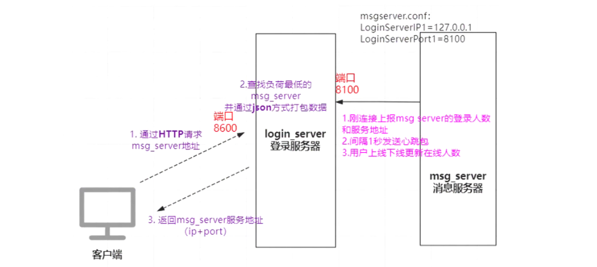

### login_server.cpp逻辑分析

```cpp
#include "ConfigFileReader.h"
#include "HttpConn.h"
#include "LoginConn.h"
#include "ipparser.h"
#include "netlib.h"
#include "version.h"

IpParser* pIpParser = NULL;
string strMsfsUrl;
string strDiscovery;  // 发现获取地址
void client_callback(void* callback_data, uint8_t msg, uint32_t handle, void* pParam) {
  if (msg == NETLIB_MSG_CONNECT) {
    CLoginConn* pConn = new CLoginConn();
    pConn->OnConnect2(handle, LOGIN_CONN_TYPE_CLIENT);
  } else {
    log_error("!!!error msg: %d ", msg);
  }
}

// this callback will be replaced by imconn_callback() in OnConnect()
// msg_server请求连接事件
void msg_serv_callback(void* callback_data, uint8_t msg, uint32_t handle, void* pParam) {
  log("msg_server come in");

  if (msg == NETLIB_MSG_CONNECT) {
    CLoginConn* pConn = new CLoginConn();
    pConn->OnConnect2(handle, LOGIN_CONN_TYPE_MSG_SERV);
  } else {
    log_error("!!!error msg: %d ", msg);
  }
}

// Android、IOS、PC等客户端请求连接事件
void http_callback(void* callback_data, uint8_t msg, uint32_t handle, void* pParam) {
  if (msg == NETLIB_MSG_CONNECT) {
    // 这里是不是觉得很奇怪,为什么new了对象却没有释放?
    // 实际上对象在被Close时使用delete this的方式释放自己
    CHttpConn* pConn = new CHttpConn();
    pConn->OnConnect(handle);
  } else {
    log_error("!!!error msg: %d ", msg);
  }
}

int main(int argc, char* argv[]) {
  if ((argc == 2) && (strcmp(argv[1], "-v") == 0)) {
    log_fatal("Server Version: LoginServer/%s\n", VERSION);
    log_fatal("Server Build: %s %s\n", __DATE__, __TIME__);
    return 0;
  }

  signal(SIGPIPE, SIG_IGN);

  // 1.配置文件读取
  CConfigFileReader config_file("loginserver.conf");

  char* client_listen_ip = config_file.GetConfigName("ClientListenIP");
  char* str_client_port = config_file.GetConfigName("ClientPort");
  char* http_listen_ip = config_file.GetConfigName("HttpListenIP");
  char* str_http_port = config_file.GetConfigName("HttpPort");
  char* msg_server_listen_ip = config_file.GetConfigName("MsgServerListenIP");
  char* str_msg_server_port = config_file.GetConfigName("MsgServerPort");
  char* str_msfs_url = config_file.GetConfigName("msfs");
  char* str_discovery = config_file.GetConfigName("discovery");

  if (!msg_server_listen_ip || !str_msg_server_port || !http_listen_ip ||
      !str_http_port || !str_msfs_url || !str_discovery) {
    log("config item missing, exit... ");
    return -1;
  }

  uint16_t client_port = atoi(str_client_port);
  uint16_t msg_server_port = atoi(str_msg_server_port);
  uint16_t http_port = atoi(str_http_port);
  strMsfsUrl = str_msfs_url;
  strDiscovery = str_discovery;

  // 2.开始监听 对应的ip与端口号 调用对应的回调函数
  pIpParser = new IpParser();

  int ret = netlib_init();

  if (ret == NETLIB_ERROR) return ret;
  CStrExplode client_listen_ip_list(client_listen_ip, ';');
  for (uint32_t i = 0; i < client_listen_ip_list.GetItemCnt(); i++) {
    ret = netlib_listen(client_listen_ip_list.GetItem(i), client_port, client_callback, NULL);
    if (ret == NETLIB_ERROR) return ret;
  }

  CStrExplode msg_server_listen_ip_list(msg_server_listen_ip, ';');
  for (uint32_t i = 0; i < msg_server_listen_ip_list.GetItemCnt(); i++) {
    ret = netlib_listen(msg_server_listen_ip_list.GetItem(i), msg_server_port, msg_serv_callback, NULL);
    if (ret == NETLIB_ERROR) return ret;
  }

  CStrExplode http_listen_ip_list(http_listen_ip, ';');
  for (uint32_t i = 0; i < http_listen_ip_list.GetItemCnt(); i++) {
    ret = netlib_listen(http_listen_ip_list.GetItem(i), http_port, http_callback, NULL);
    if (ret == NETLIB_ERROR) return ret;
  }

  log("server start listen on:\nFor client %s:%d\nFor MsgServer: %s:%d\nFor "
      "http:%s:%d\n",
      client_listen_ip, client_port, msg_server_listen_ip, msg_server_port,
      http_listen_ip, http_port);
  init_login_conn();
  init_http_conn();

  log("now enter the event loop...\n");

  writePid();

  netlib_eventloop();

  return 0;
}
```

监听 对应的ip与端口号 调用对应的回调函数client_callback、msg_serv_callback、http_callback

对于reactor模型回调函数是非常重要的，监听时监听不同，<font color='#BAOC2F'>不同的端口要处理什么业务</font>是需要<font color='#BAOC2F'>由对应的回调函数来决定的</font>，

```cpp
  CStrExplode client_listen_ip_list(client_listen_ip, ';');
  for (uint32_t i = 0; i < client_listen_ip_list.GetItemCnt(); i++) {
    ret = netlib_listen(client_listen_ip_list.GetItem(i), client_port, client_callback, NULL);
    if (ret == NETLIB_ERROR) return ret;
  }

  CStrExplode msg_server_listen_ip_list(msg_server_listen_ip, ';');
  for (uint32_t i = 0; i < msg_server_listen_ip_list.GetItemCnt(); i++) {
    ret = netlib_listen(msg_server_listen_ip_list.GetItem(i), msg_server_port, msg_serv_callback, NULL);
    if (ret == NETLIB_ERROR) return ret;
  }

  CStrExplode http_listen_ip_list(http_listen_ip, ';');
  for (uint32_t i = 0; i < http_listen_ip_list.GetItemCnt(); i++) {
    ret = netlib_listen(http_listen_ip_list.GetItem(i), http_port, http_callback, NULL);
    if (ret == NETLIB_ERROR) return ret;
  }
```

#### http_callback

对于http_callback函数，

如果有http客户端请求则会创建一个`CHttpConn();`服务对象，通过http的方式去解析数据，然后对数据进行处理，最后将response响应发回给客户端，

```cpp
// Android、IOS、PC等客户端请求连接事件
void http_callback(void* callback_data, uint8_t msg, uint32_t handle, void* pParam) {
  if (msg == NETLIB_MSG_CONNECT) {
    // 这里是不是觉得很奇怪,为什么new了对象却没有释放?
    // 实际上对象在被Close时使用delete this的方式释放自己
    CHttpConn* pConn = new CHttpConn();
    pConn->OnConnect(handle);
  } else {
    log_error("!!!error msg: %d ", msg);
  }
}
```

##### HttpConn.h

```cpp
#ifndef __HTTP_CONN_H__
#define __HTTP_CONN_H__

#include "HttpParserWrapper.h"
#include "netlib.h"
#include "util.h"

#define HTTP_CONN_TIMEOUT 60000

#define READ_BUF_SIZE 2048
#define HTTP_RESPONSE_HTML \
  "HTTP/1.1 200 OK\r\n"    \
  "Connection:close\r\n"   \
  "Content-Length:%d\r\n"  \
  "Content-Type:text/html;charset=utf-8\r\n\r\n%s"
#define HTTP_RESPONSE_HTML_MAX 1024

enum {
  CONN_STATE_IDLE,
  CONN_STATE_CONNECTED,
  CONN_STATE_OPEN,
  CONN_STATE_CLOSED,
};

class CHttpConn : public CRefObject {
 public:
  CHttpConn();
  virtual ~CHttpConn();

  uint32_t GetConnHandle() { return m_conn_handle; }
  char* GetPeerIP() { return (char*)m_peer_ip.c_str(); }

  int Send(void* data, int len);

  void Close();
  void OnConnect(net_handle_t handle);
  void OnRead();
  void OnWrite();
  void OnClose();
  void OnTimer(uint64_t curr_tick);
  void OnWriteComlete();

 private:
  void _HandleMsgServRequest(string& url, string& post_data);

 protected:
  net_handle_t m_sock_handle;
  uint32_t m_conn_handle;
  bool m_busy;

  uint32_t m_state;
  std::string m_peer_ip;
  uint16_t m_peer_port;
  CSimpleBuffer m_in_buf;
  CSimpleBuffer m_out_buf;

  uint64_t m_last_send_tick;
  uint64_t m_last_recv_tick;

  CHttpParserWrapper m_cHttpParser;
};

typedef hash_map<uint32_t, CHttpConn*> HttpConnMap_t;

CHttpConn* FindHttpConnByHandle(uint32_t handle);
void init_http_conn();

#endif /* IMCONN_H_ */
```

##### OnRead

读取数据解析http数据，然后调用_HandleMsgServRequest函数进行数据处理，

```cpp
void CHttpConn::OnRead() {
  for (;;) {
    uint32_t free_buf_len = m_in_buf.GetAllocSize() - m_in_buf.GetWriteOffset();
    if (free_buf_len < READ_BUF_SIZE + 1) m_in_buf.Extend(READ_BUF_SIZE + 1);

    int ret = netlib_recv(m_sock_handle,
                          m_in_buf.GetBuffer() + m_in_buf.GetWriteOffset(),
                          READ_BUF_SIZE);
    if (ret <= 0) break;

    m_in_buf.IncWriteOffset(ret);

    m_last_recv_tick = get_tick_count();
  }

  // 每次请求对应一个HTTP连接，所以读完数据后，不用在同一个连接里面准备读取下个请求
  char* in_buf = (char*)m_in_buf.GetBuffer();
  uint32_t buf_len = m_in_buf.GetWriteOffset();
  in_buf[buf_len] = '\0';

  // 如果buf_len 过长可能是受到攻击，则断开连接
  // 正常的url最大长度为2048，我们接受的所有数据长度不得大于1K
  if (buf_len > 1024) {
    log_error("get too much data:%s ", in_buf);
    Close();
    return;
  }

  // log("OnRead, buf_len=%u, conn_handle=%u\n", buf_len, m_conn_handle); // for
  // debug

  // 解析http数据
  m_cHttpParser.ParseHttpContent(in_buf, buf_len);

  if (m_cHttpParser.IsReadAll()) {
    string url = m_cHttpParser.GetUrl();
    if (strncmp(url.c_str(), "/msg_server", 11) == 0) {  // 路由判断
      string content = m_cHttpParser.GetBodyContent();
      _HandleMsgServRequest(url, content);
    } else {
      log_error("url unknown, url=%s ", url.c_str());
      Close();
    }
  }
}
```

##### _HandleMsgServRequest

将负载较小的msg_server服务器的ip与端口填充到json中，并发送数据回客户端，

```cpp
// Add By Lanhu 2014-12-19 通过登陆IP来优选电信还是联通IP
void CHttpConn::_HandleMsgServRequest(string& url, string& post_data) {
  msg_serv_info_t* pMsgServInfo;
  uint32_t min_user_cnt = (uint32_t)-1;
  map<uint32_t, msg_serv_info_t*>::iterator it_min_conn = g_msg_serv_info.end();
  map<uint32_t, msg_serv_info_t*>::iterator it;
  log("url:%s, post_data:%s", url.c_str(), post_data.c_str());

  if (g_msg_serv_info.size() <= 0)  // 没有可用的msg_server
  {
    Json::Value value;
    value["code"] = 1;
    value["msg"] = "没有msg_server";
    string strContent = value.toStyledString();
    char* szContent = new char[HTTP_RESPONSE_HTML_MAX];
    snprintf(szContent, HTTP_RESPONSE_HTML_MAX, HTTP_RESPONSE_HTML,
             strContent.length(), strContent.c_str());
    Send((void*)szContent, strlen(szContent));
    delete[] szContent;
    return;
  }

  // 查找负载最小的msg_server
  for (it = g_msg_serv_info.begin(); it != g_msg_serv_info.end(); it++) {
    pMsgServInfo = it->second;
    if ((pMsgServInfo->cur_conn_cnt < pMsgServInfo->max_conn_cnt) &&
        (pMsgServInfo->cur_conn_cnt < min_user_cnt)) {
      it_min_conn = it;
      min_user_cnt = pMsgServInfo->cur_conn_cnt;
    }
  }

  if (it_min_conn == g_msg_serv_info.end()) {
    log("All TCP MsgServer are full ");
    Json::Value value;
    value["code"] = 2;
    value["msg"] = "负载过高";
    string strContent = value.toStyledString();
    char* szContent = new char[HTTP_RESPONSE_HTML_MAX];
    snprintf(szContent, HTTP_RESPONSE_HTML_MAX, HTTP_RESPONSE_HTML,
             strContent.length(), strContent.c_str());
    Send((void*)szContent, strlen(szContent));
    delete[] szContent;
    return;
  } else {  // 找到合适的msg_server
    Json::Value value;
    value["code"] = 0;
    value["msg"] = "";
    if (pIpParser->isTelcome(GetPeerIP())) {
      value["priorIP"] = string(it_min_conn->second->ip_addr1);
      value["backupIP"] = string(it_min_conn->second->ip_addr2);
      value["msfsPrior"] = strMsfsUrl;
      value["msfsBackup"] = strMsfsUrl;
    } else {
      value["priorIP"] = string(it_min_conn->second->ip_addr2);
      value["backupIP"] = string(it_min_conn->second->ip_addr1);
      value["msfsPrior"] = strMsfsUrl;
      value["msfsBackup"] = strMsfsUrl;
    }
    value["discovery"] = strDiscovery;
    value["port"] = int2string(it_min_conn->second->port);
    string strContent = value.toStyledString();
    char* szContent = new char[HTTP_RESPONSE_HTML_MAX];
    uint32_t nLen = strContent.length();
    snprintf(szContent, HTTP_RESPONSE_HTML_MAX, HTTP_RESPONSE_HTML, nLen,
             strContent.c_str());
    Send((void*)szContent, strlen(szContent));
    delete[] szContent;
    return;
  }
}
```


#### msg_serv_callback&client_callback

对于msg_serv_callback函数，

如果有http客户端请求则会创建一个`CLoginConn();`服务对象，通过http的方式去解析数据，然后对数据进行处理，最后将response响应发回给客户端，

```cpp
// this callback will be replaced by imconn_callback() in OnConnect()
// msg_server请求连接事件
void msg_serv_callback(void* callback_data, uint8_t msg, uint32_t handle, void* pParam) {
  log("msg_server come in");

  if (msg == NETLIB_MSG_CONNECT) {
    CLoginConn* pConn = new CLoginConn();
    pConn->OnConnect2(handle, LOGIN_CONN_TYPE_MSG_SERV);
  } else {
    log_error("!!!error msg: %d ", msg);
  }
}
```

对于client_callback函数，

如果有http客户端请求则会创建一个`CLoginConn();`服务对象，通过http的方式去解析数据，然后对数据进行处理，最后将response响应发回给客户端，

```cpp
void client_callback(void* callback_data, uint8_t msg, uint32_t handle, void* pParam) {
  if (msg == NETLIB_MSG_CONNECT) {
    CLoginConn* pConn = new CLoginConn();
    pConn->OnConnect2(handle, LOGIN_CONN_TYPE_CLIENT);
  } else {
    log_error("!!!error msg: %d ", msg);
  }
}
```

##### LoginConn.h

```cpp
#ifndef LOGINCONN_H_
#define LOGINCONN_H_

#include "imconn.h"

enum { LOGIN_CONN_TYPE_CLIENT = 1, LOGIN_CONN_TYPE_MSG_SERV };

typedef struct {
  string ip_addr1;  // 电信IP
  string ip_addr2;  // 网通IP
  uint16_t port;
  uint32_t max_conn_cnt;
  uint32_t cur_conn_cnt;
  string hostname;  // 消息服务器的主机名
} msg_serv_info_t;

class CLoginConn : public CImConn {
 public:
  CLoginConn();
  virtual ~CLoginConn();

  virtual void Close();

  void OnConnect2(net_handle_t handle, int conn_type);
  virtual void OnClose();
  virtual void OnTimer(uint64_t curr_tick);

  virtual void HandlePdu(CImPdu* pPdu);

 private:
  void _HandleMsgServInfo(CImPdu* pPdu);
  void _HandleUserCntUpdate(CImPdu* pPdu);
  void _HandleMsgServRequest(CImPdu* pPdu);

 private:
  int m_conn_type;
};

void init_login_conn();

#endif /* LOGINCONN_H_ */
```

##### OnConnect2

```cpp
void CLoginConn::OnConnect2(net_handle_t handle, int conn_type) {
  m_handle = handle;
  m_conn_type = conn_type;
  ConnMap_t* conn_map = &g_msg_serv_conn_map;
  if (conn_type == LOGIN_CONN_TYPE_CLIENT) {
    conn_map = &g_client_conn_map;
  } else {
    conn_map->insert(make_pair(handle, this));
  }
  netlib_option(handle, NETLIB_OPT_SET_CALLBACK, (void*)imconn_callback);
  netlib_option(handle, NETLIB_OPT_SET_CALLBACK_DATA, (void*)conn_map);
}
```

##### HandlePdu

```cpp
// HandlePdu在imconn.cpp的OnRead函数中调用
void CLoginConn::HandlePdu(CImPdu* pPdu) {
  log("HandlePdu = %u", pPdu->GetCommandId());
  switch (pPdu->GetCommandId()) {
    case CID_OTHER_HEARTBEAT:
      break;
    case CID_OTHER_MSG_SERV_INFO:
      _HandleMsgServInfo(pPdu);
      break;
    case CID_OTHER_USER_CNT_UPDATE:
      _HandleUserCntUpdate(pPdu);
      break;
    case CID_LOGIN_REQ_MSGSERVER:
      _HandleMsgServRequest(pPdu);
      break;

    default:
      log("wrong msg, cmd id=%d ", pPdu->GetCommandId());
      break;
  }
}
```

LOGIN_CONN_TYPE_MSG_SERV

对于msg_serv_callback回调函数，其传入的参数LOGIN_CONN_TYPE_MSG_SERV在OnConnect2函数中进行了分支，

```cpp
void CLoginConn::_HandleMsgServInfo(CImPdu* pPdu) {
  msg_serv_info_t* pMsgServInfo = new msg_serv_info_t;
  IM::Server::IMMsgServInfo msg;
  msg.ParseFromArray(pPdu->GetBodyData(), pPdu->GetBodyLength());

  pMsgServInfo->ip_addr1 = msg.ip1();
  pMsgServInfo->ip_addr2 = msg.ip2();
  pMsgServInfo->port = msg.port();
  pMsgServInfo->max_conn_cnt = msg.max_conn_cnt();
  pMsgServInfo->cur_conn_cnt = msg.cur_conn_cnt();
  pMsgServInfo->hostname = msg.host_name();
  g_msg_serv_info.insert(make_pair(m_handle, pMsgServInfo));

  g_total_online_user_cnt += pMsgServInfo->cur_conn_cnt;

  log("MsgServInfo, ip_addr1=%s, ip_addr2=%s, port=%d, max_conn_cnt=%d, "
      "cur_conn_cnt=%d, "
      "hostname: %s. ",
      pMsgServInfo->ip_addr1.c_str(), pMsgServInfo->ip_addr2.c_str(),
      pMsgServInfo->port, pMsgServInfo->max_conn_cnt,
      pMsgServInfo->cur_conn_cnt, pMsgServInfo->hostname.c_str());
}
```


##### LOGIN_CONN_TYPE_CLIENT

对于client_callback回调函数，其传入的参数LOGIN_CONN_TYPE_CLIENT在OnConnect2函数中进行了分支，


### 登录业务

#### 1.登录账号用户名密码验证

明文密码不可使用，需要使用md5进行加密后再发送到服务端，进行账户登录验证，

1. 客户端对密码进行md5加密，发送到服务端md5(password)
2. 服务端将加密后的密码+混淆码后，再次使用md5进行数据加密 md5(password_md5+混淆码) 
3. 最后再数据库中存储 md5(password_md5+混淆码) 与 混淆码的信息
4. 当在服务器端进行用户密码登录验证时，需要将混淆密与客户端发送来的md5(password)结合，再次加密后进行比对

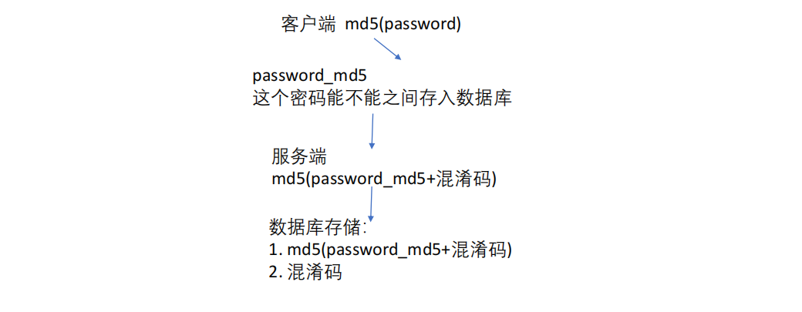

#### 2.在线状态设置&路由状态更新

客户端状态、服务端状态、路由状态更新

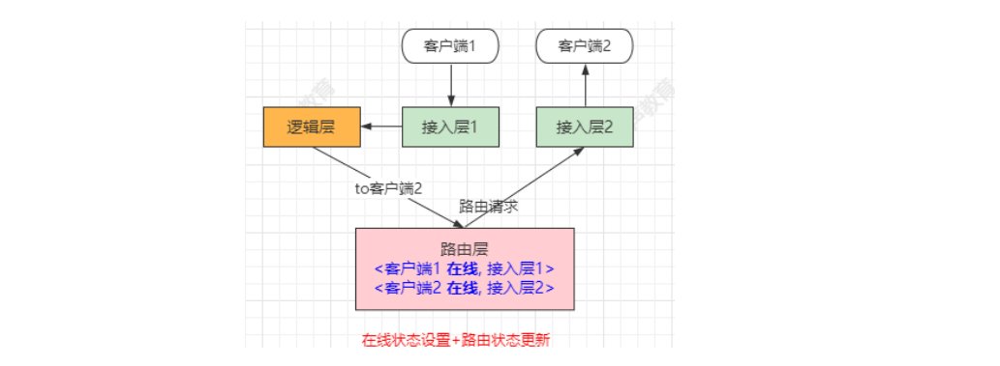

1. 当客户端进入某个接入层后，需要<font color='#BAOC2F'>将状态信息更新到路由层中</font>，
2. 这样就能够找到客户端对应是在哪个接入层，这样就能够找到客户端在哪个msg_server中进行的登录操作，

#### 3.旧客户端账号通知下线

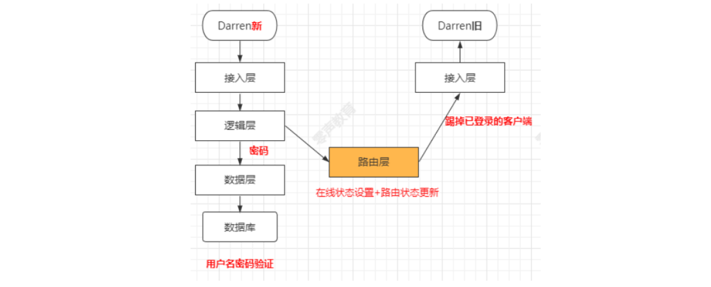

- pc登录
    - 如果办公室pc已经登录，手机再登录没有问题
    - 如果办公室pc已经登录，在家中pc再次登录，办公室pc端下线
- 手机登录
    - 换个手机再次登录，之前的手机下线
    - 如果使用pc登录，没有问题并提醒pc有移动端上线

#### 4.好友上线广播通知

当好友上线时，需要通过路由层对所有好友进行广播通知，

当客户端需要查询哪些好友是在线的，需要将id列表打包在一起，如果是多个好友需要将信息进行打包，

#### 5.账号信息同步

当账号信息需要同步时，主要同步的内容包括，好友列表、分组列表、群组列表、未读消息等（特别是登录微信，当换了新手机时登录过程非常慢）

登录时<font color='#BAOC2F'>有选择性的拉取信息</font>：（好友比消息更重要，微信从qq中倒入好友关系）

- 好友列表：可以根据时间更新节点
- 分组列表：
- 未读消息：

#### 6.登录数据准备

登录成功后需要读取数据包括登录用户的分组信息、好友列表、群组列表、好友信息、未读消息、以及其他消息等。


### 业务实现

msg_server与各个服务器之间进行通信，实现信息交换以及各个业务的实现，

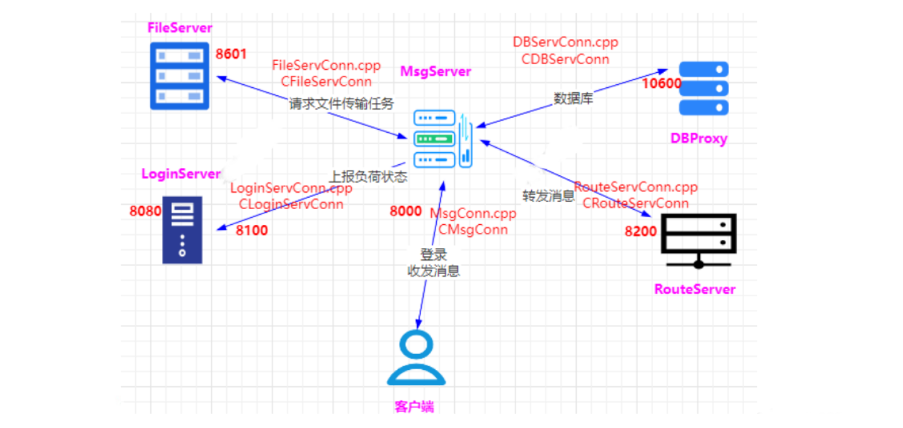

```cpp
/* MsgConn.cpp部分代码 */
void CMsgConn::HandlePdu(CImPdu* pPdu) {
  if (pPdu->GetCommandId() != CID_OTHER_HEARTBEAT)
    log("HandlePdu cmd:0x%04x\n",
        pPdu->GetCommandId());  // request authorization check
  if (pPdu->GetCommandId() != CID_LOGIN_REQ_USERLOGIN && !IsOpen() &&
      IsKickOff()) {
    log("HandlePdu, wrong msg. ");
    throw CPduException(pPdu->GetServiceId(), pPdu->GetCommandId(),
                        ERROR_CODE_WRONG_SERVICE_ID,
                        "HandlePdu error, user not login. ");
    return;
  }
  switch (pPdu->GetCommandId()) {
    case CID_OTHER_HEARTBEAT:
      _HandleHeartBeat(pPdu);
      break;
    case CID_LOGIN_REQ_USERLOGIN:
      _HandleLoginRequest(pPdu);
      break;
    case CID_LOGIN_REQ_LOGINOUT:
      _HandleLoginOutRequest(pPdu);
      break;
    case CID_LOGIN_REQ_DEVICETOKEN:
      _HandleClientDeviceToken(pPdu);
      break;
    case CID_LOGIN_REQ_KICKPCCLIENT:
      _HandleKickPCClient(pPdu);
      break;
    case CID_LOGIN_REQ_PUSH_SHIELD:
      _HandlePushShieldRequest(pPdu);
      break;

    case CID_LOGIN_REQ_QUERY_PUSH_SHIELD:
      _HandleQueryPushShieldRequest(pPdu);
      break;
    case CID_LOGIN_REQ_REGIST:
      _HandleRegistRequest(pPdu);
      break;
    case CID_MSG_DATA:
      _HandleClientMsgData(pPdu);
      break;
    case CID_MSG_DATA_ACK:
      _HandleClientMsgDataAck(pPdu);
      break;
    case CID_MSG_TIME_REQUEST:
      _HandleClientTimeRequest(pPdu);
      break;
    case CID_MSG_LIST_REQUEST:
      _HandleClientGetMsgListRequest(pPdu);
      break;
    case CID_MSG_GET_BY_MSG_ID_REQ:
      _HandleClientGetMsgByMsgIdRequest(pPdu);
      break;
    case CID_MSG_UNREAD_CNT_REQUEST:
      _HandleClientUnreadMsgCntRequest(pPdu);
      break;
    case CID_MSG_READ_ACK:
      _HandleClientMsgReadAck(pPdu);
      break;
    case CID_MSG_GET_LATEST_MSG_ID_REQ:
      _HandleClientGetLatestMsgIDReq(pPdu);
      break;
    case CID_SWITCH_P2P_CMD:
      _HandleClientP2PCmdMsg(pPdu);
      break;
    case CID_BUDDY_LIST_RECENT_CONTACT_SESSION_REQUEST:
      _HandleClientRecentContactSessionRequest(pPdu);
      break;
    case CID_BUDDY_LIST_USER_INFO_REQUEST:
      _HandleClientUserInfoRequest(pPdu);
      break;
    case CID_BUDDY_LIST_REMOVE_SESSION_REQ:
      _HandleClientRemoveSessionRequest(pPdu);
      break;
    case CID_BUDDY_LIST_ALL_USER_REQUEST:
      _HandleClientAllUserRequest(pPdu);
      break;
    case CID_BUDDY_LIST_CHANGE_AVATAR_REQUEST:
      _HandleChangeAvatarRequest(pPdu);
      break;
    case CID_BUDDY_LIST_CHANGE_SIGN_INFO_REQUEST:
      _HandleChangeSignInfoRequest(pPdu);
      break;

    case CID_BUDDY_LIST_USERS_STATUS_REQUEST:
      _HandleClientUsersStatusRequest(pPdu);
      break;
    case CID_BUDDY_LIST_DEPARTMENT_REQUEST:
      _HandleClientDepartmentRequest(pPdu);
      break;
    // for group process
    case CID_GROUP_NORMAL_LIST_REQUEST:
      s_group_chat->HandleClientGroupNormalRequest(pPdu, this);
      break;
    case CID_GROUP_INFO_REQUEST:
      s_group_chat->HandleClientGroupInfoRequest(pPdu, this);
      break;
    case CID_GROUP_CREATE_REQUEST:
      s_group_chat->HandleClientGroupCreateRequest(pPdu, this);
      break;
    case CID_GROUP_CHANGE_MEMBER_REQUEST:
      s_group_chat->HandleClientGroupChangeMemberRequest(pPdu, this);
      break;
    case CID_GROUP_SHIELD_GROUP_REQUEST:
      s_group_chat->HandleClientGroupShieldGroupRequest(pPdu, this);
      break;

    case CID_FILE_REQUEST:
      s_file_handler->HandleClientFileRequest(this, pPdu);
      break;
    case CID_FILE_HAS_OFFLINE_REQ:
      s_file_handler->HandleClientFileHasOfflineReq(this, pPdu);
      break;
    case CID_FILE_ADD_OFFLINE_REQ:
      s_file_handler->HandleClientFileAddOfflineReq(this, pPdu);
      break;
    case CID_FILE_DEL_OFFLINE_REQ:
      s_file_handler->HandleClientFileDelOfflineReq(this, pPdu);
      break;
    default:
      log("wrong msg, cmd id=%d, user id=%u. ", pPdu->GetCommandId(),
          GetUserId());
      break;
  }
}
```

#### 1.登录验证

CID_LOGIN_REQ_USERLOGIN

结合proto文件理解msg_server登录逻辑，

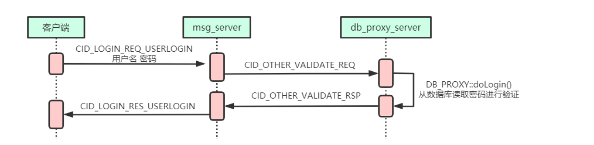

```cpp
/* IM.Login.proto */
message IMLoginReq{
	//cmd id:		0x0103
	required string user_name = 1;
	required string password = 2;
	required IM.BaseDefine.UserStatType online_status = 3;
	required IM.BaseDefine.ClientType client_type = 4;
	optional string client_version = 5;
}
message IMLoginRes{
	//cmd id:		0x0104
	required uint32 server_time = 1;
	required IM.BaseDefine.ResultType result_code = 2;
	optional string result_string = 3;
	optional IM.BaseDefine.UserStatType online_status = 4;
	optional IM.BaseDefine.UserInfo user_info = 5;
}
```

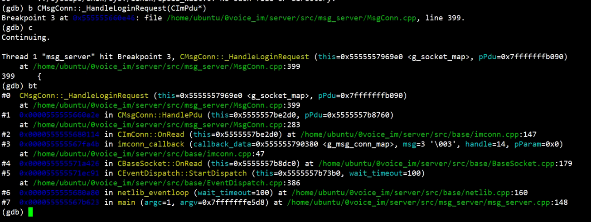

1. CMsgConn::HandlePdu （msg_server模块，处理客户端的请求的信息）
2. CMsgConn::_HandleLoginRequest （msg_server模块，处理客户端的登录请求信息，CID_LOGIN_REQ_USERLOGIN命令）
3. CImUserManager::AddImUserByLoginName（msg_server模块，将登录的user_name封装以user_name(login_name)为key封装成pImUser插⼊到m_im_user_map_by_name）
4. proxy_serv_callback （db_proxy_server模块）处理其他server的数据库操作请求，每个请求new CProxyConn()；
5. DB_PROXY::doLogin （db_proxy_server模块）msg_server 往dbproxy_server发登录验证请求（CID_OTHER_VALIDATE_REQ），在db_proxy_server的doLogin进⾏处理，主要流程：
    - 先检测是否密码经常错误
    - 调⽤CInterLoginStrategy::doLogin 验证账号和密码是否匹配
    - 如果账号密码匹配则返回正确，如果错误则返回错误，使⽤CID_OTHER_VALIDATE_RSP命令；
6. CProxyConn::AddResponsePdu （db_proxy_server模块）处理完其他server的请求后需要回发信息，但不会直接调⽤send进⾏发送，⽽是封装成ResponsePdu_t插⼊到s_response_pdu_list队列，由另外的线程取出来进⾏发送。
7. CProxyConn::SendResponsePduList（db_proxy_server模块）负责回发 ResponsePdu_t。打个断点也⽅便分析是loop循环由谁发起，实际上这⾥的loop和epoll所在的loop同属于⼀个⼤loop。init_proxy_conn时调⽤netlib_add_loop(proxy_loop_callback, NULL);进⾏注册loop，⽽proxy_loop_callback实质是调⽤了CProxyConn::SendResponsePduList()
8. CDBServConn::HandlePdu （msg_server模块，处理dbproxy回发的数据），根据CID_OTHER_VALIDATE_RSP找到对应的处理函数
9. CDBServConn::_HandleValidateResponse （msg_server模块），使⽤CID_LOGIN_RES_USERLOGIN命令回应客户端。
10. CRouteServConn::_HandlePCLoginStatusNotify（msg_server模块）客户端回复CID_OTHER_LOGIN_STATUS_NOTIFY，通知其他端⽬前⾃⼰的登录情况。

##### MsgConn.cpp->CMsgConn::HandlePdu

```cpp
void CMsgConn::HandlePdu(CImPdu* pPdu) {
  if (pPdu->GetCommandId() != CID_OTHER_HEARTBEAT)
    log("HandlePdu cmd:0x%04x\n", pPdu->GetCommandId());  // request authorization check
  if (pPdu->GetCommandId() != CID_LOGIN_REQ_USERLOGIN && !IsOpen() &&
      IsKickOff()) {
    log("HandlePdu, wrong msg. ");
    throw CPduException(pPdu->GetServiceId(), pPdu->GetCommandId(), ERROR_CODE_WRONG_SERVICE_ID, "HandlePdu error, user not login. ");
    return;
  }
  switch (pPdu->GetCommandId()) {
    case CID_OTHER_HEARTBEAT:
      _HandleHeartBeat(pPdu);
      break;
    case CID_LOGIN_REQ_USERLOGIN:
      _HandleLoginRequest(pPdu);
      break;
    case CID_LOGIN_REQ_LOGINOUT:
      _HandleLoginOutRequest(pPdu);
      break;
    case CID_LOGIN_REQ_DEVICETOKEN:
      _HandleClientDeviceToken(pPdu);
      break;
    case CID_LOGIN_REQ_KICKPCCLIENT:
      _HandleKickPCClient(pPdu);
      break;
    case CID_LOGIN_REQ_PUSH_SHIELD:
      _HandlePushShieldRequest(pPdu);
      break;

    case CID_LOGIN_REQ_QUERY_PUSH_SHIELD:
      _HandleQueryPushShieldRequest(pPdu);
      break;
    case CID_LOGIN_REQ_REGIST:
      _HandleRegistRequest(pPdu);
      break;
    case CID_MSG_DATA:
      _HandleClientMsgData(pPdu);
      break;
    case CID_MSG_DATA_ACK:
      _HandleClientMsgDataAck(pPdu);
      break;
    case CID_MSG_TIME_REQUEST:
      _HandleClientTimeRequest(pPdu);
      break;
    case CID_MSG_LIST_REQUEST:
      _HandleClientGetMsgListRequest(pPdu);
      break;
    case CID_MSG_GET_BY_MSG_ID_REQ:
      _HandleClientGetMsgByMsgIdRequest(pPdu);
      break;
    case CID_MSG_UNREAD_CNT_REQUEST:
      _HandleClientUnreadMsgCntRequest(pPdu);
      break;
    case CID_MSG_READ_ACK:
      _HandleClientMsgReadAck(pPdu);
      break;
    case CID_MSG_GET_LATEST_MSG_ID_REQ:
      _HandleClientGetLatestMsgIDReq(pPdu);
      break;
    case CID_SWITCH_P2P_CMD:
      _HandleClientP2PCmdMsg(pPdu);
      break;
    case CID_BUDDY_LIST_RECENT_CONTACT_SESSION_REQUEST:
      _HandleClientRecentContactSessionRequest(pPdu);
      break;
    case CID_BUDDY_LIST_USER_INFO_REQUEST:
      _HandleClientUserInfoRequest(pPdu);
      break;
    case CID_BUDDY_LIST_REMOVE_SESSION_REQ:
      _HandleClientRemoveSessionRequest(pPdu);
      break;
    case CID_BUDDY_LIST_ALL_USER_REQUEST:
      _HandleClientAllUserRequest(pPdu);
      break;
    case CID_BUDDY_LIST_CHANGE_AVATAR_REQUEST:
      _HandleChangeAvatarRequest(pPdu);
      break;
    case CID_BUDDY_LIST_CHANGE_SIGN_INFO_REQUEST:
      _HandleChangeSignInfoRequest(pPdu);
      break;

    case CID_BUDDY_LIST_USERS_STATUS_REQUEST:
      _HandleClientUsersStatusRequest(pPdu);
      break;
    case CID_BUDDY_LIST_DEPARTMENT_REQUEST:
      _HandleClientDepartmentRequest(pPdu);
      break;
    // for group process
    case CID_GROUP_NORMAL_LIST_REQUEST:
      s_group_chat->HandleClientGroupNormalRequest(pPdu, this);
      break;
    case CID_GROUP_INFO_REQUEST:
      s_group_chat->HandleClientGroupInfoRequest(pPdu, this);
      break;
    case CID_GROUP_CREATE_REQUEST:
      s_group_chat->HandleClientGroupCreateRequest(pPdu, this);
      break;
    case CID_GROUP_CHANGE_MEMBER_REQUEST:
      s_group_chat->HandleClientGroupChangeMemberRequest(pPdu, this);
      break;
    case CID_GROUP_SHIELD_GROUP_REQUEST:
      s_group_chat->HandleClientGroupShieldGroupRequest(pPdu, this);
      break;

    case CID_FILE_REQUEST:
      s_file_handler->HandleClientFileRequest(this, pPdu);
      break;
    case CID_FILE_HAS_OFFLINE_REQ:
      s_file_handler->HandleClientFileHasOfflineReq(this, pPdu);
      break;
    case CID_FILE_ADD_OFFLINE_REQ:
      s_file_handler->HandleClientFileAddOfflineReq(this, pPdu);
      break;
    case CID_FILE_DEL_OFFLINE_REQ:
      s_file_handler->HandleClientFileDelOfflineReq(this, pPdu);
      break;
    default:
      log("wrong msg, cmd id=%d, user id=%u. ", pPdu->GetCommandId(),
          GetUserId());
      break;
  }
}
```

##### MsgConn.cpp->CMsgConn::_HandleLoginRequest

```cpp
// process: send validate request to db server
void CMsgConn::_HandleLoginRequest(CImPdu* pPdu) {
  // 1.refuse second validate request
  if (m_login_name.length() != 0) {
    log("duplicate LoginRequest in the same conn ");
    return;
  }

  // 2.check if all server connection are OK
  uint32_t result = 0;
  string result_string = "";
  CDBServConn* pDbConn = get_db_serv_conn_for_login();//连接dbproxy服务器
  if (!pDbConn) {
    /* 数据库服务器异常 */
    result = IM::BaseDefine::REFUSE_REASON_NO_DB_SERVER;
    result_string = "服务端异常";
  } else if (!is_login_server_available()) {
    /* 登录服务器异常 */
    result = IM::BaseDefine::REFUSE_REASON_NO_LOGIN_SERVER;
    result_string = "服务端异常";
  } else if (!is_route_server_available()) {
    /* 路由服务器异常 */
    result = IM::BaseDefine::REFUSE_REASON_NO_ROUTE_SERVER;
    result_string = "服务端异常";
  }

  //3.对dbproxy服务器连接失败的情况做处理
  if (result) {
    IM::Login::IMLoginRes msg;
    msg.set_server_time(time(NULL));
    msg.set_result_code((IM::BaseDefine::ResultType)result);
    msg.set_result_string(result_string);
    CImPdu pdu;
    pdu.SetPBMsg(&msg);
    pdu.SetServiceId(SID_LOGIN);
    pdu.SetCommandId(CID_LOGIN_RES_USERLOGIN);  // 如果db_proxy_server没有启动
    pdu.SetSeqNum(pPdu->GetSeqNum());
    SendPdu(&pdu);
    Close();  // 关闭 CMsgConn* pConn = new CMsgConn(); 什么时候释放资源
    return;
  }

  /* 
    在请求登录时并没有向routeServer中发送信息 
    这是因为在发送登录请求时并不能保证一定能登录成功
    所以不会向路由层上报登录状态
   */

  //4.dbproxy服务器连接成功 做进一步的认证请求
  IM::Login::IMLoginReq msg;
  CHECK_PB_PARSE_MSG(msg.ParseFromArray(pPdu->GetBodyData(), pPdu->GetBodyLength()));
  // 假如是汉字，则转成拼音
  m_login_name = msg.user_name();
  string password = msg.password();
  uint32_t online_status = msg.online_status();
  if (online_status < IM::BaseDefine::USER_STATUS_ONLINE ||
      online_status > IM::BaseDefine::USER_STATUS_LEAVE) {
    log("HandleLoginReq, online status wrong: %u ", online_status);
    online_status = IM::BaseDefine::USER_STATUS_ONLINE;
  }
  m_client_version = msg.client_version();
  m_client_type = msg.client_type();
  m_online_status = online_status;
  log("HandleLoginReq, user_name=%s, status=%u, client_type=%u, client=%s, ",
      m_login_name.c_str(), online_status, m_client_type,
      m_client_version.c_str());
  
  CImUser* pImUser = CImUserManager::GetInstance()->GetImUserByLoginName(GetLoginName());
  if (!pImUser) {  // 只允许一个user存在，允许多个端同时登陆
    pImUser = new CImUser(GetLoginName());  // 新建一个用户
    CImUserManager::GetInstance()->AddImUserByLoginName(GetLoginName(), pImUser);
  }

  pImUser->AddUnValidateMsgConn(this);  //
  // attach_data 这个对象作用是什么？他绑定了m_handle，实际是fd
  CDbAttachData attach_data(ATTACH_TYPE_HANDLE, m_handle, 0);
  // continue to validate if the user is OK

  IM::Server::IMValidateReq msg2;
  msg2.set_user_name(msg.user_name());
  msg2.set_password(password);
  msg2.set_attach_data(attach_data.GetBuffer(), attach_data.GetLength());
  CImPdu pdu;
  pdu.SetPBMsg(&msg2);
  pdu.SetServiceId(SID_OTHER);
  pdu.SetCommandId(CID_OTHER_VALIDATE_REQ);  // 请求验证
  pdu.SetSeqNum(pPdu->GetSeqNum());
  pDbConn->SendPdu(&pdu);
}
```

##### HandlerMap.cpp->CHandlerMap::Init

```cpp
/**
 *  初始化函数,加载了各种commandId 对应的处理函数
 */
void CHandlerMap::Init() {
  // Login validate
  m_handler_map.insert(make_pair(uint32_t(CID_OTHER_VALIDATE_REQ), DB_PROXY::doLogin));
  m_handler_map.insert(make_pair(uint32_t(CID_LOGIN_REQ_PUSH_SHIELD), DB_PROXY::doPushShield));
  m_handler_map.insert(make_pair(uint32_t(CID_LOGIN_REQ_QUERY_PUSH_SHIELD), DB_PROXY::doQueryPushShield));

  // recent session
  m_handler_map.insert(make_pair(uint32_t(CID_BUDDY_LIST_RECENT_CONTACT_SESSION_REQUEST), DB_PROXY::getRecentSession));
  m_handler_map.insert(make_pair(uint32_t(CID_BUDDY_LIST_REMOVE_SESSION_REQ), DB_PROXY::deleteRecentSession));

  // users
  m_handler_map.insert(make_pair(uint32_t(CID_BUDDY_LIST_USER_INFO_REQUEST), DB_PROXY::getUserInfo));
  m_handler_map.insert(make_pair(uint32_t(CID_BUDDY_LIST_ALL_USER_REQUEST), DB_PROXY::getChangedUser));
  m_handler_map.insert(make_pair(uint32_t(CID_BUDDY_LIST_DEPARTMENT_REQUEST), DB_PROXY::getChgedDepart));
  m_handler_map.insert(make_pair(uint32_t(CID_BUDDY_LIST_CHANGE_SIGN_INFO_REQUEST), DB_PROXY::changeUserSignInfo));

  // message content
  m_handler_map.insert(make_pair(uint32_t(CID_MSG_DATA), DB_PROXY::sendMessage));
  m_handler_map.insert(make_pair(uint32_t(CID_MSG_LIST_REQUEST), DB_PROXY::getMessage));
  m_handler_map.insert(make_pair(uint32_t(CID_MSG_UNREAD_CNT_REQUEST), DB_PROXY::getUnreadMsgCounter));
  m_handler_map.insert(make_pair(uint32_t(CID_MSG_READ_ACK), DB_PROXY::clearUnreadMsgCounter));
  m_handler_map.insert(make_pair(uint32_t(CID_MSG_GET_BY_MSG_ID_REQ), DB_PROXY::getMessageById));
  m_handler_map.insert(make_pair(uint32_t(CID_MSG_GET_LATEST_MSG_ID_REQ), DB_PROXY::getLatestMsgId));

  // device token
  m_handler_map.insert(make_pair(uint32_t(CID_LOGIN_REQ_DEVICETOKEN), DB_PROXY::setDevicesToken));
  m_handler_map.insert(make_pair(uint32_t(CID_OTHER_GET_DEVICE_TOKEN_REQ), DB_PROXY::getDevicesToken));

  // push 推送设置
  m_handler_map.insert(make_pair(uint32_t(CID_GROUP_SHIELD_GROUP_REQUEST), DB_PROXY::setGroupPush));
  m_handler_map.insert(make_pair(uint32_t(CID_OTHER_GET_SHIELD_REQ), DB_PROXY::getGroupPush));

  // group
  m_handler_map.insert(make_pair(uint32_t(CID_GROUP_NORMAL_LIST_REQUEST), DB_PROXY::getNormalGroupList));
  m_handler_map.insert(make_pair(uint32_t(CID_GROUP_INFO_REQUEST), DB_PROXY::getGroupInfo));
  m_handler_map.insert(make_pair(uint32_t(CID_GROUP_CREATE_REQUEST), DB_PROXY::createGroup));
  m_handler_map.insert(make_pair(uint32_t(CID_GROUP_CHANGE_MEMBER_REQUEST), DB_PROXY::modifyMember));

  // file
  m_handler_map.insert(make_pair(uint32_t(CID_FILE_HAS_OFFLINE_REQ), DB_PROXY::hasOfflineFile));
  m_handler_map.insert(make_pair(uint32_t(CID_FILE_ADD_OFFLINE_REQ), DB_PROXY::addOfflineFile));
  m_handler_map.insert(make_pair(uint32_t(CID_FILE_DEL_OFFLINE_REQ), DB_PROXY::delOfflineFile));
}
```

##### Login.cpp->DB_PROXY::doLogin

```cpp
namespace DB_PROXY {

void doLogin(CImPdu* pPdu, uint32_t conn_uuid) {
  CImPdu* pPduResp = new CImPdu;
  
  IM::Server::IMValidateReq msg;
  IM::Server::IMValidateRsp msgResp;
  if (msg.ParseFromArray(pPdu->GetBodyData(), pPdu->GetBodyLength())) {
    //1.获取基本数据
    string strDomain = msg.user_name();//获取用户名
    string strPass = msg.password();//获取用户密码
    msgResp.set_user_name(strDomain);
    msgResp.set_attach_data(msg.attach_data());

    do {
      //2.对输入密码次数做限制
      CAutoLock cAutoLock(&g_cLimitLock);
      list<uint32_t>& lsErrorTime = g_hmLimits[strDomain];
      uint32_t tmNow = time(NULL);

      // 清理超过30分钟的错误时间点记录
      /*
       清理放在这里还是放在密码错误后添加的时候呢？
       放在这里，每次都要遍历，会有一点点性能的损失。
       放在后面，可能会造成30分钟之前有10次错的，但是本次是对的就没办法再访问了。
       */
      auto itTime = lsErrorTime.begin();
      for (; itTime != lsErrorTime.end(); ++itTime) if (tmNow - *itTime > 30 * 60) break;
      if (itTime != lsErrorTime.end()) lsErrorTime.erase(itTime, lsErrorTime.end());

      // 判断30分钟内密码错误次数是否大于10
      if (lsErrorTime.size() > 10) {
        itTime = lsErrorTime.begin();
        if (tmNow - *itTime <= 30 * 60) {
          msgResp.set_result_code(6);
          msgResp.set_result_string("用户名/密码错误次数太多");
          pPduResp->SetPBMsg(&msgResp);
          pPduResp->SetSeqNum(pPdu->GetSeqNum());
          pPduResp->SetServiceId(IM::BaseDefine::SID_OTHER);
          pPduResp->SetCommandId(IM::BaseDefine::CID_OTHER_VALIDATE_RSP);
          CProxyConn::AddResponsePdu(conn_uuid, pPduResp);
          return;
        }
      }
    } while (false);

    log("%s request login.", strDomain.c_str());
    IM::BaseDefine::UserInfo cUser;

    //3.对密码判定结果的处理
    if (g_loginStrategy.doLogin(strDomain, strPass, cUser)) {
      // 密码正确
      IM::BaseDefine::UserInfo* pUser = msgResp.mutable_user_info();
      pUser->set_user_id(cUser.user_id());
      pUser->set_user_gender(cUser.user_gender());
      pUser->set_department_id(cUser.department_id());
      pUser->set_user_nick_name(cUser.user_nick_name());
      pUser->set_user_domain(cUser.user_domain());
      pUser->set_avatar_url(cUser.avatar_url());

      pUser->set_email(cUser.email());
      pUser->set_user_tel(cUser.user_tel());
      pUser->set_user_real_name(cUser.user_real_name());
      pUser->set_status(0);

      pUser->set_sign_info(cUser.sign_info());

      msgResp.set_result_code(0);
      msgResp.set_result_string("成功");

      // 如果登陆成功，则清除错误尝试限制
      CAutoLock cAutoLock(&g_cLimitLock);
      list<uint32_t>& lsErrorTime = g_hmLimits[strDomain];
      lsErrorTime.clear();
    } else {
      // 密码错误，记录一次登陆失败
      uint32_t tmCurrent = time(NULL);
      CAutoLock cAutoLock(&g_cLimitLock);
      list<uint32_t>& lsErrorTime = g_hmLimits[strDomain];
      lsErrorTime.push_front(tmCurrent);

      log("get result false");
      msgResp.set_result_code(1);
      msgResp.set_result_string("用户名/密码错误");
    }
  } else {
    msgResp.set_result_code(2);
    msgResp.set_result_string("服务端内部错误");
  }

  pPduResp->SetPBMsg(&msgResp);
  pPduResp->SetSeqNum(pPdu->GetSeqNum());
  pPduResp->SetServiceId(IM::BaseDefine::SID_OTHER);
  pPduResp->SetCommandId(IM::BaseDefine::CID_OTHER_VALIDATE_RSP);
  CProxyConn::AddResponsePdu(conn_uuid, pPduResp);
}

};  // namespace DB_PROXY
```

##### InterLogin.cpp->CInterLoginStrategy::doLogin

```cpp
bool CInterLoginStrategy::doLogin(const std::string& strName, const std::string& strPass, IM::BaseDefine::UserInfo& user) {
  bool bRet = false;
  CDBManager* pDBManger = CDBManager::getInstance();
  CDBConn* pDBConn = pDBManger->GetDBConn("teamtalk_slave");
  if (pDBConn) {
    //1.根据用户名 将密码与混淆码 从数据库中取出
    string strSql = "select * from IMUser where name='" + strName + "' and status=0";
    CResultSet* pResultSet = pDBConn->ExecuteQuery(strSql.c_str());
    if (pResultSet) {
      string strResult, strSalt;
      uint32_t nId, nGender, nDeptId, nStatus;
      string strNick, strAvatar, strEmail, strRealName, strTel, strDomain, strSignInfo;
      while (pResultSet->Next()) {
        nId = pResultSet->GetInt("id");
        strResult = pResultSet->GetString("password");
        strSalt = pResultSet->GetString("salt");

        strNick = pResultSet->GetString("nick");
        nGender = pResultSet->GetInt("sex");
        strRealName = pResultSet->GetString("name");
        strDomain = pResultSet->GetString("domain");
        strTel = pResultSet->GetString("phone");
        strEmail = pResultSet->GetString("email");
        strAvatar = pResultSet->GetString("avatar");
        nDeptId = pResultSet->GetInt("departId");
        nStatus = pResultSet->GetInt("status");
        strSignInfo = pResultSet->GetString("sign_info");
      }

      string strInPass = strPass + strSalt; // md(passwd) + 混淆码
      char szMd5[33];
      CMd5::MD5_Calculate(strInPass.c_str(), strInPass.length(), szMd5);
      string strOutPass(szMd5);

      //2.对密码进行匹配 是否与数据库中的密码一致
      if (strOutPass == strResult) {
        bRet = true;
        user.set_user_id(nId);
        user.set_user_nick_name(strNick);
        user.set_user_gender(nGender);
        user.set_user_real_name(strRealName);
        user.set_user_domain(strDomain);
        user.set_user_tel(strTel);
        user.set_email(strEmail);
        user.set_avatar_url(strAvatar);
        user.set_department_id(nDeptId);
        user.set_status(nStatus);
        user.set_sign_info(strSignInfo);
      }
      delete pResultSet;
    }
    pDBManger->RelDBConn(pDBConn);
  }
  return bRet;
}
```

##### DBServConn.cpp->CDBServConn::_HandleValidateResponse

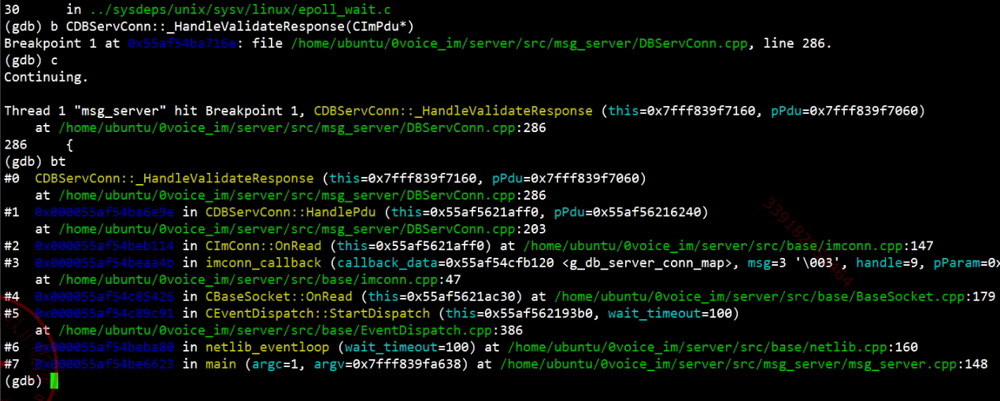

```cpp
//处理验证响应消息的函数 
void CDBServConn::_HandleValidateResponse(CImPdu* pPdu) {
    IM::Server::IMValidateRsp msg;
    // 1.解析验证响应消息 获取登录名 login_name、结果码 result 和 结果字符串 result_string
    CHECK_PB_PARSE_MSG(msg.ParseFromArray(pPdu->GetBodyData(), pPdu->GetBodyLength()));
    string login_name = msg.user_name();
    uint32_t result = msg.result_code();
    string result_string = msg.result_string();

    // 2.根据附加数据构造 CDbAttachData 对象
    CDbAttachData attach_data((uchar_t*)msg.attach_data().c_str(), msg.attach_data().length());
    log("HandleValidateResp, user_name=%s, result=%d", login_name.c_str(), result);

    // 3.根据登录名获取用户对象 pImUser 记录日志
    CImUser* pImUser = CImUserManager::GetInstance()->GetImUserByLoginName(login_name);
    CMsgConn* pMsgConn = NULL;
    if (!pImUser) {
        // 如果用户对象存在，则根据附加数据的句柄获取未验证的消息连接对象 pMsgConn
        log("ImUser for user_name=%s not exist", login_name.c_str());
        return;
    } else {
        // 如果 pMsgConn 不存在或者已经打开，则记录日志并返回
        pMsgConn = pImUser->GetUnValidateMsgConn(attach_data.GetHandle());
        if (!pMsgConn || pMsgConn->IsOpen()) {
            log("no such conn is validated, user_name=%s", login_name.c_str());
            return;
        }
    }

    // 4.如果结果码 result 不为零，将结果码重置为 IM::BaseDefine::REFUSE_REASON_DB_VALIDATE_FAILED
    if (result != 0) result = IM::BaseDefine::REFUSE_REASON_DB_VALIDATE_FAILED;

    // 5.如果结果码为零表示验证成功，继续处理验证成功的逻辑
    if (result == 0) {
        // 5-1.获取用户信息 user_info  user_id  用户对象pUser
        IM::BaseDefine::UserInfo user_info = msg.user_info();
        uint32_t user_id = user_info.user_id();
        CImUser* pUser = CImUserManager::GetInstance()->GetImUserById(user_id);
        if (pUser) {
            // 已存在该ID的用户对象 pUser 则将该连接添加到 pUser 的未验证连接列表中，并从 pImUser 的未验证连接列表中删除
            pUser->AddUnValidateMsgConn(pMsgConn);
            pImUser->DelUnValidateMsgConn(pMsgConn);
            // 如果 pImUser 的未验证连接列表为空，表示没有其他未验证的连接了，可以移除该用户对象
            if (pImUser->IsMsgConnEmpty()) {
                CImUserManager::GetInstance()->RemoveImUserByLoginName(login_name);
                delete pImUser;
            }
        } else {
            // 如果用户对象 pUser 不存在，则将 pUser 设置为 pImUser
            pUser = pImUser;
        }

        // 5-2.设置 pUser 的用户ID、昵称、验证状态
        pUser->SetUserId(user_id);//uid
        pUser->SetNickName(user_info.user_nick_name());//nick_name
        pUser->SetValidated();//SetValidated
        CImUserManager::GetInstance()->AddImUserById(user_id, pUser);

        // 5-3.根据连接的客户端类型踢出相同类型的重复用户
        pUser->KickOutSameClientType(pMsgConn->GetClientType(), IM::BaseDefine::KICK_REASON_DUPLICATE_USER, pMsgConn);

        // 5-4.获取路由服务器连接 pRouteConn，如果存在则向路由服务器发送踢出用户的消息
        CRouteServConn* pRouteConn = get_route_serv_conn();
        if (pRouteConn) {
            IM::Server::IMServerKickUser msg2;
            msg2.set_user_id(user_id);
            msg2.set_client_type((::IM::BaseDefine::ClientType)pMsgConn->GetClientType());
            msg2.set_reason(1);
            CImPdu pdu;
            pdu.SetPBMsg(&msg2);
            pdu.SetServiceId(SID_OTHER);
            pdu.SetCommandId(CID_OTHER_SERVER_KICK_USER);//踢出用户的消息
            pRouteConn->SendPdu(&pdu);
        }
        log("user_name: %s, uid: %d", login_name.c_str(), user_id);

        // 5-5.设置连接的用户ID、打开状态，并发送用户状态更新的消息
        pMsgConn->SetUserId(user_id);
        pMsgConn->SetOpen();
        pMsgConn->SendUserStatusUpdate(IM::BaseDefine::USER_STATUS_ONLINE);
        pUser->ValidateMsgConn(pMsgConn->GetHandle(), pMsgConn);

        // 5-6.构造登录响应消息 msg3，设置相关字段
        IM::Login::IMLoginRes msg3;
        msg3.set_server_time(time(NULL));
        msg3.set_result_code(IM::BaseDefine::REFUSE_REASON_NONE);
        msg3.set_result_string(result_string);
        msg3.set_online_status((IM::BaseDefine::UserStatType)pMsgConn->GetOnlineStatus());
        IM::BaseDefine::UserInfo* user_info_tmp = msg3.mutable_user_info();
        user_info_tmp->set_user_id(user_info.user_id());
        user_info_tmp->set_user_gender(user_info.user_gender());
        user_info_tmp->set_user_nick_name(user_info.user_nick_name());
        user_info_tmp->set_avatar_url(user_info.avatar_url());
        user_info_tmp->set_sign_info(user_info.sign_info());
        user_info_tmp->set_department_id(user_info.department_id());
        user_info_tmp->set_email(user_info.email());
        user_info_tmp->set_user_real_name(user_info.user_real_name());
        user_info_tmp->set_user_tel(user_info.user_tel());
        user_info_tmp->set_user_domain(user_info.user_domain());
        user_info_tmp->set_status(user_info.status());

        // 5-6.构造登录响应消息Pdu pdu2，设置相关字段
        CImPdu pdu2;
        pdu2.SetPBMsg(&msg3);//消息体
        pdu2.SetServiceId(SID_LOGIN);//service_id
        pdu2.SetCommandId(CID_LOGIN_RES_USERLOGIN);//新的command_id CID_LOGIN_RES_USERLOGIN
        pdu2.SetSeqNum(pPdu->GetSeqNum());//设置消息序号

        // 5-7.发送登录响应消息给客户端
        pMsgConn->SendPdu(&pdu2);
    } else {
        // 6.如果结果码不为零，表示验证失败，继续处理验证失败的逻辑
        // 6-1.构造登录响应消息 msg4，设置相关字段
        IM::Login::IMLoginRes msg4;
        msg4.set_server_time(time(NULL));
        msg4.set_result_code((IM::BaseDefine::ResultType)result);
        msg4.set_result_string(result_string);

        // 6-2.构造登录响应消息Pdu pdu2，设置相关字段
        CImPdu pdu3;
        pdu3.SetPBMsg(&msg4);//消息体
        pdu3.SetServiceId(SID_LOGIN);//service_id
        pdu3.SetCommandId(CID_LOGIN_RES_USERLOGIN);//command_id CID_LOGIN_RES_USERLOGIN
        pdu3.SetSeqNum(pPdu->GetSeqNum());
        pMsgConn->SendPdu(&pdu3);

        // 6-3.关闭连接
        pMsgConn->Close();
    }
}
```


#### 2.发送消息

CID_MSG_DATA

客户端接受到的消息是根据消息id进行排序的，而不是根据消息发送的时间，

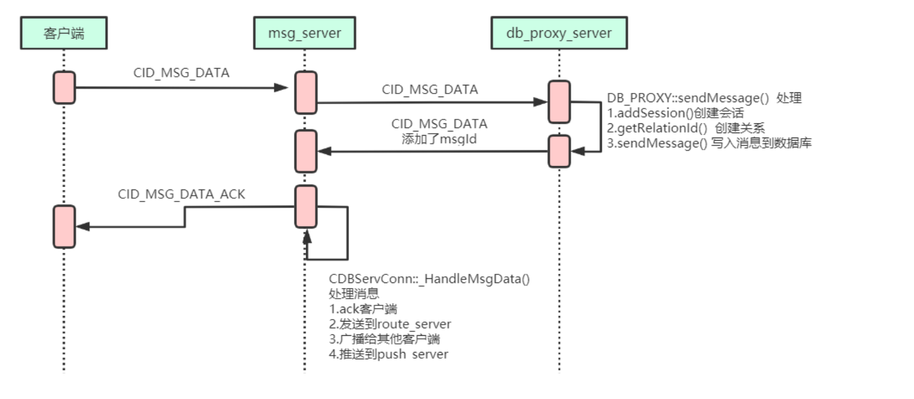

msg_server与数据库通信：

1. 将数据发送给数据库，如果是第一次会话需要创建会话（将会话信息写入数据库中），如果已经有会话关系直接获取即可
2. 将消息发送写入到数据库中，进行一定的处理（添加消息msgId），将消息发回到msg_server中（带上消息msgId），在协议header中有一个seq_id
3. msg_server转发消息，如果客户端在线，将消息直接发送给客户端，如果客户端不在线，将消息存储到离线消息数据库中，当下一次客户端上线，将离线消息读取后发送给客户端（并将数据库中的离线消息标记为已读），
    - 先在msg_server中查询对端的user_id，
    - 广播到route_server服务器中（发送给1个route_server就可以了），在route_server根据对端user_id找到是在哪个msg_server中


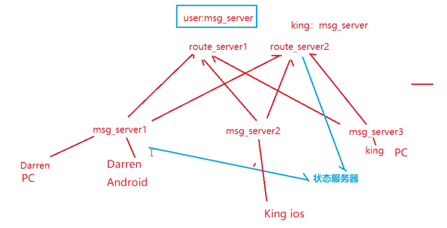

```cpp
//service id  0x0003
message IMMsgData{
	//cmd id:		0x0301
	required uint32 from_user_id = 1;				//消息发送方
	required uint32 to_session_id = 2;				//消息接受方
	required uint32 msg_id = 3;
	required uint32 create_time = 4; 
	required IM.BaseDefine.MsgType msg_type = 5;
	required bytes msg_data = 6;
	optional bytes attach_data = 20;
}
```

```cpp
message IMMsgDataAck{
	//cmd id:		0x0302
	required uint32 user_id = 1;			//发送此信令的用户id
	required uint32 session_id = 2;				
	required uint32 msg_id = 3;
	required IM.BaseDefine.SessionType session_type = 4;
}
```

```cpp
message IMMsgDataReadAck{
	//cmd id:		0x0303
	required uint32 user_id = 1;			//发送此信令的用户id
	required uint32 session_id = 2;			
	required uint32 msg_id = 3;
	required IM.BaseDefine.SessionType session_type = 4;
}
```

```cpp
message IMMsgDataReadNotify{
	//cmd id:		0x0304
	required uint32 user_id = 1;			//发送此信令的用户id
	required uint32 session_id = 2;		
	required uint32 msg_id = 3;
	required IM.BaseDefine.SessionType session_type = 4;
}
```

每个CImUser对应⼀个登陆⽤户，CMsgConn对应⼀个端的登录，CImUser和CMsgConn是1:n的对应关系。

1. CMsgConn::HandlePdu （msg_server模块，处理客户端的请求的信息）
2. CMsgConn::_HandleClientMsgData（msg_server模块，处理客户端的消息发送，CID_MSG_DATA命令）,重新拼装pdu，主要是增加handle作为attach数据，然后发送给db_proxy_server
3. DB_PROXY::sendMessage （db_proxy_server模块），
    - 获取消息FromId，ToId, MsgType等，并先验证消息类型MsgType是否有效 （这⾥主要先分析单聊的情况）
    - nSessionId 服务器分配会话id：通过CSessionModel::getSessionId查询两个⼈直接的聊天是否已经建⽴最近会话记录(从IMRecentSession表)，如果没有记录则调⽤CSessionModel::addSession创建
    - nPeerSessionId 服务器分配对端会话id：通过CSessionModel::getSessionId查询两个⼈直接的聊天是否已经建⽴最近会话记录(从IMRecentSession表)，如果没有记录则调⽤CSessionModel::addSession创建，需要注意的是nPeerSessionId和nSessionId的FromId和ToId是相反的。
    - nRelateId：获取通话⼈之间的关系id，如果两者之前没有关系则调⽤CRelationModel::getRelationId进⾏添加（操作IMRelationShip表）
    - nMsgId 服务器分配消息id，CMessageModel::getMsgId根据nRelateId映射进⾏获取，（FromId和ToId相互之间的nRelateId是唯⼀的，不分⽅向性，进⽽保证相互之间发送消息时消息的顺序性），msgId存储在redis中，通过key为"msg_id_" + int2string(nRelateId)进⾏获取，每次进⾏+1的递增操作
    - CMessageModel::sendMessage 将消息插⼊到数据库（操作IMMessage_x表），发送消息和要读取消息之间存储的是同⼀条消息：nRelateId, nFromId, nToId, nMsgType, nCreateTime,nMsgId，msg_data
    - 然后封装响应pPduResp，最重要的是附带nMsgId和msg回发给msg_server，使⽤CID_MSG_DATA命令。⼀样是以AddResponsePdu插⼊队列，然后SendResponsePduList进⾏回发的套路。
4. CDBServConn::HandlePdu （msg_server模块，处理dbproxy回发的数据），根据CID_MSG_DATA找到对应的处理函数
5. CDBServConn::_HandleMsgData（msg_server模块）
    - 根据attach_data的handle查找到对应的socket通路，使⽤CID_MSG_DATA_ACK告知客户端消息已经发送到服务器。
    - get_route_serv_conn，将pdu发送给route_server， CRouteConn::HandlePdu进⾏响应，然后调⽤CRouteConn::_BroadcastMsg转发给其他msg_server。
    - CImUser::BroadcastClientMsgData：⼴播给消息发起者，对于发起者不需要⼴播给⾃⼰的，只需要⼴播给其他端（⽐如多端登录时，PC端发送的数据，则⼴播给Android、IOS端，不⽤再⼴播给PC端），并将该消息插⼊到m_send_msg_list。
    - CImUser::BroadcastClientMsgData：⼴播给消息接收者，有⼏端登录同⼀个账号就⼴播给⼏个端，并将该消息插⼊到m_send_msg_list
    - CID_OTHER_GET_DEVICE_TOKEN_REQ：消息推送请求，主要是针对Android和IOS，此时由从新发回给db_proxy_server， 在setDevicesToken进⾏响应，我们这⾥不继续关注它。
6. 接收的客户端写⼊消息的回应
7. 作为接收者的客户端读取消息后回应CMsgConn::_HandleClientMsgReadAck（msg_server模块），使⽤CID_MSG_READ_ACK命令。
    - 使⽤CID_MSG_READ_NOTIFY通知其他多端登录的客户端，已经有客户端读取了该消息。
    - 将该msg从m_send_msg_list移除。
    - 如果客户端没有回应，则CMsgConn::OnTimer定时器定时check消息是否已经正常发送给客户端，没有收到响应则认为g_down_msg_miss_cnt++，该详细下⾏失败。


#### 3.登录数据请求

这⾥略过登录流程，即是略过CID_LOGIN_REQ_USERLOGIN到CID_OTHER_LOGIN_STATUS_NOTIFY。

即时通讯本地肯定是要做数据缓存的，包括用户信息、好友关系、消息，

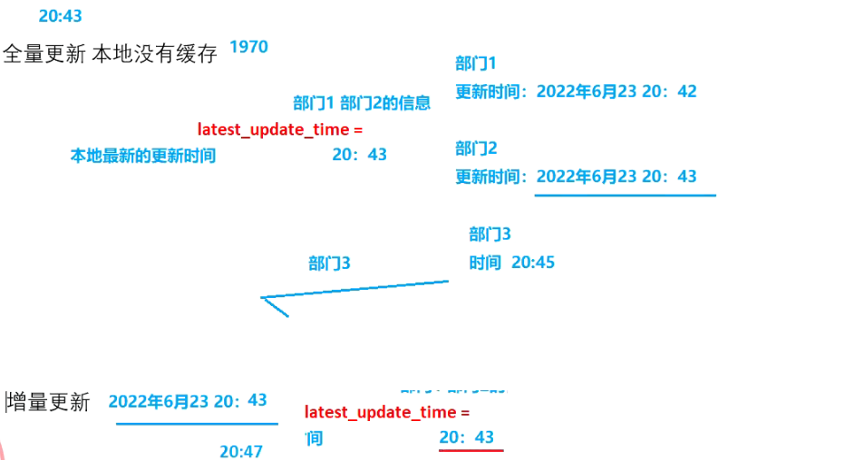

##### Point1：拉取更新部门信息

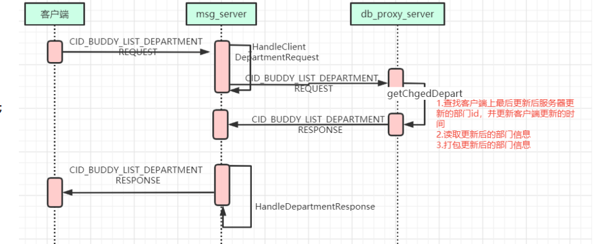

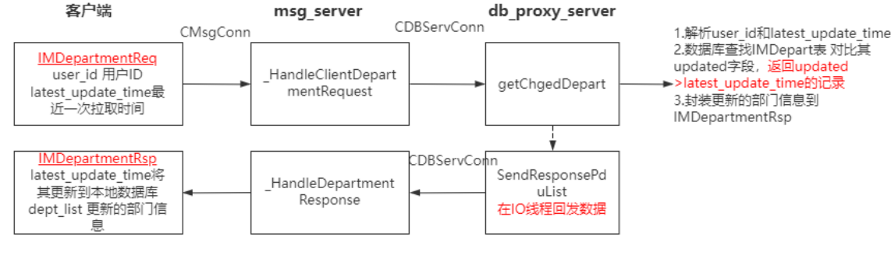

1. 解析user_id和latest_update_time最近一次拉取信息
2. 数据库查找IMDepart表，对比其update字段，返回updated_latest_update_time的记录
3. 封装更新的部门信息到IMDepartmentRsp

本地没有缓存全量更新、本地有缓存增量更新CID_BUDDY_LIST_DEPARTMENT_REQUEST

- CMsgConn::_HandleClientDepartmentRequest：（msg_server模块）CID_BUDDY_LIST_DEPARTMENT_REQUEST，拉取部⻔信息
- 发送给db_proxy_server，DB_PROXY::getChgedDepart进⾏响应
    - CDepartModel::getChgedDeptId，IMDepart存储的是部⻔id信息，通过对⽐本地客户端更新的时间和服务器更新的时间进⾏对⽐，或者到已经更新了的部⻔ID信息
    - CDepartModel::getDepts，还是操作IMDepart，此时是读取出新更新部⻔的所有信息
    - 将更新的部⻔信息封装成pdu回发给msg_server，使⽤CID_BUDDY_LIST_DEPARTMENT_RESPONSE命令

- CDBServConn::_HandleDepartmentResponse （msg_server模块）响应，然后也以CID_BUDDY_LIST_DEPARTMENT_RESPONSE回发给客户端。

以拉取部门信息为例，分析客户端登录的逻辑流程：CID_BUDDY_LIST_DEPARTMENT_REQUEST

```cpp
// command id for buddy list
enum BuddyListCmdID{
    CID_BUDDY_LIST_RECENT_CONTACT_SESSION_REQUEST       = 0x0201;
    CID_BUDDY_LIST_RECENT_CONTACT_SESSION_RESPONSE      = 0x0202;
    CID_BUDDY_LIST_STATUS_NOTIFY                        = 0x0203; //
    CID_BUDDY_LIST_USER_INFO_REQUEST                    = 0x0204; //
    CID_BUDDY_LIST_USER_INFO_RESPONSE                   = 0x0205;
    CID_BUDDY_LIST_REMOVE_SESSION_REQ                   = 0x0206;
    CID_BUDDY_LIST_REMOVE_SESSION_RES                   = 0x0207;
    CID_BUDDY_LIST_ALL_USER_REQUEST                     = 0x0208;
    CID_BUDDY_LIST_ALL_USER_RESPONSE                    = 0x0209;
    CID_BUDDY_LIST_USERS_STATUS_REQUEST                 = 0x020a;
    CID_BUDDY_LIST_USERS_STATUS_RESPONSE                = 0x020b;
    CID_BUDDY_LIST_CHANGE_AVATAR_REQUEST                = 0x020c;
    CID_BUDDY_LIST_CHANGE_AVATAR_RESPONSE               = 0x020d;
    CID_BUDDY_LIST_PC_LOGIN_STATUS_NOTIFY               = 0x020e;
    CID_BUDDY_LIST_REMOVE_SESSION_NOTIFY                = 0x020f;
    CID_BUDDY_LIST_DEPARTMENT_REQUEST                   = 0x0210;
    CID_BUDDY_LIST_DEPARTMENT_RESPONSE                  = 0x0211;
    CID_BUDDY_LIST_AVATAR_CHANGED_NOTIFY                = 0x0212; //头像更改通知
    CID_BUDDY_LIST_CHANGE_SIGN_INFO_REQUEST             = 0x0213; //修改个性签名请求
    CID_BUDDY_LIST_CHANGE_SIGN_INFO_RESPONSE            = 0x0214; //
    CID_BUDDY_LIST_SIGN_INFO_CHANGED_NOTIFY             = 0x0215; //签名修改通知
}
```

```cpp
/* IM.Buddy.proto */
message IMDepartmentReq{
	//cmd id:		0x0210
	required uint32 user_id = 1;
	required uint32 latest_update_time = 2;
	optional bytes attach_data = 20;
}

message IMDepartmentRsp{
	//cmd id:		0x0211
	required uint32 user_id = 1;
	required uint32 latest_update_time = 2;
	repeated IM.BaseDefine.DepartInfo dept_list = 3;
	optional bytes attach_data = 20;
}
```

```cpp
/* IM.BaseDefine.proto */
message DepartInfo{
	required uint32 dept_id = 1;
	required uint32 priority = 2;
	required string dept_name = 3;
    required uint32 parent_dept_id = 4;
    required DepartmentStatusType dept_status = 5;
}
```


###### MsgConn.cpp->HandlePdu

如果是客户端连接msg_server，对应的请求处理都在MsgConn.cpp中实现，

```cpp
/* MsgConn.cpp */
void CMsgConn::HandlePdu(CImPdu* pPdu) {
  if (pPdu->GetCommandId() != CID_OTHER_HEARTBEAT)
    log("HandlePdu cmd:0x%04x\n",
        pPdu->GetCommandId());  // request authorization check
  if (pPdu->GetCommandId() != CID_LOGIN_REQ_USERLOGIN && !IsOpen() &&
      IsKickOff()) {
    log("HandlePdu, wrong msg. ");
    throw CPduException(pPdu->GetServiceId(), pPdu->GetCommandId(),
                        ERROR_CODE_WRONG_SERVICE_ID,
                        "HandlePdu error, user not login. ");
    return;
  }
  switch (pPdu->GetCommandId()) {
    case CID_OTHER_HEARTBEAT:
      _HandleHeartBeat(pPdu);
      break;
    case CID_LOGIN_REQ_USERLOGIN:
      _HandleLoginRequest(pPdu);
      break;
    case CID_LOGIN_REQ_LOGINOUT:
      _HandleLoginOutRequest(pPdu);
      break;
    case CID_LOGIN_REQ_DEVICETOKEN:
      _HandleClientDeviceToken(pPdu);
      break;
    case CID_LOGIN_REQ_KICKPCCLIENT:
      _HandleKickPCClient(pPdu);
      break;
    case CID_LOGIN_REQ_PUSH_SHIELD:
      _HandlePushShieldRequest(pPdu);
      break;

    case CID_LOGIN_REQ_QUERY_PUSH_SHIELD:
      _HandleQueryPushShieldRequest(pPdu);
      break;
    case CID_LOGIN_REQ_REGIST:
      _HandleRegistRequest(pPdu);
      break;
    case CID_MSG_DATA:
      _HandleClientMsgData(pPdu);
      break;
    case CID_MSG_DATA_ACK:
      _HandleClientMsgDataAck(pPdu);
      break;
    case CID_MSG_TIME_REQUEST:
      _HandleClientTimeRequest(pPdu);
      break;
    case CID_MSG_LIST_REQUEST:
      _HandleClientGetMsgListRequest(pPdu);
      break;
    case CID_MSG_GET_BY_MSG_ID_REQ:
      _HandleClientGetMsgByMsgIdRequest(pPdu);
      break;
    case CID_MSG_UNREAD_CNT_REQUEST:
      _HandleClientUnreadMsgCntRequest(pPdu);
      break;
    case CID_MSG_READ_ACK:
      _HandleClientMsgReadAck(pPdu);
      break;
    case CID_MSG_GET_LATEST_MSG_ID_REQ:
      _HandleClientGetLatestMsgIDReq(pPdu);
      break;
    case CID_SWITCH_P2P_CMD:
      _HandleClientP2PCmdMsg(pPdu);
      break;
    case CID_BUDDY_LIST_RECENT_CONTACT_SESSION_REQUEST:
      _HandleClientRecentContactSessionRequest(pPdu);
      break;
    case CID_BUDDY_LIST_USER_INFO_REQUEST:
      _HandleClientUserInfoRequest(pPdu);
      break;
    case CID_BUDDY_LIST_REMOVE_SESSION_REQ:
      _HandleClientRemoveSessionRequest(pPdu);
      break;
    case CID_BUDDY_LIST_ALL_USER_REQUEST:
      _HandleClientAllUserRequest(pPdu);
      break;
    case CID_BUDDY_LIST_CHANGE_AVATAR_REQUEST:
      _HandleChangeAvatarRequest(pPdu);
      break;
    case CID_BUDDY_LIST_CHANGE_SIGN_INFO_REQUEST:
      _HandleChangeSignInfoRequest(pPdu);
      break;

    case CID_BUDDY_LIST_USERS_STATUS_REQUEST:
      _HandleClientUsersStatusRequest(pPdu);
      break;
    case CID_BUDDY_LIST_DEPARTMENT_REQUEST:
      _HandleClientDepartmentRequest(pPdu);
      break;
    // for group process
    case CID_GROUP_NORMAL_LIST_REQUEST:
      s_group_chat->HandleClientGroupNormalRequest(pPdu, this);
      break;
    case CID_GROUP_INFO_REQUEST:
      s_group_chat->HandleClientGroupInfoRequest(pPdu, this);
      break;
    case CID_GROUP_CREATE_REQUEST:
      s_group_chat->HandleClientGroupCreateRequest(pPdu, this);
      break;
    case CID_GROUP_CHANGE_MEMBER_REQUEST:
      s_group_chat->HandleClientGroupChangeMemberRequest(pPdu, this);
      break;
    case CID_GROUP_SHIELD_GROUP_REQUEST:
      s_group_chat->HandleClientGroupShieldGroupRequest(pPdu, this);
      break;

    case CID_FILE_REQUEST:
      s_file_handler->HandleClientFileRequest(this, pPdu);
      break;
    case CID_FILE_HAS_OFFLINE_REQ:
      s_file_handler->HandleClientFileHasOfflineReq(this, pPdu);
      break;
    case CID_FILE_ADD_OFFLINE_REQ:
      s_file_handler->HandleClientFileAddOfflineReq(this, pPdu);
      break;
    case CID_FILE_DEL_OFFLINE_REQ:
      s_file_handler->HandleClientFileDelOfflineReq(this, pPdu);
      break;
    default:
      log("wrong msg, cmd id=%d, user id=%u. ", pPdu->GetCommandId(), GetUserId());
      break;
  }
}
```

###### MsgConn.cpp->_HandleClientDepartmentRequest

```cpp
void CMsgConn::_HandleClientDepartmentRequest(CImPdu* pPdu) {
  /* 将数据读取出来做解析 */
  IM::Buddy::IMDepartmentReq msg;
  CHECK_PB_PARSE_MSG(msg.ParseFromArray(pPdu->GetBodyData(), pPdu->GetBodyLength()));
  log("HandleClientDepartmentRequest, user_id=%u, latest_update_time=%u.", GetUserId(), msg.latest_update_time());
  CDBServConn* pDBConn = get_db_serv_conn();
  if (pDBConn) {
    CDbAttachData attach(ATTACH_TYPE_HANDLE, m_handle, 0);
    msg.set_user_id(GetUserId());
    msg.set_attach_data(attach.GetBuffer(), attach.GetLength());
    pPdu->SetPBMsg(&msg);
    pDBConn->SendPdu(pPdu);
  }
}
```

###### DepartModel.cpp->CDepartModel::getChgedDeptId

```cpp
void CDepartModel::getChgedDeptId(uint32_t& nLastTime, list<uint32_t>& lsChangedIds) {
  CDBManager* pDBManager = CDBManager::getInstance();
  CDBConn* pDBConn = pDBManager->GetDBConn("teamtalk_slave");
  if (pDBConn) {
    string strSql = "select id, updated from IMDepart where updated > " + int2string(nLastTime);
    CResultSet* pResultSet = pDBConn->ExecuteQuery(strSql.c_str());
    if (pResultSet) {
      while (pResultSet->Next()) {
        uint32_t id = pResultSet->GetInt("id");
        uint32_t nUpdated = pResultSet->GetInt("updated");
        if (nLastTime < nUpdated) nLastTime = nUpdated;
        lsChangedIds.push_back(id);
      }
      delete pResultSet;
    }
    pDBManager->RelDBConn(pDBConn);
  } else {
    log("no db connection for teamtalk_slave.");
  }
}
```


##### Point2：更新用户列表的用户信息

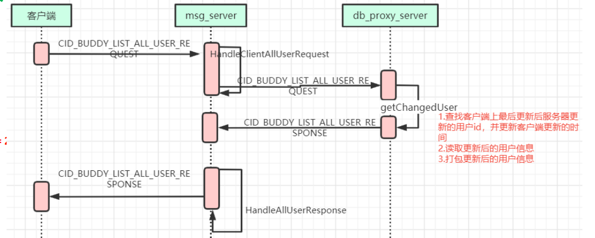

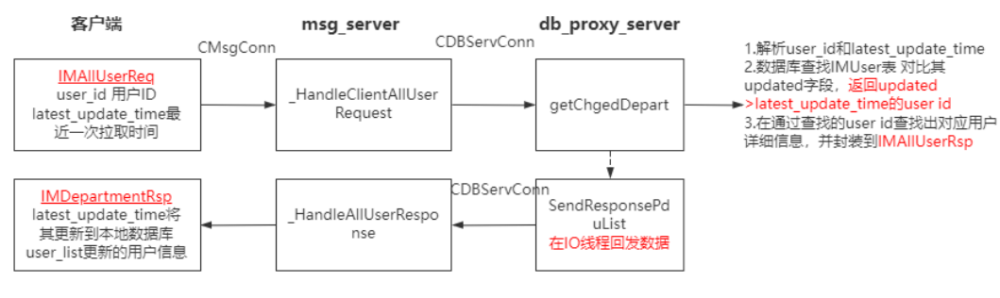

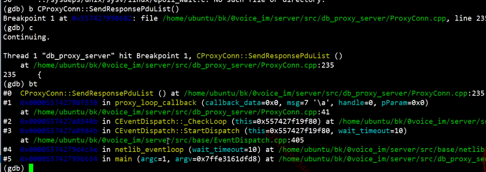

CID_BUDDY_LIST_ALL_USER_REQUEST
- CMsgConn::_HandleClientAllUserRequest （msg_server模块）⽤户信息请求，使⽤CID_BUDDY_LIST_ALL_USER_REQUEST命令，并转发给db_proxy_server
- DB_PROXY::getChangedUser （db_proxy_server模块）（会把IM库⾥⾯所有⼈的⽤户信息都会回发，假如公司有个1万⼈，第⼀次安装的时候直接拉取⼀万⼈的信息）
    - 检测是否有⽤户信息更新，主要是通过对⽐客户端本地的最近更新时间和服务器的最新更新时间
    - 如果有更新 CUserModel::getChangedId获取更新的⽤户id
    - 获取有更新的⽤户信息CUserModel::getUsers
    - 封装到pdu使⽤CID_BUDDY_LIST_ALL_USER_RESPONSE命令回发给msg_server

- CDBServConn::_HandleAllUserResponse 进⾏响应，然后回发给客户端

```cpp
/* IM.Buddy.proto */
message IMAllUserReq{
	//cmd id:		0x0208
	required uint32 user_id = 1;
	required uint32 latest_update_time = 2;
	optional bytes attach_data = 20;
}

message IMAllUserRsp{
	//cmd id:		0x0209
	required uint32 user_id = 1;
	required uint32 latest_update_time = 2;
	repeated IM.BaseDefine.UserInfo user_list = 3;		
	optional bytes attach_data = 20;
}
```

```cpp
/* IM.BaseDefine.proto */
message UserInfo{
	required uint32 user_id = 1;
	required uint32 user_gender = 2; 	//// 用户性别,男：1 女：2 人妖/外星人：0
	required string user_nick_name = 3;	//绰号
	required string avatar_url = 4;
	required uint32 department_id = 5;
	required string email = 6;
	required string user_real_name = 7;	//真名
	required string user_tel = 8;
	required string user_domain = 9;	//用户名拼音
    required uint32 status = 10;        //0:在职  1. 试用期 2. 正式 3. 离职 4.实习,  client端需要对“离职”进行不展示
    optional string sign_info = 11;
}
```


##### Point3：更新群组id列表

查询总共有多少个分组、总共有多少个群聊，根据用户id查找对应的群聊

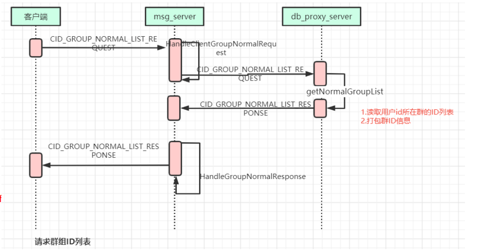

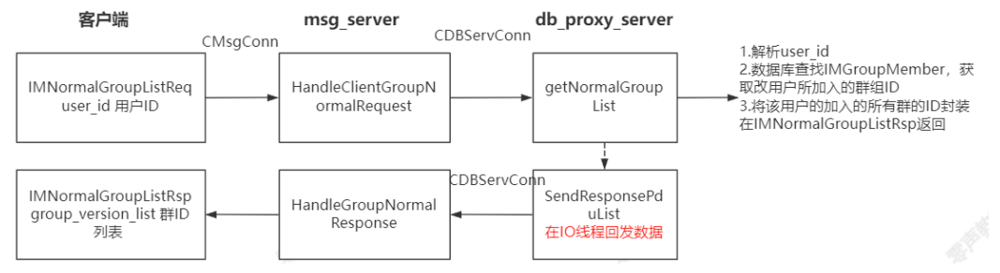

```cpp
/* IM.Group.proto */
message IMNormalGroupListReq{
	//cmd id:			0x0401
	required uint32 user_id = 1;
	optional bytes attach_data = 20;
}

message IMNormalGroupListRsp{
	//cmd id:			0x0402
	required uint32 user_id = 1;
	repeated IM.BaseDefine.GroupVersionInfo group_version_list = 2;
	optional bytes attach_data = 20;
}
```

```cpp
/* IM.BaseDefine.proto */
message GroupVersionInfo{
	required uint32 group_id = 1;
	required uint32 version = 2;
}
```

GroupVersionInfo实际上是将群号与群版本返回，

群的id与群的详细信息是分开的，主要是因为群的信息不单单是指群的名称，群信息中还包含群用户等信息（信息较多），

问：群成员是从数据库中读取，还是从缓存中读取？

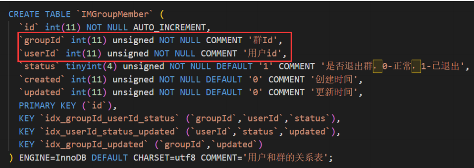

##### Point4：更新群组具体消息

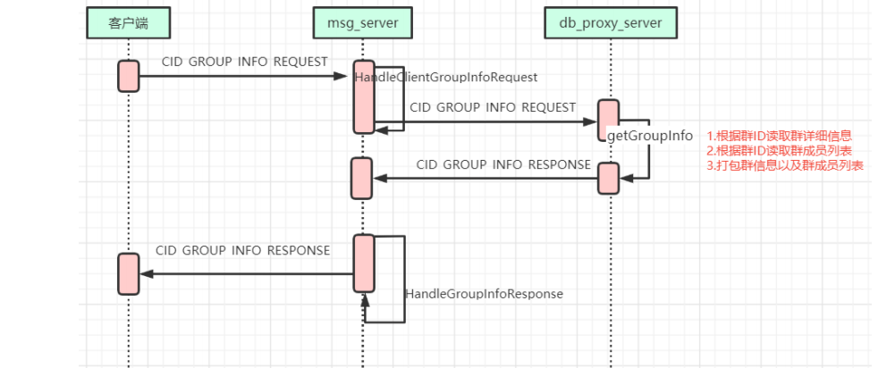

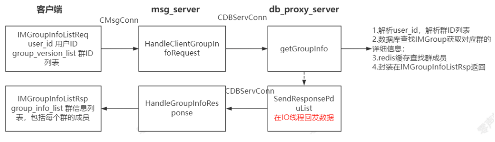

```cpp
/* IM.Group.proto */
message IMGroupInfoListReq{
	//cmd id:			0x0403
	required uint32 user_id = 1;
	repeated IM.BaseDefine.GroupVersionInfo group_version_list = 2;
	optional bytes attach_data = 20;
}

message IMGroupInfoListRsp{
	//cmd id:			0x0404
	required uint32 user_id = 1;
	repeated IM.BaseDefine.GroupInfo group_info_list = 2;
	optional bytes attach_data = 20;
}
```

```cpp
/* IM.BaseDefine.proto */
message GroupInfo{
	required uint32 group_id = 1;
	required uint32 version = 2;
	required string group_name = 3;
	required string group_avatar = 4;
	required uint32 group_creator_id = 5;
	required GroupType group_type = 6;
	required uint32 shield_status = 7;		//1: shield  0: not shield 
	repeated uint32 group_member_list = 8;
}
```

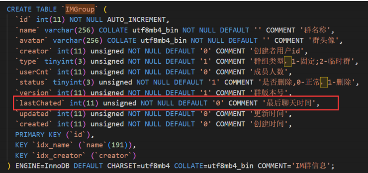


##### Point5：获取最近联系的会话

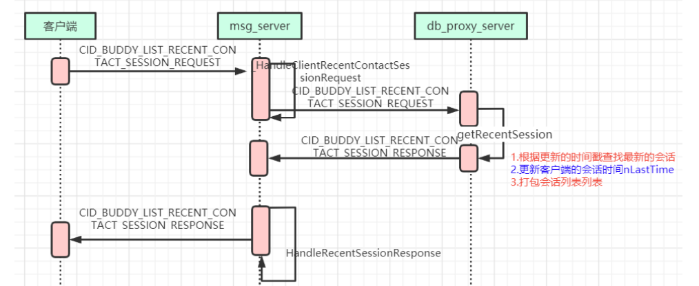

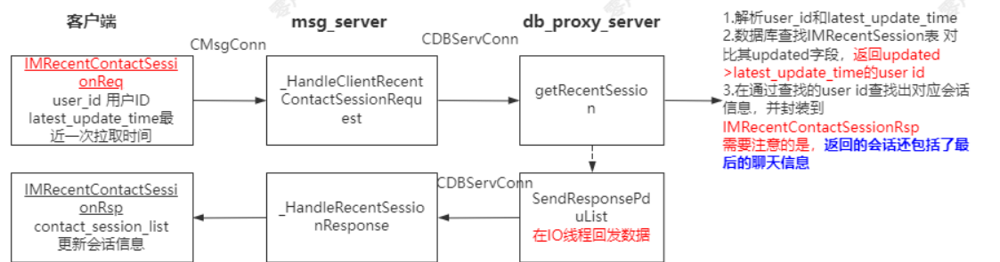

CID_BUDDY_LIST_RECENT_CONTACT_SESSION_REQUEST

- CMsgConn::_HandleClientRecentContactSessionRequest，使⽤CID_BUDDY_LIST_RECENT_CONTACT_SESSION_REQUEST命令，并转发给db_proxy_server
- DB_PROXY::getRecentSession (db_proxy_server模块)进⾏响应
    - 使⽤getRecentSession在IMRecentSession查询最近联系⼈列表信息，以及对应的详细信息，⽐如最后的消息msgId
    - CID_BUDDY_LIST_RECENT_CONTACT_SESSION_RESPONSE回复给msg_server

- CDBServConn::_HandleRecentSessionResponse （msg_server模块），回复给客户端。

```cpp
/* IM.Buddy.proto */
message IMRecentContactSessionReq{
	//cmd id:		0x0201
	required uint32 user_id = 1;
	required uint32 latest_update_time = 2;
	optional bytes attach_data = 20;
}

message IMRecentContactSessionRsp{
	//cmd id:		0x0202
	required uint32 user_id = 1;
	repeated IM.BaseDefine.ContactSessionInfo contact_session_list = 2;
	optional bytes attach_data = 20;
}
```

```cpp
/* IM.BaseDefine.proto */
message ContactSessionInfo{
	required uint32 session_id = 1;
	required SessionType session_type = 2;
    required SessionStatusType session_status = 3;
	required uint32 updated_time = 4;
	required uint32 latest_msg_id = 5;
	required bytes latest_msg_data = 6;
    required MsgType latest_msg_type = 7;
    required uint32 latest_msg_from_user_id = 8;
}
```

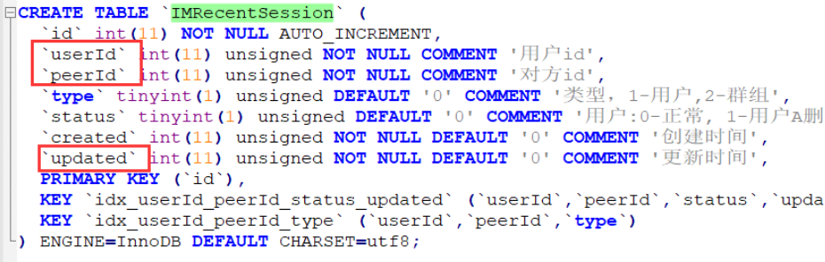


##### Point6：查询⽤户列表的⽤户当前的在线状态

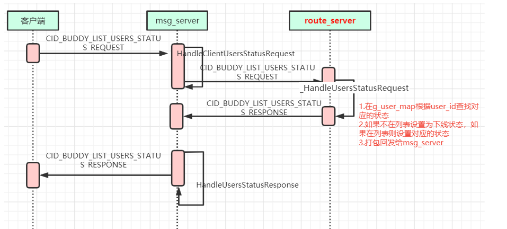

- CMsgConn::_HandleClientUsersStatusRequest（msg_server模块），去route_server查询⽤户列表⾥⾯⽤户的状态，使⽤CID_BUDDY_LIST_USERS_STATUS_REQUEST命令，并由route_server进⾏⼴播
- CRouteConn::_HandleUsersStatusRequest (route_server模块)，从route_server的UserInfoMap_t g_user_map;⾥⾯获取user的当前状态。
    - 回复给msg_server CID_BUDDY_LIST_USERS_STATUS_RESPONSE
    - CRouteServConn::_HandleUsersStatusResponse进⾏响应，并以CID_BUDDY_LIST_USERS_STATUS_RESPONSE回复客户端。

```cpp
/* IM.Buddy.proto */
message IMUsersStatReq{
	//cmd id:		0x020a
	required uint32 user_id = 1;
	repeated uint32 user_id_list = 2;
	optional bytes attach_data = 20;
}

message IMUsersStatRsp{
	//cmd id:		0x020b
	required uint32 user_id = 1;
	repeated IM.BaseDefine.UserStat user_stat_list = 2;
	optional bytes attach_data = 20;
}
```

```cpp
/* IM.BaseDefine.proto */
message UserStat{
	required uint32 user_id = 1;
	required UserStatType status = 2;
}

enum UserStatType{
	USER_STATUS_ONLINE 	= 1;
	USER_STATUS_OFFLINE	= 2;
	USER_STATUS_LEAVE	= 3;
}
```


##### Point7：获取未读消息的数量

设计redis与mysql相关问题，


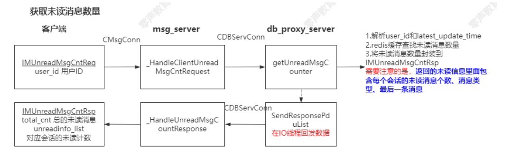

CID_MSG_UNREAD_CNT_REQUEST

- CMsgConn::_HandleClientUnreadMsgCntRequest （msg_server模块），使⽤CID_MSG_UNREAD_CNT_REQUEST命令，并转发给db_proxy_server
- DB_PROXY::getUnreadMsgCounter (db_proxy_server模块)（根据CID_MSG_UNREAD_CNT_REQUEST命令查找），未读消息数量包括单聊和群聊消息
    - CMessageModel::getUnreadMsgCount获取单聊未读消息数量
        - 未读消息数量存储在redis，以列表的⽅式进⾏存储，列表list包括<session_id,unread_cnt>
        - 调⽤CMessageModel::getLastMsg读取最新的消息

    - CMessageModel::getUnreadMsgCount获取群聊未读消息数量
    - 封装成pdu⽤CID_MSG_UNREAD_CNT_RESPONSE命令进⾏回发

- CDBServConn::_HandleUnreadMsgCountResponse（msg_server模块）进⾏响应，然后回发给客户端

```cpp
/* IM.Message.proto */
message IMUnreadMsgCntReq{
	//cmd id:		0x0307
	required uint32 user_id = 1;
	optional bytes attach_data = 20;	
}

message IMUnreadMsgCntRsp{
	//cmd id:		0x0308
	required uint32 user_id = 1;
	required uint32 total_cnt = 2;
	repeated IM.BaseDefine.UnreadInfo unreadinfo_list = 3;
	optional bytes attach_data = 20;
}
```

```cpp
/* IM.BaseDefine.proto */
message UnreadInfo{
	required uint32 session_id = 1;
	required SessionType session_type = 2;
	required uint32 unread_cnt = 3;
	required uint32 latest_msg_id = 4;
	required bytes latest_msg_data = 5;
    required MsgType latest_msg_type = 6;
    required uint32 latest_msg_from_user_id = 7;        //发送得用户id
}
```


##### Point8：获取消息

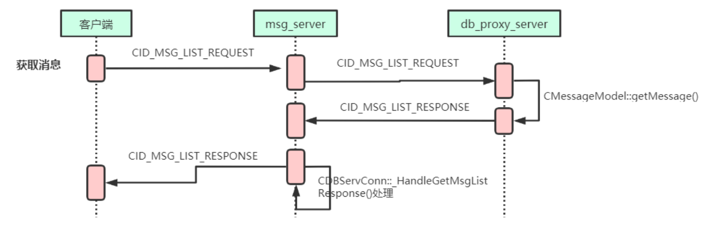

CID_MSG_LIST_REQUEST

- CMsgConn::_HandleClientGetMsgListRequest（msg_server模块）响应客户端的 CID_MSG_LIST_REQUEST，并使⽤CID_MSG_LIST_REQUEST转发给db_proxy_server
- DB_PROXY::getMessage(db_proxy_server模块)：
    - 单聊消息使⽤CMessageModel::getMessage读取消息，查询IMMessage_x表
    - 群聊消息使⽤CMessageModel::getMessage读取消息，查询IMGroupMessage_x表

- 使⽤CID_MSG_LIST_RESPONSE发回给msg_server
- CDBServConn::_HandleGetMsgListResponse（msg_server模块），发回给客户端。


CDBServConn::_HandleValidateResponse 检测到新登录成功时则踢掉⽼登录。使⽤CID_OTHER_SERVER_KICK_USER命令，通过⼴播的⽅式进⾏

##### Point9：新登录用户踢掉老用户

- CRouteConn::HandlePdu （route_server模块）响应CID_OTHER_SERVER_KICK_USER后原封不动转发到各个msg_server
- CRouteServConn::_HandleKickUser（msg_server模块）响应CID_OTHER_SERVER_KICK_USER，如果改user在当前msg_server，则CImUser::KickOutSameClientType查找是否有重复的登录，并通过对应的CImConn发送回给客户端。


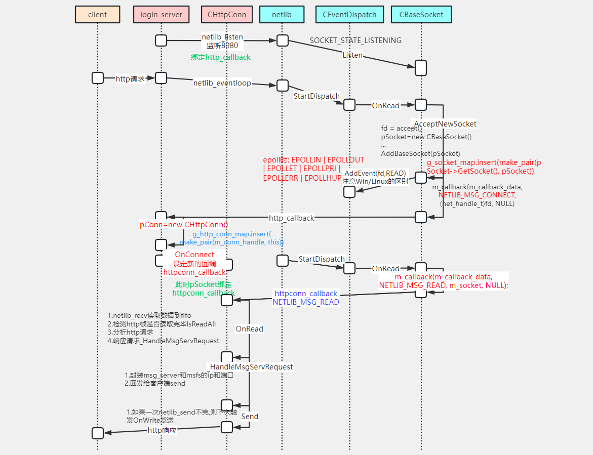


