# 关键业务流程分析

---

根据业务流程梳理分析各个服务器之间的交互逻辑：

### 1.登录请求与验证

1. 客户端通过发送http请求给login_server，查找哪一个msg_server负载最少
2. login_server通过json的方式返回msg_server的服务器地址ip+port，发送回给客户端，
3. 客户端拿到msg_server的服务器地址ip+port发送登录请求，发送`CID_LOGIN_REQ_MSGSERVER`

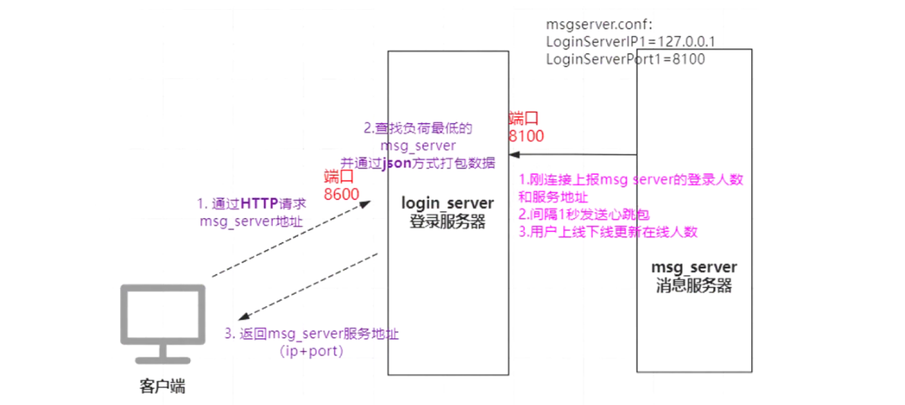

CID_LOGIN_REQ_USERLOGIN

结合proto文件理解msg_server登录逻辑，

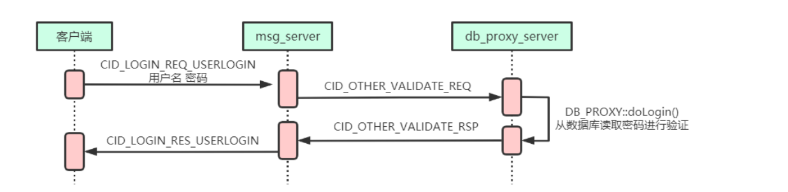

```cpp
/* IM.Login.proto */
message IMLoginReq{
	//cmd id:		0x0103
	required string user_name = 1;
	required string password = 2;
	required IM.BaseDefine.UserStatType online_status = 3;
	required IM.BaseDefine.ClientType client_type = 4;
	optional string client_version = 5;
}
message IMLoginRes{
	//cmd id:		0x0104
	required uint32 server_time = 1;
	required IM.BaseDefine.ResultType result_code = 2;
	optional string result_string = 3;
	optional IM.BaseDefine.UserStatType online_status = 4;
	optional IM.BaseDefine.UserInfo user_info = 5;
}
```

1. CMsgConn::HandlePdu （msg_server模块，处理客户端的请求的信息）
2. CMsgConn::_HandleLoginRequest （msg_server模块，处理客户端的登录请求信息，CID_LOGIN_REQ_USERLOGIN命令）
3. CImUserManager::AddImUserByLoginName（msg_server模块，将登录的user_name封装以user_name(login_name)为key封装成pImUser插⼊到m_im_user_map_by_name）
4. proxy_serv_callback （db_proxy_server模块）处理其他server的数据库操作请求，每个请求new CProxyConn()；
5. DB_PROXY::doLogin （db_proxy_server模块）msg_server 往dbproxy_server发登录验证请求（CID_OTHER_VALIDATE_REQ），在db_proxy_server的doLogin进⾏处理，主要流程：
    - 先检测是否密码经常错误
    - 调⽤CInterLoginStrategy::doLogin 验证账号和密码是否匹配
    - 如果账号密码匹配则返回正确，如果错误则返回错误，使⽤CID_OTHER_VALIDATE_RSP命令；
6. CProxyConn::AddResponsePdu （db_proxy_server模块）处理完其他server的请求后需要回发信息，但不会直接调⽤send进⾏发送，⽽是封装成ResponsePdu_t插⼊到s_response_pdu_list队列，由另外的线程取出来进⾏发送。
7. CProxyConn::SendResponsePduList（db_proxy_server模块）负责回发 ResponsePdu_t。打个断点也⽅便分析是loop循环由谁发起，实际上这⾥的loop和epoll所在的loop同属于⼀个⼤loop。init_proxy_conn时调⽤netlib_add_loop(proxy_loop_callback, NULL);进⾏注册loop，⽽proxy_loop_callback实质是调⽤了CProxyConn::SendResponsePduList()
8. CDBServConn::HandlePdu （msg_server模块，处理dbproxy回发的数据），根据CID_OTHER_VALIDATE_RSP找到对应的处理函数
9. CDBServConn::_HandleValidateResponse （msg_server模块），使⽤CID_LOGIN_RES_USERLOGIN命令回应客户端。
10. CRouteServConn::_HandlePCLoginStatusNotify（msg_server模块）客户端回复CID_OTHER_LOGIN_STATUS_NOTIFY，通知其他端⽬前⾃⼰的登录情况。

##### MsgConn.h->CMsgConn::HandlePdu

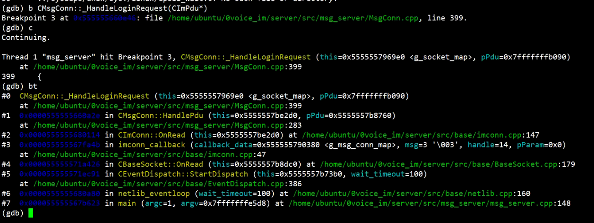

```cpp
//处理收到的PDU 根据PDU的命令ID，将其分派给相应的处理函数
void CMsgConn::HandlePdu(CImPdu* pPdu)
{   
    // 1.检查pPdu的命令ID是否为CID_OTHER_HEARTBEAT（心跳命令）如果不是心跳命令，则打印相应的日志信息
    if (pPdu->GetCommandId() != CID_OTHER_HEARTBEAT)
        log("HandlePdu cmd:0x%04x\n", pPdu->GetCommandId()); // request authorization check
    // 2.检查pPdu的命令ID是否为CID_LOGIN_REQ_USERLOGIN（用户登录请求）并且当前连接是打开的并且被踢出的状态
    if (pPdu->GetCommandId() != CID_LOGIN_REQ_USERLOGIN && !IsOpen() && IsKickOff()) {
        //如果条件满足则打印相应的日志信息，并抛出一个CPduException异常，异常信息指示处理PDU时出错用户未登录
        log("HandlePdu, wrong msg. ");
        throw CPduException(pPdu->GetServiceId(), pPdu->GetCommandId(), ERROR_CODE_WRONG_SERVICE_ID, "HandlePdu error, user not login. ");
        return;
    }
    // 3.最后通过switch语句根据pPdu的命令ID执行相应的操作
    // 根据不同的命令ID，调用相应的私有方法来处理不同的请求，例如处理心跳、用户登录请求、用户登出请求等
    switch (pPdu->GetCommandId()) {
    case CID_OTHER_HEARTBEAT:
        _HandleHeartBeat(pPdu);
        break;
    case CID_LOGIN_REQ_USERLOGIN:
        _HandleLoginRequest(pPdu);
        break;
    case CID_LOGIN_REQ_LOGINOUT:
        _HandleLoginOutRequest(pPdu);
        break;
            
	......
        
    case CID_FILE_ADD_OFFLINE_REQ:
        s_file_handler->HandleClientFileAddOfflineReq(this, pPdu);
        break;
    case CID_FILE_DEL_OFFLINE_REQ:
        s_file_handler->HandleClientFileDelOfflineReq(this, pPdu);
        break;
    default:
        log("wrong msg, cmd id=%d, user id=%u. ", pPdu->GetCommandId(), GetUserId());
        break;
    }
}
```

##### MsgConn.h->CMsgConn::_HandleLoginRequest

```cpp
//向db_proxy_server发送用户登录认证请求
void CMsgConn::_HandleLoginRequest(CImPdu* pPdu)
{   
    // 1.检查是否已经存在登录名 如果存在则打印相应的日志信息，并直接返回拒绝重复的登录请求
    if (m_login_name.length() != 0) {
        log("duplicate LoginRequest in the same conn ");
        return;
    }

    // 2.检查各个服务器连接的可用性 包括数据库服务器连接和路由服务器连接
    uint32_t result = 0;
    string result_string = "";
    // 获取数据库服务器连接对象 pDbConn
    CDBServConn* pDbConn = get_db_serv_conn_for_login();
    if (!pDbConn) {
        //没有数据库服务器连接 表示拒绝登录
        result = IM::BaseDefine::REFUSE_REASON_NO_DB_SERVER;
        result_string = "服务端异常";
    } else if (!is_login_server_available()) {
        //登录服务器不可用
        result = IM::BaseDefine::REFUSE_REASON_NO_LOGIN_SERVER;
        result_string = "服务端异常";
    } else if (!is_route_server_available()) {
        //路由服务器不可用
        result = IM::BaseDefine::REFUSE_REASON_NO_ROUTE_SERVER;
        result_string = "服务端异常";
    }

    // 3.如果存在拒绝登录的情况（result不为0）则会发送登录响应消息给客户端，并关闭连接
    if (result) {
        // 3-1.创建一个IM::Login::IMLoginRes对象msg 并设置该对象的字段值
        IM::Login::IMLoginRes msg;
        // 3-2.设置相关响应消息 
        msg.set_server_time(time(NULL));//设置为当前时间
        msg.set_result_code((IM::BaseDefine::ResultType)result);//设置为result的值，表示拒绝原因
        msg.set_result_string(result_string);//设置为result_string的值，表示结果说明
        // 3-3.创建一个CImPdu对象pdu，并将msg对象设置为其消息体
        CImPdu pdu;
        pdu.SetPBMsg(&msg);//将 msg 对象设置为其消息体
        pdu.SetServiceId(SID_LOGIN);//设置pdu的服务ID为SID_LOGIN
        pdu.SetCommandId(CID_LOGIN_RES_USERLOGIN); //命令ID为CID_LOGIN_RES_USERLOGIN
        pdu.SetSeqNum(pPdu->GetSeqNum());//消息序列号为登录请求消息的序列号
        // 3-4.调用SendPdu方法将登录响应消息发送给客户端
        SendPdu(&pdu);
        // 3-5.最后调用Close方法关闭连接结束处理
        Close();// 关闭 CMsgConn* pConn = new CMsgConn(); 什么时候释放资源
        return;
    }

    // 4.服务器连接都正常，则继续处理登录请求
    IM::Login::IMLoginReq msg;
    // 4-1.解析登录请求消息的内容
    // 该方法将消息的二进制数据解析为 IM::Login::IMLoginReq 对象 msg
    CHECK_PB_PARSE_MSG(msg.ParseFromArray(pPdu->GetBodyData(), pPdu->GetBodyLength()));

    // 4-2.设置消息中的信息到私有成员变量中
    m_login_name = msg.user_name();//登录请求中的用户名
    string password = msg.password();//登录请求中的密码
    //检查在线状态的取值范围是否有效 如果不在有效范围内 会打印相应的日志信息，并将在线状态设置为默认值
    uint32_t online_status = msg.online_status();
    if (online_status < IM::BaseDefine::USER_STATUS_ONLINE || online_status > IM::BaseDefine::USER_STATUS_LEAVE) {
        log("HandleLoginReq, online status wrong: %u ", online_status);
        online_status = IM::BaseDefine::USER_STATUS_ONLINE;
    }
    m_client_version = msg.client_version();//客户端版本
    m_client_type = msg.client_type();//客户端类型
    m_online_status = online_status;//在线状态
    log("HandleLoginReq, user_name=%s, status=%u, client_type=%u, client=%s, ",
        m_login_name.c_str(), online_status, m_client_type, m_client_version.c_str());

    // 5.用户重复登录验证
    // 通过调用 CImUserManager::GetInstance()->GetImUserByLoginName(GetLoginName()) 方法
    // 5-1.根据登录名获取对应的 CImUser 对象 pImUser
    CImUser* pImUser = CImUserManager::GetInstance()->GetImUserByLoginName(GetLoginName());

    // 5-2.如果pImUser为空，表示该用户尚未存在创建一个新的CImUser对象，并将其添加到用户管理器中
    if (!pImUser) {
        pImUser = new CImUser(GetLoginName()); // 新建一个用户
        CImUserManager::GetInstance()->AddImUserByLoginName(GetLoginName(), pImUser);
    }

    // 6.将验证消息转发到 db_proxy_server 进行身份验证
    // 6-1.将当前连接（this）添加到用户的未验证连接列表中
    pImUser->AddUnValidateMsgConn(this);

    // 6-2.创建 CDbAttachData 对象 attach_data，该对象用于传递附加数据给数据库代理服务器
    // 将连接的句柄（m_handle）作为附加数据，用于后续验证的过程中标识连接
    CDbAttachData attach_data(ATTACH_TYPE_HANDLE, m_handle, 0);

    // 6-3.创建IM::Server::IMValidateReq对象msg2消息体，并将用户名、密码和附加数据设置到该对象中
    IM::Server::IMValidateReq msg2;
    msg2.set_user_name(msg.user_name());//用户名
    msg2.set_password(password);//密码
    msg2.set_attach_data(attach_data.GetBuffer(), attach_data.GetLength());//附加数据

    // 6-4.设置pdu的服务ID为SID_OTHER，命令ID为CID_OTHER_VALIDATE_REQ，序列号为原始登录请求的序列号
    CImPdu pdu;
    pdu.SetPBMsg(&msg2);
    pdu.SetServiceId(SID_OTHER);
    pdu.SetCommandId(CID_OTHER_VALIDATE_REQ);
    pdu.SetSeqNum(pPdu->GetSeqNum());

    // 6-5.通过数据库代理连接对象pDbConn调用SendPdu()方法，将验证请求 pdu 发送给数据库代理服务器进行验证
    pDbConn->SendPdu(&pdu);
}
```

##### HandlerMap.h->CHandlerMap::Init

```cpp
//CHandlerMap初始化函数,加载了各种commandId 对应的处理函数
void CHandlerMap::Init() {
    // Login validate
    m_handler_map.insert(make_pair(uint32_t(CID_OTHER_VALIDATE_REQ), DB_PROXY::doLogin));
    m_handler_map.insert(make_pair(uint32_t(CID_LOGIN_REQ_PUSH_SHIELD), DB_PROXY::doPushShield));
    m_handler_map.insert(make_pair(uint32_t(CID_LOGIN_REQ_QUERY_PUSH_SHIELD), DB_PROXY::doQueryPushShield));

    // recent session
    m_handler_map.insert(make_pair(uint32_t(CID_BUDDY_LIST_RECENT_CONTACT_SESSION_REQUEST), DB_PROXY::getRecentSession));
    m_handler_map.insert(make_pair(uint32_t(CID_BUDDY_LIST_REMOVE_SESSION_REQ), DB_PROXY::deleteRecentSession));

    // users
    m_handler_map.insert(make_pair(uint32_t(CID_BUDDY_LIST_USER_INFO_REQUEST), DB_PROXY::getUserInfo));
    m_handler_map.insert(make_pair(uint32_t(CID_BUDDY_LIST_ALL_USER_REQUEST), DB_PROXY::getChangedUser));
    m_handler_map.insert(make_pair(uint32_t(CID_BUDDY_LIST_DEPARTMENT_REQUEST), DB_PROXY::getChgedDepart));
    m_handler_map.insert(make_pair(uint32_t(CID_BUDDY_LIST_CHANGE_SIGN_INFO_REQUEST), DB_PROXY::changeUserSignInfo));

    // message content
    m_handler_map.insert(make_pair(uint32_t(CID_MSG_DATA), DB_PROXY::sendMessage));
    m_handler_map.insert(make_pair(uint32_t(CID_MSG_LIST_REQUEST), DB_PROXY::getMessage));
    m_handler_map.insert(make_pair(uint32_t(CID_MSG_UNREAD_CNT_REQUEST), DB_PROXY::getUnreadMsgCounter));
    m_handler_map.insert(make_pair(uint32_t(CID_MSG_READ_ACK), DB_PROXY::clearUnreadMsgCounter));
    m_handler_map.insert(make_pair(uint32_t(CID_MSG_GET_BY_MSG_ID_REQ), DB_PROXY::getMessageById));
    m_handler_map.insert(make_pair(uint32_t(CID_MSG_GET_LATEST_MSG_ID_REQ), DB_PROXY::getLatestMsgId));

    // device token
    m_handler_map.insert(make_pair(uint32_t(CID_LOGIN_REQ_DEVICETOKEN), DB_PROXY::setDevicesToken));
    m_handler_map.insert(make_pair(uint32_t(CID_OTHER_GET_DEVICE_TOKEN_REQ), DB_PROXY::getDevicesToken));

    // push 推送设置
    m_handler_map.insert(make_pair(uint32_t(CID_GROUP_SHIELD_GROUP_REQUEST), DB_PROXY::setGroupPush));
    m_handler_map.insert(make_pair(uint32_t(CID_OTHER_GET_SHIELD_REQ), DB_PROXY::getGroupPush));

    // group
    m_handler_map.insert(make_pair(uint32_t(CID_GROUP_NORMAL_LIST_REQUEST), DB_PROXY::getNormalGroupList));
    m_handler_map.insert(make_pair(uint32_t(CID_GROUP_INFO_REQUEST), DB_PROXY::getGroupInfo));
    m_handler_map.insert(make_pair(uint32_t(CID_GROUP_CREATE_REQUEST), DB_PROXY::createGroup));
    m_handler_map.insert(make_pair(uint32_t(CID_GROUP_CHANGE_MEMBER_REQUEST), DB_PROXY::modifyMember));

    // file
    m_handler_map.insert(make_pair(uint32_t(CID_FILE_HAS_OFFLINE_REQ), DB_PROXY::hasOfflineFile));
    m_handler_map.insert(make_pair(uint32_t(CID_FILE_ADD_OFFLINE_REQ), DB_PROXY::addOfflineFile));
    m_handler_map.insert(make_pair(uint32_t(CID_FILE_DEL_OFFLINE_REQ), DB_PROXY::delOfflineFile));
}
```

##### Login.h->DB_PROXY::doLogin

根据对应的map映射关系，可以找到CID_OTHER_VALIDATE_REQ请求相应的处理方法，

```cpp
namespace DB_PROXY {

void doLogin(CImPdu* pPdu, uint32_t conn_uuid) {
    //创建一个用于响应的CImPdu对象pPduResp
    CImPdu* pPduResp = new CImPdu;
    //创建一个登录响应消息msgResp
    IM::Server::IMValidateRsp msgResp;
    IM::Server::IMValidateReq msg;

    // 1.解析登录请求中的用户名和密码 并将其存储到 strDomain 和 strPass 变量中
    if (msg.ParseFromArray(pPdu->GetBodyData(), pPdu->GetBodyLength())) {
        string strDomain = msg.user_name();//用户名
        string strPass = msg.password();//密码

        // 2.创建一个登录响应消息msgResp 设置用户名和附加数据
        msgResp.set_user_name(strDomain);
        msgResp.set_attach_data(msg.attach_data());

        // 3.检查登录限制
        do {
            // 3-1.使用 g_cLimitLock 对登录限制进行加锁
            CAutoLock cAutoLock(&g_cLimitLock);
            // 3-2.从 g_hmLimits 哈希表中获取对应用户名的错误登录时间列表 lsErrorTime
            list<uint32_t>& lsErrorTime = g_hmLimits[strDomain];

            // 3-3.清理超过30分钟的错误登录时间点记录
            uint32_t tmNow = time(NULL);
            auto itTime = lsErrorTime.begin();
            for (; itTime != lsErrorTime.end(); ++itTime) {
                if (tmNow - *itTime > 30 * 60) {
                    break;
                }
            }
        
            //清理放在这里还是放在密码错误后添加的时候呢？
            //放在这里，每次都要遍历，会有一点点性能的损失。
            //放在后面，可能会造成30分钟之前有10次错的，但是本次是对的就没办法再访问了
            
            if (itTime != lsErrorTime.end()) {
                lsErrorTime.erase(itTime, lsErrorTime.end());
            }

            // 3-4.判断30分钟内密码错误次数是否大于10
            if (lsErrorTime.size() > 10) {
                itTime = lsErrorTime.begin();
                if (tmNow - *itTime <= 30 * 60) {
                    // 如果超过限制，则返回登录失败响应
                    msgResp.set_result_code(6);
                    msgResp.set_result_string("用户名/密码错误次数太多");
                    pPduResp->SetPBMsg(&msgResp);
                    pPduResp->SetSeqNum(pPdu->GetSeqNum());
                    pPduResp->SetServiceId(IM::BaseDefine::SID_OTHER);
                    pPduResp->SetCommandId(IM::BaseDefine::CID_OTHER_VALIDATE_RSP);
                    CProxyConn::AddResponsePdu(conn_uuid, pPduResp);
                    return;
                }
            }
        } while (false);

        // 4.记录登录请求日志
        log("%s request login.", strDomain.c_str());

        // 5.调用 g_loginStrategy 的doLogin()函数进行实际的登录验证，传入用户名、密码和用户信息参数
        IM::BaseDefine::UserInfo cUser;
        if (g_loginStrategy.doLogin(strDomain, strPass, cUser)) {
            // 5-1.如果登录验证成功，将用户信息填充到登录响应消息中，并设置登录成功的结果码和结果字符串
            IM::BaseDefine::UserInfo* pUser = msgResp.mutable_user_info();
            pUser->set_user_id(cUser.user_id());//uid
            pUser->set_user_gender(cUser.user_gender());//gender
            pUser->set_department_id(cUser.department_id());//department
            pUser->set_user_nick_name(cUser.user_nick_name());//nick_name
            pUser->set_user_domain(cUser.user_domain());//domain
            pUser->set_avatar_url(cUser.avatar_url());//avator_url

            pUser->set_email(cUser.email());//email
            pUser->set_user_tel(cUser.user_tel());//tel
            pUser->set_user_real_name(cUser.user_real_name());//real_name
            pUser->set_status(0);//status

            pUser->set_sign_info(cUser.sign_info());//用户个性签名

            msgResp.set_result_code(0);//result_code
            msgResp.set_result_string("成功");//result_string

            // 如果登陆成功，则清除错误尝试限制
            CAutoLock cAutoLock(&g_cLimitLock);
            list<uint32_t>& lsErrorTime = g_hmLimits[strDomain];
            lsErrorTime.clear();
        } else {
            // 5-2.如果登录验证失败，记录一次登录失败，并设置登录失败的结果码和结果字符串
            // 获取当前时间戳 tmCurrent，用于记录错误登录的时间
            uint32_t tmCurrent = time(NULL);
            // 使用互斥锁 g_cLimitLock 对登录限制进行加锁，以确保多线程环境下的数据安全性
            CAutoLock cAutoLock(&g_cLimitLock);
            // 通过用户名 strDomain 在 g_hmLimits 哈希表中获取对应的错误登录时间列表 lsErrorTime
            list<uint32_t>& lsErrorTime = g_hmLimits[strDomain];
            // 将当前时间戳 tmCurrent 插入到错误登录时间列表 lsErrorTime 的头部，表示发生了一次错误登录
            lsErrorTime.push_front(tmCurrent);

            // 输出日志信息，提示用户名/密码错误
            log("get result false");
            // 设置登录响应消息的结果码为 1，表示用户名/密码错误
            msgResp.set_result_code(1);
            msgResp.set_result_string("用户名/密码错误");
        }
    } else {
        // 6.如果登录请求解析失败，设置内部错误的结果码和结果字符串
        msgResp.set_result_code(2);
        msgResp.set_result_string("服务端内部错误");
    }

    // 7.将登录响应消息发送回客户端
    pPduResp->SetPBMsg(&msgResp);//设置消息体
    pPduResp->SetSeqNum(pPdu->GetSeqNum());//设置消息序号
    pPduResp->SetServiceId(IM::BaseDefine::SID_OTHER);//SetServiceId
    pPduResp->SetCommandId(IM::BaseDefine::CID_OTHER_VALIDATE_RSP);//command_id CID_OTHER_VALIDATE_RSP
    CProxyConn::AddResponsePdu(conn_uuid, pPduResp);//AddResponsePdu
}

};
```

##### InterLogin.h->CInterLoginStrategy::doLogin

```cpp
bool CInterLoginStrategy::doLogin(const std::string& strName, const std::string& strPass, IM::BaseDefine::UserInfo& user) {
    bool bRet = false;
    // 1.获取数据库连接对象 pDBConn
    CDBManager* pDBManger = CDBManager::getInstance();
    CDBConn* pDBConn = pDBManger->GetDBConn("teamtalk_slave");

    if (pDBConn) {
        // 2.构造SQL查询语句，通过用户名strName查询符合条件的用户信息
        string strSql = "select * from IMUser where name='" + strName + "' and status=0";
        // 3.执行 SQL 查询并获取结果集 pResultSet
        CResultSet* pResultSet = pDBConn->ExecuteQuery(strSql.c_str());
        if (pResultSet) {
            string strResult, strSalt;
            uint32_t nId, nGender, nDeptId, nStatus;
            string strNick, strAvatar, strEmail, strRealName, strTel, strDomain, strSignInfo;
            // 4.遍历结果集，提取出查询到的用户信息，包括用户的 ID、密码、盐值以及其他相关字段
            while (pResultSet->Next()) {
                nId = pResultSet->GetInt("id");
                strResult = pResultSet->GetString("password");
                strSalt = pResultSet->GetString("salt");

                strNick = pResultSet->GetString("nick");
                nGender = pResultSet->GetInt("sex");
                strRealName = pResultSet->GetString("name");
                strDomain = pResultSet->GetString("domain");
                strTel = pResultSet->GetString("phone");
                strEmail = pResultSet->GetString("email");
                strAvatar = pResultSet->GetString("avatar");
                nDeptId = pResultSet->GetInt("departId");
                nStatus = pResultSet->GetInt("status");
                strSignInfo = pResultSet->GetString("sign_info");
            }

            // 5.将输入的密码 strPass 和 混淆值拼接，然后计算MD5值得到 strOutPass
            string strInPass = strPass + strSalt;
            char szMd5[33];
            CMd5::MD5_Calculate(strInPass.c_str(), strInPass.length(), szMd5);
            string strOutPass(szMd5);

            // 6.将计算得到的 strOutPass 与数据库查询到的密码进行比较，如果相等则表示登录验证成功
            if (strOutPass == strResult) {
                // 7.如果登录验证成功，将相应的用户信息设置到user对象中，并将返回值bRet设置为 true表示登录验证成功
                bRet = true;
                user.set_user_id(nId);
                user.set_user_nick_name(strNick);
                user.set_user_gender(nGender);
                user.set_user_real_name(strRealName);
                user.set_user_domain(strDomain);
                user.set_user_tel(strTel);
                user.set_email(strEmail);
                user.set_avatar_url(strAvatar);
                user.set_department_id(nDeptId);
                user.set_status(nStatus);
                user.set_sign_info(strSignInfo);
            }
            delete pResultSet;
        }
        pDBManger->RelDBConn(pDBConn);
    }
    return bRet;
}
```

##### DBServConn.h->HandlePdu


```cpp
void CDBServConn::HandlePdu(CImPdu* pPdu) {
    switch (pPdu->GetCommandId()) {
    case CID_OTHER_HEARTBEAT:
        break;
    case CID_OTHER_VALIDATE_RSP:
        _HandleValidateResponse(pPdu);
        break;
    case CID_LOGIN_RES_DEVICETOKEN:
        _HandleSetDeviceTokenResponse(pPdu);
        break;
            
     ......
            
    case CID_FILE_HAS_OFFLINE_RES:
        s_file_handler->HandleFileHasOfflineRes(pPdu);
        break;

    default:
        log("db server, wrong cmd id=%d ", pPdu->GetCommandId());
    }
}
```

##### DBServConn.h->CDBServConn::_HandleValidateResponse

```cpp
//处理验证响应消息的函数 
void CDBServConn::_HandleValidateResponse(CImPdu* pPdu) {
    IM::Server::IMValidateRsp msg;
    // 1.解析验证响应消息 获取登录名 login_name、结果码 result 和 结果字符串 result_string
    CHECK_PB_PARSE_MSG(msg.ParseFromArray(pPdu->GetBodyData(), pPdu->GetBodyLength()));
    string login_name = msg.user_name();
    uint32_t result = msg.result_code();
    string result_string = msg.result_string();

    // 2.根据附加数据构造 CDbAttachData 对象
    CDbAttachData attach_data((uchar_t*)msg.attach_data().c_str(), msg.attach_data().length());
    log("HandleValidateResp, user_name=%s, result=%d", login_name.c_str(), result);

    // 3.根据登录名获取用户对象 pImUser 记录日志
    CImUser* pImUser = CImUserManager::GetInstance()->GetImUserByLoginName(login_name);
    CMsgConn* pMsgConn = NULL;
    if (!pImUser) {
        // 如果用户对象存在，则根据附加数据的句柄获取未验证的消息连接对象 pMsgConn
        log("ImUser for user_name=%s not exist", login_name.c_str());
        return;
    } else {
        // 如果 pMsgConn 不存在或者已经打开，则记录日志并返回
        pMsgConn = pImUser->GetUnValidateMsgConn(attach_data.GetHandle());
        if (!pMsgConn || pMsgConn->IsOpen()) {
            log("no such conn is validated, user_name=%s", login_name.c_str());
            return;
        }
    }

    // 4.如果结果码 result 不为零，将结果码重置为 IM::BaseDefine::REFUSE_REASON_DB_VALIDATE_FAILED
    if (result != 0) result = IM::BaseDefine::REFUSE_REASON_DB_VALIDATE_FAILED;

    // 5.如果结果码为零表示验证成功，继续处理验证成功的逻辑
    if (result == 0) {
        // 5-1.获取用户信息 user_info  user_id  用户对象pUser
        IM::BaseDefine::UserInfo user_info = msg.user_info();
        uint32_t user_id = user_info.user_id();
        CImUser* pUser = CImUserManager::GetInstance()->GetImUserById(user_id);
        if (pUser) {
            // 已存在该ID的用户对象 pUser 则将该连接添加到 pUser 的未验证连接列表中，并从 pImUser 的未验证连接列表中删除
            pUser->AddUnValidateMsgConn(pMsgConn);
            pImUser->DelUnValidateMsgConn(pMsgConn);
            // 如果 pImUser 的未验证连接列表为空，表示没有其他未验证的连接了，可以移除该用户对象
            if (pImUser->IsMsgConnEmpty()) {
                CImUserManager::GetInstance()->RemoveImUserByLoginName(login_name);
                delete pImUser;
            }
        } else {
            // 如果用户对象 pUser 不存在，则将 pUser 设置为 pImUser
            pUser = pImUser;
        }

        // 5-2.设置 pUser 的用户ID、昵称、验证状态
        pUser->SetUserId(user_id);//uid
        pUser->SetNickName(user_info.user_nick_name());//nick_name
        pUser->SetValidated();//SetValidated
        CImUserManager::GetInstance()->AddImUserById(user_id, pUser);

        // 5-3.根据连接的客户端类型踢出相同类型的重复用户
        pUser->KickOutSameClientType(pMsgConn->GetClientType(), IM::BaseDefine::KICK_REASON_DUPLICATE_USER, pMsgConn);

        // 5-4.获取路由服务器连接 pRouteConn，如果存在则向路由服务器发送踢出用户的消息
        CRouteServConn* pRouteConn = get_route_serv_conn();
        if (pRouteConn) {
            IM::Server::IMServerKickUser msg2;
            msg2.set_user_id(user_id);
            msg2.set_client_type((::IM::BaseDefine::ClientType)pMsgConn->GetClientType());
            msg2.set_reason(1);
            CImPdu pdu;
            pdu.SetPBMsg(&msg2);
            pdu.SetServiceId(SID_OTHER);
            pdu.SetCommandId(CID_OTHER_SERVER_KICK_USER);//踢出用户的消息
            pRouteConn->SendPdu(&pdu);
        }
        log("user_name: %s, uid: %d", login_name.c_str(), user_id);

        // 5-5.设置连接的用户ID、打开状态，并发送用户状态更新的消息
        pMsgConn->SetUserId(user_id);
        pMsgConn->SetOpen();
        pMsgConn->SendUserStatusUpdate(IM::BaseDefine::USER_STATUS_ONLINE);
        pUser->ValidateMsgConn(pMsgConn->GetHandle(), pMsgConn);

        // 5-6.构造登录响应消息 msg3，设置相关字段
        IM::Login::IMLoginRes msg3;
        msg3.set_server_time(time(NULL));
        msg3.set_result_code(IM::BaseDefine::REFUSE_REASON_NONE);
        msg3.set_result_string(result_string);
        msg3.set_online_status((IM::BaseDefine::UserStatType)pMsgConn->GetOnlineStatus());
        IM::BaseDefine::UserInfo* user_info_tmp = msg3.mutable_user_info();
        user_info_tmp->set_user_id(user_info.user_id());
        user_info_tmp->set_user_gender(user_info.user_gender());
        user_info_tmp->set_user_nick_name(user_info.user_nick_name());
        user_info_tmp->set_avatar_url(user_info.avatar_url());
        user_info_tmp->set_sign_info(user_info.sign_info());
        user_info_tmp->set_department_id(user_info.department_id());
        user_info_tmp->set_email(user_info.email());
        user_info_tmp->set_user_real_name(user_info.user_real_name());
        user_info_tmp->set_user_tel(user_info.user_tel());
        user_info_tmp->set_user_domain(user_info.user_domain());
        user_info_tmp->set_status(user_info.status());

        // 5-6.构造登录响应消息Pdu pdu2，设置相关字段
        CImPdu pdu2;
        pdu2.SetPBMsg(&msg3);//消息体
        pdu2.SetServiceId(SID_LOGIN);//service_id
        pdu2.SetCommandId(CID_LOGIN_RES_USERLOGIN);//新的command_id CID_LOGIN_RES_USERLOGIN
        pdu2.SetSeqNum(pPdu->GetSeqNum());//设置消息序号

        // 5-7.发送登录响应消息给客户端
        pMsgConn->SendPdu(&pdu2);
    } else {
        // 6.如果结果码不为零，表示验证失败，继续处理验证失败的逻辑
        // 6-1.构造登录响应消息 msg4，设置相关字段
        IM::Login::IMLoginRes msg4;
        msg4.set_server_time(time(NULL));
        msg4.set_result_code((IM::BaseDefine::ResultType)result);
        msg4.set_result_string(result_string);

        // 6-2.构造登录响应消息Pdu pdu2，设置相关字段
        CImPdu pdu3;
        pdu3.SetPBMsg(&msg4);//消息体
        pdu3.SetServiceId(SID_LOGIN);//service_id
        pdu3.SetCommandId(CID_LOGIN_RES_USERLOGIN);//command_id CID_LOGIN_RES_USERLOGIN
        pdu3.SetSeqNum(pPdu->GetSeqNum());
        pMsgConn->SendPdu(&pdu3);

        // 6-3.关闭连接
        pMsgConn->Close();
    }
}
```


### 2.数据更新全流程

这⾥略过登录流程，即是略过CID_LOGIN_REQ_USERLOGIN到CID_OTHER_LOGIN_STATUS_NOTIFY。

即时通讯本地肯定是要做数据缓存的，包括用户信息、好友关系、消息，两种更新模式：

- 全量更新：本地没有缓存的数据
- 增量更新：本地已有缓存的数据（通过比较latest_update_time时间来确定）


#### 1.更新部门信息


1. 解析user_id和latest_update_time最近一次拉取信息
2. 数据库查找IMDepart表，对比其update字段，返回updated_latest_update_time的记录
3. 封装更新的部门信息到IMDepartmentRsp

本地没有缓存全量更新、本地有缓存增量更新CID_BUDDY_LIST_DEPARTMENT_REQUEST

- CMsgConn::_HandleClientDepartmentRequest：（msg_server模块）CID_BUDDY_LIST_DEPARTMENT_REQUEST，拉取部⻔信息
- 发送给db_proxy_server，DB_PROXY::getChgedDepart进⾏响应
    - CDepartModel::getChgedDeptId，IMDepart存储的是部⻔id信息，通过对⽐本地客户端更新的时间和服务器更新的时间进⾏对⽐，或者到已经更新了的部⻔ID信息
    - CDepartModel::getDepts，还是操作IMDepart，此时是读取出新更新部⻔的所有信息
    - 将更新的部⻔信息封装成pdu回发给msg_server，使⽤CID_BUDDY_LIST_DEPARTMENT_RESPONSE命令

- CDBServConn::_HandleDepartmentResponse （msg_server模块）响应，然后也以CID_BUDDY_LIST_DEPARTMENT_RESPONSE回发给客户端。

以拉取部门信息为例，分析客户端登录的逻辑流程：CID_BUDDY_LIST_DEPARTMENT_REQUEST

```cpp
// command id for buddy list
enum BuddyListCmdID{
    CID_BUDDY_LIST_RECENT_CONTACT_SESSION_REQUEST       = 0x0201;   //最近联系人会话请求
    CID_BUDDY_LIST_RECENT_CONTACT_SESSION_RESPONSE      = 0x0202;
    CID_BUDDY_LIST_STATUS_NOTIFY                        = 0x0203;   //用户状态通知
    CID_BUDDY_LIST_USER_INFO_REQUEST                    = 0x0204;   //用户信息请求
    CID_BUDDY_LIST_USER_INFO_RESPONSE                   = 0x0205;
    //其中带了一个latest_update_time字段，请求应答会返回latest_update_time时间之后发生变化的用户回来 
    CID_BUDDY_LIST_REMOVE_SESSION_REQ                   = 0x0206;   //删除最近会话请求
    CID_BUDDY_LIST_REMOVE_SESSION_RES                   = 0x0207;
    CID_BUDDY_LIST_ALL_USER_REQUEST                     = 0x0208;   //所有用户请求
    CID_BUDDY_LIST_ALL_USER_RESPONSE                    = 0x0209;
    CID_BUDDY_LIST_USERS_STATUS_REQUEST                 = 0x020a;   //用户状态请求
    CID_BUDDY_LIST_USERS_STATUS_RESPONSE                = 0x020b;
    CID_BUDDY_LIST_CHANGE_AVATAR_REQUEST                = 0x020c;   //更改头像请求(暂时未使用)
    CID_BUDDY_LIST_CHANGE_AVATAR_RESPONSE               = 0x020d;
    CID_BUDDY_LIST_PC_LOGIN_STATUS_NOTIFY               = 0x020e;   //PC登陆后通知移动端
    CID_BUDDY_LIST_REMOVE_SESSION_NOTIFY                = 0x020f;   //删除会话后的通知，用于多端同步
    CID_BUDDY_LIST_DEPARTMENT_REQUEST                   = 0x0210;   //部门信息请求
    CID_BUDDY_LIST_DEPARTMENT_RESPONSE                  = 0x0211;
    CID_BUDDY_LIST_AVATAR_CHANGED_NOTIFY                = 0x0212;   //头像更改通知
    CID_BUDDY_LIST_CHANGE_SIGN_INFO_REQUEST             = 0x0213;   //修改个性签名请求
    CID_BUDDY_LIST_CHANGE_SIGN_INFO_RESPONSE            = 0x0214;
    CID_BUDDY_LIST_SIGN_INFO_CHANGED_NOTIFY             = 0x0215;   //签名修改通知
}
```

```cpp
/* IM.Buddy.proto */
message IMDepartmentReq{
	//cmd id:		0x0210
	required uint32 user_id = 1;
	required uint32 latest_update_time = 2;
	optional bytes attach_data = 20;
}

message IMDepartmentRsp{
	//cmd id:		0x0211
	required uint32 user_id = 1;
	required uint32 latest_update_time = 2;
	repeated IM.BaseDefine.DepartInfo dept_list = 3;
	optional bytes attach_data = 20;
}
```

```cpp
/* IM.BaseDefine.proto */
message DepartInfo{
	required uint32 dept_id = 1;
	required uint32 priority = 2;
	required string dept_name = 3;
    required uint32 parent_dept_id = 4;
    required DepartmentStatusType dept_status = 5;
}
```

##### MsgConn.h->HandlePdu

客户端连接msg_server，对应的请求处理都在MsgConn.cpp中实现，客户端请求CID_BUDDY_LIST_DEPARTMENT_REQUEST，

```cpp
//处理收到的PDU 根据PDU的命令ID，将其分派给相应的处理函数
void CMsgConn::HandlePdu(CImPdu* pPdu) {   
    // 1.检查pPdu的命令ID是否为CID_OTHER_HEARTBEAT（心跳命令）如果不是心跳命令，则打印相应的日志信息
    if (pPdu->GetCommandId() != CID_OTHER_HEARTBEAT)
        log("HandlePdu cmd:0x%04x\n", pPdu->GetCommandId()); // request authorization check
    // 2.检查pPdu的命令ID是否为CID_LOGIN_REQ_USERLOGIN（用户登录请求）并且当前连接是打开的并且被踢出的状态
    if (pPdu->GetCommandId() != CID_LOGIN_REQ_USERLOGIN && !IsOpen() && IsKickOff()) {
        //如果条件满足则打印相应的日志信息，并抛出一个CPduException异常，异常信息指示处理PDU时出错用户未登录
        log("HandlePdu, wrong msg. ");
        throw CPduException(pPdu->GetServiceId(), pPdu->GetCommandId(), ERROR_CODE_WRONG_SERVICE_ID, "HandlePdu error, user not login. ");
        return;
    }
    // 3.最后通过switch语句根据pPdu的命令ID执行相应的操作
    // 根据不同的命令ID，调用相应的私有方法来处理不同的请求，例如处理心跳、用户登录请求、用户登出请求等
    switch (pPdu->GetCommandId()) {
    case CID_OTHER_HEARTBEAT:
        _HandleHeartBeat(pPdu);
        break;
    case CID_LOGIN_REQ_USERLOGIN:
        _HandleLoginRequest(pPdu);
        break;
		
            ......

    case CID_BUDDY_LIST_USERS_STATUS_REQUEST:
        _HandleClientUsersStatusRequest(pPdu);
        break;
    case CID_BUDDY_LIST_DEPARTMENT_REQUEST:
        _HandleClientDepartmentRequest(pPdu);
        break;
    // for group process
    case CID_GROUP_NORMAL_LIST_REQUEST:
        s_group_chat->HandleClientGroupNormalRequest(pPdu, this);
        break;
    case CID_GROUP_INFO_REQUEST:
        s_group_chat->HandleClientGroupInfoRequest(pPdu, this);
        break;
            
            ......
            
    default:
        log("wrong msg, cmd id=%d, user id=%u. ", pPdu->GetCommandId(), GetUserId());
        break;
    }
}
```

##### MsgConn.h->_HandleClientDepartmentRequest

```cpp
//处理客户端部门信息请求
//当客户端发送部门信息请求时，服务器会调用此函数进行处理
void CMsgConn::_HandleClientDepartmentRequest(CImPdu* pPdu) {
    IM::Buddy::IMDepartmentReq msg;
    // 1.解析部门信息请求消息，获取用户ID和最新更新时间
    CHECK_PB_PARSE_MSG(msg.ParseFromArray(pPdu->GetBodyData(), pPdu->GetBodyLength()));
    log("HandleClientDepartmentRequest, user_id=%u, latest_update_time=%u.", GetUserId(), msg.latest_update_time()); 

    // 2.获取数据库服务器连接 pDBConn
    CDBServConn* pDBConn = get_db_serv_conn();

    // 3.如果存在数据库服务器连接 pDBConn，则进行以下操作
    if (pDBConn) {
        // 3-1.创建CDbAttachData对象attach，用于存储附加数据
        // 附加数据类型为 ATTACH_TYPE_HANDLE，句柄为当前连接的句柄，长度为0
        CDbAttachData attach(ATTACH_TYPE_HANDLE, m_handle, 0);
        // 3-2.设置部门信息请求消息的用户ID和附加数据
        msg.set_user_id(GetUserId());
        msg.set_attach_data(attach.GetBuffer(), attach.GetLength());
        // 3-3.将部门信息请求消息设置为待发送的消息对象 pPdu 的 消息体
        pPdu->SetPBMsg(&msg);
        // 3-4.调用数据库服务器连接 pDBConn的SendPdu方法将数据发送到 db_proxy_server
        pDBConn->SendPdu(pPdu);
    }
}
```


##### HandlerMap.h->CHandlerMap::Init

```cpp
//CHandlerMap初始化函数,加载了各种commandId 对应的处理函数
void CHandlerMap::Init() {
    // Login validate
    m_handler_map.insert(make_pair(uint32_t(CID_OTHER_VALIDATE_REQ), DB_PROXY::doLogin));
    m_handler_map.insert(make_pair(uint32_t(CID_LOGIN_REQ_PUSH_SHIELD), DB_PROXY::doPushShield));
    m_handler_map.insert(make_pair(uint32_t(CID_LOGIN_REQ_QUERY_PUSH_SHIELD), DB_PROXY::doQueryPushShield));

    // recent session
    m_handler_map.insert(make_pair(uint32_t(CID_BUDDY_LIST_RECENT_CONTACT_SESSION_REQUEST), DB_PROXY::getRecentSession));
    m_handler_map.insert(make_pair(uint32_t(CID_BUDDY_LIST_REMOVE_SESSION_REQ), DB_PROXY::deleteRecentSession));

    // users
    m_handler_map.insert(make_pair(uint32_t(CID_BUDDY_LIST_USER_INFO_REQUEST), DB_PROXY::getUserInfo));
    m_handler_map.insert(make_pair(uint32_t(CID_BUDDY_LIST_ALL_USER_REQUEST), DB_PROXY::getChangedUser));
    m_handler_map.insert(make_pair(uint32_t(CID_BUDDY_LIST_DEPARTMENT_REQUEST), DB_PROXY::getChgedDepart));
    m_handler_map.insert(make_pair(uint32_t(CID_BUDDY_LIST_CHANGE_SIGN_INFO_REQUEST), DB_PROXY::changeUserSignInfo));

    // message content
    m_handler_map.insert(make_pair(uint32_t(CID_MSG_DATA), DB_PROXY::sendMessage));
    m_handler_map.insert(make_pair(uint32_t(CID_MSG_LIST_REQUEST), DB_PROXY::getMessage));
    m_handler_map.insert(make_pair(uint32_t(CID_MSG_UNREAD_CNT_REQUEST), DB_PROXY::getUnreadMsgCounter));
    m_handler_map.insert(make_pair(uint32_t(CID_MSG_READ_ACK), DB_PROXY::clearUnreadMsgCounter));
    m_handler_map.insert(make_pair(uint32_t(CID_MSG_GET_BY_MSG_ID_REQ), DB_PROXY::getMessageById));
    m_handler_map.insert(make_pair(uint32_t(CID_MSG_GET_LATEST_MSG_ID_REQ), DB_PROXY::getLatestMsgId));

    // device token
    m_handler_map.insert(make_pair(uint32_t(CID_LOGIN_REQ_DEVICETOKEN), DB_PROXY::setDevicesToken));
    m_handler_map.insert(make_pair(uint32_t(CID_OTHER_GET_DEVICE_TOKEN_REQ), DB_PROXY::getDevicesToken));

    // push 推送设置
    m_handler_map.insert(make_pair(uint32_t(CID_GROUP_SHIELD_GROUP_REQUEST), DB_PROXY::setGroupPush));
    m_handler_map.insert(make_pair(uint32_t(CID_OTHER_GET_SHIELD_REQ), DB_PROXY::getGroupPush));

    // group
    m_handler_map.insert(make_pair(uint32_t(CID_GROUP_NORMAL_LIST_REQUEST), DB_PROXY::getNormalGroupList));
    m_handler_map.insert(make_pair(uint32_t(CID_GROUP_INFO_REQUEST), DB_PROXY::getGroupInfo));
    m_handler_map.insert(make_pair(uint32_t(CID_GROUP_CREATE_REQUEST), DB_PROXY::createGroup));
    m_handler_map.insert(make_pair(uint32_t(CID_GROUP_CHANGE_MEMBER_REQUEST), DB_PROXY::modifyMember));

    // file
    m_handler_map.insert(make_pair(uint32_t(CID_FILE_HAS_OFFLINE_REQ), DB_PROXY::hasOfflineFile));
    m_handler_map.insert(make_pair(uint32_t(CID_FILE_ADD_OFFLINE_REQ), DB_PROXY::addOfflineFile));
    m_handler_map.insert(make_pair(uint32_t(CID_FILE_DEL_OFFLINE_REQ), DB_PROXY::delOfflineFile));
}
```

##### DepartAction.h->CDepartModel::getChgedDept

```cpp
/// @brief 获取变更的部门信息
/// @param pPdu 指向 CImPdu 对象的指针
/// @param conn_uuid 连接的唯一标识符 conn_uuid
void getChgedDepart(CImPdu* pPdu, uint32_t conn_uuid) {
    // 创建一个空的部门信息响应消息对象 msgResp
    IM::Buddy::IMDepartmentReq msg;
    IM::Buddy::IMDepartmentRsp msgResp;
    // 解析收到的部门信息请求消息 获取用户ID和最新更新时间
    if (msg.ParseFromArray(pPdu->GetBodyData(), pPdu->GetBodyLength())) {
        // 1.成功解析消息
        // 1-1.创建一个待发送的消息对象 pPduRes
        CImPdu* pPduRes = new CImPdu;
        uint32_t nUserId = msg.user_id();
        uint32_t nLastUpdate = msg.latest_update_time();

        // 1-2.从数据库中获取最新更新时间后发生变化的部门ID列表 lsChangedIds，以及对应的部门信息列表 lsDeparts
        list<uint32_t> lsChangedIds;
        CDepartModel::getInstance()->getChgedDeptId(nLastUpdate, lsChangedIds);
        list<IM::BaseDefine::DepartInfo> lsDeparts;
        CDepartModel::getInstance()->getDepts(lsChangedIds, lsDeparts);

        // 1-3.设置部门信息响应消息的用户ID和最新更新时间
        msgResp.set_user_id(nUserId);
        msgResp.set_latest_update_time(nLastUpdate);

        // 1-4.遍历部门信息列表，将每个部门信息添加到部门信息响应消息中
        for (auto it = lsDeparts.begin(); it != lsDeparts.end(); ++it) {
            IM::BaseDefine::DepartInfo* pDeptInfo = msgResp.add_dept_list();
            pDeptInfo->set_dept_id(it->dept_id());
            pDeptInfo->set_priority(it->priority());
            pDeptInfo->set_dept_name(it->dept_name());
            pDeptInfo->set_parent_dept_id(it->parent_dept_id());
            pDeptInfo->set_dept_status(it->dept_status());
        }
        log("userId=%u, last_update=%u, cnt=%u", nUserId, nLastUpdate, lsDeparts.size());

        // 1-5.设置附加数据为请求消息中的附加数据
        msgResp.set_attach_data(msg.attach_data());//设置附加消息
        pPduRes->SetPBMsg(&msgResp);//设置消息体
        pPduRes->SetSeqNum(pPdu->GetSeqNum());//设置消息序号
        pPduRes->SetServiceId(IM::BaseDefine::SID_BUDDY_LIST);//SetServiceId
        pPduRes->SetCommandId(IM::BaseDefine::CID_BUDDY_LIST_DEPARTMENT_RESPONSE);//SetCommandId

        // 1-6.将待发送的消息对象 pPduRes 添加到响应消息队列中，以便后续发送给客户端
        CProxyConn::AddResponsePdu(conn_uuid, pPduRes);
    } else {
        // 2.解析消息失败 直接记录日志
        log("parse pb failed");
    }
}
```

##### DepartModel.h->getChgedDeptId

```cpp
//从数据库中获取最近更新时间后发生变化的部门ID列表
void CDepartModel::getChgedDeptId(uint32_t& nLastTime, list<uint32_t>& lsChangedIds) {
    // 1.获取 CDBManager 的单例实例
    CDBManager* pDBManager = CDBManager::getInstance();
    CDBConn* pDBConn = pDBManager->GetDBConn("teamtalk_slave");

    if (pDBConn) {
        // 2.如果成功获取到数据库连接对象
        // 2-1.构建SQL查询语句，查询IMDepart表中更新时间大于给定最后更新时间 nLastTime 的部门ID和更新时间
        string strSql = "select id, updated from IMDepart where updated > " + int2string(nLastTime);
        CResultSet* pResultSet = pDBConn->ExecuteQuery(strSql.c_str());//结果集对象 pResultSet
        if (pResultSet) {
            //遍历结果集，对于每条记录获取部门ID和更新时间
            while (pResultSet->Next()) {
                uint32_t id = pResultSet->GetInt("id");//部门id
                uint32_t nUpdated = pResultSet->GetInt("updated");//更新时间
                //如果部门的更新时间大于当前最后更新时间 nLastTime，则更新 nLastTime 的值为部门的更新时间
                if (nLastTime < nUpdated) nLastTime = nUpdated;
                //将部门ID添加到变更的部门ID列表 lsChangedIds 中
                lsChangedIds.push_back(id);
            }
            delete pResultSet;
        }
        pDBManager->RelDBConn(pDBConn);
    } else {
        // 3.如果未能获取到数据库连接对象 记录错误日志
        log("no db connection for teamtalk_slave.");
    }
}
```

##### DepartModel.h->getDepts

```cpp
//从数据库中获取给定部门ID列表中的部门信息
void CDepartModel::getDepts(list<uint32_t>& lsDeptIds, list<IM::BaseDefine::DepartInfo>& lsDepts) {
    if (lsDeptIds.empty()) {
        log("list is empty");
        return;
    }

    // 1.获取 CDBManager 的单例实例
    CDBManager* pDBManager = CDBManager::getInstance();
    // 通过pDBManager获取一个指向teamtalk_slave数据库连接的CDBConn对象
    CDBConn* pDBConn = pDBManager->GetDBConn("teamtalk_slave");

    if (pDBConn) {
        // 2.成功获取到数据库连接对象
        // 2-1.构建SQL查询语句，使用给定的部门ID列表构建查询条件
        string strClause;
        bool bFirst = true;
        for (auto it = lsDeptIds.begin(); it != lsDeptIds.end(); ++it) {
            if (bFirst) {
                bFirst = false;
                strClause += int2string(*it);
            } else {
                strClause += ("," + int2string(*it));
            }
        }
        string strSql = "select * from IMDepart where id in ( " + strClause + " )";

        // 2-2.执行SQL查询，获取结果集对象 pResultSet
        CResultSet* pResultSet = pDBConn->ExecuteQuery(strSql.c_str());
        if (pResultSet) {
            // 2-3.遍历结果集对于每条记录，获取部门的ID 父部门ID 部门名称 部门状态和优先级
            while (pResultSet->Next()) {
                IM::BaseDefine::DepartInfo cDept;
                uint32_t nId = pResultSet->GetInt("id");
                uint32_t nParentId = pResultSet->GetInt("parentId");
                string strDeptName = pResultSet->GetString("departName");
                uint32_t nStatus = pResultSet->GetInt("status");
                uint32_t nPriority = pResultSet->GetInt("priority");
                // 2-4.如果当前部门状态是有效的，创建一个 IM::BaseDefine::DepartInfo 对象，并设置其属性
                if (IM::BaseDefine::DepartmentStatusType_IsValid(nStatus)) {
                    cDept.set_dept_id(nId);
                    cDept.set_parent_dept_id(nParentId);
                    cDept.set_dept_name(strDeptName);
                    cDept.set_dept_status(IM::BaseDefine::DepartmentStatusType(nStatus));
                    cDept.set_priority(nPriority);
                    // 2-5.将部门信息对象添加到部门信息列表lsDepts中
                    lsDepts.push_back(cDept);
                }
            }
            delete pResultSet;
        }
        pDBManager->RelDBConn(pDBConn);
    } else {
        // 3.未能获取到数据库连接对象 则记录日志
        log("no db connection for teamtalk_slave");
    }
}
```

##### DBServConn.h->HandlePdu

```cpp
void CDBServConn::HandlePdu(CImPdu* pPdu) {
    switch (pPdu->GetCommandId()) {
    case CID_BUDDY_LIST_CHANGE_SIGN_INFO_RESPONSE:
        _HandleChangeSignInfoResponse(pPdu);
        break;
    case CID_BUDDY_LIST_DEPARTMENT_RESPONSE:
        _HandleDepartmentResponse(pPdu);
        break;
    case CID_OTHER_GET_DEVICE_TOKEN_RSP:
        _HandleGetDeviceTokenResponse(pPdu);
        break;
    case CID_OTHER_GET_SHIELD_RSP:
        s_group_chat->HandleGroupGetShieldByGroupResponse(pPdu);
        break;
    case CID_OTHER_STOP_RECV_PACKET:
        _HandleStopReceivePacket(pPdu);
        break;
		
            ......
            
    case CID_GROUP_SHIELD_GROUP_RESPONSE:
        s_group_chat->HandleGroupShieldGroupResponse(pPdu);
        break;
    case CID_FILE_HAS_OFFLINE_RES:
        s_file_handler->HandleFileHasOfflineRes(pPdu);
        break;
    default:
        log("db server, wrong cmd id=%d ", pPdu->GetCommandId());
    }
}
```

##### DBServConn.h->_HandleDepartmentResponse

```cpp
//处理部门信息的响应
void CDBServConn::_HandleDepartmentResponse(CImPdu* pPdu) {
    // 1.解析收到的部门信息响应消息，将消息内容存储在 IM::Buddy::IMDepartmentRsp 类型的 msg 对象中
    IM::Buddy::IMDepartmentRsp msg;
    CHECK_PB_PARSE_MSG(msg.ParseFromArray(pPdu->GetBodyData(), pPdu->GetBodyLength()));

    // 2.获取用户ID、最新更新时间和部门数量等信息
    uint32_t user_id = msg.user_id();
    uint32_t latest_update_time = msg.latest_update_time();
    uint32_t dept_cnt = msg.dept_list_size();
    log("HandleDepartmentResponse, user_id=%u, latest_update_time=%u, dept_cnt=%u.", user_id, latest_update_time, dept_cnt);

    // 3.解析附加数据，将其转换为 CDbAttachData 对象，获取句柄（handle）
    CDbAttachData attach_data((uchar_t*)msg.attach_data().c_str(), msg.attach_data().length());

    // 4.通过用户ID和句柄获取与之关联的消息连接对象 pConn
    uint32_t handle = attach_data.GetHandle();
    CMsgConn* pConn = CImUserManager::GetInstance()->GetMsgConnByHandle(user_id, handle);

    // 5.如果消息连接对象存在且处于打开状态
    if (pConn && pConn->IsOpen()) {
        //清除附加数据中的内容
        msg.clear_attach_data();
        //设置响应消息的内容为解析后的 msg 对象
        pPdu->SetPBMsg(&msg);
        //将响应消息发送给消息连接对象
        pConn->SendPdu(pPdu);
    }
}
```


#### 2.更新用户列表的用户信息


CID_BUDDY_LIST_ALL_USER_REQUEST

- CMsgConn::_HandleClientAllUserRequest （msg_server模块）⽤户信息请求，使⽤CID_BUDDY_LIST_ALL_USER_REQUEST命令，并转发给db_proxy_server
- DB_PROXY::getChangedUser （db_proxy_server模块）（会把IM库⾥⾯所有⼈的⽤户信息都会回发，假如公司有个1万⼈，第⼀次安装的时候直接拉取⼀万⼈的信息）
    - 检测是否有⽤户信息更新，主要是通过对⽐客户端本地的最近更新时间和服务器的最新更新时间
    - 如果有更新 CUserModel::getChangedId获取更新的⽤户id
    - 获取有更新的⽤户信息CUserModel::getUsers
    - 封装到pdu使⽤CID_BUDDY_LIST_ALL_USER_RESPONSE命令回发给msg_server

- CDBServConn::_HandleAllUserResponse 进⾏响应，然后回发给客户端

```cpp
/* IM.Buddy.proto */
message IMAllUserReq{
	//cmd id:		0x0208
	required uint32 user_id = 1;
	required uint32 latest_update_time = 2;
	optional bytes attach_data = 20;
}

message IMAllUserRsp{
	//cmd id:		0x0209
	required uint32 user_id = 1;
	required uint32 latest_update_time = 2;
	repeated IM.BaseDefine.UserInfo user_list = 3;		
	optional bytes attach_data = 20;
}
```

```cpp
/* IM.BaseDefine.proto */
message UserInfo{
	required uint32 user_id = 1;
	required uint32 user_gender = 2; 	//// 用户性别,男：1 女：2 人妖/外星人：0
	required string user_nick_name = 3;	//绰号
	required string avatar_url = 4;
	required uint32 department_id = 5;
	required string email = 6;
	required string user_real_name = 7;	//真名
	required string user_tel = 8;
	required string user_domain = 9;	//用户名拼音
    required uint32 status = 10;        //0:在职  1. 试用期 2. 正式 3. 离职 4.实习,  client端需要对“离职”进行不展示
    optional string sign_info = 11;
}
```


#### 3.更新群组id列表

查询总共有多少个分组、总共有多少个群聊，根据用户id查找对应的群聊


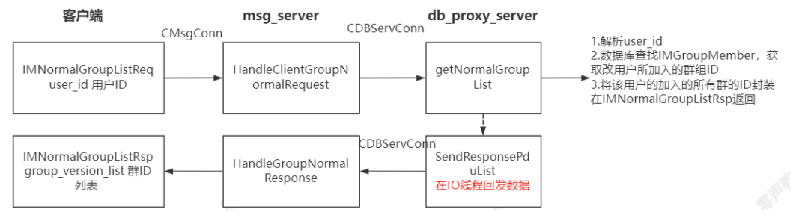

```cpp
/* IM.Group.proto */
message IMNormalGroupListReq{
	//cmd id:			0x0401
	required uint32 user_id = 1;
	optional bytes attach_data = 20;
}

message IMNormalGroupListRsp{
	//cmd id:			0x0402
	required uint32 user_id = 1;
	repeated IM.BaseDefine.GroupVersionInfo group_version_list = 2;
	optional bytes attach_data = 20;
}
```

```cpp
/* IM.BaseDefine.proto */
message GroupVersionInfo{
	required uint32 group_id = 1;
	required uint32 version = 2;
}
```

GroupVersionInfo实际上是将群号与群版本返回，

群的id与群的详细信息是分开的，主要是因为群的信息不单单是指群的名称，群信息中还包含群用户等信息（信息较多），

问：群成员是从数据库中读取，还是从缓存中读取？


#### 4.更新群组具体消息

用户id与用户信息是一同返回来的，而群组的id与群组成员的信息是分开请求的，群成员的信息很多，同时请求会影响系统的效率。

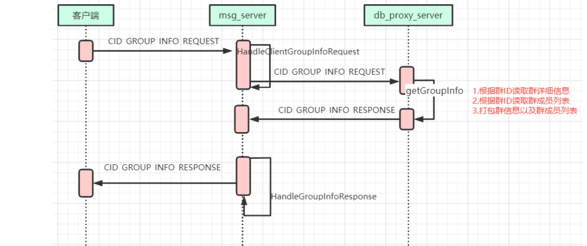


```cpp
/* IM.Group.proto */
message IMGroupInfoListReq{
	//cmd id:			0x0403
	required uint32 user_id = 1;
	repeated IM.BaseDefine.GroupVersionInfo group_version_list = 2;
	optional bytes attach_data = 20;
}

message IMGroupInfoListRsp{
	//cmd id:			0x0404
	required uint32 user_id = 1;
	repeated IM.BaseDefine.GroupInfo group_info_list = 2;
	optional bytes attach_data = 20;
}
```

```cpp
/* IM.BaseDefine.proto */
message GroupInfo{
	required uint32 group_id = 1;
	required uint32 version = 2;
	required string group_name = 3;
	required string group_avatar = 4;
	required uint32 group_creator_id = 5;
	required GroupType group_type = 6;
	required uint32 shield_status = 7;		//1: shield  0: not shield 
	repeated uint32 group_member_list = 8;
}
```

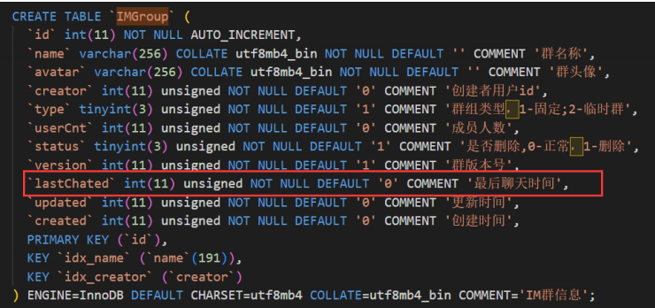


#### 5.获取最近联系的会话


CID_BUDDY_LIST_RECENT_CONTACT_SESSION_REQUEST

- CMsgConn::_HandleClientRecentContactSessionRequest，使⽤CID_BUDDY_LIST_RECENT_CONTACT_SESSION_REQUEST命令，并转发给db_proxy_server
- DB_PROXY::getRecentSession (db_proxy_server模块)进⾏响应
    - 使⽤getRecentSession在IMRecentSession查询最近联系⼈列表信息，以及对应的详细信息，⽐如最后的消息msgId
    - CID_BUDDY_LIST_RECENT_CONTACT_SESSION_RESPONSE回复给msg_server

- CDBServConn::_HandleRecentSessionResponse （msg_server模块），回复给客户端。

```cpp
/* IM.Buddy.proto */
message IMRecentContactSessionReq{
	//cmd id:		0x0201
	required uint32 user_id = 1;
	required uint32 latest_update_time = 2;
	optional bytes attach_data = 20;
}

message IMRecentContactSessionRsp{
	//cmd id:		0x0202
	required uint32 user_id = 1;
	repeated IM.BaseDefine.ContactSessionInfo contact_session_list = 2;
	optional bytes attach_data = 20;
}
```

```cpp
/* IM.BaseDefine.proto */
message ContactSessionInfo{
	required uint32 session_id = 1;
	required SessionType session_type = 2;
    required SessionStatusType session_status = 3;
	required uint32 updated_time = 4;
	required uint32 latest_msg_id = 5;
	required bytes latest_msg_data = 6;
    required MsgType latest_msg_type = 7;
    required uint32 latest_msg_from_user_id = 8;
}
```


#### 6.查询⽤户列表的⽤户当前的在线状态

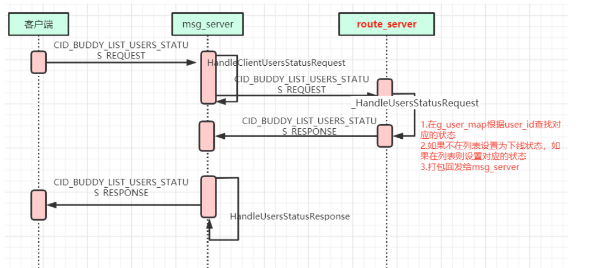

- CMsgConn::_HandleClientUsersStatusRequest（msg_server模块），去route_server查询⽤户列表⾥⾯⽤户的状态，使⽤CID_BUDDY_LIST_USERS_STATUS_REQUEST命令，并由route_server进⾏⼴播
- CRouteConn::_HandleUsersStatusRequest (route_server模块)，从route_server的UserInfoMap_t g_user_map;⾥⾯获取user的当前状态。
    - 回复给msg_server CID_BUDDY_LIST_USERS_STATUS_RESPONSE
    - CRouteServConn::_HandleUsersStatusResponse进⾏响应，并以CID_BUDDY_LIST_USERS_STATUS_RESPONSE回复客户端。

```cpp
/* IM.Buddy.proto */
message IMUsersStatReq{
	//cmd id:		0x020a
	required uint32 user_id = 1;
	repeated uint32 user_id_list = 2;
	optional bytes attach_data = 20;
}

message IMUsersStatRsp{
	//cmd id:		0x020b
	required uint32 user_id = 1;
	repeated IM.BaseDefine.UserStat user_stat_list = 2;
	optional bytes attach_data = 20;
}
```

```cpp
/* IM.BaseDefine.proto */
message UserStat{
	required uint32 user_id = 1;
	required UserStatType status = 2;
}

enum UserStatType{
	USER_STATUS_ONLINE 	= 1;
	USER_STATUS_OFFLINE	= 2;
	USER_STATUS_LEAVE	= 3;
}
```


#### 7.获取未读消息的数量

设计redis与mysql相关问题，

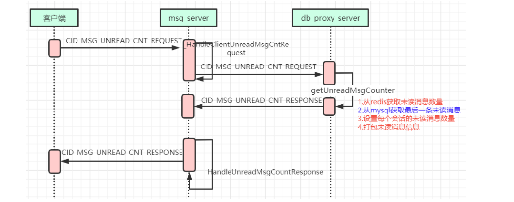

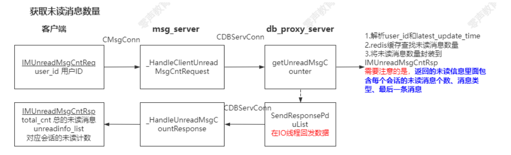

CID_MSG_UNREAD_CNT_REQUEST

- CMsgConn::_HandleClientUnreadMsgCntRequest （msg_server模块），使⽤CID_MSG_UNREAD_CNT_REQUEST命令，并转发给db_proxy_server
- DB_PROXY::getUnreadMsgCounter (db_proxy_server模块)（根据CID_MSG_UNREAD_CNT_REQUEST命令查找），未读消息数量包括单聊和群聊消息
    - CMessageModel::getUnreadMsgCount获取单聊未读消息数量
        - 未读消息数量存储在redis，以列表的⽅式进⾏存储，列表list包括<session_id,unread_cnt>
        - 调⽤CMessageModel::getLastMsg读取最新的消息

    - CMessageModel::getUnreadMsgCount获取群聊未读消息数量
    - 封装成pdu⽤CID_MSG_UNREAD_CNT_RESPONSE命令进⾏回发

- CDBServConn::_HandleUnreadMsgCountResponse（msg_server模块）进⾏响应，然后回发给客户端

```cpp
/* IM.Message.proto */
message IMUnreadMsgCntReq{
	//cmd id:		0x0307
	required uint32 user_id = 1;
	optional bytes attach_data = 20;	
}

message IMUnreadMsgCntRsp{
	//cmd id:		0x0308
	required uint32 user_id = 1;
	required uint32 total_cnt = 2;
	repeated IM.BaseDefine.UnreadInfo unreadinfo_list = 3;
	optional bytes attach_data = 20;
}
```

```cpp
/* IM.BaseDefine.proto */
message UnreadInfo{
	required uint32 session_id = 1;
	required SessionType session_type = 2;
	required uint32 unread_cnt = 3;
	required uint32 latest_msg_id = 4;
	required bytes latest_msg_data = 5;
    required MsgType latest_msg_type = 6;
    required uint32 latest_msg_from_user_id = 7;        //发送得用户id
}
```


#### 8.获取消息


CID_MSG_LIST_REQUEST

- CMsgConn::_HandleClientGetMsgListRequest（msg_server模块）响应客户端的 CID_MSG_LIST_REQUEST，并使⽤CID_MSG_LIST_REQUEST转发给db_proxy_server
- DB_PROXY::getMessage(db_proxy_server模块)：
    - 单聊消息使⽤CMessageModel::getMessage读取消息，查询IMMessage_x表
    - 群聊消息使⽤CMessageModel::getMessage读取消息，查询IMGroupMessage_x表

- 使⽤CID_MSG_LIST_RESPONSE发回给msg_server
- CDBServConn::_HandleGetMsgListResponse（msg_server模块），发回给客户端。


CDBServConn::_HandleValidateResponse 检测到新登录成功时则踢掉⽼登录。使⽤CID_OTHER_SERVER_KICK_USER命令，通过⼴播的⽅式进⾏

#### 9.新登录用户踢掉老用户

- CRouteConn::HandlePdu （route_server模块）响应CID_OTHER_SERVER_KICK_USER后原封不动转发到各个msg_server
- CRouteServConn::_HandleKickUser（msg_server模块）响应CID_OTHER_SERVER_KICK_USER，如果改user在当前msg_server，则CImUser::KickOutSameClientType查找是否有重复的登录，并通过对应的CImConn发送回给客户端。


### 3.消息发送全流程

CID_MSG_DATA

客户端接受到的消息是根据消息id进行排序的，而不是根据消息发送的时间，


msg_server与数据库通信：

1. 将数据发送给数据库，如果是第一次会话需要创建会话（将会话信息写入数据库中），如果已经有会话关系直接获取即可
2. 将消息发送写入到数据库中，进行一定的处理（添加消息msgId），将消息发回到msg_server中（带上消息msgId），在协议header中有一个seq_id
3. msg_server转发消息，如果客户端在线，将消息直接发送给客户端，如果客户端不在线，将消息存储到离线消息数据库中，当下一次客户端上线，将离线消息读取后发送给客户端（并将数据库中的离线消息标记为已读），
    - 先在msg_server中查询对端的user_id，
    - 广播到route_server服务器中（发送给1个route_server就可以了），在route_server根据对端user_id找到是在哪个msg_server中


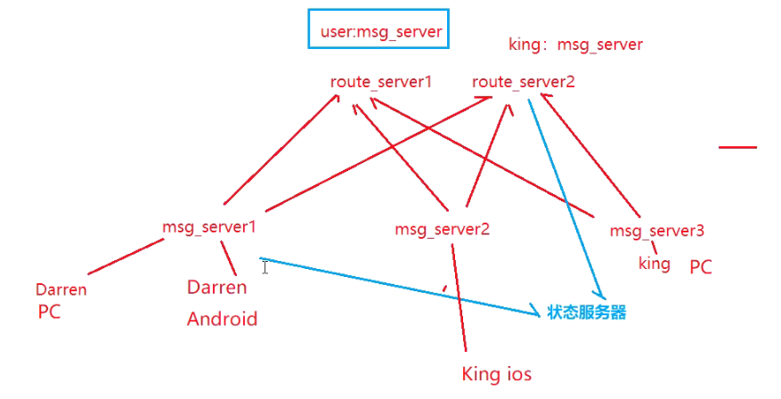

```cpp
//service id  0x0003
message IMMsgData{
	//cmd id:		0x0301
	required uint32 from_user_id = 1;				//消息发送方
	required uint32 to_session_id = 2;				//消息接受方
	required uint32 msg_id = 3;
	required uint32 create_time = 4; 
	required IM.BaseDefine.MsgType msg_type = 5;
	required bytes msg_data = 6;
	optional bytes attach_data = 20;
}
```

```cpp
message IMMsgDataAck{
	//cmd id:		0x0302
	required uint32 user_id = 1;			//发送此信令的用户id
	required uint32 session_id = 2;				
	required uint32 msg_id = 3;
	required IM.BaseDefine.SessionType session_type = 4;
}
```

```cpp
message IMMsgDataReadAck{
	//cmd id:		0x0303
	required uint32 user_id = 1;			//发送此信令的用户id
	required uint32 session_id = 2;			
	required uint32 msg_id = 3;
	required IM.BaseDefine.SessionType session_type = 4;
}
```

```cpp
message IMMsgDataReadNotify{
	//cmd id:		0x0304
	required uint32 user_id = 1;			//发送此信令的用户id
	required uint32 session_id = 2;		
	required uint32 msg_id = 3;
	required IM.BaseDefine.SessionType session_type = 4;
}
```

每个CImUser对应⼀个登陆⽤户，CMsgConn对应⼀个端的登录，CImUser和CMsgConn是1:n的对应关系。

1. CMsgConn::HandlePdu （msg_server模块，处理客户端的请求的信息）
2. CMsgConn::_HandleClientMsgData（msg_server模块，处理客户端的消息发送，CID_MSG_DATA命令）,重新拼装pdu，主要是增加handle作为attach数据，然后发送给db_proxy_server
3. DB_PROXY::sendMessage （db_proxy_server模块），
    - 获取消息FromId，ToId, MsgType等，并先验证消息类型MsgType是否有效 （这⾥主要先分析单聊的情况）
    - nSessionId 服务器分配会话id：通过CSessionModel::getSessionId查询两个⼈直接的聊天是否已经建⽴最近会话记录(从IMRecentSession表)，如果没有记录则调⽤CSessionModel::addSession创建
    - nPeerSessionId 服务器分配对端会话id：通过CSessionModel::getSessionId查询两个⼈直接的聊天是否已经建⽴最近会话记录(从IMRecentSession表)，如果没有记录则调⽤CSessionModel::addSession创建，需要注意的是nPeerSessionId和nSessionId的FromId和ToId是相反的。
    - nRelateId：获取通话⼈之间的关系id，如果两者之前没有关系则调⽤CRelationModel::getRelationId进⾏添加（操作IMRelationShip表）
    - nMsgId 服务器分配消息id，CMessageModel::getMsgId根据nRelateId映射进⾏获取，（FromId和ToId相互之间的nRelateId是唯⼀的，不分⽅向性，进⽽保证相互之间发送消息时消息的顺序性），msgId存储在redis中，通过key为"msg_id_" + int2string(nRelateId)进⾏获取，每次进⾏+1的递增操作
    - CMessageModel::sendMessage 将消息插⼊到数据库（操作IMMessage_x表），发送消息和要读取消息之间存储的是同⼀条消息：nRelateId, nFromId, nToId, nMsgType, nCreateTime,nMsgId，msg_data
    - 然后封装响应pPduResp，最重要的是附带nMsgId和msg回发给msg_server，使⽤CID_MSG_DATA命令。⼀样是以AddResponsePdu插⼊队列，然后SendResponsePduList进⾏回发的套路。
4. CDBServConn::HandlePdu （msg_server模块，处理dbproxy回发的数据），根据CID_MSG_DATA找到对应的处理函数
5. CDBServConn::_HandleMsgData（msg_server模块）
    - 根据attach_data的handle查找到对应的socket通路，使⽤CID_MSG_DATA_ACK告知客户端消息已经发送到服务器。
    - get_route_serv_conn，将pdu发送给route_server， CRouteConn::HandlePdu进⾏响应，然后调⽤CRouteConn::_BroadcastMsg转发给其他msg_server。
    - CImUser::BroadcastClientMsgData：⼴播给消息发起者，对于发起者不需要⼴播给⾃⼰的，只需要⼴播给其他端（⽐如多端登录时，PC端发送的数据，则⼴播给Android、IOS端，不⽤再⼴播给PC端），并将该消息插⼊到m_send_msg_list。
    - CImUser::BroadcastClientMsgData：⼴播给消息接收者，有⼏端登录同⼀个账号就⼴播给⼏个端，并将该消息插⼊到m_send_msg_list
    - CID_OTHER_GET_DEVICE_TOKEN_REQ：消息推送请求，主要是针对Android和IOS，此时由从新发回给db_proxy_server， 在setDevicesToken进⾏响应，我们这⾥不继续关注它。
6. 接收的客户端写⼊消息的回应
7. 作为接收者的客户端读取消息后回应CMsgConn::_HandleClientMsgReadAck（msg_server模块），使⽤CID_MSG_READ_ACK命令。
    - 使⽤CID_MSG_READ_NOTIFY通知其他多端登录的客户端，已经有客户端读取了该消息。
    - 将该msg从m_send_msg_list移除。
    - 如果客户端没有回应，则CMsgConn::OnTimer定时器定时check消息是否已经正常发送给客户端，没有收到响应则认为g_down_msg_miss_cnt++，该详细下⾏失败。


### 4.聊天逻辑流程DBP

```cpp
//service id  0x0003
message IMMsgData{
	//cmd id:		0x0301
	required uint32 from_user_id = 1;				//消息发送方
	required uint32 to_session_id = 2;				//消息接受方
	required uint32 msg_id = 3;
	required uint32 create_time = 4; 
	required IM.BaseDefine.MsgType msg_type = 5;
	required bytes msg_data = 6;
	optional bytes attach_data = 20;
}
```

#### MessageContent.cpp->sendMessage

```cpp
void sendMessage(CImPdu* pPdu, uint32_t conn_uuid) {
  //pDu数据解析
  IM::Message::IMMsgData msg;
  if (msg.ParseFromArray(pPdu->GetBodyData(), pPdu->GetBodyLength())) {
    uint32_t nFromId = msg.from_user_id();
    uint32_t nToId = msg.to_session_id();
    uint32_t nCreateTime = msg.create_time();
    IM::BaseDefine::MsgType nMsgType = msg.msg_type();//消息类型
    uint32_t nMsgLen = msg.msg_data().length();

    uint32_t nNow = (uint32_t)time(NULL);

    //开始对消息进行处理
    if (IM::BaseDefine::MsgType_IsValid(nMsgType)) {
      if (nMsgLen != 0) {
        CImPdu* pPduResp = new CImPdu;

        uint32_t nMsgId = INVALID_VALUE;
        uint32_t nSessionId = INVALID_VALUE;
        uint32_t nPeerSessionId = INVALID_VALUE;

        CMessageModel* pMsgModel = CMessageModel::getInstance();
        CGroupMessageModel* pGroupMsgModel = CGroupMessageModel::getInstance();

        //1.群聊文本消息
        if (nMsgType == IM::BaseDefine::MSG_TYPE_GROUP_TEXT) {
          CGroupModel* pGroupModel = CGroupModel::getInstance();
          if (pGroupModel->isValidateGroupId(nToId) &&
              pGroupModel->isInGroup(nFromId, nToId)) {
            nSessionId = CSessionModel::getInstance()->getSessionId(
                nFromId, nToId, IM::BaseDefine::SESSION_TYPE_GROUP, false);
            if (INVALID_VALUE == nSessionId) {
              nSessionId = CSessionModel::getInstance()->addSession(
                  nFromId, nToId, IM::BaseDefine::SESSION_TYPE_GROUP);
            }
            if (nSessionId != INVALID_VALUE) {
              nMsgId = pGroupMsgModel->getMsgId(nToId);
              if (nMsgId != INVALID_VALUE) {
                pGroupMsgModel->sendMessage(nFromId, nToId, nMsgType,
                                            nCreateTime, nMsgId,
                                            (string&)msg.msg_data());
                CSessionModel::getInstance()->updateSession(nSessionId, nNow);
              }
            }
          } else {
            log("invalid groupId. fromId=%u, groupId=%u", nFromId, nToId);
            delete pPduResp;
            return;
          }
        } else if (nMsgType == IM::BaseDefine::MSG_TYPE_GROUP_AUDIO) {
          //2.群聊语音消息
          CGroupModel* pGroupModel = CGroupModel::getInstance();
          if (pGroupModel->isValidateGroupId(nToId) &&
              pGroupModel->isInGroup(nFromId, nToId)) {
            nSessionId = CSessionModel::getInstance()->getSessionId(
                nFromId, nToId, IM::BaseDefine::SESSION_TYPE_GROUP, false);
            if (INVALID_VALUE == nSessionId) {
              nSessionId = CSessionModel::getInstance()->addSession(
                  nFromId, nToId, IM::BaseDefine::SESSION_TYPE_GROUP);
            }
            if (nSessionId != INVALID_VALUE) {
              nMsgId = pGroupMsgModel->getMsgId(nToId);
              if (nMsgId != INVALID_VALUE) {
                pGroupMsgModel->sendAudioMessage(
                    nFromId, nToId, nMsgType, nCreateTime, nMsgId,
                    msg.msg_data().c_str(), nMsgLen);
                CSessionModel::getInstance()->updateSession(nSessionId, nNow);
              }
            }
          } else {
            log("invalid groupId. fromId=%u, groupId=%u", nFromId, nToId);
            delete pPduResp;
            return;
          }
        } else if (nMsgType == IM::BaseDefine::MSG_TYPE_SINGLE_TEXT) {
          //3.单聊文本消息
          if (nFromId != nToId) {
            nSessionId = CSessionModel::getInstance()->getSessionId(nFromId, nToId, IM::BaseDefine::SESSION_TYPE_SINGLE, false);//自己的sessionId
            if (INVALID_VALUE == nSessionId) nSessionId = CSessionModel::getInstance()->addSession(nFromId, nToId, IM::BaseDefine::SESSION_TYPE_SINGLE);
            
            nPeerSessionId = CSessionModel::getInstance()->getSessionId(nToId, nFromId, IM::BaseDefine::SESSION_TYPE_SINGLE, false);//对端的sessionId
            if (INVALID_VALUE == nPeerSessionId) nSessionId = CSessionModel::getInstance()->addSession(nToId, nFromId, IM::BaseDefine::SESSION_TYPE_SINGLE);

            uint32_t nRelateId = CRelationModel::getInstance()->getRelationId(nFromId, nToId, true);

            if (nSessionId != INVALID_VALUE && nRelateId != INVALID_VALUE) {
              nMsgId = pMsgModel->getMsgId(nRelateId);
              if (nMsgId != INVALID_VALUE) {
                pMsgModel->sendMessage(nRelateId, nFromId, nToId, nMsgType, nCreateTime, nMsgId, (string&)msg.msg_data());//将消息存入数据库中 并将消息计数+1
                CSessionModel::getInstance()->updateSession(nSessionId, nNow);//更新会话比较耗时 对于即时通信的系统性能 受数据库处理的影响较大
                CSessionModel::getInstance()->updateSession(nPeerSessionId, nNow);
              } else {
                log("msgId is invalid. fromId=%u, toId=%u, nRelateId=%u, nSessionId=%u, nMsgType=%u",
                    nFromId, nToId, nRelateId, nSessionId, nMsgType);
              }
            } else {
              log("sessionId or relateId is invalid. fromId=%u, toId=%u, nRelateId=%u, nSessionId=%u, nMsgType=%u",
                  nFromId, nToId, nRelateId, nSessionId, nMsgType);
            }
          } else {
            log("send msg to self. fromId=%u, toId=%u, msgType=%u", nFromId,
                nToId, nMsgType);
          }

        } else if (nMsgType == IM::BaseDefine::MSG_TYPE_SINGLE_AUDIO) {
          //4.单聊语音消息
          if (nFromId != nToId) {
            nSessionId = CSessionModel::getInstance()->getSessionId(nFromId, nToId, IM::BaseDefine::SESSION_TYPE_SINGLE, false);
            if (INVALID_VALUE == nSessionId) nSessionId = CSessionModel::getInstance()->addSession(nFromId, nToId, IM::BaseDefine::SESSION_TYPE_SINGLE);

            nPeerSessionId = CSessionModel::getInstance()->getSessionId(nToId, nFromId, IM::BaseDefine::SESSION_TYPE_SINGLE, false);
            if (INVALID_VALUE == nPeerSessionId) nSessionId = CSessionModel::getInstance()->addSession(nToId, nFromId, IM::BaseDefine::SESSION_TYPE_SINGLE);

            uint32_t nRelateId = CRelationModel::getInstance()->getRelationId(nFromId, nToId, true);

            if (nSessionId != INVALID_VALUE && nRelateId != INVALID_VALUE) {
              nMsgId = pMsgModel->getMsgId(nRelateId);
              if (nMsgId != INVALID_VALUE) {
                pMsgModel->sendAudioMessage(nRelateId, nFromId, nToId, nMsgType,
                                            nCreateTime, nMsgId,
                                            msg.msg_data().c_str(), nMsgLen);
                CSessionModel::getInstance()->updateSession(nSessionId, nNow);
                CSessionModel::getInstance()->updateSession(nPeerSessionId, nNow);
              } else {
                log("msgId is invalid. fromId=%u, toId=%u, nRelateId=%u, nSessionId=%u, nMsgType=%u",
                    nFromId, nToId, nRelateId, nSessionId, nMsgType);
              }
            } else {
              log("sessionId or relateId is invalid. fromId=%u, toId=%u, nRelateId=%u, nSessionId=%u, nMsgType=%u",
                  nFromId, nToId, nRelateId, nSessionId, nMsgType);
            }
          } else {
            log("send msg to self. fromId=%u, toId=%u, msgType=%u", nFromId, nToId, nMsgType);
          }
        }

        log("fromId=%u, toId=%u, type=%u, msgId=%u, sessionId=%u", nFromId, nToId, nMsgType, nMsgId, nSessionId);

        msg.set_msg_id(nMsgId);
        pPduResp->SetPBMsg(&msg);
        pPduResp->SetSeqNum(pPdu->GetSeqNum());
        pPduResp->SetServiceId(IM::BaseDefine::SID_MSG);
        pPduResp->SetCommandId(IM::BaseDefine::CID_MSG_DATA);
        CProxyConn::AddResponsePdu(conn_uuid, pPduResp);
      } else {
        log("msgLen error. fromId=%u, toId=%u, msgType=%u", nFromId, nToId, nMsgType);
      }
    } else {
      log("invalid msgType.fromId=%u, toId=%u, msgType=%u", nFromId, nToId, nMsgType);
    }
  } else {
    log("parse pb failed");
  }
}
```

#### 单聊MessageModel.cpp->CMessageModel::sendMessage

用户选择单聊

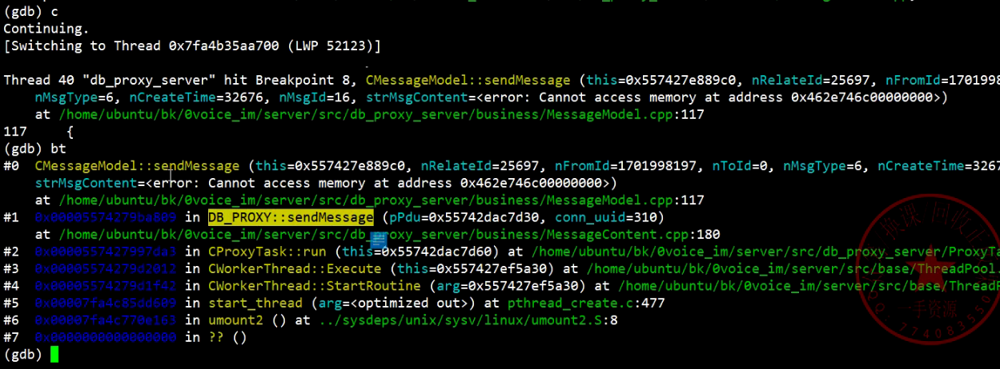

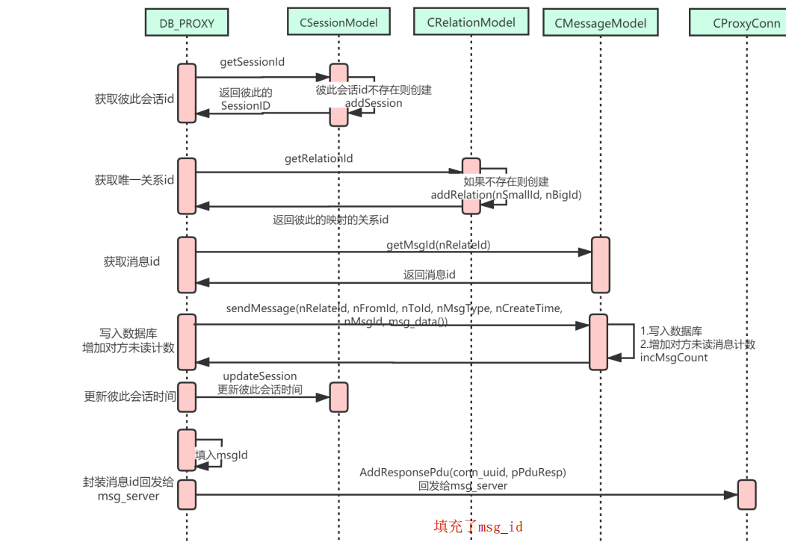

```cpp
/*
 * IMMessage 分表
 * AddFriendShip()
 * if nFromId or nToId is ShopEmployee
 * GetShopId
 * Insert into IMMessage_ShopId%8
 */
bool CMessageModel::sendMessage(uint32_t nRelateId, uint32_t nFromId,
                                uint32_t nToId,
                                IM::BaseDefine::MsgType nMsgType,
                                uint32_t nCreateTime, uint32_t nMsgId,
                                string& strMsgContent) {
  bool bRet = false;
  if (nFromId == 0 || nToId == 0) {
    log("invalied userId.%u->%u", nFromId, nToId);
    return bRet;
  }

  CDBManager* pDBManager = CDBManager::getInstance();
  CDBConn* pDBConn = pDBManager->GetDBConn("teamtalk_master");
  if (pDBConn) {
    //通过id映射到对应的数据库表
    string strTableName = "IMMes    sage_" + int2string(nRelateId % 8);
    string strSql =
        "insert into " + strTableName +
        " (`relateId`, `fromId`, `toId`, `msgId`, `content`, `status`, `type`, "
        "`created`, `updated`) values(?, ?, ?, ?, ?, ?, ?, ?, ?)";
    // 必须在释放连接前delete CPrepareStatement对象，否则有可能多个线程操作mysql对象，会crash
    CPrepareStatement* pStmt = new CPrepareStatement();
    // 1.数据库写入
    if (pStmt->Init(pDBConn->GetMysql(), strSql)) {
      uint32_t nStatus = 0;
      uint32_t nType = nMsgType;
      uint32_t index = 0;
      pStmt->SetParam(index++, nRelateId);
      pStmt->SetParam(index++, nFromId);
      pStmt->SetParam(index++, nToId);
      pStmt->SetParam(index++, nMsgId);
      pStmt->SetParam(index++, strMsgContent);
      pStmt->SetParam(index++, nStatus);
      pStmt->SetParam(index++, nType);
      pStmt->SetParam(index++, nCreateTime);
      pStmt->SetParam(index++, nCreateTime);
      bRet = pStmt->ExecuteUpdate();
    }
    delete pStmt;
    // 2.释放掉连接
    pDBManager->RelDBConn(pDBConn);
    if (bRet) {
      uint32_t nNow = (uint32_t)time(NULL);
      incMsgCount(nFromId, nToId);//消息未读计数器更新
    } else {
      log("insert message failed: %s", strSql.c_str());
    }
  } else {
    log("no db connection for teamtalk_master");
  }
  return bRet;
}
```


#### 群聊GroupMessageModel.cpp->CGroupMessageModel::sendMessage

用户选择群聊

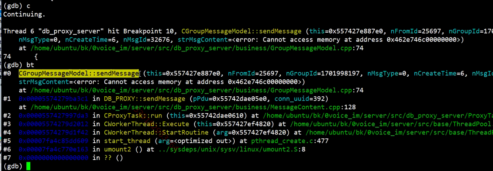


```cpp
/**
 *  发送群消息接口
 *
 *  @param nRelateId     关系Id
 *  @param nFromId       发送者Id
 *  @param nGroupId      群组Id
 *  @param nMsgType      消息类型
 *  @param nCreateTime   消息创建时间
 *  @param nMsgId        消息Id
 *  @param strMsgContent 消息类容
 *
 *  @return 成功返回true 失败返回false
 */
bool CGroupMessageModel::sendMessage(uint32_t nFromId, uint32_t nGroupId,
                                     IM::BaseDefine::MsgType nMsgType,
                                     uint32_t nCreateTime, uint32_t nMsgId,
                                     const string& strMsgContent) {
  bool bRet = false;
  if (CGroupModel::getInstance()->isInGroup(nFromId, nGroupId)) {
    CDBManager* pDBManager = CDBManager::getInstance();
    //将消息写入mysql数据库中
    CDBConn* pDBConn = pDBManager->GetDBConn("teamtalk_master");
    if (pDBConn) {
      //同一个群中的消息是在同一张数据库的表中
      //通过hash的方式将数据存储到不同的数据库表中
      string strTableName = "IMGroupMessage_" + int2string(nGroupId % 8);
      string strSql = "insert into " + strTableName +
                      " (`groupId`, `userId`, `msgId`, `content`, `type`, "
                      "`status`, `updated`, `created`) "
                      "values(?, ?, ?, ?, ?, ?, ?, ?)";
      
      //1.对数据库的操作
      // 必须在释放连接前delete
      // CPrepareStatement对象，否则有可能多个线程操作mysql对象，会crash
      CPrepareStatement* pStmt = new CPrepareStatement();
      if (pStmt->Init(pDBConn->GetMysql(), strSql)) {
        uint32_t nStatus = 0;
        uint32_t nType = nMsgType;
        uint32_t index = 0;
        pStmt->SetParam(index++, nGroupId);
        pStmt->SetParam(index++, nFromId);
        pStmt->SetParam(index++, nMsgId);
        pStmt->SetParam(index++, strMsgContent);
        pStmt->SetParam(index++, nType);
        pStmt->SetParam(index++, nStatus);
        pStmt->SetParam(index++, nCreateTime);
        pStmt->SetParam(index++, nCreateTime);

        bool bRet = pStmt->ExecuteUpdate();
        if (bRet) {
          //更新updateGroupChat信息（set lastChated最后一条群消息时间）
          CGroupModel::getInstance()->updateGroupChat(nGroupId);
          incMessageCount(nFromId, nGroupId);//添加群消息总计数
          clearMessageCount(nFromId, nGroupId);//清除发送群消息的用户的未读消息计数
        } else {
          log("insert message failed: %s", strSql.c_str());
        }
      }
      delete pStmt;
      pDBManager->RelDBConn(pDBConn);
    } else {
      log("no db connection for teamtalk_master");
    }
  } else {
    log("not in the group.fromId=%u, groupId=%u", nFromId, nGroupId);
  }
  return bRet;
}
```

#### SyncCenter.cpp->CSyncCenter::doSyncGroupChat

```cpp
/**
 *  同步群组聊天信息
 *
 *  @param arg NULL
 *
 *  @return NULL
 */
void* CSyncCenter::doSyncGroupChat(void* arg) {
  m_bSyncGroupChatRuning = true;
  CDBManager* pDBManager = CDBManager::getInstance();
  map<uint32_t, uint32_t> mapChangedGroup;
  do {
    mapChangedGroup.clear();
    CDBConn* pDBConn = pDBManager->GetDBConn("teamtalk_slave");
    if (pDBConn) {
      //1.检查群消息是否有更新
      string strSql =
          "select id, lastChated from IMGroup where status=0 and lastChated >=" +
          int2string(m_pInstance->getLastUpdateGroup());
      CResultSet* pResult = pDBConn->ExecuteQuery(strSql.c_str());
      //2.获取群聊消息最后更新的时间
      if (pResult) {
        while (pResult->Next()) {
          uint32_t nGroupId = pResult->GetInt("id");
          uint32_t nLastChat = pResult->GetInt("lastChated");
          if (nLastChat != 0) {
            mapChangedGroup[nGroupId] = nLastChat;//获取最后更新的时间
          }
        }
        delete pResult;
      }
      pDBManager->RelDBConn(pDBConn);
    } else {
      log("no db connection for teamtalk_slave");
    }
    //3.设置最后一次同步的时间 用来做下一次的对比
    m_pInstance->updateLastUpdateGroup(time(NULL));
    for (auto it = mapChangedGroup.begin(); it != mapChangedGroup.end(); ++it) {
      /* 遍历所有的群 进行处理 */
      uint32_t nGroupId = it->first;
      list<uint32_t> lsUsers;
      uint32_t nUpdate = it->second;//获取该群对应的最后更新时间
      //4.从redis中获取群成员（将群存入redis中提升访问速度）
      CGroupModel::getInstance()->getGroupUser(nGroupId, lsUsers);
      for (auto it1 = lsUsers.begin(); it1 != lsUsers.end(); ++it1) {
        uint32_t nUserId = *it1;
        uint32_t nSessionId = INVALID_VALUE;
        nSessionId = CSessionModel::getInstance()->getSessionId(nUserId, nGroupId, IM::BaseDefine::SESSION_TYPE_GROUP, true);//获取sessionId
        if (nSessionId != INVALID_VALUE) {
          //将该群的最后更新时间 设置到sessionId对应的群聊中
          CSessionModel::getInstance()->updateSession(nSessionId, nUpdate);
        } else {
          CSessionModel::getInstance()->addSession(nUserId, nGroupId, IM::BaseDefine::SESSION_TYPE_GROUP);
        }
      }
    }
  } while (m_pInstance->m_bSyncGroupChatWaitting && !(m_pInstance->m_pCondGroupChat->waitTime(5 * 1000)));//更新时间设置为5s
  //    } while (!m_pInstance->m_pCondSync->waitTime(5*1000));
  //    } while(m_pInstance->m_bSyncGroupChatWaitting);
  m_bSyncGroupChatRuning = false;
  return NULL;
}
```

```cpp
/* SyncCenter.cpp */
/**
 *  停止同步，为了"优雅"的同步，使用了条件变量
 */
void CSyncCenter::stopSync() {
  m_bSyncGroupChatWaitting = false;
  m_pCondGroupChat->notify();
  while (m_bSyncGroupChatRuning) {
    usleep(500);
  }
}
```


### 5.群消息转发MS

1. CID_GROUP_INFO_REQUEST
2. void getGroupInfo(CImPdu *pPdu, unit32_t conn_uuid)
3. case CID_GROUP_INFO_RESPONSE
4. HandleGroupInfoResponse发送数据


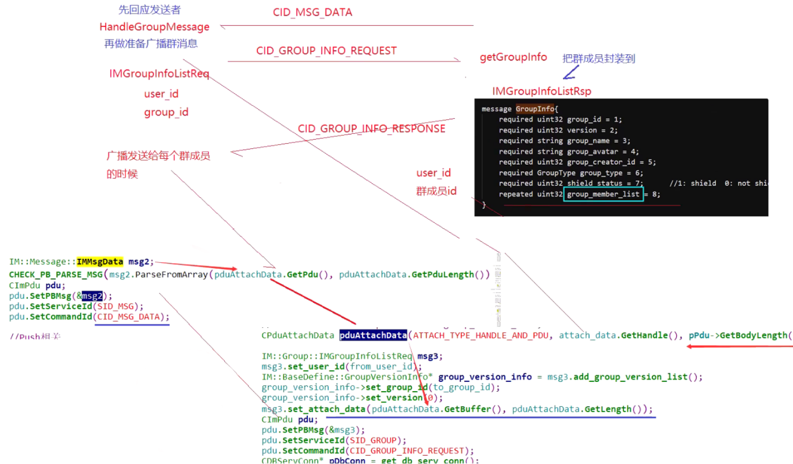

#### DBServConn.cpp->CDBServConn::_HandleMsgData

```cpp

```


#### GroupChat.cpp->CGroupChat::HandleGroupMessage

```cpp

```


### 6.文件传输全流程

#### 1.msg_server主动连接file_server服务器

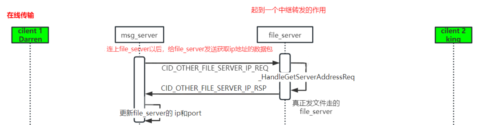

在msg_server连接上file_server后，

- step1：msg_server中`FileServConn.cpp`的回调函数`onconfirm`会被调用进行应答，向file_server发送请求获取其ip地址与端口号（CID_OTHER_FILE_SERVER_IP_REQ），

##### CFileServConn::OnConfirm

```cpp
//msg_server成功连接上file_server后发送conform请求
void CFileServConn::OnConfirm() {
  //将连接上的file_server存入g_file_server_list中
  log("connect to file server success ");
  m_bOpen = true;
  m_connect_time = get_tick_count();
  g_file_server_list[m_serv_idx].reconnect_cnt = MIN_RECONNECT_CNT / 2;
  
  //向file_server发送请求获取其ip地址
  IM::Server::IMFileServerIPReq msg;
  CImPdu pdu;
  pdu.SetPBMsg(&msg);
  pdu.SetServiceId(SID_OTHER);
  pdu.SetCommandId(CID_OTHER_FILE_SERVER_IP_REQ);
  SendPdu(&pdu);
}
```

- step2：在file_server中的`FileMsgServerConn::_HandleGetServerAddressReq`函数，会对msg_server发来的信令进行处理，将file_server的ip地址发回（CID_OTHER_FILE_SERVER_IP_RSP）

##### FileMsgServerConn::_HandleGetServerAddressReq

```cpp
void FileMsgServerConn::_HandleGetServerAddressReq(CImPdu* pPdu) {
  IM::Server::IMFileServerIPRsp msg;
  const std::list<IM::BaseDefine::IpAddr>& addrs = ConfigUtil::GetInstance()->GetAddressList();
  
  for (std::list<IM::BaseDefine::IpAddr>::const_iterator it = addrs.begin(); it != addrs.end(); ++it) {
    IM::BaseDefine::IpAddr* addr = msg.add_ip_addr_list();
    *addr = *it;
    log("Upload file_client_conn addr info, ip=%s, port=%d", addr->ip().c_str(), addr->port());
  }
  SendMessageLite(this, SID_OTHER, CID_OTHER_FILE_SERVER_IP_RSP, pPdu->GetSeqNum(), &msg);
}
```

- step3：处理从file_server获取到的ip地址信息，将ip地址与端口信息返回到客户端中，更新file_server的ip地址与port端口号

##### CFileServConn::_HandleFileServerIPRsp

```cpp
//处理请求file_server的ip之后的响应信息
void CFileServConn::_HandleFileServerIPRsp(CImPdu* pPdu) {
  //将接收到的信息反序列化
  IM::Server::IMFileServerIPRsp msg;
  CHECK_PB_PARSE_MSG(msg.ParseFromArray(pPdu->GetBodyData(), pPdu->GetBodyLength()));
  uint32_t ip_addr_cnt = msg.ip_addr_list_size();

  //获取到file_server的ip地址 将信息会发到客户端
  for (uint32_t i = 0; i < ip_addr_cnt; i++) {
    IM::BaseDefine::IpAddr ip_addr = msg.ip_addr_list(i);
    log("_HandleFileServerIPRsp -> %s : %d ", ip_addr.ip().c_str(), ip_addr.port());
    m_ip_list.push_back(ip_addr);
  }
}
```


#### 2.客户端->msg_server->file_server文件传输的请求

在本次请求后，文件传输的双方都会拿到file_server的ip与端口，从而可以进行下一步的直接登录file_server进行文件传输。

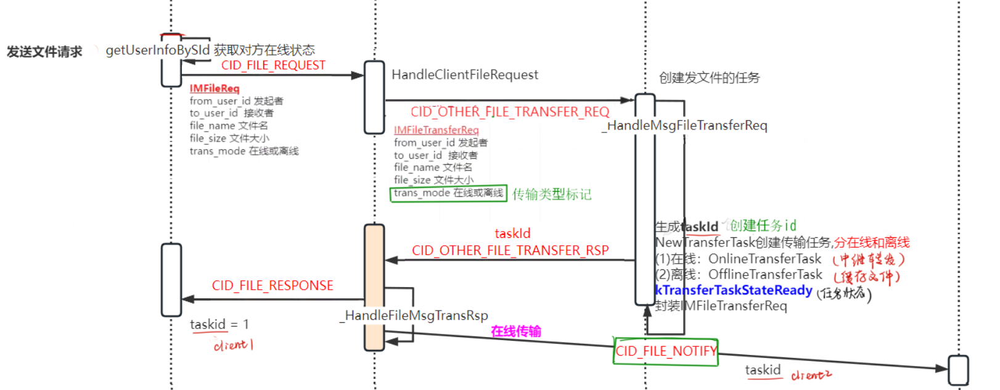

- step1：客户端向msg_server发送文件传输请求（表现为客户端向好友发送了文件传输请求）CID_FILE_REQUEST，请求中的数据包括from_user_id、to_user_id、file_name、file_size、trans_mode对端在线状态（该功能在客户端中进行实现）。


```protobuf
message IMFileReq{
	//cmd id: 	0x0506
	required uint32 from_user_id = 1;
	required uint32 to_user_id = 2;
	required string file_name = 3;
	required uint32 file_size = 4;
	required IM.BaseDefine.TransferFileType trans_mode = 5;
}
```

- step2：当msg_server接受到客户单的请求时，会调用**CFileHandler::HandleClientFileRequest**方法进行处理，并向file_server发起文件传输请求IMFileTransferReq

##### CFileHandler::HandleClientFileRequest

```protobuf
message IMFileTransferReq{
	//cmd id:			0x0715
	required uint32 from_user_id = 1;
	required uint32 to_user_id = 2;
	required string file_name = 3;
	required uint32 file_size = 4;
	required IM.BaseDefine.TransferFileType trans_mode = 5;
	optional bytes attach_data = 20;
}
```

```cpp
void CFileHandler::HandleClientFileRequest(CMsgConn* pMsgConn, CImPdu* pPdu) {
  IM::File::IMFileReq msg;
  CHECK_PB_PARSE_MSG(msg.ParseFromArray(pPdu->GetBodyData(), pPdu->GetBodyLength()));

  uint32_t from_id = pMsgConn->GetUserId();
  uint32_t to_id = msg.to_user_id();
  string file_name = msg.file_name();
  uint32_t file_size = msg.file_size();
  uint32_t trans_mode = msg.trans_mode();
  log("HandleClientFileRequest, %u->%u, fileName: %s, trans_mode: %u.",
      from_id, to_id, file_name.c_str(), trans_mode);

  CDbAttachData attach(ATTACH_TYPE_HANDLE, pMsgConn->GetHandle());
  CFileServConn* pFileConn = get_random_file_serv_conn();
  if (pFileConn) {
    IM::Server::IMFileTransferReq msg2;
    msg2.set_from_user_id(from_id);
    msg2.set_to_user_id(to_id);
    msg2.set_file_name(file_name);
    msg2.set_file_size(file_size);
    msg2.set_trans_mode((IM::BaseDefine::TransferFileType)trans_mode);//传输模式 离线传输 or 在线传输
    msg2.set_attach_data(attach.GetBuffer(), attach.GetLength());
    CImPdu pdu;
    pdu.SetPBMsg(&msg2);
    pdu.SetServiceId(SID_OTHER);
    pdu.SetCommandId(CID_OTHER_FILE_TRANSFER_REQ);
    pdu.SetSeqNum(pPdu->GetSeqNum());

    if (IM::BaseDefine::FILE_TYPE_OFFLINE == trans_mode) {
      pFileConn->SendPdu(&pdu);
    } else {
      // IM::BaseDefine::FILE_TYPE_ONLINE
      CImUser* pUser = CImUserManager::GetInstance()->GetImUserById(to_id);
      if (pUser && pUser->GetPCLoginStatus()) {
        // 已有对应的账号pc登录状态
        pFileConn->SendPdu(&pdu);
      } else {
        // 无对应用户的pc登录状态,向route_server查询状态
        // no pc_client in this msg_server, check it from route_server
        CPduAttachData attach_data(ATTACH_TYPE_HANDLE_AND_PDU_FOR_FILE,
                                   pMsgConn->GetHandle(), pdu.GetBodyLength(),
                                   pdu.GetBodyData());
        IM::Buddy::IMUsersStatReq msg3;
        msg3.set_user_id(from_id);
        msg3.add_user_id_list(to_id);
        msg3.set_attach_data(attach_data.GetBuffer(), attach_data.GetLength());

        CImPdu pdu2;
        pdu2.SetPBMsg(&msg3);
        pdu2.SetServiceId(SID_BUDDY_LIST);
        pdu2.SetCommandId(CID_BUDDY_LIST_USERS_STATUS_REQUEST);
        pdu2.SetSeqNum(pPdu->GetSeqNum());
        CRouteServConn* route_conn = get_route_serv_conn();
        if (route_conn) {
          route_conn->SendPdu(&pdu2);
        }
      }
    }
  } else {
    log("HandleClientFileRequest, no file server.   ");
    IM::File::IMFileRsp msg2;
    msg2.set_result_code(1);
    msg2.set_from_user_id(from_id);
    msg2.set_to_user_id(to_id);
    msg2.set_file_name(file_name);
    msg2.set_task_id("");
    msg2.set_trans_mode((IM::BaseDefine::TransferFileType)trans_mode);
    CImPdu pdu;
    pdu.SetPBMsg(&msg2);
    pdu.SetServiceId(SID_FILE);
    pdu.SetCommandId(CID_FILE_RESPONSE);
    pdu.SetSeqNum(pPdu->GetSeqNum());
    pMsgConn->SendPdu(&pdu);
  }
}
```

- step3：当msg_server发送的请求到达file_server时，file_server会调用创建文件传输任务并生成taskId，分为在线传输与离线传输任务。

##### FileMsgServerConn::_HandleMsgFileTransferReq

```cpp
void FileMsgServerConn::_HandleMsgFileTransferReq(CImPdu* pdu) {
  IM::Server::IMFileTransferReq transfer_req;
  CHECK_PB_PARSE_MSG(transfer_req.ParseFromArray(pdu->GetBodyData(), pdu->GetBodyLength()));

  uint32_t from_id = transfer_req.from_user_id();
  uint32_t to_id = transfer_req.to_user_id();

  IM::Server::IMFileTransferRsp transfer_rsp;
  transfer_rsp.set_result_code(1);
  transfer_rsp.set_from_user_id(from_id);
  transfer_rsp.set_to_user_id(to_id);
  transfer_rsp.set_file_name(transfer_req.file_name());
  transfer_rsp.set_file_size(transfer_req.file_size());
  transfer_rsp.set_task_id("");
  transfer_rsp.set_trans_mode(transfer_req.trans_mode());
  transfer_rsp.set_attach_data(transfer_req.attach_data());

  bool rv = false;
  do {
    std::string task_id = GenerateUUID();
    if (task_id.empty()) {
      log("Create task id failed");
      break;
    }
    log("trams_mode=%d, task_id=%s, from_id=%d, to_id=%d, file_name=%s, file_size=%d",
        transfer_req.trans_mode(), task_id.c_str(), from_id, to_id, transfer_req.file_name().c_str(), transfer_req.file_size());

    BaseTransferTask* transfer_task = TransferTaskManager::GetInstance()->NewTransferTask(
            transfer_req.trans_mode(), task_id, from_id, to_id,
            transfer_req.file_name(), transfer_req.file_size());

    if (transfer_task == NULL) {
      // 创建未成功
      // close connection with msg svr
      // need_close = true;
      log("Create task failed");
      break;
    }

    transfer_rsp.set_result_code(0);
    transfer_rsp.set_task_id(task_id);
    rv = true;
    // need_seq_no = false;

    log("Create task succeed, task id %s, task type %d, from user %d, to user %d",
        task_id.c_str(), transfer_req.trans_mode(), from_id, to_id);
  } while (0);
  
  ::SendMessageLite(this, SID_OTHER, CID_OTHER_FILE_TRANSFER_RSP, pdu->GetSeqNum(), &transfer_rsp);
  if (!rv) Close();//未创建成功，关闭连接
}
```

- step4：msg_server接收到file_server处理后的响应，调用其`CFileServConn::_HandleFileMsgTransRsp`方法来处理结果，将消息进行分发至各个目标客户端。

##### CFileServConn::_HandleFileMsgTransRsp

```cpp

```


#### 3.文件传输双方登录file_server


1. 当接收端登录时，向file_server发起登录请求CID_FILE_LOGIN_REQ
2. 当file_server接收到来自接受端client的请求时，会调用`FileClientConn::_HandleClientFileLoginReq`方法进行处理，确定文件传输的接受方
3. 发送端登录file_server发送CID_FILE_LOGIN_REQ请求，同样调用`FileClientConn::_HandleClientFileLoginReq`方法进行处理，确定文件传输的发送方，根据taskId与userId查找传输任务是否匹配，双方有对应的conn。
4. 最后file_server同时向接受方（CID_FILE_STATE）与发送方（CID_FILE_LOGIN_RES）发送信息

##### FileClientConn::_HandleClientFileLoginReq 

```cpp
//Client客户端（包括接受方与发送方）发起向file_server登录请求
void FileClientConn::_HandleClientFileLoginReq(CImPdu* pdu) {
  IM::File::IMFileLoginReq login_req;
  CHECK_PB_PARSE_MSG(login_req.ParseFromArray(pdu->GetBodyData(), pdu->GetBodyLength()));

  uint32_t user_id = login_req.user_id();
  string task_id = login_req.task_id();
  IM::BaseDefine::ClientFileRole mode = login_req.file_role();

  log("Client login, user_id=%d, task_id=%s, file_role=%d", user_id, task_id.c_str(), mode);

  BaseTransferTask* transfer_task = NULL;

  bool rv = false;
  // 1.根据taskId查找对应的文件传输任务是否存在
  do {
    transfer_task = TransferTaskManager::GetInstance()->FindByTaskID(task_id);
    // 1-1 文件传输任务不存在（有可能是离线任务 or 异常）
    if (transfer_task == NULL) {
      if (mode == CLIENT_OFFLINE_DOWNLOAD) {
        //如果文件不存在，但是传输模式为离线文件传输
        //尝试从磁盘加载离线文件 有可能是文件服务器重启 
        transfer_task = TransferTaskManager::GetInstance()->NewTransferTask(task_id, user_id);
        if (transfer_task == NULL) {
          //需要再次判断是否加载成功
          log("Find task id failed, user_id=%u, taks_id=%s, mode=%d", user_id, task_id.c_str(), mode);
          break;
        }
      } else {
        //异常文件任务id
        log("Can't find task_id, user_id=%u, taks_id=%s, mode=%d", user_id, task_id.c_str(), mode);
        break;
      }
    }
    // 1-2 状态转换
    rv = transfer_task->ChangePullState(user_id, mode);//状态转换
    if (!rv) break;

    // 1-3 Ok
    auth_ = true;
    transfer_task_ = transfer_task;
    user_id_ = user_id;

    // 1-4 设置任务的往来对应的连接conn 保证文件传输的接收端与发送端对应关系
    transfer_task->SetConnByUserID(user_id, this);
    rv = true;
  } while (0);

  // 2.生成状态之后 进行文件的在线传输
  IM::File::IMFileLoginRsp login_rsp;
  login_rsp.set_result_code(rv ? 0 : 1);
  login_rsp.set_task_id(task_id);
  ::SendMessageLite(this, SID_FILE, CID_FILE_LOGIN_RES, pdu->GetSeqNum(), &login_rsp);
  if (rv) {
    if (transfer_task->GetTransMode() == FILE_TYPE_ONLINE) {
      // 2-1 进行文件的在线传输
      if (transfer_task->state() == kTransferTaskStateWaitingTransfer) {
        // 接收端已经准备好了同意接受文件 则开始文件传输
        CImConn* conn = transfer_task_->GetToConn();
        if (conn) _StatesNotify(CLIENT_FILE_PEER_READY, task_id, transfer_task_->from_user_id(), conn);
        else {
          log("to_conn is close, close me!!!");
          Close();
        }
        // _StatesNotify(CLIENT_FILE_PEER_READY, task_id, user_id, this);
        // transfer_task->StatesNotify(CLIENT_FILE_PEER_READY, task_id,
        // user_id_);
      }
    } else {
      // 2-2 进行文件的离线传输
      if (transfer_task->state() == kTransferTaskStateWaitingUpload) {
        OfflineTransferTask* offline = reinterpret_cast<OfflineTransferTask*>(transfer_task);
        IM::File::IMFilePullDataReq pull_data_req;
        pull_data_req.set_task_id(task_id);
        pull_data_req.set_user_id(user_id);
        pull_data_req.set_trans_mode(FILE_TYPE_OFFLINE);
        pull_data_req.set_offset(0);
        pull_data_req.set_data_size(offline->GetNextSegmentBlockSize());
        ::SendMessageLite(this, SID_FILE, CID_FILE_PULL_DATA_REQ, &pull_data_req);
        log("Pull Data Req");
      }
    }
  } else {
    Close();
  }
}
```


#### 4.正式开始文件传输请求与响应（脱离msg_server）

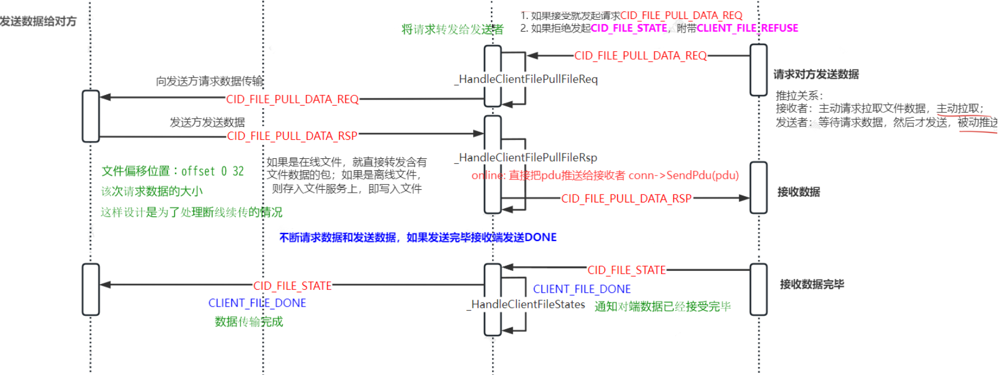

1. 如果文件传输的接受方选择了拒绝，则file_server会向发送方回应CID_FILE_STATE,附带CLIENT_FILE_REFUSE

    如果文件传输的接受方选择了接受，则file_server会向发送方发起CID_FILE_PULL_DATE_REQ请求，调用`FileClientConn::_HandleClientFilePullFileReq`进行处理，该方法中对文件传输模式进行了离线与在线的分类处理，

    - 如果是在线文件传输模式，在设置完消息序号后，直接将请求转发给文件传输发送方
    - 如果是离线文件传输模式，直接通过当前连接this发送响应消息，当传输任务完成时调用_StatesNotify函数通知文件传输状态变化

2. file_server向文件传输发送端client发送CID_FILE_PULL_DATA_REQ请求，

3. 发送方client收到请求后开始向服务端不断发送文件数据（CID_FILE_PULL_DATA_RSP）,file_server中的`FileClientConn::_HandleClientFilePullFileRsp`方法对文件发送方发送来的文件根据传输模式，进行了不同的处理，

    - 如果是在线文件传输模式，file_server就直接转发含有文件数据的包
    - 如果是离线文件传输模式，则将文件数据存入文件服务器上（写入文件）

4. 当文件数据传输完毕后，接受方向file_server发送CID_FILE_STATE

5. file_server调用_HandleClientFileStates函数处理，向数据发送方发送CLIENT_FILE_DONE响应通知发送方数据传输结束。

```protobuf
message IMFilePullDataReq{
	//cmd id:	0x0504
	required string task_id = 1;
	required uint32 user_id = 2;
	required IM.BaseDefine.TransferFileType trans_mode = 3;
	required uint32 offset = 4;
	required uint32 data_size = 5;
}
message IMFilePullDataRsp{
	//cmd id: 	0x0505
	required uint32 result_code = 1;
	required string task_id = 2;
	required uint32 user_id = 3;
	required uint32 offset = 4;
	required bytes file_data = 5;
}
```

```protobuf
message IMFileState{
	//cmd id: 	0x0503
	required IM.BaseDefine.ClientFileState state = 1;
	required string task_id = 2;
	required uint32 user_id = 3;
}
enum ClientFileState{
    CLIENT_FILE_PEER_READY  = 0x00;
    CLIENT_FILE_CANCEL      = 0x01;
    CLIENT_FILE_REFUSE      = 0x02;
    CLIENT_FILE_DONE       = 0x03;
}
```

##### FileClientConn::_HandleClientFilePullFileReq 

```cpp
/* 
  接受者发起文件接收请求 -> file_server -> 发送方
  接收端对文件接收请求的处理逻辑, 
  包括验证请求的有效性、根据不同的传输模式进行逻辑处理，
  并通过网络通信将请求转发给发送方或发送文件数据给接收方。
*/
void FileClientConn::_HandleClientFilePullFileReq(CImPdu* pdu) {
  // 1.检查是否已进行身份验证auth_ 和 是否存在该传输任务transfer_task_
  // 如果身份验证失败 或 没有该项传输任务 直接返回false
  if (!auth_ || !transfer_task_) {
    log("Recv a client_file_state, but auth is false");
    return;
  }
  
  //2.解析收到的request请求数据
  IM::File::IMFilePullDataReq pull_data_req;
  CHECK_PB_PARSE_MSG(pull_data_req.ParseFromArray(pdu->GetBodyData(), pdu->GetBodyLength()));
  uint32_t user_id = pull_data_req.user_id();//用户id
  string task_id = pull_data_req.task_id();//任务id
  uint32_t mode = pull_data_req.trans_mode();//传输模式
  uint32_t offset = pull_data_req.offset();//文件传输偏移量
  uint32_t datasize = pull_data_req.data_size();//文件数据

  log("Recv FilePullFileReq, user_id=%d, task_id=%s, file_role=%d, offset=%d, datasize=%d",
      user_id, task_id.c_str(), mode, offset, datasize);

  //3.组装response响应消息 接收端 -> file_server -> 发送端
  IM::File::IMFilePullDataRsp pull_data_rsp;
  pull_data_rsp.set_result_code(1);
  pull_data_rsp.set_task_id(task_id);
  pull_data_rsp.set_user_id(user_id);
  pull_data_rsp.set_offset(offset);
  pull_data_rsp.set_file_data("");

  // BaseTransferTask* transfer_task = NULL;
  int rv = -1;
  /*
    rv 用于表示操作的返回值 根据代码的逻辑其值可能不同
    在执行 DoPullFileRequest 函数时返回 -1 表示发生了错误 需要终止执行
    rv != 0 文件传输未完成 
    rv == 1 文件传输已完成 
    在离线传输模式下 如果 rv == 1 会调用_StatesNotify函数通知文件传输已经完成
    在在线传输模式下 不论 rv取值如何 都会通过对应的连接conn 将请求转发给发送方
  */

  do {
    //4.进行传输检查
    // 4-1 检查user_id用户是否匹配 文件传输请求的用户id 与 当前连接的用户id
    // user_id 是从IM::File::IMFilePullDataReq消息中解析出来的字段，表示文件传输请求的用户ID
    // user_id_ 是 FileClientConn 类的成员变量，表示当前连接的用户ID
    if (user_id != user_id_) {
      log("Received user_id valid, recv_user_id = %d, transfer_task.user_id = %d, user_id_ = %d",
          user_id, transfer_task_->from_user_id(), user_id_);
      break;
    }

    // 4-2 检查task_id任务是否匹配 文件传输请求中的taskId 与 当前连接的任务taskId
    // task_id 从收到的文件传输请求中解析出 是一个字符串，用于标识特定的文件传输任务
    // transfer_task_->task_id() 用于获取当前连接的传输任务的任务标识符 调用了当前连接所关联的传输任务对象
    if (transfer_task_->task_id() != task_id) {
      log("Received task_id valid, recv_task_id = %s, this_task_id = %s",
          task_id.c_str(), transfer_task_->task_id().c_str());
      break;
    }

    // 4-3 检查传输任务的目标用户id 是否与请求中的用户id匹配 如果不匹配则终止处理
    // user_id 从消息中解析出来的字段 表示文件传输请求的user_id
    // user_id 是否为 transfer_task.to_user_id
    if (!transfer_task_->CheckToUserID(user_id)) {
      log("user_id equal transfer_task.to_user_id, but user_id=%d, transfer_task.to_user_id=%d",
          user_id, transfer_task_->to_user_id());
      break;
    }

    // 5.调用传输任务的DoPullFileRequest函数处理文件拉取请求 根据传输模式的不同进行不同的逻辑处理
    // DoPullFileRequest函数 如果是在线模式则只是检测状态 如果是离线状态则该函数会将文件数据 存入pull_data_rsp中
    // 离线传输需要下载文件 在线传输从发送者拉数据
    rv = transfer_task_->DoPullFileRequest(user_id, offset, datasize, pull_data_rsp.mutable_file_data());
    if (rv == -1) break;

    pull_data_rsp.set_result_code(0);

    if (transfer_task_->GetTransMode() == FILE_TYPE_ONLINE) {
      // 4-5 在线传输模式
      // （1）设置消息序列号
      // 类型转换 将transfer_task_（BaseTransferTask* 类型）转换为（OnlineTransferTask* 类型）并赋值给 online变量
      // reinterpret_cast是 C++ 中的一种类型转换方式 它执行低级的类型转换，可以将一个指针或引用转换为不同类型的指针或引用 但是需要注意潜在的类型不匹配和未定义行为
      // 这里 transfer_task_ 是一个基类 BaseTransferTask 类型的指针, 而 OnlineTransferTask 是继承自 BaseTransferTask 的派生类。可以进行类型转换
      OnlineTransferTask* online = reinterpret_cast<OnlineTransferTask*>(transfer_task_);

      // 调用OnlineTransferTask类中的 SetSeqNum 成员函数
      // 将消息的序列号（SeqNum）设置给 OnlineTransferTask 对象，以便后续使用该序列号进行消息的处理和识别。
      online->SetSeqNum(pdu->GetSeqNum());

      // （2）文件在线传输 通过对应的连接conn 直接将请求转发给发送方
      CImConn* conn = transfer_task_->GetOpponentConn(user_id);
      if (conn) {
        conn->SendPdu(pdu);
        // SendMessageLite(conn, SID_FILE, CID_FILE_PULL_DATA_RSP,
        // pdu->GetSeqNum(), &pull_data_rsp);
      }
      // SendPdu(&pdu);
    } else {
      // 4-6 离线传输模式
      // （1）离线传输 直接通过当前连接this 发送响应消息
      SendMessageLite(this, SID_FILE, CID_FILE_PULL_DATA_RSP, pdu->GetSeqNum(), &pull_data_rsp);

      // （2）如果传输任务完成 rv == 1 则调用_StatesNotify函数通知状态变化
      if (rv == 1) _StatesNotify(CLIENT_FILE_DONE, task_id, transfer_task_->from_user_id(), this);
    }
  } while (0);

  // 5.如果传输过程中发生任何错误 则会关闭当前连接conn
  if (rv != 0) Close();
}
```

##### FileClientConn::_HandleClientFilePullFileRsp 

```cpp
// 发送者发起文件发送请求 -> file_server -> 接收方
void FileClientConn::_HandleClientFilePullFileRsp(CImPdu* pdu) {
  if (!auth_ || !transfer_task_) {
    log("auth is false");
    return;
  }

  //1.解析响应数据
  IM::File::IMFilePullDataRsp pull_data_rsp;
  CHECK_PB_PARSE_MSG(pull_data_rsp.ParseFromArray(pdu->GetBodyData(), pdu->GetBodyLength()));
  uint32_t user_id = pull_data_rsp.user_id();
  string task_id = pull_data_rsp.task_id();
  uint32_t offset = pull_data_rsp.offset();
  uint32_t data_size = static_cast<uint32_t>(pull_data_rsp.file_data().length());
  const char* data = pull_data_rsp.file_data().data();

  // log("Recv FilePullFileRsp, user_id=%d, task_id=%s, file_role=%d, offset=%d,
  // datasize=%d", user_id, task_id.c_str(), mode, offset, datasize);
  log("Recv FilePullFileRsp, task_id=%s, user_id=%u, offset=%u, data_size=%d",
      task_id.c_str(), user_id, offset, data_size);

  //2.根据传输模式对响应数据做不同的处理 发送端 -> file_server -> 接收端
  int rv = -1;
  do {
    // 2-1 检查user_id
    if (user_id != user_id_) {
      log("Received user_id valid, recv_user_id = %d, transfer_task.user_id = %d, user_id_ = %d",
          user_id, transfer_task_->from_user_id(), user_id_);
      break;
    }

    // 2-2 检查task_id
    if (transfer_task_->task_id() != task_id) {
      log("Received task_id valid, recv_task_id = %s, this_task_id = %s",
          task_id.c_str(), transfer_task_->task_id().c_str());
      // Close();
      break;
    }

    // 2-3 针对不同的传输模式 进行不同的逻辑处理方案
    //DoPullFileRequest函数 如果是在线模式则只是检测状态 如果是离线状态则该函数会将文件数据 存入pull_data_rsp中
    rv = transfer_task_->DoRecvData(user_id, offset, data, data_size);
    if (rv == -1) break;

    if (transfer_task_->GetTransMode() == FILE_TYPE_ONLINE) {
      // 2-3-1 对于在线，直接转发
      OnlineTransferTask* online = reinterpret_cast<OnlineTransferTask*>(transfer_task_);
      pdu->SetSeqNum(online->GetSeqNum());
      // online->SetSeqNum(pdu->GetSeqNum());
      CImConn* conn = transfer_task_->GetToConn();
      if (conn) conn->SendPdu(pdu);
    } else {
      // 2-3-2 对于离线文件 存入file_server
      // all packages recved
      if (rv == 1) {
        // 如果离线文件已经接受完毕 则通知接受者文件已经接受完
        _StatesNotify(CLIENT_FILE_DONE, task_id, user_id, this);
        // Close();
      } else {
        // 离线文件则file_server再次发送request请求 循环发送数据
        OfflineTransferTask* offline = reinterpret_cast<OfflineTransferTask*>(transfer_task_);
        IM::File::IMFilePullDataReq pull_data_req;
        pull_data_req.set_task_id(task_id);
        pull_data_req.set_user_id(user_id);
        pull_data_req.set_trans_mode(
            static_cast<IM::BaseDefine::TransferFileType>(
                offline->GetTransMode()));
        pull_data_req.set_offset(offline->GetNextOffset());
        pull_data_req.set_data_size(offline->GetNextSegmentBlockSize());
        ::SendMessageLite(this, SID_FILE, CID_FILE_PULL_DATA_REQ, &pull_data_req);
        // log("size not match");
      }
    }
  } while (0);

  if (rv != 0) {
    // -1，文件传输出错关闭
    //  1, 离线上传完成
    Close();
  }
}
```


#### 5.离线传输与在线传输的区别

1. 首先都需要msg_server主动去连接file_server，向file_server发送请求获取其ip地址与端口的数据包
2. 创建的离线任务与在线任务有区别：如果对端为离线状态需要将离线文件发送到file_server中进行离线文件存储
3. 相比与在线文件传输（只做了一个文件转发），离线传输不仅要将文件存储在file_server上，还要将存储的记录同时也交给db_proxy_server存入mysql数据库
4. 当离线用户上线时需要从db_proxy_server中读取是否有离线文件记录

```protobuf
message IpAddr{
	required string ip = 1;
	required uint32 port = 2;
}
```

```protobuf
message IMFileServerIPReq{
	//cmd id:			0x0717
	
}

message IMFileServerIPRsp{
	//cmd id:			0x0718
	repeated IM.BaseDefine.IpAddr ip_addr_list = 1;
}
```


