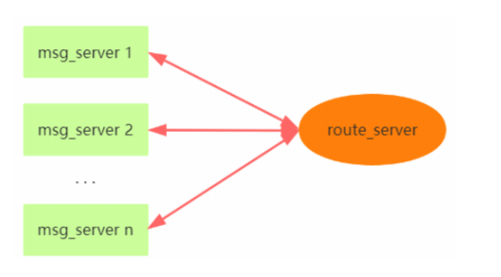
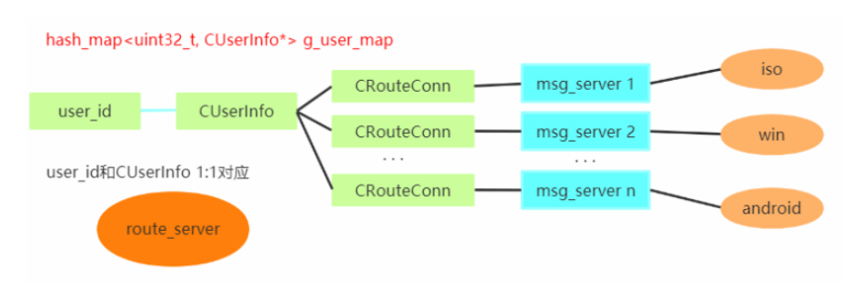
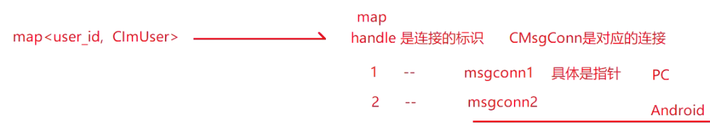

# 路由服务器与消息服务器设计
---

### 1.路由层概述

路由服务器的作用：

在TeamTalk中，`route_server` 是一个重要的服务器组件，负责处理<font color='#BAOC2F'>用户路由</font>和<font color='#BAOC2F'>消息转发</font>的功能。

1. 用户路由管理：route_server负责管理<font color='#BAOC2F'>用户之间的路由信息</font>，包括<font color='#BAOC2F'>用户的在线状态</font>、<font color='#BAOC2F'>所在的服务器地址</font>等。

    它维护了一个用户路由表，用于记录每个用户的相关信息，例如用户ID、所在的消息服务器、IP地址等。这样当其他服务器需要向某个用户发送消息时，可以通过 route_server 查询目标用户所在的服务器，以便<font color='#BAOC2F'>进行消息转发</font>。

2. 消息转发：`route_server` 作为消息的中转站，负责将消息从发送方转发到接收方所在的消息服务器。当发送方的服务器收到一条消息后，会将消息发送给 `route_server`，然后 `route_server` 根据接收方的路由信息将消息转发给目标消息服务器。目标服务器再将消息转发给目标用户进行处理。这种方式可以实现<font color='#BAOC2F'>跨服务器的消息传递</font>，使得用户可以<font color='#BAOC2F'>在不同的服务器间进行通信</font>。

3. 用户上下线管理：`route_server` <font color='#BAOC2F'>监听用户的上下线事件，并相应地更新用户路由表</font>。当用户登录时，`login_server` 将会为其分配一个消息服务器，并将该用户的路由信息添加到路由表中。当用户下线时，`route_server` 将相应的路由信息从路由表中删除。这样，其他服务器在需要与用户通信时就可以通过 `route_server` 查询到用户的状态和所在的服务器。

总结起来，`route_server` 在TeamTalk中起到了路由管理和消息转发的重要作用。它管理用户的路由信息，实现跨服务器的消息转发。

是实现分布式架构和支持大规模用户同时在线的关键组件之一。

user_id – user - connection – 多终端 之间的关联





- 一个user_id可能有同时登陆不同的msg_server

```cpp
/* route_server > UserInfo.h */
class CUserInfo {
 public:
  CUserInfo();
  ~CUserInfo();

  uint32_t GetStatus();

  void AddRouteConn(CRouteConn* pConn) { m_RouteConnSet.insert(pConn); }
  void RemoveRouteConn(CRouteConn* pConn) { m_RouteConnSet.erase(pConn); }
  void ClearRouteConn() { m_RouteConnSet.clear(); }
  set<CRouteConn*>* GetRouteConn() { return &m_RouteConnSet; }
  bool FindRouteConn(CRouteConn* pConn);

  uint32_t GetRouteConnCount() { return m_RouteConnSet.size(); }
  void AddClientType(uint32_t client_type);
  void RemoveClientType(uint32_t client_type);
  uint32_t GetCountByClientType(uint32_t client_type);
  bool IsMsgConnNULL();
  void ClearClientType();

  bool IsPCClientLogin();
  bool IsMobileClientLogin();

 private:
  set<CRouteConn*> m_RouteConnSet;//对应msg_server的连接
  //1个user_id可能有同时登陆不同的msg_server
  map<uint32_t /* client_type */, uint32_t /* count */> m_ClientTypeList;
};
```

- 一个用户可能有多个连接，比如PC/Android同时在线则有2个连接，连接与登录类型的表示方法：

```cpp
/* msg_server > ImUser.h */
class CImUser {
 public:
  CImUser(string user_name);
  ~CImUser();

  void SetUserId(uint32_t user_id) { m_user_id = user_id; }
  uint32_t GetUserId() { return m_user_id; }
  string GetLoginName() { return m_login_name; }
  void SetNickName(string nick_name) { m_nick_name = nick_name; }
  string GetNickName() { return m_nick_name; }
  bool IsValidate() { return m_bValidate; }
  void SetValidated() { m_bValidate = true; }
  uint32_t GetPCLoginStatus() { return m_pc_login_status; }
  void SetPCLoginStatus(uint32_t pc_login_status) { m_pc_login_status = pc_login_status; }

  user_conn_t GetUserConn();

  bool IsMsgConnEmpty() { return m_conn_map.empty(); }
  void AddMsgConn(uint32_t handle, CMsgConn* pMsgConn) { m_conn_map[handle] = pMsgConn; }
  void DelMsgConn(uint32_t handle) { m_conn_map.erase(handle); }
  CMsgConn* GetMsgConn(uint32_t handle);
  void ValidateMsgConn(uint32_t handle, CMsgConn* pMsgConn);

  void AddUnValidateMsgConn(CMsgConn* pMsgConn) { m_unvalidate_conn_set.insert(pMsgConn); }
  void DelUnValidateMsgConn(CMsgConn* pMsgConn) { m_unvalidate_conn_set.erase(pMsgConn); }
  CMsgConn* GetUnValidateMsgConn(uint32_t handle);

  map<uint32_t, CMsgConn*>& GetMsgConnMap() { return m_conn_map; }

  void BroadcastPdu(CImPdu* pPdu, CMsgConn* pFromConn = NULL);
  void BroadcastPduWithOutMobile(CImPdu* pPdu, CMsgConn* pFromConn = NULL);
  void BroadcastPduToMobile(CImPdu* pPdu, CMsgConn* pFromConn = NULL);
  void BroadcastClientMsgData(CImPdu* pPdu, uint32_t msg_id, CMsgConn* pFromConn = NULL, uint32_t from_id = 0);
  void BroadcastData(void* buff, uint32_t len, CMsgConn* pFromConn = NULL);

  void HandleKickUser(CMsgConn* pConn, uint32_t reason);

  bool KickOutSameClientType(uint32_t client_type, uint32_t reason, CMsgConn* pFromConn = NULL);

  uint32_t GetClientTypeFlag();

 private:
  uint32_t m_user_id;
  string m_login_name; /* 登录名 */
  string m_nick_name;  /* 花名 */
  bool m_user_updated;
  uint32_t m_pc_login_status;  // pc client login状态，1: on 0: off

  bool m_bValidate;

  map<uint32_t /* handle */, CMsgConn*> m_conn_map;
  set<CMsgConn*> m_unvalidate_conn_set;
};
```



### 2.路由层本质

<mark>特征1</mark>：route_server实际上就是⼀台<font color='#BAOC2F'>消息转发服务器</font>，

1. 客户端消息发送到msg_server，msg_server判断接收者是否在本地，
    - 是的话，直接转发给⽬标客户端。
    - 否的话，转发给route_server，
2. route_server接收到msg_server的消息后，获取to_id所在的msg_server，将消息转发给msg_server，msg_server再将消息转发给⽬标接收者。

<mark>特征2</mark>：route_server只和msg_server进⾏通信

1. route_server 在整个tt中的作⽤是⼀个消息转发的地⽅，其<font color='#BAOC2F'>在内存中维护了全局⽤户信息</font>。当有多个msg_server的时候，route_server的作⽤就是在多个msg_server之间中转消息。
2. g_user_map是⼀个hash_map，保存了<font color='#BAOC2F'>全局⽤户信息</font>，当有⽤户上线的时候，msg_server会将该⽤户的状态发送到route_server，route_server就会在g_user_map⾥⾯插⼊⼀条记录。

<mark>特征3</mark>：关于g_user_map的理解

- 初次连接route_server把所有的⽤户登录情况发送给route_server，msg_server启动的时候尝试连接 route_server，

```cpp
/* route_server > UserInfo.h */
class CUserInfo {
 public:
  CUserInfo();
  ~CUserInfo();

  uint32_t GetStatus();

  void AddRouteConn(CRouteConn* pConn) { m_RouteConnSet.insert(pConn); }
  void RemoveRouteConn(CRouteConn* pConn) { m_RouteConnSet.erase(pConn); }
  void ClearRouteConn() { m_RouteConnSet.clear(); }
  set<CRouteConn*>* GetRouteConn() { return &m_RouteConnSet; }
  bool FindRouteConn(CRouteConn* pConn);

  uint32_t GetRouteConnCount() { return m_RouteConnSet.size(); }
  void AddClientType(uint32_t client_type);
  void RemoveClientType(uint32_t client_type);
  uint32_t GetCountByClientType(uint32_t client_type);
  bool IsMsgConnNULL();
  void ClearClientType();

  bool IsPCClientLogin();
  bool IsMobileClientLogin();

 private:
  set<CRouteConn*> m_RouteConnSet;//对应msg_server的连接
  //1个user_id可能有同时登陆不同的msg_server
  map<uint32_t /* client_type */, uint32_t /* count */> m_ClientTypeList;
};
```

当存在多端登录时，不同的客户端可能登录在不同的msg_server（对于route_server来说，体现为不同的CRouteConn连接），

所以set记录对应所有的msg_server连接，


### 3.路由层处理的命令

#### 1.心跳保持

CID_OTHER_HEARTBEAT

 route_server会更新m_last_recv_tick，如果⼀直没有发送⼼跳包则在OnTimer函数会检测到⻓时间没有收到对应msg_server的⼼跳包

进⽽将msg_server的连接关闭掉。

#### 2.向msg_server报告当前所有在线⽤户信息

CID_OTHER_ONLINE_USER_INFO

每个⽤户的信息包括：user_id（⽤户ID），status（⽤户状态），client_type（客户端类型）。

⽬的是当msg_server和route_server断开的时候，msg_server是可能有⽤户登录或者下线的，所以⼀旦连上route_server需要及时更新。

#### 3.报告个人用户状态信息

CID_OTHER_USER_STATUS_UPDATE

上线、离开、下线上报状态

#### 4.更新master msg_server

CID_OTHER_ROLE_SET 

#### 5.批量查询⽤户当前状态

CID_BUDDY_LIST_USERS_STATUS_REQUEST，

批量查询⽤户当前状态，查询到状态后回发给，msg_server（CID_BUDDY_LIST_USERS_STATUS_RESPONSE），在客户端批量查询⽤户状态时使⽤。

#### 6.消息广播转发

1. CID_MSG_DATA 原装⼴播，但不发给⾃⼰所在的msg_server
2. CID_SWITCH_P2P_CMD 原装⼴播，但不发给⾃⼰所在的msg_server
3. CID_MSG_READ_NOTIFY 原装⼴播，但不发给⾃⼰所在的msg_server
4. CID_OTHER_SERVER_KICK_USER 原装⼴播，但不发给⾃⼰所在的msg_server
5. CID_GROUP_CHANGE_MEMBER_NOTIFY 原装⼴播，但不发给⾃⼰所在的msg_server
6. CID_FILE_NOTIFY 原装⼴播，但不发给⾃⼰所在的msg_server
7. CID_BUDDY_LIST_REMOVE_SESSION_NOTIFY 原装⼴播，但不发给⾃⼰所在的msg_server
8. CID_BUDDY_LIST_SIGN_INFO_CHANGED_NOTIFY 原装⼴播给所有的msg_server


### 4.路由层业务详解

#### 获取当前所有在线⽤户信息

CID_OTHER_ONLINE_USER_INFO

发送的状态ServerUserStat，获取其他在线用户用户信息，主要用户信息包括：

- user_id：⽤户id
- status：状态包括：ONLINE、OFFLINE和LEAVE
- client_type：客户端类型包括：WINDOWS、MAC、IOS、ANDROID

具体流程：

1. CRouteServConn::OnConfirm：（msg_server模块），以CID_OTHER_ONLINE_USER_INFO命令发送到route_server模块

2. CRouteConn::\_HandleOnlineUserInfo：（route_server模块），然后调⽤\_UpdateUserStatus更新⽤户信息情况

3. _UpdateUserStatus的基本流程：

4. ⽤户已经在route_server

    - 对应的msg_server已经在route_server
        - USER_STATUS_OFFLINE⽤户下线，RemoveClientType()：计数-1，当计数为0时则将其删除。
        - 当IsMsgConnNULL和GetRouteConnCount为true时说明该user_id已经下线，route_server不再维护user信息，将其从route_server删除掉g_user_map.erase(user_id)。
        - ⾮OFFLINE情形，AddClientType()：将client_type加⼊到m_ClientTypeList列表，如果已经加⼊到m_ClientTypeList则计数+1。

    - 对应的msg_server不在route_server
        - 先将msg_server连接route_server对应的CRouteConn连接调⽤AddRouteConn()加⼊到m_RouteConnSet。
        - 调⽤AddClientType()将客户端client_type加⼊到m_ClientTypeList。

5. ⽤户不在route_server，这种情况⽀持需要处理⾮OFFLINE状态即可。

    - 创建new CUserInfo()，调⽤AddRouteConn()绑定对应的CRouteConn连接，以及调⽤AddClientType()加⼊client_type
    - 重点的是：RemoveClientType count计数器的问题。

#### 更新当前用户状态信息

CID_OTHER_USER_STATUS_UPDATE

发送更新用户状态请求，

发送的状态IMUserStatusUpdate（在IM.Server.proto进⾏描述）包括：

```cpp
user_status
user_id
client_type
```

对应上线下线通知这块，我们先关注PC端的先，如果⾃⼰真的去开发了即时通讯软件，则观察qq是怎么做的重新调整逻辑（对于teamtalk⽽⾔，主要是给内部开发的，所以通讯录⾥的所有⼈都认为是好友，上线下线都通知到每⼀个⼈）。

msg_server登录登出时报告route_server使⽤命令CID_OTHER_USER_STATUS_UPDATE

- CMsgConn::SendUserStatusUpdate：（msg_server模块）上线下线时通知route_server，
- CRouteConn::\_HandleUserStatusUpdate：（route_server模块）响应CID_OTHER_USER_STATUS_UPDATE命令，然后调⽤CRouteConn::\_HandleUserStatusUpdate <mark>CRouteConn::_HandleUserStatusUpdate重点</mark>：
    - user_id已经在route_server，使⽤CID_OTHER_LOGIN_STATUS_NOTIFY命令
        - 如果是下线OFFLINE通知，且下线为PC端并且没有其他PC端存在则⼴播给所有的msg_server
        - 如果是上线通知，则只要有PC端登录都⼴播给所有的msg_server

    - 如果更新的是PC端状态，则调⽤CID_BUDDY_LIST_STATUS_NOTIFY进⾏通知
        - CRouteServConn::_HandleStatusNotify （msg_server）进⾏响应，最终调⽤CImUser::BroadcastPduWithOutMobile（只通知PC端的⽤户）进⾏发送通知，不分是否是好友。


#### 查询用户列表在线状态

CID_BUDDY_LIST_USERS_STATUS_REQUEST

使⽤场景：

- 客户端请求查询⽤户列表的状态
- 推送消息时先查询⽤户是否在线

当要进⾏消息推送时，如果本msg_server找不到对应的user_id，则到route_server进⾏查询。

- CDBServConn::_HandleGetDeviceTokenResponse ：(msg_server模块)，使⽤CID_BUDDY_LIST_USERS_STATUS_REQUEST命令；
- CRouteConn::_HandleUsersStatusRequest：(route_server模块)，进⾏响应，然后使⽤CID_BUDDY_LIST_USERS_STATUS_RESPONSE进⾏回复。
- CRouteServConn::_HandleUsersStatusResponse：(msg_server模块)，响应CID_BUDDY_LIST_USERS_STATUS_RESPONSE，符合条件的进⾏push（这⾥包括消息推送和⽂件发送推送）


