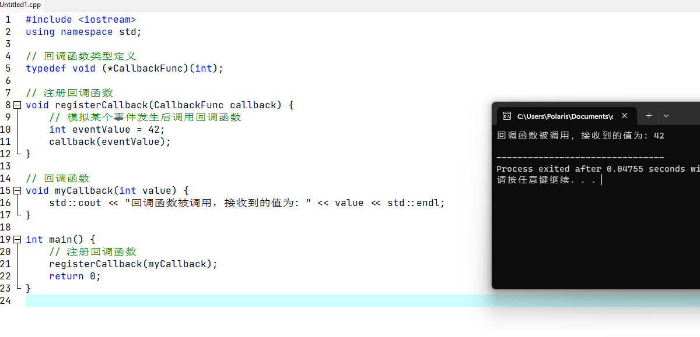

# 涉及的基本问题
---

### 1.是否为抽象类判定？

在C++中，可以通过以下方式判断一个类是否为抽象类：

抽象类特征：抽象类通常<font color='#BAOC2F'>包含纯虚函数</font>（Pure Virtual Function），即在类的声明中使用 "= 0" 进行标记的虚函数。纯虚函数是<font color='#BAOC2F'>没有实际实现的函数</font>，派生类必须实现这些函数才能被实例化。

1. 虚函数判断：抽象类中至少包含一个纯虚函数，因此可以通过检查类中<font color='#BAOC2F'>是否存在纯虚函数</font>来判断该类是否为抽象类。

2. 类型信息查询：使用 C++ 的类型信息查询工具 `typeid` 和 `std::type_info` 可以判断一个类是否为抽象类。具体代码如下：

    ```cpp
    #include <iostream>
    #include <typeinfo>
    
    class MyBaseClass {
    public:
        virtual void pureVirtualFunction() = 0;
    };
    
    bool isAbstractClass() {
        return typeid(MyBaseClass) == typeid(MyBaseClass);
    }
    
    int main() {
        std::cout << "Is MyBaseClass an abstract class? " << std::boolalpha << isAbstractClass() << std::endl;
        return 0;
    }
    ```

3. 析构函数为虚函数：抽象类通常将析构函数声明为虚函数，以便在通过基类指针删除对象时能够正确调用派生类的析构函数。

> 补充：`virtual void Trace(const char* loginfo) {}`与`virtual void Trace(const char* loginfo) = 0;`是等价是吗?
>
> 1. 答：不是等价的
> 2. 声明 `virtual void Trace(const char* loginfo) {}` 声明了一个<font color='#BAOC2F'>带有空实现的虚函数</font>。这意味着<font color='#BAOC2F'>该函数在基类中有一个默认实现</font>，但<font color='#BAOC2F'>可以在派生类中进行重写</font>。
> 3. 声明 `virtual void Trace(const char* loginfo) = 0;` 声明了一个纯虚函数。这意味着<font color='#BAOC2F'>该函数在基类中被声明但没有实现</font>。它充当了一个必须在派生类中重写的占位符。包含纯虚函数的类被称为抽象类，它们不能直接实例化。
> 4. 总结：第一个声明为函数提供了默认实现，而第二个声明要求派生类提供自己的实现。


### 2.虚基类与抽象类的区别？

虚基类（Virtual Base Class）和抽象类（Abstract Class）是两个不同的概念，它们在面向对象编程中有不同的作用和特点：

抽象类：

1. 抽象类是一种特殊的类，它<font color='#BAOC2F'>不能被实例化，只能被继承</font>。
2. 抽象类用于<font color='#BAOC2F'>定义一组相关的对象的通用行为和特征</font>，它包含纯虚函数（没有实现的虚函数）。
3. 抽象类中的至少一个纯虚函数要求子类必须实现它们，从而使得子类变为具体的类。
4. 如果一个类继承了抽象类但没有实现其纯虚函数，那么该子类也会成为抽象类，不能被实例化。
5. 抽象类常常被用作接口或基类，提供一种规范或协议供其他类去继承和实现。

虚基类：

1. 虚基类是在多重继承中使用的一种特殊类型的基类。它用于解决多重继承中的问题，特别是针对由多个派生类共享同一个基类的情况，当一个类通过多条路径继承自同一个基类时，可能会导致基类在派生类中存在多个实例。
2. 使用虚基类的关键是在派生类的定义中使用关键字 "virtual" 来声明基类。这样，当派生类被实例化时，虚基类的实例仅存在于最终的派生类中，并被共享。这样就确保了在继承关系中只保留一个基类实例，避免了数据冗余和访问二义性的问题。
3. 虚基类在继承关系中起到标记的作用，用于指定在继承链中只保留一个基类实例的方式。它在多重继承的场景中非常有用，特别是当多个派生类共享同一个基类时，通过使用虚基类可以简化继承结构并消除潜在的问题。
4. 虚基类用于指定在继承链中只保留一个基类实例的方式，它可以通过虚继承来实现。
5. <font color='#BAOC2F'>虚基类本身可以是普通的类或抽象类，不一定是抽象类</font>。
6. 虚基类的主要作用是控制继承关系中的共享和冗余，以确保正确的继承语义和数据访问。

总结：

- 虚基类是为了解决多重继承中的冗余和二义性问题，通过虚继承来确保在继承链中只保留一个基类实例。虚基类可以是普通的类，
-  抽象类是一种不能被实例化的类，它用于定义通用的行为和特征，并要求子类实现其中的纯虚函数。而抽象类则常常被用作接口或基类，提供一种规范供其他类去继承和实现。


### 3.为什么要设计CRefObject类?

在base目录下util.h文件中设计的`CRefObject` 类是为了实现引用计数机制，用于<font color='#BAOC2F'>管理对象的生命周期和资源释放</font>。

引用计数是一种常见的内存管理技术，通过在对象中维护一个计数器，记录当前有多少个指针引用了该对象，从而在合适的时机进行对象的释放。

引用计数机制的优点包括：

1. 自动内存管理：通过引用计数，对象的创建和销毁可以自动进行，减轻了手动管理内存的负担。当没有任何指针引用该对象时，引用计数为0，可以安全地释放对象占用的内存。
2. 避免悬挂指针：引用计数机制可以防止悬挂指针的问题，即当一个指针引用了一个已经被销毁的对象时，可以通过引用计数进行判断，在对象销毁时将所有引用指针置为无效，避免了访问无效对象的问题。
3. 支持共享所有权：多个指针可以共享同一个对象的所有权，通过增加和减少引用计数来管理对象的生命周期。这样可以实现对象在多个地方被引用和共享，而无需手动跟踪和协调对象的创建和销毁。

`CRefObject` 类作为基类，提供了引用计数的基本功能，包括引用计数的增加、减少和获取当前引用计数的方法。其他的类可以继承 `CRefObject` 类，从而获得引用计数功能，并在需要时覆写 `ReleaseRef` 方法来自定义对象释放的逻辑。

通过引用计数机制，可以简化对象的管理和释放，提高代码的可维护性和健壮性，同时避免了常见的内存管理问题。

### 4.什么是阻塞模式与非阻塞模式？他们之间的区别？

阻塞模式（Blocking Mode）和非阻塞模式（Non-blocking Mode）是在进行 I/O 操作时的两种不同工作方式：

==阻塞模式==：

1. 在阻塞模式下，当进行 I/O 操作时，调用的函数会一直阻塞（即暂停执行），直到操作完成或出现错误。
2. 在进行阻塞式 I/O 操作时，程序会一直等待，直到能够读取所需的数据或写入数据成功，期间无法执行其他任务。
3. 阻塞模式适用于程序中单一任务或单一连接的情况，简单易用，但可能导致程序在等待 I/O 完成时出现延迟。

==非阻塞模式==：

1. 在非阻塞模式下，进行 I/O 操作时，调用的函数会立即返回，无论操作是否完成或出现错误。
2. 在进行非阻塞式 I/O 操作时，程序可以继续执行其他任务，而不必等待操作的完成。
3. 非阻塞模式通常<font color='#BAOC2F'>需要使用循环轮询的方式来检查操作的状态</font>，以确定是否已完成，从而进行后续处理。
4. 非阻塞模式适用于需要同时处理多个任务或连接的情况，可以提高程序的并发性和响应性，<font color='#BAOC2F'>但需要更复杂的编程逻辑来处理轮询和状态管理</font>。

==两者之间的区别==：

1. 阻塞模式会导致程序在进行 I/O 操作时被阻塞，无法执行其他任务，而非阻塞模式可以让程序在等待 I/O 完成时继续执行其他任务。
2. 阻塞模式在进行 I/O 操作时会一直等待，直到操作完成或出现错误，而非阻塞模式在进行 I/O 操作时会立即返回。
3. 阻塞模式的编程模型相对简单，但可能导致程序在等待 I/O 完成时出现延迟，而非阻塞模式的编程模型更复杂，需要额外的轮询和状态管理。
4. 非阻塞模式适用于需要处理多个任务或连接的情况，提供更高的并发性和响应性，而阻塞模式适用于简单的单一任务或连接。

需要注意的是，阻塞模式和非阻塞模式适用于不同的应用场景，选择适合自己需求的模式可以提高程序的性能和可扩展性。

### 5.为什么要将套接字设置为非阻塞模式？

将套接字设置为非阻塞模式有以下几个主要原因：

1. 非阻塞模式<font color='#BAOC2F'>可以实现异步操作</font>：在非阻塞模式下，套接字的 I/O 操作（如读取和写入数据）不会阻塞当前线程或进程，而是立即返回。这样可以允许程序在进行网络操作的同时继续执行其他任务，提高程序的并发性和响应性。相比于阻塞模式，非阻塞模式更适合需要处理多个连接或并发操作的网络应用程序。
2. 超时控制：通过将套接字设置为非阻塞模式，可以使用定时器或其他机制来控制操作的超时时间。如果在指定的超时时间内无法完成 I/O 操作，可以及时中断操作或采取其他处理措施，避免长时间的阻塞等待。
3. 处理多个连接：在服务器应用程序中，需要同时处理多个客户端连接。将套接字设置为非阻塞模式可以使服务器能够高效地处理多个连接，而无需为每个连接创建一个线程或进程来处理阻塞式 I/O。

总而言之，将套接字<font color='#BAOC2F'>设置为非阻塞模式可以提高程序的并发性、响应性和可控性，使网络应用程序更加高效和灵活</font>。


### 6.简单介绍一些epoll、poll、select？

epoll、poll和select都是用于实现I/O多路复用的机制，可以在一个线程中同时监视多个I/O事件

1. `select`：是最古老的I/O多路复用机制，在各个操作系统上都有实现。
    - 它使用fd_set数据结构来存储要监视的文件描述符集合，通过调用`select`函数来阻塞等待事件发生，并返回就绪的文件描述符集合。然后可以遍历就绪的文件描述符集合进行相应的操作。
    - `select`的缺点是文件描述符集合有一定的限制，通常是1024个，并且每次调用`select`都需要将文件描述符集合从用户态传递到内核态。
2. `poll`：是对`select`的改进，也是用于I/O多路复用的机制。
    - 它使用`pollfd`结构体数组来存储要监视的文件描述符和事件，通过调用`poll`函数来等待事件发生，并返回就绪的文件描述符集合。
    - `poll`没有像`select`那样有文件描述符数量的限制，但仍然需要将文件描述符数组从用户态传递到内核态。
3. `epoll`：是Linux特有的I/O多路复用机制，用于解决`select`和`poll`的性能问题。
    - 它使用一个事件表来存储要监视的文件描述符和事件，通过调用`epoll_create`创建一个epoll实例，并使用`epoll_ctl`向实例中添加、修改或删除文件描述符和事件，然后通过调用`epoll_wait`等待事件发生并返回就绪的文件描述符集合。
    - `epoll`采用了事件驱动的方式，只需要在初始化时将文件描述符添加到事件表中，不需要每次调用等待函数时都传递文件描述符集合，从而提高了性能。
    - 另外`epoll`还支持边缘触发（ET）和水平触发（LT）两种模式，可以更加灵活地处理事件。

总的来说，`epoll`是性能最好的I/O多路复用机制，在Linux平台上使用较为广泛。

而`poll`和`select`在某些情况下仍然有一定的用途，特别是在需要兼容不同操作系统或需要使用更简单的接口的情况下。


### 7.添加定时器有什么作用呢？


### 8.有关于事件回调机制？

#### 事件回调编程模式

当涉及到编程和软件开发时，<font color='#BAOC2F'>事件回调</font>是一种常见的编程模式。它<font color='#BAOC2F'>用于处理异步事件和消息传递系统中的事件通知</font>。

事件回调的基本概念是，在某个特定事件发生时，系统会调用预先定义好的函数（即回调函数）来处理该事件。<font color='#BAOC2F'>回调函数通常作为参数传递给触发事件的函数</font>或者<font color='#BAOC2F'>注册到事件处理器中</font>。

下面是事件回调的一般工作流程：

1. 注册回调函数：在需要监听特定事件的地方，开发者将一个函数注册为事件的回调函数。这通常是通过将<font color='#BAOC2F'>函数指针</font>或<font color='#BAOC2F'>函数引用</font>作为参数<font color='#BAOC2F'>传递给一个注册函数</font>或<font color='#BAOC2F'>设置一个特定属性</font>来实现的。
2. 触发事件：当某个事件发生时（比如按钮被点击、数据加载完成等），相应的代码或系统将触发该事件。
3. 调用回调函数：一旦事件被触发，系统将调用事先注册的回调函数，并<font color='#BAOC2F'>将事件的相关数据作为参数</font>传递给回调函数。
4. 执行回调函数：回调函数将被执行，它会处理接收到的事件数据，并执行相应的逻辑、操作或者回馈。

通过使用事件回调，开发者可以实现<font color='#BAOC2F'>异步编程模型</font>，允许<font color='#BAOC2F'>程序在事件发生时采取相应的动作，而不必等待事件的完成</font>。这对于<font color='#BAOC2F'>处理大量的并发任务</font>或<font color='#BAOC2F'>需要响应用户交互的应用程序</font>非常有用。

#### C++中的事件回调实现方式

在C++中，回调函数通常通过<font color='#BAOC2F'>函数指针</font>或<font color='#BAOC2F'>函数对象</font>来实现。以下是两种常见的回调函数实现方式：回调函数有两种实现方式，函数指针回调与函数对象回调，

通过函数指针或函数对象实现回调函数时，可以根据需要传递参数，并在回调函数中执行相应的逻辑。

这种方式允许C++开发者<font color='#BAOC2F'>将函数作为参数传递</font>，并<font color='#BAOC2F'>在运行时动态确定调用哪个函数</font>，从而实现灵活的回调机制。

##### 函数指针回调

1. 定义函数指针：首先，定义一个函数指针类型，该类型与回调函数具有<font color='#BAOC2F'>相同的签名</font>（参数列表和返回类型）
2. 注册回调函数：在需要<font color='#BAOC2F'>注册回调函数的地方</font>，将回调函数的<font color='#BAOC2F'>指针</font>传递给<font color='#BAOC2F'>接收回调函数指针的函数或对象</font>，以完成注册。
3. 调用回调函数：当特定事件发生时，调用注册的回调函数指针，传递所需的参数。

```cpp
// 1.定义回调函数指针类型
typedef void (*CallbackFunc)(int);

// 2.注册回调函数
void registerCallback(CallbackFunc callback) {
    // ...
}

// 回调函数
void myCallback(int value) {
    // 处理回调逻辑
}

int main() {
    // 注册回调函数
    registerCallback(myCallback);

    // 3.触发事件并调用回调函数
    // ...
}
```


##### 函数对象回调

1. 定义函数对象：创建一个函数对象类，其中包含一个重载的函数调用运算符（`operator()`），以便可以像调用函数一样调用该对象。
2. 注册回调函数：在需要注册回调函数的地方，将函数对象实例传递给接收回调函数对象的函数或对象。
3. 调用回调函数：当特定事件发生时，调用注册的函数对象，传递所需的参数。

```cpp
// 1.定义回调函数对象类
class MyCallback {
public:
    void operator()(int value) {
        // 处理回调逻辑
    }
};

// 2.注册回调函数对象
void registerCallback(const MyCallback& callback) {
    // ...
}

int main() {
    // 创建回调函数对象实例
    MyCallback myCallback;

    // 注册回调函数对象
    registerCallback(myCallback);

    // 3.触发事件并调用回调函数对象
    // ...
}
```

#### 实际案例

使用C++编写回调函数时，一种常见的场景是使用函数指针作为回调机制。以下是一个简单的示例程序，演示了如何使用函数指针实现回调：

```cpp
#include <iostream>

// 回调函数类型定义
typedef void (*CallbackFunc)(int);

// 注册回调函数
void registerCallback(CallbackFunc callback) {
    // 模拟某个事件发生后调用回调函数
    int eventValue = 42;
    callback(eventValue);
}

// 回调函数
void myCallback(int value) {
    std::cout << "回调函数被调用，接收到的值为: " << value << std::endl;
}

int main() {
    // 注册回调函数
    registerCallback(myCallback);
    return 0;
}
```

1. 在这个示例中，首先定义了回调函数类型`CallbackFunc`，它是一个指向返回类型为`void`、参数为`int`的函数指针。
2. 然后，我们实现了`registerCallback`函数，它接受一个回调函数指针作为参数，并模拟某个事件的发生。在`registerCallback`函数内部，我们使用一个假设的事件值调用回调函数指针。
3. 在`main`函数中，我们定义了名为`myCallback`的回调函数，它接收一个`int`类型的值，并在控制台上打印该值。
4. 然后，我们调用`registerCallback`函数，将`myCallback`函数的指针作为参数传递进去。当事件发生时，`registerCallback`函数内部会调用回调函数指针，触发`myCallback`函数的执行。




